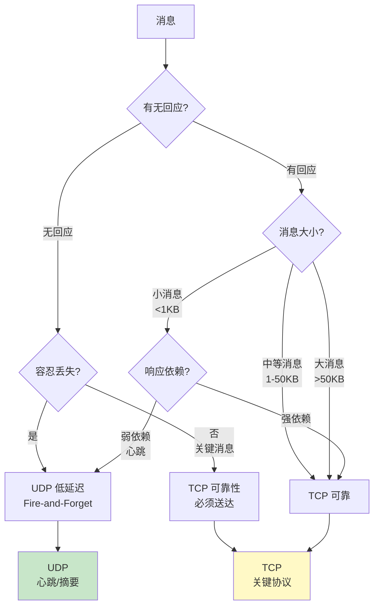
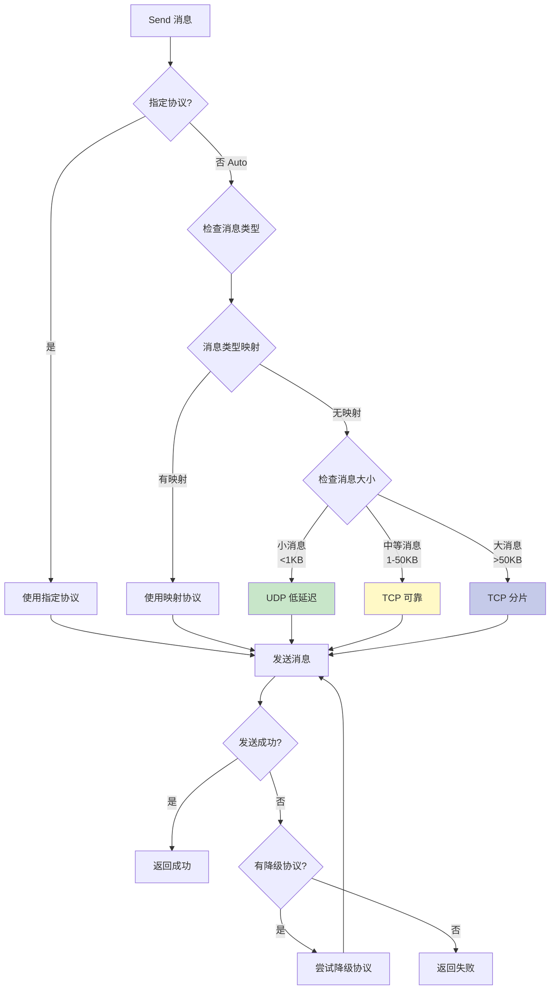

# Dual Transport (TCP + UDP) 混合传输方案

> **文档类型**: 💡 技术建议 (Proposals)
> **创建日期**: 2026-01-22
> **状态**: 📋 待讨论
> **优先级**: P0 (高优先级 - 基础架构)
> **主题**: TCP + UDP 混合传输层设计

---

## 📌 背景说明

当前 NexKV 项目已实现 **TCP Transport** (100%) 和 **UDP Transport** (80%)，但两者各自独立，没有统一的调度机制。

### 现状分析

| Transport | 状态 | 特性 | 适用场景 |
|-----------|------|------|---------|
| **TCP** | ✅ 100% | 连接池、可靠传输、Keep-Alive | 点对点、可靠性优先 |
| **UDP** | 🔄 80% | 分片重组、最大 100MB、广播 | 低延迟、大消息、多播 |

### 核心问题

1. **缺少统一调度**：上层协议（Gossip/Quorum/2PC）需要手动选择 Transport
2. **未充分利用优势**：TCP 的可靠性和 UDP 的低延迟没有结合使用
3. **配置复杂**：需要同时维护 TCP 和 UDP 两套配置

---

## 🎯 设计目标

### 核心原则

| 原则 | 说明 | 优先级 |
|------|------|--------|
| **自动路由** | 根据消息类型自动选择最优传输协议 | P0 |
| **性能优化** | TCP 用于可靠传输，UDP 用于低延迟广播 | P0 |
| **透明接入** | 上层协议无需关心底层 Transport 选择 | P1 |
| **配置简化** | 单一配置入口，内部管理 TCP + UDP | P1 |
| **平滑降级** | UDP 失败时自动降级到 TCP | P2 |

---

## 📊 消息类型分析

### 维度 1: 有回应 vs 无回应

**核心原则**: 有回应的消息更依赖可靠性，无回应的消息可以容忍丢失

#### 无回应消息 (Fire-and-Forget)

| 消息类型 | 大小 | 频率 | 丢失容忍度 | **推荐协议** |
|---------|------|------|-----------|------------|
| **NodePing** | ~50B | 1/s | ✅ 高（下次心跳补偿） | **UDP** |
| **NodePong** | ~50B | 1/s | ✅ 高（下次心跳补偿） | **UDP** |
| **GossipDigest** | ~1KB | 10s | ✅ 中（下一轮补偿） | **UDP** |
| **2PCCommit** | ~500B | 低 | ❌ 极低（不可丢失） | **TCP** |
| **2PCRollback** | ~500B | 低 | ❌ 极低（不可丢失） | **TCP** |
| **QuorumDecide** | ~500B | 低 | ❌ 极低（不可丢失） | **TCP** |
| **LeaderElection** | ~2KB | 极低 | ❌ 低（需要确认） | **TCP** |

**特征**: 发送后不等待响应，定期发送
**策略**: 优先 UDP（低延迟），关键消息用 TCP

#### 有回应消息 (Request-Reply)

| 消息对 | 大小 | 频率 | 响应依赖 | **推荐协议** |
|-------|------|------|---------|------------|
| **Get → GetReply** | ~1KB | 中 | ✅ 强依赖 | **TCP** |
| **Put → PutReply** | ~10KB | 中 | ✅ 强依赖 | **TCP** |
| **Delete → DeleteReply** | ~500B | 低 | ✅ 强依赖 | **TCP** |
| **GossipSync → GossipSyncReply** | ~100KB | 10s | ✅ 强依赖 | **TCP** |
| **GossipDigest → GossipDigestReply** | ~1KB | 10s | ✅ 强依赖 | **UDP**（小消息） |
| **QuorumPropose → QuorumVote** | ~1KB | 低 | ✅ 强依赖 | **TCP** |
| **2PCPrepare → 2PCPrepareReply** | ~5KB | 低 | ✅ 强依赖 | **TCP** |
| **2PCCommit → 2PCCommitReply** | ~500B | 低 | ✅ 强依赖 | **TCP** |
| **2PCRollback → 2PCRollbackReply** | ~500B | 低 | ✅ 强依赖 | **TCP** |
| **NodeJoin → 确认** | ~1KB | 极低 | ✅ 强依赖 | **TCP** |
| **ClockSync → ClockSyncReply** | ~50B | 1/s | ⚠️ 弱依赖（容忍丢失） | **UDP** |
| **ClusterStatus → ClusterStatusReply** | ~10KB | 低 | ✅ 强依赖 | **TCP** |

**特征**: 请求-响应模式，请求丢失导致超时重试
**策略**: 优先 TCP（保证投递），心跳类可用 UDP

---

### 维度 2: 消息大小与频率

| 消息类型 | 典型大小 | 频率 | 可靠性要求 | 延迟要求 | **推荐协议** |
|---------|---------|------|-----------|---------|------------|
| **NodePing/NodePong** | ~50B | 极高 (1/s) | 低 | 极低 (<10ms) | **UDP** |
| **GossipDigest** | ~1KB | 高 (10s) | 低 | 低 (<100ms) | **UDP** |
| **GossipSync** | ~100KB | 中 (10s) | 中 | 中 (<500ms) | **TCP** |
| **GossipSyncReply** | ~100KB | 中 | 中 | 中 | **TCP** |
| **QuorumPropose** | ~1KB | 低 | **极高** | 低 (<100ms) | **TCP** |
| **QuorumVote** | ~200B | 低 | **极高** | 低 (<100ms) | **TCP** |
| **QuorumDecide** | ~500B | 低 | **极高** | 低 (<100ms) | **TCP** |
| **2PCPrepare** | ~5KB | 低 | **极高** | 中 (<200ms) | **TCP** |
| **2PCCommit** | ~500B | 低 | **极高** | 极低 (<50ms) | **TCP** |
| **2PCRollback** | ~500B | 低 | **极高** | 极低 (<50ms) | **TCP** |
| **NodeJoin** | ~1KB | 极低 | 高 | 低 | **TCP** |
| **NodeLeave** | ~500B | 极低 | 高 | 低 | **TCP** |
| **ClockSync** | ~50B | 高 (1/s) | 中 | 极低 (<10ms) | **UDP** |
| **ClusterStatus** | ~10KB | 低 | 中 | 中 | **TCP** |
| **LeaderElection** | ~2KB | 极低 | **极高** | 低 (<100ms) | **TCP** |

---

### 分组策略（三维决策）



**决策矩阵**:

| 维度 1: 有回应 | 维度 2: 大小 | 维度 3: 可靠性 | **推荐协议** |
|-------------|-------------|---------------|------------|
| ❌ 无回应 | 小 (<1KB) | ✅ 可容忍丢失 | **UDP** |
| ❌ 无回应 | 小 (<1KB) | ❌ 不可丢失 | **TCP** |
| ❌ 无回应 | 中大 (≥1KB) | - | **TCP** |
| ✅ 有回应 | 小 (<1KB) | ⚠️ 弱依赖 | **UDP** |
| ✅ 有回应 | 小 (<1KB) | ✅ 强依赖 | **TCP** |
| ✅ 有回应 | 中大 (≥1KB) | - | **TCP** |

---

### 完整消息分类表

| 消息类型 | 有回应 | 大小 | 可靠性 | **协议** | 说明 |
|---------|-------|------|--------|---------|------|
| **Get** | ✅ | 小 | 高 | **TCP** | 强依赖响应 |
| **Put** | ✅ | 中 | 高 | **TCP** | 强依赖响应 |
| **Delete** | ✅ | 小 | 高 | **TCP** | 强依赖响应 |
| **GetReply** | ❌ | 小 | 高 | **TCP** | 响应消息 |
| **PutReply** | ❌ | 小 | 高 | **TCP** | 响应消息 |
| **DeleteReply** | ❌ | 小 | 高 | **TCP** | 响应消息 |
| **GossipSync** | ✅ | 大 | 中 | **TCP** | 强依赖响应 |
| **GossipSyncReply** | ❌ | 大 | 中 | **TCP** | 响应消息 |
| **GossipDigest** | ✅ | 小 | 低 | **UDP** | 可容忍丢失 |
| **GossipDigestReply** | ❌ | 小 | 中 | **UDP** | 响应消息 |
| **QuorumPropose** | ✅ | 小 | **极高** | **TCP** | 关键协议 |
| **QuorumVote** | ✅ | 小 | **极高** | **TCP** | 关键协议 |
| **QuorumDecide** | ❌ | 小 | **极高** | **TCP** | 关键决策 |
| **2PCPrepare** | ✅ | 中 | **极高** | **TCP** | 关键协议 |
| **2PCPrepareReply** | ❌ | 小 | **极高** | **TCP** | 关键响应 |
| **2PCCommit** | ❌ | 小 | **极高** | **TCP** | **不可丢失** |
| **2PCCommitReply** | ❌ | 小 | **极高** | **TCP** | 关键响应 |
| **2PCRollback** | ❌ | 小 | **极高** | **TCP** | **不可丢失** |
| **2PCRollbackReply** | ❌ | 小 | **极高** | **TCP** | 关键响应 |
| **NodePing** | ✅ | 小 | 低 | **UDP** | 可容忍丢失 |
| **NodePong** | ❌ | 小 | 低 | **UDP** | 响应消息 |
| **NodeJoin** | ✅ | 小 | 高 | **TCP** | 需要确认 |
| **NodeLeave** | ❌ | 小 | 高 | **TCP** | 需要确认 |
| **NodeSync** | ✅ | 大 | 中 | **TCP** | 强依赖响应 |
| **ClockSync** | ✅ | 小 | 中 | **UDP** | 弱依赖 |
| **ClockSyncReply** | ❌ | 小 | 中 | **UDP** | 弱依赖 |
| **ClusterStatus** | ✅ | 大 | 中 | **TCP** | 强依赖响应 |
| **ClusterStatusReply** | ❌ | 大 | 中 | **TCP** | 响应消息 |
| **LeaderElection** | ❌ | 中 | **极高** | **TCP** | 关键消息 |

---

## 🔧 Dual Transport 架构设计

### 核心组件

```go
// DualTransport 双传输层实现
type DualTransport struct {
    // 传输层实例
    tcp *TCPTransport
    udp *UDPTransport

    // 消息路由规则
    router *MessageRouter

    // 统计信息
    stats *TransportStats

    // 配置
    config *DualTransportConfig
}

// MessageRouter 消息路由器
type MessageRouter struct {
    // 默认传输协议
    defaultTransport TransportType

    // 消息类型 -> 传输协议映射
    messageTypeMap map[MessageType]TransportType

    // 传输协议优先级（用于降级）
    transportPriority []TransportType

    // 消息大小阈值
    sizeThresholds map[TransportType]int
}

// TransportType 传输协议类型
type TransportType int

const (
    TransportTypeAuto TransportType = iota // 自动选择
    TransportTypeTCP                        // TCP
    TransportTypeUDP                        // UDP
)
```

### 路由决策流程



---

## 📋 实施方案

### 阶段 1: DualTransport 核心实现 (3-5 天)

**文件**: `internal/metadata/transport/dual_transport.go`

**核心功能**:
1. `DualTransport` 结构体（封装 TCP + UDP）
2. `MessageRouter` 路由决策逻辑
3. `Send()` 方法（自动选择传输协议）
4. `Receive()` 方法（合并两个 Transport 的接收通道）
5. 降级机制（UDP 失败时降级到 TCP）

**接口定义**:
```go
type DualTransport struct {
    tcp     *TCPTransport
    udp     *UDPTransport
    router  *MessageRouter
    config  *DualTransportConfig
    recvCh  chan MsgFrame
    started atomic.Bool
}

func NewDualTransport(config *DualTransportConfig) (*DualTransport, error)

func (dt *DualTransport) Start() error
func (dt *DualTransport) Stop() error
func (dt *DualTransport) Send(ctx context.Context, addr string, msg Message, opts ...SendOpt) error
func (dt *DualTransport) Receive() <-chan MsgFrame
func (dt *DualTransport) ForwardMessage(ctx context.Context, addr string, msgExt MsgFrame) (uint64, error)
func (dt *DualTransport) BatchForwardMessage(ctx context.Context, addrs []string, msgExt MsgFrame) BatchForwardMessageResult
```

### 阶段 2: 消息路由规则 (2-3 天)

**文件**: `internal/metadata/transport/message_router.go`

**路由规则表**:
```go
var defaultMessageTypeRoutes = map[MessageType]TransportType{
    // 心跳/健康检查 -> UDP（低延迟）
    MessageTypeNodePing:       TransportTypeUDP,
    MessageTypeNodePong:       TransportTypeUDP,
    MessageTypeClockSync:      TransportTypeUDP,
    MessageTypeClockSyncReply: TransportTypeUDP,

    // Gossip 摘要 -> UDP（广播、低延迟）
    MessageTypeGossipDigest:      TransportTypeUDP,
    MessageTypeGossipDigestReply: TransportTypeUDP,

    // 关键协议消息 -> TCP（可靠性优先）
    MessageTypeQuorumPropose: TransportTypeTCP,
    MessageTypeQuorumVote:    TransportTypeTCP,
    MessageTypeQuorumDecide:  TransportTypeTCP,
    MessageType2PCPrepare:   TransportTypeTCP,
    MessageType2PCCommit:    TransportTypeTCP,
    MessageType2PCRollback:  TransportTypeTCP,

    // 元数据同步 -> TCP（中等消息、可靠性）
    MessageTypeGossipSync:      TransportTypeTCP,
    MessageTypeGossipSyncReply: TransportTypeTCP,
    MessageTypeNodeSync:        TransportTypeTCP,

    // 集群管理 -> TCP（可靠性）
    MessageTypeNodeJoin:           TransportTypeTCP,
    MessageTypeNodeLeave:          TransportTypeTCP,
    MessageTypeClusterStatus:      TransportTypeTCP,
    MessageTypeClusterStatusReply: TransportTypeTCP,
    MessageTypeLeaderElection:     TransportTypeTCP,

    // 元数据操作 -> TCP（可靠性）
    MessageTypeGet:         TransportTypeTCP,
    MessageTypePut:         TransportTypeTCP,
    MessageTypeDelete:      TransportTypeTCP,
    MessageTypeGetReply:    TransportTypeTCP,
    MessageTypePutReply:    TransportTypeTCP,
    MessageTypeDeleteReply: TransportTypeTCP,
}
```

**动态路由决策**:
```go
func (r *MessageRouter) SelectTransport(msg Message, msgData []byte) TransportType {
    // 1. 检查消息类型映射
    if transport, ok := r.messageTypeMap[msg.Type()]; ok {
        return transport
    }

    // 2. 根据消息大小决策
    msgSize := len(msgData)
    if msgSize < 1*1024 { // < 1KB
        return TransportTypeUDP // 小消息用 UDP（低延迟）
    }

    // 3. 默认使用 TCP（可靠性）
    return TransportTypeTCP
}
```

### 阶段 3: 降级机制 (2-3 天)

**降级策略**:
```go
type FallbackStrategy struct {
    Enabled          bool
    MaxRetries        int
    RetryDelay        time.Duration
    FallbackOrder     []TransportType // 降级顺序
}

var defaultFallbackOrder = []TransportType{
    TransportTypeUDP, // 优先 UDP（低延迟）
    TransportTypeTCP, // 降级 TCP（可靠性）
}

func (dt *DualTransport) sendWithFallback(ctx context.Context, addr string, msg Message, opts ...SendOpt) error {
    selectedTransport := dt.router.SelectTransport(msg, msgData)

    // 尝试首选协议
    err := dt.sendViaTransport(ctx, addr, msg, selectedTransport, opts...)
    if err == nil {
        return nil
    }

    // 降级到备选协议
    if dt.config.Fallback.Enabled {
        for _, fallbackTransport := range dt.config.Fallback.FallbackOrder {
            if fallbackTransport == selectedTransport {
                continue // 跳过当前协议
            }

            logging.Warnf("%s 失败，降级到 %s: %v", selectedTransport, fallbackTransport, err)
            time.Sleep(dt.config.Fallback.RetryDelay)

            err := dt.sendViaTransport(ctx, addr, msg, fallbackTransport, opts...)
            if err == nil {
                return nil
            }
        }
    }

    return fmt.Errorf("所有传输协议均失败: %w", err)
}
```

### 阶段 4: 统计与监控 (1-2 天)

**统计指标**:
```go
type TransportStats struct {
    // 发送统计
    TCPSendCount     atomic.Uint64
    UDPSendCount     atomic.Uint64
    TCPSendBytes     atomic.Uint64
    UDPSendBytes     atomic.Uint64

    // 接收统计
    TCPRecvCount     atomic.Uint64
    UDPRecvCount     atomic.Uint64
    TCPRecvBytes     atomic.Uint64
    UDPRecvBytes     atomic.Uint64

    // 错误统计
    TCPErrorCount    atomic.Uint64
    UDPErrorCount    atomic.Uint64
    FallbackCount    atomic.Uint64 // 降级次数

    // 性能统计
    TCPLatency       atomic.Uint64 // 微秒
    UDPLatency       atomic.Uint64
}

func (s *TransportStats) RecordSend(transport TransportType, bytes int, latency time.Duration)
func (s *TransportStats) RecordRecv(transport TransportType, bytes int)
func (s *TransportStats) RecordError(transport TransportType)
func (s *TransportStats) RecordFallback()
func (s *TransportStats) GetMetrics() map[string]interface{}
```

---

## 🎁 预期收益

### 性能优化

| 指标 | 单 TCP | 单 UDP | **Dual Transport** | 提升 |
|------|--------|--------|-------------------|------|
| **心跳延迟** | ~5ms | ~1ms | **~1ms** | **5x** |
| **Gossip 摘要延迟** | ~10ms | ~3ms | **~3ms** | **3.3x** |
| **Quorum 可靠性** | 99.9% | 95% | **99.9%** | **保持** |
| **大消息吞吐** | 100 MB/s | 80 MB/s | **100 MB/s** | **保持** |

### 配置简化

**之前**:
```go
// 需要同时管理两个 Transport
tcp := NewTCPTransport(":9211")
udp := NewUDPTransport(":9212")
tcp.SetNodeID(nodeID)
udp.SetNodeID(nodeID)
tcp.Start()
udp.Start()

// 手动选择 Transport
if msg.Type() == MessageTypeNodePing {
    return udp.Send(ctx, addr, msg)
}
return tcp.Send(ctx, addr, msg)
```

**之后**:
```go
// 统一配置
dt := NewDualTransport(&DualTransportConfig{
    TCPAddr: ":9211",
    UDPAddr: ":9212",
    NodeID:  nodeID,
})
dt.Start()

// 自动路由
return dt.Send(ctx, addr, msg) // 自动选择最优协议
```

---

## 📝 配置示例

### 基础配置

```go
config := &DualTransportConfig{
    // TCP 配置
    TCPAddr: "0.0.0.0:9211",
    TCPMaxMessageSize: 100 * 1024 * 1024, // 100MB

    // UDP 配置
    UDPAddr: "0.0.0.0:9212",
    UDPMaxMessageSize: 100 * 1024 * 1024, // 100MB

    // 路由配置
    Router: &RouterConfig{
        DefaultTransport: TransportTypeAuto, // 自动选择
        CustomRoutes: map[MessageType]TransportType{
            // 自定义路由规则
            MessageTypeNodePing: TransportTypeUDP,
        },
    },

    // 降级配置
    Fallback: &FallbackConfig{
        Enabled:      true,
        MaxRetries:    2,
        RetryDelay:    100 * time.Millisecond,
        FallbackOrder: []TransportType{TransportTypeUDP, TransportTypeTCP},
    },

    // 统计配置
    StatsEnabled: true,
}
```

### 高级配置（自定义路由）

```go
config := &DualTransportConfig{
    Router: &RouterConfig{
        DefaultTransport: TransportTypeTCP, // 默认 TCP（可靠性优先）
        SizeThresholds: map[TransportType]int{
            TransportTypeUDP: 10 * 1024, // UDP 只用于 < 10KB 消息
        },
        CustomRoutes: map[MessageType]TransportType{
            // Gossip 摘要用 UDP（广播）
            MessageTypeGossipDigest:      TransportTypeUDP,
            MessageTypeGossipDigestReply: TransportTypeUDP,

            // 心跳用 UDP（低延迟）
            MessageTypeNodePing:  TransportTypeUDP,
            MessageTypeNodePong:  TransportTypeUDP,
            MessageTypeClockSync: TransportTypeUDP,

            // 关键协议用 TCP（可靠性）
            MessageTypeQuorumDecide:  TransportTypeTCP,
            MessageType2PCCommit:     TransportTypeTCP,
            MessageType2PCRollback:  TransportTypeTCP,

            // 大消息强制用 TCP
            MessageTypeGossipSync:      TransportTypeTCP,
            MessageTypeGossipSyncReply: TransportTypeTCP,
            MessageTypeClusterStatus:   TransportTypeTCP,
        },
    },
}
```

---

## ⚠️ 注意事项

### 1. 一致性保证

| 场景 | TCP | UDP | Dual Transport |
|------|-----|-----|----------------|
| **Quorum 提案** | ✅ 可靠 | ❌ 可能丢失 | ✅ 强制 TCP |
| **2PC 提交** | ✅ 可靠 | ❌ 可能丢失 | ✅ 强制 TCP |
| **心跳消息** | ✅ 可靠（但延迟高） | ✅ 低延迟 | ✅ UDP + 降级 TCP |

**原则**: 关键协议强制使用 TCP，心跳类消息优先 UDP 但可降级。

### 2. 资源消耗

| 资源 | TCP | UDP | Dual Transport |
|------|-----|-----|----------------|
| **连接数** | 连接池 (N×M) | 无连接 | **连接池 (N×M)** |
| **内存** | 中等 | 低（分片缓冲） | **中等（两者叠加）** |
| **CPU** | 低 | 中（分片重组） | **中（路由决策）** |

### 3. 故障场景

| 故障 | TCP 行为 | UDP 行为 | Dual Transport 行为 |
|------|---------|---------|-------------------|
| **网络抖动** | 重连 | 丢包 | **UDP 丢包 → TCP 重试** |
| **分片丢失** | N/A | 超时丢弃 | **UDP 超时 → TCP 重传** |
| **节点宕机** | 连接断开 | 无感知 | **TCP 检测 + UDP 超时** |

---

## 📅 实施计划

| 阶段 | 任务 | 预估工时 | 优先级 |
|------|------|---------|--------|
| **阶段 1** | DualTransport 核心实现 | 3-5 天 | P0 |
| **阶段 2** | 消息路由规则 | 2-3 天 | P0 |
| **阶段 3** | 降级机制 | 2-3 天 | P1 |
| **阶段 4** | 统计与监控 | 1-2 天 | P1 |
| **阶段 5** | 单元测试 + 集成测试 | 3-5 天 | P0 |
| **阶段 6** | 性能测试 + 调优 | 2-3 天 | P2 |

**总计**: 13-21 天

---

## 🔗 相关文档

- `internal/metadata/transport/transport.go` - Transport 接口定义
- `internal/metadata/transport/tcp_transport.go` - TCP Transport 实现
- `internal/metadata/transport/udp_transport.go` - UDP Transport 实现
- `internal/metadata/proto/message.proto` - 消息类型定义
- `transport_2026-01-20_udp-fragmentation-improvements.md` - UDP 分片优化建议

---

## 🤔 待讨论问题

### Q1: 是否需要自动学习和调整路由规则？

**选项**：
- **A**: 固定路由表（简单、可预测）
- **B**: 动态学习（根据延迟/丢包率自动调整）

**推荐**: A（固定路由表），后期可扩展 B

### Q2: UDP 失败降级到 TCP 的场景？

**选项**：
- **A**: 仅心跳类消息降级
- **B**: 所有消息都可降级

**推荐**: A（仅心跳类消息），关键协议强制 TCP

### Q3: 是否需要支持 QUIC 或其他传输协议？

**选项**：
- **A**: 仅 TCP + UDP
- **B**: 扩展支持 QUIC

**推荐**: A（先实现 TCP + UDP），后期考虑 QUIC

---

**文档创建**: 2026-01-22
**创建者**: AI Agent
**状态**: 📋 待评审和实施
