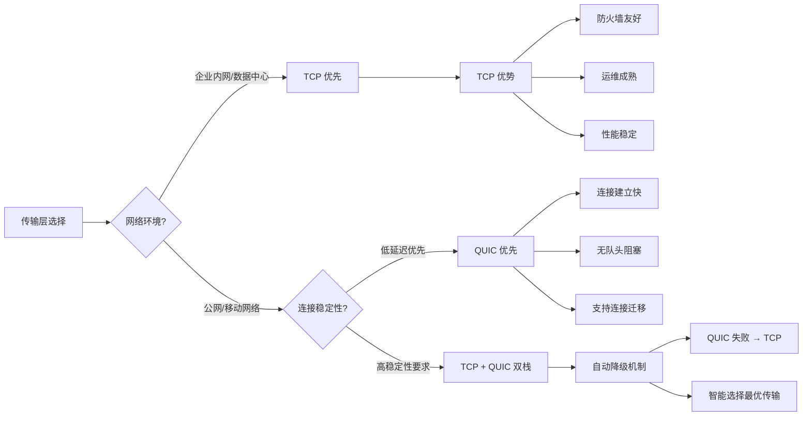
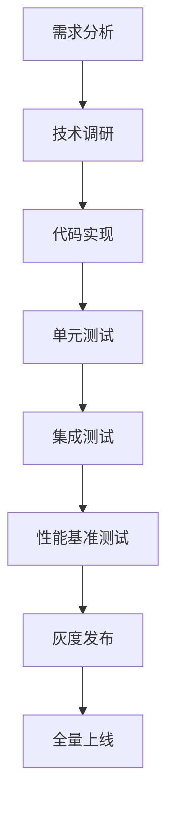

# TCP vs QUIC 传输层技术分析

> **文档类型**: 💡 技术建议
> **创建日期**: 2026-02-07
> **状态**: 📋 待讨论
> **优先级**: P1 (中)

---

## 背景说明

用户提问：**"为什么 P2P Service 只监听 TCP，为什么不使用 QUIC？"**

当前代码：
```go
// p2p_service.go:87-89
listenAddr, err := multiaddr.NewMultiaddr(
    fmt.Sprintf("/ip4/0.0.0.0/tcp/%s", cfg.ListenAddr),
)
```

这是一个很好的技术问题，涉及到传输层协议选择、性能优化和架构设计。

---

## 技术分析

### libp2p 的默认传输层

当前项目使用 `libp2p v0.47.0`，并且已经包含了 QUIC 相关依赖：

```go
github.com/quic-go/quic-go v0.59.0        // QUIC 实现
github.com/quic-go/qpack v0.6.0           // QPACK 压缩
github.com/quic-go/webtransport-go v0.10.0 // WebTransport
github.com/gorilla/websocket v1.5.3       // WebSocket
```

**关键发现**：libp2p 的 `libp2p.New()` 默认**不启用任何传输层**！

如果只使用 `libp2p.ListenAddrs()` 而没有显式配置传输层，libp2p 会使用默认的传输层配置，这取决于编译时包含的传输层实现。

### 默认传输层 vs 显式配置

```go
// ❌ 当前实现（隐式依赖默认值）
opts := []libp2p.Option{
    libp2p.Identity(privKey),
    libp2p.ListenAddrs(listenAddr),  // 只指定监听地址
    libp2p.ConnectionManager(cm),
    libp2p.Ping(true),
}
h, err := libp2p.New(opts...)  // 依赖默认传输层
```

```go
// ✅ 推荐实现（显式配置传输层）
import (
    libp2pquic "github.com/libp2p/go-libp2p/p2p/transport/quic"
    libp2ptcp "github.com/libp2p/go-libp2p/p2p/transport/tcp"
    libp2pws "github.com/libp2p/go-libp2p/p2p/transport/websocket"
)

opts := []libp2p.Option{
    libp2p.Identity(privKey),
    libp2p.ListenAddrs(listenAddr),
    libp2p.ConnectionManager(cm),
    libp2p.Ping(true),

    // 显式配置传输层
    libp2p.Transport(libp2ptcp.NewTCPTransport),     // TCP
    libp2p.Transport(libp2pquic.NewTransport),       // QUIC
    libp2p.Transport(libp2pws.New),                  // WebSocket
}
h, err := libp2p.New(opts...)
```

---

## TCP vs QUIC 对比

### 性能特性对比

| 特性 | TCP | QUIC | 说明 |
|------|-----|------|------|
| **连接建立** | 3 RTT (TLS 1.3) | 1 RTT (QUIC + TLS) | QUIC 更快 |
| **队头阻塞** | ❌ 存在 | ✅ 多路复用 | QUIC 避免包丢失阻塞整个连接 |
| **传输层加密** | TLS (额外层) | 内置 TLS 1.3 | QUIC 默认加密 |
| **拥塞控制** | TCP 拥塞控制 | 可插拔 | QUIC 更灵活 |
| **网络迁移** | ❌ 困难 | ✅ 支持连接迁移 | QUIC 支持移动网络 |
| **UDP 基础** | TCP (有状态) | UDP (无状态) | QUIC 基于 UDP |
| **NAT 穿透** | 较好 | 可能需要额外配置 | TCP 更成熟 |
| **防火墙友好** | ✅ 普遍支持 | ⚠️ UDP 可能被阻止 | TCP 更兼容 |
| **性能开销** | 低 | 中等 | QUIC 有额外开销 |
| **成熟度** | ✅ 非常成熟 | 🔄 快速发展中 | TCP 更稳定 |

### 适用场景对比



---

## NexKV 场景分析

### NexKV 的网络特点

1. **数据中心场景**（主要场景）
   - 稳定的内网环境
   - 低延迟、高带宽
   - 防火墙规则可控
   - **TCP 优先级更高**

2. **跨数据中心场景**（次要场景）
   - 公网连接
   - 可能存在 NAT
   - 需要更好的连接迁移
   - **QUIC 有优势**

3. **边缘计算场景**（未来场景）
   - 移动网络
   - 网络频繁切换
   - **QUIC 必不可少**

### QUIC 的潜在优势

#### 1. **减少连接开销**

```
TCP + TLS 1.3: 3 RTT
- SYN →
- ← SYN-ACK
- ACK → (TCP 握手完成)
- ClientHello →
- ← ServerHello + Certificate
- [加密参数交换]
- Finished → (TLS 握手完成)

QUIC: 1 RTT
- ClientHello (包含加密参数) →
- ← ServerHello + Certificate + Finished
```

**影响**：
- 频繁创建短连接的场景，QUIC 可以显著减少延迟
- NexKV 的 RPC 调用如果使用连接池，优势会减弱

#### 2. **多路复用无队头阻塞**

```go
// TCP + HTTP/2: 一个包丢失影响所有流
Stream1: [Packet1] [Packet2] [Packet3 ✗丢失] [Packet4]
Stream2: [Packet1] [Packet2] [Packet3 ✗阻塞] [Packet4]  ← 被阻塞
Stream3: [Packet1] [Packet2] [Packet3 ✗阻塞] [Packet4]  ← 被阻塞

// QUIC: 独立的流，互不影响
Stream1: [Packet1] [Packet2] [Packet3 ✗丢失] [Packet4]
Stream2: [Packet1] [Packet2] [Packet3 ✓正常] [Packet4]  ← 不受影响
Stream3: [Packet1] [Packet2] [Packet3 ✓正常] [Packet4]  ← 不受影响
```

**影响**：
- 多路复用场景下，QUIC 可以避免单个包丢失影响所有流
- 对于并发 Fanout 调用，QUIC 可能有优势

#### 3. **连接迁移**

```go
// 场景：移动客户端从 WiFi 切换到 4G
TCP:  [WiFi IP:Port] → 断开 → 重连 → [4G IP:Port]
      需要重新建立连接，状态丢失

QUIC: [WiFi IP:Port] → 连接ID保持 → [4G IP:Port]
      无缝迁移，连接状态保持
```

**影响**：
- 对于移动场景，QUIC 的连接迁移非常有价值
- NexKV 如果支持移动客户端，应该考虑 QUIC

---

## 建议方案

### 方案 1：TCP + QUIC 双栈（推荐）

```go
// p2p_service.go
import (
    libp2pquic "github.com/libp2p/go-libp2p/p2p/transport/quic"
    libp2ptcp "github.com/libp2p/go-libp2p/p2p/transport/tcp"
    libp2pws "github.com/libp2p/go-libp2p/p2p/transport/websocket"
)

// P2PServiceConfig 新增字段
type P2PServiceConfig struct {
    ListenAddr       string
    KeyPath          string
    LowWater         int
    HighWater        int
    DiscoveryTag     string
    BootstrapPeers   []peer.AddrInfo

    // 新增：传输层配置
    Transports       []string  // ["tcp", "quic", "websocket"]
    QUICOnly         bool      // 是否仅使用 QUIC
}

// NewP2PService 修改
func NewP2PService(cfg *P2PServiceConfig) (*P2PService, error) {
    // ... 前面的代码保持不变 ...

    // 4. 创建 libp2p Host（显式配置传输层）
    opts := []libp2p.Option{
        libp2p.Identity(privKey),
        libp2p.ListenAddrs(listenAddr),
        libp2p.ConnectionManager(cm),
        libp2p.Ping(true),
    }

    // 配置传输层
    for _, transport := range cfg.Transports {
        switch transport {
        case "tcp":
            opts = append(opts, libp2p.Transport(libp2ptcp.NewTCPTransport))
        case "quic":
            opts = append(opts, libp2p.Transport(libp2pquic.NewTransport))
        case "websocket":
            opts = append(opts, libp2p.Transport(libp2pws.New))
        }
    }

    // 如果没有配置传输层，使用默认 TCP
    if len(cfg.Transports) == 0 {
        opts = append(opts, libp2p.Transport(libp2ptcp.NewTCPTransport))
    }

    h, err := libp2p.New(opts...)
    // ... 后面的代码保持不变 ...
}
```

**配置示例**：

```yaml
# config.yaml
transport:
  libp2p:
    listen_addr: "0.0.0.0"
    listen_port: 9211
    private_key_path: "./data/p2p/key.pem"

    # 新增：传输层配置
    transports:
      - tcp      # 默认启用
      - quic     # 可选启用
      # - websocket  # 可选启用

    # 或者仅使用 QUIC（高级场景）
    # transports: ["quic"]
```

### 方案 2：智能传输层选择（高级）

```go
// 智能 Transport 选择器
type SmartTransportSelector struct {
    tcpTransport   libp2p.Transport
    quicTransport  libp2p.Transport
    strategy       SelectionStrategy
}

type SelectionStrategy int

const (
    PreferTCP SelectionStrategy = iota  // 优先 TCP，QUIC 作为备选
    PreferQUIC                          // 优先 QUIC，TCP 作为备选
    Adaptive                            // 根据网络环境自适应
)

func (s *SmartTransportSelector) SelectTransport(remotePeer peer.ID) libp2p.Transport {
    switch s.strategy {
    case PreferTCP:
        // 检查是否支持 QUIC
        if s.supportsQUIC(remotePeer) {
            return s.quicTransport
        }
        return s.tcpTransport

    case PreferQUIC:
        // 优先 QUIC，失败时降级到 TCP
        return s.quicTransport

    case Adaptive:
        // 根据网络条件选择
        if s.isHighLatencyNetwork() {
            return s.quicTransport
        }
        return s.tcpTransport
    }
}
```

### 方案 3：保持现状 + 文档说明（最小改动）

```go
// 在代码注释中明确说明
// P2PService 当前使用 TCP 传输层
// 未来可以根据需要扩展支持 QUIC、WebSocket 等传输层
//
// 选择 TCP 的原因：
// 1. 数据中心场景下，TCP 性能稳定且成熟
// 2. 防火墙兼容性好，运维成本低
// 3. libp2p 的默认传输层配置已经过充分测试
//
// 未来扩展方向：
// - 跨数据中心场景：添加 QUIC 支持，利用其低延迟和连接迁移特性
// - 移动客户端场景：添加 WebSocket + QUIC，提高网络穿透能力
// - 内网高性能场景：优化 TCP 参数，使用 kernel bypass (如 DPDK)
```

---

## 实施建议

### 短期（立即实施）

✅ **方案 3：保持现状 + 文档说明**

**理由**：
1. 当前 NexKV 主要面向数据中心场景，TCP 已经足够
2. 避免过度设计（YAGNI 原则）
3. 降低测试和运维复杂度

**行动项**：
- [ ] 在 `p2p_service.go` 添加注释说明传输层选择
- [ ] 在 `transport-module-architecture-deep-dive.md` 添加技术选型说明
- [ ] 在配置文件中预留 `transports` 字段（但不启用）

### 中期（3-6 个月）

💡 **方案 1：TCP + QUIC 双栈**

**触发条件**：
1. 客户需求：跨数据中心部署场景
2. 性能测试：QUIC 在特定场景下显著优于 TCP
3. 社区反馈：开源用户需要 QUIC 支持

**实施步骤**：


### 长期（6-12 个月）

🚀 **方案 2：智能传输层选择**

**触发条件**：
1. NexKV 支持移动客户端
2. 网络环境复杂多变（云 + 边缘 + 移动）
3. 需要自动优化传输性能

**技术挑战**：
- 传输层质量评估（RTT、丢包率、带宽）
- 动态切换策略（何时切换、切换成本）
- 兼容性测试（不同网络、不同客户端）

---

## 性能测试建议

如果决定实施 QUIC 支持，建议进行以下性能测试：

### 测试场景

| 场景 | 测试指标 | 预期结果 |
|------|---------|---------|
| **连接建立延迟** | 平均连接建立时间 | QUIC 比 TCP 快 2-3 倍 |
| **吞吐量** | 稳定状态下的数据传输速率 | TCP 和 QUIC 相近 |
| **并发性能** | 多路复用场景下的延迟 | QUIC 在包丢失场景下更稳定 |
| **网络迁移** | WiFi ↔ 4G 切换时的延迟 | 仅 QUIC 支持无缝迁移 |
| **NAT 穿透** | 不同 NAT 环境下的连接成功率 | QUIC + TCP 组合最优 |

### 测试工具

```go
// benchmark_test.go
func BenchmarkTCPConnection(b *testing.B) {
    // 测试 TCP 连接建立性能
}

func BenchmarkQUICConnection(b *testing.B) {
    // 测试 QUIC 连接建立性能
}

func BenchmarkTCPMultiplex(b *testing.B) {
    // 测试 TCP 多路复用性能
}

func BenchmarkQUICMultiplex(b *testing.B) {
    // 测试 QUIC 多路复用性能
}
```

---

## 参考资料

### 官方文档

- **libp2p QUIC Transport**: https://github.com/libp2p/go-libp2p/tree/master/p2p/transport/quic
- **QUIC Protocol**: https://quicwg.org/
- **quic-go Documentation**: https://github.com/quic-go/quic-go

### 技术文章

- **QUIC vs TCP**: https://sheetali.com/blog/quic-vs-tcp/
- **libp2p Transport Layer**: https://docs.libp2p.io/concepts/transports/
- **QUIC in Production**: https://docs.google.com/document/d/1RCN0_6vHtSjjIrEBAaNRkCbAeq5tqzj8SgLWmYbNyeQ/edit

### 相关 RFC

- **RFC 9000**: QUIC: A UDP-Based Multiplexed and Secure Transport
- **RFC 9001**: Using TLS to Secure QUIC
- **RFC 9002**: Managing Loss Detection and Congestion Control for QUIC

---

## 总结

### 回答用户的问题

**问题**："为什么 P2P Service 只监听 TCP，为什么不使用 QUIC？"

**回答**：

1. **当前设计选择 TCP 是合理的**：
   - NexKV 主要面向数据中心场景，TCP 性能稳定且成熟
   - 遵循 YAGNI 原则，避免过度设计
   - 防火墙兼容性好，运维成本低

2. **QUIC 有其适用场景**：
   - 跨数据中心部署（低延迟连接建立）
   - 移动客户端（连接迁移）
   - 不稳定网络环境（无队头阻塞）

3. **未来扩展方向**：
   - 短期：文档说明 + 配置预留
   - 中期：TCP + QUIC 双栈支持
   - 长期：智能传输层选择

4. **实施建议**：
   - 保持当前 TCP 实现
   - 在代码注释中说明技术选型理由
   - 在配置文件中预留 `transports` 字段
   - 根据实际需求和性能测试结果决定是否启用 QUIC

---

**维护者**: 👤 架构师 + 🤖 AI 团队
**最后更新**: 2026-02-07
**状态**: 📋 待讨论
