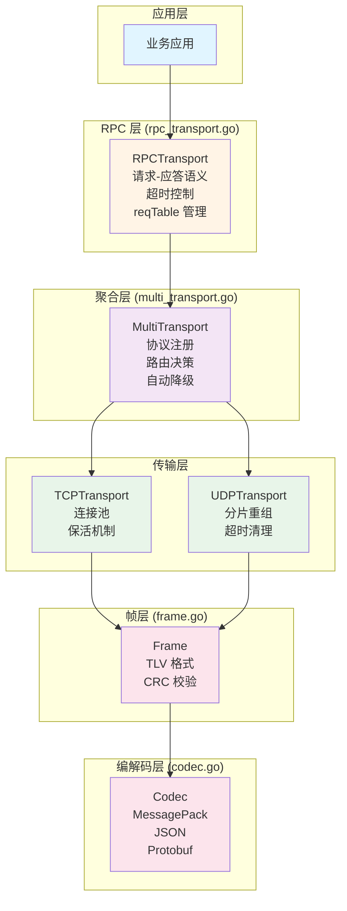
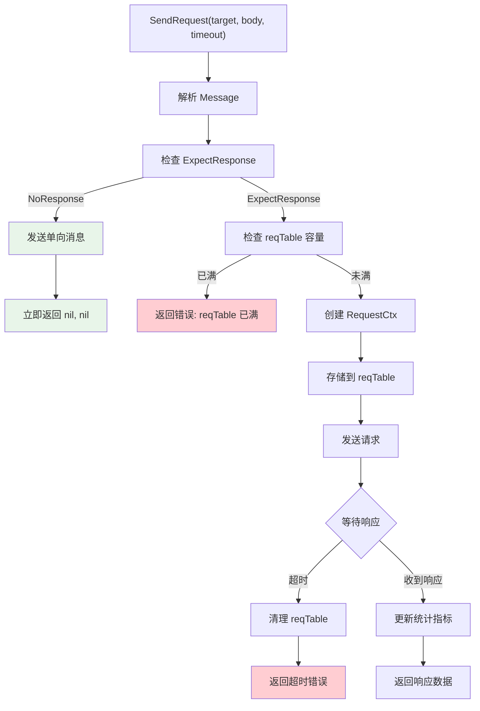

# Transport Layer Code Review Report

**审查日期**: 2026-01-25
**审查范围**: `internal/metadata/transport` 全部代码
**审查人员**: AI Code Reviewer Agent
**代码版本**: main (commit 8fbe7c0)

---

## 📋 目录

1. [架构概览](#架构概览)
2. [类图设计](#类图设计)
3. [时序图分析](#时序图分析)
4. [对上层接口](#对上层接口)
5. [P0 关键问题](#p0-关键问题)
6. [P1 中等问题](#p1-中等问题)
7. [P2 低优先级问题](#p2-低优先级问题)
8. [修复优先级建议](#修复优先级建议)

---

## 架构概览

### 🎯 Code Review 原则

**分层架构** - Transport Layer 采用清晰的分层设计，便于理解和维护

**接口抽象** - 使用 `Transport` 接口实现依赖倒置原则（SOLID-D）

**多协议支持** - 通过 `MultiTransport` 实现协议聚合和自动降级

**可靠性保证** - `RPCTransport` 提供请求-应答语义，支持超时和重试

### 📦 包结构

```
internal/metadata/transport/
├── transport.go          # 核心接口定义（Transport, Codec, Message）
├── frame.go              # TLV 帧格式定义（固定头 + 变长扩展头 + 数据 + CRC）
├── codec.go              # 编解码器接口和实现
├── msg_frame.go          # 消息帧封装（实现 Message 接口）
├── tcp_transport.go      # TCP 传输实现（连接池、保活、并发读写）
├── udp_transport.go      # UDP 传输实现（分片重组、超时清理）
├── multi_transport.go    # 多协议聚合传输（协议注册、路由、降级）
├── rpc_transport.go      # RPC 请求-应答传输层（超时、重试、reqTable）
└── *_test.go             # 单元测试和集成测试
```

### 🏗️ 架构分层



---

## 类图设计

### 核心接口层次关系

```mermaid
classDiagram
    %% 核心接口
    class Transport {
        <<interface>>
        +Start(nodeID, stopCh) error
        +Stop() error
        +Send(ctx, addr, msg) error
        +Receive() ~chan MsgFrame
        +ForwardMessage(ctx, addrs, msg) error
        +GetNodeID() uint64
        +GenerateMsgSeq() uint64
    }

    class BatchForwardTransport {
        <<interface>>
        +BatchForwardMessage(ctx, addrs, msg) BatchResult
    }

    class Codec {
        <<interface>>
        +Encode(msg) []byte
        +Decode(data) (Message, error)
        +Name() string
        +Type() CodecType
    }

    class Message {
        <<interface>>
        +Type() MessageType
        +Priority() int
        +ExpectResponse() ResponseExpectation
        +Reliability() ReliabilityRequirement
    }

    class Conn {
        <<interface>>
        +Read(msg) (MsgFrame, error)
        +Write(msg) error
        +Close() error
        +RemoteAddr() string
        +SetDeadline(t) error
    }

    %% 实现 Transport 接口
    class TCPTransport {
        -config TransportConfig
        -codec Codec
        -connPool connPool
        -recvCh chan MsgFrame
        +Start(nodeID, stopCh) error
        +Stop() error
        +Send(ctx, addr, msg) error
        +Receive() ~chan MsgFrame
        +ForwardMessage(ctx, addrs, msg) error
        +GetNodeID() uint64
        +GenerateMsgSeq() uint64
    }

    class UDPTransport {
        -config TransportConfig
        -codec Codec
        -fragmentBuf fragmentBuffer
        -recvCh chan MsgFrame
        +Start(nodeID, stopCh) error
        +Stop() error
        +Send(ctx, addr, msg) error
        +Receive() ~chan MsgFrame
        +ForwardMessage(ctx, addrs, msg) error
        +GetNodeID() uint64
        +GenerateMsgSeq() uint64
    }

    class MultiTransport {
        -config TransportConfig
        -protocols map[ProtocolType]ProtocolTransport
        -router Router
        -degradationManager DegradationManager
        +RegisterProtocol(cfg) error
        +Start(nodeID, stopCh) error
        +Stop() error
        +Send(ctx, addr, msg) error
        +Receive() ~chan MsgFrame
        +GetNodeID() uint64
        +GenerateMsgSeq() uint64
    }

    class RPCTransport {
        -transport Transport
        -reqTable sync.Map
        -defaultTimeout time.Duration
        -maxReqTableSize int64
        +SendRequest(target, body, timeout) ([]byte, error)
        +SendResponse(target, msgID, body, isError) error
        +OnRecv(nodeID, data)
        +GetStats() map[string]interface{}
        +Close() error
    }

    %% 帧相关
    class Frame {
        +FixedHeader FixedHeader
        +VarExtHeader VarExtHeader
        +Data []byte
        +CRC32 uint32
        +Marshal() []byte
        +Unmarshal(data) error
        +WithCompress(id) *Frame
        +WithFragment(index, total) *Frame
        +WithPriority(p) *Frame
    }

    class MsgFrame {
        -frame *Frame
        +Unwrap() Message
        +GetSourceNodeID() uint64
        +GetMsgSeq() uint64
        +GetType() MessageType
        +GetProtocol() ProtocolType
    }

    %% 内部组件
    class connPool {
        -mu sync.RWMutex
        -conns map[string]*tcpConn
        +getConn(addr) (*tcpConn, error)
        +addConn(addr, conn)
        +removeConn(addr)
    }

    class fragmentBuffer {
        -mu sync.RWMutex
        -buffers map[fragmentKey]*partialMessage
        -timeout time.Duration
        +addFragment(key, index, total, data) error
        +reassembleMessage(key) (*Frame, error)
        +cleanupExpired()
    }

    class RequestCtx {
        +MsgID uint64
        +RespCh chan []byte
        +ErrorCh chan error
        +CreatedAt time.Time
        +Cancel context.CancelFunc
    }

    %% 关系
    Transport <|-- TCPTransport : implements
    Transport <|-- UDPTransport : implements
    Transport <|-- MultiTransport : implements
    BatchForwardTransport <|-- TCPTransport : implements
    BatchForwardTransport <|-- UDPTransport : implements
    BatchForwardTransport <|-- MultiTransport : implements

    TCPTransport +-- connPool : contains
    UDPTransport +-- fragmentBuffer : contains
    RPCTransport o-- Transport : depends on
    RPCTransport +-- RequestCtx : manages
    Frame *-- MsgFrame : wraps

    MultiTransport o-- Transport : aggregates
```

### 类详细说明

#### Transport 接口
所有传输层必须实现的核心接口：
- `Start()` - 启动传输层，传入 nodeID 和 stopCh
- `Stop()` - 停止传输层，清理资源
- `Send()` - 发送消息到指定地址
- `Receive()` - 接收消息通道（异步）
- `ForwardMessage()` - 转发消息到多个地址
- `GetNodeID()` - 获取本地节点 ID
- `GenerateMsgSeq()` - 生成全局唯一消息序号

#### RPCTransport (上层接口)
**作用**: 提供请求-应答语义，支持超时和重试

**核心方法**:
- `SendRequest(target, body, timeout) -> ([]byte, error)` - 发送请求并等待响应
- `SendResponse(target, msgID, body, isError) -> error` - 发送响应
- `OnRecv(nodeID, data)` - 处理接收到的消息（自动匹配 reqTable）

**reqTable 管理**:
```go
type RequestKey struct {
    NodeID uint64  // 目标节点 ID
    MsgID  uint64  // 消息序列号
}

type RequestCtx struct {
    MsgID     uint64
    RespCh    chan []byte     // 响应通道
    ErrorCh   chan error       // 错误通道
    CreatedAt time.Time       // 创建时间（超时清理）
    Cancel    context.CancelFunc
}
```

#### Frame 结构
```go
type Frame struct {
    FixedHeader  FixedHeader    // 固定头 (24 字节)
    VarExtHeader VarExtHeader   // 变长扩展头
    Data         []byte         // 数据体
    CRC32        uint32         // CRC32 校验
}

// 固定头结构
type FixedHeader struct {
    Magic         uint16  // 魔数: 0xCAFE
    Version       uint8   // 版本: 1
    Flags         uint8   // 标志位
    NodeID        uint64  // 源节点 ID
    MsgSeq        uint64  // 消息序号
    ForwardNodeID uint64  // 转发节点 ID
    Hops          uint8   // 跳数
    Reserved      uint8   // 保留
    MsgType       uint8   // 消息类型
    CodecID       uint16  // 编解码器 ID
    ExtHeaderLen  uint16  // 扩展头长度
    DataLength    uint32  // 数据长度
}
```

---

## 时序图分析

### TCP Transport 时序图

```mermaid
sequenceDiagram
    participant App as 应用层
    participant TCP as TCPTransport
    participant Pool as connPool
    participant Conn as tcpConn
    participant Net as 网络

    == Start ==
    App->>TCP: Start(nodeID, stopCh)
    TCP->>TCP: startListener()
    TCP->>TCP: acceptLoop()
    TCP->>TCP: startConnPoolManager()
    TCP-->>App: nil (启动成功)

    == Send ==
    App->>TCP: Send(ctx, addr, msg)
    TCP->>Pool: getOrCreateConn(addr)
    Pool->>Pool: 检查连接池
    alt 连接存在
        Pool-->>TCP: conn (已存在)
    else 连接不存在
        Pool->>Net: dial(addr)
        Net-->>Pool: conn
        Pool->>Pool: addConnToPool(addr, conn)
        Pool-->>TCP: conn (新创建)
    end
    TCP->>Conn: Write(msg)
    Conn->>Net: 发送数据
    Net-->>TCP: 发送成功
    TCP-->>App: nil

    == Receive (异步) ==
    Net->>TCP: 接收到连接
    TCP->>TCP: acceptLoop() 接受
    TCP->>Conn: wrapConn()
    Conn->>Conn: ReadMsgFrame()
    Conn->>Net: 读取数据
    Net-->>Conn: Frame 数据
    Conn->>TCP: recvCh <- frame
    TCP->>App: Receive() <- frame

    == ForwardMessage ==
    App->>TCP: ForwardMessage(ctx, addrs, msg)
    loop 遍历 addrs
        TCP->>Pool: getOrCreateConn(addr)
        TCP->>Conn: Write(msg)
    end

    == Stop ==
    App->>TCP: Stop()
    TCP->>TCP: closeAllConns()
    TCP->>Pool: 关闭所有连接
    TCP->>Conn: Close()
    TCP->>TCP: 停止监听
    TCP-->>App: nil
```

### UDP Transport 时序图

```mermaid
sequenceDiagram
    participant App as 应用层
    participant UDP as UDPTransport
    participant Buf as fragmentBuffer
    participant Net as UDP Conn

    == Start ==
    App->>UDP: Start(nodeID, stopCh)
    UDP->>UDP: initFragmentBuffer()
    UDP->>Buf: startCleanup()
    UDP->>UDP: receiveLoop()
    UDP-->>App: nil

    == Send (小消息) ==
    App->>UDP: Send(ctx, addr, msg)
    UDP->>UDP: encodeFrame()
    UDP->>UDP: sendDirectWithOptions()
    UDP->>Net: Write(data)
    Net-->>UDP: 发送成功
    UDP-->>App: nil

    == Send (大消息 > MTU) ==
    App->>UDP: Send(ctx, addr, msg)
    UDP->>UDP: encodeFrame()
    UDP->>UDP: sendFragmentedWithOptions()
    loop 分片发送
        UDP->>UDP: 创建 Fragment Frame
        UDP->>Net: Write(fragment)
        Net-->>UDP: 发送成功
    end
    UDP-->>App: nil

    == Receive (分片重组) ==
    Net->>UDP: 接收分片
    UDP->>UDP: processReceivedData()
    UDP->>UDP: parseFrame()
    UDP->>Buf: addFragment(key, index, total, data)

    alt 分片未完整
        Buf-->>UDP: nil (等待更多分片)
    else 分片完整
        Buf->>Buf: reassembleMessage()
        Buf-->>UDP: complete Frame
        UDP->>UDP: sendToReceiveChannel()
        UDP->>App: recvCh <- frame
    end

    == 超时清理 ==
    Note over Buf: 每 timeout 时间清理
    Buf->>Buf: cleanupExpiredFragments()
    Buf->>Buf: 删除超时的 partialMessage

    == Stop ==
    App->>UDP: Stop()
    UDP->>UDP: 关闭 UDP 连接
    UDP->>Buf: 停止清理
    UDP-->>App: nil
```

### RPCTransport 时序图

```mermaid
sequenceDiagram
    participant App as 应用层
    participant RPC as RPCTransport
    participant Transport as Transport
    participant ReqTable as reqTable

    == SendRequest (双向消息) ==
    App->>RPC: SendRequest(target, body, timeout)
    RPC->>RPC: decodeMessage(body)
    RPC->>RPC: 检查 ExpectResponse

    alt ExpectResponse == NoResponse (单向)
        RPC->>Transport: Send(ctx, target, reqMsg)
        Transport-->>RPC: nil
        RPC-->>App: nil, nil (立即返回)
    else ExpectResponse == ExpectResponse (双向)
        RPC->>RPC: 检查 reqTable 容量
        RPC->>ReqTable: 创建 RequestCtx
        RPC->>ReqTable: Store(key, ctx)
        RPC->>Transport: Send(ctx, target, reqMsg)

        alt 超时
            App->>App: 等待超时
            RPC->>ReqTable: Delete(key)
            RPC-->>App: nil, timeout error
        else 收到响应
            Note over RPC,ReqTable: OnRecv 被调用
            RPC->>ReqTable: Load(key)
            RPC->>ReqTable: RespCh <- response
            ReqTable-->>App: response, nil
        end
    end

    == OnRecv (处理响应) ==
    Transport->>RPC: OnRecv(nodeID, data)
    RPC->>RPC: decodeMessage(data)

    alt 是响应 (!IsRequest)
        RPC->>ReqTable: Load(key)
        alt reqTable 存在
            RPC->>ReqTable: 发送响应或错误
        else reqTable 不存在
            Note over RPC: 可能已超时
        end
    else 是请求 (IsRequest)
        Note over RPC: TODO: 调用业务层处理
    end

    == SendResponse ==
    App->>RPC: SendResponse(target, msgID, body, isError)
    RPC->>RPC: 构造响应消息
    RPC->>Transport: Send(ctx, target, respMsg)
    Transport-->>RPC: nil
    RPC-->>App: nil

    == 定期清理 ==
    Note over RPC: 每 1 分钟
    RPC->>ReqTable: cleanupExpiredRequests()
    RPC->>ReqTable: 删除超时的 RequestCtx
```

### MultiTransport 时序图

```mermaid
sequenceDiagram
    participant App as 应用层
    participant Multi as MultiTransport
    participant Router as Router
    participant Degradation as DegradationManager
    participant TCP as TCPTransport
    participant UDP as UDPTransport

    == 注册协议 ==
    App->>Multi: RegisterProtocol(TCP)
    Multi->>Multi: protocols[TCP] = ProtocolTransport
    App->>Multi: RegisterProtocol(UDP)
    Multi->>Multi: protocols[UDP] = ProtocolTransport

    == Start ==
    App->>Multi: Start(nodeID, stopCh)
    Multi->>TCP: Start(nodeID, stopCh)
    Multi->>UDP: Start(nodeID, stopCh)
    Multi->>Multi: receiveLoop()
    Multi->>Multi: overflowLoop()
    Multi-->>App: nil

    == Send (路由决策) ==
    App->>Multi: Send(ctx, addr, msg)
    Multi->>Router: RouteDecision(addr, msg)
    Router-->>Multi: selectedProtocol

    alt 无需降级
        Multi->>TCP: Send(ctx, addr, msg)
        TCP-->>Multi: nil
        Multi-->>App: nil
    else 需要降级
        Multi->>Degradation: ShouldDegrade(protocol)
        Degradation-->>Multi: 降级协议
        Multi->>UDP: Send(ctx, addr, msg)
        UDP-->>Multi: nil
        Multi-->>App: nil
    end

    == Receive (聚合接收) ==
    Multi->>Multi: receiveLoop()
    alt 接收通道未满
        TCP->>Multi: recvCh <- frame
        Multi->>App: Receive() <- frame
    else 接收通道已满
        TCP->>Multi: overflowCh <- frame
        Multi->>Multi: overflowLoop() 处理
        Note over Multi: 记录监控指标，丢弃消息
    end

    == ForwardMessage (批量转发) ==
    App->>Multi: ForwardMessage(ctx, addrs, msg)
    Multi->>Router: BatchRouteDecision(addrs, msg)

    alt 使用默认协议
        Multi->>TCP: BatchForwardMessage(ctx, addrs, msg)
        TCP-->>Multi: BatchResult
    else 按地址路由
        loop 遍历 addrs
            Multi->>Router: RouteDecision(addr)
            alt addr == TCP
                Multi->>TCP: Send(ctx, addr, msg)
            else addr == UDP
                Multi->>UDP: Send(ctx, addr, msg)
            end
        end
    end

    == Stop ==
    App->>Multi: Stop()
    Multi->>TCP: Stop()
    Multi->>UDP: Stop()
    Multi-->>App: nil
```

---

## 对上层接口

### RPCTransport 接口设计

**定位**: Transport Layer 的上层封装，提供请求-应答语义

```go
type RPCTransport struct {
    transport       Transport         // 底层传输（依赖倒置）
    reqTable        sync.Map          // 请求等待表
    defaultTimeout  time.Duration     // 默认超时
    maxReqTableSize int64             // 容量限制（DoS 防护）
    cleanupTicker   *time.Ticker      // 定期清理
    timeoutCount    atomic.Uint64     // 超时统计
    totalRequest    atomic.Uint64     // 请求统计
    totalLatencyNs  atomic.Uint64     // 延迟统计
}
```

#### SendRequest 方法详解

**签名**: `SendRequest(targetNode string, reqBody []byte, timeout time.Duration) ([]byte, error)`

**行为**:
1. 解析 reqBody 获取 Message 接口
2. 调用 `Message.ExpectResponse()` 检查是否需要响应
3. **单向模式** (`NoResponse`): 发送后立即返回 `nil, nil`
4. **双向模式** (`ExpectResponse`):
   - 创建 reqTable 条目
   - 阻塞等待响应或超时
   - 超时后自动清理 reqTable

**流程图**:


#### OnRecv 方法详解

**签名**: `OnRecv(nodeID string, data []byte)`

**行为**:
1. 解码消息（带容错处理）
2. **如果是响应** (`!IsRequest`):
   - 从 reqTable 查找对应的 RequestCtx
   - 发送响应到 `RespCh` 或错误到 `ErrorCh`
3. **如果是请求** (`IsRequest`):
   - 检查 `ExpectResponse`
   - **单向消息**: 只处理，不发送响应
   - **双向消息**: TODO: 调用业务层处理

#### GetStats 监控指标

```go
{
    "activeRequestCount": int64,   // 活跃请求数
    "timeoutCount":       uint64,   // 超时次数
    "totalRequestCount":  uint64,   // 总请求数
    "avgLatency":         string,   // 平均延迟
    "maxReqTableSize":    int64,    // 最大容量
}
```

---

## 📊 审查总结

| 优先级 | 数量 | 状态 |
|--------|------|------|
| **P0 (关键)** | 3 | ⚠️ 需要修复 |
| **P1 (中等)** | 3 | ⚠️ 建议修复 |
| **P2 (低)** | 3 | 可选优化 |

---

## 🚨 P0: 关键问题 (必须修复)

### P0-1: TCP 连接池 TOCTOU 竞态条件
**文件**: `tcp_transport.go:577-596`
**严重程度**: ⚠️ **Critical** - 可能导致连接泄漏和重复拨号
**置信度**: 95

**问题描述**:
```go
// 第一次检查：快速路径（无锁）
conn := t.getConnFromPool(addr)
if conn != nil && !conn.isClosed() {
    return conn, nil
}

// 需要创建新连接，加锁避免重复拨号
t.connPool.mu.Lock()
defer t.connPool.mu.Unlock()

// 第二次检查：其他协程可能已创建连接
conn = t.connPool.conns[addr]  // ⚠️ 问题：未检查 conn.isClosed()
if conn != nil && !conn.isClosed() {
    return conn, nil
}
```

**修复建议**:
```go
// 第二次检查必须调用 isClosed()
conn = t.connPool.conns[addr]
if conn != nil && !conn.isClosed() {  // ✅ 必须检查
    return conn, nil
}
```

---

### P0-2: UDP 分片重组缺少并发保护
**文件**: `udp_transport.go:611-620`
**严重程度**: ⚠️ **Critical** - 数据竞争（data race）
**置信度**: 92

**问题描述**:
```go
// 快速路径：total <= 64（无锁）
if total <= 64 {
    partial.bitmapFast |= (1 << index)  // ⚠️ 无并发保护
}
```

**修复建议**:
```go
// 使用 atomic.Uint64（推荐）
type partialMessage struct {
    bitmapFast atomic.Uint64  // ✅ 原子操作
}

// 使用:
old := partial.bitmapFast.Load()
partial.bitmapFast.Store(old | (1 << index))
```

---

### P0-3: RPC Transport reqTable 缺少优先级拒绝机制
**文件**: `rpc_transport.go:255-257`
**严重程度**: ⚠️ **Critical** - DoS 攻击风险
**置信度**: 88

**问题描述**:
- 已检查容量限制，但所有新请求一视同仁拒绝
- 恶意客户端可以填满 reqTable，阻断正常业务

**修复建议**:
```go
// 按消息类型分类限制
if r.reqTableSize.Load() >= r.maxReqTableSize {
    // 允许高优先级请求（心跳、Leader 选举）
    if msg.Priority() >= int(types.PriorityHigh) {
        r.evictLowestPriorityRequest()
    } else {
        return nil, fmt.Errorf("请求等待表已满")
    }
}
```

---

## ⚠️ P1: 中等优先级问题

### P1-1: TCP keep-alive 配置不完整
**文件**: `tcp_transport.go:282-295`
**置信度**: 85

**问题**: 未设置 `TCP_KEEPIDLE`、`TCP_KEEPCNT`、`TCP_KEEPINTVL`

---

### P1-2: MultiTransport 协议降级逻辑死锁风险
**文件**: `multi_transport.go:496-530`
**置信度**: 82

**问题**: 持有 `stateMu.Lock()` 期间调用 `degradationManager.ShouldDegrade()`

---

### P1-3: UDP 分片超时清理可能导致内存泄漏
**文件**: `udp_transport.go:691-735`
**置信度**: 80

**问题**: 单次清理可能处理过多过期分片，长时间持锁

---

## 📝 P2: 低优先级问题

### P2-1: Magic number 应使用命名常量
**文件**: `frame.go:569-570`
**置信度**: 75

---

### P2-2: 错误处理不够细化
**文件**: `tcp_transport.go:347-351`
**置信度**: 72

---

### P2-3: 编解码器缓存可能导致内存泄漏
**文件**: `udp_transport.go:437-468`
**置信度**: 70

---

## ✅ 已修复的问题

根据提交历史，以下 P0 问题已在之前修复：

- ✅ **P0-UDP-001**: UDP bitmap overflow when total=64
- ✅ **P0-Multi-002**: MultiTransport duplicate select case
- ✅ **P0-RPC-003**: RPC ExpectResponse enum validation

---

## 🎯 修复优先级建议

1. **立即修复**: P0-1, P0-2（数据竞争和资源泄漏）
2. **尽快修复**: P0-3, P1-1（DoS 防护和稳定性）
3. **计划修复**: P1-2, P1-3, P2-1, P2-2, P2-3

---

## 📌 架构改进建议

### 背景

本次代码审查发现，当前 Transport Layer 的架构存在一些设计上的局限性。以下是基于**依赖倒置原则（SOLID-D）**和**关注点分离**原则的架构改进提案。

---

### 核心问题分析

#### 问题 1: Message 接口缺少行为方法

**当前设计** (`types.Message`):
```go
type Message interface {
    Type() MessageType
    Priority() int
    ExpectResponse() ResponseExpectation
    Reliability() ReliabilityRequirement
}
```

**问题**:
- ❌ **缺少序列化方法**: `Encode()` / `Decode()` 不在 Message 接口中
- ❌ **职责不清**: 混合了业务属性和传输属性
- ❌ **扩展困难**: 新增传输选项需要修改 TLV 格式

**后果**:
- 业务层无法控制序列化逻辑
- 类型不安全：`SendRequest` 返回 `[]byte` 而非 `Message`
- 扩展性差：新增字段需要修改 Frame 格式

---

#### 问题 2: RPCTransport 是结构体而非接口

**当前设计**:
```go
type RPCTransport struct {
    transport       Transport
    reqTable        sync.Map
    defaultTimeout  time.Duration
    // ...
}
```

**问题**:
- ❌ **违反依赖倒置原则**: 业务层依赖具体实现
- ❌ **难以测试**: 无法 Mock RPCTransport
- ❌ **耦合度高**: 业务层与 Transport 实现绑定

---

### 🎯 改进提案

#### 提案 1: 增强 Message 接口

**新设计**:
```go
package transport

import "context"

// --------------------------
// 传输层控制选项（封装 hops、压缩等配置）
// --------------------------
type MessageOptions struct {
    MaxRemainingHops uint8 // 最大剩余转发跳数（0=禁止转发）
    CompressEnable   bool  // 是否开启压缩
    CompressAlgo     int   // 压缩算法（0=无/1=LZ4/2=Snappy/3=Gzip）
    Timeout          int64 // 超时时间(ms)，0=使用全局默认
    RetryTimes       int   // 重试次数，-1=使用全局默认/0=禁止重试
    NeedResponse     bool  // 是否需要响应（单向消息设为false）
}

// --------------------------
// 业务消息通用抽象接口
// --------------------------
type Message interface {
    // 业务层负责序列化
    Encode() ([]byte, error)

    // 业务层负责反序列化
    Decode(data []byte) error

    // 消息类型（用于路由/处理器匹配）
    MsgType() string

    // 传输控制选项（hops/压缩等）
    Options() *MessageOptions
}

// 压缩算法常量
const (
    CompressNone = iota
    CompressLZ4
    CompressSnappy
    CompressGzip
)
```

**优势**:
| 维度 | 当前设计 | 改进后 |
|------|----------|--------|
| **序列化职责** | Transport 层 | 业务层 |
| **类型安全** | `[]byte` | `Message` 接口 |
| **扩展性** | 修改 TLV 格式 | `MessageOptions` 新增字段 |
| **测试性** | 需要 Mock Transport | 业务消息独立测试 |

---

#### 提案 2: RPCTransport 改为接口

**新设计**:
```go
// --------------------------
// RPC传输层核心上层接口
// --------------------------
type RPCTransport interface {
    // 核心RPC方法：发送业务消息并获取响应
    //
    // context metadata 用途：
    //   - WithNodeID(ctx, nodeID): 设置源节点 ID
    //   - WithMsgSeq(ctx, seq): 设置消息序列号
    //   - WithHopCount(ctx, hop, totalHop): 设置转发跳数
    //   - WithCompression(ctx, algo): 设置压缩算法
    //   - WithPriority(ctx, priority): 设置消息优先级
    //
    // 返回 Message 接口（类型安全）
    RPC(ctx context.Context, targetNode string, reqMsg Message) (respMsg Message, err error)

    // 注册消息处理器：匹配 MsgType 处理对应业务消息
    // 使用 Handler 模式，而非 Transport 调用业务层
    RegisterHandler(msgType string, handler func(reqMsg Message) (respMsg Message, isError bool))

    // 生命周期管理
    Start() error
    Stop() error

    // 获取统计信息
    GetStats() map[string]interface{}
}
```

**关键设计：context metadata 传递 Frame 元素**

| Frame 字段 | 传递方式 | 说明 |
|-----------|---------|------|
| `FixedHeader.NodeID` | `WithNodeID(ctx, nodeID)` | 源节点 ID |
| `FixedHeader.MsgSeq` | `WithMsgSeq(ctx, seq)` | 消息序列号（可自动生成） |
| `FixedHeader.Hops` | `WithHopCount(ctx, hop, total)` | 转发跳数控制 |
| `VarExtHeader.Compression` | `WithCompression(ctx, algo)` | 压缩算法 |
| `VarExtHeader.Priority` | `WithPriority(ctx, priority)` | 消息优先级 |

**优势**:
| 维度 | 当前设计 | 改进后 |
|------|----------|--------|
| **依赖方向** | 业务层 → 结构体 | 业务层 → 接口 |
| **可测试性** | 难以 Mock | 可 Mock 接口 |
| **业务集成** | TODO 注释待实现 | Handler 模式清晰 |
| **类型安全** | `[]byte` | `Message` 接口 |
| **元数据传递** | Frame 字段 | context metadata |

---

#### 提案 2.1: context metadata 辅助函数

**实现示例**:
```go
package transport

import "context"

// context key 类型（避免冲突）
type contextKey string

const (
    nodeIDKey      contextKey = "nodeID"
    msgSeqKey      contextKey = "msgSeq"
    hopCountKey    contextKey = "hopCount"
    compressionKey contextKey = "compression"
    priorityKey    contextKey = "priority"
)

// WithNodeID 设置源节点 ID
func WithNodeID(ctx context.Context, nodeID uint64) context.Context {
    return context.WithValue(ctx, nodeIDKey, nodeID)
}

// WithMsgSeq 设置消息序列号
func WithMsgSeq(ctx context.Context, seq uint64) context.Context {
    return context.WithValue(ctx, msgSeqKey, seq)
}

// WithHopCount 设置转发跳数
func WithHopCount(ctx context.Context, hop, totalHop uint8) context.Context {
    return context.WithValue(ctx, hopCountKey, HopCount{Hop: hop, TotalHop: totalHop})
}

// WithCompression 设置压缩算法
func WithCompression(ctx context.Context, algo int) context.Context {
    return context.WithValue(ctx, compressionKey, algo)
}

// WithPriority 设置消息优先级
func WithPriority(ctx context.Context, priority int) context.Context {
    return context.WithValue(ctx, priorityKey, priority)
}

// HopCount 跳数信息
type HopCount struct {
    Hop      uint8
    TotalHop uint8
}
```

**使用示例**:
```go
// 业务层调用
ctx := context.Background()
ctx = transport.WithNodeID(ctx, nodeID)
ctx = transport.WithHopCount(ctx, 10, 20)  // 当前第 10 跳，总共 20 跳
ctx = transport.WithCompression(ctx, transport.CompressLZ4)
ctx = transport.WithPriority(ctx, types.PriorityHigh)

resp, err := rpcTransport.RPC(ctx, targetNode, reqMsg)
```

**设计优势**:
1. **关注点分离**: Message 接口只包含业务数据，Frame 元素通过 context 传递
2. **符合 Go 惯用法**: 类似 gRPC 的 metadata 传递模式
3. **灵活性**: 可以在调用链中任何位置添加/修改元数据
4. **可测试性**: 测试时可以轻松构造带特定元数据的 context

---

#### 提案 3: MessageOptions 封装传输控制

**设计理念**: 所有传输选项集中在一个结构体中，而非分散在 TLV 扩展字段

```go
type MessageOptions struct {
    MaxRemainingHops uint8  // 转发控制
    CompressEnable   bool   // 压缩控制
    CompressAlgo     int    // 算法选择
    Timeout          int64  // 超时控制
    RetryTimes       int    // 重试策略
    NeedResponse     bool   // 单向/双向
}
```

**价值**:
1. **向后兼容**: 新增字段不影响现有代码
2. **配置集中**: 所有传输选项在一个结构体
3. **支持转发**: `MaxRemainingHops` 实现消息中继

---

### 📊 架构对比

#### 当前架构

```
┌─────────────────────────────────────────┐
│           业务层代码                      │
│  - 类型不安全：SendRequest 返回 []byte   │
│  - 无法控制序列化                         │
└─────────────────────────────────────────┘
                  ↓
┌─────────────────────────────────────────┐
│       RPCTransport (结构体)              │
│  - SendRequest(target, body, timeout)    │
│  - SendResponse(target, msgID, body)     │
│  - OnRecv(nodeID, data)                  │
└─────────────────────────────────────────┘
                  ↓
┌─────────────────────────────────────────┐
│         Transport 接口                   │
│  - Send(ctx, addr, msg)                  │
│  - Receive() <-chan MsgFrame             │
└─────────────────────────────────────────┘
                  ↓
┌─────────────────────────────────────────┐
│    Codec 接口（序列化/反序列化）          │
│  - Encode(msg) []byte                    │
│  - Decode(data) Message                  │
└─────────────────────────────────────────┘
```

#### 改进后架构

```
┌─────────────────────────────────────────┐
│          业务层代码                      │
│  - 类型安全：RPC 返回 Message 接口       │
│  - 业务层控制序列化                       │
│  - 实现 Message 接口                     │
└─────────────────────────────────────────┘
                  ↓
┌─────────────────────────────────────────┐
│       RPCTransport 接口                  │
│  - RPC(ctx, target, req) (resp, error)   │
│  - RegisterHandler(type, handler)        │
└─────────────────────────────────────────┘
                  ↓
┌─────────────────────────────────────────┐
│    RPCTransport 实现类                   │
│  - 封装 reqTable 管理                    │
│  - 封装超时和重试逻辑                     │
│  - 调用 RegisterHandler 注册的处理器      │
└─────────────────────────────────────────┘
                  ↓
┌─────────────────────────────────────────┐
│         Transport 接口                   │
│  - 只负责传输，不负责序列化               │
└─────────────────────────────────────────┘
```

---

### 🛠️ 迁移路径

#### 阶段 1: 增加新接口（非破坏性）

1. 在 `transport.go` 中新增 `MessageOptions` 结构体
2. 在 `types.Message` 中增加 `Encode()` / `Decode()` 方法（可选）
3. 创建新的 `RPCTransport` 接口

**影响**: 无破坏性变更，现有代码继续工作

#### 阶段 2: 实现 RPCTransport 接口

1. 将现有 `RPCTransport` 结构体重命名为 `RPCTransportImpl`
2. 实现 `RPCTransport` 接口
3. 修改 `RPC()` 方法调用底层 `SendRequest`

**影响**: 需要更新业务层调用代码

#### 阶段 3: 业务层迁移

1. 业务层实现 `Message` 接口
2. 使用 `RPC()` 方法替代 `SendRequest`
3. 使用 `RegisterHandler` 注册处理器

**影响**: 业务层代码需要更新

---

### ✅ 改进收益

| 收益类型 | 当前设计 | 改进后 |
|---------|----------|--------|
| **类型安全** | `[]byte` 返回值 | `Message` 接口返回值 |
| **依赖倒置** | 依赖结构体 | 依赖接口 |
| **可测试性** | 难以 Mock | 可 Mock 接口 |
| **扩展性** | 修改 TLV 格式 | `MessageOptions` 新增字段 |
| **业务集成** | TODO 注释 | Handler 模式 |
| **序列化控制** | Transport 层 | 业务层 |

---

### 📋 实施建议

| 优先级 | 任务 | 预估工作量 | 风险 |
|--------|------|-----------|------|
| **P1** | 新增 `MessageOptions` 结构体 | 0.5 天 | 低 |
| **P1** | 创建 `RPCTransport` 接口 | 1 天 | 低 |
| **P2** | `RPCTransportImpl` 实现接口 | 2 天 | 中 |
| **P2** | 业务层迁移到新接口 | 3-5 天 | 中 |
| **P3** | 移除旧的 `SendRequest` 方法 | 1 天 | 高 |

**总计**: 约 8-10 天

---

### 📌 参考资料

- **SOLID 原则**: 依赖倒置原则（D）
- **Go 接口设计**: [Interface Best Practices](https://go.dev/doc/effective_go#interfaces)
- **Handler 模式**: HTTP Handler 模式在 RPC 中的应用

---

**关联 PR**: #25
**下一步**: 根据此报告创建修复任务
