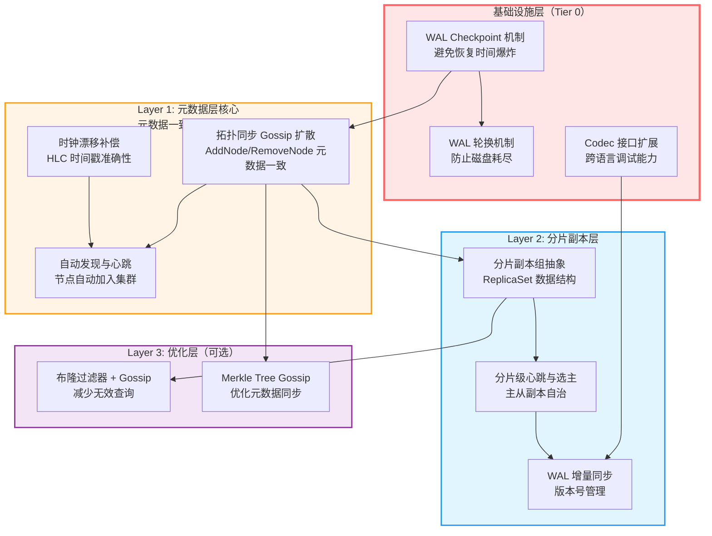
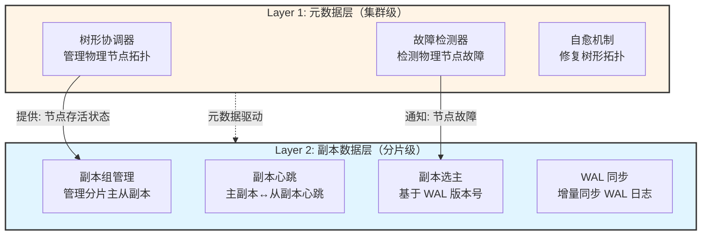
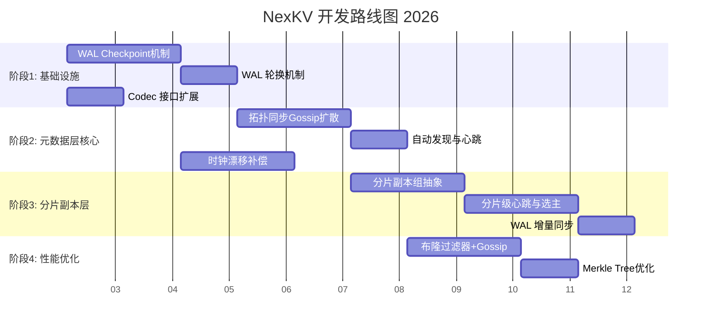

# NexKV 开发路线图 2026

> **版本**: v1.0
> **创建日期**: 2026-01-18
> **状态**: 📋 待审批
> **维护者**: NexKV 开发团队

---

## 📋 文档概述

本文档基于 NexKV 当前实现状态与设计文档的差异分析，结合架构师团队的技术评估，制定从底层到上层的完整开发路线图。

**核心原则**：
- **从底层做起**：基础设施 → 元数据层 → 副本层 → 优化层
- **依赖关系驱动**：下层功能阻塞上层功能
- **风险分阶段控制**：高风险功能分多个小阶段实施
- **保持架构简单**：优先核心功能，避免过度设计

---

## 🏗️ 架构依赖关系分析

### 三层架构与依赖图



### 关键依赖说明

| 依赖关系 | 说明 | 影响 |
|---------|------|------|
| **WAL Checkpoint → 所有上层功能** | 无 Checkpoint → WAL 无限增长 → 恢复时间不可接受 | 阻塞分片级故障恢复 |
| **拓扑同步 → 分片副本组** | 副本组元数据需要通过 Gossip 同步 | 分片自治无法实现 |
| **分片副本组 → 增量同步** | 需要先定义 ReplicaSet 结构才能实现 WAL 同步 | 故障恢复无法完成 |
| **优化层独立** | 布隆过滤器和 Merkle Tree 是独立增强 | 可并行开发 |

---

## 📊 问题汇总与优先级

### ⚠️ Modules 06-09 实现状态总览

> **确认状态**：Modules 06-09 均为**待开发状态**（部分实现 + 核心 TODO）

| 模块 | 文档名称 | 设计类型 | 实现状态 | 核心 TODO | 优先级 | 开发阶段 |
|------|---------|---------|---------|-----------|--------|---------|
| **06** | 时钟漂移补偿 | Overview | ⚠️ 部分实现 | `compensateClockDrift()` 空实现 | P1 | 阶段 2 |
| **07** | 树形协调器拓扑同步 | Overview | ⚠️ 部分实现 | Gossip 扩散 TODO（`tree_coordinator.go:667, 735`） | **P0** | 阶段 2 |
| **08** | 树形协调器自动发现与心跳 | Overview | ⚠️ 部分实现 | `discoverAndJoin()`、`sendHeartbeat()` 空实现 | P1 | 阶段 2 |
| **09** | 网络分区处理 | 概念设计 | ❌ 未实现 | 无专门 `PartitionHandler` 模块 | P1 | 阶段 3 |

**设计类型说明**：
- **Overview（开发计划）**：06-08 是开发计划文档，表示功能在规划中
- **概念设计**：09 是概念设计文档，描述理论和方法

**实现状态说明**：
- **⚠️ 部分实现**：有框架代码，但核心逻辑是 TODO 空实现
- **❌ 未实现**：无专门模块，仅有基础概念

### 当前问题清单

| ID | 类别 | 功能 | 问题 | 影响 | 相关文档 |
|----|------|------|------|------|---------|
| **P0-1** | 基础设施 | WAL Checkpoint | 未实现，WAL 无限增长 | 恢复时间爆炸 | `wal_2026-01-18_unimplemented-features.md` |
| **P0-2** | 基础设施 | WAL 轮换机制 | 未实现，单文件无限增长 | 磁盘耗尽风险 | `wal_2026-01-18_rotation-missing.md` |
| **P0-3** | 元数据层 | 拓扑同步 Gossip 扩散（Module 07） | AddNode/RemoveNode 后其他节点不知道 | 元数据不一致 | `modules-06-to-09_2026-01-18_implementation-status.md` |
| **P1-1** | 元数据层 | 自动发现与心跳（Module 08） | `discoverAndJoin()` 空实现 | 部署复杂度高 | `modules-06-to-09_2026-01-18_implementation-status.md` |
| **P1-2** | 元数据层 | 时钟漂移补偿（Module 06） | `compensateClockDrift()` 空实现 | 时间戳不准确 | `modules-06-to-09_2026-01-18_implementation-status.md` |
| **P1-3** | 分片层 | 分片副本组抽象 | 层级错位：设计要求分片级，实现是集群级 | 分片自治缺失 | `failure-recovery_2026-01-18_shard-level-missing.md` |
| **P1-4** | 分片层 | 分片级心跳与选主 | 未实现，只有集群级选主 | 主副本故障无法自动恢复 | `failure-recovery_2026-01-18_shard-level-missing.md` |
| **P1-5** | 分片层 | WAL 增量同步 | 未实现，无 WAL 版本号 | 故障副本无法恢复 | `failure-recovery_2026-01-18_shard-level-missing.md` |
| **P1-6** | 元数据层 | 网络分区处理（Module 09） | 概念设计，无专门模块 | 分区恢复策略缺失 | `modules-06-to-09_2026-01-18_implementation-status.md` |
| **P2-1** | 基础设施 | Codec 接口扩展 | 当前使用 gob 编码（Go 专有） | 跨语言调试困难 | `wal_2026-01-18_unimplemented-features.md` |
| **P2-2** | 优化层 | 布隆过滤器 + Gossip | 未实现 | 无效查询多 | `bloom-filter_2026-01-18_gossip-integration.md` |
| **P2-3** | 优化层 | Merkle Tree Gossip | 未实现 | 元数据同步效率低 | `merkle-tree_2026-01-18_gossip-optimization.md` |

---

## 🎯 分阶段实施计划

### 阶段 1：基础设施完善（Week 1-3）

**目标**：保障系统基本可用性，解决 WAL 无限增长问题

#### 任务 1.1：WAL Checkpoint 机制（Week 1-2）

**优先级**：P0（阻塞所有上层功能）
**风险**：中（涉及快照序列化和并发控制）
**前置依赖**：无

**实现内容**：

```go
// 1. 创建 Checkpoint
func (s *MVStoreImpl) CreateCheckpoint() error

// 2. 优化 Recover，跳过 Checkpoint 之前的日志
func (w *MetadataWAL) RecoverFromCheckpoint() ([]*WALEntry, error)

// 3. 快照管理接口
type SnapshotManager interface {
    Create(store MVStore) error
    List() ([]string, error)
    Restore(snapshotName string) ([]byte, error)
    Delete(snapshotName string) error
}
```

**验收标准**：
- [ ] Checkpoint 创建时间 < 1秒（10万条数据）
- [ ] 从 Checkpoint 恢复时间 < 5秒（10万条 WAL）
- [ ] Checkpoint 后自动删除旧 WAL
- [ ] 并发创建 Checkpoint 安全

**触发策略**：
- 定时触发：每小时
- WAL 条目数阈值：> 10000 条
- 手动触发：管理接口

**相关文档**：`wal_2026-01-18_unimplemented-features.md`

---

#### 任务 1.2：WAL 轮换机制（Week 2-3）

**优先级**：P0（防止磁盘耗尽）
**风险**：低（文件管理逻辑）
**前置依赖**：Checkpoint 机制（任务 1.1）

**实现内容**：

```go
const (
    DefaultMaxFileSize = 100 * 1024 * 1024  // 元数据 WAL: 100MB
    BusinessMaxFileSize = 1 * 1024 * 1024 * 1024  // 业务 WAL: 1GB
)

func (w *MetadataWAL) checkRotate() error
func (w *MetadataWAL) Rotate() error
```

**文件命名规范**：
```
wal.log                    # 当前活跃 WAL
wal_20260118_143022.log    # 归档 WAL（时间戳）
wal_0001.log               # 归档 WAL（序号）
```

**验收标准**：
- [ ] WAL 文件达到阈值自动轮换
- [ ] 轮换后旧文件自动归档
- [ ] 基于 Checkpoint 的旧 WAL 清理
- [ ] 保留最近 30 天的 WAL（可配置）

**相关文档**：`wal_2026-01-18_rotation-missing.md`

---

#### 任务 1.3：Codec 接口扩展（Week 3）

**优先级**：P2（开发体验优化）
**风险**：低（接口抽象）
**前置依赖**：无（可并行开发）

**实现内容**：

```go
// Codec 编码器接口
type Codec interface {
    Encode(v interface{}) ([]byte, error)
    Decode(data []byte, v interface{}) error
    Name() string
}

// MessagePack Codec（默认）
type MessagePackCodec struct{}

// WAL 结构改进
type MetadataWAL struct {
    file   *os.File
    path   string
    mu     sync.Mutex
    codec  Codec  // 可插拔编码器
}
```

**验收标准**：
- [ ] 支持 MessagePack 编码
- [ ] 支持 gob 编码（向后兼容）
- [ ] 跨语言访问 WAL（Python 工具）
- [ ] 编码性能无明显下降

**相关文档**：`wal_2026-01-18_unimplemented-features.md`

---

### 阶段 2：元数据层核心功能（Week 4-7）

**目标**：实现元数据一致性保障，支持节点动态管理

#### 任务 2.1：拓扑同步 Gossip 扩散（Week 4-5）

**优先级**：P0（元数据一致性）
**风险**：中（Gossip 协议集成）
**前置依赖**：WAL Checkpoint（任务 1.1）

**问题背景**：
当前 `AddNode()` 和 `RemoveNode()` 只更新本地拓扑，其他节点不知道拓扑变更，导致元数据不一致。

**实现内容**：

```go
// 1. 定义拓扑变更消息
type TopologyChangeMessage struct {
    ChangeType  TopologyChangeType
    Timestamp   uint64
    NodeID      string
    NodeAddr    string
    ParentNodeID string
    Reason      string
}

// 2. 发布拓扑变更
func (tc *TreeCoordinator) PublishTopologyChange(
    changeType TopologyChangeType,
    nodeID string,
    nodeAddr string,
    parentNodeID string,
) error

// 3. 处理接收到的拓扑变更
func (tc *TreeCoordinator) HandleTopologyChange(msg *TopologyChangeMessage) error
```

**Gossip 扩散流程**：
```
AddNode/RemoveNode 调用
  ↓
PublishTopologyChange 发布变更
  ↓
Gossip 协议扩散到所有节点
  ↓
每个节点 HandleTopologyChange 处理变更
  ↓
10 秒内所有节点拓扑一致
```

**验收标准**：
- [ ] AddNode 后 10秒内所有节点拓扑一致
- [ ] RemoveNode 后 10秒内所有节点拓扑一致
- [ ] 拓扑变更消息持久化到 WAL
- [ ] 3 节点集群测试通过
- [ ] 10 节点集群测试通过

**相关文档**：`modules-06-to-09_2026-01-18_implementation-status.md`

---

#### 任务 2.2：自动发现与心跳（Week 5-6）

**优先级**：P1（降低部署复杂度）
**风险**：高（涉及传输层集成）
**前置依赖**：拓扑同步 Gossip 扩散（任务 2.1）

**问题背景**：
- `discoverAndJoin()` 空实现（`tree_coordinator.go:324`）
- `sendHeartbeat()` 未实际发送（`tree_coordinator.go:353`）

**实现内容**：

```go
// 1. 种子节点发现服务
type SeedNodeDiscovery struct {
    seedNodes []string
    transport transport.Transport
}

func (d *SeedNodeDiscovery) Discover(ctx context.Context) ([]string, error)

// 2. 实现 discoverAndJoin
func (tc *TreeCoordinator) discoverAndJoin() error

// 3. 实现 sendHeartbeat
func (tc *TreeCoordinator) sendHeartbeat() error
```

**自动发现策略**：
1. **种子节点发现**（优先实现）：
   - 配置文件指定种子节点列表
   - 启动时 Ping 种子节点
   - 选择响应最快的节点作为父节点

2. **组播发现**（可选）：
   - 局域网内 UDP 组播
   - 自动发现可用节点

3. **K8s API 发现**（可选）：
   - 通过 K8s API 获取 Pod 列表
   - 适合容器化部署

**心跳机制**：
- 主副本 → 从副本：携带 WAL 版本号
- 节点 → 父节点：节点存活状态
- 心跳间隔：5 秒
- 超时阈值：15 秒（3 次心跳）

**验收标准**：
- [ ] 节点启动后自动加入集群
- [ ] 无需手动配置拓扑
- [ ] 心跳丢失后 15 秒内检测到故障
- [ ] 3 种发现策略可选（种子/组播/K8s）

**相关文档**：`modules-06-to-09_2026-01-18_implementation-status.md`

---

#### 任务 2.3：时钟漂移补偿（Week 6-7）

**优先级**：P1（HLC 时间戳准确性）
**风险**：中（需扩展 HLC 接口）
**前置依赖**：无（可并行开发）

**问题背景**：
- `compensateClockDrift()` 空实现（`clock_sync.go:326`）
- 漂移持续累积可能导致时间戳混乱

**实现内容**：

```go
// 1. 扩展 HLC 接口
type ExtendedHLC struct {
    *clock.HLC
    driftOffset atomic.Int64  // 漂移补偿值（毫秒）
    maxDrift    int64           // 最大补偿范围
}

func (h *ExtendedHLC) AdjustDrift(offset int64) int64

// 2. 实现补偿逻辑
func (h *ClockSyncHandler) compensateClockDrift(drift int64) {
    // 渐进补偿：每次补偿 50%
    compensation := -drift / 2
    h.hlc.AdjustDrift(compensation)
}
```

**补偿策略**：
- 渐进补偿：每次补偿 50%
- 边界限制：±1000ms
- 告警机制：Info / Warning / Severe / Critical

**告警级别**：
| 漂移量 | 级别 | 操作 |
|-------|------|------|
| < 10ms | Info | 仅记录日志 |
| 10-100ms | Warning | 启动补偿 |
| 100-500ms | Severe | 加速补偿 |
| > 500ms | Critical | 告警并限制写入 |

**验收标准**：
- [ ] 漂移 > 10ms 自动触发补偿
- [ ] 补偿后漂移 < 50ms
- [ ] 边界限制生效（±1000ms）
- [ ] 告警机制正常工作
- [ ] 人为制造时钟漂移测试通过

**相关文档**：`modules-06-to-09_2026-01-18_implementation-status.md`

---

### 阶段 3：分片副本层架构对齐（Week 8-12）

**目标**：实现分片级故障恢复，对齐设计文档要求

#### 架构决策：集群级 vs 分片级

**关键问题**：设计要求分片级故障恢复，当前实现的是集群级故障恢复

**架构师建议**：**分层设计，共存而非替换**

**理由**：

1. **职责不同**：
   - 集群级：管理物理节点的树形拓扑关系
   - 分片级：管理逻辑分片的主从副本关系

2. **抽象层级不同**：
   - 集群级：物理节点（Node-1, Node-2, Node-3）
   - 分片级：逻辑副本（Shard-A 的副本1、副本2、副本3）

3. **故障场景不同**：
   - 集群级：物理节点宕机、网络分区
   - 分片级：主副本故障、副本 WAL 不同步

**推荐架构**：



---

#### 任务 3.1：分片副本组抽象（Week 8-9）

**优先级**：P1（阻塞所有分片级功能）
**风险**：高（元数据结构变更影响面大）
**前置依赖**：拓扑同步 Gossip 扩散（任务 2.1）

**问题背景**：
当前缺少分片副本组抽象，元数据中无 `IsPrimary` 和 `WALVersion` 字段

**实现内容**：

```go
// ReplicaSet 分片副本组
type ReplicaSet struct {
    ShardID     uint64
    Primary     *ReplicaInfo
    Secondaries []*ReplicaInfo
    WALVersion  uint64
    mu          sync.RWMutex
}

// ReplicaInfo 副本信息
type ReplicaInfo struct {
    NodeID      string
    IsPrimary   bool
    WALVersion  uint64
    Status      ReplicaStatus
    LastSync    time.Time  // 最后同步时间
}

// ReplicaStatus 副本状态
type ReplicaStatus int

const (
    ReplicaStatusReady    ReplicaStatus = iota
    ReplicaStatusSyncing
    ReplicaStatusOffline
    ReplicaStatusRecovering
)

// ReplicaService 副本管理服务
type ReplicaService struct {
    replicaSets map[uint64]*ReplicaSet
    walSyncer   *WALSyncer
    heartbeat   *ReplicaHeartbeat
    metaStore   MetadataStore
}
```

**元数据扩展**：

```go
// 分片元数据（扩展）
type ShardInfo struct {
    ShardID     uint64
    ReplicaSet  *ReplicaSet  // 新增：副本组
    KeyRanges   KeyRange
    Status      ShardStatus
}

// 副本元数据（新增）
type ReplicaMetadata struct {
    NodeID      string
    ShardID     uint64
    IsPrimary   bool
    WALVersion  uint64
    Status      ReplicaStatus
}
```

**分阶段实施**：
- **Phase 1**: 定义元数据结构和基础接口
- **Phase 2**: 实现副本组 CRUD 操作
- **Phase 3**: 集成到路由层和元数据存储

**验收标准**：
- [ ] 副本组元数据结构定义完成
- [ ] 通过 Gossip 同步副本组元数据
- [ ] 支持动态添加/移除副本
- [ ] 主副本标识清晰（`IsPrimary` 字段）

**相关文档**：`failure-recovery_2026-01-18_shard-level-missing.md`

---

#### 任务 3.2：分片级心跳与选主（Week 9-11）

**优先级**：P1（主副本故障自动恢复）
**风险**：高（协议设计复杂）
**前置依赖**：分片副本组抽象（任务 3.1）

**问题背景**：
当前只有节点级心跳，缺少主副本 ↔ 从副本心跳，缺少分片内选主机制

**实现内容**：

```go
// ReplicaHeartbeat 副本级心跳
type ReplicaHeartbeat struct {
    primary     string
    secondaries []string
    interval    time.Duration
    timeout     time.Duration
    transport   Transport
    replicaSet  *ReplicaSet
}

// SendHeartbeat 主副本向从副本发送心跳
func (rh *ReplicaHeartbeat) SendHeartbeat() error {
    heartbeat := &ReplicaHeartbeatMessage{
        ShardID:    rh.replicaSet.ShardID,
        PrimaryID:  rh.primary,
        WALVersion: rh.replicaSet.Primary.WALVersion,
        Timestamp:  time.Now(),
    }

    for _, secondary := range rh.secondaries {
        if err := rh.transport.Send(secondary, heartbeat); err != nil {
            logging.WithError(err).Warnf("心跳发送失败: %s", secondary)
        }
    }
    return nil
}

// ReplicaElection 分片内选主
func (rs *ReplicaSet) ElectPrimary() (*ReplicaInfo, error) {
    rs.mu.Lock()
    defer rs.mu.Unlock()

    var bestReplica *ReplicaInfo
    var highestVersion uint64

    // 选择 WAL 版本号最高的副本
    for _, replica := range rs.Secondaries {
        if replica.WALVersion > highestVersion && replica.Status == ReplicaStatusReady {
            highestVersion = replica.WALVersion
            bestReplica = replica
        }
    }

    if bestReplica == nil {
        return nil, fmt.Errorf("no eligible replica found")
    }

    // 更新主副本
    rs.Primary.IsPrimary = false
    bestReplica.IsPrimary = true
    rs.Primary = bestReplica

    // 通过 Gossip 同步选主结果
    return bestReplica, nil
}
```

**心跳机制**：
- 主副本 → 从副本：每 5 秒发送一次
- 携带信息：主副本 ID、WAL 版本号、时间戳
- 超时检测：15 秒未收到心跳，标记主副本故障

**选主流程**：
```
主副本心跳超时
  ↓
从副本发起选主
  ↓
比较 WAL 版本号
  ↓
版本号最高的成为新主
  ↓
通过 Gossip 同步选主结果
  ↓
新主开始处理读写请求
```

**与集群级选主的关系**：
- **集群级选主**：选举集群 Leader（管理元数据）
- **分片级选主**：选举分片主副本（处理数据读写）
- **协作机制**：FailureDetect 检测到物理节点故障 → 通知 ReplicaSet → 触发分片内选主

**分阶段实施**：
- **Phase 1**: 独立模块实现心跳和选主
- **Phase 2**: 与集群级选主联动
- **Phase 3**: 生产灰度验证

**验收标准**：
- [ ] 主副本故障后 5 秒内从副本接管
- [ ] 选主结果通过 Gossip 同步到所有节点
- [ ] WAL 版本号最高的副本成为新主
- [ ] 3 副本分片测试通过
- [ ] 5 副本分片测试通过

**相关文档**：`failure-recovery_2026-01-18_shard-level-missing.md`

---

#### 任务 3.3：WAL 增量同步（Week 11-12）

**优先级**：P1（故障副本恢复）
**风险**：高（WAL 版本号管理复杂）
**前置依赖**：分片级心跳与选主（任务 3.2）

**问题背景**：
缺少 WAL 版本号管理，故障副本无法增量同步 WAL

**实现内容**：

```go
// WALSyncer WAL 同步器
type WALSyncer struct {
    primaryWAL  *MetadataWAL
    replicaWAL  *MetadataWAL
    replicaSet  *ReplicaSet
    transport   Transport
}

// SyncWAL 增量同步 WAL
func (ws *WALSyncer) SyncWAL(shardID uint64, fromVersion, toVersion uint64) error {
    // 1. 获取主副本的 WAL 日志
    walEntries, err := ws.primaryWAL.GetEntries(fromVersion, toVersion)
    if err != nil {
        return fmt.Errorf("获取主 WAL 失败: %w", err)
    }

    // 2. 发送给从副本
    for _, entry := range walEntries {
        if err := ws.replicaWAL.Append(entry); err != nil {
            return fmt.Errorf("追加 WAL 失败: %w", err)
        }
    }

    // 3. 更新从副本的 WAL 版本号
    ws.replicaSet.Primary.WALVersion = toVersion

    return nil
}

// RecoverReplica 恢复故障副本
func (ws *WALSyncer) RecoverReplica(replicaID string) error {
    // 1. 获取从副本当前的 WAL 版本
    fromVersion := ws.getReplicaWALVersion(replicaID)

    // 2. 获取主副本的 WAL 版本
    toVersion := ws.replicaSet.Primary.WALVersion

    // 3. 增量同步
    return ws.SyncWAL(ws.replicaSet.ShardID, fromVersion, toVersion)
}
```

**WAL 版本号管理**：
- 每个 WALEntry 携带单调递增的版本号
- 主副本每次写入 WAL 后递增版本号
- 从副本通过心跳同步主副本的版本号

**恢复流程**：
```
从副本故障重启
  ↓
向主副本发送恢复请求（携带自身 WAL 版本 V1）
  ↓
主副本对比版本（V3 vs V1）
  ↓
主副本发送缺失的 WAL 日志（V1+1 ~ V3）
  ↓
从副本回放 WAL 日志
  ↓
从副本更新为 Ready 状态
```

**分阶段实施**：
- **Phase 1**: WAL 版本号标记
- **Phase 2**: 增量同步协议
- **Phase 3**: 故障恢复集成

**验收标准**：
- [ ] WAL 条目携带版本号
- [ ] 故障副本自动触发增量同步
- [ ] 增量同步不丢失数据
- [ ] 恢复时间 < 10 秒（1000 条 WAL）
- [ ] 并发恢复多个副本安全

**相关文档**：`failure-recovery_2026-01-18_shard-level-missing.md`

---

### 阶段 4：性能优化（Week 13-15，可并行）

**目标**：提升系统性能，降低网络开销

#### 任务 4.1：布隆过滤器 + Gossip 整合（Week 13-14）

**优先级**：P2（性能优化）
**风险**：低（独立模块）
**前置依赖**：元数据层核心（阶段 2）

**问题背景**：
Gossip 协议存在大量无效查询，网络开销大

**实现内容**：

```go
// BloomFilterWrapper 布隆过滤器包装器
type BloomFilterWrapper struct {
    mu    sync.RWMutex
    bloom *bloom.BloomFilter
}

// ClusterMetadata 集群元数据（带布隆过滤器）
type ClusterMetadata struct {
    mu              sync.RWMutex
    shardMapping    map[uint64]*ShardInfo
    nodeList        []*NodeInfo
    bloomFilter     *BloomFilterWrapper  // 新增
    version         uint64
}

// KeyExists 快速判断 key 是否存在
func (m *ClusterMetadata) KeyExists(key string) bool {
    // 布隆过滤器判断：false 表示一定不存在
    if !m.bloomFilter.Test([]byte(key)) {
        return false
    }
    // 可能存在，进一步查询分片映射
    // ...
}
```

**优化效果**：
- 本地查询：O(n) → O(1)
- 远程查询：减少 90% 无效请求
- 网络带宽：降低 80%

**验收标准**：
- [ ] 布隆过滤器误判率 < 0.1%
- [ ] 无效查询减少 > 80%
- [ ] 布隆过滤器通过 Gossip 同步
- [ ] 内存占用增加 < 10%

**相关文档**：`bloom-filter_2026-01-18_gossip-integration.md`

---

#### 任务 4.2：Merkle Tree Gossip 优化（Week 14-15）

**优先级**：P2（性能优化）
**风险**：中（数据结构复杂）
**前置依赖**：元数据层核心（阶段 2）

**问题背景**：
当前 Gossip 协议全量同步元数据，效率低

**实现内容**：
- 使用 Merkle Tree 计算元数据哈希
- 只同步哈希不同的分片
- 减少网络传输量

**优化效果**：
- 元数据同步时间减少 > 50%
- 网络传输量减少 > 70%

**验收标准**：
- [ ] Merkle Tree 构建时间 < 100ms
- [ ] 增量同步正确性验证
- [ ] 3 节点集群测试通过

**相关文档**：`merkle-tree_2026-01-18_gossip-optimization.md`

---

## 📅 总体时间线

### 里程碑时间表



### 关键里程碑

| 里程碑 | 日期 | 交付物 | 验收标准 |
|-------|------|--------|---------|
| **M1: 基础设施完善** | Week 3（2月8日） | WAL Checkpoint、轮换、Codec | 恢复时间 < 5秒，磁盘可控 |
| **M2: 元数据层核心** | Week 7（3月8日） | 拓扑同步、自动发现、漂移补偿 | 元数据 10秒内一致 |
| **M3: 分片副本层** | Week 12（4月12日） | 副本组、选主、增量同步 | 主副本故障 5秒内恢复 |
| **M4: 性能优化** | Week 15（5月3日） | 布隆过滤器、Merkle Tree | 无效查询减少 > 80% |

---

## ⚠️ 风险管理

### 高风险功能与缓解措施

| 风险 | 影响 | 概率 | 缓解措施 |
|------|------|------|---------|
| **分片副本组元数据变更** | 影响所有分片操作 | 高 | 分 3 个阶段实施，每个阶段充分测试 |
| **分片内选主协议冲突** | 数据不一致 | 中 | 先独立模块实现，再与集群级选主联动 |
| **WAL 增量同步数据丢失** | 副本数据不一致 | 中 | 严格版本号管理，同步前校验 |
| **拓扑同步扩散效率** | 元数据不一致 | 中 | 3 节点、10 节点集群充分测试 |

### 回滚计划

| 阶段 | 回滚触发条件 | 回滚方案 |
|------|-------------|---------|
| 阶段 1 | Checkpoint 创建失败 > 10% | 禁用 Checkpoint，恢复完整 WAL 重放 |
| 阶段 2 | 拓扑同步失败率 > 5% | 回退到手动配置拓扑 |
| 阶段 3 | 分片内选主冲突 > 1次/天 | 回退到集群级故障恢复 |
| 阶段 4 | 性能下降 > 10% | 禁用优化模块 |

---

## 📚 参考文档

### 设计文档
- `docs/02_design/modules/01-09` - 模块设计文档
- `docs/02_design/architecture/01_系统架构设计.md` - 系统架构
- `docs/02_design/architecture/02_数据结构设计.md` - 数据结构

### Brainstorm 文档
- `wal_2026-01-18_unimplemented-features.md` - WAL 未实现功能
- `wal_2026-01-18_rotation-missing.md` - WAL 轮换缺失
- `modules-06-to-09_2026-01-18_implementation-status.md` - 模块 06-09 实现状态
- `failure-recovery_2026-01-18_shard-level-missing.md` - 分片级故障恢复缺失
- `bloom-filter_2026-01-18_gossip-integration.md` - 布隆过滤器方案
- `merkle-tree_2026-01-18_gossip-optimization.md` - Merkle Tree 优化

### 当前实现
- `internal/metadata/store/wal.go` - WAL 核心实现
- `internal/metadata/store/mvstore.go` - MVStore 接口
- `internal/metadata/cluster/tree_coordinator.go` - 树形协调器
- `internal/metadata/cluster/clock_sync.go` - 时钟同步
- `internal/metadata/consensus/quorum.go` - Quorum 机制

---

## ✅ 审批与变更

| 角色 | 姓名 | 审批状态 | 日期 | 意见 |
|------|------|---------|------|------|
| **架构师** | - | ⏳ 待审批 | - | - |
| **项目经理** | - | ⏳ 待审批 | - | - |
| **技术负责人** | - | ⏳ 待审批 | - | - |

### 变更记录

| 版本 | 日期 | 变更内容 | 变更人 |
|------|------|---------|--------|
| v1.0 | 2026-01-18 | 初始版本 | AI 架构师团队 |

---

**文档版本**: v1.0
**最后更新**: 2026-01-18
**维护者**: NexKV 开发团队
