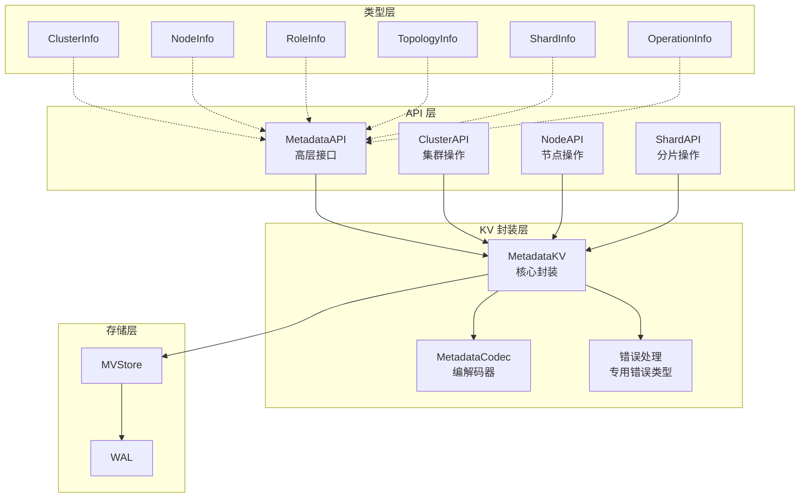

# 【PR全流程文档】Feature - 基于KV映射的元数据管理架构

> **文档说明**：本文档包含「前置规划」和「后置总结」两部分，记录从需求对齐到开发完成的全流程，一个PR对应一份全流程文档，归档后作为项目追溯依据。

---

## 第一部分：前置部分（开工前必完成，架构师评审通过）

### 1. 基础信息（与分支/PR绑定）

| 项目 | 内容 |
|------|------|
| 工作类型 | 新功能开发（Feature） |
| PR编号 | PR-MetadataKV（创建GitHub PR后补充完整） |
| 分支名称 | feature/metadata-kv-implementation |
| 工作主题 | 基于KV映射的元数据管理架构实现 |
| 负责人 | 🤖 核心开发 A |
| 分支创建日期 | 2025-02-10 |
| 计划开工日期 | 待架构师评审通过 |
| 计划CI通过日期 | 待定 |
| 关联需求单号 | 内部需求：元数据管理重构 |
| 架构师评审状态 | ☐ 待评审 ☐ 评审中 ☐ 评审通过 ☐ 需优化（循环记录） |
| 预审批结果 | ☐ 未通过 ☐ 已通过（架构师签字/备注：__________ 2025-__-__ 同意开工） |

### 2. 背景与目标（为什么干）

#### 2.1 背景

**业务场景**：
NexKV 作为分布式 KV 存储系统，需要管理大量元数据（节点、分片、拓扑、角色等）。当前实现存在以下问题：
- 元数据存储散乱，缺乏统一的命名空间管理
- 使用 `map[string]string` 存储元数据，缺乏类型安全
- 没有统一的元数据访问接口，代码重复度高
- Gossip 同步机制与元数据管理耦合，难以扩展

**现有问题**：
1. **命名冲突**：不同类型的元数据使用相同的键前缀（如 `host:`、`node:`），容易冲突
2. **类型不安全**：元数据以 `map[string]string` 存储，访问时需要类型断言，容易出错
3. **版本控制缺失**：虽然有 MVStore 支持 MVCC，但元数据层没有封装版本控制接口
4. **代码重复**：HostManager、TreeCoordinator 等组件都有相似的元数据访问代码

**价值**：
- 提供统一的元数据管理接口，降低代码重复度
- 命名空间隔离，避免键冲突
- 强类型接口，减少类型错误
- 封装 MVCC 版本控制，方便实现一致性机制
- 为 Gossip 同步提供标准化的元数据变更通知接口

#### 2.2 核心目标（可量化、可验证）

1. **功能目标**：
   - 实现 9 个命名空间隔离（Cluster、Node、Role、Topo、Shard、Static、Dynamic、Op、Version）
   - 实现 6 种强类型元数据结构（ClusterInfo、NodeInfo、RoleInfo、TopologyInfo、ShardInfo、OperationInfo）
   - 提供统一的 MetadataKV 封装层
   - 提供类型安全的高层 API 接口

2. **性能目标**：
   - 点查询延迟 < 1ms（P99）
   - 批量查询吞吐 > 100K ops/s
   - 内存开销 < 现有实现的 120%

3. **质量目标**：
   - 单元测试覆盖率 ≥ 85%
   - 关键路径覆盖率 100%
   - Code Review 通过（无 P0/P1 问题）

#### 2.3 明确边界（不做什么，避免范围蔓延）

- **本次不支持**：
  - 不修改 MVStore 的底层实现
  - 不实现新的 Gossip 协议（复用现有机制）
  - 不实现新的 RPC 消息类型（扩展现有类型即可）
  - 不实现跨数据中心的元数据同步

- **本次不优化**：
  - 不优化 MVStore 的存储性能
  - 不实现元数据缓存策略（依赖 MVStore 内存缓存）
  - 不实现元数据加密（后续 PR 考虑）

### 3. 实现方案（怎么干，核心设计）

#### 3.1 整体架构设计



#### 3.2 关键设计点

**1. 命名空间设计**

```go
const (
    NamespaceCluster  = "meta:cluster:"  // 集群级别元数据
    NamespaceNode     = "meta:node:"     // 节点元数据
    NamespaceRole     = "meta:role:"     // 角色元数据（包含 Standby）
    NamespaceTopo     = "meta:topo:"     // 拓扑元数据
    NamespaceShard    = "meta:shard:"    // 分片元数据
    NamespaceStatic   = "meta:static:"   // 静态配置
    NamespaceDynamic  = "meta:dynamic:"  // 动态状态
    NamespaceOp       = "meta:op:"       // 操作记录
    NamespaceVersion  = "meta:version:"  // 版本控制
)
```

**2. MetadataKV 核心接口**

```go
type MetadataKV struct {
    store  wal.MVStore
    hlc    *clock.HLC
    codec  *MetadataCodec
    mu     sync.RWMutex
    closed bool
}

// 核心接口
func (m *MetadataKV) Put(ctx context.Context, ns, key string, value any) error
func (m *MetadataKV) Get(ctx context.Context, ns, key string, value any) error
func (m *MetadataKV) GetVersion(ctx context.Context, ns, key string, hlcTS *clock.HLC, value any) error
func (m *MetadataKV) Delete(ctx context.Context, ns, key string) error
func (m *MetadataKV) Exists(ctx context.Context, ns, key string) (bool, error)
func (m *MetadataKV) ListPrefix(ctx context.Context, ns, prefix string) ([]string, error)
```

**3. 强类型元数据示例**

```go
// ClusterInfo 集群元数据
type ClusterInfo struct {
    ClusterID       string         `msgpack:"cluster_id"`
    ClusterName     string         `msgpack:"cluster_name"`
    ClusterVersion  string         `msgpack:"cluster_version"`
    State           ClusterState   `msgpack:"state"`
    RootNodeIDs     []string       `msgpack:"root_node_ids"`
    TreeDepth       int            `msgpack:"tree_depth"`
    TotalNodes      int            `msgpack:"total_nodes"`
    TotalShards     int            `msgpack:"total_shards"`
    QuorumThreshold int            `msgpack:"quorum_threshold"`
    GossipInterval  time.Duration  `msgpack:"gossip_interval"`
    CreatedAt       time.Time      `msgpack:"created_at"`
    UpdatedAt       time.Time      `msgpack:"updated_at"`
    Version         uint64         `msgpack:"version"`  // MVCC 版本
}
```

**4. 高层 API 接口**

```go
type MetadataAPI struct {
    kv *kvstore.MetadataKV
}

// 集群操作
func (m *MetadataAPI) GetClusterInfo(ctx context.Context, clusterID string) (*types.ClusterInfo, error)
func (m *MetadataAPI) SetClusterInfo(ctx context.Context, info *types.ClusterInfo) error

// 节点操作
func (m *MetadataAPI) GetNodeInfo(ctx context.Context, nodeID string) (*types.NodeInfo, error)
func (m *MetadataAPI) SetNodeInfo(ctx context.Context, info *types.NodeInfo) error
func (m *MetadataAPI) ListNodes(ctx context.Context) ([]*types.NodeInfo, error)
```

**5. 容错设计**

- **错误处理**：定义专用错误类型，支持错误链追踪
- **并发安全**：使用 sync.RWMutex 保护共享状态
- **资源管理**：实现 Close 方法，确保资源释放
- **版本冲突**：通过 MVCC 版本号检测冲突

#### 3.3 元数据映射设计（更新频率 & 一致性要求）

##### 3.3.1 元数据分类矩阵

| 命名空间 | 元数据类型 | 更新频率 | 一致性要求 | 同步机制 | 键格式示例 |
|---------|-----------|---------|-----------|---------|-----------|
| **NamespaceCluster** | 集群配置 | 极低 | 强一致 | Quorum | `meta:cluster:config` |
| **NamespaceNode** | 节点信息 | 低 | 最终一致 | Gossip | `meta:node:{node_id}` |
| **NamespaceRole** | 角色信息 | 低 | 最终一致 | Gossip | `meta:role:{role_id}` |
| **NamespaceTopo** | 拓扑关系 | 中 | 最终一致 | Gossip | `meta:topo:{node_id}` |
| **NamespaceShard** | 分片信息 | 中 | 强一致 | Quorum | `meta:shard:{shard_id}` |
| **NamespaceStatic** | 静态配置 | 极低 | 强一致 | Quorum | `meta:static:max_children` |
| **NamespaceDynamic** | 动态状态 | 高 | 最终一致 | Gossip | `meta:dynamic:{node_id}:cpu` |
| **NamespaceOp** | 操作记录 | 高 | 最终一致 | Gossip | `meta:op:{op_id}` |
| **NamespaceVersion** | 版本控制 | 高 | 强一致 | Quorum | `meta:version:{key}:{ver}` |

##### 3.3.2 更新频率定义

| 频率级别 | 定义 | 典型场景 |
|---------|------|---------|
| **极低** | 每天几次 → 每月几次 | 集群初始化、配置变更 |
| **低** | 每小时几次 → 每天几次 | 节点上下线、角色变更 |
| **中** | 每分钟几次 → 每小时几次 | 分片迁移、拓扑调整 |
| **高** | 每秒几次 → 每分钟几次 | 心跳更新、负载统计 |

##### 3.3.3 一致性要求定义

| 一致性级别 | 定义 | 同步机制 | 典型场景 |
|-----------|------|---------|---------|
| **强一致** | 写入后立即对所有节点可见 | Quorum（多数派确认） | 分片创建、配置变更 |
| **最终一致** | 写入后异步扩散，秒级一致 | Gossip（随机选点） | 节点状态、负载信息 |

##### 3.3.4 详细元数据映射

**NamespaceCluster - 集群级别元数据**：
```
Key:   meta:cluster:config
Value: {ClusterID, ClusterName, ClusterVersion, State, QuorumThreshold, ...}
```

**NamespaceNode - 节点元数据**：
```
Key:   meta:node:node-001
Value: {NodeID, HostID, Role, Addr, ParentID, Level, Status, ...}
```

**NamespaceRole - 角色元数据（含 Standby）**：
```
Key:   meta:role:role-parent-001
Value: {RoleID, RoleType, ActiveNodes, StandbyNodes, CurrentPrimary, ...}
```

**NamespaceTopo - 拓扑元数据**：
```
Key:   meta:topo:node-001
Value: {NodeID, ParentID, ChildrenIDs, Level, Version}
```

**NamespaceShard - 分片元数据**：
```
Key:   meta:shard:shard-001
Value: {ShardID, RangeStart, RangeEnd, ReplicaNodes, State, ...}
```

**NamespaceStatic - 静态配置元数据**：
```
Key:   meta:static:max_children
Value: 10  // MessagePack 编码的 int
```

**NamespaceDynamic - 动态状态元数据**：
```
Key:   meta:dynamic:node-001:cpu
Value: 45.5  // MessagePack 编码的 float
```

**NamespaceOp - 操作记录元数据**：
```
Key:   meta:op:op-20250210-001
Value: {OpID, OpType, ShardID, Status, Progress, StartTime, ...}
```

**NamespaceVersion - 版本控制元数据**：
```
Key:   meta:version:node-001:latest
Value: 1234567890  // MessagePack 编码的 uint64
```

##### 3.3.5 一致性机制集成

**命名空间到一致性映射**：
```go
var consistencyMapping = map[string]ConsistencyLevel{
    NamespaceCluster:  ConsistencyStrong,  // 集群配置：强一致
    NamespaceNode:     ConsistencyEventual, // 节点信息：最终一致
    NamespaceRole:     ConsistencyEventual, // 角色信息：最终一致
    NamespaceTopo:     ConsistencyEventual, // 拓扑关系：最终一致
    NamespaceShard:    ConsistencyStrong,   // 分片信息：强一致
    NamespaceStatic:   ConsistencyStrong,   // 静态配置：强一致
    NamespaceDynamic:  ConsistencyEventual, // 动态状态：最终一致
    NamespaceOp:       ConsistencyEventual, // 操作记录：最终一致
    NamespaceVersion:  ConsistencyStrong,   // 版本控制：强一致
}
```

**自动同步触发**：
```go
func (m *MetadataKV) Put(ctx context.Context, ns, key string, value any) error {
    // 1. 写入 MVStore
    if err := m.store.Put(fullKey, data); err != nil {
        return err
    }

    // 2. 根据命名空间选择同步机制
    if requiresStrongConsistency(ns) {
        go m.quorumSync(ns, key, version)  // 强一致：Quorum 确认
    } else {
        go m.gossipSync(ns, key, version)  // 最终一致：Gossip 扩散
    }

    return nil
}
```

#### 3.4 文件结构

```
internal/metadata/
├── kvstore/                          # 核心：KV 存储封装层
│   ├── namespaces.go                 # 命名空间常量 ✅ 已创建
│   ├── metadata_kv.go                # MetadataKV 核心封装
│   ├── metadata_kv_test.go           # 单元测试
│   ├── codec.go                      # MessagePack 编解码 ✅ 已创建
│   ├── codec_test.go
│   └── errors.go                     # 专用错误类型 ✅ 已创建
│
├── types/                            # 强类型元数据定义
│   ├── cluster_info.go               # ClusterInfo
│   ├── node_info.go                  # NodeInfo
│   ├── role_info.go                  # RoleInfo（含 Standby）
│   ├── topology_info.go              # TopologyInfo
│   ├── shard_info.go                 # ShardInfo
│   ├── operation_info.go             # OperationInfo
│   └── metadata_types_test.go
│
└── api/                              # 高层 API 接口
    ├── metadata_api.go               # 统一 API
    ├── metadata_api_test.go
    ├── cluster_api.go                # 集群 API
    ├── node_api.go                   # 节点 API
    └── shard_api.go                  # 分片 API
```

#### 3.5 与现有系统集成

**TreeCoordinator 集成点**：

```go
type TreeCoordinator struct {
    // 现有字段
    config      *TreeCoordinatorConfig
    localNode   *Node

    // 新增字段
    metadataKV  *kvstore.MetadataKV
    metadataAPI *api.MetadataAPI
}
```

**Gossip 同步集成**：
- 复用现有的 `GossipTopologyChangeRequest` 消息类型
- 扩展消息类型支持元数据同步（可选）
- 元数据变更时自动触发 Gossip 通知

### 4. 风险评估与应对措施

| 风险点 | 影响等级 | 应对措施 |
|--------|----------|----------|
| **性能下降**：新增编解码层可能影响性能 | 中 | 1. 使用 MessagePack 高效序列化<br/>2. 性能基准测试，确保满足目标<br/>3. 可选压缩支持 |
| **兼容性风险**：与现有代码集成可能引入破坏性变更 | 高 | 1. 新架构作为可选层，逐步迁移<br/>2. 保持现有接口不变<br/>3. 数据迁移工具支持 |
| **并发安全**：元数据访问的并发控制复杂度 | 中 | 1. 使用 sync.RWMutex 保护<br/>2. 充分的并发测试<br/>3. Code Review 重点关注 |
| **测试覆盖不足**：复杂接口测试难度大 | 中 | 1. TDD 开发模式<br/>2. 表格驱动测试<br/>3. 集成测试覆盖关键场景 |
| **Gossip 同步延迟**：元数据变更传播延迟 | 低 | 1. 复用现有 Gossip 机制<br/>2. 最终一致性可接受<br/>3. 关键变更使用 Quorum 机制 |

### 5. 架构师评审记录（循环优化，直至通过）

| 评审轮次 | 评审日期 | 评审人（架构师） | 核心评审意见 | 优化措施（含AI辅助修改） | 优化结果 |
|----------|----------|------------------|--------------|--------------------------|----------|
| 第1轮 | 2025-02-10 | 👤 架构师 | 需补充元数据映射说明，包括更新频率和一致性要求 | 1. 新增 3.3 节"元数据映射设计"<br/>2. 添加元数据分类矩阵<br/>3. 定义更新频率和一致性级别<br/>4. 详细说明 9 个命名空间的键值示例<br/>5. 添加一致性机制集成设计 | ☐ 待评审 |

### 6. 预审批确认
> **架构师签字/备注**：__________ 2025-__-__ 该Feature方案可行，风险可控，同意启动开发，需严格按照文档落地，确保CI通过后提交Post总结。

---

## 第二部分：流程节点记录（开发/CI过程追溯）

### 1. 开发过程记录

| 节点 | 完成日期 | 具体内容 | 交付物 |
|------|----------|----------|--------|
| 启动开发 | 待定 | 待架构师评审通过 | 代码提交至分支 |
| 本地测试 | 待定 | 单元测试、集成测试 | 测试报告/覆盖率数据 |
| Post文档编写 | 待定 | 编写后置总结文档 | 第三部分：后置部分 |
| 架构师Post批准 | 待定 | 架构师评审Post文档 | 批准签字/备注 |
| 提交GitHub | 待定 | 推送分支，创建PR | GitHub PR链接 |

### 2. CI流程记录（修复Bug直至通过）

| CI轮次 | 触发时间 | 结果 | 问题详情 | 修复措施 | 修复结果 |
|--------|----------|------|----------|----------|----------|
| 第1轮 | 待定 | 失败/成功 | 待执行 | 待修复 | 待确认 |

### 3. 合并记录

| 合并时间 | 合并方式 | 审批人 | 备注 |
|----------|----------|--------|------|
| 待定 | Squash Merge / Merge Commit | 👤 架构师 | 待补充 |

---

## 第三部分：后置部分（CI通过后编写，总结/成果/ToDo）

### 1. 核心成果总结（开发了啥，结果怎样）

#### 1.1 功能成果
- **已完成**：待开发完成后填写
- **与Pre文档差异**：待开发完成后填写

#### 1.2 性能/数据成果
- **性能数据**：待测试完成后填写
- **测试成果**：待测试完成后填写

#### 1.3 代码/文档交付物

| 类型 | 具体内容 | 链接/路径 |
|------|----------|-----------|
| 代码变更 | 待填写 | GitHub PR链接 |
| 文档更新 | 待填写 | 文档路径 |

### 2. 未完成项与ToDo清单（有哪些没干，后续规划）

#### 2.1 本次PR未完成项
- **未支持**：待开发完成后填写
- **遗留问题**：待开发完成后填写

#### 2.2 ToDo清单（优先级排序）

| 优先级 | 任务内容 | 预估工期 | 关联PR/需求 | 备注 |
|--------|----------|----------|-------------|------|
| 待定 | 待填写 | 待定 | 待定 | 待补充 |

### 3. 下一步工作建议（建议干啥）
1. **优先推进**：待开发完成后填写
2. **监控要点**：待开发完成后填写
3. **运维补充**：待开发完成后填写
4. **后续规划**：待开发完成后填写
5. **反馈收集**：待开发完成后填写

---

## 文档归档信息

| 项目 | 内容 |
|------|------|
| 文档最终版本 | v1.0（Pre）/ v2.0（Post） |
| 归档日期 | 待定 |
| 归档路径 | `docs/06_project_management/pr_documents/feature/2025-02-10_PR-MetadataKV_元数据管理_全流程.md` |
| 后续维护人 | 🤖 核心开发 A |

---

**文档版本**: v1.0 (Pre 文档)
**创建日期**: 2025-02-10
**最后更新**: 2025-02-10
**维护者**: NexKV 开发团队
**状态**: 🔄 待架构师评审
