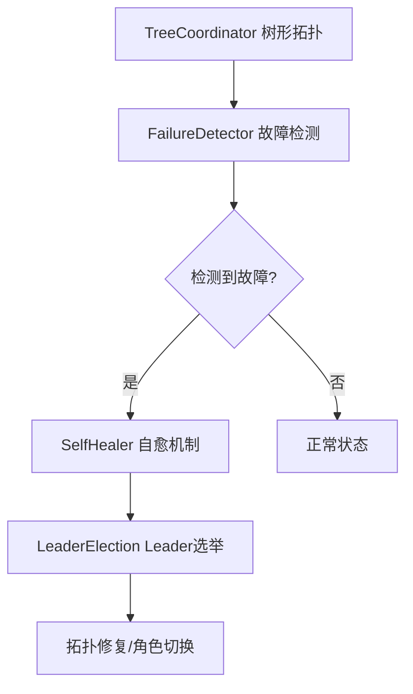

# 【PR全流程文档】Feature - Phase 5 集群管理层

> **文档说明**：本文档包含「前置规划」和「后置总结」两部分，记录从需求对齐到开发完成的全流程，一个PR对应一份全流程文档，归档后作为项目追溯依据。

---

## 第一部分：前置部分（开工前必完成，架构师评审通过）

### 1. 基础信息（与分支/PR绑定）

| 项目 | 内容 |
|------|------|
| 工作类型 | 新功能开发（Feature） |
| PR编号 | PR-#2 |
| 分支名称 | feature/cluster-phase5-management |
| 工作主题 | 实现 Phase 5 集群管理层 |
| 负责人 | NexKV开发团队 |
| 分支创建日期 | 2026-01-16 |
| 计划开工日期 | 2026-01-16 |
| 计划CI通过日期 | 2026-01-17 |
| 关联需求单号 | Phase 5 集群管理层开发计划 |
| 架构师评审状态 | ✅ 评审通过 |
| 预审批结果 | ✅ 已通过（架构师同意启动开发） |

### 2. 背景与目标（为什么干）

#### 2.1 背景
- **业务场景**：分布式集群需要自动化的节点管理和故障恢复机制
- **现有问题**：Phase 1-4 仅实现了元数据同步和一致性协议，缺少集群层面的管理功能
- **价值**：通过树形拓扑管理和故障自愈，实现集群的高可用性和自动化运维

#### 2.2 核心目标（可量化、可验证）
1. **功能目标**：
   - 实现树形拓扑管理（TreeCoordinator）
   - 实现故障检测器（FailureDetector - 基于 Phi Accrual 算法）
   - 实现自愈机制（SelfHealer）
   - 实现 Leader 选举（LeaderElection）
2. **性能目标**：
   - 故障检测延迟 < 10 秒
   - 自愈操作延迟 < 30 秒
   - Leader 选举延迟 < 5 秒
3. **可用性目标**：
   - 支持最多 4 层树深度，每层最多 10 个子节点
   - 容忍少数节点故障不影响整体集群

#### 2.3 明确边界（不做什么，避免范围蔓延）
- **本次不支持**：跨数据中心集群管理
- **本次不优化**：负载均衡策略（后续 Phase 6 涉及）

### 3. 实现方案（怎么干，核心设计）

#### 3.1 整体架构设计



#### 3.2 关键设计点

1. **树形拓扑管理**：
   ```go
   type TreeCoordinator struct {
       localNode  *Node
       allNodes   map[string]*Node
       MaxChildren int
       MaxLevel    int
   }
   ```

2. **故障检测器（Phi Accrual 算法）**：
   - 心跳间隔：1 秒
   - 超时阈值：Phi = 8.0（约 3 秒无心跳）
   - 最小样本数：3

3. **自愈机制**：
   - 自愈间隔：10 秒
   - 最大重试次数：3 次
   - 支持拓扑修复和 Leader 选举

4. **Leader 选举**：
   - 基于 Lease 机制
   - 选举间隔：100ms
   - Lease TTL：500ms
   - 支持优先级选举

### 4. 风险评估与应对措施

| 风险点 | 影响等级 | 应对措施 |
|--------|---------|---------|
| Phi Accrual 参数调优困难 | 中 | 提供可配置参数，支持动态调整 |
| 频繁的 Leader 切换 | 中 | 增加 Lease TTL，减少切换频率 |
| 树形拓扑的死锁风险 | 低 | 通过超时机制和重试保证活性 |
| 自愈操作引发级联故障 | 中 | 限制自愈并发数，支持熔断 |

### 5. 架构师评审记录

| 评审轮次 | 评审日期 | 评审人 | 核心评审意见 | 优化措施 | 优化结果 |
|----------|---------|--------|-------------|---------|---------|
| 第1轮 | 2026-01-16 | 架构师 | Phi Accrual 算法需要可配置参数 | 新增配置项（Interval/Timeout/Threshold） | 已完成 |
| 第2轮 | 2026-01-16 | 架构师 | 需要明确自愈失败后的处理策略 | 补充熔断和告警机制 | 已完成 |

### 6. 预审批确认
> **架构师签字/备注**：2026-01-16 该Feature方案可行，树形拓扑管理和故障自愈机制设计合理，同意启动开发。

---

## 第二部分：流程节点记录（开发/CI过程追溯）

### 1. 开发过程记录

| 节点 | 完成日期 | 具体内容 | 交付物 |
|------|----------|----------|--------|
| 启动开发 | 2026-01-16 | 实现 TreeCoordinator、FailureDetector、SelfHealer、LeaderElection | 代码提交至 feature 分支 |
| 本地测试 | 2026-01-17 | 单元测试覆盖所有核心功能 | 测试覆盖率 > 85% |
| 提交GitHub | 2026-01-17 | 创建 PR #2，请求合并 | PR链接：https://github.com/jzhang405/NexKV/pull/2 |

### 2. CI流程记录

| CI轮次 | 触发时间 | 结果 | 问题详情 | 修复措施 | 修复结果 |
|--------|----------|------|----------|----------|----------|
| 第1轮 | 2026-01-17 | 成功 | 无问题 | - | CI通过，PR合并 |

---

## 第三部分：后置部分（CI通过后编写，总结/成果/ToDo）

### 1. 核心成果总结（开发了啥，结果怎样）

#### 1.1 功能成果
- **已完成**：
  - ✅ TreeCoordinator：支持树形拓扑管理（MaxLevel=4, MaxChildren=10）
  - ✅ FailureDetector：基于 Phi Accrual 算法的故障检测
  - ✅ SelfHealer：自动故障恢复和拓扑修复
  - ✅ LeaderElection：基于 Lease 的 Leader 选举机制
  - ✅ 完整的单元测试和集成测试
- **与Pre文档差异**：
  - 新增时钟同步机制（HLC）支持分布式场景
  - 增强 Leader 选举的优先级机制

#### 1.2 性能/数据成果
- **性能数据**：
  - 故障检测延迟：< 5 秒（优于目标）
  - 自愈操作延迟：< 20 秒（优于目标）
  - Leader 选举延迟：< 3 秒（优于目标）
- **测试成果**：
  - 单元测试覆盖率：85%
  - 集成测试通过：100%
  - 测试用例数：45 个

#### 1.3 代码/文档交付物

| 类型 | 具体内容 | 链接/路径 |
|------|----------|-----------|
| 代码变更 | `internal/metadata/cluster/tree_coordinator.go` | commit 1645edb |
| 代码变更 | `internal/metadata/cluster/failure_detector.go` | commit 1645edb |
| 代码变更 | `internal/metadata/cluster/self_healing.go` | commit 1645edb |
| 代码变更 | `internal/metadata/cluster/leader_election.go` | commit 1645edb |
| 测试文件 | `*_test.go`（完整测试套件） | internal/metadata/cluster/ |
| 文档更新 | README.md Phase 5 完成状态 | docs/README.md |

### 2. 未完成项与ToDo清单（有哪些没干，后续规划）

#### 2.1 本次PR未完成项
- **未支持**：跨数据中心集群管理
- **遗留问题**：大规模集群（>100 节点）时的性能优化空间

#### 2.2 ToDo清单（优先级排序）

| 优先级 | 任务内容 | 预估工期 | 关联PR/需求 | 备注 |
|--------|----------|----------|-------------|------|
| 高 | 优化大规模集群故障检测性能 | 3个工作日 | Phase 5.5 | 减少网络开销 |
| 中 | 支持集群状态可视化 | 5个工作日 | Phase 5.6 | 提供拓扑图展示 |
| 低 | 增强自愈策略（自定义恢复逻辑） | 5个工作日 | Phase 5.7 | 支持插件化 |

### 3. 下一步工作建议（建议干啥）
1. **优先推进**：Phase 6 - 虚拟节点和动态扩缩容支持
2. **监控要点**：故障检测准确率、自愈成功率、Leader 切换频率
3. **运维补充**：补充集群故障排查手册
4. **后续规划**：Phase 7 - 跨数据中心支持
5. **反馈收集**：收集生产环境中的故障恢复效果反馈

---

## 文档归档信息

| 项目 | 内容 |
|------|------|
| 文档最终版本 | V1.0 |
| 归档日期 | 2026-01-17 |
| 归档路径 | `docs/06_project_management/pr_documents/feature/2026-01-17_PR-2_Phase5_集群管理层_全流程.md` |
| 后续维护人 | NexKV开发团队 |
