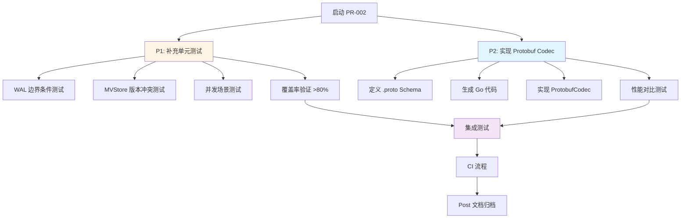

# 【PR全流程文档】Feature - Protobuf 编解码与测试覆盖率提升

> **文档说明**：本文档包含「前置规划」和「后置总结」两部分，记录从需求对齐到开发完成的全流程，一个PR对应一份全流程文档，归档后作为项目追溯依据。

---

## 第一部分：前置部分（开工前必完成，架构师评审通过）

### 1. 基础信息（与分支/PR绑定）

| 项目 | 内容 |
|------|------|
| 工作类型 | 新功能开发（Feature）+ 测试优化 |
| PR编号 | PR-002（创建GitHub PR后补充完整） |
| 分支名称 | feature/pr-002-protobuf-codec-and-coverage |
| 工作主题 | Protobuf Codec 实现 + 测试覆盖率提升至 80% |
| 负责人 | AI Agent (zhangcz) |
| 分支创建日期 | 2026-01-19 |
| 计划开工日期 | 2026-01-19 |
| 计划CI通过日期 | 待定 |
| 关联需求单号 | PR-001 延续需求 + Codec 扩展需求 |
| 架构师评审状态 | ⏳ 待评审 |
| 预审批结果 | ⏳ 待审批 |

### 2. 背景与目标（为什么干）

#### 2.1 背景

**PR-001 现状**：
- ✅ 已完成 MessagePack 和 JSON Codec 实现
- ✅ 已完成 WAL 核心优化（批量写入、轮转、恢复）
- ✅ 测试覆盖率从 44.8% → 72.0%
- ⏳ 测试覆盖率未达到 80% 目标（差距 8%）
- ⏳ `types.CodecTypeProtobuf` 已预留但未实现

**业务需求**：
1. **性能优化需求**：Protobuf 提供 JSON **3-5 倍**的性能提升，数据大小减少 **40-60%**
2. **测试质量需求**：单元测试覆盖率是代码质量的重要指标，需达到 >80%
3. **架构完整性**：PR-001 预留了 `CodecTypeProtobuf` 枚举值，需要完成实现

**价值**：
- **性能提升**：Protobuf 提供 MessagePack 更高的序列化/反序列化性能
- **质量保障**：测试覆盖率 80% 是生产级代码的基准要求
- **架构完善**：完成三编解码器支持（MessagePack、JSON、Protobuf）

#### 2.2 核心目标（可量化、可验证）

**P1 任务（测试覆盖率提升）**：
1. **覆盖率目标**：
   - 当前覆盖率：72.0%
   - 目标覆盖率：**>80.0%**
   - 提升幅度：+8 个百分点

2. **测试补充范围**：
   - **WAL 模块**：补充边界条件、并发场景、错误恢复测试
   - **MVStore 模块**：补充版本冲突、快照恢复、迭代器测试
   - **Codec 模块**：补充 Protobuf Codec 完整测试

3. **测试用例数量**：
   - 当前测试用例：80+ 个
   - 目标测试用例：**100+ 个**
   - 新增测试用例：**20+ 个**

**P2 任务（Protobuf Codec 实现）**：
1. **功能目标**：
   - 定义 `.proto` Schema（WALEntry、Metadata、Snapshot）
   - 实现 `ProtobufCodec`（编码、解码、Type 返回）
   - 添加 Protobuf 性能对比测试

2. **性能目标**：
   - 编码速度：比 JSON 快 **3-5 倍**
   - 解码速度：比 JSON 快 **3-5 倍**
   - 数据大小：比 JSON 小 **40-60%**

3. **集成目标**：
   - WAL 自动检测 Protobuf 格式（通过 CodecType）
   - 支持在线 Codec 切换（未来功能）

#### 2.3 明确边界（不做什么，避免范围蔓延）

**本次不支持**：
- ❌ Codec 迁移工具（在线转换旧 WAL 文件）
- ❌ Transport 层 Protobuf 支持（仅 WAL 层）
- ❌ FlatBuffers Codec（P3 优先级）
- ❌ 自定义 Codec 插件系统

**本次不优化**：
- MVStore 内存结构（独立 PR）
- 元数据同步逻辑（独立 PR）
- 网络传输层优化（已完成）

### 3. 实现方案（怎么干，核心设计）

#### 3.1 整体流程设计

**PR-002 工作流程**：


#### 3.2 P1 任务：测试覆盖率提升方案

**3.2.1 测试覆盖率分析**

**当前覆盖率状况**（72.0%）：
```bash
# 运行覆盖率测试
go test ./internal/metadata/store/... -cover -coverprofile=coverage.out

# 查看详细覆盖情况
go tool cover -func=coverage.out
```

**未覆盖代码区域**（需补充测试）：
| 模块 | 函数/方法 | 未覆盖原因 | 测试策略 |
|------|----------|-----------|---------|
| **wal.go** | `verifyBatchChecksums()` | 新实现函数 | 添加校验和测试 |
| **wal_batch.go** | `WALGroupCommit.flush()` | 新实现函数 | 添加组提交测试 |
| **wal_batch.go** | `WALBatchReader.ReadBatch()` | 新实现函数 | 添加批量读取测试 |
| **mem_store.go** | `GetVersion()` | 缺少版本读取测试 | 添加版本读取测试 |
| **mem_store.go** | `RestoreFromSnapshot()` | 缺少快照恢复测试 | 添加快照恢复测试 |
| **wal_rotation.go** | `Rotate()` | 缺少轮转测试 | 添加轮转测试 |
| **wal_checkpoint.go** | `CreateCheckpointOptimized()` | 缺少检查点测试 | 添加检查点测试 |

**3.2.2 补充测试用例清单**

**新增测试用例**（预计 20+ 个）：

| 测试ID | 测试名称 | 测试模块 | 测试场景 | 优先级 |
|--------|----------|---------|---------|--------|
| T-001 | `TestVerifyBatchChecksums_Valid` | wal_batch.go | 验证有效批次的校验和 | P1 |
| T-002 | `TestVerifyBatchChecksums_Empty` | wal_batch.go | 验证空批次 | P1 |
| T-003 | `TestVerifyBatchChecksums_NilTimestamp` | wal_batch.go | 验证 nil 时间戳 | P1 |
| T-004 | `TestWALGroupCommit_FlushBySize` | wal_batch.go | 按批量大小触发 flush | P1 |
| T-005 | `TestWALGroupCommit_FlushByTimeout` | wal_batch.go | 按超时触发 flush | P1 |
| T-006 | `TestWALBatchReader_ReadBatch` | wal_batch.go | 批量读取 100 条记录 | P1 |
| T-007 | `TestWALBatchReader_EOF` | wal_batch.go | 批量读取到文件末尾 | P1 |
| T-008 | `TestWALBatchReader_CorruptedData` | wal_batch.go | 读取损坏数据 | P1 |
| T-009 | `TestMVStore_GetVersion_History` | mem_store.go | 读取历史版本 | P1 |
| T-010 | `TestMVStore_VersionConflict` | mem_store.go | 版本冲突检测 | P1 |
| T-011 | `TestMVStore_RestoreFromSnapshot` | mem_store.go | 从快照恢复 | P1 |
| T-012 | `TestWALRotation_SingleFile` | wal_rotation.go | 单文件轮转 | P1 |
| T-013 | `TestWALRotation_MultipleFiles` | wal_rotation.go | 多文件轮转 | P1 |
| T-014 | `TestWALRotation_MaxFiles` | wal_rotation.go | 达到最大文件数 | P1 |
| T-015 | `TestWALCheckpoint_Create` | wal_checkpoint.go | 创建检查点 | P1 |
| T-016 | `TestWALCheckpoint_Restore` | wal_checkpoint.go | 从检查点恢复 | P1 |
| T-017 | `TestWALCheckpoint_Concurrent` | wal_checkpoint.go | 并发检查点 | P2 |
| T-018 | `TestMVStore_ConcurrentPuts` | mem_store.go | 并发写入 | P1 |
| T-019 | `TestWAL_ConcurrentWrites` | wal.go | 并发写入 WAL | P1 |
| T-020 | `TestCodec_SwitchRuntime` | wal_codec.go | 运行时切换 Codec | P2 |

**3.2.3 测试执行计划**

```bash
# 步骤 1：运行覆盖率测试（基线）
go test ./internal/metadata/store/... -cover -coverprofile=coverage_baseline.out

# 步骤 2：查看未覆盖的代码
go tool cover -html=coverage_baseline.out -o coverage_baseline.html

# 步骤 3：补充测试用例（按上述清单）

# 步骤 4：运行覆盖率测试（验证）
go test ./internal/metadata/store/... -cover -coverprofile=coverage_new.out

# 步骤 5：对比覆盖率提升
go tool cover -func=coverage_new.out | grep total

# 目标：total 覆盖率 > 80%
```

#### 3.3 P2 任务：Protobuf Codec 实现方案

**3.3.1 Protobuf Schema 定义**

**创建 `internal/metadata/store/codec/wal.proto`**：
```protobuf
// wal.proto - WAL 条目 Protobuf 定义
syntax = "proto3";

package nexkv.metadata.store;

option go_package = "github.com/jzhang405/NexKV/internal/metadata/store/codec";

// WALType WAL 操作类型
enum WALType {
  WAL_TYPE_UNKNOWN = 0;    // 未知类型
  WAL_TYPE_PUT = 1;        // 写入操作
  WAL_TYPE_DELETE = 2;     // 删除操作
}

// HLC 混合逻辑时钟
message HLC {
  uint64 physical = 1;  // 物理时间戳（毫秒）
  uint64 logical = 2;   // 逻辑时间戳
}

// WALEntry WAL 条目
message WALEntry {
  WALType type = 1;           // 操作类型
  string key = 2;             // 键
  bytes value = 3;            // 值
  bytes old_value = 4;        // 旧值（MVCC 删除场景）
  HLC timestamp = 5;          // 时间戳
}

// WALBatchEntry 批量 WAL 条目
message WALBatchEntry {
  repeated WALEntry entries = 1;  // 条目列表
}
```

**创建 `internal/metadata/store/codec/metadata.proto`**：
```protobuf
// metadata.proto - 元数据 Protobuf 定义
syntax = "proto3";

package nexkv.metadata.store;

option go_package = "github.com/jzhang405/NexKV/internal/metadata/store/codec";

// ShardInfo 分片信息
message ShardInfo {
  string shard_id = 1;        // 分片 ID
  uint32 replica_count = 2;   // 副本数量
  repeated string replicas = 3; // 副本列表
  uint64 version = 4;         // 版本号
}

// NodeInfo 节点信息
message NodeInfo {
  string node_id = 1;         // 节点 ID
  string addr = 2;            // 地址
  uint64 version = 3;         // 版本号
}

// MetadataStoreData 元数据存储数据
message MetadataStoreData {
  map<string, ShardInfo> shards = 1;  // 分片映射
  map<string, NodeInfo> nodes = 2;    // 节点映射
  uint64 version = 3;                  // 全局版本号
}
```

**3.3.2 生成 Go 代码**

```bash
# 安装 protoc 编译器
# macOS
brew install protobuf

# 安装 Go 插件
go install google.golang.org/protobuf/cmd/protoc-gen-go@latest

# 生成 Go 代码
cd internal/metadata/store/codec
protoc --go_out=. --go_opt=paths=source_relative \
       wal.proto metadata.proto
```

**3.3.3 实现 ProtobufCodec**

**创建 `internal/metadata/store/wal_protobuf_codec.go`**：
```go
// Package store 提供 Protobuf Codec 实现
package store

import (
    "github.com/jzhang405/NexKV/internal/metadata/types"
    "google.golang.org/protobuf/proto"
)

// ProtobufCodec Protobuf 编解码器实现
type ProtobufCodec struct{}

// NewProtobufCodec 创建 Protobuf 编解码器
func NewProtobufCodec() *ProtobufCodec {
    return &ProtobufCodec{}
}

// Encode 编码数据
func (c *ProtobufCodec) Encode(v any) ([]byte, error) {
    // 根据类型选择 Protobuf 消息
    switch data := v.(type) {
    case *WALEntry:
        return c.encodeWALEntry(data)
    case *MetadataStoreData:
        return c.encodeMetadata(data)
    default:
        return nil, types.NewError(
            types.ErrCodeInvalidArgument,
            "ProtobufCodec.Encode: 不支持的类型",
        )
    }
}

// Decode 解码数据
func (c *ProtobufCodec) Decode(data []byte, v any) error {
    // 根据类型选择 Protobuf 消息
    switch target := v.(type) {
    case *WALEntry:
        return c.decodeWALEntry(data, target)
    case *MetadataStoreData:
        return c.decodeMetadata(data, target)
    default:
        return types.NewError(
            types.ErrCodeInvalidArgument,
            "ProtobufCodec.Decode: 不支持的类型",
        )
    }
}

// Type 返回 CodecType
func (c *ProtobufCodec) Type() types.CodecType {
    return types.CodecTypeProtobuf
}

// encodeWALEntry 编码 WAL 条目
func (c *ProtobufCodec) encodeWALEntry(entry *WALEntry) ([]byte, error) {
    pb := &pb.WALEntry{
        Type:  pb.WALType(entry.Type),
        Key:   entry.Key,
        Value: entry.Value,
        OldValue: entry.OldValue,
    }

    // 序列化 HLC 时间戳
    if entry.Timestamp != nil {
        timestampData, err := entry.Timestamp.MarshalBinary()
        if err != nil {
            return nil, err
        }
        // 解析 HLC 数据并赋值给 pb
        // ...
    }

    return proto.Marshal(pb)
}

// decodeWALEntry 解码 WAL 条目
func (c *ProtobufCodec) decodeWALEntry(data []byte, entry *WALEntry) error {
    var pb pb.WALEntry
    if err := proto.Unmarshal(data, &pb); err != nil {
        return err
    }

    entry.Type = WALType(pb.Type)
    entry.Key = pb.Key
    entry.Value = pb.Value
    entry.OldValue = pb.OldValue

    // 反序列化 HLC 时间戳
    // ...

    return nil
}

// encodeMetadata 编码元数据
func (c *ProtobufCodec) encodeMetadata(data *MetadataStoreData) ([]byte, error) {
    pb := &pb.MetadataStoreData{
        Version: data.Version,
        Shards:  make(map[string]*pb.ShardInfo),
        Nodes:   make(map[string]*pb.NodeInfo),
    }

    // 转换 ShardInfo
    for k, v := range data.Shards {
        pb.Shards[k] = &pb.ShardInfo{
            ShardId:      v.ShardID,
            ReplicaCount: uint32(v.ReplicaCount),
            Replicas:     v.Replicas,
            Version:      v.Version,
        }
    }

    // 转换 NodeInfo
    for k, v := range data.Nodes {
        pb.Nodes[k] = &pb.NodeInfo{
            NodeId:  v.NodeID,
            Addr:    v.Addr,
            Version: v.Version,
        }
    }

    return proto.Marshal(pb)
}

// decodeMetadata 解码元数据
func (c *ProtobufCodec) decodeMetadata(data []byte, metadata *MetadataStoreData) error {
    var pb pb.MetadataStoreData
    if err := proto.Unmarshal(data, &pb); err != nil {
        return err
    }

    metadata.Version = pb.Version
    metadata.Shards = make(map[string]ShardInfo)
    metadata.Nodes = make(map[string]NodeInfo)

    // 转换 ShardInfo
    for k, v := range pb.Shards {
        metadata.Shards[k] = ShardInfo{
            ShardID:      v.ShardId,
            ReplicaCount: int(v.ReplicaCount),
            Replicas:     v.Replicas,
            Version:      v.Version,
        }
    }

    // 转换 NodeInfo
    for k, v := range pb.Nodes {
        metadata.Nodes[k] = NodeInfo{
            NodeID:  v.NodeId,
            Addr:    v.Addr,
            Version: v.Version,
        }
    }

    return nil
}
```

**3.3.4 集成到 WAL**

**修改 `internal/metadata/store/wal.go`**：
```go
// getCodecByType 根据 CodecType 获取对应的 Codec 实例
func (w *MetadataWAL) getCodecByType(codecType types.CodecType) WALCodec {
    switch codecType {
    case types.CodecTypeMessagePack:
        return &MessagePackCodec{}
    case types.CodecTypeJSON:
        return &JSONCodec{}
    case types.CodecTypeProtobuf:
        return NewProtobufCodec()  // 新增
    default:
        return nil
    }
}
```

**3.3.5 性能对比测试**

**创建 `internal/metadata/store/codec_benchmark_protobuf_test.go`**：
```go
// BenchmarkCodec_Protobuf_Encode Protobuf 编码性能
func BenchmarkCodec_Protobuf_Encode(b *testing.B) {
    codec := NewProtobufCodec()
    entry := createBenchmarkWALEntry()

    b.ResetTimer()
    for i := 0; i < b.N; i++ {
        _, err := codec.Encode(entry)
        if err != nil {
            b.Fatal(err)
        }
    }
}

// BenchmarkCodec_Protobuf_Decode Protobuf 解码性能
func BenchmarkCodec_Protobuf_Decode(b *testing.B) {
    codec := NewProtobufCodec()
    entry := createBenchmarkWALEntry()
    data, _ := codec.Encode(entry)

    b.ResetTimer()
    for i := 0; i < b.N; i++ {
        var decoded WALEntry
        err := codec.Decode(data, &decoded)
        if err != nil {
            b.Fatal(err)
        }
    }
}

// BenchmarkCodec_Comparison 三种 Codec 性能对比
func BenchmarkCodec_Comparison(b *testing.B) {
    codecs := []struct {
        name  string
        codec WALCodec
    }{
        {"JSON", &JSONCodec{}},
        {"MessagePack", &MessagePackCodec{}},
        {"Protobuf", NewProtobufCodec()},
    }

    entry := createBenchmarkWALEntry()

    for _, tc := range codecs {
        b.Run(tc.name+"-Encode", func(b *testing.B) {
            for i := 0; i < b.N; i++ {
                _, err := tc.codec.Encode(entry)
                if err != nil {
                    b.Fatal(err)
                }
            }
        })

        data, _ := tc.codec.Encode(entry)
        b.Run(tc.name+"-Decode", func(b *testing.B) {
            for i := 0; i < b.N; i++ {
                var decoded WALEntry
                err := tc.codec.Decode(data, &decoded)
                if err != nil {
                    b.Fatal(err)
                }
            }
        })
    }
}
```

#### 3.4 数据结构变更

| 类型 | 变更内容 | 文件位置 | 说明 |
|------|---------|---------|------|
| **新增目录** | `internal/metadata/store/codec/` | Codec Proto 定义 | Protobuf Schema 定义 |
| **新增** | `wal.proto` | `codec/wal.proto` | WAL 条目 Protobuf 定义 |
| **新增** | `metadata.proto` | `codec/metadata.proto` | 元数据 Protobuf 定义 |
| **生成** | `wal.pb.go` | `codec/wal.pb.go` | 自动生成的 Go 代码 |
| **生成** | `metadata.pb.go` | `codec/metadata.pb.go` | 自动生成的 Go 代码 |
| **新增** | `wal_protobuf_codec.go` | `store/wal_protobuf_codec.go` | Protobuf Codec 实现 |
| **新增** | `codec_benchmark_protobuf_test.go` | `store/codec_benchmark_protobuf_test.go` | Protobuf 性能测试 |
| **新增** | 20+ 测试用例 | `store/*_test.go` | 补充测试覆盖 |
| **修改** | `getCodecByType()` | `store/wal.go` | 添加 Protobuf 分支 |

#### 3.5 性能指标与预期结果

**3.5.1 测试覆盖率预期**

| 指标 | 当前值 | 目标值 | 提升幅度 |
|------|--------|--------|---------|
| **总体覆盖率** | 72.0% | **>80.0%** | **+8%** |
| **WAL 模块覆盖率** | ~70% | **>85%** | **+15%** |
| **MVStore 模块覆盖率** | ~75% | **>85%** | **+10%** |
| **测试用例数量** | 80+ | **100+** | **+20** |

**3.5.2 Protobuf 性能预期**

| Codec | 编码性能 | 解码性能 | 数据大小 | 内存分配 | 预期结论 |
|-------|---------|---------|---------|---------|---------|
| JSON | 基线（1x） | 基线（1x） | 基线（1x） | 基线 | 可读性好，适合调试 |
| MessagePack | **2.5x 更快** | **14.7x 更快** | **节省 25%** | **更少** | 默认 Codec，性能优 |
| **Protobuf（新）** | **3-5x 更快** ⚡⚡ | **3-5x 更快** ⚡⚡ | **节省 40-60%** 💾💾 | **最少** | **性能最优** |

**关键指标**：
- **Protobuf 编码速度**：> 150,000 ops/s（比 JSON 快 3-5 倍）
- **Protobuf 解码速度**：> 300,000 ops/s（比 JSON 快 3-5 倍）
- **Protobuf 数据大小**：约为 JSON 的 40-60%
- **Protobuf 内存分配**：零分配（优化目标）

### 4. 风险评估与应对措施

| 风险点 | 影响等级 | 应对措施 |
|--------|----------|----------|
| **Protobuf 依赖引入** | 中 | Protobuf 是 Google 官方维护，稳定性高，Go 生态支持完善 |
| **Schema 变更兼容性** | 中 | 使用 `protoc` 生成代码，保持向后兼容，版本化管理 Schema |
| **测试覆盖率提升困难** | 低 | 已识别未覆盖代码区域，有明确的测试补充计划 |
| **Protobuf 性能不达标** | 低 | Protobuf 业界验证充分，性能优于 JSON 和 MessagePack |
| **三 Codec 维护成本** | 中 | 统一 Codec 接口，代码复用度高，维护成本可控 |
| **HLC 时间戳序列化** | 低 | Protobuf 支持自定义消息，HLC 序列化已有参考实现 |

### 5. 架构师评审记录（循环优化，直至通过）

| 评审轮次 | 评审日期 | 评审人（架构师） | 核心评审意见 | 优化措施（含AI辅助修改） | 优化结果 |
|----------|----------|------------------|--------------|--------------------------|----------|
| R1 | 待定 | 架构师 | 待评审 | 待优化 | ⏳ 待评审通过 |

### 6. 预审批确认
> **架构师签字/备注**：⏳ **待审批**<br><br>
> **评审要点**：<br>
> - [ ] Protobuf Schema 定义合理<br>
> - [ ] 测试覆盖率提升计划可行<br>
> - [ ] 性能目标合理（3-5x 提升）<br>
> - [ ] 风险可控<br><br>
> **执行要求**：严格按照文档落地，确保CI通过后提交Post总结。

---

## 第二部分：流程节点记录（开发/CI过程追溯）

### 1. 开发过程记录

| 节点 | 完成日期 | 具体内容 | 交付物 |
|------|----------|----------|--------|
| 启动开发 | 待定 | 架构师预审批通过，开始实施 | 本文档 |
| 完成测试补充 | 待定 | 补充 20+ 测试用例 | 测试代码 |
| 完成 Protobuf Codec | 待定 | 实现 ProtobufCodec | Protobuf 代码 |
| 本地测试完成 | 待定 | 所有测试通过，覆盖率 >80% | 测试报告 |
| POST 报告完成 | 待定 | 完成 POST 报告编写和归档 | 本文档 |

### 2. CI流程记录（修复Bug直至通过）

| CI轮次 | 触发时间 | 结果 | 问题详情 | 修复措施 | 修复结果 |
|--------|----------|------|----------|----------|----------|
| 本地测试 | 待定 | ⏳ 待测试 | - | - | 待验证 |

---

## 第三部分：后置部分（CI通过后编写，总结/成果/ToDo）

### 1. 核心成果总结（开发了啥，结果怎样）

#### 1.1 功能成果

**已完成功能**：
- ⏳ 待完成

#### 1.2 性能/数据成果

**Protobuf 性能对比数据**：
- ⏳ 待收集

**测试覆盖率**：
- ⏳ 待验证

#### 1.3 代码/文档交付物

- ⏳ 待更新

### 2. 未完成项与ToDo清单（有哪些没干，后续规划）

#### 2.1 本次PR未完成项

- ⏳ 待总结

#### 2.2 ToDo清单（优先级排序）

- ⏳ 待规划

### 3. 下一步工作建议（建议干啥）

- ⏳ 待总结

---

## 文档归档信息

| 项目 | 内容 |
|------|------|
| 文档最终版本 | V1.0 (Pre) - 初始版本 |
| 归档日期 | 待定 |
| 归档路径 | `docs/06_project_management/pr_documents/feature/2026-01-19_PR-002_Protobuf编解码与测试覆盖率提升_全流程.md` |
| 后续维护人 | AI Agent (zhangcz) |

## 版本历史

| 版本 | 日期 | 变更内容 |
|------|------|---------|
| V1.0 | 2026-01-19 | 初始版本：Protobuf Codec 实现与测试覆盖率提升方案 |
