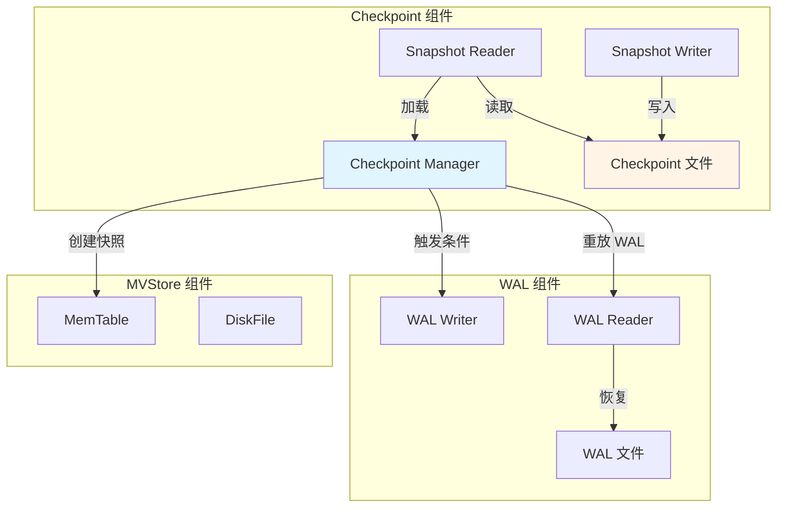
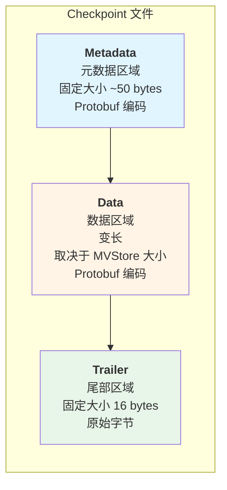
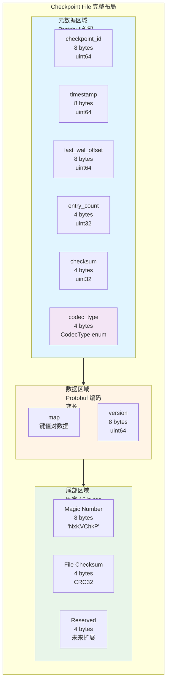
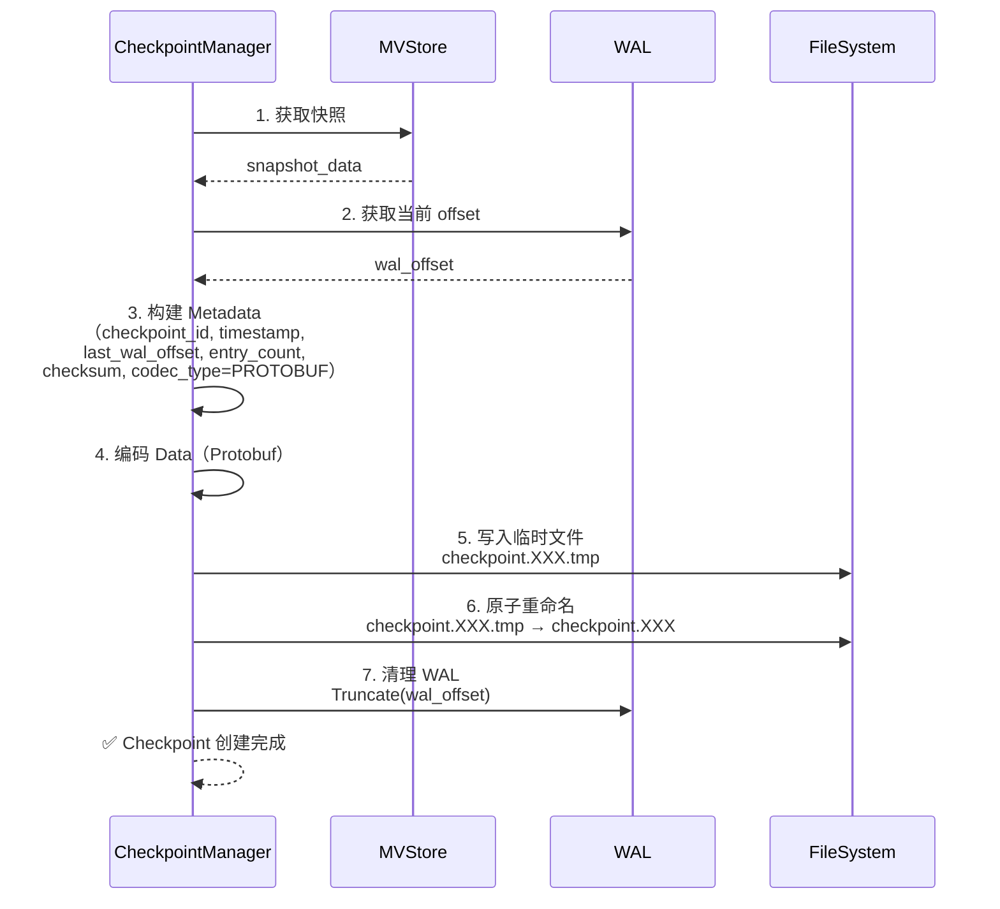
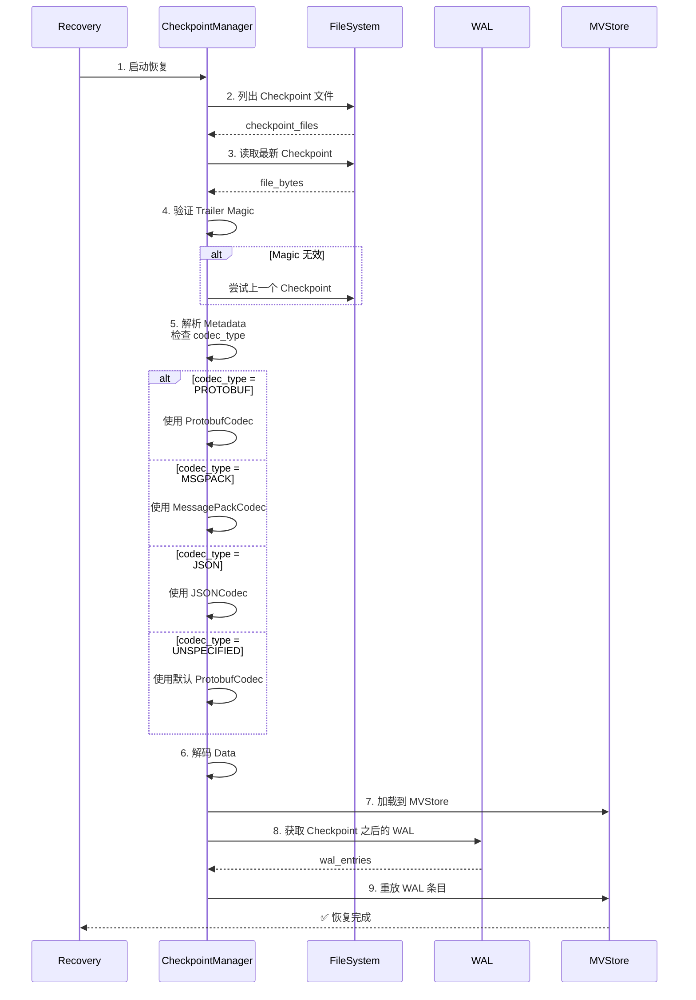
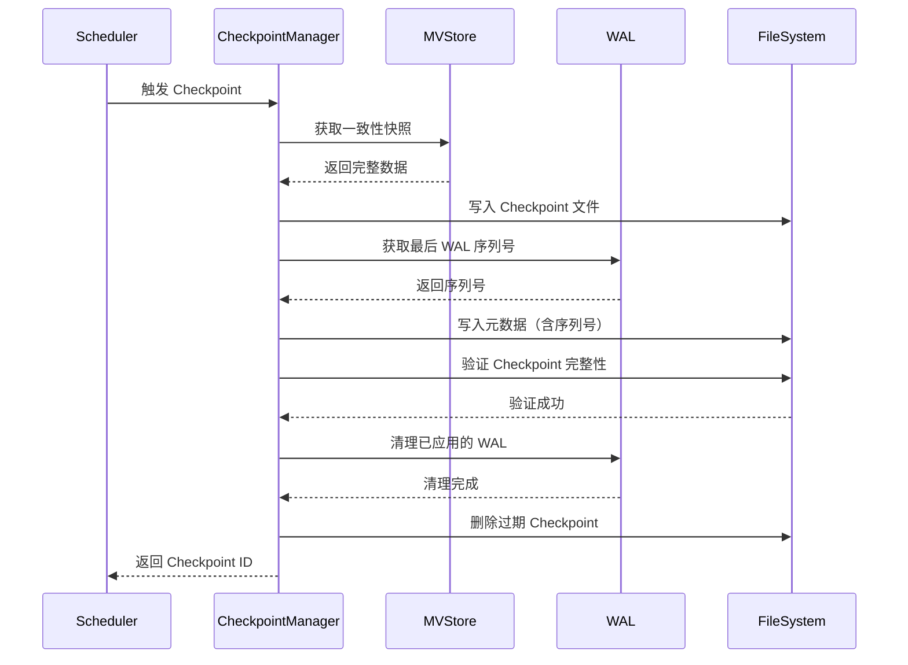
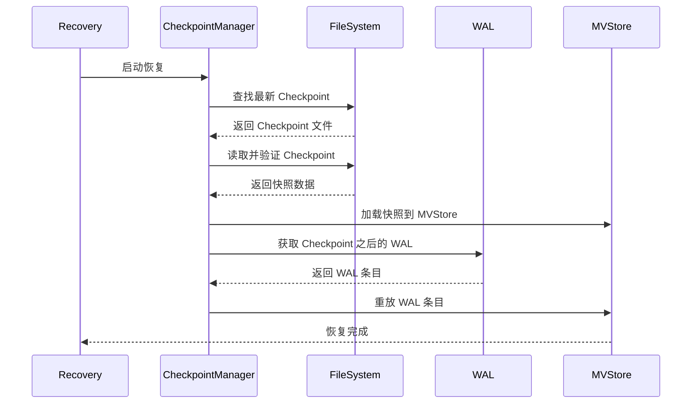

# PR-003: WAL Checkpoint 机制实现 - Pre 文档

> **PR 类型**: Feature (新功能)
> **优先级**: P0 - 生产就绪关键功能
> **预计工期**: 3-5 天
> **创建日期**: 2026-01-19
> **文档版本**: V1.0 (Pre)

---

## 第一部分：前置部分（Pre）

### 1.1 需求背景

**问题陈述**：

当前 WAL (Write-Ahead Log) 实现存在严重缺陷：

1. **WAL 无限增长**：WAL 文件持续追加写入，无定期清理机制
2. **恢复时间过长**：崩溃恢复需要重放完整 WAL，随着 WAL 增长线性增加
3. **磁盘空间风险**：长时间运行后 WAL 文件可能占满磁盘
4. **生产环境不可用**：当前实现仅适合开发/测试，不适合生产部署

**影响范围**：

- **数据可靠性**：WAL 过大时恢复失败风险增加
- **系统性能**：大文件 I/O 影响正常写入性能
- **运维成本**：需要手动清理 WAL，增加运维负担

**业务场景**：

NexKV 作为分布式 KV 存储系统，在生产环境中需要 7×24 小时稳定运行：
- 数据目录磁盘容量有限（通常 100GB-1TB）
- 崩溃恢复时间要求 < 30 秒（当前可能长达数分钟）
- 要求自动化运维，减少人工干预

### 1.2 功能目标

**主要目标**：

1. ✅ **实现 CreateCheckpoint() 方法**
   - 定期创建 MVStore 一致性快照
   - 快照完成后清理已应用的 WAL 条目
   - 支持增量快照（可选，P2）

2. ✅ **实现 RecoverFromCheckpoint() 方法**
   - 崩溃恢复优先从最新 Checkpoint 加载
   - 重放 Checkpoint 之后的 WAL 条目
   - 将恢复时间从分钟级降至秒级（目标 < 10 秒）

3. ✅ **Checkpoint 调度机制**
   - 基于时间间隔（默认 1 小时）
   - 基于 WAL 大小（默认 100MB）
   - 手动触发 Checkpoint（管理接口）

4. ✅ **Checkpoint 验证机制**
   - Checkpoint 完成后校验数据一致性
   - 损坏的 Checkpoint 自动回退到上一个版本
   - 保留最近 N 个 Checkpoint（默认 3 个）

**非目标（本次不实现）**：

- ❌ WAL 轮换机制（独立 PR-004）
- ❌ 增量 Checkpoint（P2 优化）
- ❌ 分布式 Checkpoint（仅单机 Checkpoint）

### 1.3 验收标准

**功能验收**：

1. **Checkpoint 创建**：
   - [ ] 能够成功创建一致性快照
   - [ ] Checkpoint 文件格式正确（Protobuf 定义）
   - [ ] Checkpoint 完成后清理旧 WAL 条目
   - [ ] Checkpoint 失败不影响 MVStore 正常运行

2. **Checkpoint 恢复**：
   - [ ] 崩溃恢复优先加载最新 Checkpoint
   - [ ] 正确重放 Checkpoint 之后的 WAL
   - [ ] 恢复后的数据与崩溃前完全一致
   - [ ] 恢复时间 < 10 秒（100 万条记录）

3. **Checkpoint 调度**：
   - [ ] 定时触发（1 小时）
   - [ ] 基于大小触发（100MB WAL）
   - [ ] 手动触发接口工作正常

4. **Checkpoint 验证**：
   - [ ] Checkpoint 数据完整性校验
   - [ ] 损坏 Checkpoint 自动回退
   - [ ] 保留最近 3 个 Checkpoint

**性能验收**：

1. **Checkpoint 创建性能**：
   - 创建时间 < 5 秒（100 万条记录）
   - 期间不影响正常读写（阻塞 < 100ms）

2. **Checkpoint 恢复性能**：
   - 恢复时间 < 10 秒（100 万条记录）
   - 比纯 WAL 恢复快 10 倍以上

3. **磁盘空间**：
   - Checkpoint 文件大小约为 MVStore 的 50%
   - WAL 清理后释放 80% 以上空间

**测试覆盖率**：

- 单元测试覆盖率 > 85%
- 集成测试覆盖 10+ 场景
- 性能测试验证恢复时间

### 1.4 技术方案设计

#### 架构设计



#### Protobuf Schema 设计

**文件**: `internal/metadata/proto/checkpoint.proto`

```protobuf
syntax = "proto3";
package nexkv.metadata;

option go_package = "./;proto";

// CodecType 编解码器类型（与 types.CodecType 对应）
enum CodecType {
  CODEC_TYPE_UNSPECIFIED = 0;  // 未指定（兼容旧版本）
  CODEC_TYPE_MSGPACK = 1;      // MessagePack 编解码
  CODEC_TYPE_JSON = 2;         // JSON 编解码
  CODEC_TYPE_PROTOBUF = 3;     // Protobuf 编解码（默认）
}

// CheckpointMetadata Checkpoint 元数据
message CheckpointMetadata {
  uint64 checkpoint_id = 1;        // Checkpoint ID（单调递增）
  uint64 timestamp = 2;             // 创建时间戳（Unix 毫秒）
  uint64 last_wal_offset = 3;       // Checkpoint 位置对应的 WAL 偏移量（字节）
  uint32 entry_count = 4;           // 快照包含的条目数量
  uint32 checksum = 5;              // 元数据校验和
  CodecType codec_type = 6;         // 编解码器类型（默认 PROTOBUF）
}

// CheckpointData Checkpoint 数据
message CheckpointData {
  map<string, bytes> data = 1;      // 键值对数据（已编码）
  uint64 version = 2;                // MVStore 版本号
}

// CheckpointFile 完整 Checkpoint 文件
message CheckpointFile {
  CheckpointMetadata metadata = 1;  // 元数据
  CheckpointData data = 2;          // 数据
  bytes trailer = 3;                // 尾部（魔术字 + 校验和）
}
```

#### Checkpoint 文件格式设计

##### 高层结构



##### 完整字节布局



##### 字典视图（字段说明）

| 字段 | 类型 | 大小 | 说明 | 颜色标识 |
|------|------|------|------|---------|
| 🔵 checkpoint_id | uint64 | 8 bytes | Checkpoint 唯一标识，单调递增 | 元数据 |
| 🔵 timestamp | uint64 | 8 bytes | 创建时间戳（Unix 毫秒） | 元数据 |
| 🔵 last_wal_offset | uint64 | 8 bytes | Checkpoint 对应的 WAL 字节偏移量 | 元数据 |
| 🔵 entry_count | uint32 | 4 bytes | 快照包含的键值对数量 | 元数据 |
| 🟢 checksum | uint32 | 4 bytes | 元数据校验和 CRC32 | 验证 |
| 🟣 codec_type | CodecType | 4 bytes | 数据编码类型（默认 PROTOBUF） | 扩展 |
| 🟠 data | map<string,bytes> | 变长 | MVStore 键值对数据（已编码） | 数据 |
| 🟠 version | uint64 | 8 bytes | MVStore 版本号 | 数据 |
| 🟢 magic | bytes[8] | 8 bytes | 文件魔术字 'NxKVChkP' | 验证 |
| 🟢 file_checksum | uint32 | 4 bytes | 文件完整性校验 CRC32 | 验证 |
| 🟣 reserved | uint32 | 4 bytes | 保留字段，未来扩展 | 扩展 |

##### 文件创建流程



##### 恢复流程



##### 大小估算示例

**假设条件**：
- 记录数：100 万条
- 平均 Key：20 bytes
- 平均 Value：100 bytes

**各部分大小**：
- Metadata：~50 bytes（固定）
- Data：~100 MB（1M × 120 bytes × Protobuf 压缩率 ~83%）
- Trailer：16 bytes（固定）

**总计**：约 100 MB/Checkpoint

#### 核心接口设计

**CheckpointManager 接口**：

```go
// CheckpointManager Checkpoint 管理器
type CheckpointManager interface {
    // CreateCheckpoint 创建一致性快照
    // 返回 Checkpoint ID 和错误信息
    CreateCheckpoint(ctx context.Context) (uint64, error)

    // RecoverFromCheckpoint 从 Checkpoint 恢复
    // 返回恢复的 MVStore 实例和错误信息
    RecoverFromCheckpoint(ctx context.Context) (*MVStore, error)

    // GetLatestCheckpoint 获取最新 Checkpoint 信息
    GetLatestCheckpoint() (*CheckpointMetadata, error)

    // ListCheckpoints 列出所有 Checkpoint
    ListCheckpoints() ([]*CheckpointMetadata, error)

    // DeleteCheckpoint 删除指定 Checkpoint
    DeleteCheckpoint(checkpointID uint64) error

    // StartScheduler 启动自动 Checkpoint 调度器
    StartScheduler()

    // StopScheduler 停止调度器
    StopScheduler()
}
```

**Checkpoint 创建流程**：



**Checkpoint 恢复流程**：



#### 调度策略设计

**触发条件**（OR 逻辑）：

1. **时间触发**：
   - 默认间隔：1 小时
   - 配置项：`checkpoint.interval`
   - 从上次 Checkpoint 时间开始计算

2. **大小触发**：
   - 默认阈值：100MB
   - 配置项：`checkpoint.wal_size_threshold`
   - 检查 WAL 文件大小

3. **手动触发**：
   - 管理 API：`CreateCheckpoint()`
   - 立即执行，不等待调度器

**保留策略**：

- 保留最近 N 个 Checkpoint（默认 3 个）
- 配置项：`checkpoint.retention_count`
- 删除时保留元数据记录（用于审计）

#### 关键实现细节

**1. 一致性保证**：

```go
func (m *CheckpointManager) CreateCheckpoint(ctx context.Context) (uint64, error) {
    // 1. 暂停 WAL 写入（获取写锁）
    m.wal.Lock()
    defer m.wal.Unlock()

    // 2. 获取 MVStore 一致性快照
    snapshot, err := m.mvStore.GetSnapshot()
    if err != nil {
        return 0, fmt.Errorf("获取快照失败: %w", err)
    }

    // 3. 记录当前 WAL 序列号
    lastSeq := m.wal.LastSequence()

    // 4. 写入 Checkpoint 文件（临时文件）
    tmpFile := fmt.Sprintf("checkpoint.%d.tmp", time.Now().UnixNano())
    if err := m.writeCheckpointFile(tmpFile, snapshot, lastSeq); err != nil {
        return 0, err
    }

    // 5. 原子重命名（确保完整性）
    checkpointFile := fmt.Sprintf("checkpoint.%d", checkpointID)
    if err := os.Rename(tmpFile, checkpointFile); err != nil {
        return 0, err
    }

    // 6. 清理已应用的 WAL
    if err := m.wal.Truncate(lastSeq); err != nil {
        // 清理失败不影响 Checkpoint 有效性
        log.Warn("WAL 清理失败: %v", err)
    }

    return checkpointID, nil
}
```

**2. Checkpoint 验证**：

```go
func (m *CheckpointManager) validateCheckpoint(file string) error {
    // 1. 检查文件存在性
    if _, err := os.Stat(file); os.IsNotExist(err) {
        return fmt.Errorf("Checkpoint 文件不存在")
    }

    // 2. 读取 Checkpoint 数据
    data, err := os.ReadFile(file)
    if err != nil {
        return fmt.Errorf("读取 Checkpoint 失败: %w", err)
    }

    // 3. 解析 Protobuf
    var pbCheckpoint proto.CheckpointFile
    if err := proto.Unmarshal(data, &pbCheckpoint); err != nil {
        return fmt.Errorf("解析 Checkpoint 失败: %w", err)
    }

    // 4. 验证元数据校验和
    if !m.verifyMetadataChecksum(&pbCheckpoint.Metadata) {
        return fmt.Errorf("元数据校验和失败")
    }

    // 5. 验证魔术字
    if !m.verifyTrailerMagic(pbCheckpoint.Trailer) {
        return fmt.Errorf("尾部魔术字不匹配")
    }

    return nil
}
```

**3. WAL 清理策略**：

```go
func (w *WAL) Truncate(sequence uint64) error {
    w.mu.Lock()
    defer w.mu.Unlock()

    // 1. 确保序列号有效
    if sequence > w.lastSequence {
        return fmt.Errorf("无效的序列号: %d", sequence)
    }

    // 2. 重写 WAL 文件（保留未应用的条目）
    tmpFile := w.file.Name() + ".tmp"
    f, err := os.Create(tmpFile)
    if err != nil {
        return err
    }
    defer f.Close()

    // 3. 写入未应用的 WAL 条目
    for seq := sequence + 1; seq <= w.lastSequence; seq++ {
        entry, ok := w.entries[seq]
        if !ok {
            continue
        }
        if err := w.writeEntry(f, entry); err != nil {
            return err
        }
    }

    // 4. 原子替换
    if err := f.Sync(); err != nil {
        return err
    }
    if err := f.Close(); err != nil {
        return err
    }

    w.file.Close()
    if err := os.Rename(tmpFile, w.file.Name()); err != nil {
        return err
    }

    // 5. 重新打开文件
    w.file, err = os.OpenFile(w.file.Name(), os.O_APPEND|os.O_CREATE|os.O_WRONLY, 0644)
    if err != nil {
        return err
    }

    // 6. 更新内存状态
    for seq := uint64(0); seq <= sequence; seq++ {
        delete(w.entries, seq)
    }

    return nil
}
```

**4. Checkpoint 调度器**：

```go
func (m *CheckpointManager) StartScheduler() {
    m.ticker = time.NewTicker(m.config.Interval)
    go m.scheduleLoop()
}

func (m *CheckpointManager) scheduleLoop() {
    for {
        select {
        case <-m.ticker.C:
            // 时间触发
            m.tryCreateCheckpoint(context.Background())
        case <-m.sizeCheckTicker.C:
            // 大小触发
            if m.getWALSize() > m.config.SizeThreshold {
                m.tryCreateCheckpoint(context.Background())
            }
        case <-m.done:
            return
        }
    }
}

func (m *CheckpointManager) tryCreateCheckpoint(ctx context.Context) {
    // 避免频繁 Checkpoint
    if time.Since(m.lastCheckpointTime) < m.config.MinInterval {
        return
    }

    checkpointID, err := m.CreateCheckpoint(ctx)
    if err != nil {
        log.Error("Checkpoint 创建失败: %v", err)
        return
    }

    log.Info("Checkpoint %d 创建成功", checkpointID)
    m.lastCheckpointTime = time.Now()
}
```

### 1.5 实现计划

#### 任务分解

| 阶段 | 任务 | 预计时间 | 交付物 |
|------|------|---------|--------|
| **阶段 1** | Protobuf Schema 定义与生成 | 0.5 天 | checkpoint.proto、*.pb.go |
| **阶段 2** | CheckpointWriter 实现 | 1 天 | checkpoint_writer.go |
| **阶段 3** | CheckpointReader 实现 | 1 天 | checkpoint_reader.go |
| **阶段 4** | CheckpointManager 实现 | 1 天 | checkpoint_manager.go |
| **阶段 5** | WAL Truncate 实现 | 0.5 天 | wal.go 修改 |
| **阶段 6** | 单元测试编写 | 1 天 | checkpoint_manager_test.go |
| **阶段 7** | 集成测试编写 | 0.5 天 | checkpoint_integration_test.go |
| **阶段 8** | 性能测试与优化 | 0.5 天 | 性能测试报告 |

**总计**: 6 天

#### 文件清单

**新增文件**：

1. `internal/metadata/proto/checkpoint.proto` - Protobuf Schema
2. `internal/metadata/proto/checkpoint.pb.go` - 生成的 Go 代码
3. `internal/metadata/store/checkpoint_manager.go` - Checkpoint 管理器
4. `internal/metadata/store/checkpoint_writer.go` - Checkpoint 写入器
5. `internal/metadata/store/checkpoint_reader.go` - Checkpoint 读取器
6. `internal/metadata/store/checkpoint_manager_test.go` - 单元测试
7. `internal/metadata/store/checkpoint_integration_test.go` - 集成测试

**修改文件**：

1. `internal/metadata/store/wal.go` - 添加 Truncate() 方法
2. `internal/metadata/store/mem_store.go` - 添加 GetSnapshot() 方法
3. `internal/metadata/store/mv_store.go` - 集成 CheckpointManager
4. `internal/metadata/config/loader.go` - 添加 Checkpoint 配置项
5. `Makefile` - 添加 Checkpoint 相关编译目标

### 1.6 风险评估

| 风险项 | 风险等级 | 影响 | 缓解措施 |
|-------|---------|------|---------|
| **Checkpoint 创建阻塞业务** | 🟡 中 | 用户体验下降 | 1. 使用快照读取，避免写锁<br>2. 限制快照时间 < 5 秒 |
| **Checkpoint 损坏无法恢复** | 🔴 高 | 数据丢失 | 1. 写入前校验<br>2. 保留多个版本<br>3. 自动回退到上一个版本 |
| **WAL 清理失败** | 🟡 中 | 磁盘空间未释放 | 1. 原子操作保证<br>2. 失败不影响 Checkpoint 有效性<br>3. 提供手动清理接口 |
| **恢复时间不达标** | 🟡 中 | 性能验收失败 | 1. 性能测试验证<br>2. 优化数据结构<br>3. 考虑增量 Checkpoint |
| **并发安全问题** | 🔴 高 | 数据损坏 | 1. 充分的并发测试<br>2. 使用锁保护共享状态<br>3. 代码 Review |
| **CheckPoint 文件过大** | 🟡 中 | 创建/恢复时间长 | 1. 监控文件大小<br>2. 考虑增量 Checkpoint（P2） |

### 1.7 配置设计

**新增配置项**：

```yaml
# config.yaml
checkpoint:
  # 是否启用 Checkpoint
  enabled: true

  # 自动 Checkpoint 间隔（0 = 禁用定时触发）
  interval: 1h

  # WAL 大小阈值（0 = 禁用大小触发）
  wal_size_threshold: 100MB

  # 最小 Checkpoint 间隔（避免过于频繁）
  min_interval: 10m

  # 保留的 Checkpoint 数量
  retention_count: 3

  # Checkpoint 目录
  dir: "./data/checkpoints"

  # Checkpoint 文件前缀
  file_prefix: "checkpoint"
```

### 1.8 依赖关系

**前置依赖**：

- ✅ PR-002 完成（Protobuf 编解码）
- ✅ MVStore 实现完成
- ✅ WAL 实现完成

**后续依赖**：

- PR-004 (WAL Rotation) - 依赖 Checkpoint 机制
- PR-005 (增量 Checkpoint) - 优化 Checkpoint 性能

**外部依赖**：

- Protobuf 编译器（protoc）
- Go 1.21+ 标准库（context、sync、io 等）

### 1.9 测试策略

#### 单元测试

1. **CheckpointWriter 测试**：
   - ✅ 正常创建 Checkpoint
   - ✅ 元数据正确写入
   - ✅ 数据完整性校验
   - ✅ 并发创建保护

2. **CheckpointReader 测试**：
   - ✅ 正常读取 Checkpoint
   - ✅ 损坏 Checkpoint 处理
   - ✅ 版本回退机制

3. **CheckpointManager 测试**：
   - ✅ CreateCheckpoint() 成功场景
   - ✅ CreateCheckpoint() 失败场景
   - ✅ RecoverFromCheckpoint() 成功场景
   - ✅ GetLatestCheckpoint() 查询
   - ✅ DeleteCheckpoint() 删除

4. **WAL Truncate 测试**：
   - ✅ 正常截断
   - ✅ 截断后数据一致性
   - ✅ 并发截断保护

#### 集成测试

1. **完整恢复流程**：
   - ✅ 写入数据 → 创建 Checkpoint → 崩溃 → 恢复 → 验证数据
   - ✅ 写入数据 → 创建 Checkpoint → 写入更多数据 → 崩溃 → 恢复 → 验证数据

2. **多 Checkpoint 场景**：
   - ✅ 创建多个 Checkpoint → 恢复最新版本
   - ✅ 删除中间 Checkpoint → 恢复最新版本
   - ✅ 损坏最新 Checkpoint → 回退到上一版本

3. **调度器测试**：
   - ✅ 时间触发 Checkpoint
   - ✅ 大小触发 Checkpoint
   - ✅ 手动触发 Checkpoint

#### 性能测试

1. **Checkpoint 创建性能**：
   - 10 万条记录 < 1 秒
   - 100 万条记录 < 5 秒

2. **Checkpoint 恢复性能**：
   - 10 万条记录 < 2 秒
   - 100 万条记录 < 10 秒

3. **对比测试**：
   - Checkpoint 恢复 vs 纯 WAL 恢复
   - 目标：快 10 倍以上

### 1.10 API 接口设计

**管理接口**（新增到 MetadataStore）：

```go
// CreateCheckpoint 手动创建 Checkpoint
func (s *MetadataStore) CreateCheckpoint(ctx context.Context) (uint64, error)

// GetCheckpointInfo 获取 Checkpoint 信息
func (s *MetadataStore) GetCheckpointInfo(ctx context.Context, checkpointID uint64) (*CheckpointInfo, error)

// ListCheckpoints 列出所有 Checkpoint
func (s *MetadataStore) ListCheckpoints(ctx context.Context) ([]*CheckpointInfo, error)

// DeleteCheckpoint 删除指定 Checkpoint
func (s *MetadataStore) DeleteCheckpoint(ctx context.Context, checkpointID uint64) error
```

### 1.11 监控指标

**新增 Prometheus 指标**：

```go
// Checkpoint 创建次数
checkpoint_created_total

// Checkpoint 创建耗时
checkpoint_creation_duration_seconds

// Checkpoint 恢复次数
checkpoint_recovery_total

// Checkpoint 恢复耗时
checkpoint_recovery_duration_seconds

// Checkpoint 文件大小
checkpoint_size_bytes

// Checkpoint 数量
checkpoint_count

// WAL 清理次数
wal_truncate_total

// WAL 清理释放的空间
wal_truncated_bytes_total
```

### 1.12 文档计划

**需要更新的文档**：

1. **设计文档**：
   - `docs/02_design/modules/03_WAL崩溃恢复.md` - 添加 Checkpoint 章节

2. **API 文档**：
   - `docs/02_design/05_API接口设计.md` - 添加 Checkpoint API

3. **运维文档**：
   - `docs/05_deployment_operation/02_运维手册.md` - 添加 Checkpoint 管理
   - `docs/05_deployment_operation/01_部署手册.md` - 添加配置说明

4. **测试文档**：
   - `docs/04_test/02_测试用例文档.md` - 添加 Checkpoint 测试用例

---

## 第二部分：后置部分（Post）

> **说明**：第二部分在开发完成并经过本地测试验证后填写。

### 2.1 实现总结

（开发完成后填写）

### 2.2 成果展示

（开发完成后填写）

### 2.3 性能/数据成果

（开发完成后填写）

### 2.4 测试验证

（开发完成后填写）

### 2.5 遗留问题

（开发完成后填写）

### 2.6 经验教训

（开发完成后填写）

---

## 附录

### A. 参考资料

1. **WAL 设计文档**：`docs/02_design/modules/03_WAL崩溃恢复.md`
2. **MVStore 实现文档**：`docs/02_design/modules/02_存储引擎设计.md`
3. **Protobuf 官方文档**：https://protobuf.dev/
4. **LevelDB Checkpoint 设计**：https://github.com/google/leveldb

### B. 相关 Issue/PR

- PR-002: Protobuf 编解码与测试覆盖率提升
- PR-004: WAL 轮换机制（后续）

### C. 术语表

| 术语 | 全称 | 说明 |
|------|------|------|
| WAL | Write-Ahead Log | 预写日志 |
| Checkpoint | - | 一致性快照 |
| MVStore | Multi-Version Store | 多版本存储 |
| Truncate | - | 截断（清理日志） |

---

**文档变更历史**：

| 版本 | 日期 | 修改人 | 修改内容 |
|------|------|--------|---------|
| V1.0 (Pre) | 2026-01-19 | AI Assistant | 初始版本创建 |

**审批记录**：

| 角色 | 姓名 | 审批日期 | 意见 | 签字 |
|------|------|----------|------|------|
| 架构师 | - | - | ⏳ 待审批 | - |
| 项目经理 | - | - | ⏳ 待审批 | - |
| 测试工程师 | - | - | ⏳ 待审批 | - |

---

**状态**: 📝 待架构师评审
**下一步**: 等待架构师审批 Pre 文档
