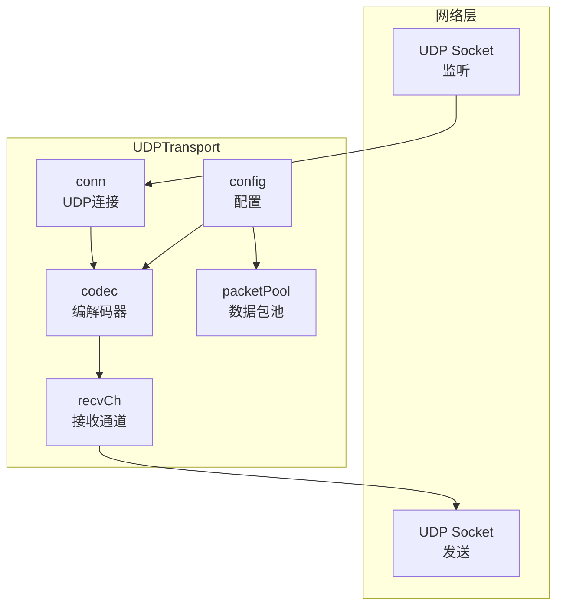

# UDP Transport 实现 - Pre 文档

**PR 编号**：PR-012
**创建日期**：2026-01-20
**负责人**：AI 核心开发
**状态**：待评审

---

## 1. 需求概述

### 1.1 背景
当前 NexKV 项目的 Transport 层仅支持 TCP 传输协议。为了满足不同场景的需求，需要增加 UDP 传输协议支持。

### 1.2 目标
在 `internal/metadata/transport` 中实现 UDP Transport，提供基于 UDP 协议的网络传输层。

### 1.3 适用场景
- **Gossip 协议**：周期性的元数据同步，容忍丢包
- **心跳检测**：节点存活检测，低延迟优于可靠性
- **日志收集**：非关键日志的异步收集
- **集群状态广播**：一对多的状态通知

---

## 2. 功能需求

### 2.1 核心功能
1. **实现 Transport 接口**
   - Start/Stop 生命周期管理
   - Send 发送消息
   - Receive 接收消息通道

2. **UDP 特性支持**
   - 无连接协议（Datagram）
   - 支持单播、广播、多播
   - 消息大小限制（MTU）
   - 无序、不可靠传输

3. **与 TCP Transport 对等**
   - 使用相同的编解码器（Codec）
   - 使用相同的帧格式（Frame）
   - 使用相同的消息类型（MessageType）
   - 配置项保持一致

### 2.2 非功能需求
1. **性能要求**
   - 低延迟：低于 TCP（无需握手）
   - 高吞吐：充分利用网络带宽

2. **可靠性**
   - 接受丢包：上层协议处理重传
   - 无序送达：上层协议处理排序

3. **兼容性**
   - 与现有 Transport 接口完全兼容
   - 可通过配置切换 TCP/UDP

---

## 3. 设计方案

### 3.1 架构设计



### 3.2 核心组件

#### 3.2.1 UDPTransport 结构体

```go
type UDPTransport struct {
    // 配置
    config *TransportConfig
    codec  Codec

    // UDP 连接
    conn     *net.UDPConn
    connPool sync.Map // addr -> *net.UDPConn

    // 分片缓冲区（用于大消息重组）
    fragmentBuf *fragmentBuffer

    // 接收通道
    recvCh   chan Message
    recvOnce sync.Once

    // 生命周期
    started  atomic.Bool
    stopped  atomic.Bool
    stopCh    chan struct{}
    stopOnce  sync.Once
    wg        sync.WaitGroup
}
```

#### 3.2.2 关键设计点

**1. 无连接特性**
- UDP 是无连接协议，无需维护连接池
- 每次发送都是独立的 Datagram
- 接收时直接从 socket 读取

**2. 消息大小限制与分片**
- UDP MTU 限制：通常 1500 字节
- **UDP 层自动分片**：超过 MTU 的消息自动分片发送
- **接收端重组**：接收端根据分片 ID 和序号重组消息
- **分片格式**：
  ```
  +--------+--------+--------+--------+----------+
  | MsgID  | Total  | Index  | DataLen |  Data    |
  | (8B)   | (2B)   | (2B)   |  (4B)   | (≤1400B) |
  +--------+--------+--------+--------+----------+
  ```
- **重组策略**：使用超时机制（默认 5s），超时未收齐的分片丢弃
- **配置 MaxMessageSize 时需考虑 MTU**

**3. 多地址支持**
- 监听单个端口
- 可发送到多个远程地址
- 支持广播（255.255.255.255）

**4. 帧格式复用**
- 使用与 TCP 相同的帧格式
- 13 字节头 + Data
- 支持消息边界检测

### 3.3 接口实现

#### 3.3.1 Start - 启动 UDP Transport

```go
func (t *UDPTransport) Start() error {
    // 1. 监听 UDP 端口
    addr, err := net.ResolveUDPAddr("udp", t.config.ListenAddr)
    conn, err := net.ListenUDP("udp", addr)

    // 2. 启动接收协程
    t.wg.Add(1)
    go t.receiveLoop()

    return nil
}
```

#### 3.3.2 Send - 发送消息（支持分片）

```go
const (
    MaxUDPPacketSize = 1400 // 单个 UDP 包最大数据量（留余量给头）
    FragmentHeaderSize = 16  // MsgID(8) + Total(2) + Index(2) + DataLen(4)
)

func (t *UDPTransport) Send(ctx context.Context, addr string, msg Message) error {
    // 1. 编码消息
    data, err := t.codec.Encode(msg)
    if err != nil {
        return err
    }

    // 2. 封装成帧
    frame := NewFrame(data)
    frameData := frame.Bytes()

    // 3. 分片发送
    udpAddr, _ := net.ResolveUDPAddr("udp", addr)

    // 如果帧大小 <= MaxUDPPacketSize，直接发送
    if len(frameData) <= MaxUDPPacketSize {
        _, err = t.conn.WriteToUDP(frameData, udpAddr)
        return err
    }

    // 4. 大消息分片发送
    return t.sendFragmented(udpAddr, frameData)
}

// sendFragmented 分片发送大消息
func (t *UDPTransport) sendFragmented(addr *net.UDPAddr, data []byte) error {
    // 生成唯一消息 ID（使用 UUID 或 Snowflake）
    msgID := t.generateMessageID()

    // 计算分片数量
    totalFragments := (len(data) + MaxUDPPacketSize - 1) / MaxUDPPacketSize

    for i := 0; i < totalFragments; i++ {
        start := i * MaxUDPPacketSize
        end := start + MaxUDPPacketSize
        if end > len(data) {
            end = len(data)
        }

        // 构造分片数据包
        fragment := t.buildFragment(msgID, uint16(totalFragments), uint16(i), data[start:end])

        // 发送分片
        if _, err := t.conn.WriteToUDP(fragment, addr); err != nil {
            return err
        }
    }

    return nil
}

// buildFragment 构造分片数据包
func (t *UDPTransport) buildFragment(msgID uint64, total, index uint16, data []byte) []byte {
    buf := make([]byte, FragmentHeaderSize+len(data))

    // 分片头
    binary.BigEndian.PutUint64(buf[0:8], msgID)       // MsgID
    binary.BigEndian.PutUint16(buf[8:10], total)      // Total
    binary.BigEndian.PutUint16(buf[10:12], index)     // Index
    binary.BigEndian.PutUint32(buf[12:16], uint32(len(data))) // DataLen

    // 分片数据
    copy(buf[FragmentHeaderSize:], data)

    return buf
}
```

#### 3.3.3 Receive - 接收消息（支持分片重组）

```go
// fragmentBuffer 分片缓冲区
type fragmentBuffer struct {
    mu       sync.RWMutex
    buffers  map[uint64]*partialMessage // msgID -> partialMessage
    timeout  time.Duration
    stopCh   chan struct{}
    cleanupWg sync.WaitGroup
}

// partialMessage 部分消息
type partialMessage struct {
    total   uint16
    received uint16
    fragments [][]byte
    lastUpdate time.Time
}

func (t *UDPTransport) Receive() <-chan Message {
    t.recvOnce.Do(func() {
        t.recvCh = make(chan Message, 100)
        t.fragmentBuf = &fragmentBuffer{
            buffers: make(map[uint64]*partialMessage),
            timeout: 5 * time.Second,
            stopCh:  make(chan struct{}),
        }
        t.fragmentBuf.startCleanup()
    })
    return t.recvCh
}

func (t *UDPTransport) receiveLoop() {
    defer t.wg.Done()

    buf := make([]byte, t.config.MaxMessageSize)

    for {
        select {
        case <-t.stopCh:
            return
        default:
            n, addr, err := t.conn.ReadFromUDP(buf)
            if err != nil {
                continue
            }

            // 处理接收到的数据
            data := buf[:n]
            msg := t.processReceivedData(data)

            if msg != nil {
                // 发送到接收通道
                select {
                case t.recvCh <- msg:
                case <-t.stopCh:
                    return
                }
            }
        }
    }
}

// processReceivedData 处理接收到的数据（分片重组）
func (t *UDPTransport) processReceivedData(data []byte) Message {
    // 检查是否为分片数据包（根据长度判断）
    if len(data) < FragmentHeaderSize {
        // 非分片数据包，直接解帧
        frame, err := t.parseFrame(data)
        if err != nil {
            return nil
        }
        return frame.Message
    }

    // 分片数据包，解析分片头
    msgID := binary.BigEndian.Uint64(data[0:8])
    total := binary.BigEndian.Uint16(data[8:10])
    index := binary.BigEndian.Uint16(data[10:12])
    dataLen := binary.BigEndian.Uint32(data[12:16])
    fragmentData := data[FragmentHeaderSize : FragmentHeaderSize+int(dataLen)]

    // 存储分片并检查是否完整
    return t.fragmentBuf.addFragment(msgID, total, index, fragmentData)
}

// addFragment 添加分片并检查是否完整
func (b *fragmentBuffer) addFragment(msgID uint64, total, index uint16, data []byte) Message {
    b.mu.Lock()
    defer b.mu.Unlock()

    // 获取或创建 partialMessage
    partial, exists := b.buffers[msgID]
    if !exists {
        partial = &partialMessage{
            total:      total,
            received:   0,
            fragments:  make([][]byte, total),
            lastUpdate: time.Now(),
        }
        b.buffers[msgID] = partial
    }

    // 存储分片
    partial.fragments[index] = data
    partial.received++
    partial.lastUpdate = time.Now()

    // 检查是否收齐所有分片
    if partial.received == partial.total {
        // 重组消息
        reassembled := b.reassembleMessage(partial)

        // 删除缓冲区
        delete(b.buffers, msgID)

        return reassembled
    }

    return nil
}

// reassembleMessage 重组完整消息
func (b *fragmentBuffer) reassembleMessage(partial *partialMessage) Message {
    // 计算总长度
    totalLen := 0
    for _, frag := range partial.fragments {
        totalLen += len(frag)
    }

    // 合并所有分片
    reassembled := make([]byte, 0, totalLen)
    for _, frag := range partial.fragments {
        reassembled = append(reassembled, frag...)
    }

    // 解帧
    frame, err := t.parseFrame(reassembled)
    if err != nil {
        return nil
    }

    return frame.Message
}

// startCleanup 启动超时清理协程
func (b *fragmentBuffer) startCleanup() {
    b.cleanupWg.Add(1)
    go func() {
        defer b.cleanupWg.Done()
        ticker := time.NewTicker(time.Second)
        defer ticker.Stop()

        for {
            select {
            case <-ticker.C:
                b.cleanupExpiredFragments()
            case <-b.stopCh:
                return
            }
        }
    }()
}

// cleanupExpiredFragments 清理超时的分片
func (b *fragmentBuffer) cleanupExpiredFragments() {
    b.mu.Lock()
    defer b.mu.Unlock()

    now := time.Now()
    for msgID, partial := range b.buffers {
        if now.Sub(partial.lastUpdate) > b.timeout {
            // 超时，丢弃未收齐的分片
            delete(b.buffers, msgID)
        }
    }
}
```

### 3.4 文件组织

```
internal/metadata/transport/
├── transport.go           # 接口定义（已存在）
├── tcp_transport.go       # TCP 实现（已存在）
├── udp_transport.go       # UDP 实现（新增）
├── udp_transport_test.go  # UDP 测试（新增）
├── frame.go               # 帧格式（已存在）
├── codec.go               # 编解码器（已存在）
└── ...
```

---

## 4. 风险评估

### 4.1 技术风险

| 风险 | 影响 | 概率 | 缓解措施 |
|------|------|------|---------|
| **消息丢失** | 高 | 高 | 上层协议（Gossip）容忍丢包 |
| **消息乱序** | 中 | 中 | 上层协议处理排序 |
| **MTU 限制** | 中 | 中 | 配置合理的消息大小限制 |
| **网络穿透** | 低 | 低 | 需要 STUN/TURN（未来考虑） |
| **性能调优** | 中 | 低 | 使用连接池复用 socket |

### 4.2 兼容性风险

| 风险 | 影响 | 概率 | 缓解措施 |
|------|------|------|---------|
| **接口变更** | 高 | 低 | 完全复用 Transport 接口 |
| **编解码冲突** | 中 | 低 | 使用相同的 Codec 和 Frame |
| **配置兼容** | 低 | 低 | 扩展 TransportConfig |

### 4.3 测试风险

| 风险 | 影响 | 概率 | 缓解措施 |
|------|------|------|---------|
| **并发安全** | 高 | 中 | 使用原子操作和锁保护 |
| **资源泄漏** | 中 | 中 | 优雅关闭，WaitGroup 等待 |
| **边界条件** | 中 | 中 | 完整的单元测试覆盖 |

---

## 5. 实现计划

### 5.1 任务分解

1. **核心实现**（预计 2-3 天）
   - UDPTransport 结构体定义
   - Start/Stop 实现
   - Send 实现
   - Receive 实现

2. **测试验证**（预计 1-2 天）
   - 单元测试（udp_transport_test.go）
   - 集成测试（与 Gossip/Quorum 配合）
   - 性能测试（与 TCP 对比）

3. **文档更新**（预计 0.5 天）
   - 代码注释
   - API 文档

### 5.2 验收标准

- [ ] 实现完整的 Transport 接口
- [ ] 单元测试覆盖率 > 80%
- [ ] 集成测试通过（Gossip/Quorum）
- [ ] 性能测试：延迟 < TCP，吞吐量合理
- [ ] 代码审查通过
- [ ] CI 检查全部通过

---

## 6. 待讨论问题

### 6.1 技术决策

**Q1: UDP 是否需要连接池？**
- **选项 A**：不需要（UDP 无连接）
- **选项 B**：需要（复用 UDPConn）
- **建议**：选项 A，保持简单
- 评审建议：A

**Q2: 消息大小限制如何处理？**
- **选项 A**：强制限制（超过 MTU 拒绝）
- **选项 B**：自动分片（UDP 层分片）
- **原建议**：选项 A，上层协议处理
- **最终决策**：✅ 选项 B（UDP 层自动分片）
- **架构师评审建议**：选择 B，已在文档中详细论述分片方案
- **实现方案**：
  - 分片格式：MsgID(8B) + Total(2B) + Index(2B) + DataLen(4B) + Data(≤1400B)
  - 重组策略：使用 fragmentBuffer 缓冲区，超时 5s 自动清理
  - 并发安全：使用 sync.RWMutex 保护缓冲区

**Q3: 是否需要支持广播？**
- **选项 A**：支持单播即可
- **选项 B**：支持广播（255.255.255.255）
- **建议**：选项 B，便于集群状态通知
- 评审建议：B

### 6.2 架构师评审要点

1. **接口设计**：UDPTransport 是否正确实现了 Transport 接口
2. **性能考虑**：是否满足低延迟、高吞吐要求
3. **可靠性**：上层协议是否正确处理丢包和乱序
4. **配置管理**：TransportConfig 是否需要 UDP 特有配置

---

## 7. 参考资料

- TCP Transport 实现：`internal/metadata/transport/tcp_transport.go`
- Transport 接口定义：`internal/metadata/transport/transport.go`
- Gossip 协议设计：`docs/02_design/protocols/01_一致性协议设计.md`
- UDP 编程最佳实践：https://go.dev/doc/effective_go#section-marshaling

---

**文档版本**：v1.1
**创建日期**：2026-01-20
**更新日期**：2026-01-20
**状态**：📋 待架构师二次评审（已根据评审意见优化）
**更新记录**：
- v1.1：根据架构师评审意见，添加 UDP 分片/重组详细方案
- v1.0：初始版本
