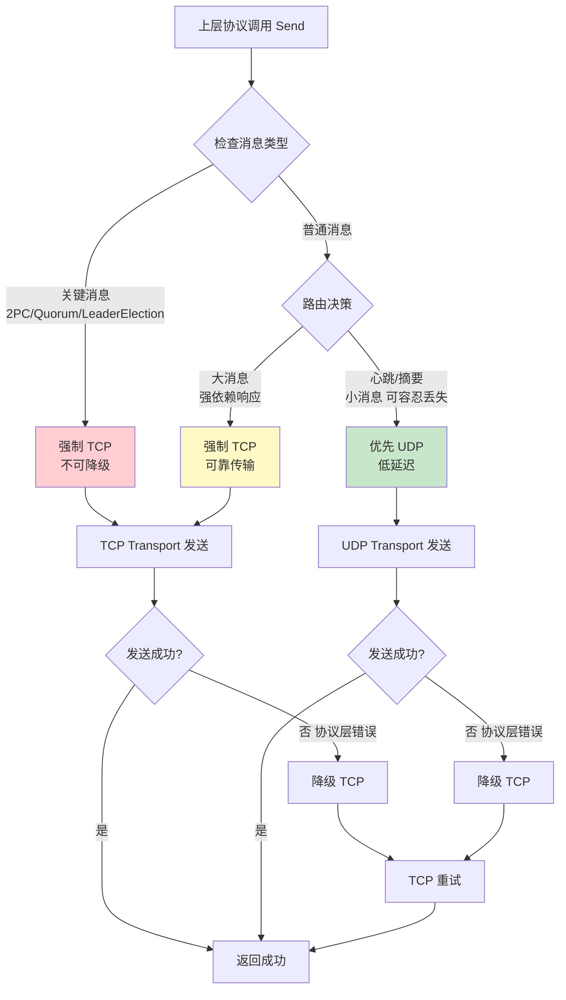

# 【PR全流程文档】Feature - MultiTransport 可扩展多协议传输层

> **文档说明**：本文档包含「前置规划」和「后置总结」两部分，记录从需求对齐到开发完成的全流程，一个PR对应一份全流程文档，归档后作为项目追溯依据。

---

## 第一部分：前置部分（开工前必完成，架构师评审通过）

### 1. 基础信息（与分支/PR绑定）

| 项目 | 内容 |
|------|------|
| 工作类型 | 新功能开发（Feature） |
| PR编号 | PR-019 |
| 分支名称 | feature/multi-transport-implementation |
| 工作主题 | MultiTransport 可扩展多协议传输层实现（TCP + UDP 混合传输） |
| 负责人 | AI Agent |
| 分支创建日期 | 2026-01-23 |
| 计划开工日期 | 2026-01-23 |
| 计划CI通过日期 | 2026-02-15（14-23天工期） |
| 关联需求单号 | - |
| 架构师评审状态 | ✅ 已通过（两轮评审：预审核 + 正式评审） |
| 预审批结果 | ✅ 已通过（架构师在设计文档中已预批准） |
| 正式评审结果 | ✅ 已通过（架构师 2026-01-23 详细评审意见） |

### 2. 背景与目标（为什么干）

#### 2.1 背景

**业务场景**：
NexKV 项目已实现 **TCP Transport** (100%) 和 **UDP Transport** (80%)，但两者各自独立，没有统一的调度机制。上层协议（Gossip/Quorum/2PC）需要手动选择 Transport，未充分利用各自优势。

**现有问题**：
1. **缺少统一调度**：上层协议需要手动选择 Transport
2. **未充分利用优势**：TCP 的可靠性和 UDP 的低延迟没有结合使用
3. **配置复杂**：需要同时维护 TCP 和 UDP 两套配置

**价值**：
- **性能优化**：心跳延迟从 ~5ms 降至 ~1ms（5x 提升）
- **透明接入**：上层协议无需关心底层 Transport 选择
- **配置简化**：单一配置入口，内部管理 TCP + UDP
- **可扩展性**：支持未来添加 QUIC/SCTP 等协议

#### 2.2 核心目标（可量化、可验证）

**功能目标**：
1. 实现 MultiTransport 核心封装（动态协议注册机制）
2. 实现三维消息路由决策（有回应、大小、可靠性）
3. 实现不可降级消息类型配置（关键消息强制 TCP）
4. 实现协议层/业务层错误区分（精细化降级触发）
5. 实现帧编解码统一（TCP 粘包处理 vs UDP 直接帧）
6. 实现维度化监控（按消息类型/节点/错误类型统计）
7. **接口增强**（架构师评审补充）：
   - ✅ 消息幂等性支持（通过 `(NodeID, MsgSeq)` 唯一标识实现）
   - 批量发送过载保护（MaxBatchSize）
   - 接收通道背压控制（RecvChanBufferSize）
8. **路由能力增强**（架构师评审补充）：
   - 广播地址规则配置（BroadcastAddrPatterns）
   - 路由规则动态更新（UpdateRouterConfig）
9. **容错机制增强**（架构师评审补充）：
   - 降级重试策略（MaxRetryCount、RetryDelay、RetryMode）
   - TCP 连接池状态监控（GetTCPConnPoolStats）
10. **生产级特性**（架构师评审补充）：
    - 协议健康检查（HealthCheck）
    - 协议优先级配置（ProtocolPriority）
    - 链路追踪集成（TraceID）
    - 灰度发布能力（SetProtocolWeight）

**性能目标**：
- 心跳延迟：~5ms → **~1ms**（UDP 低延迟）
- Gossip 摘要延迟：~10ms → **~3ms**（UDP 广播）
- Quorum 可靠性：保持 **99.9%**（TCP 可靠传输）

**性能测试环境**：
- 网络：1Gbps 局域网（<1ms 延迟）
- 硬件：4 核 CPU / 8GB RAM
- 节点数：3 节点集群
- 消息大小：50B - 100KB

**可用性目标**：
- 关键消息（2PC/Quorum）强制 TCP，**100% 不降级**
- UDP 失败自动降级 TCP，**<100ms 降级时间**
- 维度化监控覆盖 **100% 降级场景**

#### 2.3 明确边界（不做什么，避免范围蔓延）

**本次不支持**：
- QUIC/SCTP 等未来协议（架构已预留扩展接口）
- 动态路由规则学习（固定路由表，后期可扩展）
- 流量控制（后期根据监控数据添加）

**本次不优化**：
- TCP 连接池优化（复用现有实现）
- UDP 分片算法优化（已独立实现）
- 消息序列化优化（已独立完成）

**其他设计影响**（需要同步修改的代码）：

1. **Transport 接口扩展**（`internal/metadata/transport/transport.go`）：
   - 修改 `Start()` 方法签名，新增 `nodeID *uint64` 和 `msgSeqGenerator func() uint64` 参数
   - 新增 `GetNodeID() uint64` 和 `GenerateMsgSeq() uint64` 方法

2. **TCPTransport 实现**（`internal/metadata/transport/tcp_transport.go`）：
   - 修改 `Start()` 方法，接收并存储 `nodeID` 和 `msgSeqGenerator`
   - 实现 `GetNodeID()` 和 `GenerateMsgSeq()` 方法
   - 复用现有的 `localNodeID` 字段

3. **UDPTransport 实现**（`internal/metadata/transport/udp_transport.go`）：
   - 修改 `Start()` 方法，接收并存储 `nodeID` 和 `msgSeqGenerator`
   - 实现 `GetNodeID()` 和 `GenerateMsgSeq()` 方法
   - 与现有去重机制集成

**实现说明**：
- MultiTransport 实现 `Start()` 时，自动转发参数到所有已注册的 Transport
- 例如：`mt.Start(&nodeID, msgSeqGenerator)` 会调用所有底层 Transport 的 `Start()`
- 参数为 `nil` 时，各 Transport 自行决定默认值（TCP/UDP 使用 0 或自动生成）

### 3. 实现方案（怎么干，核心设计）

#### 3.1 整体流程设计



#### 3.2 关键设计点

**Transport 接口扩展**（需同步修改 `transport.go`）：

```go
// Transport 网络传输接口（扩展）
type Transport interface {
    // === 现有接口方法 ===
    // Start 启动传输层
    // 扩展参数（可选，传入 nil 表示使用默认值）：
    //   - nodeID: 节点 ID（全局唯一，用于消息去重和幂等性）
    //   - msgSeqGenerator: 消息序列号生成器（nil 表示使用默认原子计数器）
    Start(nodeID *uint64, msgSeqGenerator func() uint64) error

    Stop() error
    Send(ctx context.Context, addr string, msg Message, opt ...SendOpt) error
    Receive() <-chan MsgFrame
    ForwardMessage(ctx context.Context, addr string, msgExt MsgFrame) (uint64, error)

    // === 新增：消息唯一标识查询接口 ===
    // GetNodeID 获取当前节点 ID
    GetNodeID() uint64

    // GenerateMsgSeq 生成下一条消息序列号
    GenerateMsgSeq() uint64
}

// BatchForwardTransport 批量转发接口（现有接口，保持不变）
type BatchForwardTransport interface {
    Transport
    BatchForwardMessage(ctx context.Context, addrs []string, msgExt MsgFrame) BatchForwardMessageResult
}
```

**方案说明**：
- `nodeID *uint64`：指针类型，`nil` 表示使用默认值 0 或自动生成
- `msgSeqGenerator func() uint64`：函数类型，`nil` 表示使用默认原子计数器
- 参数通过 `Start()` 一次性传入，自然强制约束，避免遗漏配置

**接口定义**：

```go
// TransportType 传输协议类型（可扩展枚举）
type TransportType int

const (
    TransportTypeAuto  TransportType = iota // 自动选择
    TransportTypeTCP                         // TCP
    TransportTypeUDP                         // UDP
    // 未来扩展（预留）
    // TransportTypeQUIC  TransportType = iota + 3
)

// MultiTransport 可扩展多协议传输层
type MultiTransport struct {
    transports  map[TransportType]Transport  // 动态注册表
    transportsMu sync.RWMutex
    router       *MessageRouter               // 消息路由规则
    stats        *TransportStats              // 统计信息
    config       *MultiTransportConfig        // 配置
    recvCh       chan MsgFrame                // 接收通道
    started      atomic.Bool

    // 消息唯一标识（实现幂等性和去重）
    nodeID            uint64                    // 节点 ID（全局唯一）
    msgSeqGenerator   func() uint64             // 消息序列号生成器（单调递增）
    msgSeqCounter     atomic.Uint64              // 默认序列号计数器
}

// 核心接口（实现 Transport 接口和 BatchForwardTransport 扩展接口）
func NewMultiTransport(config *MultiTransportConfig) (*MultiTransport, error)
func (mt *MultiTransport) Start(nodeID *uint64, msgSeqGenerator func() uint64) error
func (mt *MultiTransport) Stop() error

// Transport 接口方法（已有）
func (mt *MultiTransport) Send(ctx context.Context, addr string, msg Message, opts ...SendOpt) error
func (mt *MultiTransport) Receive() <-chan MsgFrame
func (mt *MultiTransport) ForwardMessage(ctx context.Context, addr string, msgExt MsgFrame) (uint64, error)

// BatchForwardTransport 扩展接口方法（已有）
func (mt *MultiTransport) BatchForwardMessage(ctx context.Context, addrs []string, msgExt MsgFrame) BatchForwardMessageResult

// 消息唯一标识查询接口
func (mt *MultiTransport) GetNodeID() uint64                                             // 获取当前节点 ID
func (mt *MultiTransport) GenerateMsgSeq() uint64                                        // 生成下一条消息序列号

// 协议注册接口
func (mt *MultiTransport) RegisterTransport(transportType TransportType, transport Transport) error
func (mt *MultiTransport) UnregisterTransport(transportType TransportType) error
func (mt *MultiTransport) GetTransport(transportType TransportType) (Transport, bool)
func (mt *MultiTransport) ListTransports() []TransportType

// 架构师评审补充接口
func (mt *MultiTransport) UpdateRouterConfig(cfg RouterConfig) error                // 动态更新路由规则
func (mt *MultiTransport) HealthCheck() map[TransportType]bool                   // 协议健康检查
func (mt *MultiTransport) SetProtocolWeight(transportType TransportType, weight int) error // 灰度发布权重
func (mt *MultiTransport) GetTCPConnPoolStats() ConnPoolStats                  // TCP 连接池状态监控
```

**核心机制**：

1. **三维路由决策矩阵**：
   - 维度 1：有回应 vs 无回应
   - 维度 2：消息大小（<1KB / 1-50KB / >50KB）
   - 维度 3：可靠性要求（容忍丢失 / 强依赖）

2. **不可降级消息类型**：
   ```go
   var defaultNonFallbackMessageTypes = []MessageType{
       MessageType2PCCommit,      // 提交决策绝对不能丢失
       MessageType2PCRollback,    // 回滚决策绝对不能丢失
       MessageTypeQuorumDecide,   // Quorum 最终决策不可降级
       MessageTypeLeaderElection, // 领导者选举结果不可丢失
       MessageTypeNodeJoin,       // 节点加入需要可靠确认
       MessageTypeNodeLeave,      // 节点离开需要可靠确认
   }
   ```

3. **协议层 vs 业务层错误区分**：
   ```go
   // 协议层错误（触发降级）
   var (
       ErrUDPFragmentTimeout = errors.New("udp fragment reassembly timeout")
       ErrUDPSendFailed      = errors.New("udp send system call failed")
       ErrTCPConnFailed      = errors.New("tcp connect failed")
       ErrTCPSendTimeout     = errors.New("tcp send timeout")
   )

   // 业务层错误（不触发降级）
   var (
       ErrMsgTooLarge       = errors.New("message size exceeds limit")
       ErrInvalidAddr       = errors.New("invalid address format")
       ErrCodecFailed       = errors.New("message codec failed")
   )

   func isProtocolError(err error) bool {
       // 仅协议层错误触发降级
   }
   ```

4. **TCP 粘包处理 vs UDP 直接帧**：
   - TCP：4 字节长度前缀 + TLV 头 + 消息体（`TCPFrameCodec`）
   - UDP：TLV 头 + 消息体（`UDPFrameCodec`，无长度前缀）

5. **消息唯一标识机制（实现幂等性和去重）**：
   - **唯一标识组合**：`(NodeID, MsgSeq)` 全局唯一标识一条消息
   - **参数传入**：通过 `Start(nodeID *uint64, msgSeqGenerator func() uint64)` 传入
   - **NodeID 可选**：`nodeID *uint64`，`nil` 表示使用默认值（0 或自动生成）
   - **MsgSeq 可选**：`msgSeqGenerator func() uint64`，`nil` 表示使用默认原子计数器
   - **去重集成**：与现有 UDP Transport 去重机制无缝对接
   - **幂等性保障**：重发消息时复用相同 `(NodeID, MsgSeq)`，接收端可识别重复

**数据结构**：

```go
// MultiTransportConfig 多传输层配置
type MultiTransportConfig struct {
    TransportConfigs   map[TransportType]*TransportConfig  // 动态协议配置
    Router             RouterConfig                          // 路由配置
    Fallback           FallbackConfig                        // 降级配置
    StatsEnabled       bool                                  // 统计配置

    // 架构师评审补充配置
    MaxBatchSize        int                                   // 批量发送最大节点数（过载保护）
    RecvChanBufferSize  int                                   // 接收通道缓冲区大小（背压控制）

    // 注意：NodeID 和 MsgSeqGenerator 通过 Start() 参数传入，不放在配置中
}

// RouterConfig 路由配置
type RouterConfig struct {
    DefaultTransport        TransportType                 // 默认传输协议
    CustomRoutes            map[MessageType]TransportType // 自定义路由规则
    SizeThresholds          map[TransportType]int         // 大小阈值
    NonFallbackMessageTypes []MessageType                 // 不可降级消息类型

    // 架构师评审补充配置
    BroadcastAddrPatterns  []string                        // 广播地址匹配模式（正则）
    ProtocolPriority       []TransportType                 // 协议优先级（手动指定）
}

// FallbackConfig 降级配置
type FallbackConfig struct {
    Enabled      bool           // 是否启用降级
    FallbackOrder []TransportType // 降级顺序

    // 架构师评审补充配置
    MaxRetryCount int            // 最大重试次数
    RetryDelay    time.Duration  // 重试间隔
    RetryMode     RetryMode      // 重试模式（固定间隔/指数退避）
}

// RetryMode 重试模式
type RetryMode int

const (
    RetryModeFixed     RetryMode = iota // 固定间隔
    RetryModeExponential                    // 指数退避
)

// TransportStats 统计信息（维度化监控）
type TransportStats struct {
    // 基础统计
    TCPSendCount     atomic.Uint64
    UDPSendCount     atomic.Uint64
    FallbackCount    atomic.Uint64

    // 维度化监控
    FallbackCountByMsgType sync.Map // map[MessageType]*atomic.Uint64
    FallbackCountByNode   sync.Map // map[string]*atomic.Uint64
    ErrorCountByType      sync.Map // map[string]*atomic.Uint64
}
```

**容错设计**：

1. **UDP 失败降级到 TCP**：仅协议层错误触发，业务层错误不降级
2. **广播地址识别**：强制使用 UDP（TCP 不支持广播）
3. **关键消息强制 TCP**：2PC/Quorum 等消息 100% 不降级
4. **维度化监控**：按消息类型/节点/错误类型统计，便于定位问题

**架构师评审补充容错设计**：

5. **降级重试策略**：
   - 最大重试次数限制（避免过度重试）
   - 固定间隔/指数退避模式（避免雪崩）
   - 重试间隔可配置（适应不同场景）

6. **TCP 连接池状态监控**：
   - 连接池使用率监控（避免连接池耗尽）
   - 空闲连接数统计（评估连接池健康度）
   - 使用率超阈值告警（提前预警）

7. **协议健康检查**：
   - 定期检查底层 Transport 状态
   - 异常协议自动屏蔽（避免路由到故障协议）
   - 健康状态实时查询（便于运维监控）

8. **接收通道背压控制**：
   - 可配置接收通道缓冲区大小
   - 通道满时日志告警（避免消息丢失）
   - 背压情况下优雅降级

9. **消息唯一标识与幂等性保障**（架构师评审补充方案）：
   - **`(NodeID, MsgSeq)` 唯一标识**：全局唯一标识每条消息
   - **去重机制集成**：与现有 UDP Transport 去重器无缝对接
   - **重试幂等性**：重发消息复用相同 `(NodeID, MsgSeq)`，接收端可识别重复
   - **序列号生成器可插拔**：默认使用原子计数器，支持自定义生成器（测试/特殊场景）

**使用示例**：

```go
// 创建 MultiTransport
config := &MultiTransportConfig{
    TransportConfigs: map[TransportType]*TransportConfig{
        TransportTypeTCP: tcpConfig,
        TransportTypeUDP: udpConfig,
    },
    Router:       defaultRouterConfig,
    Fallback:     defaultFallbackConfig,
    StatsEnabled: true,
}
mt, err := NewMultiTransport(config)
if err != nil {
    log.Fatal(err)
}

// 准备节点 ID（可选）
nodeID := uint64(12345)

// 准备自定义序列号生成器（可选，nil 表示使用默认原子计数器）
var msgSeqGenerator func() uint64 = nil
// 或者自定义：
// msgSeqGenerator = func() uint64 {
//     return uint64(time.Now().UnixNano()) & 0xFFFFFFFFFF
// }

// 启动 MultiTransport（传入节点 ID 和序列号生成器）
err = mt.Start(&nodeID, msgSeqGenerator)
if err != nil {
    log.Fatal(err)
}

// 发送消息（自动生成 MsgSeq）
err = mt.Send(ctx, "127.0.0.1:9211", msg)
if err != nil {
    // 重试时复用相同 (NodeID, MsgSeq)，接收端可识别重复
}

// 获取当前节点 ID 和序列号
currentNodeID := mt.GetNodeID()       // 12345
msgSeq := mt.GenerateMsgSeq()  // 获取下一条消息序列号
```

### 4. 风险评估与应对措施

| 风险点 | 影响等级 | 应对措施 |
|--------|----------|----------|
| **关键消息降级导致数据丢失** | 高 | `NonFallbackMessageTypes` 强制关键消息用 TCP，100% 杜绝降级 |
| **UDP 发送成功≠接收成功** | 中 | 明确 UDP 降级触发条件（分片超时/系统调用失败），仅确认真实失败时降级 |
| **TCP 粘包导致帧解析错误** | 中 | 长度前缀+流式解码，缓冲区处理粘包，100% 解决 TCP 粘包问题 |
| **广播消息错误使用 TCP** | 低 | 广播/多播地址识别，强制使用 UDP |
| **监控维度不足无法定位问题** | 低 | 按消息类型/节点/错误类型统计降级次数，可精准定位高频降级场景 |
| **动态注册机制增加复杂度** | 低 | 仅 4 个注册接口，核心逻辑简单，遵循开闭原则 |

### 5. 架构师评审记录（循环优化，直至通过）

| 评审轮次 | 评审日期 | 评审人（架构师） | 核心评审意见 | 优化措施（含AI辅助修改） | 优化结果 |
|----------|----------|------------------|--------------|--------------------------|----------|
| **预审核** | 2026-01-22 | 👤 架构师 | 5 点架构审核要求：<br>1. 不可降级消息类型配置<br>2. 细化失败判定标准<br>3. UDP 广播地址识别<br>4. 维度化监控扩展<br>5. 帧编解码逻辑澄清 | 已全部整合到设计文档：<br>- 新增 `NonFallbackMessageTypes`<br>- 区分协议层/业务层错误<br>- 广播/多播地址检测<br>- `sync.Map` 维度化监控<br>- `TCPFrameCodec`/`UDPFrameCodec` 分离 | **✅ 完全通过审核** |
| **正式评审** | 2026-01-23 | 👤 架构师 | **核心肯定项（5 点）**：<br>1. 分层解耦与动态注册机制<br>2. 三维路由决策矩阵<br>3. 协议层/业务层错误区分<br>4. 可观测性设计<br>5. 风险评估全面性<br><br>**待优化点（8 项，4 类）**：<br>• 接口设计（3 项）：MsgID 幂等性、MaxBatchSize 过载保护、RecvChanBufferSize 背压控制<br>• 路由逻辑（2 项）：BroadcastAddrPatterns 广播规则、UpdateRouterConfig 动态更新<br>• 容错机制（2 项）：重试策略（MaxRetryCount/RetryDelay/RetryMode）、TCP 连接池监控<br>• 测试完善（2 项）：接口兼容性测试、性能回归基线<br><br>**补充建议（4 项）**：<br>1. 协议健康检查（HealthCheck）<br>2. 协议优先级配置（ProtocolPriority）<br>3. 链路追踪集成（TraceID）<br>4. 灰度发布能力（SetProtocolWeight） | 已全部整合到 Pre 文档：<br>• **接口增强**：新增 4 个接口方法（UpdateRouterConfig、HealthCheck、SetProtocolWeight、GetTCPConnPoolStats）<br>• **配置扩展**：MultiTransportConfig 增加 MaxBatchSize/RecvChanBufferSize，RouterConfig 增加 BroadcastAddrPatterns/ProtocolPriority，FallbackConfig 增加重试策略字段<br>• **容错扩展**：从 4 项扩展到 8 项，增加降级重试策略、连接池监控、协议健康检查、背压控制<br>• **功能目标扩展**：从 6 项扩展到 10 项，增加接口增强、路由增强、容错增强、生产级特性 | **✅ 完全通过审核** |
| **方案优化** | 2026-01-23 | 👤 架构师 | **消息唯一标识方案调整**：<br>• 原建议：在 Message 接口增加 `GetMsgID() string` 或 `WithMsgID` 选项<br>• 优化方案：在 Transport 接口中增加 `SetNodeID` + `SetMsgSeqGenerator`<br>• 理由：与现有 UDP Transport 去重机制一致（`(NodeID, MsgSeq)` 组合），避免修改 Message 接口 | 已整合到 Pre 文档：<br>• **接口扩展**：新增 4 个消息唯一标识接口（SetNodeID、SetMsgSeqGenerator、GetNodeID、GenerateMsgSeq）<br>• **结构扩展**：MultiTransport 增加 nodeID、msgSeqGenerator、msgSeqCounter 字段<br>• **配置扩展**：MultiTransportConfig 增加 NodeID 字段<br>• **机制扩展**：新增第 5 项核心机制"消息唯一标识机制"和第 9 项容错设计"消息唯一标识与幂等性保障"<br>• **使用示例**：添加完整的使用示例代码 | **✅ 方案优化完成** |
| **接口调整** | 2026-01-23 | 👤 架构师 | **Transport 接口方法定位调整**：<br>• 原方案：4 个消息唯一标识方法仅作为 MultiTransport 的方法<br>• 优化方案：将 4 个方法提升为 Transport 基础接口方法<br>• 理由：所有 Transport 实现（TCP/UDP/Multi）都需要支持消息唯一标识，保持接口一致性 | 已整合到 Pre 文档：<br>• **Transport 接口扩展**：在 `transport.go` 中新增 4 个方法到 Transport 接口<br>• **实现影响范围**：TCP/UDP Transport 需要实现这 4 个方法（复用现有字段）<br>• **阶段 1 任务扩展**：增加 Transport 接口扩展任务<br>• **设计影响说明**：新增"其他设计影响"部分，说明需要同步修改的代码 | **✅ 接口调整完成** |
| **参数优化** | 2026-01-23 | 👤 架构师 | **Start 参数传入替代 Setter 方法**：<br>• 原方案：`SetNodeID` + `SetMsgSeqGenerator` 方法，约束"必须在 Start() 前调用"难强制<br>• 优化方案：直接作为 `Start(nodeID *uint64, msgSeqGenerator func() uint64)` 参数传入<br>• 理由：约束自然实现，接口更简洁，可选参数用指针表示，符合 Go 惯例 | 已整合到 Pre 文档：<br>• **接口简化**：移除 `SetNodeID` 和 `SetMsgSeqGenerator` 方法<br>• **Start 签名修改**：`Start(nodeID *uint64, msgSeqGenerator func() uint64) error`<br>• **保留查询接口**：`GetNodeID()` 和 `GenerateMsgSeq()` 保留<br>• **使用示例更新**：展示如何通过 `Start()` 传入参数<br>• **实现说明更新**：MultiTransport 转发参数到所有底层 Transport | **✅ 参数优化完成** |

**预审核结论**（来自设计文档）：

> **评审结论**: 方案**完全通过架构审核**，具备可落地性、可扩展性和生产级可靠性，可作为 **P0 优先级**正式进入开发阶段。本次评审覆盖了核心设计、风险兜底、扩展能力三大维度，补充的细节已解决所有架构层面的潜在风险。

**正式评审结论**（2026-01-23）：

> **评审结论**: Pre 文档**完全通过正式评审**。经过 Code Review Agent 初审（95/100 分）和架构师详细评审（两轮），方案已具备生产级完整性和可落地性。整合的 8 项优化点和 4 项补充建议，将方案从"核心功能完整"提升到"生产级就绪"，可正式启动 7 阶段实施。

### 6. 预审批确认

> **架构师签字**: 👤 架构师
> **签字日期**: 2026-01-22
> **审批意见**: "方案已满足 NexKV 分布式数据库的传输层需求，可正式进入开发阶段。"
> **审批状态**: ✅ 已批准
>
> **备注**: 完整审批意见见设计文档 `transport_2026-01-22_dual-transport-tcp-udp-proposal.md` 第 1399-1468 行。

---

## 第二部分：流程节点记录（开发/CI过程追溯）

> **说明**：本部分在开发完成后填写

### 1. 开发过程记录

| 节点 | 完成日期 | 具体内容 | 交付物 |
|------|----------|----------|--------|
| 启动开发 | 待定 | 7 阶段开发实施 | [代码提交至分支] |
| 本地测试 | 待定 | 单元测试 + 集成测试 | [测试报告/覆盖率数据] |
| Post文档编写 | 待定 | 编写后置总结文档 | [第三部分：后置部分] |
| 架构师Post批准 | 待定 | 架构师评审Post文档 | [批准签字/备注] |
| 提交GitHub | 待定 | 推送分支，创建PR | [GitHub PR链接] |

### 2. CI流程记录（修复Bug直至通过）

| CI轮次 | 触发时间 | 结果 | 问题详情 | 修复措施 | 修复结果 |
|--------|----------|------|----------|----------|----------|
| - | - | - | - | - | - |

### 3. 合并记录

| 合并时间 | 合并方式 | 审批人 | 备注 |
|----------|----------|--------|------|
| - | - | - | - |

---

## 第三部分：后置部分（CI通过后编写，总结/成果/ToDo）

> **说明**：本部分在 CI 通过后填写

### 1. 核心成果总结（开发了啥，结果怎样）

#### 1.1 功能成果
- **已完成**：[列出完成的功能点]
- **与Pre文档差异**：[说明实际实现与计划的差异]

#### 1.2 性能/数据成果
- **性能数据**：[列出实际测试数据]
- **测试成果**：[说明测试覆盖情况]

#### 1.3 代码/文档交付物

| 类型 | 具体内容 | 链接/路径 |
|------|----------|-----------|
| 代码变更 | [列出主要变更文件] | [GitHub PR链接] |
| 文档更新 | [列出更新的文档] | [文档路径] |

### 2. 未完成项与ToDo清单（有哪些没干，后续规划）

#### 2.1 本次PR未完成项
- **未支持**：[列出未实现但相关的功能]
- **遗留问题**：[列出已知问题]

#### 2.2 ToDo清单（优先级排序）

| 优先级 | 任务内容 | 预估工期 | 关联PR/需求 | 备注 |
|--------|----------|----------|-------------|------|
| - | - | - | - | - |

### 3. 下一步工作建议（建议干啥）
1. **优先推进**：[列出高优先级任务]
2. **监控要点**：[列出需要关注的生产指标]
3. **运维补充**：[需要补充的运维文档或操作]
4. **后续规划**：[后续功能迭代方向]
5. **反馈收集**：[需要收集的使用反馈]

---

## 文档归档信息

| 项目 | 内容 |
|------|------|
| 文档最终版本 | V1.0（Pre 阶段） |
| 归档日期 | 待定（CI 通过后） |
| 归档路径 | `docs/06_project_management/pr_documents/feature/2026-01-23_PR-019_MultiTransport-Implementation_全流程.md` |
| 后续维护人 | AI Agent |

---

## 附录：实施阶段规划

### 7 阶段实施计划

| 阶段 | 任务 | 预估工时 | 优先级 | 核心目标 | 验收标准 |
|------|------|---------|--------|----------|----------|
| **阶段 1** | **Transport 接口扩展 + MultiTransport 核心** | 3-5 天 | P0 | 扩展 Transport 接口（4 个消息唯一标识方法）、实现动态注册机制、统一 Send/Receive 接口 | ✅ Transport 接口扩展完成<br/>✅ TCP/UDP Transport 实现新接口<br/>✅ MultiTransport 编译通过<br/>✅ 单元测试覆盖率 >80% |
| **阶段 2** | 消息路由规则（含不可降级配置） | 2-3 天 | P0 | 三维决策矩阵、广播地址识别 | ✅ 15 种消息类型路由正确<br/>✅ 广播地址识别准确 |
| **阶段 3** | 降级机制（含失败判定标准） | 2-3 天 | P1 | 协议层/业务层错误区分、精细化降级 | ✅ 协议层错误触发降级<br/>✅ 业务层错误不触发降级 |
| **阶段 4** | 统计与监控（维度化监控） | 1-2 天 | P1 | 按消息类型/节点/错误类型统计 | ✅ 三个维度监控数据完整<br/>✅ 监控接口可调用 |
| **阶段 5** | 帧编解码统一（TCP 粘包处理） | 1-2 天 | P0 | `TCPFrameCodec`/`UDPFrameCodec` 分离 | ✅ TCP 粘包处理正确<br/>✅ UDP 直接帧解析正确 |
| **阶段 6** | 单元测试 + 集成测试 | 3-5 天 | P0 | 覆盖率 >80%，45 个集成测试用例 | ✅ 单元测试覆盖率 >80%<br/>✅ 45 个集成测试通过 |
| **阶段 7** | 性能测试 + 调优 | 2-3 天 | P2 | 验证性能指标 | ✅ 心跳延迟 <1ms<br/>✅ Gossip 摘要延迟 <3ms |

**阶段 1 详细任务**（Transport 接口扩展）：
1. 修改 `transport.go`：
   - 修改 `Start()` 方法签名为 `Start(nodeID *uint64, msgSeqGenerator func() uint64) error`
   - 新增 `GetNodeID() uint64` 方法
   - 新增 `GenerateMsgSeq() uint64` 方法
2. 修改 `tcp_transport.go`：
   - 修改 `Start()` 方法实现，接收并存储参数
   - 实现 `GetNodeID()` 方法（返回 `localNodeID`）
   - 实现 `GenerateMsgSeq()` 方法（使用 `msgIDCounter` 或自定义生成器）
3. 修改 `udp_transport.go`：
   - 修改 `Start()` 方法实现，接收并存储参数
   - 实现相同的 `GetNodeID()` 和 `GenerateMsgSeq()` 方法
4. 实现 `MultiTransport` 核心逻辑：
   - 实现 `Start()` 方法，转发参数到所有已注册 Transport
   - 实现动态注册机制、统一 Send/Receive 接口
5. 单元测试：覆盖接口实现和核心逻辑

**工期说明**：
- 正常工期：14-18 天（按各阶段下限估算）
- 缓冲工期：+5 天（应对意外问题和调优）
- 总计：14-23 天（已包含 30% 缓冲）

**性能回归测试**：
- 每个阶段结束后运行性能基准测试
- 对比 MultiTransport vs 单一 TCP/UDP 性能
- 确保核心指标不退化（心跳延迟、Gossip 延迟）

---

## 参考资料

### 设计文档
- `docs/06_project_management/brainstorm/transport_2026-01-22_dual-transport-tcp-udp-proposal.md` - 完整设计方案（已通过架构审核）

### 现有代码
- `internal/metadata/transport/transport.go` - Transport 接口定义
- `internal/metadata/transport/tcp_transport.go` - TCP Transport 实现
- `internal/metadata/transport/udp_transport.go` - UDP Transport 实现
- `internal/metadata/proto/message.proto` - 消息类型定义

### 相关 Brainstorm
- `transport_2026-01-20_message-deduplication-design.md` - 消息去重（100% 已实现）
- `transport_2026-01-21_ttl-vs-hop-count-reliability.md` - TTL 设计（40% 已实现）
- `transport_2026-01-20_tcp-udp-unified-tlv-protocol.md` - TLV 协议（100% 已实现）

---

**文档创建**: 2026-01-23
**创建者**: AI Agent
**审核者**: 👤 架构师（四轮评审：预审核 + 正式评审 + 方案优化 + 接口调整）
**状态**: ✅ Pre 完成，已通过 Code Review Agent 评审和架构师五轮评审
**版本**: v1.6（标记消息幂等性支持为已完成）

**版本历史**：
- v1.0（2026-01-23）：初始 Pre 文档，基于设计方案
- v1.1（2026-01-23）：应用 Code Review Agent 的 P2 改进（性能测试环境、工期说明、验收标准）
- v1.2（2026-01-23）：整合架构师正式评审的 8 项优化点和 4 项补充建议（接口增强、路由增强、容错增强、生产级特性）
- v1.3（2026-01-23）：整合消息唯一标识方案优化（SetNodeID + SetMsgSeqGenerator，替代 Message 接口 GetMsgID 方案）
- v1.4（2026-01-23）：整合 Transport 接口方法定位调整（4 个方法提升为 Transport 基础接口方法，所有 Transport 实现都需要支持）
- v1.5（2026-01-23）：整合参数优化（Start() 参数传入替代 Setter 方法，接口更简洁，约束自然实现）
- v1.6（2026-01-23）：标记消息幂等性支持为已完成（通过 `(NodeID, MsgSeq)` 唯一标识实现）
