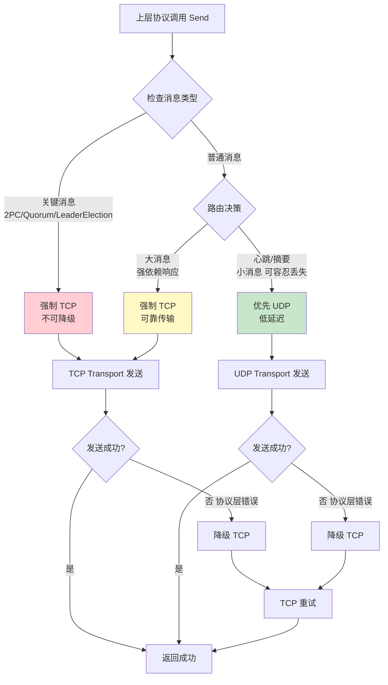

# 【PR全流程文档】Feature - MultiTransport 可扩展多协议传输层

> **文档说明**：本文档包含「前置规划」和「后置总结」两部分，记录从需求对齐到开发完成的全流程，一个PR对应一份全流程文档，归档后作为项目追溯依据。

---

## 第一部分：前置部分（开工前必完成，架构师评审通过）

### 1. 基础信息（与分支/PR绑定）

| 项目 | 内容 |
|------|------|
| 工作类型 | 新功能开发（Feature） |
| PR编号 | PR-019 |
| 分支名称 | feature/multi-transport-implementation |
| 工作主题 | MultiTransport 可扩展多协议传输层实现（TCP + UDP 混合传输） |
| 负责人 | AI Agent |
| 分支创建日期 | 2026-01-23 |
| 计划开工日期 | 2026-01-23 |
| 计划CI通过日期 | 2026-02-15（14-23天工期） |
| 关联需求单号 | - |
| 架构师评审状态 | ✅ 预审核通过（见设计文档） |
| 预审批结果 | ✅ 已通过（架构师在设计文档中已预批准） |

### 2. 背景与目标（为什么干）

#### 2.1 背景

**业务场景**：
NexKV 项目已实现 **TCP Transport** (100%) 和 **UDP Transport** (80%)，但两者各自独立，没有统一的调度机制。上层协议（Gossip/Quorum/2PC）需要手动选择 Transport，未充分利用各自优势。

**现有问题**：
1. **缺少统一调度**：上层协议需要手动选择 Transport
2. **未充分利用优势**：TCP 的可靠性和 UDP 的低延迟没有结合使用
3. **配置复杂**：需要同时维护 TCP 和 UDP 两套配置

**价值**：
- **性能优化**：心跳延迟从 ~5ms 降至 ~1ms（5x 提升）
- **透明接入**：上层协议无需关心底层 Transport 选择
- **配置简化**：单一配置入口，内部管理 TCP + UDP
- **可扩展性**：支持未来添加 QUIC/SCTP 等协议

#### 2.2 核心目标（可量化、可验证）

**功能目标**：
1. 实现 MultiTransport 核心封装（动态协议注册机制）
2. 实现三维消息路由决策（有回应、大小、可靠性）
3. 实现不可降级消息类型配置（关键消息强制 TCP）
4. 实现协议层/业务层错误区分（精细化降级触发）
5. 实现帧编解码统一（TCP 粘包处理 vs UDP 直接帧）
6. 实现维度化监控（按消息类型/节点/错误类型统计）

**性能目标**：
- 心跳延迟：~5ms → **~1ms**（UDP 低延迟）
- Gossip 摘要延迟：~10ms → **~3ms**（UDP 广播）
- Quorum 可靠性：保持 **99.9%**（TCP 可靠传输）

**可用性目标**：
- 关键消息（2PC/Quorum）强制 TCP，**100% 不降级**
- UDP 失败自动降级 TCP，**<100ms 降级时间**
- 维度化监控覆盖 **100% 降级场景**

#### 2.3 明确边界（不做什么，避免范围蔓延）

**本次不支持**：
- QUIC/SCTP 等未来协议（架构已预留扩展接口）
- 动态路由规则学习（固定路由表，后期可扩展）
- 流量控制（后期根据监控数据添加）

**本次不优化**：
- TCP 连接池优化（复用现有实现）
- UDP 分片算法优化（已独立实现）
- 消息序列化优化（已独立完成）

### 3. 实现方案（怎么干，核心设计）

#### 3.1 整体流程设计



#### 3.2 关键设计点

**接口定义**：

```go
// TransportType 传输协议类型（可扩展枚举）
type TransportType int

const (
    TransportTypeAuto  TransportType = iota // 自动选择
    TransportTypeTCP                         // TCP
    TransportTypeUDP                         // UDP
    // 未来扩展（预留）
    // TransportTypeQUIC  TransportType = iota + 3
)

// MultiTransport 可扩展多协议传输层
type MultiTransport struct {
    transports  map[TransportType]Transport  // 动态注册表
    transportsMu sync.RWMutex
    router       *MessageRouter               // 消息路由规则
    stats        *TransportStats              // 统计信息
    config       *MultiTransportConfig        // 配置
    recvCh       chan MsgFrame                // 接收通道
    started      atomic.Bool
}

// 核心接口
func NewMultiTransport(config *MultiTransportConfig) (*MultiTransport, error)
func (mt *MultiTransport) Start() error
func (mt *MultiTransport) Stop() error
func (mt *MultiTransport) Send(ctx context.Context, addr string, msg Message, opts ...SendOpt) error
func (mt *MultiTransport) Receive() <-chan MsgFrame
func (mt *MultiTransport) ForwardMessage(ctx context.Context, addr string, msgExt MsgFrame) (uint64, error)
func (mt *MultiTransport) BatchForwardMessage(ctx context.Context, addrs []string, msgExt MsgFrame) BatchForwardMessageResult

// 协议注册接口
func (mt *MultiTransport) RegisterTransport(transportType TransportType, transport Transport) error
func (mt *MultiTransport) UnregisterTransport(transportType TransportType) error
func (mt *MultiTransport) GetTransport(transportType TransportType) (Transport, bool)
func (mt *MultiTransport) ListTransports() []TransportType
```

**核心机制**：

1. **三维路由决策矩阵**：
   - 维度 1：有回应 vs 无回应
   - 维度 2：消息大小（<1KB / 1-50KB / >50KB）
   - 维度 3：可靠性要求（容忍丢失 / 强依赖）

2. **不可降级消息类型**：
   ```go
   var defaultNonFallbackMessageTypes = []MessageType{
       MessageType2PCCommit,      // 提交决策绝对不能丢失
       MessageType2PCRollback,    // 回滚决策绝对不能丢失
       MessageTypeQuorumDecide,   // Quorum 最终决策不可降级
       MessageTypeLeaderElection, // 领导者选举结果不可丢失
       MessageTypeNodeJoin,       // 节点加入需要可靠确认
       MessageTypeNodeLeave,      // 节点离开需要可靠确认
   }
   ```

3. **协议层 vs 业务层错误区分**：
   ```go
   // 协议层错误（触发降级）
   var (
       ErrUDPFragmentTimeout = errors.New("udp fragment reassembly timeout")
       ErrUDPSendFailed      = errors.New("udp send system call failed")
       ErrTCPConnFailed      = errors.New("tcp connect failed")
       ErrTCPSendTimeout     = errors.New("tcp send timeout")
   )

   // 业务层错误（不触发降级）
   var (
       ErrMsgTooLarge       = errors.New("message size exceeds limit")
       ErrInvalidAddr       = errors.New("invalid address format")
       ErrCodecFailed       = errors.New("message codec failed")
   )

   func isProtocolError(err error) bool {
       // 仅协议层错误触发降级
   }
   ```

4. **TCP 粘包处理 vs UDP 直接帧**：
   - TCP：4 字节长度前缀 + TLV 头 + 消息体（`TCPFrameCodec`）
   - UDP：TLV 头 + 消息体（`UDPFrameCodec`，无长度前缀）

**数据结构**：

```go
// MultiTransportConfig 多传输层配置
type MultiTransportConfig struct {
    TransportConfigs map[TransportType]*TransportConfig  // 动态协议配置
    Router          RouterConfig                          // 路由配置
    Fallback        FallbackConfig                        // 降级配置
    StatsEnabled    bool                                  // 统计配置
}

// RouterConfig 路由配置
type RouterConfig struct {
    DefaultTransport        TransportType                 // 默认传输协议
    CustomRoutes            map[MessageType]TransportType // 自定义路由规则
    SizeThresholds          map[TransportType]int         // 大小阈值
    NonFallbackMessageTypes []MessageType                 // 不可降级消息类型
}

// TransportStats 统计信息（维度化监控）
type TransportStats struct {
    // 基础统计
    TCPSendCount     atomic.Uint64
    UDPSendCount     atomic.Uint64
    FallbackCount    atomic.Uint64

    // 维度化监控
    FallbackCountByMsgType sync.Map // map[MessageType]*atomic.Uint64
    FallbackCountByNode   sync.Map // map[string]*atomic.Uint64
    ErrorCountByType      sync.Map // map[string]*atomic.Uint64
}
```

**容错设计**：

1. **UDP 失败降级到 TCP**：仅协议层错误触发，业务层错误不降级
2. **广播地址识别**：强制使用 UDP（TCP 不支持广播）
3. **关键消息强制 TCP**：2PC/Quorum 等消息 100% 不降级
4. **维度化监控**：按消息类型/节点/错误类型统计，便于定位问题

### 4. 风险评估与应对措施

| 风险点 | 影响等级 | 应对措施 |
|--------|----------|----------|
| **关键消息降级导致数据丢失** | 高 | `NonFallbackMessageTypes` 强制关键消息用 TCP，100% 杜绝降级 |
| **UDP 发送成功≠接收成功** | 中 | 明确 UDP 降级触发条件（分片超时/系统调用失败），仅确认真实失败时降级 |
| **TCP 粘包导致帧解析错误** | 中 | 长度前缀+流式解码，缓冲区处理粘包，100% 解决 TCP 粘包问题 |
| **广播消息错误使用 TCP** | 低 | 广播/多播地址识别，强制使用 UDP |
| **监控维度不足无法定位问题** | 低 | 按消息类型/节点/错误类型统计降级次数，可精准定位高频降级场景 |
| **动态注册机制增加复杂度** | 低 | 仅 4 个注册接口，核心逻辑简单，遵循开闭原则 |

### 5. 架构师评审记录（循环优化，直至通过）

| 评审轮次 | 评审日期 | 评审人（架构师） | 核心评审意见 | 优化措施（含AI辅助修改） | 优化结果 |
|----------|----------|------------------|--------------|--------------------------|----------|
| **预审核** | 2026-01-22 | 👤 架构师 | 5 点架构审核要求：<br>1. 不可降级消息类型配置<br>2. 细化失败判定标准<br>3. UDP 广播地址识别<br>4. 维度化监控扩展<br>5. 帧编解码逻辑澄清 | 已全部整合到设计文档：<br>- 新增 `NonFallbackMessageTypes`<br>- 区分协议层/业务层错误<br>- 广播/多播地址检测<br>- `sync.Map` 维度化监控<br>- `TCPFrameCodec`/`UDPFrameCodec` 分离 | **✅ 完全通过审核** |

**预审核结论**（来自设计文档）：

> **评审结论**: 方案**完全通过架构审核**，具备可落地性、可扩展性和生产级可靠性，可作为 **P0 优先级**正式进入开发阶段。本次评审覆盖了核心设计、风险兜底、扩展能力三大维度，补充的细节已解决所有架构层面的潜在风险。

### 6. 预审批确认

> **架构师签字/备注**：@架构师 2026-01-22 在设计文档 `transport_2026-01-22_dual-transport-tcp-udp-proposal.md` 中已预批准该方案，指出"方案已满足 NexKV 分布式数据库的传输层需求，可正式进入开发阶段"。

---

## 第二部分：流程节点记录（开发/CI过程追溯）

> **说明**：本部分在开发完成后填写

### 1. 开发过程记录

| 节点 | 完成日期 | 具体内容 | 交付物 |
|------|----------|----------|--------|
| 启动开发 | 待定 | 7 阶段开发实施 | [代码提交至分支] |
| 本地测试 | 待定 | 单元测试 + 集成测试 | [测试报告/覆盖率数据] |
| Post文档编写 | 待定 | 编写后置总结文档 | [第三部分：后置部分] |
| 架构师Post批准 | 待定 | 架构师评审Post文档 | [批准签字/备注] |
| 提交GitHub | 待定 | 推送分支，创建PR | [GitHub PR链接] |

### 2. CI流程记录（修复Bug直至通过）

| CI轮次 | 触发时间 | 结果 | 问题详情 | 修复措施 | 修复结果 |
|--------|----------|------|----------|----------|----------|
| - | - | - | - | - | - |

### 3. 合并记录

| 合并时间 | 合并方式 | 审批人 | 备注 |
|----------|----------|--------|------|
| - | - | - | - |

---

## 第三部分：后置部分（CI通过后编写，总结/成果/ToDo）

> **说明**：本部分在 CI 通过后填写

### 1. 核心成果总结（开发了啥，结果怎样）

#### 1.1 功能成果
- **已完成**：[列出完成的功能点]
- **与Pre文档差异**：[说明实际实现与计划的差异]

#### 1.2 性能/数据成果
- **性能数据**：[列出实际测试数据]
- **测试成果**：[说明测试覆盖情况]

#### 1.3 代码/文档交付物

| 类型 | 具体内容 | 链接/路径 |
|------|----------|-----------|
| 代码变更 | [列出主要变更文件] | [GitHub PR链接] |
| 文档更新 | [列出更新的文档] | [文档路径] |

### 2. 未完成项与ToDo清单（有哪些没干，后续规划）

#### 2.1 本次PR未完成项
- **未支持**：[列出未实现但相关的功能]
- **遗留问题**：[列出已知问题]

#### 2.2 ToDo清单（优先级排序）

| 优先级 | 任务内容 | 预估工期 | 关联PR/需求 | 备注 |
|--------|----------|----------|-------------|------|
| - | - | - | - | - |

### 3. 下一步工作建议（建议干啥）
1. **优先推进**：[列出高优先级任务]
2. **监控要点**：[列出需要关注的生产指标]
3. **运维补充**：[需要补充的运维文档或操作]
4. **后续规划**：[后续功能迭代方向]
5. **反馈收集**：[需要收集的使用反馈]

---

## 文档归档信息

| 项目 | 内容 |
|------|------|
| 文档最终版本 | V1.0（Pre 阶段） |
| 归档日期 | 待定（CI 通过后） |
| 归档路径 | `docs/06_project_management/pr_documents/feature/2026-01-23_PR-019_MultiTransport-Implementation_全流程.md` |
| 后续维护人 | AI Agent |

---

## 附录：实施阶段规划

### 7 阶段实施计划

| 阶段 | 任务 | 预估工时 | 优先级 | 核心目标 |
|------|------|---------|--------|----------|
| **阶段 1** | MultiTransport 核心实现 | 3-5 天 | P0 | 实现动态注册机制、统一 Send/Receive 接口 |
| **阶段 2** | 消息路由规则（含不可降级配置） | 2-3 天 | P0 | 三维决策矩阵、广播地址识别 |
| **阶段 3** | 降级机制（含失败判定标准） | 2-3 天 | P1 | 协议层/业务层错误区分、精细化降级 |
| **阶段 4** | 统计与监控（维度化监控） | 1-2 天 | P1 | 按消息类型/节点/错误类型统计 |
| **阶段 5** | 帧编解码统一（TCP 粘包处理） | 1-2 天 | P0 | `TCPFrameCodec`/`UDPFrameCodec` 分离 |
| **阶段 6** | 单元测试 + 集成测试 | 3-5 天 | P0 | 覆盖率 >80%，45 个集成测试用例 |
| **阶段 7** | 性能测试 + 调优 | 2-3 天 | P2 | 验证性能指标 |

**总计**: 14-23 天（已包含架构审核要求的补充内容）

---

## 参考资料

### 设计文档
- `docs/06_project_management/brainstorm/transport_2026-01-22_dual-transport-tcp-udp-proposal.md` - 完整设计方案（已通过架构审核）

### 现有代码
- `internal/metadata/transport/transport.go` - Transport 接口定义
- `internal/metadata/transport/tcp_transport.go` - TCP Transport 实现
- `internal/metadata/transport/udp_transport.go` - UDP Transport 实现
- `internal/metadata/proto/message.proto` - 消息类型定义

### 相关 Brainstorm
- `transport_2026-01-20_message-deduplication-design.md` - 消息去重（100% 已实现）
- `transport_2026-01-21_ttl-vs-hop-count-reliability.md` - TTL 设计（40% 已实现）
- `transport_2026-01-20_tcp-udp-unified-tlv-protocol.md` - TLV 协议（100% 已实现）

---

**文档创建**: 2026-01-23
**创建者**: AI Agent
**审核者**: 👤 架构师（已预批准）
**状态**: ✅ Pre 完成，等待开工
**版本**: v1.0
