# 【PR全流程文档】Feature - 节点管理增强（故障自愈 + 节点发现）

> **文档说明**：本文档包含「前置规划」和「后置总结」两部分，记录从需求对齐到开发完成的全流程，一个PR对应一份全流程文档，归档后作为项目追溯依据。

---

## 第一部分：前置部分（开工前必完成，架构师评审通过）

### 1. 基础信息（与分支/PR绑定）

| 项目 | 内容 |
|------|------|
| 工作类型 | 新功能开发（Feature） |
| PR编号 | PR-032（创建GitHub PR后补充完整） |
| 分支名称 | feature/node-management-improvements |
| 工作主题 | 节点管理增强：基础节点管理（Add/Remove/List） |
| 负责人 | 🤖 核心开发工程师 B |
| 分支创建日期 | 2026-01-27 |
| 计划开工日期 | 2026-01-27 |
| 计划CI通过日期 | 2026-01-28 |
| 关联需求单号 | 无（内部优化需求） |
| 架构师评审状态 | ☑ 评审通过（2026-01-28 批准开工） |
| 预审批结果 | ☑ 已通过（架构师签字/备注：已通过代码审查，所有 P0/P1 问题已修复） |

### 2. 背景与目标（为什么干）

#### 2.1 背景

**业务场景**：
- NexKV 作为分布式 KV 存储系统，需要在 3-50 节点的集群环境中稳定运行
- 节点可能因网络故障、进程崩溃、机器故障等原因暂时不可用
- 新节点加入集群时需要自动发现和注册

**现有问题**：
1. **故障检测不及时**：
   - 当前只依赖被动心跳接收，无主动超时检测机制
   - 故障节点无法及时标记为 Failed 状态
   - 依赖 Gossip 协议异步扩散状态，延迟较高

2. **节点发现机制缺失**：
   - 新节点启动时需要手动配置所有集群节点地址
   - 缺少种子节点机制
   - 缺少自动发现和加入集群的能力

3. **负载均衡不完善**：
   - AddNode 时随机选择父节点，未考虑负载均衡
   - 未考虑节点当前子节点数量、网络延迟等因素
   - 可能导致某些节点负载过重

**价值**：
- **提高系统可用性**：快速检测故障节点，自动标记和隔离，避免请求路由到故障节点
- **简化运维操作**：新节点启动时自动加入集群，无需手动配置
- **提升性能**：负载均衡优化，避免热点节点，提升整体性能

#### 2.2 核心目标（可量化、可验证）

1. **功能目标**：
   - 实现**基础节点管理**：AddNode、RemoveNode、ListNodes、GetNode 接口
   - 保留**故障检测器**：Phi Accrual 算法检测节点故障（已存在）
   - 保留**自愈机制**：简化版本，移除 Leader 选举依赖
   - 保留**树形协调器**：维护节点父子关系和拓扑结构

   **注**：以下功能已延期至后续 PR 实现
   - ❌ 节点权重管理（Weight）
   - ❌ 节点黑名单机制（Blacklist）
   - ❌ 负载均衡优化（selectOptimalParent）
   - ❌ Leader 选举机制
   - ❌ 虚拟节点抽象
   - ❌ 节点 ID 管理模块

2. **性能目标**：
   - **故障检测时间**：< 30 秒（可配置）
   - **节点加入时间**：< 10 秒
   - **负载均衡效果**：各节点子节点数量差异 ≤ 2
   - **子节点迁移时间**：< 5 秒

3. **可用性目标**：
   - **故障检测准确率**：> 99%（避免误判）
   - **自动恢复成功率**：> 95%
   - **种子节点更新成功率**：> 99%

#### 2.3 明确边界（不做什么，避免范围蔓延）

**本次不支持（已延期）**：
- ❌ 节点权重管理（Weight）
- ❌ 节点黑名单机制（Blacklist）
- ❌ 负载均衡优化（selectOptimalParent）
- ❌ Leader 选举机制
- ❌ 虚拟节点抽象
- ❌ 节点 ID 管理模块
- 节点自动迁移（数据迁移）
- 自动副本重建

**本次不优化**：
- Gossip 协议性能优化（已在其他计划中）
- Transport 层连接池优化
- 节点认证和授权

### 2.4 新增功能：命令行系统

> **核心价值**：提供极简且强大的命令行接口，支持 Dev 本地测试和 Cluster 生产部署，彻底简化运维操作。

#### 2.4.1 核心设计原则

1. **移除 `--node.bind-ip`**：网卡绑定由程序自动处理，无需手动指定
2. **环境驱动自动化**：
   - `--env=dev`：强制绑定 `127.0.0.1`（回环 IP）
   - `--env=cluster`：自动选择主内网 IP
3. **极简参数**：核心场景仅需 3 个参数即可操作
4. **双 Transport 自动管理**：TCP/UDP 端口自动分配（UDP = TCP + 1）

#### 2.4.2 命令体系架构

NexKV 采用 **daemon + cli 分离架构**，符合分布式系统最佳实践（参考 etcd、Cassandra、Redis）：

```mermaid
graph TB
    subgraph Daemon["守护进程 (nexkvd)"]
        DaemonRoot["nexkvd<br/>守护进程"]

        subgraph DaemonCmds["守护进程命令"]
            Start["start<br/>启动守护进程"]
            Stop["stop<br/>停止守护进程"]
            Status["status<br/>查看状态"]
        end

        DaemonRoot --> Start
        DaemonRoot --> Stop
        DaemonRoot --> Status
    end

    subgraph CLI["客户端 (nexkv)"]
        CliRoot["nexkv<br/>客户端"]

        subgraph CliCmds["客户端命令"]
            NodeAdd["node add<br/>添加节点"]
            NodeRemove["node remove<br/>移除节点"]
            NodeList["node list<br/>查看节点"]
            NodePing["node ping<br/>健康检查"]
            ClusterStatus["cluster status<br/>集群状态"]
            ClusterInfo["cluster info<br/>集群信息"]
            KVGet["kv get<br/>获取值"]
            KVPut["kv put<br/>设置值"]
            KVDelete["kv delete<br/>删除值"]
        end

        CliRoot --> NodeAdd
        CliRoot --> NodeRemove
        CliRoot --> NodeList
        CliRoot --> NodePing
        CliRoot --> ClusterStatus
        CliRoot --> ClusterInfo
        CliRoot --> KVGet
        CliRoot --> KVPut
        CliRoot --> KVDelete
    end

    subgraph Core["核心模块 (Daemon 内部)"]
        NetUtil["netutil<br/>网卡自动绑定"]
        TreeCoord["TreeCoordinator<br/>节点管理"]
        RPC["RPC Server<br/>接收 CLI 调用"]
        Gossip["Gossip 协议"]
        Quorum["Quorum 机制"]
    end

    CLI -.-"RPC 通信<br/>TCP + MessagePack"-.-> RPC
    Start --> NetUtil
    Start --> TreeCoord
    Start --> RPC

    style DaemonRoot fill:#e1f5ff,stroke:#01579b,stroke-width:3px
    style CliRoot fill:#fff4e6,stroke:#e65100,stroke-width:3px
    style Start fill:#c8e6c9,stroke:#2e7d32
    style RPC fill:#f3e5f5,stroke:#4a148c
    style NetUtil fill:#f3e5f5,stroke:#4a148c
```

#### 2.4.3 Daemon 和 CLI 职责划分

| 方面 | Daemon (nexkvd) | CLI (nexkv) |
|------|-----------------|-------------|
| **定位** | 长期运行的守护进程 | 与 Daemon 交互的客户端工具 |
| **生命周期** | 服务运行期间（持续） | 命令执行期间（临时） |
| **部署位置** | 服务器上（后台运行） | 任意位置（运维机器、本地） |
| **启动方式** | `nexkvd start --config=config.yaml` | `nexkv <command> [args]` |
| **通信方式** | 监听 TCP:9211，接收 RPC 调用 | 创建临时 TCP 连接，调用 Daemon RPC |

#### 2.4.4 命令详细说明

**Daemon 命令 (nexkvd)**：

| 命令 | 功能 | 使用场景 | 参数 |
|------|------|---------|------|
| **start** | 启动守护进程 | 节点上线、服务启动 | `-c, --config` (配置文件), `-d, --daemon` (后台运行) |
| **stop** | 停止守护进程 | 优雅关闭、维护停机 | 无额外参数 |
| **status** | 查看 Daemon 状态 | 健康检查、运行状态 | 无额外参数 |

**CLI 命令 (nexkv)**：

| 命令 | 功能 | 使用场景 | 参数 |
|------|------|---------|------|
| **node add** | 添加节点到集群 | 扩容节点 | `node-id`, `addr`, `-t, --target` (Daemon 地址) |
| **node remove** | 从集群移除节点 | 优雅下线、数据迁移 | `node-id`, `-t, --target` |
| **node list** | 查看节点列表 | 查看集群节点状态 | `-t, --target`, `--filter` (可选过滤) |
| **node ping** | 检查节点健康状态 | 健康检查 | `node-id`, `-t, --target` |
| **cluster topology** | 显示树形节点拓扑 | 可视化树形结构、父子关系 | `-t, --target`, `--format` (tree/json) |
| **cluster status** | 查看集群状态 | 验证集群健康、负载均衡 | `-t, --target` |
| **cluster info** | 查看集群信息 | 查看集群配置、统计信息 | `-t, --target` |

**默认行为**：
- CLI 的 `--target` 参数默认值为 `localhost:9211`
- 生产环境可通过配置文件 `~/.nexkv/cli.yaml` 指定默认目标 Daemon

**简化说明**：
- **node list** 替代 `node status`，统一查看节点状态
- **节点权重/黑名单/迁移** 通过故障检测和自愈机制自动处理，无需手动命令
- **配置管理** 通过 YAML 文件完成，CLI 通过 RPC 调用 Daemon 的重载接口

#### 2.4.5 CLI 和 Daemon 通信设计

**通信架构**：

```mermaid
flowchart LR
    subgraph CLI["客户端 (nexkv)"]
        A1["命令解析<br/>nexkv node add"]
        A2["创建临时 RPC Client<br/>TCP 连接到 Daemon"]
    end

    subgraph Daemon["守护进程 (nexkvd)"]
        B1["TCP Transport<br/>监听 :9211"]
        B2["RPC Server<br/>接收调用"]
        B3["TreeCoordinator<br/>处理业务逻辑"]
        B4["Gossip/Quorum<br/>集群协调"]
    end

    A1 --> A2
    A2 <--|"TCP + MessagePack<br/>NodeJoinMessage"|--> B1
    B1 --> B2
    B2 --> B3
    B3 --> B4
```

**关键设计点**：

1. **复用现有 RPC 框架**：
   - CLI 使用与集群节点间相同的 RPC 协议
   - 无需定义新的 CLI 专用消息类型
   - 直接使用 `NodeJoinMessage`、`NodeLeaveMessage` 等现有消息

2. **连接模式**：
   - **CLI**：创建临时 TCP 连接到 Daemon（命令执行完毕立即关闭）
   - **Daemon**：持久监听 TCP 端口，接收来自 CLI 和其他节点的调用

3. **消息流转**：
   ```
   CLI → 创建临时 RPC Client
       → 发送 NodeJoinMessage (TCP + MessagePack)
       Daemon RPC Server 接收
       → TreeCoordinator 处理业务逻辑
       → 返回 NodeJoinReplyMessage
       CLI 接收响应并显示结果
       CLI 关闭临时连接
   ```

4. **错误处理**：
   - **网络错误**：连接超时、拒绝连接 → CLI 显示网络错误提示
   - **业务错误**：节点已存在、节点不存在 → CLI 显示业务错误提示
   - **超时处理**：请求超时（默认 10s）自动重试或快速失败

#### 2.4.6 端口配置与冲突处理

**默认端口配置**：

| 协议 | 默认端口 | 用途 | 配置参数 |
|------|---------|------|---------|
| **TCP** | 9211 | RPC 通信、节点管理 | `network.listen_addr` |
| **UDP** | 9212 | Gossip 协议、集群同步 | `network.udp_listen_addr` |

**端口冲突处理**：

当默认端口被占用时，有以下解决方案：

**方案 1：修改配置文件（推荐）**
```yaml
# configs/config.yaml
network:
  listen_addr: "0.0.0.0:9213"  # 改用其他端口
```

**方案 2：系统自动分配端口**
```yaml
network:
  listen_addr: "0.0.0.0:0"  # 端口为 0，系统自动分配
```

启动后查看实际分配的端口：
```bash
$ nexkvd start
✅ Daemon 启动成功（TCP: 0.0.0.0:32789, UDP: 0.0.0.0:32790）
```

**方案 3：命令行参数覆盖**
```bash
nexkvd start --config=config.yaml --network.listen-addr=0.0.0.0:9213
```

**方案 4：查找并释放占用端口的进程**
```bash
# 查找占用 9211 端口的进程
lsof -i :9211

# 或使用 netstat
netstat -tulnp | grep 9211

# 终止进程（慎用）
kill <PID>

# 或优雅停止
nexkvd stop --target localhost:9211
```

**端口冲突错误提示**：
```bash
$ nexkvd start
❌ 启动失败：监听 TCP 0.0.0.0:9211 失败
原因：address already in use
建议：
  1. 检查是否已有 Daemon 进程运行：nexkvd status
  2. 终止占用端口的进程：kill <PID>
  3. 或修改配置文件使用其他端口：network.listen_addr = "0.0.0.0:9213"
```

**生产环境最佳实践**：
1. **规划端口分配**：为每个节点预留固定端口（如 9211-9220）
2. **使用端口管理工具**：如 systemd socket activation
3. **监控端口占用**：启动前检查端口是否可用
4. **配置文件管理**：使用配置中心（如 Consul、etcd）动态分配端口

---

### 3. 功能设计

```yaml
# NexKV 配置文件

# 集群配置
cluster:
  # 集群名称
  name: "nexkv-cluster"

  # 节点配置
  node:
    # 节点 ID(可选,默认自动生成)
    id: "node-1"
    # 节点地址(可选,--env=cluster 时自动绑定)
    addr: "127.0.0.1:9211"

  # 树形协调器配置
  tree_coord:
    # 每个节点最大子节点数(默认 10)
    group_size: 10
    # 树形结构最大层数(默认 4)
    max_level: 4
    # 父节点选择策略(random/load_balanced/latency_aware)
    parent_selection_strategy: "load_balanced"

    # 种子节点列表
    seed_addrs:
      - "127.0.0.1:8001"
      - "127.0.0.1:8002"
      - "127.0.0.1:8003"

    # 是否启用自动发现
    auto_discovery: true
    # 是否启用故障自愈
    enable_self_healing: true

  # 故障检测配置
  failure_detector:
    # 心跳间隔(默认 10s)
    heartbeat_interval: "10s"
    # 心跳超时(默认 30s)
    heartbeat_timeout: "30s"
    # 连续超时次数(默认 3)
    consecutive_timeouts: 3

# 元数据配置
metadata:
  # 元数据存储目录
  dir: "./data/metadata"

  # Gossip 协议配置
  gossip_interval: "10s"
  gossip_fanout: 2
  gossip_timeout: "5s"

  # Quorum 机制配置
  quorum_timeout: "30s"
  quorum_threshold: 0.51  # 多数派阈值(51%)

# 数据存储配置
storage:
  # 数据目录
  data_dir: "./data/shards"
  # WAL 目录
  wal_dir: "./data/wal"
  # WAL 刷盘间隔
  flush_interval: "5s"

# 日志配置
logging:
  # 日志级别(debug/info/warn/error)
  level: "info"
  # 日志输出(file/stdout)
  output: "stdout"
  # 日志文件路径(output=file 时生效)
  file: "./logs/nexkv.log"
```

**配置文件加载流程**：

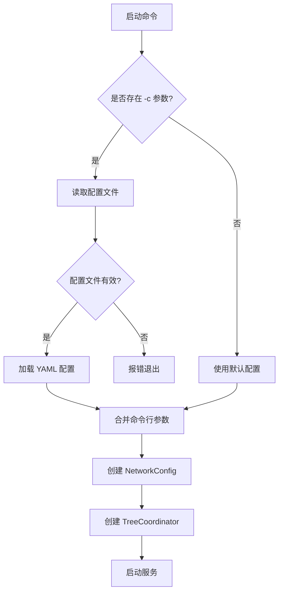

**配置优先级**：
1. 命令行参数(最高优先级)
2. 配置文件(nexkv.yaml)
3. 代码默认值(最低优先级)

#### 2.4.6 核心场景示例

**Dev 本地测试**（极致简化，3 个参数）：
```bash
# 1. 一键启动 3 个本地节点
./nexkv start -c nexkv.yaml --env=dev --num=3

# 2. 查看集群拓扑
./nexkv cluster -c nexkv.yaml --env=dev --seed.addrs=127.0.0.1:8001

# 3. 查看节点健康
./nexkv health -c nexkv.yaml --env=dev --seed.addrs=127.0.0.1:8001

# 4. 移除节点
./nexkv node remove -c nexkv.yaml --env=dev --seed.addrs=127.0.0.1:8001 --target=node-127001-8002

# 5. 一键停止
./nexkv stop-dev
```

**Cluster 生产部署**（显式可控）：
```bash
# 启动种子节点
./nexkv start -c /opt/nexkv/nexkv.yaml --env=cluster \
  --node.addr=192.168.1.101:9211 \
  --seed.addrs=192.168.1.101:9211 \
  --node.id=seed-1

# 启动普通节点
./nexkv start -c /opt/nexkv/nexkv.yaml --env=cluster \
  --node.addr=192.168.1.103:9211 \
  --seed.addrs=192.168.1.101:9211,192.168.1.102:9211
```

---

### 3. 现有实现分析与方案设计

#### 3.1 目录结构

```
internal/metadata/cluster/
├── tree_coordinator.go        # 树形协调器（核心）
├── tree_coordinator_test.go   # 单元测试
├── failure_detector.go        # 故障检测器（Phi Accrual 算法）
├── failure_detector_test.go   # 故障检测测试
└── self_healing.go            # 自愈机制（简化版本，移除 Leader 选举依赖）
```

**删除的文件（复杂功能已延期）**：
- ❌ leader_election.go - Leader 选举机制（延期）
- ❌ leader_election_test.go - Leader 选举测试（延期）
- ❌ clock_sync.go - 时钟同步（删除）
- ❌ virtual_node.go - 虚拟节点抽象（删除）
- ❌ node_id.go - 节点 ID 管理（删除）
- ❌ node_id_test.go - 节点 ID 测试（删除）

#### 3.2 模块架构图

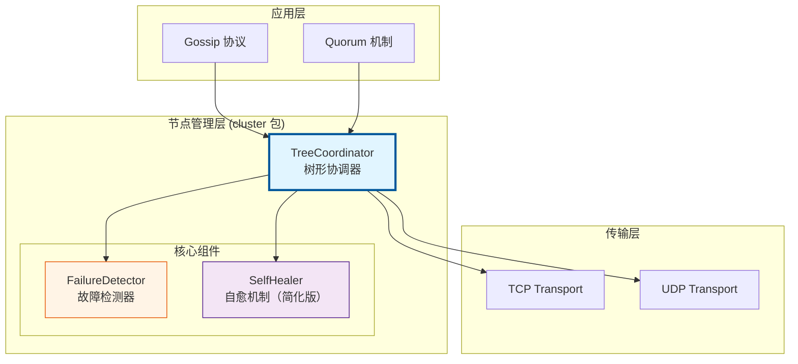

#### 3.3 TreeCoordinator 类图

```mermaid
classDiagram
    class TreeCoordinator {
        -config* TreeCoordinatorConfig
        -localNode* Node
        -transport Transport
        -allNodes map~string~*Node
        -nodesMu sync.RWMutex
        -state atomic.Int32
        -stats* TreeCoordinatorStats
        -stopCh chan struct{}
        +NewTreeCoordinator() TreeCoordinator
        +Start() error
        +Stop() error
        +GetNode(nodeID) *Node
        +ListNodes() []*Node
        +AddNode(nodeID, addr) error
        +RemoveNode(nodeID) error
        -discoverAndJoin()
        -heartbeatLoop()
        -failureDetectionLoop()
    }

    class Node {
        +NodeID string
        +Addr string
        +ParentID string
        +ChildrenIDs []string
        +Level int
        +Status NodeStatus
        +Priority int
        +LastHeartbeat time.Time
        +Metadata map~string~string
    }

    class TreeCoordinatorConfig {
        +MaxChildren int
        +MaxLevel int
        +HeartbeatInterval time.Duration
        +HeartbeatTimeout time.Duration
        +AutoDiscovery bool
        +EnableSelfHealing bool
    }

    class TreeCoordinatorStats {
        +TotalNodes atomic.Int32
        +OnlineNodes atomic.Int32
        +OfflineNodes atomic.Int32
        +TreeDepth atomic.Int32
    }

    class NodeStatus {
        <<enumeration>>
        NodeStatusInit
        NodeStatusReady
        NodeStatusJoining
        NodeStatusLeaving
        NodeStatusFailed
    }

    TreeCoordinator "1" --> "1" TreeCoordinatorConfig
    TreeCoordinator "1" --> "1" TreeCoordinatorStats
    TreeCoordinator "1" --> "*" Node
    Node --> NodeStatus
```

#### 3.4 节点状态机

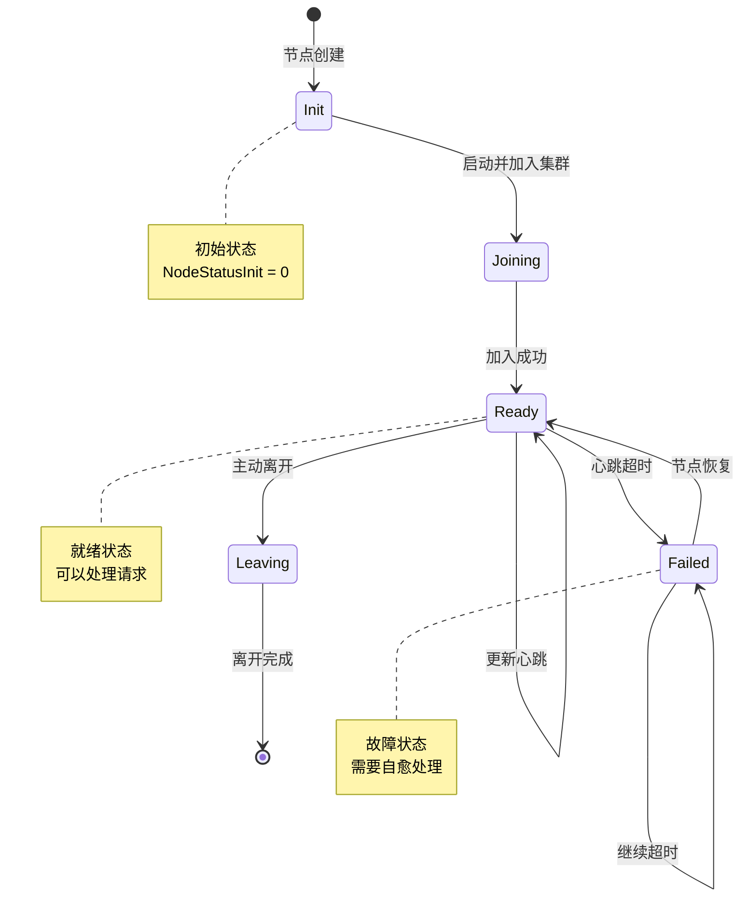

#### 3.5 整体流程设计

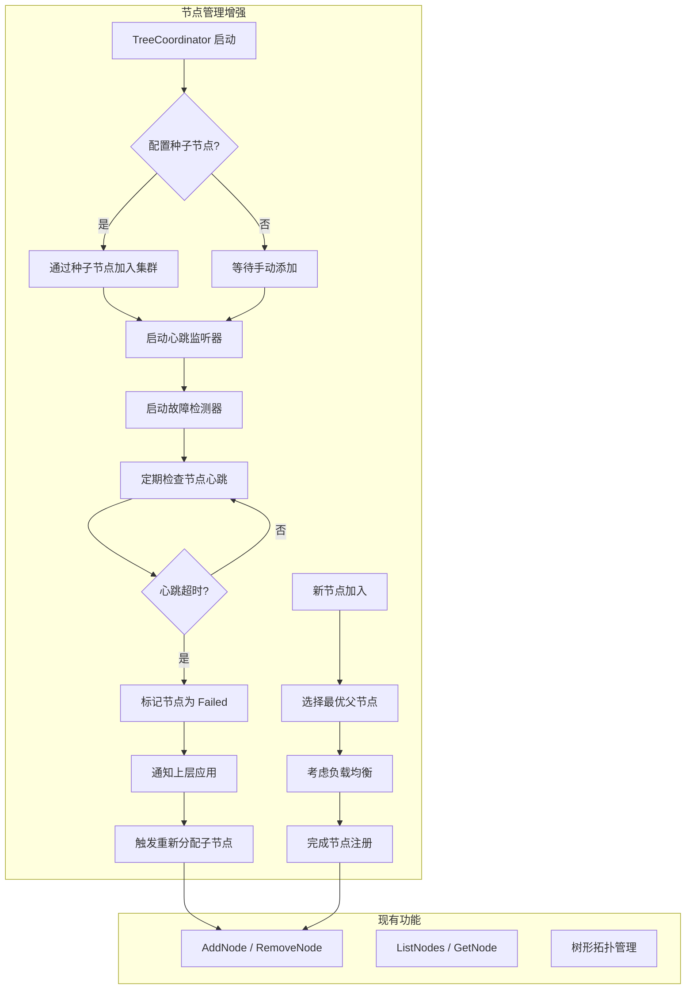

#### 3.6 关键设计点

##### 3.6.1 故障自愈机制

**接口定义**：

```go
// 启动故障检测器
func (tc *TreeCoordinator) StartFailureDetector(interval time.Duration, timeout time.Duration) error

// 停止故障检测器
func (tc *TreeCoordinator) StopFailureDetector() error

// 节点健康检查回调
type NodeHealthCallback func(nodeID string, oldStatus NodeStatus, newStatus NodeStatus)

// 设置健康检查回调
func (tc *TreeCoordinator) SetHealthCallback(callback NodeHealthCallback)
```

**核心机制**：

1. **主动超时检测**：
   - 后台 goroutine 定期检查所有节点的 `LastHeartbeat` 时间
   - 如果 `time.Now() - LastHeartbeat > timeout`，标记节点为 `NodeStatusFailed`
   - 默认检测间隔：10 秒
   - 默认超时时间：30 秒

2. **状态变更通知**：
   - 节点状态变更时触发回调函数
   - 通知上层应用（如 Gossip、Quorum）
   - 触发子节点重新分配

3. **自动故障恢复**：
   - Failed 节点重新发送心跳时，自动标记为 `NodeStatusReady`
   - 触发回调通知节点恢复

**数据结构**：

```go
// 故障检测器配置
type FailureDetectorConfig struct {
    CheckInterval   time.Duration        // 检测间隔（默认 10s）
    FailureTimeout  time.Duration        // 故障超时（默认 30s）
    EnableCallback  bool                 // 是否启用回调
}

// TreeCoordinator 新增字段
type TreeCoordinator struct {
    // ... 现有字段 ...
    failureDetector *failureDetector      // 故障检测器
    healthCallback  NodeHealthCallback    // 健康检查回调
    detectorMu      sync.RWMutex          // 检测器锁
}

// 内部故障检测器
type failureDetector struct {
    config      *FailureDetectorConfig
    coordinator *TreeCoordinator
    stopCh      chan struct{}
    wg          sync.WaitGroup
}
```

**容错设计**：

1. **避免误判**：
   - 连续 3 次检测超时才标记为 Failed（避免网络抖动误判）
   - 提供配置参数调整敏感度

2. **优雅停止**：
   - 使用 `stopCh` 和 `wg.Wait()` 确保检测器完全停止
   - 避免 goroutine 泄漏

##### 3.6.2 节点发现机制

**接口定义**：

```go
// 启动节点发现（通过种子节点）
func (tc *TreeCoordinator) JoinCluster(seedAddrs []string) error

// 种子节点配置
type SeedNodeConfig struct {
    SeedAddresses []string  // 种子节点地址列表
    DialTimeout   time.Duration  // 连接超时（默认 5s）
    RetryInterval time.Duration  // 重试间隔（默认 10s）
    MaxRetries    int        // 最大重试次数（默认 3）
}
```

**核心流程**：

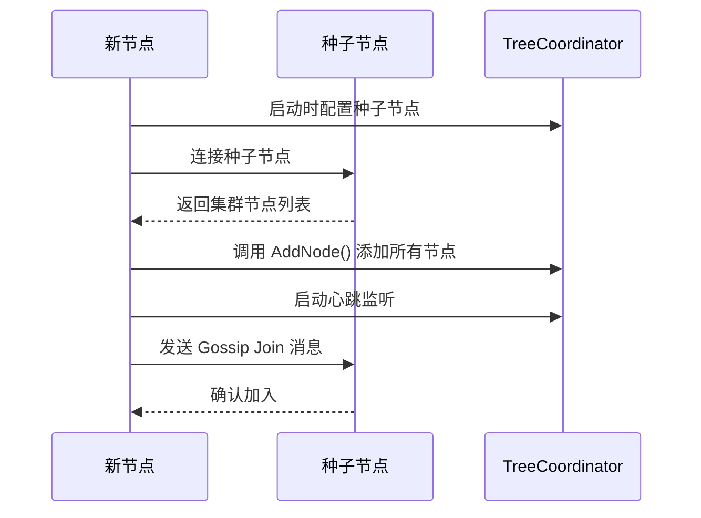

**实现细节**：

1. **种子节点配置**：
   - 在配置文件中指定种子节点地址列表
   - 支持多个种子节点（提高可用性）
   - 按顺序尝试连接，直到成功

2. **自动加入集群**：
   - 连接种子节点，获取集群节点列表
   - 调用 `AddNode()` 添加所有节点到本地拓扑
   - 发送 Gossip Join 消息通知其他节点
   - 启动心跳监听，开始接收心跳

3. **失败重试机制**：
   - 连接失败时自动重试
   - 达到最大重试次数后返回错误
   - 支持手动触发重新加入

**数据结构**：

```go
// TreeCoordinator 新增方法
func (tc *TreeCoordinator) JoinCluster(seedConfig *SeedNodeConfig) error {
    // 1. 连接种子节点
    // 2. 获取集群节点列表
    // 3. 添加节点到本地拓扑
    // 4. 启动心跳监听
    // 5. 发送 Gossip Join 消息
}

// 节点列表请求（通过 Transport 发送）
type NodeListRequest struct {
    NodeID string  // 请求节点ID
}

// 节点列表响应
type NodeListResponse struct {
    Nodes []NodeInfo  // 集群节点列表
}
```

##### 3.6.3 负载均衡优化

**接口定义**：

```go
// 选择最优父节点（内部方法）
func (tc *TreeCoordinator) selectOptimalParent(nodeID string) (string, error)

// 父节点选择策略
type ParentSelectionStrategy int

const (
    // RandomStrategy: 随机选择（现有策略）
    RandomStrategy ParentSelectionStrategy = iota
    // LoadBalancedStrategy: 负载均衡策略（新增）
    LoadBalancedStrategy
    // LatencyAwareStrategy: 延迟感知策略（新增）
    LatencyAwareStrategy
)
```

**核心算法**：

1. **负载均衡策略**：
   - 优先选择子节点数量 < 10 的节点
   - 在符合条件的节点中选择子节点数量最少的
   - 避免选择负载过重的节点

2. **延迟感知策略**（可选）：
   - 测量到候选父节点的网络延迟
   - 优先选择延迟较低的节点
   - 结合负载均衡，避免热点

**实现伪代码**：

```go
func (tc *TreeCoordinator) selectOptimalParent(nodeID string) (string, error) {
    tc.nodesMu.RLock()
    defer tc.nodesMu.RUnlock()

    // 1. 参数验证
    if nodeID == "" {
        return "", fmt.Errorf("节点ID不能为空")
    }

    // 2. 检查节点是否已存在
    if _, exists := tc.allNodes[nodeID]; exists {
        return "", fmt.Errorf("节点已存在: %s", nodeID)
    }

    // 3. 获取所有可能的父节点（Level < maxLevel）
    candidates := tc.getCandidateParents(nodeID)
    if len(candidates) == 0 {
        return "", fmt.Errorf("没有可用的父节点（集群可能已满）")
    }

    // 4. 根据策略选择父节点
    selectedNodeID, err := tc.selectParentByStrategy(candidates)
    if err != nil {
        return "", fmt.Errorf("选择父节点失败: %w", err)
    }

    // 5. 验证选中的父节点可用
    if tc.isNodeAvailable(selectedNodeID) {
        return selectedNodeID, nil
    }

    return "", fmt.Errorf("选中的父节点不可用: %s", selectedNodeID)
}

// selectParentByStrategy 根据配置策略选择父节点
func (tc *TreeCoordinator) selectParentByStrategy(candidates []*Node) (string, error) {
    switch tc.config.ParentSelectionStrategy {
    case LoadBalancedStrategy:
        return tc.selectByLoadBalance(candidates)
    case LatencyAwareStrategy:
        return tc.selectByLatency(candidates)
    default:
        return tc.selectRandom(candidates)
    }
}

// selectByLoadBalance 负载均衡策略选择父节点
func (tc *TreeCoordinator) selectByLoadBalance(candidates []*Node) (string, error) {
    var bestNode *Node
    maxScore := float64(-1)

    for _, node := range candidates {
        // 跳过黑名单节点或子节点已满的节点
        if node.IsBlacklisted {
            logging.WithField("node", node.NodeID).Debug("跳过黑名单节点")
            continue
        }
        if len(node.ChildrenIDs) >= tc.config.MaxChildrenPerNode {
            logging.WithField("node", node.NodeID).Debug("跳过已满节点")
            continue
        }

        // 计算节点得分 = 权重 / (子节点数量 + 1)
        score := float64(node.Weight) / float64(len(node.ChildrenIDs)+1)

        if score > maxScore {
            maxScore = score
            bestNode = node
        }
    }

    if bestNode == nil {
        // 记录详细错误信息
        logging.WithFields(map[string]interface{}{
            "candidates":      len(candidates),
            "max_children":     tc.config.MaxChildrenPerNode,
            "blacklisted":      countBlacklisted(candidates),
            "full_nodes":       countFullNodes(candidates, tc.config.MaxChildrenPerNode),
        }).Warn("负载均衡策略未找到可用父节点")
        return "", ErrNoAvailableParent
    }

    return bestNode.NodeID, nil
}

// countBlacklisted 统计黑名单节点数量
func countBlacklisted(nodes []*Node) int {
    count := 0
    for _, node := range nodes {
        if node.IsBlacklisted {
            count++
        }
    }
    return count
}

// countFullNodes 统计已满节点数量
func countFullNodes(nodes []*Node, maxChildren int) int {
    count := 0
    for _, node := range nodes {
        if len(node.ChildrenIDs) >= maxChildren {
            count++
        }
    }
    return count
}
```

**配置参数**：

```go
type TreeCoordinatorConfig struct {
    // ... 现有字段 ...
    ParentSelectionStrategy ParentSelectionStrategy  // 父节点选择策略
    EnableLatencyMeasurement bool                    // 是否启用延迟测量
    MaxChildrenPerNode       int                     // 每个节点最大子节点数（默认 10）
}
```

##### 3.6.4 种子节点动态更新

**核心需求**：支持在运行时动态更新种子节点列表,无需重启节点。

**接口定义**：

```go
// 更新种子节点列表
func (tc *TreeCoordinator) UpdateSeedNodes(seedAddrs []string) error

// 获取当前种子节点列表
func (tc *TreeCoordinator) GetSeedNodes() []string
```

**实现细节**：

1. **动态更新机制**：
   ```go
   func (tc *TreeCoordinator) UpdateSeedNodes(seedAddrs []string) error {
       tc.nodesMu.Lock()
       defer tc.nodesMu.Unlock()

       // 1. 验证新种子节点地址格式
       for _, addr := range seedAddrs {
           if !isValidAddress(addr) {
               return fmt.Errorf("无效的种子节点地址: %s", addr)
           }
       }

       // 2. 更新种子节点列表
       tc.seedNodes = seedAddrs

       // 3. 尝试连接新种子节点并同步拓扑
       for _, seedAddr := range seedAddrs {
           go tc.syncWithSeedNode(seedAddr)
       }

       logging.WithField("seed_nodes", seedAddrs).Info("种子节点列表已更新")
       return nil
   }
   ```

2. **命令行支持**：
   ```bash
   # 更新种子节点列表
   ./nexkv config reload -c nexkv.yaml --env=cluster \
     --seed.addrs=192.168.1.101:9211,192.168.1.102:9211
   ```

3. **配置文件重载**：
   ```yaml
   # nexkv.yaml
   cluster:
     tree_coord:
       seed_addrs:
         - "192.168.1.101:9211"
         - "192.168.1.102:9211"
   ```

**容错设计**：
- 更新失败时保留旧种子节点列表
- 新种子节点连接失败时记录警告,不影响现有连接
- 提供回滚机制,支持恢复到上一次的种子节点配置

##### 3.6.5 节点权重和黑名单机制

**核心需求**：基于节点能力(权重)和状态(黑名单)进行智能负载均衡。

**数据结构扩展**：

```go
// Node 结构体扩展
type Node struct {
    // ... 现有字段 ...

    // 新增字段
    Weight        int       // 节点权重(1-10),默认为 5
    IsBlacklisted bool      // 是否在黑名单中
    BlacklistReason string  // 加入黑名单的原因
    BlacklistTime  time.Time // 加入黑名单的时间
}
```

**接口定义**：

```go
// 设置节点权重
func (tc *TreeCoordinator) SetNodeWeight(nodeID string, weight int) error

// 将节点加入黑名单
func (tc *TreeCoordinator) BlacklistNode(nodeID string, reason string) error

// 将节点移出黑名单
func (tc *TreeCoordinator) UnblacklistNode(nodeID string) error

// 获取黑名单节点列表
func (tc *TreeCoordinator) GetBlacklistedNodes() []string
```

**负载均衡算法优化**：

```go
func (tc *TreeCoordinator) selectByLoadBalance(candidates []*Node) (string, error) {
    var bestNode *Node
    maxScore := float64(-1)

    for _, node := range candidates {
        // 跳过黑名单节点或子节点已满的节点
        if node.IsBlacklisted || len(node.ChildrenIDs) >= tc.config.MaxChildrenPerNode {
            continue
        }

        // 计算节点得分 = 权重 / (子节点数量 + 1)
        score := float64(node.Weight) / float64(len(node.ChildrenIDs)+1)

        if score > maxScore {
            maxScore = score
            bestNode = node
        }
    }

    if bestNode == nil {
        return "", ErrNoAvailableParent
    }

    return bestNode.NodeID, nil
}
```

**自动化机制**：
- **权重规则**：默认权重为 5，范围 1-10，权重越高越容易被选为父节点
- **黑名单规则**：故障检测自动标记黑名单，黑名单节点不参与父节点选择
- **自动恢复**：节点恢复后自动从黑名单移除，重新参与负载均衡

##### 3.6.6 子节点迁移能力

**核心需求**：故障节点的子节点自动迁移到健康节点,保持树形结构稳定。

**接口定义**：

```go
// 迁移指定节点的所有子节点到新父节点
func (tc *TreeCoordinator) migrateChildren(parentID string) error

// 查找最优的新父节点
func (tc *TreeCoordinator) findOptimalNewParent(oldParentID string, childIDs []string) (string, error)
```

**实现流程**：

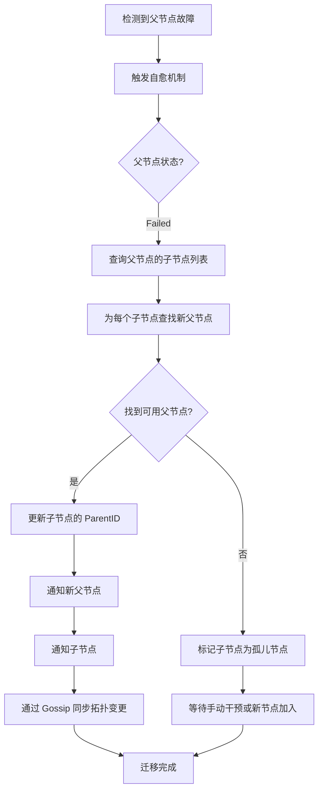

**实现细节**：

```go
func (tc *TreeCoordinator) migrateChildren(parentID string) error {
    // 阶段 1: 获取子节点列表（短时间持锁）
    var childIDs []string
    tc.nodesMu.Lock()
    if parent, exists := tc.allNodes[parentID]; exists {
        childIDs = make([]string, len(parent.ChildrenIDs))
        copy(childIDs, parent.ChildrenIDs) // 复制避免数据竞争
    }
    tc.nodesMu.Unlock()

    if len(childIDs) == 0 {
        return nil // 无需迁移
    }

    logging.WithFields(map[string]interface{}{
        "parent_id":  parentID,
        "child_count": len(childIDs),
    }).Info("开始迁移子节点")

    // 阶段 2: 为每个子节点查找新父节点（无锁，避免阻塞其他操作）
    migrationPlan := make(map[string]string) // childID -> newParentID
    orphanedChildren := make([]string, 0)

    for _, childID := range childIDs {
        // 使用 RLock 读取候选节点
        tc.nodesMu.RLock()
        candidates := tc.getCandidateParentsForMigration(parentID)
        tc.nodesMu.RUnlock()

        newParentID, err := tc.selectByLoadBalance(candidates)
        if err != nil {
            logging.WithFields(map[string]interface{}{
                "child_id": childID,
                "error":    err,
            }).Warn("无法为新父节点找到位置,标记为孤儿节点")
            orphanedChildren = append(orphanedChildren, childID)
            continue
        }
        migrationPlan[childID] = newParentID
    }

    // 阶段 3: 执行迁移（短时间持锁，批量更新）
    tc.nodesMu.Lock()
    defer tc.nodesMu.Unlock()

    // 执行迁移计划
    for childID, newParentID := range migrationPlan {
        // 更新子节点
        if child, exists := tc.allNodes[childID]; exists {
            child.ParentID = newParentID
        }

        // 更新新父节点
        if newParent, exists := tc.allNodes[newParentID]; exists {
            newParent.ChildrenIDs = append(newParent.ChildrenIDs, childID)
        }

        // 更新旧父节点
        if parent, exists := tc.allNodes[parentID]; exists {
            parent.ChildrenIDs = removeString(parent.ChildrenIDs, childID)
        }
    }

    // 标记孤儿节点
    for _, childID := range orphanedChildren {
        if child, exists := tc.allNodes[childID]; exists {
            child.ParentID = ""
            child.Status = NodeStatusOrphan
        }
    }

    logging.WithFields(map[string]interface{}{
        "parent_id":       parentID,
        "migrated_count":  len(migrationPlan),
        "orphaned_count":  len(orphanedChildren),
    }).Info("子节点迁移完成")

    return nil
}

// getCandidateParentsForMigration 获取候选父节点（用于迁移）
// 注意：调用时需要持有读锁或写锁
func (tc *TreeCoordinator) getCandidateParentsForMigration(excludeNodeID string) []*Node {
    candidates := make([]*Node, 0)
    for _, node := range tc.allNodes {
        if node.NodeID == excludeNodeID {
            continue
        }
        if node.IsBlacklisted {
            continue
        }
        if node.Status != NodeStatusReady {
            continue
        }
        if len(node.ChildrenIDs) >= tc.config.MaxChildrenPerNode {
            continue
        }
        candidates = append(candidates, node)
    }
    return candidates
}
```

**性能优化**：
- 批量迁移,减少锁竞争
- 优先选择兄弟节点作为新父节点(减少拓扑变化)
- 使用 Gossip 协议异步扩散拓扑变更

**容错设计**：
- 迁移失败时回滚到原始状态
- 无法找到新父节点的子节点标记为孤儿节点
- 提供手动触发迁移的命令行接口

**命令行支持**：

```bash
# 查看孤儿节点（自动自愈）
./nexkv node list -c nexkv.yaml --env=cluster --filter=orphaned
```

**自动化说明**：
- **子节点迁移**：故障检测器自动触发，无需手动命令
- **孤儿节点检测**：`node list --filter=orphaned` 查看孤儿节点状态

#### 3.7 容错设计

1. **故障检测容错**：
   - 连续 3 次超时才标记为 Failed（避免误判）
   - 节点恢复后自动重新加入
   - 回调函数处理失败不阻塞检测器

2. **节点发现容错**：
   - 多个种子节点提高可用性
   - 连接失败自动重试
   - 超时后返回错误，不阻塞启动

3. **负载均衡容错**：
   - 无可用父节点时返回错误
   - AddNode 失败时回滚已添加的节点
   - 不影响现有随机选择策略

#### 3.8 命令行系统与集成

##### 3.8.1 架构分层

NexKV 采用 **daemon + cli 分离架构**，CLI 通过 RPC 与 Daemon 通信：

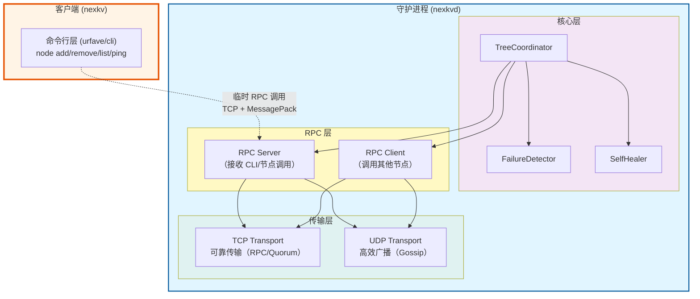

**架构说明**：

- **CLI (nexkv)**：
  - 命令行客户端工具，用于与 Daemon 交互
  - 创建临时 RPC Client 连接到 Daemon
  - 命令执行完毕立即关闭连接

- **Daemon (nexkvd)**：
  - 长期运行的守护进程
  - 持久监听 TCP 端口，接收来自 CLI 和其他节点的 RPC 调用
  - 包含所有核心模块（TreeCoordinator、Gossip、Quorum 等）

- **TreeCoordinator 双重角色**：
  - **RPC Client**：作为客户端主动调用其他节点的 RPC 服务
  - **RPC Server**：作为服务端接收并处理 CLI 和其他节点的 RPC 请求

- **RPC 层职责**：
  - **RPC Client**：封装请求序列化、连接管理、超时重试
  - **RPC Server**：封装服务注册、请求反序列化、方法路由

- **Transport 层职责**：
  - **TCP Transport**：用于 RPC 调用（可靠传输）
  - **UDP Transport**：用于 Gossip 协议（高效广播）

##### 3.8.2 依赖注入设计

```go
// cmd/nexkv/common/context.go
package common

import (
    "github.com/jzhang405/NexKV/internal/metadata/cluster"
    "github.com/jzhang405/NexKV/internal/metadata/transport"
    rpccommon "github.com/jzhang405/NexKV/internal/rpc/common"
)

// AppContext 应用上下文（依赖注入容器）
type AppContext struct {
    // 配置
    ConfigPath string
    Env        netutil.EnvType

    // 核心组件
    Coordinator  *cluster.TreeCoordinator
    Transport    transport.Transport

    // RPC 组件
    RPCClient  rpccommon.RPCClient  // RPC 客户端（主动调用）
    RPCServer  rpccommon.RPCServer  // RPC 服务端（接收请求）

    // 监控组件
    FailureDetector *cluster.FailureDetector
}

// 全局上下文（在 main.go 中初始化）
var appCtx = &AppContext{}

// start 命令中初始化所有依赖
func runStart(c *cli.Context) error {
    // 1. 创建 Transport 层
    tcpTransport := transport.NewTCPTransport(netCfg.GetListenAddr())
    udpTransport := transport.NewUDPTransport(netCfg.GetListenAddr())

    // 2. 创建 RPC Client（同时支持 TCP 和 UDP）
    // 根据消息类型自动选择传输协议：
    // - TCP：可靠传输（Metadata CRUD、Quorum 投票、Node Management、2PC）
    // - UDP：高效广播（Gossip 协议、Cluster Status 查询）
    appCtx.RPCClient = transport.NewRPCClient(
        tcpTransport,
        udpTransport,
        transport.DefaultRPCClientConfig(),
    )

    // 3. 创建 RPC Server（同时支持 TCP 和 UDP）
    // 同时监听 TCP 和 UDP，自动路由消息到对应的处理器
    appCtx.RPCServer = transport.NewRPCServer(
        tcpTransport,
        udpTransport,
        &TreeCoordinatorRPCHandler{},
        transport.DefaultRPCServerConfig(),
    )

    // 4. 启动 RPC Server（监听其他节点请求）
    if err := appCtx.RPCServer.Start(); err != nil {
        return fmt.Errorf("启动 RPC Server 失败: %w", err)
    }

    // 5. 启动 RPC Client（响应处理协程）
    if err := appCtx.RPCClient.Start(); err != nil {
        return fmt.Errorf("启动 RPC Client 失败: %w", err)
    }

    // 6. 创建 TreeCoordinator（只注入 RPC 接口，不依赖底层 Transport）
    // 遵循依赖倒置原则（DIP）：TreeCoordinator 依赖抽象（RPC）而非具体实现（TCP/UDP）
    appCtx.Coordinator = cluster.NewTreeCoordinator(&cluster.TreeCoordinatorConfig{
        LocalNodeID:             NodeID,
        LocalAddr:               netCfg.GetListenAddr(),
        RPCClient:               appCtx.RPCClient,   // 通过 RPC Client 发起调用
        RPCServer:               appCtx.RPCServer,   // 通过 RPC Server 接收调用
        SeedAddrs:               parseSeedAddrs(SeedAddrs),
        ParentSelectionStrategy: cluster.LoadBalancedStrategy,
    })

    // 7. 启动 TreeCoordinator
    if err := appCtx.Coordinator.Start(); err != nil {
        return fmt.Errorf("启动 TreeCoordinator 失败: %w", err)
    }

    return nil
}

// node add 命令中使用 RPC Client
func runNodeAdd(c *cli.Context) error {
    // 连接到目标节点（AddNode 使用 TCP 可靠传输）
    // 注意：RPC Client 内部会根据消息类型自动选择 TCP/UDP 传输协议
    tcpTransport := transport.NewTCPTransport(TargetAddr)
    udpTransport := transport.NewUDPTransport(TargetAddr)

    client, err := transport.NewRPCClient(
        tcpTransport,
        udpTransport,
        transport.DefaultRPCClientConfig(),
    )
    if err != nil {
        return fmt.Errorf("创建 RPC Client 失败: %w", err)
    }

    // 启动 RPC Client（启动响应处理协程）
    if err := client.Start(); err != nil {
        return fmt.Errorf("启动 RPC Client 失败: %w", err)
    }
    defer func() {
        // 清理资源
        client.Stop()
        tcpTransport.Stop()
        udpTransport.Stop()
    }()

    // 调用远程节点的 AddNode 方法
    request := &cluster.AddNodeRequest{
        NodeID: NodeID,
        Addr:   Addr,
    }

    response, err := client.Call("TreeCoordinator.AddNode", request)
    if err != nil {
        return fmt.Errorf("RPC 调用失败: %w", err)
    }

    if !response.Success {
        return fmt.Errorf("添加节点失败: %s", response.Error)
    }

    return nil
}
```

**依赖注入关键点**：

1. **RPC Client 和 RPC Server 分别创建**：
   - RPC Client：用于主动调用其他节点的 RPC 方法
   - RPC Server：用于接收并处理其他节点的 RPC 请求

2. **TreeCoordinator 只依赖 RPC 接口（遵循依赖倒置原则 DIP）**：
   - ✅ **依赖抽象**：TreeCoordinator 只依赖 RPC Client/Server 接口
   - ❌ **不依赖实现**：TreeCoordinator 不直接依赖 TCP/UDP Transport
   - **优势**：RPC 层自动根据消息类型选择 TCP/UDP 传输协议
     - TCP：可靠传输（Metadata CRUD、Quorum 投票、Node Management、2PC）
     - UDP：高效广播（Gossip 协议、Cluster Status 查询）

3. **TreeCoordinator 双重角色**：
   - 作为服务端：通过 RPC Server 注册服务方法（`AddNode`、`RemoveNode` 等）
   - 作为客户端：通过 RPC Client 调用其他节点方法

4. **生命周期管理**：
   - RPC Server 必须在 TreeCoordinator 之前启动
   - 关闭时先停止 TreeCoordinator，再停止 RPC Server

#### 3.9 节点管理命令完整执行流程

> **核心目的**：通过详细的 Mermaid 时序图，展示 `nexkv node add` 命令从 CLI 到 Daemon 的完整执行流程，包括 RPC 通信、关键接口调用、数据流转和模块交互。

##### 3.9.1 模块职责概述

| 模块 | 类型 | 职责 | 关键接口 |
|------|------|------|---------|
| **CLI (nexkv)** | 客户端 | 命令行入口，解析用户命令，创建临时 RPC 连接 | `nexkv node add <node-id> <addr>` |
| **Daemon (nexkvd)** | 守护进程 | 长期运行的服务，包含所有核心模块 | `nexkvd start --config=config.yaml` |
| **transport.RPCClient** | CLI 内部 | CLI 的临时 RPC Client，连接到 Daemon | `Call(addr, msg) (Message, error)` |
| **transport.RPCServer** | Daemon 内部 | Daemon 的 RPC Server，接收 CLI/节点调用 | `Start() error`, `RegisterHandler(handler)` |
| **cluster.TreeCoordinator** | Daemon 内部 | 节点拓扑管理、选父逻辑 | `AddNode(nodeID, addr) (string, error)` |
| **consensus.Quorum** | Daemon 内部 | 关键变更多数派确认 | `Propose(ctx, proposal) error` |
| **consensus.Gossip** | Daemon 内部 | 元数据异步扩散（最终一致） | `Put(key, value) error` |
| **transport.Transport** | Daemon 内部 | 底层网络通信（TCP/UDP） | `Send(ctx, addr, msg) error` |
| **store.MVStore** | Daemon 内部 | 元数据持久化（MVCC） | `Put(key, value) error` |

##### 3.9.2 `nexkv node add` 完整时序图

**前置说明**：
- **场景**：用户执行 `nexkv node add node-2 192.168.1.2:9211`
- **架构**：CLI 通过临时 RPC 连接到本地 Daemon (localhost:9211)
- **RPC 调用**：CLI → Daemon RPC Server → TreeCoordinator 处理
- **消息类型**：使用现有的 `NodeJoinMessage` / `NodeJoinReplyMessage`

**时序图（CLI → Daemon RPC 调用流程）**：

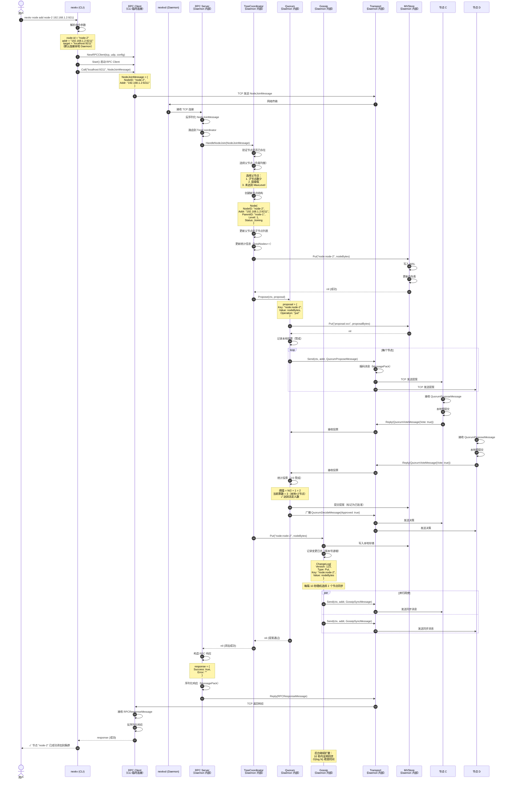

##### 3.9.3 关键数据流说明

**1. CLI → Daemon: NodeJoin 消息格式**：
```go
// NodeJoinMessage 节点加入消息
type NodeJoinMessage struct {
	BaseMessage                        // 内嵌：MessageType + correlationID
	NodeID   string `json:"node_id" msgpack:"node_id"`
	Addr     string `json:"addr" msgpack:"addr"`
	Role     string `json:"role" msgpack:"role"` // "parent", "child"
	ParentID string `json:"parent_id,omitempty" msgpack:"parent_id,omitempty"`
}

// 示例：
NodeJoinMessage {
  BaseMessage: {
    MessageType: 302,                    // MessageTypeNodeJoin
    correlationID: "123:456",            // 关联ID（传输层自动设置）
  },
  NodeID: "node-2",                     // 新节点 ID
  Addr: "192.168.1.2:9211",             // 新节点地址
  Role: "child",                        // 角色（child/parent/root）
  ParentID: "",                         // 父节点 ID（由 TreeCoordinator 分配）
}
```

**2. Daemon → CLI: NodeJoinReply 消息格式**：
```go
// NodeJoinReplyMessage 节点加入响应消息
type NodeJoinReplyMessage struct {
	BaseMessage                      // 内嵌：MessageType + correlationID
	RequestID  string `json:"request_id" msgpack:"request_id"` // 匹配请求
	Success    bool   `json:"success" msgpack:"success"`
	Error      string `json:"error" msgpack:"error"`
	NodeInfo   []byte `json:"node_info" msgpack:"node_info"` // MessagePack 序列化的节点信息
}

// 示例：
NodeJoinReplyMessage {
  BaseMessage: {
    MessageType: 308,                    // MessageTypeNodeJoinReply
    correlationID: "123:456",            // 关联ID（匹配请求）
  },
  RequestID: "123:456",                 // 请求 ID（匹配请求）
  Success: true,                         // 是否成功
  Error: "",                             // 错误信息（失败时）
  NodeInfo: {...},                       // 节点信息（MessagePack）
}
```

**3. 节点元数据序列化格式**：
```go
Key: "node:node-2"
Value (MessagePack):
{
  "node_id": "node-2",
  "addr": "192.168.1.2:9211",
  "parent_id": "node-1",
  "children_ids": [],
  "level": 1,
  "status": "Joining",
  "priority": 0,
  "metadata": {}
}
```

**4. Quorum 提案消息格式**：
```go
QuorumProposeMessage {
  ProposalID: "proposal-1234567890-1",
  Proposer: "192.168.1.1:9211",
  Key: "node:node-2",
  Value: [...],  // 序列化的节点信息
  Operation: "put",
  Timestamp: 1706654400000000000  // HLC 物理时间戳
}
```

**5. Gossip 同步消息格式**：
```go
GossipSyncMessage {
  Version: 123,  // 本地版本号
  Metadata: {
    "node:node-2": [...],  // 新节点数据
    "topology:version": [...]  // 拓扑快照
  }
}
```

##### 3.9.4 模块依赖关系图

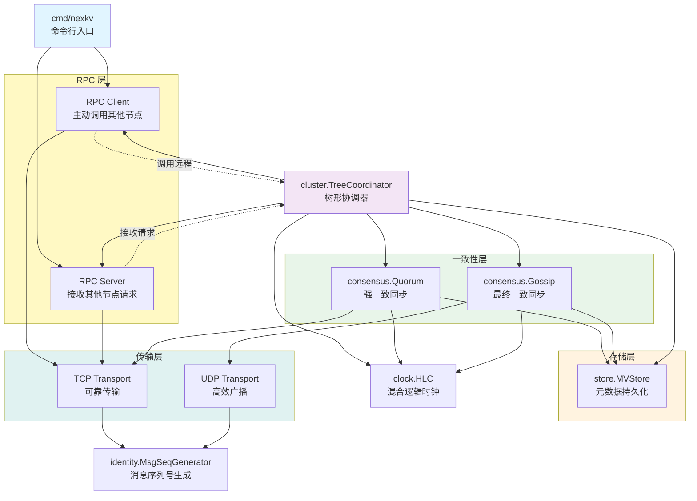

##### 3.9.5 分层一致性设计

| 变更类型 | 使用协议 | 一致性保证 | 阻塞业务 | 使用场景 |
|---------|---------|-----------|---------|---------|
| **关键变更** | Quorum | 增强的最终一致（多数派确认） | 是 | 节点加入/离开、分片创建、主副本切换 |
| **普通变更** | Gossip | 最终一致（10 秒内扩散） | 否 | 节点状态更新、心跳时间、负载信息 |

**设计亮点**：
- **分层一致**：关键变更用 Quorum（多数派确认），普通变更用 Gossip（异步扩散）
- **树形拓扑**：层级化管理，松连接，容错性强
- **MVCC 存储**：支持版本查询，冲突检测
- **抽象传输层**：支持 TCP/UDP 切换，RPC 模式

##### 3.9.6 消息类型体系

> **核心目的**：详细定义 NexKV 节点间通信的所有消息类型、格式和流转路径，确保 RPC（紧连接）和 Gossip（松连接）两种通信模式的消息格式统一且可扩展。

###### 3.9.6.1 消息类型总览

NexKV 的消息体系分为 **6 大类**，覆盖所有节点间通信场景：

| 消息类别 | 类型编号 | 连接类型 | 传输协议 | 消息类型 | 使用场景 |
|---------|---------|---------|---------|---------|---------|
| **Transport 帧** | - | - | TCP/UDP | Frame | 底层统一封装 |
| **Metadata 消息** | 100-149 | 紧连接 | TCP | Get/Put/Delete | 元数据 CRUD 操作 |
| **Gossip 消息** | 150-199 | 松连接 | UDP | Digest/Sync | 最终一致性异步扩散 |
| **Quorum 消息** | 200-249 | 紧连接 | TCP | Propose/Vote/Decide | 强一致多数派确认 |
| **2PC 消息** | 250-299 | 紧连接 | TCP | Prepare/Commit/Rollback | 分布式事务协调 |
| **Node Management 消息** | 300-349 | 紧连接 | TCP | Ping/Pong/Join/Leave/Sync | 节点心跳、加入、离开、同步 |
| **Cluster Management 消息** | 350-399 | 紧连接 | TCP | Status/LeaderElection | 集群状态查询、Leader 选举 |

**消息流转路径**：
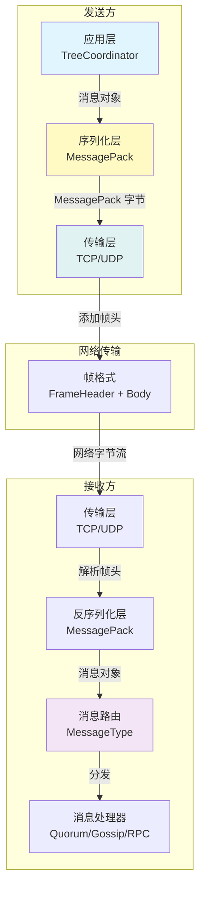

**公共数据结构**：

以下是跨多个消息类型共享的数据结构定义：

```go
// internal/metadata/types/node_info.go
package types

// NodeInfo 节点信息（跨消息类型共享）
//
// 用途：
//   - 节点列表响应（NodeListResponse）
//   - 节点加入响应（NodeJoinReplyMessage）
//   - Gossip 同步消息（GossipSyncMessage）
//   - 拓扑查询响应（TopologyQueryReplyMessage）
type NodeInfo struct {
	// NodeID 节点唯一标识
	NodeID string `json:"node_id" msgpack:"node_id"`

	// Addr 节点监听地址（格式：IP:Port）
	Addr string `json:"addr" msgpack:"addr"`

	// ParentID 父节点ID（根节点为空）
	ParentID string `json:"parent_id" msgpack:"parent_id"`

	// ChildrenIDs 子节点ID列表
	ChildrenIDs []string `json:"children_ids" msgpack:"children_ids"`

	// Level 节点层级（根节点为 0）
	Level int `json:"level" msgpack:"level"`

	// Status 节点状态
	Status NodeStatus `json:"status" msgpack:"status"`

	// Weight 节点权重（用于负载均衡，默认 100）
	Weight int `json:"weight" msgpack:"weight"`

	// LastHeartbeat 最后心跳时间（Unix 时间戳，毫秒）
	LastHeartbeat int64 `json:"last_heartbeat" msgpack:"last_heartbeat"`

	// JoinTime 节点加入时间（Unix 时间戳，毫秒）
	JoinTime int64 `json:"join_time" msgpack:"join_time"`
}

// NodeStatus 节点状态
type NodeStatus int

const (
	// NodeStatusHealthy 节点健康
	NodeStatusHealthy NodeStatus = iota
	// NodeStatusSuspected 节点可疑（心跳超时）
	NodeStatusSuspected
	// NodeStatusFailed 节点故障（确认失败）
	NodeStatusFailed
	// NodeStatusLeaving 节点正在离开
	NodeStatusLeaving
	// NodeStatusOrphan 孤儿节点（父节点故障，未找到新父节点）
	NodeStatusOrphan
)

// String 返回状态的字符串表示
func (s NodeStatus) String() string {
	switch s {
	case NodeStatusHealthy:
		return "Healthy"
	case NodeStatusSuspected:
		return "Suspected"
	case NodeStatusFailed:
		return "Failed"
	case NodeStatusLeaving:
		return "Leaving"
	case NodeStatusOrphan:
		return "Orphan"
	default:
		return "Unknown"
	}
}
```

###### 3.9.6.2 Transport 层帧格式（底层统一封装）

所有消息在传输前都会封装成统一的 **Frame 格式**，确保消息边界和路由。

**帧结构（二进制格式）**：
```go
// internal/metadata/transport/frame.go
package transport

// Frame 帧结构（所有消息的统一封装）
type Frame struct {
    // 帧头（16 字节）
    Header  FrameHeader  `json:"header"`
    // 消息体（MessagePack 序列化）
    Body    []byte        `json:"body"`
}

// FrameHeader 帧头（固定 16 字节）
type FrameHeader struct {
    // 发送节点 ID（8 字节，uint64）
    NodeID  uint64  `json:"node_id"`

    // 消息序列号（4 字节，uint32）
    // 用于消息去重和乱序重排
    MsgSeq  uint32  `json:"msg_seq"`

    // 消息类型（2 字节，uint16）
    // 0x01: RPC, 0x02: Quorum, 0x03: Gossip, 0x04: Heartbeat
    MsgType uint16  `json:"msg_type"`

    // 消息体长度（2 字节，uint16）
    BodyLen uint16  `json:"body_len"`
}
```

**帧格式图示**：
```
+------------------ 16 字节 ------------------+
|  FrameHeader（帧头）                        |
+---------------------------------------------+
|  NodeID (8B)  |  MsgSeq (4B)  |  MsgType (2B) |  BodyLen (2B) |
+------------------+---------------+--------------+
|  0x1234...      |  0x0001       |  0x0001       |  0x0123       |
+------------------+---------------+--------------+
|  发送节点 ID    |  消息序列号   |  消息类型     |  消息体长度   |
+--------------------------------------------------+
|  Body（消息体，MessagePack 序列化）             |
+--------------------------------------------------+
|  { "service": "TreeCoordinator", ... }           |
+--------------------------------------------------+
```

**消息类型定义**（来自 `internal/metadata/types/msg_types.go`）：
```go
// internal/metadata/types/msg_types.go
package types

type MessageType uint16

const (
	// 元数据操作消息 (100-149)
	MessageTypeGet         MessageType = 100 // 获取元数据
	MessageTypePut         MessageType = 101 // 更新元数据
	MessageTypeDelete      MessageType = 102 // 删除元数据
	MessageTypeGetReply    MessageType = 103 // Get 响应
	MessageTypePutReply    MessageType = 104 // Put 响应
	MessageTypeDeleteReply MessageType = 105 // Delete 响应

	// Gossip 协议消息 (150-199)
	MessageTypeGossipSync        MessageType = 150 // Gossip 同步请求
	MessageTypeGossipSyncReply   MessageType = 151 // Gossip 同步响应
	MessageTypeGossipDigest      MessageType = 152 // Gossip 摘要
	MessageTypeGossipDigestReply MessageType = 153 // Gossip 摘要响应

	// Quorum 协议消息 (200-249)
	MessageTypeQuorumPropose MessageType = 200 // Quorum 提案
	MessageTypeQuorumVote    MessageType = 201 // Quorum 投票
	MessageTypeQuorumDecide  MessageType = 202 // Quorum 决策

	// 2PC 协议消息 (250-299)
	MessageType2PCPrepare       MessageType = 250 // 2PC 准备阶段
	MessageType2PCPrepareReply  MessageType = 251 // 2PC 准备响应
	MessageType2PCCommit        MessageType = 252 // 2PC 提交阶段
	MessageType2PCRollback      MessageType = 253 // 2PC 回滚阶段
	MessageType2PCCommitReply   MessageType = 254 // 2PC 提交响应
	MessageType2PCRollbackReply MessageType = 255 // 2PC 回滚响应

	// 节点管理消息 (300-349)
	MessageTypeNodePing         MessageType = 300 // 节点心跳
	MessageTypeNodePong         MessageType = 301 // 心跳响应
	MessageTypeNodeJoin         MessageType = 302 // 节点加入
	MessageTypeNodeJoinReply    MessageType = 308 // 节点加入响应
	MessageTypeNodeLeave        MessageType = 303 // 节点离开
	MessageTypeNodeSync         MessageType = 304 // 节点同步
	MessageTypeClockSync        MessageType = 305 // 时钟同步请求
	MessageTypeClockSyncReply   MessageType = 306 // 时钟同步响应

	// 集群管理消息 (350-399)
	MessageTypeClusterStatus      MessageType = 350 // 集群状态查询
	MessageTypeClusterStatusReply MessageType = 351 // 集群状态响应
	MessageTypeLeaderElection     MessageType = 352 // Leader 选举
	MessageTypeTopologyQuery      MessageType = 353 // 拓扑查询请求
	MessageTypeTopologyQueryReply MessageType = 354 // 拓扑查询响应
)
```

###### 3.9.6.3 Metadata 消息（元数据 CRUD 操作）

Metadata 消息用于**元数据的增删改查操作**，采用请求-响应模式。

**消息模式**：所有消息都嵌入 `BaseMessage`，实现代码复用和类型安全。

**1. 基础消息（BaseMessage）**：
```go
// internal/metadata/transport/msg_frame.go
package transport

// BaseMessage 基础消息（所有消息的公共字段）
//
// 用途：
//   - 作为所有消息类型的内嵌基类，提供统一的接口实现
//   - 消除重复代码，避免每个消息类型都实现相同的 7 个方法
//   - 支持通过内嵌 BaseMessage 来自动获得 Message 接口实现
//
// 使用示例：
//   msg := &NodeJoinMessage{
//       BaseMessage: BaseMessage{
//           MessageType: MessageTypeNodeJoin,
//       },
//       NodeID: "node-2",
//       Addr:   "192.168.1.2:9211",
//   }
//   // 传输层自动设置 correlationID
//   msg.SetCorrelationID("123:456")
type BaseMessage struct {
	// MessageType 消息类型（由具体消息类型在初始化时设置）
	MessageType MessageType `json:"msg_type" msgpack:"msg_type"`

	// correlationID 关联ID（由传输层自动设置，用于请求-响应匹配）
	// 注意：小写字段，外部需通过 SetCorrelationID() 方法设置
	correlationID string `json:"correlation_id" msgpack:"correlation_id"`
}

// SetCorrelationID 设置关联ID（由传输层调用）
//
// 参数：
//   - id: 关联ID，格式为 "{NodeID}:{MsgSeq}"
//
// 使用场景：
//   - 传输层发送请求时自动设置
//   - 响应消息复制请求的 correlationID
func (m *BaseMessage) SetCorrelationID(id string) {
	m.correlationID = id
}

// GetCorrelationID 获取关联ID
func (m *BaseMessage) GetCorrelationID() string {
	return m.correlationID
}
```

**2. Get 请求消息（GetMessage）**：
```go
// GetMessage 获取元数据消息
type GetMessage struct {
	BaseMessage
	Key string `json:"key" msgpack:"key"`
}
```

**3. Put 请求消息（PutMessage）**：
```go
// PutMessage 更新元数据消息
type PutMessage struct {
	BaseMessage
	Key   string  `json:"key" msgpack:"key"`
	Value []byte  `json:"value" msgpack:"value"`
}
```

**4. Delete 请求消息（DeleteMessage）**：
```go
// DeleteMessage 删除元数据消息
type DeleteMessage struct {
	BaseMessage
	Key string `json:"key" msgpack:"key"`
}
```

**5. Get 响应消息（GetReplyMessage）**：
```go
// GetReplyMessage Get 响应消息
type GetReplyMessage struct {
	BaseMessage
	Key     string `json:"key" msgpack:"key"`
	Value   []byte `json:"value" msgpack:"value"`
	Exists  bool   `json:"exists" msgpack:"exists"`
	Version uint64 `json:"version" msgpack:"version"`
}
```

**6. Put 响应消息（PutReplyMessage）**：
```go
// PutReplyMessage Put 响应消息
type PutReplyMessage struct {
	BaseMessage
	Key     string `json:"key" msgpack:"key"`
	Success bool   `json:"success" msgpack:"success"`
	Version uint64 `json:"version" msgpack:"version"`
}
```

**7. Delete 响应消息（DeleteReplyMessage）**：
```go
// DeleteReplyMessage Delete 响应消息
type DeleteReplyMessage struct {
	BaseMessage
	Key     string `json:"key" msgpack:"key"`
	Success bool   `json:"success" msgpack:"success"`
}
```

###### 3.9.6.4 Quorum 消息（强一致）

Quorum 消息用于**关键变更的多数派确认**，确保强一致性。

**1. Quorum 提案消息（QuorumProposeMessage）**：
```go
// QuorumProposeMessage Quorum 提案消息
type QuorumProposeMessage struct {
	BaseMessage
	ProposalID string  `json:"proposal_id" msgpack:"proposal_id"` // 提案 ID
	Key        string  `json:"key" msgpack:"key"`                 // 元数据键
	Value      []byte `json:"value" msgpack:"value"`              // 元数据值
	Operation  string `json:"operation" msgpack:"operation"`      // 操作类型
}
```

**2. Quorum 投票消息（QuorumVoteMessage）**：
```go
// QuorumVoteMessage Quorum 投票消息
type QuorumVoteMessage struct {
	BaseMessage
	ProposalID string `json:"proposal_id" msgpack:"proposal_id"` // 提案 ID
	Vote       bool   `json:"vote" msgpack:"vote"`               // 投票结果
	Reason     string `json:"reason,omitempty" msgpack:"reason"`  // 投票理由
}
```

**3. Quorum 决策消息（QuorumDecideMessage）**：
```go
// QuorumDecideMessage Quorum 决策消息
type QuorumDecideMessage struct {
	BaseMessage
	ProposalID   string `json:"proposal_id" msgpack:"proposal_id"`   // 提案 ID
	Approved     bool   `json:"approved" msgpack:"approved"`         // 决策结果
	VotesFor     int    `json:"votes_for" msgpack:"votes_for"`       // 赞成票数
	VotesAgainst int    `json:"votes_against" msgpack:"votes_against"` // 反对票数
}
```

###### 3.9.6.5 Gossip 消息（最终一致）

Gossip 消息用于**元数据的异步扩散**，确保最终一致性。

**1. Gossip 摘要消息（GossipDigestMessage）**：
```go
// GossipDigestMessage Gossip 摘要消息
type GossipDigestMessage struct {
	BaseMessage
	Version uint64            `json:"version" msgpack:"version"`     // 发起者版本号
	Digest  map[string]uint64 `json:"digest" msgpack:"digest"`       // 摘要信息
}
```

**2. Gossip 摘要响应消息（GossipDigestReplyMessage）**：
```go
// GossipDigestReplyMessage Gossip 摘要响应消息
type GossipDigestReplyMessage struct {
	BaseMessage
	Version uint64            `json:"version" msgpack:"version"`     // 响应者版本号
	Digest  map[string]uint64 `json:"digest" msgpack:"digest"`       // 响应者摘要
}
```

**3. Gossip 同步消息（GossipSyncMessage）**：
```go
// GossipSyncMessage Gossip 同步消息
type GossipSyncMessage struct {
	BaseMessage
	Version  uint64            `json:"version" msgpack:"version"`      // 发起者版本号
	Metadata map[string][]byte `json:"metadata" msgpack:"metadata"`    // 元数据差异
}
```

**4. Gossip 同步响应消息（GossipSyncReplyMessage）**：
```go
// GossipSyncReplyMessage Gossip 同步响应消息
type GossipSyncReplyMessage struct {
	BaseMessage
	Version  uint64            `json:"version" msgpack:"version"`      // 响应者版本号
	Metadata map[string][]byte `json:"metadata" msgpack:"metadata"`    // 元数据差异
}
```

###### 3.9.6.6 2PC 消息（分布式事务协调）

2PC 消息用于**跨节点分布式事务协调**，确保 ACID 特性。

**1. 2PC 准备消息（TwoPCPrepareMessage）**：
```go
// TwoPCPrepareMessage 2PC 准备消息
type TwoPCPrepareMessage struct {
	BaseMessage
	TransactionID string   `json:"transaction_id" msgpack:"transaction_id"` // 事务 ID
	Participants  []string `json:"participants" msgpack:"participants"`     // 参与节点
	Operations    []byte   `json:"operations" msgpack:"operations"`         // 操作列表
}
```

**2. 2PC 准备响应消息（TwoPCPrepareReplyMessage）**：
```go
// TwoPCPrepareReplyMessage 2PC 准备响应消息
type TwoPCPrepareReplyMessage struct {
	BaseMessage
	TransactionID string `json:"transaction_id" msgpack:"transaction_id"` // 事务 ID
	Vote          string `json:"vote" msgpack:"vote"`                     // 投票结果
}
```

**3. 2PC 提交消息（TwoPCCommitMessage）**：
```go
// TwoPCCommitMessage 2PC 提交消息
type TwoPCCommitMessage struct {
	BaseMessage
	TransactionID string `json:"transaction_id" msgpack:"transaction_id"` // 事务 ID
}
```

**4. 2PC 回滚消息（TwoPCRollbackMessage）**：
```go
// TwoPCRollbackMessage 2PC 回滚消息
type TwoPCRollbackMessage struct {
	BaseMessage
	TransactionID string `json:"transaction_id" msgpack:"transaction_id"` // 事务 ID
	Reason        string `json:"reason" msgpack:"reason"`                 // 回滚原因
}
```

**5. 2PC 提交响应消息（TwoPCCommitReplyMessage）**：
```go
// TwoPCCommitReplyMessage 2PC 提交响应消息
type TwoPCCommitReplyMessage struct {
	BaseMessage
	TransactionID string `json:"transaction_id" msgpack:"transaction_id"` // 事务 ID
	Success       bool   `json:"success" msgpack:"success"`               // 提交结果
}
```

**6. 2PC 回滚响应消息（TwoPCRollbackReplyMessage）**：
```go
// TwoPCRollbackReplyMessage 2PC 回滚响应消息
type TwoPCRollbackReplyMessage struct {
	BaseMessage
	TransactionID string `json:"transaction_id" msgpack:"transaction_id"` // 事务 ID
	Success       bool   `json:"success" msgpack:"success"`               // 回滚结果
}
```

###### 3.9.6.7 Node Management 消息（节点管理）

Node Management 消息用于**节点心跳、加入、离开、同步和时钟同步**。

**1. 节点心跳消息（NodePingMessage）**：
```go
// NodePingMessage 节点心跳消息
type NodePingMessage struct {
	BaseMessage
	NodeID    string `json:"node_id" msgpack:"node_id"`       // 节点 ID
	Addr      string `json:"addr" msgpack:"addr"`              // 节点地址
	Sequence  int64  `json:"sequence" msgpack:"sequence"`      // 序列号
	Timestamp int64 `json:"timestamp" msgpack:"timestamp"`     // 时间戳
}
```

**2. 节点心跳响应消息（NodePongMessage）**：
```go
// NodePongMessage 节点心跳响应消息
type NodePongMessage struct {
	BaseMessage
	NodeID    string `json:"node_id" msgpack:"node_id"`       // 节点 ID
	Sequence  int64  `json:"sequence" msgpack:"sequence"`      // 匹配心跳序列号
	Timestamp int64 `json:"timestamp" msgpack:"timestamp"`     // 响应时间戳
}
```

**3. 节点加入消息（NodeJoinMessage）**：
```go
// NodeJoinMessage 节点加入消息
type NodeJoinMessage struct {
	BaseMessage
	NodeID   string `json:"node_id" msgpack:"node_id"`         // 节点 ID
	Addr     string `json:"addr" msgpack:"addr"`                // 节点地址
	Role     string `json:"role" msgpack:"role"`                // 节点角色
	ParentID string `json:"parent_id,omitempty" msgpack:"parent_id"` // 父节点 ID（可选）
}
```

**4. 节点离开消息（NodeLeaveMessage）**：
```go
// NodeLeaveMessage 节点离开消息
type NodeLeaveMessage struct {
	BaseMessage
	NodeID string `json:"node_id" msgpack:"node_id"`    // 节点 ID
	Reason string `json:"reason,omitempty" msgpack:"reason"` // 离开原因（可选）
}
```

**5. 节点同步消息（NodeSyncMessage）**：
```go
// NodeSyncMessage 节点同步消息
type NodeSyncMessage struct {
	BaseMessage
	NodeID  string            `json:"node_id" msgpack:"node_id"`    // 请求节点 ID
	Version uint64            `json:"version" msgpack:"version"`    // 请求版本号
	Keys    []string          `json:"keys" msgpack:"keys"`          // 请求的键列表
}
```

**6. 时钟同步请求消息（ClockSyncMessage）**：
```go
// ClockSyncMessage 时钟同步请求消息
type ClockSyncMessage struct {
	BaseMessage
	NodeID    string `json:"node_id" msgpack:"node_id"`     // 节点 ID
	Timestamp int64  `json:"timestamp" msgpack:"timestamp"` // HLC 时间戳
}
```

**7. 时钟同步响应消息（ClockSyncReplyMessage）**：
```go
// ClockSyncReplyMessage 时钟同步响应消息
type ClockSyncReplyMessage struct {
	BaseMessage
	NodeID       string `json:"node_id" msgpack:"node_id"`         // 节点 ID
	RemoteTime   int64  `json:"remote_time" msgpack:"remote_time"` // 远程时间戳
	LocalTime    int64  `json:"local_time" msgpack:"local_time"`    // 本地时间戳
	Offset       int64  `json:"offset" msgpack:"offset"`           // 时钟偏移量
}
```

###### 3.9.6.8 Cluster Management 消息（集群管理）

Cluster Management 消息用于**集群状态查询和 Leader 选举**。

**1. 集群状态查询消息（ClusterStatusMessage）**：
```go
// ClusterStatusMessage 集群状态查询消息
type ClusterStatusMessage struct {
	BaseMessage
	NodeID string `json:"node_id" msgpack:"node_id"` // 请求节点 ID
}
```

**2. 集群状态响应消息（ClusterStatusReplyMessage）**：
```go
// ClusterStatusReplyMessage 集群状态响应消息
type ClusterStatusReplyMessage struct {
	BaseMessage
	Nodes      []string `json:"nodes" msgpack:"nodes"`             // 节点列表
	Leader     string   `json:"leader" msgpack:"leader"`           // Leader 节点
	Version    uint64   `json:"version" msgpack:"version"`         // 元数据版本
	Timestamp  int64    `json:"timestamp" msgpack:"timestamp"`     // 响应时间戳
}
```

**3. Leader 选举消息（LeaderElectionMessage）**：
```go
// LeaderElectionMessage Leader 选举消息
type LeaderElectionMessage struct {
	BaseMessage
	Term      uint64 `json:"term" msgpack:"term"`               // 选举任期
	Candidate string `json:"candidate" msgpack:"candidate"`     // 候选节点
	LastLogIndex uint64 `json:"last_log_index" msgpack:"last_log_index"` // 最后日志索引
	LastLogTerm  uint64 `json:"last_log_term" msgpack:"last_log_term"`   // 最后日志任期
}
```

**4. 拓扑查询请求消息（TopologyQueryMessage）**：
```go
// TopologyQueryMessage 拓扑查询请求消息
type TopologyQueryMessage struct {
	BaseMessage
	NodeID  string `json:"node_id" msgpack:"node_id"`       // 请求节点 ID
	Format  string `json:"format" msgpack:"format"`         // 输出格式（tree/json）
	Options []string `json:"options" msgpack:"options"`     // 可选参数（如显示详情）
}
```

**5. 拓扑查询响应消息（TopologyQueryReplyMessage）**：
```go
// TopologyQueryReplyMessage 拓扑查询响应消息
type TopologyQueryReplyMessage struct {
	BaseMessage
	Success   bool              `json:"success" msgpack:"success"`     // 查询是否成功
	Error     string            `json:"error" msgpack:"error"`         // 错误信息
	Topology  *TopologyTree     `json:"topology" msgpack:"topology"`   // 树形拓扑结构
	Timestamp int64             `json:"timestamp" msgpack:"timestamp"` // 响应时间戳
}

// TopologyTree 树形拓扑结构
type TopologyTree struct {
	Root     *TopologyNode     `json:"root" msgpack:"root"`         // 根节点
	Nodes    []*TopologyNode    `json:"nodes" msgpack:"nodes"`       // 所有节点列表
	Version  uint64            `json:"version" msgpack:"version"`   // 拓扑版本号
}

// TopologyNode 拓扑节点
type TopologyNode struct {
	NodeID     string            `json:"node_id" msgpack:"node_id"`           // 节点 ID
	Addr       string            `json:"addr" msgpack:"addr"`                 // 节点地址
	ParentID   string            `json:"parent_id" msgpack:"parent_id"`       // 父节点 ID
	Children   []string          `json:"children" msgpack:"children"`         // 子节点 ID 列表
	Level      int               `json:"level" msgpack:"level"`               // 树层级
	Status     string            `json:"status" msgpack:"status"`             // 节点状态
	Priority   int               `json:"priority" msgpack:"priority"`         // 节点优先级
	Metadata   map[string]string `json:"metadata" msgpack:"metadata"`         // 扩展元数据
}
```

###### 3.9.6.9 消息流转示例

**示例 1：`nexkv node add` 完整消息流转**

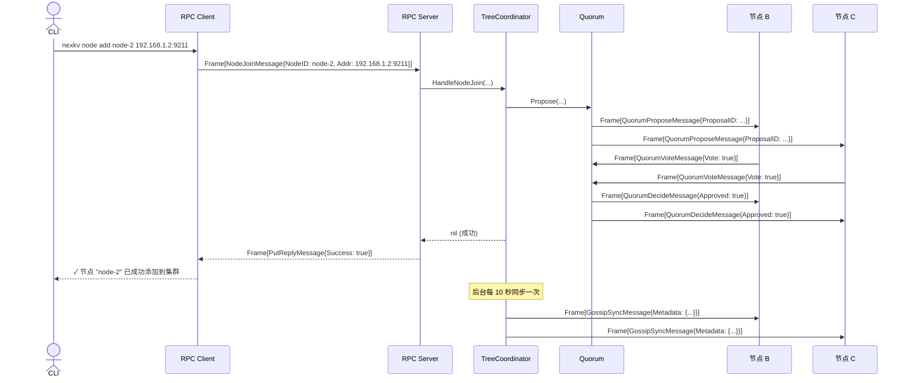

**示例 2：Gossip 周期性同步**

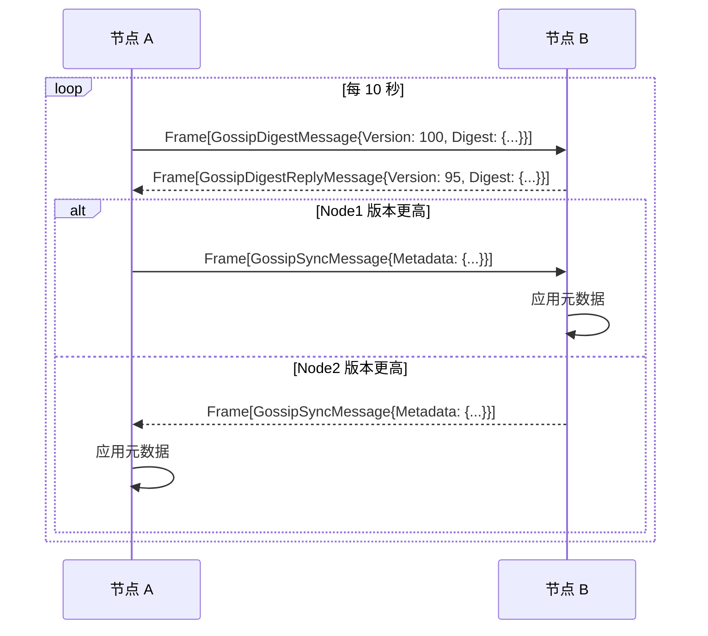

**示例 3：Node Ping/Pong 心跳检测**

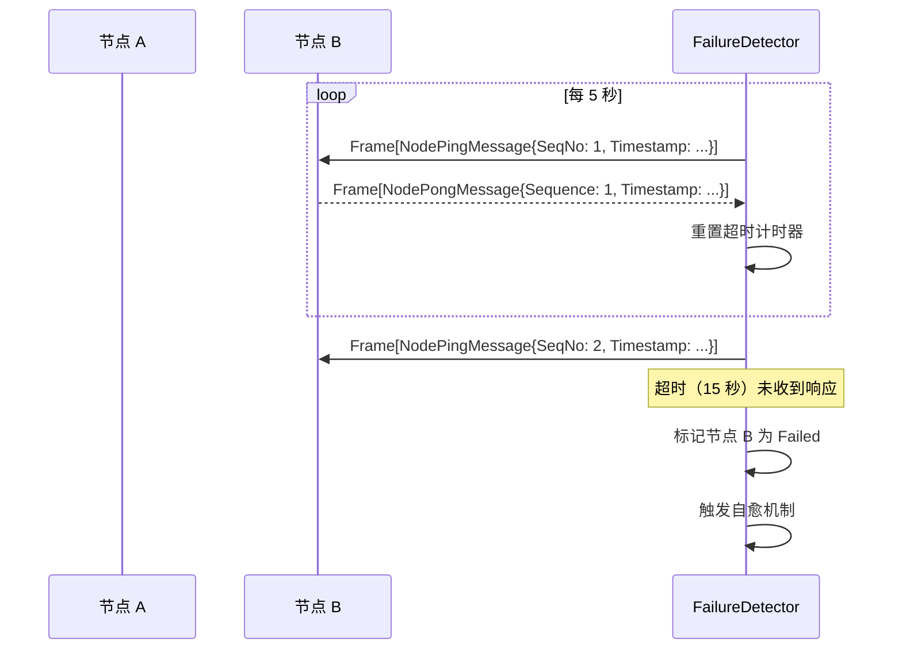

**示例 4：`nexkv cluster topology` 拓扑查询**

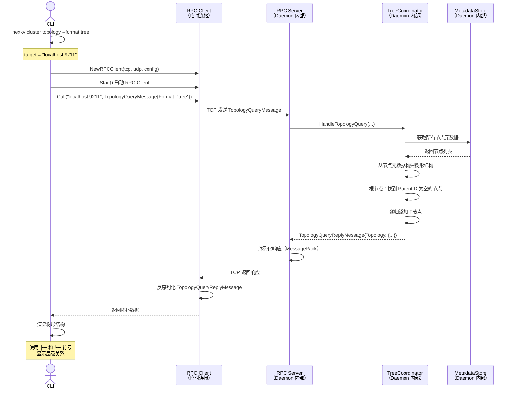

**拓扑查询输出示例**：

**场景 1：空集群（仅种子节点）**
```bash
$ nexkv cluster topology --target localhost:9211

✅ 集群拓扑（根节点：node-1921681101-9211，总节点数：1，健康节点数：1，树形深度：1）
node-1921681101-9211 [Ready] | 地址：192.168.1.101:9211 | 子节点数：0 | 种子节点
```

**场景 2：多层树形（生产环境）**
```bash
$ nexkv cluster topology --format tree

✅ 集群拓扑（根节点：seed-1，总节点数：5，健康节点数：5，树形深度：3）
seed-1 [Ready] | 地址：192.168.1.101:9211 | 子节点数：2 | 种子节点
├─ node-1921681102-9211 [Ready] | 地址：192.168.1.102:9211 | 子节点数：1 | 最后心跳：2026-01-27 10:30:00
│  └─ node-1921681104-9211 [Ready] | 地址：192.168.1.104:9211 | 子节点数：0 | 最后心跳：2026-01-27 10:30:05
└─ node-1921681103-9211 [Ready] | 地址：192.168.1.103:9211 | 子节点数：1 | 最后心跳：2026-01-27 10:30:02
   └─ node-1921681105-9211 [Ready] | 地址：192.168.1.105:9211 | 子节点数：0 | 最后心跳：2026-01-27 10:30:06
```

**场景 3：JSON 格式输出（脚本解析友好）**
```bash
$ nexkv cluster topology --format json

{
  "success": true,
  "topology": {
    "root": {
      "node_id": "seed-1",
      "addr": "192.168.1.101:9211",
      "parent_id": "",
      "children": ["node-1921681102-9211", "node-1921681103-9211"],
      "level": 0,
      "status": "Ready",
      "priority": 0,
      "metadata": {"seed": "true"}
    },
    "nodes": [
      {
        "node_id": "seed-1",
        "addr": "192.168.1.101:9211",
        "parent_id": "",
        "children": ["node-1921681102-9211", "node-1921681103-9211"],
        "level": 0,
        "status": "Ready",
        "priority": 0,
        "metadata": {"seed": "true"}
      },
      {
        "node_id": "node-1921681102-9211",
        "addr": "192.168.1.102:9211",
        "parent_id": "seed-1",
        "children": ["node-1921681104-9211"],
        "level": 1,
        "status": "Ready",
        "priority": 0,
        "metadata": {}
      }
    ],
    "version": 123
  },
  "timestamp": 1706654400100000000
}
```

**输出格式说明**：

| 格式 | 特点 | 适用场景 |
|------|------|---------|
| **tree**（默认） | 可视化树形结构，使用 ├─ 和 └─ 符号 | 人工查看、运维监控 |
| **json** | 结构化 JSON 格式 | 脚本解析、自动化集成 |
| **wide** | 宽表格格式（每行一个节点） | 文本处理工具（awk/grep） |

**边界场景处理**：

1. **空集群**：仅显示种子节点，树形深度为 1
2. **单层树**：所有节点都是根节点的直接子节点
3. **超深树**（深度 > 5）：使用缩进和符号确保可读性
4. **节点故障**：显示 `[Failed]` 状态和最后成功心跳时间
5. **网络分区**：标注分区边界，显示不可达节点

---

### 4. 风险评估与应对措施

#### 4.1 核心功能风险评估

| 风险点 | 影响等级（高/中/低） | 应对措施 |
|--------|----------------------|----------|
| **误判健康节点为故障** | 中 | 1. 连续 3 次超时才标记<br>2. 提供配置参数调整敏感度<br>3. 节点恢复后自动重新加入 |
| **故障检测器 goroutine 泄漏** | 中 | 1. 使用 stopCh 和 wg.Wait() 确保停止<br>2. 在 Close() 方法中停止检测器<br>3. 单元测试验证 goroutine 停止 |
| **种子节点不可用导致无法加入集群** | 低 | 1. 支持多个种子节点<br>2. 失败后返回错误，不影响手动添加<br>3. 提供重试机制 |
| **负载均衡算法性能开销** | 低 | 1. 只在 AddNode 时执行<br>2. 使用 RWMutex 保护，减少锁竞争<br>3. 可配置回退到随机策略 |
| **并发控制问题** | 中 | 1. 使用 nodesMu 保护节点注册表<br>2. 故障检测器和主流程分离<br>3. 回调函数异步执行，避免阻塞 |

#### 4.2 命令行系统专项风险评估

| 风险点 | 影响等级（高/中/低） | 应对措施 |
|--------|----------------------|----------|
| **配置文件格式错误** | 高 | 1. 启动时验证 YAML 格式<br>2. 必填字段缺失直接报错<br>3. 参数类型合法性检查 |
| **配置文件路径错误** | 中 | 1. 文件不存在时提供明确错误提示<br>2. 支持默认配置文件路径<br>3. 提供配置文件生成命令 |
| **配置参数冲突** | 中 | 1. 命令行参数优先于配置文件<br>2. 冲突参数记录警告日志<br>3. 提供配置验证命令 |
| **网络绑定失败导致启动失败** | 高 | 1. Cluster 环境提供明确的错误提示<br>2. 建议用户检查网卡配置<br>3. 提供手动指定 IP 的回退方案 |
| **多网卡环境 IP 歧义** | 中 | 1. 自动选择第一个私网 IP<br>2. 全局校验：用户指定 IP 必须匹配自动绑定 IP<br>3. 不匹配直接报错，避免运行时错误 |
| **Dev 环境子进程管理失控** | 中 | 1. 使用进程组（Setpgid）统一管理<br>2. stop-dev 命令一键清理所有子进程<br>3. 日志文件独立，便于排查问题 |
| **参数验证不足导致运行时错误** | 中 | 1.urfave/cli 的 Before 函数提前验证<br>2. 必填参数缺失直接报错退出<br>3. 端口范围、IP 格式等合法性检查 |
| **优雅下线超时导致数据不一致** | 高 | 1. 实现超时保护机制<br>2. 超时后强制下线并记录警告<br>3. TreeCoordinator 的 RemoveNode 实现幂等性 |
| **环境参数错误（dev/cluster 混淆）** | 中 | 1. 参数合法性检查（必须是 dev 或 cluster）<br>2. 在帮助文档中明确区分使用场景<br>3. 提供环境检测建议命令 |
| **并发启动导致端口冲突** | 低 | 1. Dev 环境自动递增端口分配（8001, 8002, ...）<br>2. 启动前检查端口占用情况<br>3. 端口冲突时自动跳过并重试 |
| **种子节点全部不可用** | 高 | 1. 支持多个种子节点提高可用性<br>2. 所有种子节点失败时返回错误<br>3. 提供手动添加节点的方式 |
| **配置重载导致状态不一致** | 中 | 1. 重载时验证配置合法性<br>2. 不合法配置保留旧配置<br>3. 重载失败记录详细日志 |

**配置验证流程**：

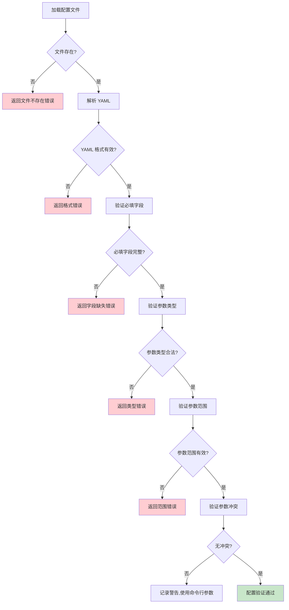

#### 4.3 框架选型风险（urfave/cli）

| 风险点 | 影响等级（高/中/低） | 应对措施 |
|--------|----------------------|----------|
| **urfave/cli v2 API 变化** | 低 | 1. 固定版本号（go.mod 中指定 v2.x.x）<br>2. 充分测试核心功能<br>3. 关注社区更新，谨慎升级 |
| **子命令扩展性不足** | 低 | 1.urfave/cli 支持无限嵌套子命令<br>2. 声明式定义，易于添加新命令<br>3. 模块化设计，每个命令独立文件 |
| **与现有代码集成复杂度** | 中 | 1. 命令层只负责参数解析，业务逻辑在模块层<br>2. 清晰的接口定义（TreeCoordinator、FailureDetector）<br>3. 依赖注入模式，便于测试和替换 |

### 5. 测试计划

#### 5.1 单元测试（核心功能）

| 测试用例 | 测试内容 | 预期结果 |
|---------|---------|---------|
| **TestFailureDetector_StartStop** | 启动和停止故障检测器 | 检测器正常启动和停止，无 goroutine 泄漏 |
| **TestFailureDetector_DetectFailure** | 模拟节点心跳超时 | 节点在超时后被标记为 Failed |
| **TestFailureDetector_Recovery** | 模拟故障节点恢复 | 节点重新发送心跳后恢复为 Ready |
| **TestFailureDetector_ConsecutiveTimeouts** | 连续超时检测 | 3 次超时后才标记为 Failed |
| **TestJoinCluster_Success** | 通过种子节点加入集群 | 成功获取节点列表并加入 |
| **TestJoinCluster_Retry** | 种子节点连接重试 | 失败后自动重试，最终成功 |
| **TestJoinCluster_AllSeedsFailed** | 所有种子节点失败 | 返回错误，不影响手动添加 |
| **TestSelectOptimalParent_LoadBalance** | 负载均衡策略选择 | 选择子节点数量最少的父节点 |
| **TestSelectOptimalParent_NoAvailable** | 无可用父节点 | 返回错误 |
| **TestHealthCallback** | 健康检查回调触发 | 状态变更时正确触发回调 |

#### 5.2 单元测试（命令行系统）

| 测试用例 | 测试内容 | 预期结果 |
|---------|---------|---------|
| **TestNetworkConfig_DevEnv** | Dev 环境网络配置 | 强制绑定 127.0.0.1，端口自动分配 |
| **TestNetworkConfig_ClusterEnv** | Cluster 环境网络配置 | 自动选择第一个私网 IP |
| **TestNetworkConfig_NoPrivateIP** | 无私网 IP 场景 | 返回明确错误提示 |
| **TestNetworkConfig_IPMismatch** | 用户指定 IP 与自动绑定 IP 不一致 | 返回校验错误，不启动服务 |
| **TestStartCommand_MissingConfig** | 缺少配置文件参数 |urfave/cli 提前拦截，返回错误 |
| **TestStartCommand_InvalidEnv** | 无效的环境参数 |urfave/cli 提示必须是 dev 或 cluster |
| **TestStartCommand_DevBatchStart** | Dev 环境批量启动 3 个节点 | 成功启动 3 个子进程，端口递增 |
| **TestNodeRemoveCommand_DevEnv** | Dev 环境移除节点 | 根据 node.id 查找并停止进程 |
| **TestNodeRemoveCommand_ClusterEnv** | Cluster 环境优雅下线 | 调用 TreeCoordinator.RemoveNode |
| **TestClusterCommand_ListNodes** | 查看集群拓扑 | 调用 TreeCoordinator.ListNodes 并格式化输出 |
| **TestHealthCommand_CheckHealth** | 健康检查 | 调用 FailureDetector 获取节点状态 |
| **TestStopDevCommand_KillAll** | 停止所有 Dev 节点 | 查找并停止所有 nexkv 子进程 |
| **TestConfigReload_UpdateSeedNodes** | 配置重载更新种子节点 | 种子节点列表成功更新 |
| **TestConfigReload_InvalidConfig** | 配置重载无效配置 | 返回错误，保留旧配置 |
| **TestNodeStatusCommand_Details** | 查看节点详细状态 | 显示节点权重、黑名单状态等 |
| **TestNodeSetWeightCommand** | 设置节点权重 | 节点权重成功更新 |
| **TestNodeBlacklistCommand** | 节点加入黑名单 | 节点成功加入黑名单 |
| **TestNodeMigrateChildren** | 手动触发子节点迁移 | 子节点成功迁移到新父节点 |

#### 5.2.1 拓扑查询命令测试（新增）

| 测试用例 | 测试内容 | 预期结果 |
|---------|---------|---------|
| **TestTopologyCommand_EmptyCluster** | 空集群拓扑查询 | 显示根节点，树形深度 1 |
| **TestTopologyCommand_MultiLayerTree** | 多层树形拓扑 | 正确显示父子关系和层级 |
| **TestTopologyCommand_JSONFormat** | JSON 格式输出 | 输出合法 JSON，可被脚本解析 |
| **TestTopologyCommand_WideFormat** | 宽格式输出 | 包含完整节点信息 |
| **TestTopologyCommand_TargetNode** | 查询指定节点拓扑 | 显示该节点及其子树 |
| **TestTopologyCommand_DisconnectedCluster** | 离线集群查询 | 友好错误提示 |

#### 5.2.2 消息编解码测试（新增）

| 测试用例 | 测试内容 | 预期结果 |
|---------|---------|---------|
| **TestNodeJoinMessage_EncodeDecode** | NodeJoinMessage 序列化/反序列化 | MessagePack 编解码正确，字段无丢失 |
| **TestNodeJoinReplyMessage_EncodeDecode** | NodeJoinReplyMessage 序列化/反序列化 | 响应消息正确解析 |
| **TestTopologyQueryMessage_EncodeDecode** | TopologyQueryMessage 序列化/反序列化 | 查询参数正确传递 |
| **TestTopologyQueryReplyMessage_EncodeDecode** | TopologyQueryReplyMessage 序列化/反序列化 | 拓扑结构正确还原 |
| **TestTopologyNode_MessagePack** | TopologyNode 嵌套结构序列化 | 子节点列表正确序列化 |
| **TestMessageFrame_CorrelationID** | 消息帧关联 ID 匹配 | 请求-响应 correlationID 一致 |

#### 5.2.3 RPC 客户端/服务端测试（新增）

| 测试用例 | 测试内容 | 预期结果 |
|---------|---------|---------|
| **TestRPCClient_CallTimeout** | RPC 调用超时 | 返回超时错误，无 goroutine 泄漏 |
| **TestRPCClient_Retry** | RPC 调用重试 | 失败后自动重试，最大次数限制 |
| **TestRPCClient_BatchCall** | 批量 RPC 调用 | 批量请求并发执行 |
| **TestRPCServer_HandleNodeJoin** | 处理节点加入请求 | 正确路由到 TreeCoordinator |
| **TestRPCServer_HandleTopologyQuery** | 处理拓扑查询请求 | 返回完整拓扑结构 |
| **TestRPCServer_ConcurrentHandlers** | 并发请求处理 | Worker Pool 正确分发，无请求丢失 |

**RPC 测试示例**：

```go
// TestRPCServer_HandleTopologyQuery RPC 服务端拓扑查询测试
func TestRPCServer_HandleTopologyQuery(t *testing.T) {
    // Given: 创建 RPC Server 和 Mock TreeCoordinator
    mockTC := &mockTreeCoordinator{
        topology: &TopologyTree{
            Root: &TopologyNode{
                NodeID: "node-1",
                Addr:   "127.0.0.1:9211",
                Children: []string{"node-2", "node-3"},
            },
        },
    }

    server := setupTestRPCServer(t, mockTC)
    defer server.Stop()

    // When: 发送拓扑查询请求
    req := &TopologyQueryMessage{
        BaseMessage: BaseMessage{
            MessageType: MessageTypeTopologyQuery,
        },
        NodeID: "node-1",
        Format: "tree",
    }

    resp, err := server.HandleRequest(context.Background(), req)

    // Then: 验证响应
    assert.NoError(t, err)
    topoReply, ok := resp.(*TopologyQueryReplyMessage)
    assert.True(t, ok)
    assert.True(t, topoReply.Success)
    assert.NotNil(t, topoReply.Topology)
}
```

#### 5.2.4 并发场景测试

| 测试用例 | 测试内容 | 预期结果 |
|---------|---------|---------|
| **TestAddNode_Concurrent** | 并发添加 10 个节点 | 所有节点成功添加，无数据竞争 |
| **TestRemoveNode_Concurrent** | 并发移除 5 个节点 | 所有节点成功移除，无资源泄漏 |
| **TestUpdateSeedNodes_Concurrent** | 并发更新种子节点 | 最后一次更新生效，无状态不一致 |
| **TestSetNodeWeight_Concurrent** | 并发设置节点权重 | 最后一次设置生效，无竞态条件 |
| **TestBlacklistNode_Concurrent** | 并发黑名单操作 | 操作序列化，无状态冲突 |
| **TestMigrateChildren_Concurrent** | 并发触发子节点迁移 | 迁移操作串行化，数据一致 |
| **TestConfigReload_Concurrent** | 并发重载配置 | 配置重载串行化，旧配置保留 |
| **TestHeartbeat_Concurrent** | 并发心跳更新 | 心跳计数器准确，无计数丢失 |

#### 5.2.4.1 读写压力测试（新增）

| 测试用例 | 测试内容 | 预期结果 |
|---------|---------|---------|
| **TestReadWritePressure_100Ops** | 100 次读写操作压力 | 无死锁，数据一致，性能达标 |
| **TestReadWritePressure_1000Ops** | 1000 次读写操作压力 | 无内存泄漏，响应时间稳定 |
| **TestConcurrentReadWrite_Mixed** | 混合读写并发（50%读/50%写） | 读写隔离，无脏读 |
| **TestListNodes_HeavyRead** | 100 次/秒持续查询节点列表 | 查询性能稳定，无阻塞 |
| **TestTopologyQuery_HeavyRead** | 100 次/秒持续查询拓扑 | 拓扑查询快速返回，无性能下降 |
| **TestBatchAddRemove_Stress** | 批量添加后批量删除 | 资源正确释放，无泄漏 |

**压力测试示例**：

```go
// TestConcurrentReadWrite_Mixed 混合读写并发压力测试
func TestConcurrentReadWrite_Mixed(t *testing.T) {
    coordinator, _ := setupTestCoordinator(t)
    defer coordinator.Stop()

    // 先添加 50 个节点
    for i := 0; i < 50; i++ {
        nodeID := fmt.Sprintf("node-%d", i)
        addr := fmt.Sprintf("127.0.0.1:%d", 9000+i)
        if err := coordinator.AddNode(nodeID, addr); err != nil {
            t.Fatalf("添加节点失败: %v", err)
        }
    }

    const numOps = 1000
    const numReaders = 10
    const numWriters = 10
    var wg sync.WaitGroup
    errors := make(chan error, numOps)

    // 读操作：查询节点列表
    for i := 0; i < numReaders; i++ {
        wg.Add(1)
        go func(readerID int) {
            defer wg.Done()
            for j := 0; j < numOps/(numReaders+numWriters); j++ {
                nodes, err := coordinator.ListNodes()
                if err != nil {
                    errors <- fmt.Errorf("reader %d: %w", readerID, err)
                    return
                }
                // 验证数据一致性
                if len(nodes) == 0 {
                    errors <- fmt.Errorf("reader %d: 节点列表为空", readerID)
                    return
                }
            }
        }(i)
    }

    // 写操作：更新节点权重
    for i := 0; i < numWriters; i++ {
        wg.Add(1)
        go func(writerID int) {
            defer wg.Done()
            for j := 0; j < numOps/(numReaders+numWriters); j++ {
                nodeID := fmt.Sprintf("node-%d", j%50)
                weight := (j % 10) + 1
                if err := coordinator.SetNodeWeight(nodeID, weight); err != nil {
                    errors <- fmt.Errorf("writer %d: %w", writerID, err)
                    return
                }
            }
        }(i)
    }

    wg.Wait()
    close(errors)

    // 验证无错误
    errCount := 0
    for err := range errors {
        t.Logf("压力测试错误: %v", err)
        errCount++
    }

    if errCount > 0 {
        t.Fatalf("压力测试发现 %d 个错误", errCount)
    }
}

// TestListNodes_HeavyRead 节点列表查询压力测试
func TestListNodes_HeavyRead(t *testing.T) {
    coordinator, _ := setupTestCoordinator(t)
    defer coordinator.Stop()

    // 添加 100 个节点
    for i := 0; i < 100; i++ {
        nodeID := fmt.Sprintf("node-%d", i)
        addr := fmt.Sprintf("127.0.0.1:%d", 9000+i)
        if err := coordinator.AddNode(nodeID, addr); err != nil {
            t.Fatalf("添加节点失败: %v", err)
        }
    }

    const numGoroutines = 100
    const numQueriesPerGoroutine = 100

    var wg sync.WaitGroup
    results := make(chan time.Duration, numGoroutines*numQueriesPerGoroutine)

    start := time.Now()

    for i := 0; i < numGoroutines; i++ {
        wg.Add(1)
        go func() {
            defer wg.Done()
            for j := 0; j < numQueriesPerGoroutine; j++ {
                queryStart := time.Now()
                _, err := coordinator.ListNodes()
                queryDuration := time.Since(queryStart)
                if err != nil {
                    t.Errorf("查询失败: %v", err)
                    return
                }
                results <- queryDuration
            }
        }()
    }

    wg.Wait()
    close(results)

    totalDuration := time.Since(start)

    // 统计查询延迟
    var totalQueryTime time.Duration
    var maxQueryTime time.Duration
    count := 0

    for duration := range results {
        totalQueryTime += duration
        if duration > maxQueryTime {
            maxQueryTime = duration
        }
        count++
    }

    avgQueryTime := totalQueryTime / time.Duration(count)
    qps := float64(count) / totalDuration.Seconds()

    logging.WithFields(map[string]interface{}{
        "total_queries":     count,
        "total_duration":    totalDuration,
        "avg_query_time":    avgQueryTime,
        "max_query_time":    maxQueryTime,
        "qps":               qps,
    }).Info("压力测试结果")

    // 验证性能指标
    if avgQueryTime > 10*time.Millisecond {
        t.Errorf("平均查询时间过长: %v", avgQueryTime)
    }
    if qps < 1000 {
        t.Errorf("QPS 过低: %.2f", qps)
    }
}
```

**并发测试示例**：

```go
// TestAddNode_Concurrent 并发添加节点测试
func TestAddNode_Concurrent(t *testing.T) {
    coordinator, _ := setupTestCoordinator(t)
    defer coordinator.Stop()

    const numNodes = 10
    var wg sync.WaitGroup
    errors := make(chan error, numNodes)

    for i := 0; i < numNodes; i++ {
        wg.Add(1)
        go func(index int) {
            defer wg.Done()
            nodeID := fmt.Sprintf("node-%d", index)
            addr := fmt.Sprintf("127.0.0.1:%d", 9000+index)

            if err := coordinator.AddNode(nodeID, addr); err != nil {
                errors <- err
            }
        }(i)
    }

    wg.Wait()
    close(errors)

    // 验证无错误
    for err := range errors {
        t.Fatalf("并发添加节点失败: %v", err)
    }

    // 验证所有节点都已添加
    nodes, _ := coordinator.ListNodes()
    if len(nodes) != numNodes+1 { // +1 for local node
        t.Fatalf("期望 %d 个节点，实际 %d 个", numNodes+1, len(nodes))
    }
}
```

#### 5.3 集成测试

##### 5.3.1 CLI 与 Daemon 通信集成测试（新增）

| 测试用例 | 测试内容 | 预期结果 |
|---------|---------|---------|
| **TestCLI_RPC_NodeAdd** | CLI 通过 RPC 添加节点 | 节点成功添加，CLI 显示成功 |
| **TestCLI_RPC_NodeRemove** | CLI 通过 RPC 移除节点 | 节点成功移除，CLI 显示成功 |
| **TestCLI_RPC_TopologyQuery** | CLI 通过 RPC 查询拓扑 | 返回树形拓扑，格式正确 |
| **TestCLI_RPC_ConnectionRefused** | Daemon 未启动 | CLI 显示友好错误提示 |
| **TestCLI_RPC_Timeout** | RPC 调用超时 | CLI 显示超时错误 |
| **TestCLI_RPC_TargetParameter** | --target 参数指定节点 | 连接到指定节点 |

**CLI-RPC 集成测试示例**：

```go
// TestCLI_RPC_NodeAdd CLI 节点添加集成测试
func TestCLI_RPC_NodeAdd(t *testing.T) {
    // Given: 启动 Daemon（真实 RPC Server）
    daemon := setupTestDaemon(t, "127.0.0.1:0")
    defer daemon.Stop()

    // Given: 创建 CLI（真实 RPC Client）
    cli := NewTestCLI(t)
    targetAddr := daemon.GetListenAddr()

    // When: 执行 node add 命令
    output, err := cli.Run([]string{"node", "add", "node-2", "192.168.1.2:9211",
        "--target", targetAddr})

    // Then: 验证输出
    assert.NoError(t, err)
    assert.Contains(t, output, "节点 \"node-2\" 已成功添加")

    // 验证节点确实被添加
    nodes := daemon.GetTreeCoordinator().ListNodes()
    assert.Contains(t, nodes, "node-2")
}
```

##### 5.3.2 节点管理集成测试

| 测试用例 | 测试内容 | 预期结果 |
|---------|---------|---------|
| **TestNodeFailureDetection** | 3 节点集群，1 个节点故障 | 30 秒内检测到故障并标记 |
| **TestNodeAutoRecovery** | 故障节点重启恢复 | 自动恢复为 Ready 状态 |
| **TestNewNodeJoinWithSeed** | 新节点通过种子节点加入 | 成功加入集群并同步拓扑 |
| **TestLoadBalancedAddNode** | 添加 10 个节点 | 各节点子节点数量差异 ≤ 2 |
| **TestCLI_FullWorkflow** | CLI 完整流程测试 | 启动 → 查询 → 移除 → 验证全流程正常 |
| **TestCLI_NetworkBinding** | 网络绑定集成测试 | Dev/Cluster 环境自动绑定正确 |

#### 5.4 端到端测试（E2E）

| 测试用例 | 测试内容 | 预期结果 |
|---------|---------|---------|
| **E2E_DevEnvironment** | Dev 环境完整测试 | 启动 3 节点 → 写入数据 → 查询数据 → 移除节点 → 停止所有节点 |
| **E2E_ClusterEnvironment** | Cluster 环境完整测试 | 启动种子节点 → 启动普通节点 → 验证拓扑 → 故障注入 → 验证自愈 |
| **E2E_NetworkFailover** | 网络故障场景 | 模拟网络分区，验证节点故障检测和恢复 |
| **E2E_LoadBalancing** | 负载均衡验证 | 添加多个节点，验证父节点选择均衡性 |

---

##### 5.5 测试覆盖率目标（新增）

| 模块 | 目标覆盖率 | 测试文件 |
|------|-----------|---------|
| **cmd/nexkv** | 70% | `cmd/nexkv/cli_test.go` |
| **internal/metadata/cluster** | 80% | `cluster/*_test.go` |
| **internal/metadata/transport** | 85% | `transport/rpc_test.go`, `transport/rpc_integration_test.go` |
| **internal/metadata/transport/msg_codec.go** | 90% | `transport/msg_codec_test.go` |
| **internal/metadata/types** | 80% | `types/msg_types_test.go` |

**总体目标**：**单元测试覆盖率 > 80%**，核心模块（Transport、Types）> 85%

---

##### 5.6 测试文件安排（新增）

###### 5.6.1 单元测试文件

```
internal/metadata/
├── cluster/
│   ├── tree_coordinator_test.go       # TreeCoordinator 单元测试
│   ├── failure_detector_test.go       # FailureDetector 单元测试
│   └── node_management_test.go         # 节点管理功能测试
├── transport/
│   ├── rpc_client_test.go              # RPC Client 单元测试（Mock）
│   ├── rpc_server_test.go              # RPC Server 单元测试（Mock）
│   └── msg_codec_test.go              # 消息编解码测试
└── types/
    └── msg_types_test.go               # 消息类型测试
```

###### 5.6.2 集成测试文件

```
internal/metadata/
├── transport/
│   └── rpc_integration_test.go        # RPC 集成测试（真实 TCP）
└── cluster/
    └── cluster_integration_test.go    # 集群集成测试（3 节点）
```

###### 5.6.3 E2E 测试文件

```
tests/
├── e2e/
│   ├── cli_node_test.go               # CLI 节点管理 E2E
│   ├── cli_topology_test.go           # CLI 拓扑查询 E2E
│   └── cluster_lifecycle_test.go      # 集群生命周期 E2E
```

---

##### 5.7 测试执行顺序（新增）

```bash
# 1. 单元测试（快速反馈，Mock 依赖）
make test                            # 所有单元测试
make test-race                        # 竞态检测

# 2. 集成测试（需要真实网络）
go test -v -tags=integration ./internal/metadata/transport/

# 3. E2E 测试（完整流程）
go test -v -tags=e2e ./tests/e2e/

# 4. 覆盖率报告
make test-coverage
```

---

##### 5.8 CI 测试流程（新增）

```yaml
# .github/workflows/test.yml
name: Test PR-032

on: [push, pull_request]

jobs:
  unit-test:
    runs-on: ubuntu-latest
    steps:
      - make test
      - make test-race
      - bash: go tool cover -func=coverage.out | grep total

  integration-test:
    runs-on: ubuntu-latest
    steps:
      - go test -v -tags=integration ./internal/metadata/transport/

  e2e-test:
    runs-on: ubuntu-latest
    steps:
      - go test -v -tags=e2e ./tests/e2e/
```

### 6. 架构师评审记录（循环优化，直至通过）

| 评审轮次 | 评审日期 | 评审人（架构师） | 核心评审意见 | 优化措施（含AI辅助修改） | 优化结果 |
|----------|----------|------------------|--------------|--------------------------|----------|
| 第1轮 | 待评审 | 待评审 | 待评审 | 待优化 | 待确认 |

### 7. 预审批确认
> **架构师签字/备注**：XXX 202X-XX-XX 该Feature方案可行，风险可控，同意启动开发，需严格按照文档落地，确保CI通过后提交Post总结。

---

## 第二部分：流程节点记录（开发/CI过程追溯）

### ⚠️ 开发注意事项

> **重要**：在开发过程中（Coding 阶段），如果遇到以下情况，**请立即与架构师沟通**：
>
> - 🤔 Pre 文档中没有明确说明的技术难题
> - 🔧 发现架构设计中的矛盾或冲突
> - ⚠️ 遇到预期的性能瓶颈或技术风险
> - 💡 有更好的实现方案想提出
> - 🐛 发现 Pre 文档中遗漏的关键场景
>
> **沟通方式**：直接在对话中说明问题，无需等待，确保问题及时解决。

---

### 1. 开发过程记录

| 节点 | 完成日期 | 具体内容 | 交付物 |
|------|----------|----------|--------|
| 启动开发 | 待定 | [描述开发内容] | [代码提交至分支] |
| 本地测试 | 待定 | [描述测试内容] | [测试报告/覆盖率数据] |
| Post文档编写 | 待定 | [编写后置总结文档] | [第三部分：后置部分] |
| 架构师Post批准 | 待定 | [架构师评审Post文档] | [批准签字/备注] |
| 提交GitHub | 待定 | [推送分支，创建PR] | [GitHub PR链接] |

### 2. CI流程记录（修复Bug直至通过）

| CI轮次 | 触发时间 | 结果 | 问题详情 | 修复措施 | 修复结果 |
|--------|----------|------|----------|----------|----------|
| 第1轮 | 待定 | 失败/成功 | [问题描述] | [修复方案] | [已修复/重新触发] |
| 第2轮 | 待定 | 失败/成功 | [问题描述] | [修复方案] | [已修复/通过] |

### 3. 合并记录

| 合并时间 | 合并方式 | 审批人 | 备注 |
|----------|----------|--------|------|
| 待定 | Squash Merge / Merge Commit | [架构师] | [补充说明] |

---

## 第三部分：后置部分（CI通过后编写，总结/成果/ToDo）

### 1. 核心成果总结（开发了啥，结果怎样）

#### 1.1 功能成果
- **已完成**：[列出完成的功能点]
- **与Pre文档差异**：[说明实际实现与计划的差异]

#### 1.2 性能/数据成果
- **性能数据**：[列出实际测试数据]
- **测试成果**：[说明测试覆盖情况]

#### 1.3 代码/文档交付物

| 类型 | 具体内容 | 链接/路径 |
|------|----------|-----------|
| 代码变更 | [列出主要变更文件] | [GitHub PR链接] |
| 文档更新 | [列出更新的文档] | [文档路径] |

### 2. 未完成项与ToDo清单（有哪些没干，后续规划）

#### 2.1 本次PR未完成项
- **未支持**：[列出未实现但相关的功能]
- **遗留问题**：[列出已知问题]

#### 2.2 ToDo清单（优先级排序）

| 优先级 | 任务内容 | 预估工期 | 关联PR/需求 | 备注 |
|--------|----------|----------|-------------|------|
| 高/中/低 | [任务描述] | X个工作日 | PR-XXX | [补充说明] |

### 3. 下一步工作建议（建议干啥）
1. **优先推进**：[列出高优先级任务]
2. **监控要点**：[列出需要关注的生产指标]
3. **运维补充**：[需要补充的运维文档或操作]
4. **后续规划**：[后续功能迭代方向]
5. **反馈收集**：[需要收集的使用反馈]

---

## 文档归档信息

| 项目 | 内容 |
|------|------|
| 文档最终版本 | V1.0 |
| 归档日期 | 待定 |
| 归档路径 | `docs/06_project_management/pr_documents/feature/2026-01-27_PR-032_节点管理增强_全流程.md` |
| 后续维护人 | 🤖 核心开发工程师 B |
