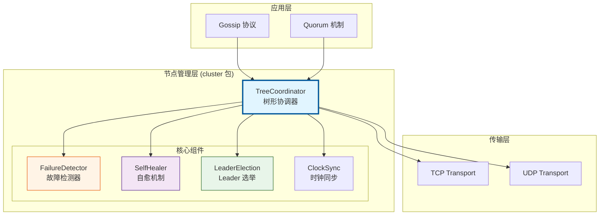
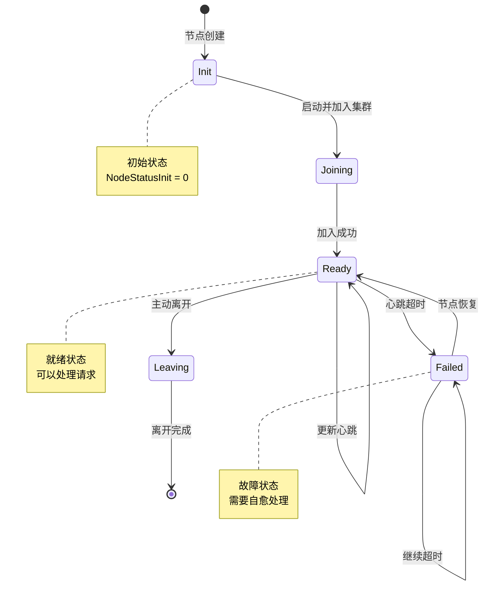
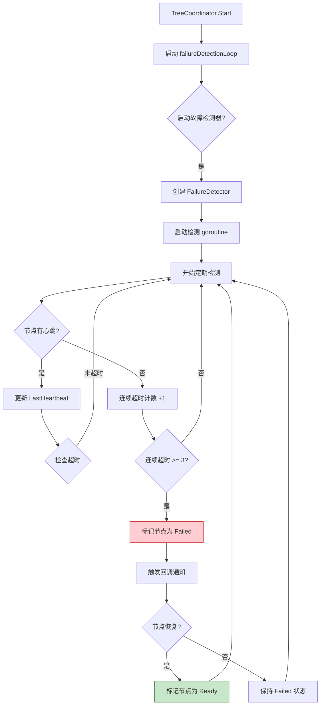
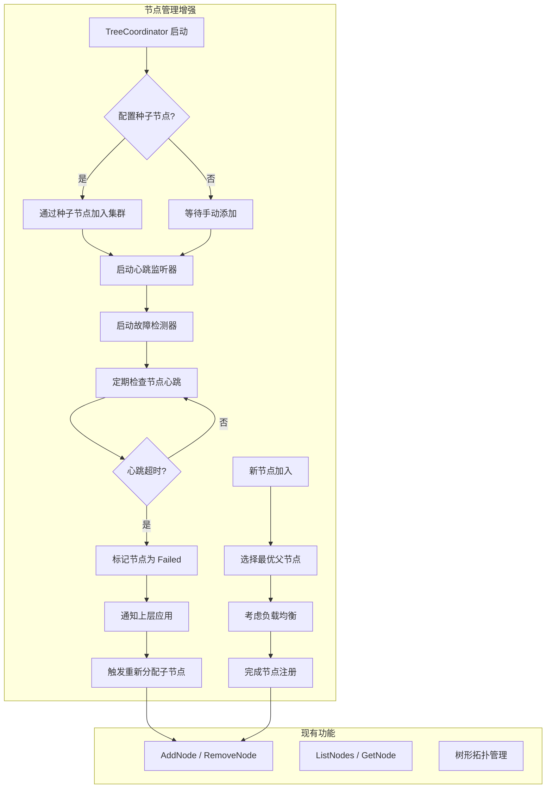
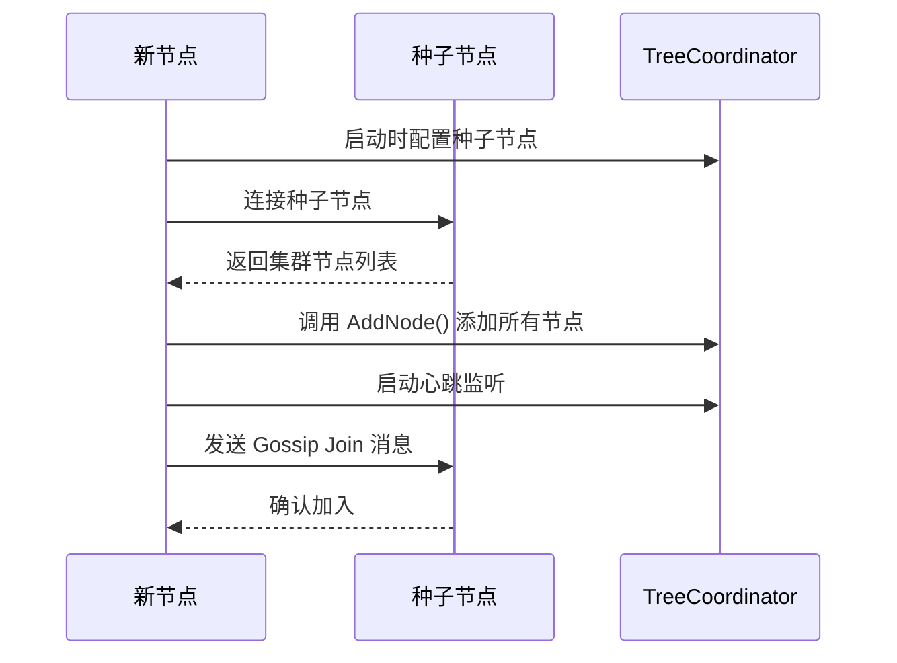

# 【PR全流程文档】Feature - 节点管理增强（故障自愈 + 节点发现）

> **文档说明**：本文档包含「前置规划」和「后置总结」两部分，记录从需求对齐到开发完成的全流程，一个PR对应一份全流程文档，归档后作为项目追溯依据。

---

## 第一部分：前置部分（开工前必完成，架构师评审通过）

### 1. 基础信息（与分支/PR绑定）

| 项目 | 内容 |
|------|------|
| 工作类型 | 新功能开发（Feature） |
| PR编号 | PR-032（创建GitHub PR后补充完整） |
| 分支名称 | feature/node-management-improvements |
| 工作主题 | 节点管理增强：故障自愈 + 节点发现 + 负载均衡优化 |
| 负责人 | 🤖 核心开发工程师 B |
| 分支创建日期 | 2026-01-27 |
| 计划开工日期 | 2026-01-27 |
| 计划CI通过日期 | 2026-01-28 |
| 关联需求单号 | 无（内部优化需求） |
| 架构师评审状态 | □ 待评审 □ 评审中 □ 评审通过 □ 需优化（循环记录） |
| 预审批结果 | □ 未通过 □ 已通过（架构师签字/备注：XXX 202X-XX-XX 同意开工） |

### 2. 背景与目标（为什么干）

#### 2.1 背景

**业务场景**：
- NexKV 作为分布式 KV 存储系统，需要在 3-50 节点的集群环境中稳定运行
- 节点可能因网络故障、进程崩溃、机器故障等原因暂时不可用
- 新节点加入集群时需要自动发现和注册

**现有问题**：
1. **故障检测不及时**：
   - 当前只依赖被动心跳接收，无主动超时检测机制
   - 故障节点无法及时标记为 Failed 状态
   - 依赖 Gossip 协议异步扩散状态，延迟较高

2. **节点发现机制缺失**：
   - 新节点启动时需要手动配置所有集群节点地址
   - 缺少种子节点机制
   - 缺少自动发现和加入集群的能力

3. **负载均衡不完善**：
   - AddNode 时随机选择父节点，未考虑负载均衡
   - 未考虑节点当前子节点数量、网络延迟等因素
   - 可能导致某些节点负载过重

**价值**：
- **提高系统可用性**：快速检测故障节点，自动标记和隔离，避免请求路由到故障节点
- **简化运维操作**：新节点启动时自动加入集群，无需手动配置
- **提升性能**：负载均衡优化，避免热点节点，提升整体性能

#### 2.2 核心目标（可量化、可验证）

1. **功能目标**：
   - 实现**故障自愈机制**：自动检测故障节点并标记为 Failed 状态
   - 实现**节点发现机制**：支持种子节点配置，自动加入集群
   - 实现**负载均衡优化**：为子节点选择最优父节点

2. **性能目标**：
   - **故障检测时间**：< 30 秒（可配置）
   - **节点加入时间**：< 10 秒
   - **负载均衡效果**：各节点子节点数量差异 ≤ 2

3. **可用性目标**：
   - **故障检测准确率**：> 99%（避免误判）
   - **自动恢复成功率**：> 95%

#### 2.3 明确边界（不做什么，避免范围蔓延）

**本次不支持**：
- 节点自动迁移（数据迁移）
- 自动副本重建
- 跨数据中心节点发现
- 节点资源限制（CPU、内存）

**本次不优化**：
- Gossip 协议性能优化（已在其他计划中）
- Transport 层连接池优化
- 节点认证和授权

### 3. 现有实现分析（cluster 目录）

#### 3.0.1 目录结构

```
internal/metadata/cluster/
├── tree_coordinator.go        # 树形协调器（核心）
├── tree_coordinator_test.go   # 单元测试
├── failure_detector.go        # 故障检测器
├── failure_detector_test.go   # 故障检测测试
├── self_healing.go            # 自愈机制
├── self_healing_test.go       # 自愈测试
├── leader_election.go         # Leader 选举
├── leader_election_test.go    # Leader 选举测试
├── clock_sync.go              # 时钟同步
├── virtual_node.go            # 虚拟节点
├── node_id.go                 # 节点 ID 生成
└── node_id_test.go            # 节点 ID 测试
```

#### 3.0.2 模块架构图



#### 3.0.3 TreeCoordinator 类图

```mermaid
classDiagram
    class TreeCoordinator {
        -config* TreeCoordinatorConfig
        -localNode* Node
        -transport Transport
        -allNodes map~string~*Node
        -nodesMu sync.RWMutex
        -state atomic.Int32
        -stats* TreeCoordinatorStats
        -stopCh chan struct{}
        +NewTreeCoordinator() TreeCoordinator
        +Start() error
        +Stop() error
        +GetNode(nodeID) *Node
        +ListNodes() []*Node
        +AddNode(nodeID, addr) error
        +RemoveNode(nodeID) error
        -discoverAndJoin()
        -heartbeatLoop()
        -failureDetectionLoop()
    }

    class Node {
        +NodeID string
        +Addr string
        +ParentID string
        +ChildrenIDs []string
        +Level int
        +Status NodeStatus
        +Priority int
        +LastHeartbeat time.Time
        +Metadata map~string~string
    }

    class TreeCoordinatorConfig {
        +MaxChildren int
        +MaxLevel int
        +HeartbeatInterval time.Duration
        +HeartbeatTimeout time.Duration
        +AutoDiscovery bool
        +EnableSelfHealing bool
    }

    class TreeCoordinatorStats {
        +TotalNodes atomic.Int32
        +OnlineNodes atomic.Int32
        +OfflineNodes atomic.Int32
        +TreeDepth atomic.Int32
    }

    class NodeStatus {
        <<enumeration>>
        NodeStatusInit
        NodeStatusReady
        NodeStatusJoining
        NodeStatusLeaving
        NodeStatusFailed
    }

    TreeCoordinator "1" --> "1" TreeCoordinatorConfig
    TreeCoordinator "1" --> "1" TreeCoordinatorStats
    TreeCoordinator "1" --> "*" Node
    Node --> NodeStatus
```

#### 3.0.4 节点状态机



#### 3.0.5 故障检测流程



#### 3.0.6 TreeCoordinator 核心方法

| 方法 | 功能 | 实现位置 | 状态 |
|------|------|---------|------|
| **NewTreeCoordinator()** | 创建协调器 | Line 202-252 | ✅ 已实现 |
| **Start()** | 启动协调器 | Line 255-288 | ✅ 已实现 |
| **Stop()** | 停止协调器 | Line 291-317 | ✅ 已实现 |
| **GetNode()** | 获取节点信息 | Line 528-538 | ✅ 已实现 |
| **ListNodes()** | 列出所有节点 | Line 541-551 | ✅ 已实现 |
| **AddNode()** | 添加新节点 | Line 602-677 | ✅ 已实现 |
| **RemoveNode()** | 移除节点 | Line 680-737 | ✅ 已实现 |
| **discoverAndJoin()** | 自动发现并加入 | Line 324-331 | ⚠️ TODO |
| **heartbeatLoop()** | 心跳循环 | Line 334-347 | ✅ 已实现 |
| **failureDetectionLoop()** | 故障检测循环 | Line 349+ | ✅ 已实现 |

#### 3.0.7 现有问题分析

1. **discoverAndJoin() 未实现**：
   ```go
   // Line 324-331: TODO 标记
   func (tc *TreeCoordinator) discoverAndJoin() {
       // TODO: 实现自动发现和加入逻辑
       // 1. 通过传输层发现可用节点
       // 2. 选择合适的父节点
       // 3. 发送加入请求
       // 4. 更新本地节点信息
       logging.Debug("自动发现并加入树形结构")
   }
   ```

2. **负载均衡不完善**：
   - AddNode 时父节点选择逻辑为随机选择
   - 未考虑节点负载、网络延迟等因素

3. **故障检测依赖被动心跳**：
   - 缺少主动超时检测机制
   - 需要完善 failureDetectionLoop 实现

---

### 3.1 实现方案改进说明

基于上述现有实现分析，本次 PR 将：

1. **实现 discoverAndJoin()**：
   - 添加种子节点配置
   - 实现节点发现逻辑
   - 完善加入流程

2. **优化父节点选择**：
   - 添加负载均衡策略
   - 添加延迟感知策略（可选）

3. **增强故障检测**：
   - 完善 failureDetectionLoop 实现
   - 添加健康检查回调机制

#### 3.2 整体流程设计



#### 3.2 关键设计点

##### 3.2.1 故障自愈机制

**接口定义**：

```go
// 启动故障检测器
func (tc *TreeCoordinator) StartFailureDetector(interval time.Duration, timeout time.Duration) error

// 停止故障检测器
func (tc *TreeCoordinator) StopFailureDetector() error

// 节点健康检查回调
type NodeHealthCallback func(nodeID string, oldStatus NodeStatus, newStatus NodeStatus)

// 设置健康检查回调
func (tc *TreeCoordinator) SetHealthCallback(callback NodeHealthCallback)
```

**核心机制**：

1. **主动超时检测**：
   - 后台 goroutine 定期检查所有节点的 `LastHeartbeat` 时间
   - 如果 `time.Now() - LastHeartbeat > timeout`，标记节点为 `NodeStatusFailed`
   - 默认检测间隔：10 秒
   - 默认超时时间：30 秒

2. **状态变更通知**：
   - 节点状态变更时触发回调函数
   - 通知上层应用（如 Gossip、Quorum）
   - 触发子节点重新分配

3. **自动故障恢复**：
   - Failed 节点重新发送心跳时，自动标记为 `NodeStatusReady`
   - 触发回调通知节点恢复

**数据结构**：

```go
// 故障检测器配置
type FailureDetectorConfig struct {
    CheckInterval   time.Duration        // 检测间隔（默认 10s）
    FailureTimeout  time.Duration        // 故障超时（默认 30s）
    EnableCallback  bool                 // 是否启用回调
}

// TreeCoordinator 新增字段
type TreeCoordinator struct {
    // ... 现有字段 ...
    failureDetector *failureDetector      // 故障检测器
    healthCallback  NodeHealthCallback    // 健康检查回调
    detectorMu      sync.RWMutex          // 检测器锁
}

// 内部故障检测器
type failureDetector struct {
    config      *FailureDetectorConfig
    coordinator *TreeCoordinator
    stopCh      chan struct{}
    wg          sync.WaitGroup
}
```

**容错设计**：

1. **避免误判**：
   - 连续 3 次检测超时才标记为 Failed（避免网络抖动误判）
   - 提供配置参数调整敏感度

2. **优雅停止**：
   - 使用 `stopCh` 和 `wg.Wait()` 确保检测器完全停止
   - 避免 goroutine 泄漏

##### 3.2.2 节点发现机制

**接口定义**：

```go
// 启动节点发现（通过种子节点）
func (tc *TreeCoordinator) JoinCluster(seedAddrs []string) error

// 种子节点配置
type SeedNodeConfig struct {
    SeedAddresses []string  // 种子节点地址列表
    DialTimeout   time.Duration  // 连接超时（默认 5s）
    RetryInterval time.Duration  // 重试间隔（默认 10s）
    MaxRetries    int        // 最大重试次数（默认 3）
}
```

**核心流程**：



**实现细节**：

1. **种子节点配置**：
   - 在配置文件中指定种子节点地址列表
   - 支持多个种子节点（提高可用性）
   - 按顺序尝试连接，直到成功

2. **自动加入集群**：
   - 连接种子节点，获取集群节点列表
   - 调用 `AddNode()` 添加所有节点到本地拓扑
   - 发送 Gossip Join 消息通知其他节点
   - 启动心跳监听，开始接收心跳

3. **失败重试机制**：
   - 连接失败时自动重试
   - 达到最大重试次数后返回错误
   - 支持手动触发重新加入

**数据结构**：

```go
// TreeCoordinator 新增方法
func (tc *TreeCoordinator) JoinCluster(seedConfig *SeedNodeConfig) error {
    // 1. 连接种子节点
    // 2. 获取集群节点列表
    // 3. 添加节点到本地拓扑
    // 4. 启动心跳监听
    // 5. 发送 Gossip Join 消息
}

// 节点列表请求（通过 Transport 发送）
type NodeListRequest struct {
    NodeID string  // 请求节点ID
}

// 节点列表响应
type NodeListResponse struct {
    Nodes []NodeInfo  // 集群节点列表
}
```

##### 3.2.3 负载均衡优化

**接口定义**：

```go
// 选择最优父节点（内部方法）
func (tc *TreeCoordinator) selectOptimalParent(nodeID string) (string, error)

// 父节点选择策略
type ParentSelectionStrategy int

const (
    // RandomStrategy: 随机选择（现有策略）
    RandomStrategy ParentSelectionStrategy = iota
    // LoadBalancedStrategy: 负载均衡策略（新增）
    LoadBalancedStrategy
    // LatencyAwareStrategy: 延迟感知策略（新增）
    LatencyAwareStrategy
)
```

**核心算法**：

1. **负载均衡策略**：
   - 优先选择子节点数量 < 10 的节点
   - 在符合条件的节点中选择子节点数量最少的
   - 避免选择负载过重的节点

2. **延迟感知策略**（可选）：
   - 测量到候选父节点的网络延迟
   - 优先选择延迟较低的节点
   - 结合负载均衡，避免热点

**实现伪代码**：

```go
func (tc *TreeCoordinator) selectOptimalParent(nodeID string) (string, error) {
    tc.nodesMu.RLock()
    defer tc.nodesMu.RUnlock()

    // 获取所有可能的父节点（Level < maxLevel）
    candidates := tc.getCandidateParents(nodeID)

    // 根据策略选择父节点
    switch tc.config.ParentSelectionStrategy {
    case LoadBalancedStrategy:
        return tc.selectByLoadBalance(candidates)
    case LatencyAwareStrategy:
        return tc.selectByLatency(candidates)
    default:
        return tc.selectRandom(candidates)
    }
}

func (tc *TreeCoordinator) selectByLoadBalance(candidates []*Node) (string, error) {
    var bestNode *Node
    minChildren := int(math.MaxInt32)

    for _, node := range candidates {
        // 跳过子节点已满的节点
        if len(node.ChildrenIDs) >= 10 {
            continue
        }

        // 选择子节点数量最少的
        if len(node.ChildrenIDs) < minChildren {
            minChildren = len(node.ChildrenIDs)
            bestNode = node
        }
    }

    if bestNode == nil {
        return "", ErrNoAvailableParent
    }

    return bestNode.NodeID, nil
}
```

**配置参数**：

```go
type TreeCoordinatorConfig struct {
    // ... 现有字段 ...
    ParentSelectionStrategy ParentSelectionStrategy  // 父节点选择策略
    EnableLatencyMeasurement bool                    // 是否启用延迟测量
    MaxChildrenPerNode       int                     // 每个节点最大子节点数（默认 10）
}
```

#### 3.3 容错设计

1. **故障检测容错**：
   - 连续 3 次超时才标记为 Failed（避免误判）
   - 节点恢复后自动重新加入
   - 回调函数处理失败不阻塞检测器

2. **节点发现容错**：
   - 多个种子节点提高可用性
   - 连接失败自动重试
   - 超时后返回错误，不阻塞启动

3. **负载均衡容错**：
   - 无可用父节点时返回错误
   - AddNode 失败时回滚已添加的节点
   - 不影响现有随机选择策略

### 4. 风险评估与应对措施

| 风险点 | 影响等级（高/中/低） | 应对措施 |
|--------|----------------------|----------|
| **误判健康节点为故障** | 中 | 1. 连续 3 次超时才标记<br>2. 提供配置参数调整敏感度<br>3. 节点恢复后自动重新加入 |
| **故障检测器 goroutine 泄漏** | 中 | 1. 使用 stopCh 和 wg.Wait() 确保停止<br>2. 在 Close() 方法中停止检测器<br>3. 单元测试验证 goroutine 停止 |
| **种子节点不可用导致无法加入集群** | 低 | 1. 支持多个种子节点<br>2. 失败后返回错误，不影响手动添加<br>3. 提供重试机制 |
| **负载均衡算法性能开销** | 低 | 1. 只在 AddNode 时执行<br>2. 使用 RWMutex 保护，减少锁竞争<br>3. 可配置回退到随机策略 |
| **并发控制问题** | 中 | 1. 使用 nodesMu 保护节点注册表<br>2. 故障检测器和主流程分离<br>3. 回调函数异步执行，避免阻塞 |

### 5. 测试计划

#### 5.1 单元测试

| 测试用例 | 测试内容 | 预期结果 |
|---------|---------|---------|
| **TestFailureDetector_StartStop** | 启动和停止故障检测器 | 检测器正常启动和停止，无 goroutine 泄漏 |
| **TestFailureDetector_DetectFailure** | 模拟节点心跳超时 | 节点在超时后被标记为 Failed |
| **TestFailureDetector_Recovery** | 模拟故障节点恢复 | 节点重新发送心跳后恢复为 Ready |
| **TestFailureDetector_ConsecutiveTimeouts** | 连续超时检测 | 3 次超时后才标记为 Failed |
| **TestJoinCluster_Success** | 通过种子节点加入集群 | 成功获取节点列表并加入 |
| **TestJoinCluster_Retry** | 种子节点连接重试 | 失败后自动重试，最终成功 |
| **TestJoinCluster_AllSeedsFailed** | 所有种子节点失败 | 返回错误，不影响手动添加 |
| **TestSelectOptimalParent_LoadBalance** | 负载均衡策略选择 | 选择子节点数量最少的父节点 |
| **TestSelectOptimalParent_NoAvailable** | 无可用父节点 | 返回错误 |
| **TestHealthCallback** | 健康检查回调触发 | 状态变更时正确触发回调 |

#### 5.2 集成测试

| 测试用例 | 测试内容 | 预期结果 |
|---------|---------|---------|
| **TestNodeFailureDetection** | 3 节点集群，1 个节点故障 | 30 秒内检测到故障并标记 |
| **TestNodeAutoRecovery** | 故障节点重启恢复 | 自动恢复为 Ready 状态 |
| **TestNewNodeJoinWithSeed** | 新节点通过种子节点加入 | 成功加入集群并同步拓扑 |
| **TestLoadBalancedAddNode** | 添加 10 个节点 | 各节点子节点数量差异 ≤ 2 |

### 5. 架构师评审记录（循环优化，直至通过）

| 评审轮次 | 评审日期 | 评审人（架构师） | 核心评审意见 | 优化措施（含AI辅助修改） | 优化结果 |
|----------|----------|------------------|--------------|--------------------------|----------|
| 第1轮 | 待评审 | 待评审 | 待评审 | 待优化 | 待确认 |

### 6. 预审批确认
> **架构师签字/备注**：XXX 202X-XX-XX 该Feature方案可行，风险可控，同意启动开发，需严格按照文档落地，确保CI通过后提交Post总结。

---

## 第二部分：流程节点记录（开发/CI过程追溯）

### 1. 开发过程记录

| 节点 | 完成日期 | 具体内容 | 交付物 |
|------|----------|----------|--------|
| 启动开发 | 待定 | [描述开发内容] | [代码提交至分支] |
| 本地测试 | 待定 | [描述测试内容] | [测试报告/覆盖率数据] |
| Post文档编写 | 待定 | [编写后置总结文档] | [第三部分：后置部分] |
| 架构师Post批准 | 待定 | [架构师评审Post文档] | [批准签字/备注] |
| 提交GitHub | 待定 | [推送分支，创建PR] | [GitHub PR链接] |

### 2. CI流程记录（修复Bug直至通过）

| CI轮次 | 触发时间 | 结果 | 问题详情 | 修复措施 | 修复结果 |
|--------|----------|------|----------|----------|----------|
| 第1轮 | 待定 | 失败/成功 | [问题描述] | [修复方案] | [已修复/重新触发] |
| 第2轮 | 待定 | 失败/成功 | [问题描述] | [修复方案] | [已修复/通过] |

### 3. 合并记录

| 合并时间 | 合并方式 | 审批人 | 备注 |
|----------|----------|--------|------|
| 待定 | Squash Merge / Merge Commit | [架构师] | [补充说明] |

---

## 第三部分：后置部分（CI通过后编写，总结/成果/ToDo）

### 1. 核心成果总结（开发了啥，结果怎样）

#### 1.1 功能成果
- **已完成**：[列出完成的功能点]
- **与Pre文档差异**：[说明实际实现与计划的差异]

#### 1.2 性能/数据成果
- **性能数据**：[列出实际测试数据]
- **测试成果**：[说明测试覆盖情况]

#### 1.3 代码/文档交付物

| 类型 | 具体内容 | 链接/路径 |
|------|----------|-----------|
| 代码变更 | [列出主要变更文件] | [GitHub PR链接] |
| 文档更新 | [列出更新的文档] | [文档路径] |

### 2. 未完成项与ToDo清单（有哪些没干，后续规划）

#### 2.1 本次PR未完成项
- **未支持**：[列出未实现但相关的功能]
- **遗留问题**：[列出已知问题]

#### 2.2 ToDo清单（优先级排序）

| 优先级 | 任务内容 | 预估工期 | 关联PR/需求 | 备注 |
|--------|----------|----------|-------------|------|
| 高/中/低 | [任务描述] | X个工作日 | PR-XXX | [补充说明] |

### 3. 下一步工作建议（建议干啥）
1. **优先推进**：[列出高优先级任务]
2. **监控要点**：[列出需要关注的生产指标]
3. **运维补充**：[需要补充的运维文档或操作]
4. **后续规划**：[后续功能迭代方向]
5. **反馈收集**：[需要收集的使用反馈]

---

## 文档归档信息

| 项目 | 内容 |
|------|------|
| 文档最终版本 | V1.0 |
| 归档日期 | 待定 |
| 归档路径 | `docs/06_project_management/pr_documents/feature/2026-01-27_PR-032_节点管理增强_全流程.md` |
| 后续维护人 | 🤖 核心开发工程师 B |
