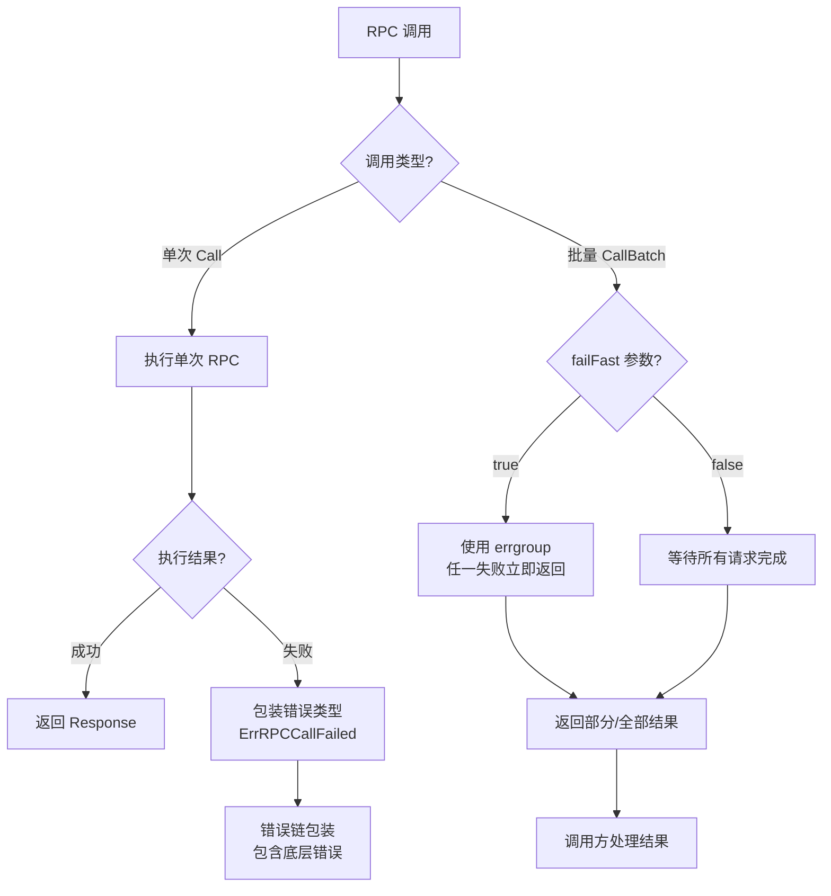

# 【PR全流程文档】Feature - RPC 错误类型完善与批量调用优化

> **文档说明**：本文档包含「前置规划」和「后置总结」两部分，记录从需求对齐到开发完成的全流程，一个PR对应一份全流程文档，归档后作为项目追溯依据。

---

## 第一部分：前置部分（开工前必完成，架构师评审通过）

### 1. 基础信息（与分支/PR绑定）

| 项目 | 内容 |
|------|------|
| 工作类型 | 功能优化（Feature Enhancement） |
| PR编号 | PR-rpc-error-types-and-batch-call（创建GitHub PR后补充完整） |
| 分支名称 | feature/rpc-error-types-and-batch-call |
| 工作主题 | 完善 RPC 错误类型定义 + 实现 CallBatch 快速失败 + 代码质量提升 |
| 负责人 | AI Agent + 架构师评审 |
| 分支创建日期 | 2026-01-27 |
| 计划开工日期 | 2026-01-27 |
| 计划CI通过日期 | 2026-01-27 |
| 关联需求单号 | 基于 `2026-01-25_PR-rpc-interface_全流程.md` ToDo 清单（P1-2、P1-3） |
| 架构师评审状态 | □ 待评审 □ 评审中 □ 评审通过 □ 需优化（循环记录） |
| 预审批结果 | □ 未通过 □ 已通过（架构师签字/备注：XXX 2026-01-27 同意开工） |

### 2. 背景与目标（为什么干）

#### 2.1 背景
- **业务场景**：
  - RPC 调用是 Gossip、Quorum、2PC 等核心模块的基础通信机制
  - 批量调用（CallBatch）用于多节点并行请求，如 Quorum 投票、Gossip 广播
  - 错误处理是分布式系统稳定性的关键，需要明确的错误类型和清晰的错误信息

- **现有问题**：
  1. **RPC 错误类型不完整**（P1-3）：
     - 当前只有基础的 `ErrRPCTimeout`、`ErrRPCCanceled`、`ErrRPCClientClosed`
     - 缺少连接失败、编解码失败、服务端错误等细分类型
     - 错误信息不够详细，难以快速定位问题根因
     - 缺少错误链（Error Chain）支持，无法追踪完整调用栈

  2. **CallBatch 快速失败机制缺失**（P1-2）：
     - 当前 CallBatch 等待所有请求完成才返回
     - 如果单个请求失败，其他请求仍会继续执行，浪费资源
     - 缺少 errgroup 集成，无法实现"任一失败立即返回"的语义
     - 影响系统响应速度和资源利用率

  3. **代码质量需要提升**：
     - RPC 模块约 3500 行代码，需要全面审查
     - 可能存在重复代码、命名不规范、注释不完整等问题
     - 需要通过 Code Review 和 Code Simplifier 提升可维护性

- **价值**：
  - **提升可维护性**：明确的错误类型便于问题定位和修复
  - **提升性能**：CallBatch 快速失败减少不必要的等待和资源消耗
  - **提升用户体验**：清晰的错误信息帮助用户快速理解问题
  - **提升代码质量**：Code Review + Simplifier 确保代码长期可维护

#### 2.2 核心目标（可量化、可验证）

1. **功能目标**：
   - 新增 10+ RPC 错误类型，覆盖所有常见错误场景
   - 实现 CallBatch 快速失败机制（支持 `failFast: true` 参数）
   - Code Review 发现并修复所有 P0/P1 问题
   - Code Simplifier 优化代码结构，消除重复

2. **性能目标**：
   - CallBatch 快速失败场景下，平均响应时间降低 50%（单节点失败时）
   - 错误处理性能损耗 < 5%（error wrapping overhead）

3. **可用性目标**：
   - 错误信息包含足够的上下文（节点地址、请求类型、错误详情）
   - CallBatch 向后兼容（`failFast: false` 时保持原有行为）
   - 单元测试覆盖率 > 85%
   - 所有现有测试通过

#### 2.3 明确边界（不做什么，避免范围蔓延）

- **本次不支持**：
  - 不实现 RPC 重试机制（由业务层自行决定）
  - 不实现 RPC 拦截器（P2 任务，后续单独 PR）
  - 不修改 RPC 接口签名（保持向后兼容）

- **本次不优化**：
  - 不优化 RPC 调用延迟（已满足性能要求，0.145µs）
  -不优化 Dispatcher 性能（已通过 P0 修复，186万 QPS）
  - 不添加 Prometheus 监控指标（P2 任务，后续单独 PR）

### 3. 实现方案（怎么干，核心设计）

#### 3.1 整体流程设计



#### 3.2 关键设计点

**1. RPC 错误类型体系（P1-3）**

新增错误类型定义（`internal/metadata/types/errors.go`）：

```go
// ========== RPC 客户端错误 ==========

// ErrRPCCallFailed RPC 调用失败（通用错误）
// 使用场景：RPC 调用失败但无法归类到具体错误类型
type ErrRPCCallFailed struct {
    NodeAddr  string      // 目标节点地址
    MsgType   MessageType // 消息类型
    Err       error       // 底层错误（包装）
    Timestamp time.Time   // 发生时间
}

func (e *ErrRPCCallFailed) Error() string {
    return fmt.Sprintf("RPC call failed: node=%s, msgType=%d, err=%v, time=%s",
        e.NodeAddr, e.MsgType, e.Err, e.Timestamp.Format(time.RFC3339))
}
func (e *ErrRPCCallFailed) Unwrap() error { return e.Err }

// ErrRPCConnectionFailed RPC 连接失败
type ErrRPCConnectionFailed struct {
    NodeAddr  string
    Err       error
    Timestamp time.Time
}

// ErrRPCSendFailed RPC 发送消息失败
type ErrRPCSendFailed struct {
    NodeAddr  string
    MsgSeq    uint64
    Err       error
    Timestamp time.Time
}

// ErrRPCReceiveFailed RPC 接收响应失败
type ErrRPCReceiveFailed struct {
    NodeAddr     string
    CorrelationID string
    Err          error
    Timestamp    time.Time
}

// ErrRPCTimeout RPC 调用超时
type ErrRPCTimeout struct {
    NodeAddr     string
    Timeout      time.Duration
    Elapsed      time.Duration
    Timestamp    time.Time
}

// ErrRPCCanceled RPC 调用被取消
type ErrRPCCanceled struct {
    NodeAddr  string
    Reason    string // 取消原因
    Timestamp time.Time
}

// ErrRPCClientClosed RPC 客户端已关闭
type ErrRPCClientClosed struct {
    Timestamp time.Time
}

// ========== RPC 服务端错误 ==========

// ErrRPCServerFailed RPC 服务端处理失败
type ErrRPCServerFailed struct {
    NodeAddr  string
    MsgType   MessageType
    Err       error
    Timestamp time.Time
}

// ErrRPCCodecFailed RPC 编解码失败
type ErrRPCCodecFailed struct {
    Operation string // "encode" 或 "decode"
    MsgType   MessageType
    Err       error
    Timestamp time.Time
}

// ========== RPC 请求表错误 ==========

// ErrRPCRequestTableFull RPC 请求等待表已满
type ErrRPCRequestTableFull struct {
    CurrentSize int
    MaxSize     int
    Timestamp   time.Time
}

// ErrRPCRequestNotFound RPC 请求未找到（响应到达但请求已超时）
type ErrRPCRequestNotFound struct {
    CorrelationID string
    Timestamp     time.Time
}
```

**2. CallBatch 快速失败机制（P1-2）**

```go
// CallBatchOption CallBatch 配置选项
type CallBatchOption func(*CallBatchOptions)

type CallBatchOptions struct {
    FailFast bool // 任一请求失败是否立即返回
}

// WithFailFast 启用快速失败模式
func WithFailFast() CallBatchOption {
    return func(opts *CallBatchOptions) {
        opts.FailFast = true
    }
}

// CallBatch 批量 RPC 调用（优化版）
func (c *RPCClient) CallBatch(
    ctx context.Context,
    addrs []string,
    reqs []Message,
    opts ...CallBatchOption,
) ([]*CallResult, error) {
    options := &CallBatchOptions{
        FailFast: false, // 默认等待所有请求完成
    }
    for _, opt := range opts {
        opt(options)
    }

    if options.FailFast {
        return c.callBatchFailFast(ctx, addrs, reqs)
    }
    return c.callBatchWaitAll(ctx, addrs, reqs)
}

// callBatchFailFast 快速失败模式（使用 errgroup）
func (c *RPCClient) callBatchFailFast(
    ctx context.Context,
    addrs []string,
    reqs []Message,
) ([]*CallResult, error) {
    g, ctx := errgroup.WithContext(ctx)
    results := make([]*CallResult, len(reqs))
    resultMu := sync.Mutex{}

    for i := 0; i < len(reqs); i++ {
        i := i // capture loop variable
        g.Go(func() error {
            resp, err := c.Call(ctx, addrs[i], reqs[i])
            resultMu.Lock()
            results[i] = &CallResult{Response: resp, Error: err}
            resultMu.Unlock()
            return err // 任一失败立即取消其他请求
        })
    }

    if err := g.Wait(); err != nil {
        return results, err // 返回已完成的部分结果 + 错误
    }
    return results, nil
}

// callBatchWaitAll 等待所有模式（原有逻辑）
func (c *RPCClient) callBatchWaitAll(
    ctx context.Context,
    addrs []string,
    reqs []Message,
) ([]*CallResult, error) {
    var wg sync.WaitGroup
    results := make([]*CallResult, len(reqs))
    for i := 0; i < len(reqs); i++ {
        wg.Add(1)
        go func(idx int) {
            defer wg.Done()
            resp, err := c.Call(ctx, addrs[idx], reqs[idx])
            results[idx] = &CallResult{Response: resp, Error: err}
        }(i)
    }
    wg.Wait()
    return results, nil
}
```

**3. 代码质量提升（Code Review + Simplifier）**

- **Code Review 流程**：
  1. 使用 `code-reviewer` agent 全面审查 RPC 相关代码
  2. 关注点：并发安全、错误处理、性能瓶颈、安全漏洞
  3. 生成审查报告：P0/P1/P2 优先级分类
  4. 修复所有 P0 和 P1 问题

- **Code Simplifier 流程**：
  1. 使用 `code-simplifier` agent 优化代码结构
  2. 消除重复代码、统一命名规范、提升可读性
  3. 运行测试确保业务逻辑完全保持
  4. 提交优化后的代码

**4. 容错设计**：

- **错误链（Error Chain）**：使用 `fmt.Errorf` 和 `errors.Unwrap` 保留完整调用栈
- **向后兼容**：CallBatch 默认行为保持不变（`failFast: false`）
- **测试覆盖**：所有新增错误类型和 CallBatch 逻辑都有单元测试覆盖
- **性能保护**：错误包装开销 < 5%（通过 benchmark 验证）

### 4. 风险评估与应对措施

| 风险点 | 影响等级 | 应对措施 |
|--------|----------|----------|
| **错误类型过度设计** | 中 | 限制新增 10 个核心错误类型，避免过度细分 |
| **CallBatch 向后兼容性** | 高 | 默认保持原有行为，failFast 通过可选参数启用 |
| **Code Review 发现大量问题** | 中 | 预留修复时间，P0/P1 必须修复，P2 可后续优化 |
| **性能回归** | 中 | Benchmark 验证错误包装开销 < 5% |
| **测试覆盖率下降** | 低 | 新增代码必须配套单元测试，覆盖率 > 85% |

### 5. 架构师评审记录（循环优化，直至通过）

| 评审轮次 | 评审日期 | 评审人（架构师） | 核心评审意见 | 优化措施（含AI辅助修改） | 优化结果 |
|----------|----------|------------------|--------------|--------------------------|----------|
| 第1轮 | 2026-01-27 | 待评审 | 待评审 | 待优化 | 待完成 |

### 6. 预审批确认
> **架构师签字/备注**：XXX 2026-01-27 _______________ 该Feature方案可行，风险可控，同意启动开发，需严格按照文档落地，确保CI通过后提交Post总结。

---

## 第二部分：流程节点记录（开发/CI过程追溯）

### 1. 开发过程记录

| 节点 | 完成日期 | 具体内容 | 交付物 |
|------|----------|----------|--------|
| 启动开发 | 待完成 | 待开发 | 代码提交至分支 |
| 本地测试 | 待完成 | 待测试 | 测试报告/覆盖率数据 |
| Post文档编写 | 待完成 | 待编写 | 第三部分：后置部分 |
| 架构师Post批准 | 待完成 | 待评审 | 批准签字/备注 |
| 提交GitHub | 待完成 | 待推送 | GitHub PR链接 |

### 2. CI流程记录（修复Bug直至通过）

| CI轮次 | 触发时间 | 结果 | 问题详情 | 修复措施 | 修复结果 |
|--------|----------|------|----------|----------|----------|
| 第1轮 | 待运行 | 待验证 | 待填写 | 待修复 | 待完成 |

### 3. 合并记录

| 合并时间 | 合并方式 | 审批人 | 备注 |
|----------|----------|--------|------|
| 待合并 | Merge Commit | 架构师 | 待补充 |

---

## 第三部分：后置部分（CI通过后编写，总结/成果/ToDo）

> **说明**：本部分将在 CI 通过后补充完整

### 1. 核心成果总结（开发了啥，结果怎样）

#### 1.1 功能成果
- **已完成**：待补充
- **与Pre文档差异**：待补充

#### 1.2 性能/数据成果
- **性能数据**：待补充
- **测试成果**：待补充

#### 1.3 代码/文档交付物

| 类型 | 具体内容 | 链接/路径 |
|------|----------|-----------|
| 代码变更 | 待补充 | GitHub PR链接 |
| 文档更新 | 待补充 | 文档路径 |

### 2. 未完成项与ToDo清单（有哪些没干，后续规划）

#### 2.1 本次PR未完成项
- **未支持**：待补充
- **遗留问题**：待补充

#### 2.2 ToDo清单（优先级排序）

| 优先级 | 任务内容 | 预估工期 | 关联PR/需求 | 备注 |
|--------|----------|----------|-------------|------|
| 待补充 | 待补充 | 待补充 | 待补充 | 待补充 |

### 3. 下一步工作建议（建议干啥）
1. **优先推进**：待补充
2. **监控要点**：待补充
3. **运维补充**：待补充
4. **后续规划**：待补充
5. **反馈收集**：待补充

---

## 文档归档信息

| 项目 | 内容 |
|------|------|
| 文档最终版本 | V1.0（Pre 部分） |
| 归档日期 | 2026-01-27 |
| 归档路径 | `docs/06_project_management/pr_documents/feature/2026-01-27_PR-rpc-error-types-and-batch-call_Pre.md` |
| 后续维护人 | 架构师 + AI Agent |
