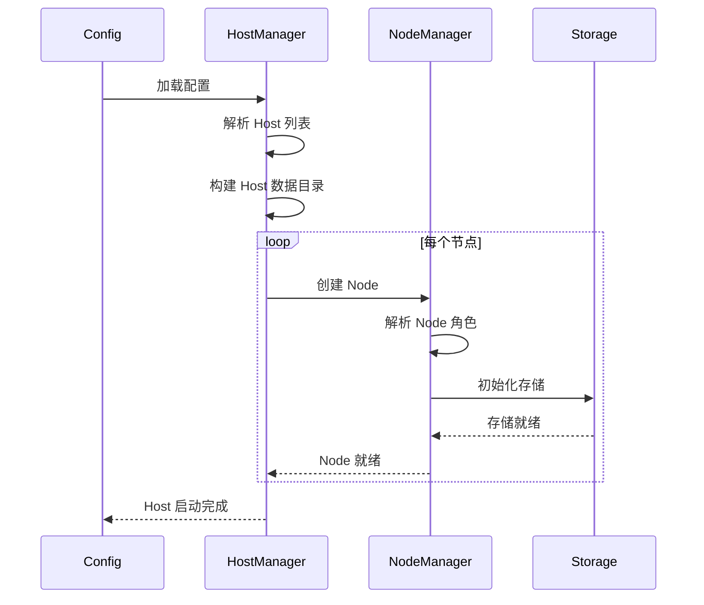

# 【PR全流程文档】Feature - Cluster 三级配置重构（Cluster → Host → Node）

> **文档说明**：本文档包含「前置规划」和「后置总结」两部分，记录从需求对齐到开发完成的全流程，一个PR对应一份全流程文档，归档后作为项目追溯依据。

---

## 第一部分：前置部分（开工前必完成，架构师评审通过）

### 1. 基础信息（与分支/PR绑定）

| 项目 | 内容 |
|------|------|
| 工作类型 | 新功能开发（Feature） |
| PR编号 | PR-037（创建GitHub PR后补充完整） |
| 分支名称 | feature/cluster-host-node-config |
| 工作主题 | 重构配置为三级结构：Cluster → Host → Node，支持多 Host 部署和独立目录管理 |
| 负责人 | jzhang405 |
| 分支创建日期 | 2026-01-30 |
| 计划开工日期 | 2026-01-30 |
| 计划CI通过日期 | 2026-02-05 |
| 关联需求单号 | 无 |
| 架构师评审状态 | □ 待评审 □ 评审中 □ 评审通过 □ 需优化（循环记录） |
| 预审批结果 | □ 未通过 □ 已通过（架构师签字/备注：XXX 202X-XX-XX 同意开工） |

### 2. 背景与目标（为什么干）

#### 2.1 背景
- **业务场景**：NexKV 需要支持在同一物理机上运行多个逻辑 Host（开发环境），同时支持生产环境的单 Host 部署
- **现有问题**：
  - 当前配置是扁平结构，缺少 Host 层级，无法区分不同 Host 的数据目录
  - 多个 Host 共享相同数据目录时会产生数据冲突
  - 缺少 Node 角色配置，无法明确标识 leaf/parent/parent-standby 节点类型
  - 目录结构缺少组织，所有 Host 数据混在一起
- **价值**：
  - 支持开发和生产环境的灵活部署模式
  - 隔离不同 Host 的数据，避免冲突
  - 明确节点角色配置，简化集群管理
  - 统一的目录结构，便于运维和监控

#### 2.2 核心目标（可量化、可验证）
1. **功能目标**：
   - 实现 Cluster → Host → Node 三级配置结构
   - 支持通过环境变量或配置文件指定 base_dir
   - 为每个 Host 创建独立的数据目录：`{base-dir}/{host-id}`
   - 支持三种 Node 角色：leaf-only、leaf+parent、leaf+parent-standby
   - 每个 Host 配置一个 seed-node 地址
2. **性能目标**：
   - 配置加载时间 < 100ms
   - 目录创建和校验时间 < 50ms
3. **可用性目标**：
   - 配置验证失败时提供清晰的错误信息
   - 支持配置热更新（可选）

#### 2.3 明确边界（不做什么，避免范围蔓延）
- **本次不支持**：
  - 跨 Host 的数据迁移
  - Host 动态创建和删除
  - 父子节点自动发现和分配（仍需手动配置）
- **本次不优化**：
  - 现有的 TreeCoordinator 逻辑
  - RPC 通信层

### 3. 实现方案（怎么干，核心设计）

#### 3.1 整体流程设计

```mermaid
flowchart TD
    A[启动 nexkvd] --> B{检查配置来源}
    B -->|环境变量| C[读取 NEXKV_BASE_DIR]
    B -->|配置文件| D[读取 cluster.base_dir]
    B -->|默认| E[使用当前目录 ./data]

    C --> F[解析 Host 配置]
    D --> F
    E --> F

    F --> G[获取 Host ID]
    G --> H[构建数据目录: {base-dir}/{host-id}]
    H --> I[解析 Node 角色配置]

    I --> J{Node 角色类型}
    J -->|leaf-only| K[创建叶子节点]
    J -->|leaf+parent| L[创建叶子+父节点]
    J -->|leaf+parent-standby| M[创建叶子+父备节点]

    K --> N[初始化集群组件]
    L --> N
    M --> N

    N --> O[启动服务]
```

#### 3.2 关键设计点

##### 1. 三级配置结构

```yaml
# Cluster 级别配置
cluster:
  name: "nexkv-cluster"
  base_dir: "/var/lib/nexkv"  # 可被 NEXKV_BASE_DIR 环境变量覆盖

  # Host 级别配置（支持多个 Host）
  hosts:
    - host_id: "host-1"
      # Host 级别的 seed-node（用于 Host 内节点发现）
      seed_node: "/ip4/127.0.0.1/tcp/9211"

      # Node 级别配置
      nodes:
        - node_id: "node-1"
          node_addr: "/ip4/127.0.0.1/tcp/9211"
          role: "leaf"  # leaf | parent | parent-standy

        # 可选：同一 Host 的多个节点
        - node_id: "node-2"
          node_addr: "/ip4/127.0.0.1/tcp/9212"
          role: "parent"

    - host_id: "host-2"  # 开发环境：第二个 Host
      seed_node: "/ip4/127.0.0.1/tcp/9213"
      nodes:
        - node_id: "node-3"
          node_addr: "/ip4/127.0.0.1/tcp/9213"
          role: "leaf-only"
```

##### 2. 目录结构设计

```
{base_dir}/
├── host-1/                    # Host ID
│   ├── metadata/              # 元数据目录
│   │   ├── data.mv
│   │   └── wal/
│   ├── shards/                # 分片数据
│   │   ├── shard-001/
│   │   └── shard-002/
│   ├── wal/                   # WAL 日志
│   └── snapshots/             # 快照
├── host-2/
│   ├── metadata/
│   ├── shards/
│   ├── wal/
│   └── snapshots/
└── ...
```

##### 3. 配置优先级

```
1. 环境变量 NEXKV_BASE_DIR（最高优先级）
2. 配置文件 cluster.base_dir
3. 当前目录 ./data（默认值）
```

##### 4. Node 角色类型

| 角色 | 说明 | 适用场景 |
|------|------|---------|
| `leaf` | 叶子节点，无子节点 | 边缘节点、纯存储节点 |
| `parent` | 父节点，有子节点 | 中间层节点、数据聚合节点 |
| `parent-standby` | 备用父节点 | 高可用场景、故障转移 |

##### 5. 核心数据结构

```go
// Config 三级配置结构
type Config struct {
    Cluster ClusterConfig `yaml:"cluster"`
    // ... 其他配置
}

// ClusterConfig 集群配置
type ClusterConfig struct {
    Name    string        `yaml:"name"`
    BaseDir string        `yaml:"base_dir"` // 基础目录
    Hosts   []HostConfig  `yaml:"hosts"`    // Host 列表
}

// HostConfig Host 配置
type HostConfig struct {
    HostID   string        `yaml:"host_id"`
    SeedNode string        `yaml:"seed_node"` // Host 级别的 seed-node
    Nodes    []NodeConfig  `yaml:"nodes"`     // Node 列表
}

// NodeConfig Node 配置
type NodeConfig struct {
    NodeID   string `yaml:"node_id"`
    NodeAddr string `yaml:"node_addr"`
    Role     string `yaml:"role"` // leaf | parent | parent-standy
}

// NodeRole 节点角色枚举
type NodeRole string

const (
    NodeRoleLeaf          NodeRole = "leaf"
    NodeRoleParent        NodeRole = "parent"
    NodeRoleParentStandby NodeRole = "parent-standby"
)
```

##### 6. 目录路径构建

```go
// BuildDataDir 构建数据目录路径
// 格式: {base_dir}/{host_id}
func BuildDataDir(baseDir, hostID string) string {
    return filepath.Join(baseDir, hostID)
}

// 示例：
// BaseDir: "/var/lib/nexkv"
// HostID:  "host-1"
// 结果:    "/var/lib/nexkv/host-1"
```

##### 7. 配置验证规则

- **Cluster 级别**：
  - `name` 不能为空
  - `base_dir` 必须是绝对路径或相对路径
  - `hosts` 不能为空（至少一个 Host）

- **Host 级别**：
  - `host_id` 不能为空且唯一
  - `seed_node` 必须是有效的 multiaddr 格式

- **Node 级别**：
  - `node_id` 在全局唯一
  - `node_addr` 必须是有效的 multiaddr 格式
  - `role` 必须是 `leaf`、`parent` 或 `parent-standy` 之一

##### 8. 向后兼容

为了保持向后兼容，支持简化的配置格式：

```yaml
# 简化格式（自动转换为三级结构）
cluster:
  name: "nexkv-cluster"
  node_id: "node-1"
  node_addr: "/ip4/127.0.0.1/tcp/9211"
  seed_nodes:
    - "/ip4/127.0.0.1/tcp/7946"

# 内部转换：
# cluster.hosts[0].host_id = "default"
# cluster.hosts[0].seed_node = cluster.seed_nodes[0]
# cluster.hosts[0].nodes[0].node_id = cluster.node_id
# cluster.hosts[0].nodes[0].node_addr = cluster.node_addr
# cluster.hosts[0].nodes[0].role = "leaf" (默认)
```

#### 3.3 数据流程



### 4. 风险评估与应对措施

| 风险点 | 影响等级（高/中/低） | 应对措施 |
|--------|----------------------|----------|
| 配置结构变更导致现有配置不兼容 | 高 | 提供配置转换工具，支持简化格式自动转换 |
| 目录结构变更导致数据丢失 | 高 | 启动前检查目录是否存在，提供数据迁移脚本 |
| 多 Host 共享端口冲突 | 中 | 配置验证时检查端口占用，提供端口分配建议 |
| 环境变量优先级混乱 | 低 | 明确文档说明，提供配置优先级调试命令 |
| Node 角色配置错误 | 中 | 提供角色验证和示例配置 |

### 5. 架构师评审记录（循环优化，直至通过）

| 评审轮次 | 评审日期 | 评审人（架构师） | 核心评审意见 | 优化措施（含AI辅助修改） | 优化结果 |
|----------|----------|------------------|--------------|--------------------------|----------|
| 第1轮 | 2026-01-30 | 待评审 | 待评审 | 待优化 | 待完成 |

### 6. 预审批确认
> **架构师签字/备注**：XXX 202X-XX-XX 该Feature方案可行，风险可控，同意启动开发，需严格按照文档落地，确保CI通过后提交Post总结。

---

## 第二部分：流程节点记录（开发/CI过程追溯）

### 1. 开发过程记录

| 节点 | 完成日期 | 具体内容 | 交付物 |
|------|----------|----------|--------|
| 启动开发 | 待完成 | 待开发 | 待提交 |
| 本地测试 | 待完成 | 待测试 | 待报告 |
| Post文档编写 | 待完成 | 待编写 | 待完成 |
| 架构师Post批准 | 待完成 | 待评审 | 待批准 |
| 提交GitHub | 待完成 | 待推送 | 待创建PR |

### 2. CI流程记录（修复Bug直至通过）

| CI轮次 | 触发时间 | 结果 | 问题详情 | 修复措施 | 修复结果 |
|--------|----------|------|----------|----------|----------|
| 第1轮 | 待触发 | 待测试 | 待分析 | 待修复 | 待完成 |

### 3. 合并记录

| 合并时间 | 合并方式 | 审批人 | 备注 |
|----------|----------|--------|------|
| 待合并 | 待定 | 待审批 | 待补充 |

---

## 第三部分：后置部分（CI通过后编写，总结/成果/ToDo）

### 1. 核心成果总结（开发了啥，结果怎样）

#### 1.1 功能成果
- **已完成**：待开发
- **与Pre文档差异**：待记录

#### 1.2 性能/数据成果
- **性能数据**：待测试
- **测试成果**：待验证

#### 1.3 代码/文档交付物

| 类型 | 具体内容 | 链接/路径 |
|------|----------|-----------|
| 代码变更 | 待列出 | 待补充 |
| 文档更新 | 待列出 | 待补充 |

### 2. 未完成项与ToDo清单（有哪些没干，后续规划）

#### 2.1 本次PR未完成项
- **未支持**：待记录
- **遗留问题**：待分析

#### 2.2 ToDo清单（优先级排序）

| 优先级 | 任务内容 | 预估工期 | 关联PR/需求 | 备注 |
|--------|----------|----------|-------------|------|
| 待定 | 待定 | 待定 | PR-XXX | 待补充 |

### 3. 下一步工作建议（建议干啥）
1. **优先推进**：待规划
2. **监控要点**：待定义
3. **运维补充**：待完善
4. **后续规划**：待设计
5. **反馈收集**：待收集

---

## 文档归档信息

| 项目 | 内容 |
|------|------|
| 文档最终版本 | V1.0（草稿） |
| 归档日期 | 2026-01-30 |
| 归档路径 | `docs/06_project_management/pr_documents/feature/2026-01-30_PR-037_Cluster_三级配置重构_全流程.md` |
| 后续维护人 | jzhang405 |
