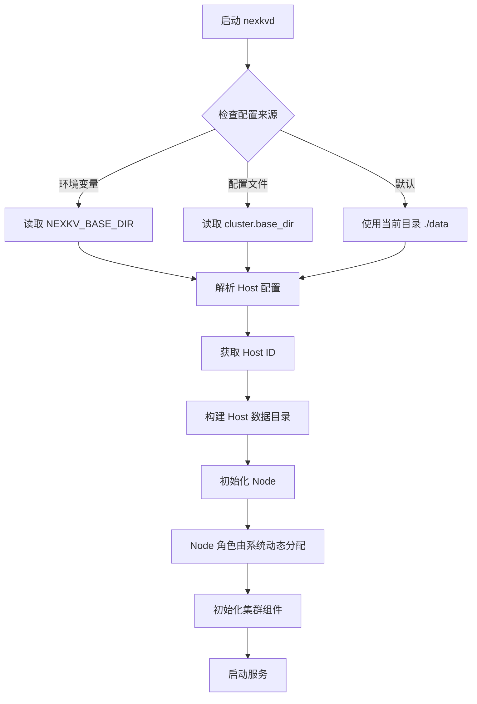
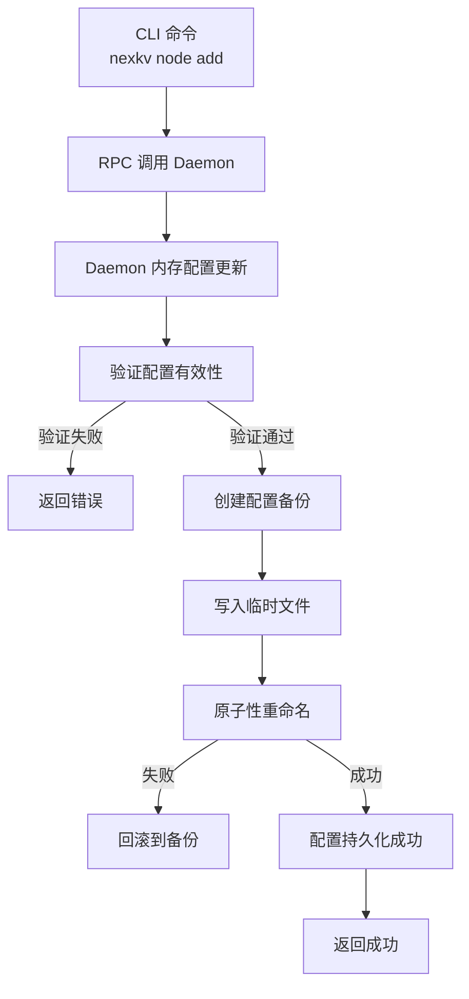
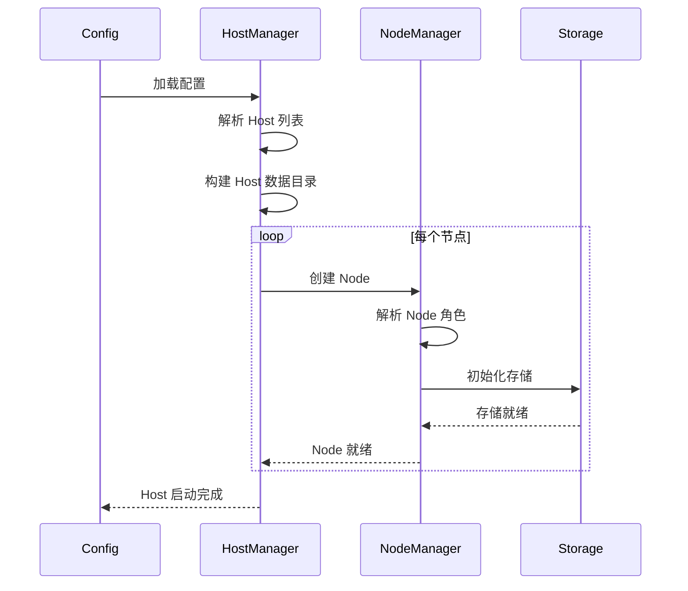

# 【PR全流程文档】Feature - Cluster 三级配置重构（Cluster → Host → Node）

> **文档说明**：本文档包含「前置规划」和「后置总结」两部分，记录从需求对齐到开发完成的全流程，一个PR对应一份全流程文档，归档后作为项目追溯依据。

---

## 第一部分：前置部分（开工前必完成，架构师评审通过）

### 1. 基础信息（与分支/PR绑定）

| 项目 | 内容 |
|------|------|
| 工作类型 | 新功能开发（Feature） |
| PR编号 | PR-037（创建GitHub PR后补充完整） |
| 分支名称 | feature/cluster-host-node-config |
| 工作主题 | 重构配置为三级结构：Cluster → Host → Node，支持多 Host 部署和独立目录管理 |
| 负责人 | jzhang405 |
| 分支创建日期 | 2026-01-30 |
| 计划开工日期 | 2026-01-30 |
| 计划CI通过日期 | 2026-02-05 |
| 关联需求单号 | 无 |
| 架构师评审状态 | □ 待评审 □ 评审中 □ 评审通过 □ 需优化（循环记录） |
| 预审批结果 | □ 未通过 □ 已通过（架构师签字/备注：XXX 202X-XX-XX 同意开工） |

### 2. 背景与目标（为什么干）

#### 2.1 背景
- **业务场景**：NexKV 需要支持在同一物理机上运行多个逻辑 Host（开发环境），同时支持生产环境的单 Host 部署
- **现有问题**：
  - 当前配置是扁平结构，缺少 Host 层级，无法区分不同 Host 的数据目录
  - 多个 Host 共享相同数据目录时会产生数据冲突
  - 缺少 Node 角色配置，无法明确标识 leaf/parent/parent-standby 节点类型
  - 目录结构缺少组织，所有 Host 数据混在一起
- **价值**：
  - 支持开发和生产环境的灵活部署模式
  - 隔离不同 Host 的数据，避免冲突
  - 明确节点角色配置，简化集群管理
  - 统一的目录结构，便于运维和监控

#### 2. 核心目标（可量化、可验证）
1. **功能目标**：
   - 实现 Cluster → Host → Node 三级配置结构
   - 配置文件固定位置：`{base-dir}/config.yaml`
   - 支持通过环境变量或配置文件指定 base_dir
   - 为每个 Host 创建独立的数据目录：`{base-dir}/{host-id}`
   - Node 角色由系统动态分配（不配置在配置文件中）
   - 每个 Host 配置一个 seed-node 地址
   - **配置持久化**：Node 更新自动写入 config.yaml
   - **测试隔离**：测试使用 `{BASEDIR}/test/{test-id}` 作为 base_dir
2. **性能目标**：
   - 配置加载时间 < 100ms
   - 目录创建和校验时间 < 50ms
   - 配置持久化时间 < 50ms
3. **可用性目标**：
   - 配置验证失败时提供清晰的错误信息
   - 配置保存失败时回滚到原配置

#### 2.3 明确边界（不做什么，避免范围蔓延）
- **本次不支持**：
  - 跨 Host 的数据迁移
  - Host 动态创建和删除
  - 父子节点自动发现和分配（仍需手动配置）
- **本次不优化**：
  - 现有的 TreeCoordinator 逻辑
  - RPC 通信层

### 3. 实现方案（怎么干，核心设计）

#### 3.1 整体流程设计



#### 3.2 关键设计点

##### 1. 三级配置结构

```yaml
# Cluster 级别配置
cluster:
  name: "nexkv-cluster"
  base_dir: "/var/lib/nexkv"  # 可被 NEXKV_BASE_DIR 环境变量覆盖

  # Host 级别配置（支持多个 Host）
  hosts:
    - host_id: "host-1"
      # Host 级别的 seed-node（用于 Host 内节点发现）
      seed_node: "/ip4/127.0.0.1/tcp/9211"

      # Node 级别配置（role 由系统动态分配）
      nodes:
        - node_id: "node-1"
          # TCP 地址用于数据传输，UDP 地址用于 Gossip 协议
          node_addr_tcp: "/ip4/127.0.0.1/tcp/9211"
          node_addr_udp: "/ip4/127.0.0.1/udp/9212"  # UDP port = TCP port + 1

        # 可选：同一 Host 的多个节点
        - node_id: "node-2"
          node_addr_tcp: "/ip4/127.0.0.1/tcp/9213"
          node_addr_udp: "/ip4/127.0.0.1/udp/9214"

    - host_id: "host-2"  # 开发环境：第二个 Host
      seed_node: "/ip4/127.0.0.1/tcp/9215"
      nodes:
        - node_id: "node-3"
          node_addr_tcp: "/ip4/127.0.0.1/tcp/9215"
          node_addr_udp: "/ip4/127.0.0.1/udp/9216"
```

##### 2. 目录结构设计

```
{base_dir}/
├── host-1/                    # Host ID
│   ├── metadata/              # 元数据目录
│   │   ├── data.mv
│   │   └── wal/
│   ├── shards/                # 分片数据
│   │   ├── shard-001/
│   │   └── shard-002/
│   ├── wal/                   # WAL 日志
│   └── snapshots/             # 快照
├── host-2/
│   ├── metadata/
│   ├── shards/
│   ├── wal/
│   └── snapshots/
└── ...
```

##### 3. 配置优先级

```
1. 环境变量 NEXKV_BASE_DIR（最高优先级）
2. 配置文件 cluster.base_dir
3. 当前目录 ./data（默认值）
```

##### 4. Node 角色动态分配

Node 角色由系统运行时动态分配，不在配置文件中指定。分配逻辑由 TreeCoordinator 根据集群拓扑和节点状态自动计算。

##### 5. 核心数据结构

```go
// Config 三级配置结构
type Config struct {
    Cluster ClusterConfig `yaml:"cluster"`
    // ... 其他配置
}

// ClusterConfig 集群配置
type ClusterConfig struct {
    Name    string        `yaml:"name"`
    BaseDir string        `yaml:"base_dir"` // 基础目录
    Hosts   []HostConfig  `yaml:"hosts"`    // Host 列表
}

// HostConfig Host 配置
type HostConfig struct {
    HostID   string        `yaml:"host_id"`
    SeedNode string        `yaml:"seed_node"` // Host 级别的 seed-node（TCP 地址）
    Nodes    []NodeConfig  `yaml:"nodes"`     // Node 列表
}

// NodeConfig Node 配置
type NodeConfig struct {
    NodeID      string `yaml:"node_id"`
    NodeAddrTCP string `yaml:"node_addr_tcp"` // TCP 地址用于数据传输
    NodeAddrUDP string `yaml:"node_addr_udp"` // UDP 地址用于 Gossip 协议
    // 注意：
    //   - role 由系统动态分配，不在配置中指定
    //   - UDP port 通常 = TCP port + 1
}
```

##### 6. 目录路径构建

```go
// BuildDataDir 构建数据目录路径
// 格式: {base_dir}/{host_id}
func BuildDataDir(baseDir, hostID string) string {
    return filepath.Join(baseDir, hostID)
}

// 示例：
// BaseDir: "/var/lib/nexkv"
// HostID:  "host-1"
// 结果:    "/var/lib/nexkv/host-1"
```

##### 7. 配置验证规则

- **Cluster 级别**：
  - `name` 不能为空
  - `base_dir` 必须是绝对路径或相对路径
  - `hosts` 不能为空（至少一个 Host）

- **Host 级别**：
  - `host_id` 不能为空且唯一
  - `seed_node` 必须是有效的 TCP multiaddr 格式（包含 `/tcp/` 组件）

- **Node 级别**：
  - `node_id` 在全局唯一
  - `node_addr_tcp` 必须是有效的 TCP multiaddr 格式（包含 `/tcp/` 组件）
  - `node_addr_udp` 必须是有效的 UDP multiaddr 格式（包含 `/udp/` 组件）
  - **端口关系验证**：UDP 端口应该 = TCP 端口 + 1（警告但不阻塞启动）

##### 8. 向后兼容

为了保持向后兼容，支持简化的配置格式（自动推导 UDP 地址）：

```yaml
# 简化格式（自动转换为三级结构）
cluster:
  name: "nexkv-cluster"
  node_id: "node-1"
  node_addr: "/ip4/127.0.0.1/tcp/9211"  # 仅指定 TCP 地址
  seed_nodes:
    - "/ip4/127.0.0.1/tcp/7946"

# 内部转换：
# cluster.hosts[0].host_id = "default"
# cluster.hosts[0].seed_node = cluster.seed_nodes[0]
# cluster.hosts[0].nodes[0].node_id = cluster.node_id
# cluster.hosts[0].nodes[0].node_addr_tcp = cluster.node_addr
# cluster.hosts[0].nodes[0].node_addr_udp = 自动推导（TCP port + 1）
# 注意：role 由系统动态分配
```

##### 9. 配置文件路径设计

**配置文件固定位置**：`{base-dir}/config.yaml`

**配置路径推导流程**：
```go
// DetermineConfigPath 确定配置文件路径
func DetermineConfigPath(configFlag string) (string, error) {
    // 1. 优先使用命令行参数 --config
    if configFlag != "" && configFlag != "./config.yaml" {
        return configFlag, nil
    }

    // 2. 使用 base_dir 推导配置路径
    baseDir, err := GetBaseDir() // 从环境变量或默认值获取
    if err != nil {
        return "", err
    }
    return filepath.Join(baseDir, "config.yaml"), nil
}

// GetBaseDir 获取基础目录
// 优先级：NEXKV_BASE_DIR > cluster.base_dir > 默认路径探索
//
// 默认路径探索顺序（优先级从高到低）：
//   1. /var/tmp/nexkv    - 系统临时目录（在 /var/tmp 中创建 nexkv）
//   2. ~/var/tmp/nexkv  - 用户主目录（在 ~/var/tmp 中创建 nexkv）
//
// 如果所有路径都无法创建，返回错误
func GetBaseDir() (string, error) {
    // 1. 环境变量 NEXKV_BASE_DIR（最高优先级）
    if dir := os.Getenv("NEXKV_BASE_DIR"); dir != "" {
        return dir, nil
    }

    // 2. 尝试从配置文件读取 base_dir
    // 注意：此时配置文件可能不存在，使用默认值
    if cfg, err := config.LoadConfig("./config.yaml"); err == nil {
        if cfg.Cluster.BaseDir != "" {
            return cfg.Cluster.BaseDir, nil
        }
    }

    // 3. 默认路径探索（按优先级）
    candidates := []struct {
        path string
        desc string
    }{
        {"/var/tmp/nexkv", "系统临时目录"},
        {expandUser("~/var/tmp/nexkv"), "用户主目录"},
    }

    for _, candidate := range candidates {
        // 检查目录是否存在
        if _, err := os.Stat(candidate.path); os.IsNotExist(err) {
            // 目录不存在，尝试创建
            if err := os.MkdirAll(candidate.path, 0755); err == nil {
                return candidate.path, nil // 创建成功
            }
            // 创建失败，继续尝试下一个
        } else {
            return candidate.path, nil // 目录已存在
        }
    }

    // 所有路径都无法创建，返回错误
    return "", fmt.Errorf("无法创建基础目录：请手动创建 /var/tmp/nexkv 或 ~/var/tmp/nexkv")
}

// expandUser 展开 ~ 路径
func expandUser(path string) string {
    if strings.HasPrefix(path, "~/") {
        home, _ := os.UserHomeDir()
        return filepath.Join(home, path[2:])
    }
    return path
}
```

**配置优先级总结**：
```
1. NEXKV_BASE_DIR（环境变量，最高优先级）
2. cluster.base_dir（配置文件）
3. 默认路径探索（按顺序尝试，全部失败则报错）：
   - /var/tmp/nexkv（系统临时目录，在 /var/tmp 中创建）
   - ~/var/tmp/nexkv（用户主目录，在 ~/var/tmp 中创建）
```

**目录结构示例**：
```
{BASEDIR}/                           # 基础目录
├── config.yaml                       # 配置文件（固定位置）
├── host-1/                           # Host 数据目录
│   ├── metadata/
│   ├── shards/
│   ├── wal/
│   └── snapshots/
├── test/                             # 测试目录
│   ├── test-001/
│   │   ├── config.yaml               # 测试配置副本
│   │   └── host-1/
│   └── test-002/
│       ├── config.yaml
│       └── host-1/
```

##### 10. 配置持久化机制

**Node 更新自动同步到 config.yaml**：

```go
// PersistConfig 持久化配置到文件
// 路径: {base-dir}/config.yaml
func PersistConfig(baseDir string, cfg *config.Config) error {
    configPath := filepath.Join(baseDir, "config.yaml")

    // 1. 创建备份（防止保存失败）
    backupPath := configPath + ".bak"
    if err := copyFile(configPath, backupPath); err != nil && !os.IsNotExist(err) {
        return fmt.Errorf("创建备份失败: %w", err)
    }

    // 2. 验证配置（确保写入的是有效配置）
    if err := config.ValidateConfig(cfg); err != nil {
        return fmt.Errorf("配置验证失败: %w", err)
    }

    // 3. 序列化并写入临时文件
    tmpPath := configPath + ".tmp"
    if err := config.SaveConfig(cfg, tmpPath); err != nil {
        return fmt.Errorf("保存配置失败: %w", err)
    }

    // 4. 原子性重命名
    if err := os.Rename(tmpPath, configPath); err != nil {
        os.Remove(tmpPath)
        return fmt.Errorf("更新配置文件失败: %w", err)
    }

    return nil
}

// AddNodeToConfig 添加节点到配置并持久化
func AddNodeToConfig(baseDir, hostID, nodeID, tcpAddr, udpAddr string) error {
    // 1. 加载现有配置
    configPath := filepath.Join(baseDir, "config.yaml")
    cfg, err := config.LoadConfig(configPath)
    if err != nil {
        return fmt.Errorf("加载配置失败: %w", err)
    }

    // 2. 查找目标 Host
    var host *config.HostConfig
    for i := range cfg.Cluster.Hosts {
        if cfg.Cluster.Hosts[i].HostID == hostID {
            host = &cfg.Cluster.Hosts[i]
            break
        }
    }
    if host == nil {
        return fmt.Errorf("Host %s 不存在", hostID)
    }

    // 3. 添加 Node
    newNode := config.NodeConfig{
        NodeID:      nodeID,
        NodeAddrTCP: tcpAddr,
        NodeAddrUDP: udpAddr,
    }
    host.Nodes = append(host.Nodes, newNode)

    // 4. 持久化配置
    if err := PersistConfig(baseDir, cfg); err != nil {
        return err
    }

    return nil
}
```

**配置更新流程**：


##### 11. 测试目录设计

**测试隔离机制**：

```go
// SetupTestEnv 设置测试环境
func SetupTestEnv(testID string) (baseDir string, cleanup func(), err error) {
    // 1. 构建测试目录路径
    baseDir := filepath.Join(os.Getenv("BASEDIR"), "test", testID)

    // 2. 创建测试目录
    if err := os.MkdirAll(baseDir, 0755); err != nil {
        return "", nil, fmt.Errorf("创建测试目录失败: %w", err)
    }

    // 3. 复制配置模板到测试目录
    configSrc := "./config.yaml"
    configDst := filepath.Join(baseDir, "config.yaml")
    if err := copyFile(configSrc, configDst); err != nil {
        os.RemoveAll(baseDir)
        return "", nil, fmt.Errorf("复制配置失败: %w", err)
    }

    // 4. 清理函数（测试完成后删除整个测试目录）
    cleanup = func() {
        os.RemoveAll(baseDir)
    }

    return baseDir, cleanup, nil
}
```

**测试目录示例**：
```bash
# 测试前
BASEDIR="/var/lib/nexkv"
TEST_ID="test-add-node-001"

# 设置测试环境
export NEXKV_BASE_DIR="${BASEDIR}/test/${TEST_ID}"

# 运行测试
go test -v ./tests/...

# 测试后自动清理
# 删除 ${BASEDIR}/test/${TEST_ID}
```

##### 12. 命令行参数扩展

**nexkvd 守护进程命令**：

```bash
nexkvd [options]

Options:
  -c, --config string       配置文件路径（默认自动推导）
  -b, --base-dir string     基础目录（覆盖 NEXKV_BASE_DIR）
  -h, --host-id string      Host ID（指定当前节点所属的 Host）
  -n, --cluster string      集群名称
  -i, --node-id string      节点 ID
  -a, --addr string          节点监听地址（TCP）
  -e, --env string          运行环境：dev/cluster
  -l, --log-level string    日志级别

Environment Variables:
  NEXKV_BASE_DIR            基础目录路径
  NEXKV_CONFIG              配置文件路径
  NEXKV_HOST_ID             当前 Host ID
  NEXKV_CLUSTER             集群名称
  NEXKV_NODE_ID             节点 ID
  NEXKV_NODE_ADDR           节点地址
```

**nexkv CLI 客户端命令**：

```bash
nexkv [global options] <command> [command options]

Global Options:
  -a, --addr string          Daemon 监听地址（默认 127.0.0.1:9211）
  -t, --timeout duration     RPC 超时（默认 30s）
  -V, --verbose              详细输出

Commands:
  node                       节点管理
    node add <options>       添加节点（自动持久化到 config.yaml）
      --id string            节点 ID
      --addr string          节点地址（host:port 格式）
      --host-id string       目标 Host ID
    node remove <node-id>    删除节点（自动持久化到 config.yaml）
      --force                强制删除，不提示
    node list                列出所有节点
      --format               输出格式：table/json
    node ping <node-id>      Ping 节点检查连通性
      --count int            Ping 次数

  cluster                    集群管理
    cluster status           查看集群状态
      --watch                持续监控模式
    cluster topology         查看集群拓扑
      --format               输出格式：tree/json/dot
    cluster info             查看集群信息
    cluster health           集群健康检查

  config                     配置管理（新增）
    config show              显示当前配置
    config validate          验证配置文件
    config reload            重新加载配置（热更新）
```

**Node 添加流程示例**：
```bash
# 1. 添加节点到指定 Host
nexkv node add \
  --id "node-2" \
  --addr "127.0.0.1:9213" \
  --host-id "host-1"

# 2. 内部流程
# - CLI 通过 RPC 调用 Daemon
# - Daemon 更新内存配置
# - Daemon 调用 PersistConfig()
# - 配置写入 {base-dir}/config.yaml
# - 返回成功给 CLI

# 3. 配置文件更新
# cluster.hosts[0].nodes 新增：
#   - node_id: "node-2"
#     node_addr_tcp: "/ip4/127.0.0.1/tcp/9213"
#     node_addr_udp: "/ip4/127.0.0.1/udp/9214"
```

#### 3.3 数据流程



### 4. 风险评估与应对措施

| 风险点 | 影响等级（高/中/低） | 应对措施 |
|--------|----------------------|----------|
| 配置结构变更导致现有配置不兼容 | 高 | 提供配置转换工具，支持简化格式自动转换 |
| 目录结构变更导致数据丢失 | 高 | 启动前检查目录是否存在，提供数据迁移脚本 |
| 多 Host 共享端口冲突 | 中 | 配置验证时检查端口占用，提供端口分配建议 |
| 环境变量优先级混乱 | 低 | 明确文档说明，提供配置优先级调试命令 |
| Node 角色配置错误 | 中 | 提供角色验证和示例配置 |

### 5. 架构师评审记录（循环优化，直至通过）

| 评审轮次 | 评审日期 | 评审人（架构师） | 核心评审意见 | 优化措施（含AI辅助修改） | 优化结果 |
|----------|----------|------------------|--------------|--------------------------|----------|
| 第1轮 | 2026-01-30 | 待评审 | 待评审 | 待优化 | 待完成 |

### 6. 预审批确认
> **架构师签字/备注**：XXX 202X-XX-XX 该Feature方案可行，风险可控，同意启动开发，需严格按照文档落地，确保CI通过后提交Post总结。

---

## 第二部分：流程节点记录（开发/CI过程追溯）

### 1. 开发过程记录

| 节点 | 完成日期 | 具体内容 | 交付物 |
|------|----------|----------|--------|
| 启动开发 | 待完成 | 待开发 | 待提交 |
| 本地测试 | 待完成 | 待测试 | 待报告 |
| Post文档编写 | 待完成 | 待编写 | 待完成 |
| 架构师Post批准 | 待完成 | 待评审 | 待批准 |
| 提交GitHub | 待完成 | 待推送 | 待创建PR |

### 2. CI流程记录（修复Bug直至通过）

| CI轮次 | 触发时间 | 结果 | 问题详情 | 修复措施 | 修复结果 |
|--------|----------|------|----------|----------|----------|
| 第1轮 | 待触发 | 待测试 | 待分析 | 待修复 | 待完成 |

### 3. 合并记录

| 合并时间 | 合并方式 | 审批人 | 备注 |
|----------|----------|--------|------|
| 待合并 | 待定 | 待审批 | 待补充 |

---

## 第三部分：后置部分（CI通过后编写，总结/成果/ToDo）

### 1. 核心成果总结（开发了啥，结果怎样）

#### 1.1 功能成果
- **已完成**：待开发
- **与Pre文档差异**：待记录

#### 1.2 性能/数据成果
- **性能数据**：待测试
- **测试成果**：待验证

#### 1.3 代码/文档交付物

| 类型 | 具体内容 | 链接/路径 |
|------|----------|-----------|
| 代码变更 | 待列出 | 待补充 |
| 文档更新 | 待列出 | 待补充 |

### 2. 未完成项与ToDo清单（有哪些没干，后续规划）

#### 2.1 本次PR未完成项
- **未支持**：待记录
- **遗留问题**：待分析

#### 2.2 ToDo清单（优先级排序）

| 优先级 | 任务内容 | 预估工期 | 关联PR/需求 | 备注 |
|--------|----------|----------|-------------|------|
| 待定 | 待定 | 待定 | PR-XXX | 待补充 |

### 3. 下一步工作建议（建议干啥）
1. **优先推进**：待规划
2. **监控要点**：待定义
3. **运维补充**：待完善
4. **后续规划**：待设计
5. **反馈收集**：待收集

---

## 文档归档信息

| 项目 | 内容 |
|------|------|
| 文档最终版本 | V1.0（草稿） |
| 归档日期 | 2026-01-30 |
| 归档路径 | `docs/06_project_management/pr_documents/feature/2026-01-30_PR-037_Cluster_三级配置重构_全流程.md` |
| 后续维护人 | jzhang405 |
