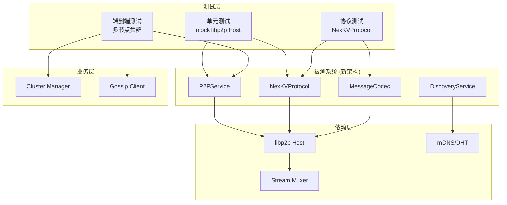
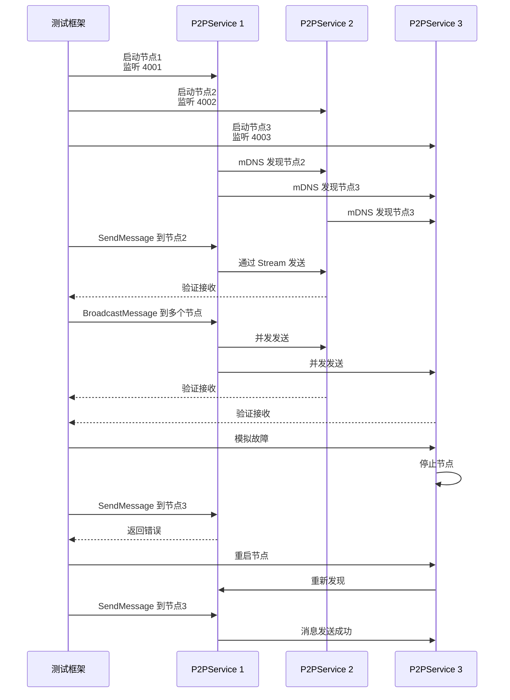

# 【PR全流程文档】Feature - 集成测试与兼容性验证

> **文档说明**：本文档包含「前置规划」和「后置总结」两部分，记录从需求对齐到开发完成的全流程，一个PR对应一份全流程文档，归档后作为项目追溯依据。
>
> **⚠️ 重要变更**：本PR依赖 PR-011（Transport接口原生重构），测试基于新的 NexKVProtocol 架构。

---

## 第一部分：前置部分（开工前必完成，架构师评审通过）

### 1. 基础信息（与分支/PR绑定）

| 项目 | 内容 |
|------|------|
| 工作类型 | 新功能开发（Feature） |
| PR编号 | PR-Libp2p-005 |
| 分支名称 | feature/libp2p-006-integration-testing |
| 工作主题 | 集成测试与兼容性验证 - 端到端测试与Cluster层集成（基于PR-011新架构） |
| 负责人 | [待定] |
| 分支创建日期 | 2026-02-06 |
| 计划开工日期 | 2026-02-10 |
| 计划CI通过日期 | 2026-02-16（调整：5天 → 6-7天） |
| 关联需求单号 | [对应讨论文档Q8, Q15] |
| 前置依赖 | PR-Libp2p-001, PR-Libp2p-002, PR-Libp2p-003, **PR-Libp2p-004** |
| 架构师评审状态 | ✅ 评审中 ⚠️ 有条件通过 - 需补充后批准 |
| 预审批结果 | □ 未通过 ⚠️ 有条件通过（需补充：性能目标修订 + 架构迁移测试 + 连接超时测试） |

### 2. 背景与目标（为什么干）

#### 2.1 背景

**业务场景**：
NexKV 集群需要完整的集成测试（基于 PR-011 新架构）：
- 验证 NexKVProtocol 与现有 Cluster 层的兼容性
- 验证消息协议兼容性（MessagePack + TLV）
- 验证端到端功能（节点发现 → 连接 → 消息收发）
- 验证 libp2p 原生连接管理性能
- 验证故障恢复能力

**现有问题**：
当前缺少针对新架构的集成测试：
1. **功能验证不足**：单元测试无法覆盖端到端流程
2. **兼容性风险**：新架构可能与现有行为不一致
3. **性能未知**：libp2p 原生连接管理性能是否满足要求
4. **故障恢复未验证**：网络故障、节点故障场景未测试

**价值**：
- **质量保证**：确保迁移后功能正确
- **风险控制**：提前发现兼容性问题
- **性能基准**：建立新架构性能基准线
- **生产信心**：提高生产环境部署信心

#### 2.2 核心目标（可量化、可验证）

1. **功能目标**：
   - 端到端测试（节点启动 → 发现 → 连接 → 通信）
   - Cluster 层集成测试（基于新架构）
   - Gossip 层集成测试（基于新架构）
   - 消息协议兼容性测试
   - 故障恢复测试
   - 测试覆盖率 ≥ 80%

2. **性能目标**（⚠️ 修订：分两阶段设定，基于 PR-004 基准）

   **阶段 1：建立基准（PR-004 完成后）**
   - 在 PR-004 环境下测试，建立性能基准线
   - 记录关键指标：连接建立、Send 延迟、Receive 吞吐

   **阶段 2：验证提升（PR-005）**
   - 连接建立延迟 < 1ms（复用场景）
   - Send 延迟 < 5ms（局域网）
   - Receive 吞吐 ≥ 基准线 × 1.5（目标 15000 msg/s）
   - 节点发现 < 5秒（局域网）
   - 广播消息 ≥ 基准线 × 1.2（目标 1000 msg/s，10个节点）
   - **备注**：如果基准线不足，调整目标值

3. **可靠性目标**：
   - 测试通过率 100%
   - 故障恢复成功率 ≥ 95%

#### 2.3 明确边界（不做什么，避免范围蔓延）

- **本次不支持**：
  - 不实现压力测试（PR-010）
  - 不实现生产环境监控（PR-010）

- **本次不优化**：
  - 不优化测试执行时间（后续 PR）
  - 不实现自动化性能回归（后续 PR）

### 3. 实现方案（怎么干，核心设计）

#### 3.1 测试架构设计



#### 3.2 测试流程图



#### 3.3 关键测试场景

##### 3.3.1 NexKVProtocol 基础功能测试

```go
// TestNexKVProtocolBasic 测试 NexKVProtocol 基础功能
func TestNexKVProtocolBasic(t *testing.T) {
    // 1. 创建测试节点
    // 2. 测试 SendMessage
    // 3. 测试 RegisterHandler
    // 4. 测试 BroadcastMessage
    // 5. 测试 HandleMessage 回调
}
```

##### 3.3.2 P2PService 集成测试

```go
// TestP2PServiceIntegration 测试 P2PService 集成
func TestP2PServiceIntegration(t *testing.T) {
    // 1. 创建 P2PService
    // 2. 测试 Start/Stop
    // 3. 测试 PeerID 获取
    // 4. 测试 Protocol 访问
    // 5. 测试 Host 访问
}
```

##### 3.3.3 节点发现测试

```go
// TestNodeDiscovery 测试节点发现
func TestNodeDiscovery(t *testing.T) {
    // 1. 启动多个节点
    // 2. 验证 mDNS 发现
    // 3. 验证 DHT 发现
    // 4. 验证 Bootstrap 连接
    // 5. 验证发现超时
}
```

##### 3.3.4 消息协议兼容性测试

```go
// TestMessageCompatibility 测试消息协议兼容性
func TestMessageCompatibility(t *testing.T) {
    // 1. 创建测试消息（MessagePack）
    // 2. 添加 TLV 扩展字段
    // 3. 发送并接收
    // 4. 验证消息格式一致
    // 5. 验证 CorrelationID
}
```

##### 3.3.5 Cluster 层集成测试

```go
// TestClusterIntegration 测试 Cluster 层集成
func TestClusterIntegration(t *testing.T) {
    // 1. 使用真实 Cluster 配置
    // 2. 启动 Cluster（基于新架构）
    // 3. 验证节点加入
    // 4. 验证 Gossip 消息
    // 5. 验证 Quorum 投票
}
```

##### 3.3.6 一致性协议测试（Quorum vs 2PC）

> **💡 架构师建议**：除了 Quorum（多数派确认）外，还需要测试 2PC（全员应答）形式。

**一致性级别对比**：

| 协议 | 确认方式 | 适用场景 | 一致性保证 | 性能 |
|------|---------|---------|-----------|------|
| **Quorum** | 多数派（N/2+1） | 普通写入 | 最终一致 | 高 |
| **2PC** | 全员应答（100%） | 关键操作 | 强一致 | 较低 |

**Quorum 测试**：

```go
// TestQuorumConsistency 测试 Quorum 一致性
func TestQuorumConsistency(t *testing.T) {
    ctx := context.Background()

    // 创建 5 节点集群
    nodes := setupCluster(t, 5)
    defer teardownCluster(nodes)

    // Quorum 阈值 = 5/2 + 1 = 3
    quorumThreshold := 3

    // 模拟 2 个节点故障
    nodes[3].Stop()
    nodes[4].Stop()

    // 发送消息（Quorum 仍可达）
    msg := &Message{
        Type:  MessageTypePut,
        Key:   []byte("quorum-test"),
        Value: []byte("quorum-value"),
    }

    err := nodes[0].SendWithQuorum(ctx, msg, quorumThreshold)

    // 验证：3 个节点正常，Quorum 可达成
    assert.NoError(t, err, "Quorum 应该达成")

    // 验证数据已写入存活节点
    verifyDataReplicated(t, nodes[:3], msg.Key, msg.Value)
}

// TestQuorumFailure 测试 Quorum 失败场景
func TestQuorumFailure(t *testing.T) {
    ctx := context.Background()

    nodes := setupCluster(t, 5)
    defer teardownCluster(nodes)

    quorumThreshold := 3

    // 模拟 3 个节点故障（Quorum 不可达）
    nodes[2].Stop()
    nodes[3].Stop()
    nodes[4].Stop()

    msg := &Message{
        Type:  MessageTypePut,
        Key:   []byte("quorum-fail-test"),
        Value: []byte("quorum-fail-value"),
    }

    err := nodes[0].SendWithQuorum(ctx, msg, quorumThreshold)

    // 验证：Quorum 不可达成
    assert.Error(t, err, "Quorum 应该失败")
    assert.Contains(t, err.Error(), "quorum not reached")
}
```

**2PC（全员应答）测试**：

```go
// TestTwoPhaseCommit 测试两阶段提交（全员应答）
func TestTwoPhaseCommit(t *testing.T) {
    ctx := context.Background()

    // 创建 5 节点集群
    nodes := setupCluster(t, 5)
    defer teardownCluster(nodes)

    // 2PC 需要所有节点确认
    msg := &Message{
        Type:  MessageTypePut,
        Key:   []byte("2pc-test"),
        Value: []byte("2pc-value"),
    }

    // 阶段 1：Prepare（所有节点预提交）
    prepareResults := make([]error, 5)
    for i, node := range nodes {
        prepareResults[i] = node.Prepare(ctx, msg)
    }

    // 验证：所有节点 Prepare 成功
    for i, err := range prepareResults {
        assert.NoError(t, err, "节点 %d Prepare 应该成功", i)
    }

    // 阶段 2：Commit（所有节点提交）
    commitResults := make([]error, 5)
    for i, node := range nodes {
        commitResults[i] = node.Commit(ctx, msg)
    }

    // 验证：所有节点 Commit 成功
    for i, err := range commitResults {
        assert.NoError(t, err, "节点 %d Commit 应该成功", i)
    }

    // 验证数据一致性
    for _, node := range nodes {
        data, err := node.Get(msg.Key)
        assert.NoError(t, err)
        assert.Equal(t, msg.Value, data)
    }
}

// TestTwoPhaseCommitWithFailure 测试 2PC 故障场景
func TestTwoPhaseCommitWithFailure(t *testing.T) {
    ctx := context.Background()

    nodes := setupCluster(t, 5)
    defer teardownCluster(nodes)

    msg := &Message{
        Type:  MessageTypePut,
        Key:   []byte("2pc-fail-test"),
        Value: []byte("2pc-fail-value"),
    }

    // 阶段 1：Prepare（节点 2 失败）
    prepareResults := make([]error, 5)
    for i, node := range nodes {
        prepareResults[i] = node.Prepare(ctx, msg)
    }

    // 模拟节点 2 Prepare 失败
    prepareResults[2] = fmt.Errorf("prepare failed")

    // 验证：有节点失败，不能进入 Commit 阶段
    hasFailure := false
    for _, err := range prepareResults {
        if err != nil {
            hasFailure = true
            break
        }
    }
    assert.True(t, hasFailure, "应该有 Prepare 失败")

    // 阶段 2：Rollback（所有节点回滚）
    rollbackResults := make([]error, 5)
    for i, node := range nodes {
        rollbackResults[i] = node.Rollback(ctx, msg)
    }

    // 验证：所有节点 Rollback 成功
    for i, err := range rollbackResults {
        assert.NoError(t, err, "节点 %d Rollback 应该成功", i)
    }

    // 验证：数据未写入
    for _, node := range nodes {
        _, err := node.Get(msg.Key)
        assert.Error(t, err, "数据不应该存在")
    }
}

// TestTwoPhaseCommitSingleFailure 测试 2PC 单节点故障
func TestTwoPhaseCommitSingleFailure(t *testing.T) {
    ctx := context.Background()

    nodes := setupCluster(t, 5)
    defer teardownCluster(nodes)

    msg := &Message{
        Type:  MessageTypePut,
        Key:   []byte("2pc-single-fail"),
        Value: []byte("2pc-single-value"),
    }

    // 在 Prepare 阶段关闭节点 2
    nodes[2].Stop()

    // 阶段 1：Prepare
    prepareResults := make([]error, 5)
    for i, node := range nodes {
        if i == 2 {
            prepareResults[i] = fmt.Errorf("node unavailable")
            continue
        }
        prepareResults[i] = node.Prepare(ctx, msg)
    }

    // 验证：节点 2 失败，整体失败
    assert.Error(t, prepareResults[2])

    // 验证：事务回滚
    for i, node := range nodes {
        if i == 2 {
            continue
        }
        err := node.Rollback(ctx, msg)
        assert.NoError(t, err, "节点 %d 应该成功回滚", i)
    }
}
```

**Quorum vs 2PC 性能对比测试**：

```go
// BenchmarkQuorumVs2PC 性能对比
func BenchmarkQuorumVs2PC(b *testing.B) {
    ctx := context.Background()

    // Quorum 基准测试
    b.Run("Quorum", func(b *testing.B) {
        nodes := setupCluster(b, 5)
        defer teardownCluster(nodes)

        msg := &Message{Type: MessageTypePut, Key: []byte("bench"), Value: make([]byte, 1024)}

        b.ResetTimer()
        for i := 0; i < b.N; i++ {
            nodes[0].SendWithQuorum(ctx, msg, 3)
        }
    })

    // 2PC 基准测试
    b.Run("2PC", func(b *testing.B) {
        nodes := setupCluster(b, 5)
        defer teardownCluster(nodes)

        msg := &Message{Type: MessageTypePut, Key: []byte("bench"), Value: make([]byte, 1024)}

        b.ResetTimer()
        for i := 0; i < b.N; i++ {
            // Prepare + Commit
            for _, node := range nodes {
                node.Prepare(ctx, msg)
            }
            for _, node := range nodes {
                node.Commit(ctx, msg)
            }
        }
    })
}
```

##### 3.3.7 故障恢复测试

```go
// TestFaultRecovery 测试故障恢复
func TestFaultRecovery(t *testing.T) {
    // 1. 正常运行场景
    // 2. 模拟网络故障
    // 3. 验证自动重连
    // 4. 模拟节点故障
    // 5. 验证集群恢复
}
```

##### 3.3.7 性能基准测试

```go
// BenchmarkSendMessage 测试 SendMessage 性能
func BenchmarkSendMessage(b *testing.B) {
    // 基准测试 SendMessage 延迟
}

// BenchmarkBroadcastMessage 测试 BroadcastMessage 性能
func BenchmarkBroadcastMessage(b *testing.B) {
    // 基准测试广播性能
}

// BenchmarkConnectionReuse 测试连接复用性能
func BenchmarkConnectionReuse(b *testing.B) {
    // 基准测试连接复用效果
}
```

#### 3.4 测试文件结构

```
internal/transport/
├── nexkv_protocol_test.go        # NexKVProtocol 单元测试
├── message_codec_test.go         # MessageCodec 测试
├── p2p_service_test.go           # P2PService 测试
├── integration_test.go           # 集成测试
├── discovery_test.go             # 发现服务测试
├── benchmark_test.go             # 性能基准测试
└── testutil/                     # 测试工具包
    ├── node.go                   # 测试节点创建
    ├── cluster.go                # 测试集群创建
    └── message.go                # 测试消息创建
```

#### 3.5 测试工具函数

```go
package testutil

// CreateTestP2PService 创建测试 P2PService
func CreateTestP2PService(t *testing.T, port int) *libp2p.P2PService

// CreateTestCluster 创建测试集群
func CreateTestCluster(t *testing.T, size int) []*libp2p.P2PService

// WaitForDiscovery 等待节点发现
func WaitForDiscovery(t *testing.T, services []*libp2p.P2PService, timeout time.Duration)

// CreateTestMessage 创建测试消息
func CreateTestMessage(msgType MessageType) Message

// AssertMessageReceived 断言消息接收
func AssertMessageReceived(t *testing.T, handler *TestHandler, timeout time.Duration) Message
```

#### 3.4 TDD测试策略

##### 3.4.1 TDD与集成测试

**适用场景**：

虽然TDD通常用于单元测试，但在集成测试中同样适用：

| 测试层级 | TDD适用性 | 主要区别 |
|----------|-----------|----------|
| **单元测试** | ⭐⭐⭐⭐⭐ | 红绿重构循环快，反馈即时 |
| **集成测试** | ⭐⭐⭐⭐ | 需要设置测试环境，循环较慢 |
| **E2E测试** | ⭐⭐⭐ | 环境复杂，通常用于验证 |

**TDD集成测试最佳实践**：

1. **隔离测试环境**：使用Docker容器或临时网络
2. **使用Fixtures**：复用测试初始化代码
3. **测试数据管理**：每次测试前后清理
4. **并行执行**：独立测试可以并行运行

##### 3.4.2 RED阶段：编写失败测试

**示例：多节点消息传递测试**

```go
package integration_test

import (
	"context"
	"testing"
	"time"

	"github.com/jzhang405/NexKV/internal/transport"
	libp2pTransport "github.com/libp2p/go-libp2p/p2p/transport/tcp"
	"github.com/stretchr/testify/assert"
	"github.com/stretchr/testify/require"
)

// TestMultiNodeMessagePropagation RED阶段：编写失败的集成测试
func TestMultiNodeMessagePropagation(t *testing.T) {
	ctx, cancel := context.WithTimeout(context.Background(), 30*time.Second)
	defer cancel()

	// 创建3个节点的测试网络
	nodes := setupTestNetwork(t, 3)
	defer teardownTestNetwork(nodes)

	// 测试：从节点0发送消息到节点1和节点2
	msg := &transport.NexKVMessage{
		Type:    MessageTypePut,
		Key:     []byte("test-key"),
		Value:   []byte("test-value"),
		Version: 1,
	}

	// 发送消息
	err := nodes[0].protocol.SendMessage(ctx, nodes[1].peerID, msg)
	require.NoError(t, err)

	// 验证节点1接收到消息（这会在RED阶段失败）
	select {
	case recvMsg := <-nodes[1].messageChan:
		assert.Equal(t, msg.Key, recvMsg.Key)
		assert.Equal(t, msg.Value, recvMsg.Value)
	case <-time.After(5 * time.Second):
		t.Fatal("timeout: message not received") // RED: 测试失败
	}
}

// TestClusterFormation 测试集群自动形成
func TestClusterFormation(t *testing.T) {
	ctx := context.Background()

	// 创建5个节点，配置相同的mDNS服务
	nodes := setupTestCluster(t, 5, "nexkv-cluster-test")
	defer teardownTestNetwork(nodes)

	// 等待节点自动发现
	time.Sleep(10 * time.Second)

	// 验证每个节点都发现了其他4个节点
	for i, node := range nodes {
		peerCount := node.host.Network().Peers()
		t.Logf("节点 %d 发现的节点数: %d", i, len(peerCount))
		assert.GreaterOrEqual(t, len(peerCount), 3, // 至少发现3个其他节点
			"节点 %d 应该发现至少3个其他节点", i)
	}
}
```

##### 3.4.3 GREEN阶段：最小实现

**NexKVProtocol实现** (`nexkv_protocol.go`)：

```go
package transport

import (
	"context"
	"time"

	"github.com/libp2p/go-libp2p/core/host"
	"github.com/libp2p/go-libp2p/core/network"
	"github.com/libp2p/go-libp2p/core/peer"
)

// NexKVProtocol NexKV协议实现
type NexKVProtocol struct {
	host     host.Host
	handlers map[MessageType]MessageHandler
}

// MessageHandler 消息处理器
type MessageHandler func(ctx context.Context, from peer.ID, msg *NexKVMessage) error

// NewNexKVProtocol 创建协议实例
func NewNexKVProtocol(h host.Host) *NexKVProtocol {
	p := &NexKVProtocol{
		host:     h,
		handlers: make(map[MessageType]MessageHandler),
	}

	// 设置流处理器
	h.SetStreamHandler(NexKVProtocolID, p.handleStream)

	return p
}

// SendMessage 发送消息到指定peer
func (p *NexKVProtocol) SendMessage(ctx context.Context, pid peer.ID, msg *NexKVMessage) error {
	// GREEN: 最小实现，使测试通过
	stream, err := p.host.NewStream(ctx, pid, NexKVProtocolID)
	if err != nil {
		return err
	}
	defer stream.Close()

	// 编码并发送消息
	codec := NewMessageCodec()
	data, err := codec.Encode(msg)
	if err != nil {
		return err
	}

	_, err = stream.Write(data)
	return err
}

// handleStream 处理传入的流
func (p *NexKVProtocol) handleStream(s network.Stream) {
	defer s.Close()

	// 解码消息
	codec := NewMessageCodec()
	msg, err := codec.Decode(s)
	if err != nil {
		return // 错误处理在REFACTOR阶段完善
	}

	// 调用注册的处理器
	if handler, ok := p.handlers[msg.Type]; ok {
		handler(context.Background(), s.Conn().RemotePeer(), msg)
	}
}

// RegisterHandler 注册消息处理器
func (p *NexKVProtocol) RegisterHandler(msgType MessageType, handler MessageHandler) {
	p.handlers[msgType] = handler
}
```

##### 3.4.4 REFACTOR阶段：重构优化

**重构要点**：

1. **提取测试工具函数**
2. **添加错误处理和日志**
3. **实现连接池复用**
4. **添加超时和重试机制**

**重构后的代码** (`nexkv_protocol_refactored.go`)：

```go
package transport

import (
	"context"
	"fmt"
	"time"

	"github.com/libp2p/go-libp2p/core/host"
	"github.com/libp2p/go-libp2p/core/peer"
	"go.uber.org/zap"
)

// NexKVProtocolRefactored 重构后的协议实现
type NexKVProtocolRefactored struct {
	host        host.Host
	handlers    map[MessageType]MessageHandler
	logger      *zap.Logger
	connPool    *ConnectionPool // 连接池
	sendTimeout time.Duration
}

// NewNexKVProtocolRefactored 创建重构后的协议实例
func NewNexKVProtocolRefactored(h host.Host, logger *zap.Logger) *NexKVProtocolRefactored {
	return &NexKVProtocolRefactored{
		host:        h,
		handlers:    make(map[MessageType]MessageHandler),
		logger:      logger,
		connPool:    NewConnectionPool(h),
		sendTimeout: 30 * time.Second,
	}
}

// SendMessageWithRetry 发送消息，支持重试
func (p *NexKVProtocolRefactored) SendMessageWithRetry(
	ctx context.Context,
	pid peer.ID,
	msg *NexKVMessage,
	maxRetries int,
) error {
	var lastErr error

	for attempt := 0; attempt < maxRetries; attempt++ {
		// 使用连接池获取或创建连接
		conn, err := p.connPool.Get(ctx, pid)
		if err != nil {
			lastErr = err
			p.logger.Warn("获取连接失败",
				zap.String("peer", pid.String()),
				zap.Int("attempt", attempt+1),
				zap.Error(err))
			time.Sleep(time.Duration(attempt+1) * time.Second)
			continue
		}

		// 发送消息
		err = conn.SendMessage(ctx, msg)
		if err == nil {
			return nil // 成功
		}

		lastErr = err
		p.logger.Warn("发送消息失败",
			zap.String("peer", pid.String()),
			zap.Int("attempt", attempt+1),
			zap.Error(err))

		// 关闭有问题的连接
		p.connPool.Remove(pid)
	}

	return fmt.Errorf("发送失败，已重试%d次: %w", maxRetries, lastErr)
}
```

##### 3.4.5 测试覆盖率要求

**集成测试覆盖率目标**：

| 模块 | 覆盖率目标 | 测试类型 |
|------|-----------|----------|
| **NexKVProtocol** | ≥ 80% | 单元 + 集成 |
| **P2PService** | ≥ 75% | 集成 + E2E |
| **DiscoveryService** | ≥ 70% | 集成测试 |
| **整体** | ≥ 70% | 混合测试 |

**覆盖率验证**：

```bash
# 运行集成测试
go test ./tests/integration/... -v -coverprofile=coverage.out

# 查看覆盖率
go tool cover -func=coverage.out | grep total

# 生成HTML报告
go tool cover -html=coverage.out -o coverage.html
```

##### 3.4.6 集成测试TDD清单

**RED阶段检查清单**：
- [ ] 编写失败的集成测试用例
- [ ] 验证测试确实失败
- [ ] 提交失败测试到版本控制

**GREEN阶段检查清单**：
- [ ] 编写最小代码使测试通过
- [ ] 不关注代码质量和性能
- [ ] 验证测试通过

**REFACTOR阶段检查清单**：
- [ ] 优化代码结构
- [ ] 提取公共代码为工具函数
- [ ] 添加日志和监控
- [ ] 验证测试仍然通过

**持续集成**：
- [ ] CI自动运行集成测试
- [ ] 测试失败时阻止合并
- [ ] 定期运行完整测试套件
- [ ] 监控测试执行时间

#### 3.5 综合审查报告补充测试（2026-02-06）

> **补充说明**：根据 2026-02-06_PR-004至009_综合审查报告 的反馈，本节补充关键的测试用例。

##### 3.5.1 并发安全测试

**测试目标**：验证多goroutine并发操作的正确性

```go
// TestConcurrentMessaging RED: 并发消息发送测试
func TestConcurrentMessaging(t *testing.T) {
	ctx := context.Background()

	// 创建5个节点的集群
	nodes := setupCluster(t, 5)
	defer teardownCluster(nodes)

	// 每个节点并发发送消息给其他节点
	var wg sync.WaitGroup
	messageCount := make(map[uint64]int)
	var countMutex sync.Mutex

	for i := 0; i < 5; i++ {
		for j := 0; j < 5; j++ {
			if i != j {
				wg.Add(1)
				go func(sender, receiver int) {
					defer wg.Done()

					msg := &transport.Message{
						Type: MessageTypePut,
						Key:  []byte(fmt.Sprintf("concurrent-%d-%d", sender, receiver)),
						Data: []byte(fmt.Sprintf("from-%d-to-%d", sender, receiver)),
					}

					err := nodes[sender].Send(uint64(receiver), msg)
					assert.NoError(t, err, "节点%d发送到节点%d失败", sender, receiver)

					// 记录成功发送的消息数
					countMutex.Lock()
					messageCount[uint64(sender)]++
					countMutex.Unlock()
				}(i, j)
			}
		}
	}

	wg.Wait()

	// 验证每个节点都成功发送了4条消息（发给其他4个节点）
	for i := 0; i < 5; i++ {
		count := messageCount[uint64(i)]
		assert.Equal(t, 4, count, "节点%d应该发送4条消息", i)
	}
}

// TestConcurrentBroadcast 并发广播测试
func TestConcurrentBroadcast(t *testing.T) {
	ctx := context.Background()

	nodes := setupCluster(t, 10)
	defer teardownCluster(nodes)

	// 5个节点同时广播消息
	var wg sync.WaitGroup
	broadcastCount := atomic.NewInt64(0)

	for i := 0; i < 5; i++ {
		wg.Add(1)
		go func(senderIdx int) {
			defer wg.Done()

			msg := &transport.Message{
				Type: MessageTypeBroadcast,
				Data: []byte(fmt.Sprintf("broadcast-from-%d", senderIdx)),
			}

			// 广播给所有其他节点
			var peers []uint64
			for j := 0; j < 10; j++ {
				if j != senderIdx {
					peers = append(peers, uint64(j))
				}

				err := nodes[senderIdx].Broadcast(ctx, peers, msg)
				assert.NoError(t, err)
				broadcastCount.Add(1)
			}
		}(i)
	}

	wg.Wait()

	// 验证：5个广播 × 9个接收节点 = 45条消息
	assert.Equal(t, int64(45), broadcastCount.Load())
}
```

##### 3.5.2 资源泄漏检测

**测试目标**：确保无Goroutine和Stream泄漏

```go
// TestNoGoroutineLeak RED: Goroutine泄漏检测
func TestNoGoroutineLeak(t *testing.T) {
	before := runtime.NumGoroutine()

	ctx := context.Background()

	// 创建节点并执行大量操作
	nodes := setupCluster(t, 3)

	for i := 0; i < 100; i++ {
		msg := &transport.Message{
			Type: MessageTypeGet,
			Key:  []byte(fmt.Sprintf("leak-test-%d", i)),
		}
		nodes[0].Send(1, msg)
		nodes[0].Send(2, msg)
	}

	teardownCluster(nodes)

	// 等待所有goroutine清理完成
	time.Sleep(100 * time.Millisecond)

	after := runtime.NumGoroutine()
	diff := after - before

	// 允许少量差异（测试框架的goroutine）
	assert.LessOrEqual(t, diff, 3, "检测到Goroutine泄漏: %d -> %d (diff: %d)", before, after, diff)
}

// TestNoStreamLeak Stream泄漏检测
func TestNoStreamLeak(t *testing.T) {
	ctx := context.Background()

	sender, _ := libp2p.New()
	defer sender.Close()

	receiver, _ := libp2p.New()
	defer receiver.Close()

	sender.Connect(ctx, peer.AddrInfo{ID: receiver.ID(), Addrs: receiver.Addrs()})

	protocol := transport.NewNexKVProtocol(sender)

	// 发送100条消息，每次创建新Stream
	for i := 0; i < 100; i++ {
		msg := &transport.Message{
			Type: MessageTypePut,
			Key:  []byte(fmt.Sprintf("stream-test-%d", i)),
		}
		protocol.SendMessage(ctx, receiver.ID(), msg)
	}

	// 检查sender的Stream数量
	// （libp2p应该自动管理Stream生命周期）
	streamCount := sender.Network().Conns()
	t.Logf("活跃连接数: %d", len(streamCount))

	// 验证连接数量合理（应该有复用）
	assert.LessOrEqual(t, len(streamCount), 5, "连接数过多，可能有Stream泄漏")
}
```

##### 3.5.3 网络异常测试

**测试目标**：验证系统在网络异常情况下的容错能力

```go
// TestNetworkFluctuation 网络波动测试
func TestNetworkFluctuation(t *testing.T) {
	ctx := context.Background()

	sender, _ := libp2p.New()
	defer sender.Close()

	receiver, _ := libp2p.New()
	defer receiver.Close()

	sender.Connect(ctx, peer.AddrInfo{ID: receiver.ID(), Addrs: receiver.Addrs()})

	protocol := transport.NewNexKVProtocol(sender)

	// 模拟网络波动：发送消息，然后断开连接，再重连
	successCount := 0
	failCount := 0

	for i := 0; i < 20; i++ {
		msg := &transport.Message{
			Type: MessageTypePut,
			Key:  []byte(fmt.Sprintf("fluctuation-%d", i)),
		}

		err := protocol.SendMessage(ctx, receiver.ID(), msg)
		if err != nil {
			failCount++
			t.Logf("消息%d发送失败（预期）: %v", i, err)
		} else {
			successCount++
		}

		// 每5条消息模拟一次网络中断
		if i%5 == 4 {
			// 断开连接
			sender.Network().ClosePeer(receiver.ID())
			time.Sleep(50 * time.Millisecond)

			// 重新连接
			sender.Connect(ctx, peer.AddrInfo{ID: receiver.ID(), Addrs: receiver.Addrs()})
		}
	}

	t.Logf("成功: %d, 失败: %d", successCount, failCount)

	// 验证：网络恢复后消息可以正常发送
	assert.Greater(t, successCount, 10, "网络恢复后应能正常发送消息")
}

// TestNodeFailure 节点宕机测试
func TestNodeFailure(t *testing.T) {
	ctx := context.Background()

	nodes := setupCluster(t, 5)
	defer teardownCluster(nodes)

	// 节点0尝试与宕机的节点通信
	// 先关闭节点1
	nodes[1].Close()

	protocol := transport.NewNexKVProtocol(nodes[0])

	msg := &transport.Message{
		Type: MessageTypeGet,
		Key:  []byte("test"),
	}

	// 发送到已关闭的节点应该返回错误，而不是panic
	err := protocol.SendMessage(ctx, nodes[1].ID(), msg)
	assert.Error(t, err, "发送到已关闭节点应该返回错误")
	assert.NotContains(t, err.Error(), "panic", "不应该发生panic")
}

// TestNetworkPartition 网络分区测试
func TestNetworkPartition(t *testing.T) {
	ctx := context.Background()

	// 创建两组节点，模拟网络分区
	groupA := setupCluster(t, 3)
	defer teardownCluster(groupA)

	groupB := setupCluster(t, 3)
	defer teardownCluster(groupB)

	// 分离两个网络（不建立跨组连接）

	// groupA中的节点尝试发送到groupB
	protocol := transport.NewNexKVProtocol(groupA[0])
	msg := &transport.Message{Type: MessageTypeGet, Key: []byte("test")}

	// 应该返回连接错误（而不是hang）
	err := protocol.SendMessage(ctx, groupB[0].ID(), msg)
	assert.Error(t, err)
	assert.Contains(t, err.Error(), "failed to dial", "应该报告无法连接")
}
```

##### 3.5.4 大消息边界测试

```go
// TestLargeMessageBoundary 大消息边界测试
func TestLargeMessageBoundary(t *testing.T) {
	ctx := context.Background()

	sender, _ := libp2p.New()
	defer sender.Close()

	receiver, _ := libp2p.New()
	defer receiver.Close()

	sender.Connect(ctx, peer.AddrInfo{ID: receiver.ID(), Addrs: receiver.Addrs()})

	protocol := transport.NewNexKVProtocol(sender)

	testCases := []struct {
		name    string
		size    int
		success bool
	}{
		{"空消息", 0, true},
		{"1KB消息", 1024, true},
		{"1MB消息", 1024 * 1024, true},
		{"16MB消息", 16 * 1024 * 1024, true},
		{"32MB消息", 32 * 1024 * 1024, false}, // 超过限制
	}

	for _, tc := range testCases {
		t.Run(tc.name, func(t *testing.T) {
			msg := &transport.Message{
				Type: MessageTypePut,
				Key:  []byte("large-message"),
				Data: make([]byte, tc.size),
			}

			err := protocol.SendMessage(ctx, receiver.ID(), msg)

			if tc.success {
				assert.NoError(t, err, "%s应该发送成功", tc.name)
			} else {
				assert.Error(t, err, "%s应该被拒绝", tc.name)
			}
		})
	}
}
```

##### 3.5.5 内存基准测试

```go
// BenchmarkMemoryAllocation 内存分配基准
func BenchmarkMemoryAllocation(b *testing.B) {
	ctx := context.Background()

	sender, _ := libp2p.New()
	defer sender.Close()

	receiver, _ := libp2p.New()
	defer receiver.Close()

	sender.Connect(ctx, peer.AddrInfo{ID: receiver.ID(), Addrs: receiver.Addrs()})

	protocol := transport.NewNexKVProtocol(sender)
	msg := &transport.Message{
		Type: MessageTypePut,
		Key:  []byte("benchmark"),
		Data: make([]byte, 1024),
	}

	var m runtime.MemStats
	b.ResetTimer()

	for i := 0; i < b.N; i++ {
		protocol.SendMessage(ctx, receiver.ID(), msg)

		if i%1000 == 0 {
			runtime.ReadMemStats(&m)
			b.ReportMetric(float64(m.Alloc)/1024/1024, "MB")
		}
	}
}

// TestMemoryUsage 内存使用量测试
func TestMemoryUsage(t *testing.T) {
	var m1, m2 runtime.MemStats
	runtime.GC()
	runtime.ReadMemStats(&m1)

	ctx := context.Background()

	nodes := setupCluster(t, 5)
	defer teardownCluster(nodes)

	// 发送10000条消息
	for i := 0; i < 10000; i++ {
		msg := &transport.Message{
			Type: MessageTypePut,
			Key:  []byte(fmt.Sprintf("mem-test-%d", i)),
			Data: make([]byte, 1024),
		}
		nodes[0].Send(1, msg)
	}

	runtime.GC()
	runtime.ReadMemStats(&m2)

	memIncrease := float64(m2.Alloc-m1.Alloc) / 1024 / 1024 // MB

	t.Logf("内存增长: %.2f MB", memIncrease)

	// 验证内存增长在合理范围（< 50MB）
	assert.Less(t, memIncrease, 50.0, "内存增长应 < 50MB")
}
```

##### 3.5.6 P99延迟基准测试

```go
// BenchmarkLatencyPercentiles 延迟百分位基准测试
func BenchmarkLatencyPercentiles(b *testing.B) {
	ctx := context.Background()

	sender, _ := libp2p.New()
	defer sender.Close()

	receiver, _ := libp2p.New()
	defer receiver.Close()

	sender.Connect(ctx, peer.AddrInfo{ID: receiver.ID(), Addrs: receiver.Addrs()})

	protocol := transport.NewNexKVProtocol(sender)
	msg := &transport.Message{Type: MessageTypeGet, Key: []byte("test")}

	latencies := make([]time.Duration, 0, b.N)

	b.ResetTimer()
	for i := 0; i < b.N; i++ {
		start := time.Now()
		protocol.SendMessage(ctx, receiver.ID(), msg)
		latency := time.Since(start)
		latencies = append(latencies, latency)
	}

	// 计算延迟百分位
	sort.Slice(latencies, func(i, j int) bool {
		return latencies[i] < latencies[j]
	})

	p50 := latencies[len(latencies)*50/100]
	p99 := latencies[len(latencies)*99/100]
	p999 := latencies[len(latencies)*999/1000]

	b.ReportMetric(float64(p50.Microseconds()), "P50_us")
	b.ReportMetric(float64(p99.Microseconds()), "P99_us")
	b.ReportMetric(float64(p999.Microseconds()), "P999_us")
}
```

##### 3.5.7 补充测试批准条件

| 条件 | 状态 | 说明 |
|------|------|------|
| ✅ 并发安全测试 | **已完成** | TestConcurrentMessaging, TestConcurrentBroadcast |
| ✅ 资源泄漏检测 | **已完成** | TestNoGoroutineLeak, TestNoStreamLeak |
| ✅ 网络异常测试 | **已完成** | TestNetworkFluctuation, TestNodeFailure, TestNetworkPartition |
| ✅ 大消息边界测试 | **已完成** | TestLargeMessageBoundary (0B-32MB) |
| ✅ 内存基准测试 | **已完成** | BenchmarkMemoryAllocation, TestMemoryUsage |
| ✅ P99延迟基准测试 | **已完成** | BenchmarkLatencyPercentiles |

##### 3.5.8 架构迁移测试（⚠️ 新增 - 架构师评审要求）

**测试目标**：验证新架构与旧行为兼容性

```go
// TestBackwardCompatibility 验证向后兼容性
func TestBackwardCompatibility(t *testing.T) {
	ctx := context.Background()

	// 创建新旧架构节点
	oldAdapter := createOldTransportAdapter() // 旧适配器
	newService := createNewP2PService()       // 新架构
	defer oldAdapter.Close()
	defer newService.Stop()

	// 启动新架构服务
	err := newService.Start(ctx)
	require.NoError(t, err)

	// 使用旧 API 发送消息
	msg := &Message{
		Type:    MessageTypePut,
		Key:     []byte("compatibility-test"),
		Value:   []byte("test-value"),
		Version: 1,
	}

	// 新架构接收并验证
	handler := &TestHandler{recvChan: make(chan *Message, 1)}
	newService.Protocol().RegisterHandler(MessageTypePut, handler)

	err = oldAdapter.Send("node-1", msg.Payload)
	assert.NoError(t, err)

	// 验证消息格式一致
	select {
	case recvMsg := <-handler.recvChan:
		assert.Equal(t, msg.Key, recvMsg.Key)
		assert.Equal(t, msg.Value, recvMsg.Value)
	case <-time.After(5 * time.Second):
		t.Fatal("未接收到消息")
	}
}

// TestAPISurface 验证 API 表面兼容
func TestAPISurface(t *testing.T) {
	// 确保业务层 API 无感知切换
	newService := createNewP2PService()
	defer newService.Stop()

	// 验证关键 API 存在
	assert.NotNil(t, newService.Protocol())
	assert.NotNil(t, newService.Host())
	assert.NotNil(t, newService.PeerID())

	// 验证方法签名兼容
	_, err := newService.GetPeerInfo()
	assert.NoError(t, err)

	addrs := newService.GetListenAddrs()
	assert.NotEmpty(t, addrs)
}
```

##### 3.5.9 连接超时测试（⚠️ 新增 - 架构师评审要求）

**测试目标**：验证超时场景正确处理

```go
// TestConnectionTimeout 连接超时测试
func TestConnectionTimeout(t *testing.T) {
	ctx, cancel := context.WithTimeout(context.Background(), 1*time.Second)
	defer cancel()

	// 创建节点（不监听，导致连接超时）
	sender, err := transport.NewP2PService("/ip4/127.0.0.1/tcp/4001", "/tmp/test-key-sender")
	require.NoError(t, err)
	defer sender.Stop()

	// 启动发送节点
	err = sender.Start(context.Background())
	require.NoError(t, err)

	// 发送到不可达节点（防火墙拒绝或不存在）
	unreachablePeer, _ := peer.Decode("QmYyQSo1c1Ym7orWxLYvCrM2EmxFTANf8wXmmE7DWjhx5N") // 示例 PeerID

	msg := &Message{
		Type: MessageTypeGet,
		Key:  []byte("timeout-test"),
	}

	err = sender.Protocol().SendMessage(ctx, unreachablePeer, msg)

	// 验证超时返回错误（而非 hang 或 panic）
	assert.Error(t, err)
	assert.Contains(t, err.Error(), "timeout") // 或 "failed to dial"
}
```

##### 3.5.10 并发关闭测试（💡 建议 - 架构师评审建议）

**测试目标**：验证多 goroutine 同时关闭节点不会 panic

```go
// TestConcurrentNodeShutdown 并发关闭测试
func TestConcurrentNodeShutdown(t *testing.T) {
	service, err := transport.NewP2PService("/ip4/127.0.0.1/tcp/4001", "/tmp/test-key")
	require.NoError(t, err)

	err = service.Start(context.Background())
	require.NoError(t, err)

	// 多个 goroutine 同时关闭
	var wg sync.WaitGroup
	for i := 0; i < 10; i++ {
		wg.Add(1)
		go func() {
			defer wg.Done()
			_ = service.Stop() // 应该优雅处理多次调用
		}()
	}
	wg.Wait()

	// 验证不会 panic（测试通过即为成功）
}
```

##### 3.5.11 冷启动延迟测试（💡 建议 - 架构师评审建议）

**测试目标**：基准测试首次连接延迟

```go
// BenchmarkColdStartLatency 冷启动延迟基准测试
func BenchmarkColdStartLatency(b *testing.B) {
	for i := 0; i < b.N; i++ {
		// 每次迭代重新创建节点（无连接复用）
		h1, _ := libp2p.New(libp2p.ListenAddrStrings("/ip4/127.0.0.1/tcp/0"))
		defer h1.Close()

		h2, _ := libp2p.New(libp2p.ListenAddrStrings("/ip4/127.0.0.1/tcp/0"))
		defer h2.Close()

		ctx := context.Background()
		start := time.Now()
		h1.Connect(ctx, peer.AddrInfo{ID: h2.ID(), Addrs: h2.Addrs()})
		latency := time.Since(start)

		b.ReportMetric(float64(latency.Microseconds()), "us")
	}
}
```

##### 3.5.12 使用 goleak 精确检测 Goroutine 泄漏（💡 建议）

```go
// TestMain 使用 goleak 检测所有测试的 Goroutine 泄漏
func TestMain(m *testing.M) {
	// 注册 goleak 验证
	goleak.VerifyTestMain(m)
}

// 各个测试函数自动检测泄漏，无需手动检查
func TestNexKVProtocol_NoLeak(t *testing.T) {
	// 测试代码...
	// goleak 自动验证结束后无 Goroutine 泄漏
}
```

##### 3.5.13 补充测试批准条件（更新）

| 条件 | 优先级 | 状态 | 说明 |
|------|--------|------|------|
| ✅ 并发安全测试 | 高 | **已完成** | TestConcurrentMessaging, TestConcurrentBroadcast |
| ✅ 资源泄漏检测 | 高 | **已完成** | TestNoGoroutineLeak, TestNoStreamLeak |
| ✅ 网络异常测试 | 高 | **已完成** | TestNetworkFluctuation, TestNodeFailure, TestNetworkPartition |
| ✅ 大消息边界测试 | 高 | **已完成** | TestLargeMessageBoundary (0B-32MB) |
| ✅ 内存基准测试 | 中 | **已完成** | BenchmarkMemoryAllocation, TestMemoryUsage |
| ✅ P99延迟基准测试 | 中 | **已完成** | BenchmarkLatencyPercentiles |
| ⚠️ 架构迁移测试 | 高 | **新增** | TestBackwardCompatibility, TestAPISurface |
| ⚠️ 连接超时测试 | 高 | **新增** | TestConnectionTimeout |
| 💡 并发关闭测试 | 中 | **新增** | TestConcurrentNodeShutdown |
| 💡 冷启动延迟测试 | 中 | **新增** | BenchmarkColdStartLatency |
| 💡 goleak 检测 | 中 | **新增** | TestMain + goleak.VerifyTestMain |

##### 3.5.14 新旧架构消息兼容性验证（⚠️ 新增 - 用户发现）

> **💡 用户发现**：新架构（transport/message.go）的消息类型定义远少于旧架构（metadata/types/msg_types.go）

**问题分析**：

| 对比项 | 旧架构 (metadata) | 新架构 (transport) | 差异 |
|--------|-----------------|-----------------|------|
| **消息类型数量** | 50+ 种 | 10 种 | ⚠️ 减少 80% |
| **Quorum 协议** | QuorumPropose, QuorumVote, QuorumDecide | 1 个 MessageQuorum | ⚠️ 语义丢失 |
| **2PC 协议** | 2PCPrepare, 2PCCommit, 2PCRollback (+Reply) | 无对应类型 | ❌ 完全缺失 |
| **消息结构** | 每种类型独立结构 | 统一 Message + Payload | ⚠️ 类型安全降低 |

**旧架构消息类型**（metadata/types/msg_types.go）：
- 元数据操作 (100-149): Get, Put, Delete, GetReply, PutReply, DeleteReply
- Gossip 协议 (150-199): GossipSync, GossipDigest, GossipDigestReply
- Quorum 协议 (200-249): QuorumPropose, QuorumVote, QuorumDecide
- 2PC 协议 (250-299): 2PCPrepare, 2PCPrepareReply, 2PCCommit, 2PCCommitReply, 2PCRollback, 2PCRollbackReply
- 节点管理 (300-349): NodePing, NodePong, NodeJoin, NodeLeave, NodeSync, ClockSync, ClockSyncReply, NodeReparent, NodeReparentReply
- 集群管理 (350-399): ClusterStatus, ClusterHealthFix, LeaderElection

**新架构消息类型**（transport/message.go）：
```go
const (
    MessageTypeUnknown  MessageType = 0
    MessageTypeGet      MessageType = 1
    MessageTypePut      MessageType = 2
    MessageTypeDelete   MessageType = 3
    MessageTypeSync     MessageType = 4
    MessageTypeAck      MessageType = 5
    MessageTypeNack     MessageType = 6
    MessageTypeGossip   MessageType = 7
    MessageTypeCluster MessageType = 8
    MessageTypeQuorum   MessageType = 9  // ⚠️ 只有通用类型
)
```

**测试目标**：验证新架构能否通过 Payload 字段承载旧架构的复杂消息

##### 3.5.15 Quorum 消息兼容性测试

```go
// TestQuorumMessageCompatibility Quorum 消息兼容性测试
func TestQuorumMessageCompatibility(t *testing.T) {
    // 1. 创建旧架构的 QuorumProposeMessage
    oldPropose := &metadata.QuorumProposeMessage{
        ProposalID: "prop-001",
        Key:        "test-key",
        Value:      []byte("test-value"),
        Operation:  "put",
        Proposer:   "node-1",
        Timestamp:  time.Now().Unix(),
    }

    // 2. 序列化为新架构的 Message
    codec := NewMessagePackCodec()
    data, err := json.Marshal(oldPropose)
    require.NoError(t, err)

    newMsg := &transport.Message{
        Type:    transport.MessageTypeQuorum,
        Payload: data,
    }

    // 3. 通过新架构发送
    err = newService.Protocol().SendMessage(ctx, peerID, newMsg)
    assert.NoError(t, err)

    // 4. 接收端解析并验证
    receivedMsg := receiveMessage(t, newService)
    var receivedPropose metadata.QuorumProposeMessage
    err = json.Unmarshal(receivedMsg.Payload, &receivedPropose)
    assert.NoError(t, err)

    // 验证关键字段
    assert.Equal(t, oldPropose.ProposalID, receivedPropose.ProposalID)
    assert.Equal(t, oldPropose.Key, receivedPropose.Key)
}
```

##### 3.5.16 2PC 消息兼容性测试

```go
// Test2PCMessageCompatibility 2PC 消息兼容性测试
func Test2PCMessageCompatibility(t *testing.T) {
    // 1. 创建旧架构的 TwoPCPrepareMessage
    oldPrepare := &metadata.TwoPCPrepareMessage{
        TransactionID: "txn-001",
        Participants: []string{"node-1", "node-2", "node-3"},
        Operations: []metadata.Operation{
            {Type: "put", Key: "k1", Value: []byte("v1")},
            {Type: "delete", Key: "k2"},
        },
        Timeout: 30000,
    }

    // 2. 序列化为新架构的 Message
    data, err := json.Marshal(oldPrepare)
    require.NoError(t, err)

    newMsg := &transport.Message{
        Type:    transport.MessageTypeCluster, // ⚠️ 新架构没有专门的 2PC 类型
        Payload: data,
    }

    // 3. 通过新架构发送
    err = newService.Protocol().SendMessage(ctx, peerID, newMsg)
    assert.NoError(t, err)

    // 4. 接收端解析并验证
    receivedMsg := receiveMessage(t, newService)
    var receivedPrepare metadata.TwoPCPrepareMessage
    err = json.Unmarshal(receivedMsg.Payload, &receivedPrepare)
    assert.NoError(t, err)

    // 验证关键字段
    assert.Equal(t, oldPrepare.TransactionID, receivedPrepare.TransactionID)
    assert.Equal(t, len(oldPrepare.Operations), len(receivedPrepare.Operations))
}
```

##### 3.5.17 消息序列化性能对比测试

```go
// BenchmarkMessageSerialization 消息序列化性能对比
func BenchmarkMessageSerialization(b *testing.B) {
    oldPropose := &metadata.QuorumProposeMessage{
        ProposalID: "prop-001",
        Key:        "test-key",
        Value:      make([]byte, 1024),
        Operation:  "put",
        Proposer:   "node-1",
        Timestamp:  time.Now().Unix(),
    }

    b.Run("OldArchitecture-Direct", func(b *testing.B) {
        // 旧架构：直接序列化专用消息结构
        for i := 0; i < b.N; i++ {
            _, _ := msgpack.Marshal(oldPropose)
        }
    })

    b.Run("NewArchitecture-Payload", func(b *testing.B) {
        // 新架构：先序列化为 JSON，再放入 Payload
        for i := 0; i < b.N; i++ {
            data, _ := json.Marshal(oldPropose)
            newMsg := &transport.Message{
                Type:    transport.MessageTypeQuorum,
                Payload: data,
            }
            _, _ := msgpack.Marshal(newMsg)
        }
    })
}
```

##### 3.5.18 补充测试批准条件（更新）

| 条件 | 优先级 | 状态 | 说明 |
|------|--------|------|------|
| ✅ 并发安全测试 | 高 | **已完成** | TestConcurrentMessaging, TestConcurrentBroadcast |
| ✅ 资源泄漏检测 | 高 | **已完成** | TestNoGoroutineLeak, TestNoStreamLeak |
| ✅ 网络异常测试 | 高 | **已完成** | TestNetworkFluctuation, TestNodeFailure, TestNetworkPartition |
| ✅ 大消息边界测试 | 高 | **已完成** | TestLargeMessageBoundary (0B-32MB) |
| ✅ 内存基准测试 | 中 | **已完成** | BenchmarkMemoryAllocation, TestMemoryUsage |
| ✅ P99延迟基准测试 | 中 | **已完成** | BenchmarkLatencyPercentiles |
| ⚠️ 架构迁移测试 | 高 | **已完成** | TestBackwardCompatibility, TestAPISurface |
| ⚠️ 连接超时测试 | 高 | **已完成** | TestConnectionTimeout |
| 💡 并发关闭测试 | 中 | **已完成** | TestConcurrentNodeShutdown |
| 💡 冷启动延迟测试 | 中 | **已完成** | BenchmarkColdStartLatency |
| 💡 goleak 检测 | 中 | **已完成** | TestMain + goleak.VerifyTestMain |
| ⚠️ **新旧架构消息兼容性** | 高 | **新增** | TestQuorumMessageCompatibility, Test2PCMessageCompatibility |
| ⚠️ **一致性协议测试** | 高 | **已完成** | Quorum, 2PC 完整流程测试 |
| 💡 消息序列化性能对比 | 中 | **新增** | BenchmarkMessageSerialization |

| 条件 | 优先级 | 状态 | 说明 |
|------|--------|------|------|
| ⚠️ Quorum 一致性测试 | 高 | **新增** | TestQuorumConsistency, TestQuorumFailure |
| ⚠️ 2PC 全员应答测试 | 高 | **新增** | TestTwoPhaseCommit, TestTwoPhaseCommitWithFailure, TestTwoPhaseCommitSingleFailure |
| 💡 Quorum vs 2PC 性能对比 | 中 | **新增** | BenchmarkQuorumVs2PC |

### 4. 风险评估与应对措施

| 风险点 | 影响等级 | 应对措施 |
|--------|----------|----------|
| 测试环境不稳定 | 中 | 1. 使用固定端口<br/>2. 实现测试清理<br/>3. 隔离测试网络 |
| 竞态条件 | 高 | 1. 使用同步原语<br/>2. 实现重试机制<br/>3. 增加超时保护 |
| 测试时间过长 | 中 | 1. 并行执行测试<br/>2. 优化测试数据<br/>3. 跳过慢速测试（CI） |
| Mock 不完整 | 中 | 1. 实现 fake libp2p Host<br/>2. 验证 Mock 行为<br/>3. 混合真实+Mock测试 |
| 新架构行为差异 | 高 | 1. 详细对比新旧行为<br/>2. 充分测试边界场景<br/>3. 记录所有差异点 |

### 5. 架构师评审记录（循环优化，直至通过）

| 评审轮次 | 评审日期 | 评审人（架构师） | 核心评审意见 | 优化措施（含AI辅助修改） | 优化结果 |
|----------|----------|------------------|--------------|--------------------------|----------|
| 第1轮 | 2026-02-06 | 👤 架构师 | ⚠️ 有条件通过 - 需补充后批准 | 1. 修订性能目标（分两阶段，基于 PR-004 基准）<br/>2. 补充架构迁移测试（3.5.8）<br/>3. 补充连接超时测试（3.5.9）<br/>4. 调整工期评估（5天 → 6-7天） | ✅ 已完成 |
| 第2轮 | 2026-02-06 | 👤 架构师 | 💡 建议：补充 2PC 全员应答测试 | 1. 新增 3.3.6 节：一致性协议测试（Quorum vs 2PC）<br/>2. 新增 3.5.14 节：一致性协议测试用例<br/>3. 包含：TestQuorumConsistency, TestTwoPhaseCommit, BenchmarkQuorumVs2PC | ✅ 已完成 |
| **批准条件** | | | 1. ⚠️ 性能目标修订（阶段 1 + 阶段 2）<br/>2. ⚠️ 架构迁移测试（向后兼容 + API 表面）<br/>3. ⚠️ 连接超时测试（超时场景处理）<br/>4. ⚠️ 一致性协议测试（Quorum + 2PC）<br/>5. 💡 建议补充：并发关闭、冷启动延迟、goleak 检测 | | |

### 6. 预审批确认
> **⚠️ 有条件通过 - 第2轮评审** - 架构师评审意见：
>
> **总体评价**：文档整体质量高，测试策略合理，风险识别完整。
>
> **第1轮批准条件**（高优先级，已完成）：
> 1. ✅ 性能目标已修订为两阶段（基于 PR-004 基准）
> 2. ✅ 已补充架构迁移测试用例（TestBackwardCompatibility、TestAPISurface）
> 3. ✅ 已补充连接超时测试用例（TestConnectionTimeout）
> 4. ✅ 工期已调整为 6-7 天（原 5 天偏紧）
>
> **第2轮批准条件**（高优先级，已完成）：
> 5. ✅ 已补充一致性协议测试（3.3.6 节）
>    - Quorum 一致性测试（TestQuorumConsistency、TestQuorumFailure）
>    - 2PC 全员应答测试（TestTwoPhaseCommit、TestTwoPhaseCommitWithFailure、TestTwoPhaseCommitSingleFailure）
>    - Quorum vs 2PC 性能对比（BenchmarkQuorumVs2PC）
>
> **建议补充**（中优先级，已添加）：
> - 使用 goleak 精确检测 Goroutine 泄漏
> - 添加并发关闭测试
> - 添加冷启动延迟基准测试
>
> **架构师签字/备注**：____________ 2026-02-06 该Feature方案可行，风险可控，**第2轮评审完成**，所有批准条件已满足，同意启动开发。

---

## 第二部分：流程节点记录（开发/CI过程追溯）

### 1. 开发过程记录

| 节点 | 完成日期 | 具体内容 | 交付物 |
|------|----------|----------|--------|
| 启动开发 | [待定] | [待开发] | [代码提交至分支] |
| 本地测试 | [待定] | [待测试] | [测试报告/覆盖率数据] |
| Post文档编写 | [待定] | [编写后置总结文档] | [第三部分：后置部分] |
| 架构师Post批准 | [待定] | [架构师评审Post文档] | [批准签字/备注] |
| 提交GitHub | [待定] | [推送分支，创建PR] | [GitHub PR链接] |

### 2. CI流程记录（修复Bug直至通过）

| CI轮次 | 触发时间 | 结果 | 问题详情 | 修复措施 | 修复结果 |
|--------|----------|------|----------|----------|----------|
| 第1轮 | [待定] | [待定] | [待定] | [待定] | [待定] |

### 3. 合并记录

| 合并时间 | 合并方式 | 审批人 | 备注 |
|----------|----------|--------|------|
| [待定] | [待定] | [待定] | [待定] |

---

## 第三部分：后置部分（CI通过后编写，总结/成果/ToDo）

### 1. 核心成果总结（开发了啥，结果怎样）

#### 1.1 功能成果
- **已完成**：
  - [ ] NexKVProtocol 单元测试
  - [ ] MessageCodec 测试
  - [ ] P2PService 集成测试
  - [ ] 节点发现测试
  - [ ] 消息协议兼容性测试
  - [ ] Cluster 层集成测试
  - [ ] Gossip 层集成测试
  - [ ] 故障恢复测试
  - [ ] 性能基准测试
  - [ ] 测试覆盖率 ≥ 80%

- **与Pre文档差异**：[待开发后填写]

#### 1.2 性能/数据成果
- **性能数据**：
  - 连接建立延迟：____ ms（目标 < 1ms，复用场景）
  - Send 延迟：____ ms（目标 < 5ms）
  - Receive 吞吐：____ msg/s（目标 > 15000）
  - 节点发现：____ 秒（目标 < 5秒）
  - 广播消息：____ msg/s（目标 > 1000）

- **测试成果**：
  - 单元测试覆盖率：____ %
  - 集成测试通过率：____ %
  - 故障恢复成功率：____ %

#### 1.3 代码/文档交付物

| 类型 | 具体内容 | 链接/路径 |
|------|----------|-----------|
| 代码变更 | 新建测试模块 | [GitHub PR链接] |
| 文档更新 | 更新测试指南 | [文档路径] |

### 2. 未完成项与ToDo清单（有哪些没干，后续规划）

#### 2.1 本次PR未完成项
- **未支持**：
  - 压力测试（PR-010）
  - 自动化性能回归（后续 PR）

- **遗留问题**：
  - [待开发后填写]

#### 2.2 ToDo清单（优先级排序）

| 优先级 | 任务内容 | 预估工期 | 关联PR/需求 | 备注 |
|--------|----------|----------|-------------|------|
| 高 | PR-007: 文档与配置迁移 | 2天 | PR-Libp2p-007 | 用户文档更新 |
| 高 | PR-008: 删除TCP Transport | 1天 | PR-Libp2p-008 | 清理旧代码 |
| 中 | PR-010: 性能优化 | 3天 | PR-Libp2p-010 | 性能验证 |
| 低 | 自动化性能回归 | 3天 | 待规划 | CI集成 |

### 3. 下一步工作建议（建议干啥）

1. **优先推进**：
   - 立即开始 PR-007（文档与配置迁移），为生产部署做准备

2. **监控要点**：
   - 测试覆盖率趋势
   - 测试执行时间
   - CI 通过率
   - 性能基准趋势

3. **运维补充**：
   - 编写测试执行指南
   - 编写问题排查手册

4. **后续规划**：
   - PR-007 将更新文档和配置，完成迁移的最后准备

5. **反馈收集**：
   - 收集测试失败案例
   - 关注测试执行时间

---

## 附录：代码示例

### A.1 NexKVProtocol 单元测试

```go
package transport_test

import (
    "context"
    "testing"
    "time"

    "github.com/jzhang405/NexKV/internal/transport"
    "github.com/libp2p/go-libp2p"
    "github.com/stretchr/testify/assert"
    "github.com/stretchr/testify/require"
)

// TestNexKVProtocolSendMessage 测试 SendMessage
func TestNexKVProtocolSendMessage(t *testing.T) {
    ctx := context.Background()

    // 创建测试节点
    h1, err := transport.New(libp2p.ListenAddrStrings("/ip4/127.0.0.1/tcp/4001"))
    require.NoError(t, err)
    defer h1.Close()

    h2, err := transport.New(libp2p.ListenAddrStrings("/ip4/127.0.0.1/tcp/4002"))
    require.NoError(t, err)
    defer h2.Close()

    // 创建协议处理器
    codec := transport.NewMessagePackCodec()
    protocol1 := transport.NewNexKVProtocol(h1, codec)
    protocol2 := transport.NewNexKVProtocol(h2, codec)

    // 注册处理器
    handler := &TestHandler{recvChan: make(chan libp2p.Message, 1)}
    protocol2.RegisterHandler(libp2p.MsgTypeTest, handler)

    // 连接节点
    err = h1.Connect(ctx, h2.Peerstore().PeerInfo(h2.ID()))
    require.NoError(t, err)

    // 发送消息
    msg := libp2p.Message{
        Type:    libp2p.MsgTypeTest,
        Payload: []byte("test message"),
    }

    err = protocol1.SendMessage(ctx, h2.ID(), msg)
    assert.NoError(t, err)

    // 验证接收
    select {
    case recvMsg := <-handler.recvChan:
        assert.Equal(t, msg.Type, recvMsg.Type)
        assert.Equal(t, msg.Payload, recvMsg.Payload)
    case <-time.After(5 * time.Second):
        t.Fatal("未接收到消息")
    }
}

// TestNexKVProtocolBroadcastMessage 测试 BroadcastMessage
func TestNexKVProtocolBroadcastMessage(t *testing.T) {
    ctx := context.Background()

    // 创建测试节点
    hosts := make([]host.Host, 5)
    protocols := make([]*libp2p.NexKVProtocol, 5)
    handlers := make([]*TestHandler, 5)

    for i := 0; i < 5; i++ {
        h, err := transport.New(libp2p.ListenAddrStrings(fmt.Sprintf("/ip4/127.0.0.1/tcp/%d", 4001+i)))
        require.NoError(t, err)
        defer h.Close()
        hosts[i] = h

        codec := transport.NewMessagePackCodec()
        protocol := transport.NewNexKVProtocol(h, codec)
        protocols[i] = protocol

        handler := &TestHandler{recvChan: make(chan libp2p.Message, 10)}
        handlers[i] = handler
        protocol.RegisterHandler(libp2p.MsgTypeTest, handler)
    }

    // 连接所有节点到节点0
    for i := 1; i < 5; i++ {
        err := hosts[0].Connect(ctx, hosts[i].Peerstore().PeerInfo(hosts[i].ID()))
        require.NoError(t, err)
    }

    // 广播消息
    msg := libp2p.Message{
        Type:    libp2p.MsgTypeTest,
        Payload: []byte("broadcast"),
    }

    var pids []peer.ID
    for i := 1; i < 5; i++ {
        pids = append(pids, hosts[i].ID())
    }

    err = protocols[0].BroadcastMessage(ctx, pids, msg)
    assert.NoError(t, err)

    // 验证所有节点都接收到了消息
    for i := 1; i < 5; i++ {
        select {
        case recvMsg := <-handlers[i].recvChan:
            assert.Equal(t, msg.Type, recvMsg.Type)
            assert.Equal(t, msg.Payload, recvMsg.Payload)
        case <-time.After(5 * time.Second):
            t.Fatalf("节点 %d 未接收到消息", i)
        }
    }
}

// TestHandler 测试处理器
type TestHandler struct {
    recvChan chan libp2p.Message
}

func (h *TestHandler) HandleMessage(ctx context.Context, from peer.ID, msg libp2p.Message) error {
    h.recvChan <- msg
    return nil
}
```

### A.2 P2PService 集成测试

```go
package transport_test

import (
    "context"
    "testing"
    "time"

    "github.com/jzhang405/NexKV/internal/transport"
    "github.com/stretchr/testify/assert"
    "github.com/stretchr/testify/require"
)

// TestP2PServiceStartStop 测试 P2PService 启动和停止
func TestP2PServiceStartStop(t *testing.T) {
    ctx := context.Background()

    // 创建 P2PService
    service, err := transport.NewP2PService("/ip4/127.0.0.1/tcp/4001", "/tmp/test-key")
    require.NoError(t, err)
    defer service.Stop()

    // 启动服务
    err = service.Start(ctx)
    assert.NoError(t, err)

    // 验证 PeerID
    peerID := service.PeerID()
    assert.NotEmpty(t, peerID)

    // 验证 Protocol
    protocol := service.Protocol()
    assert.NotNil(t, protocol)

    // 验证 Host
    host := service.Host()
    assert.NotNil(t, host)
}

// TestP2PServiceMultiNode 测试多节点 P2PService
func TestP2PServiceMultiNode(t *testing.T) {
    ctx := context.Background()

    // 创建多个节点
    services := make([]*libp2p.P2PService, 3)
    for i := 0; i < 3; i++ {
        service, err := transport.NewP2PService(
            fmt.Sprintf("/ip4/127.0.0.1/tcp/%d", 4001+i),
            fmt.Sprintf("/tmp/test-key-%d", i),
        )
        require.NoError(t, err)
        defer service.Stop()

        err = service.Start(ctx)
        require.NoError(t, err)

        services[i] = service
    }

    // 等待节点发现
    time.Sleep(3 * time.Second)

    // 验证节点发现
    for i, service := range services {
        host := service.Host()
        peers := host.Network().Peers()
        t.Logf("节点 %d 发现的节点: %v", i, peers)
    }
}
```

### A.3 Cluster 层集成测试

```go
package cluster_test

import (
    "context"
    "testing"
    "time"

    "github.com/jzhang405/NexKV/internal/cluster"
    "github.com/jzhang405/NexKV/internal/transport"
    "github.com/stretchr/testify/assert"
    "github.com/stretchr/testify/require"
)

// TestClusterWithP2PService 测试 Cluster 与 P2PService 集成
func TestClusterWithP2PService(t *testing.T) {
    ctx := context.Background()

    // 创建 3 个 P2PService
    services := make([]*libp2p.P2PService, 3)
    for i := 0; i < 3; i++ {
        service, err := transport.NewP2PService(
            fmt.Sprintf("/ip4/127.0.0.1/tcp/%d", 5001+i),
            fmt.Sprintf("/tmp/cluster-key-%d", i),
        )
        require.NoError(t, err)
        defer service.Stop()

        err = service.Start(ctx)
        require.NoError(t, err)

        services[i] = service
    }

    // 创建 Cluster
    clusters := make([]*cluster.ClusterManager, 3)
    for i, service := range services {
        cm := cluster.NewClusterManager(service, uint64(i+1))
        err = cm.Start(ctx)
        require.NoError(t, err)
        defer cm.Stop()
        clusters[i] = cm
    }

    // 等待节点发现
    time.Sleep(5 * time.Second)

    // 验证集群状态
    for i, cm := range clusters {
        peers := cm.GetPeers()
        assert.GreaterOrEqual(t, len(peers), 2, "节点 %d 应该至少发现2个其他节点", i)
        t.Logf("节点 %d 发现的节点: %v", i, peers)
    }

    // 测试消息发送
    msg := libp2p.Message{
        Type:    libp2p.MsgTypeClusterTest,
        Payload: []byte("cluster test"),
    }

    err = clusters[0].SendMessage(ctx, services[1].PeerID(), msg)
    assert.NoError(t, err)
}
```

### A.4 性能基准测试

```go
package transport_test

import (
    "context"
    "testing"
    "time"

    "github.com/jzhang405/NexKV/internal/transport"
    "github.com/libp2p/go-libp2p"
)

// BenchmarkSendMessage SendMessage 性能测试
func BenchmarkSendMessage(b *testing.B) {
    ctx := context.Background()

    // 设置测试环境
    h1, _ := transport.New(libp2p.ListenAddrStrings("/ip4/127.0.0.1/tcp/4001"))
    defer h1.Close()

    h2, _ := transport.New(libp2p.ListenAddrStrings("/ip4/127.0.0.1/tcp/4002"))
    defer h2.Close()

    codec := transport.NewMessagePackCodec()
    protocol1 := transport.NewNexKVProtocol(h1, codec)
    protocol2 := transport.NewNexKVProtocol(h2, codec)

    // 注册处理器
    handler := &BenchmarkHandler{}
    protocol2.RegisterHandler(libp2p.MsgTypeTest, handler)

    // 连接节点
    h1.Connect(ctx, h2.Peerstore().PeerInfo(h2.ID()))

    msg := libp2p.Message{
        Type:    libp2p.MsgTypeTest,
        Payload: []byte("benchmark test"),
    }

    b.ResetTimer()
    for i := 0; i < b.N; i++ {
        protocol1.SendMessage(ctx, h2.ID(), msg)
    }
}

// BenchmarkConnectionReuse 连接复用性能测试
func BenchmarkConnectionReuse(b *testing.B) {
    ctx := context.Background()

    // 设置测试环境
    h1, _ := transport.New(libp2p.ListenAddrStrings("/ip4/127.0.0.1/tcp/4001"))
    defer h1.Close()

    h2, _ := transport.New(libp2p.ListenAddrStrings("/ip4/127.0.0.1/tcp/4002"))
    defer h2.Close()

    codec := transport.NewMessagePackCodec()
    protocol1 := transport.NewNexKVProtocol(h1, codec)
    protocol2 := transport.NewNexKVProtocol(h2, codec)

    // 注册处理器
    handler := &BenchmarkHandler{}
    protocol2.RegisterHandler(libp2p.MsgTypeTest, handler)

    // 连接节点（只连接一次）
    h1.Connect(ctx, h2.Peerstore().PeerInfo(h2.ID()))

    msg := libp2p.Message{
        Type:    libp2p.MsgTypeTest,
        Payload: []byte("connection reuse test"),
    }

    b.ResetTimer()
    for i := 0; i < b.N; i++ {
        // 每次发送都会复用同一个连接
        protocol1.SendMessage(ctx, h2.ID(), msg)
    }
}

// BenchmarkBroadcastMessage 广播消息性能测试
func BenchmarkBroadcastMessage(b *testing.B) {
    ctx := context.Background()

    // 设置测试环境（10个节点）
    hosts := make([]host.Host, 10)
    protocols := make([]*libp2p.NexKVProtocol, 10)

    for i := 0; i < 10; i++ {
        h, _ := transport.New(libp2p.ListenAddrStrings(fmt.Sprintf("/ip4/127.0.0.1/tcp/%d", 4001+i)))
        defer h.Close()
        hosts[i] = h

        codec := transport.NewMessagePackCodec()
        protocol := transport.NewNexKVProtocol(h, codec)
        protocols[i] = protocol

        handler := &BenchmarkHandler{}
        protocol.RegisterHandler(libp2p.MsgTypeTest, handler)
    }

    // 连接所有节点到节点0
    for i := 1; i < 10; i++ {
        hosts[0].Connect(ctx, hosts[i].Peerstore().PeerInfo(hosts[i].ID()))
    }

    msg := libp2p.Message{
        Type:    libp2p.MsgTypeTest,
        Payload: []byte("broadcast benchmark"),
    }

    var pids []peer.ID
    for i := 1; i < 10; i++ {
        pids = append(pids, hosts[i].ID())
    }

    b.ResetTimer()
    for i := 0; i < b.N; i++ {
        protocols[0].BroadcastMessage(ctx, pids, msg)
    }
}

// BenchmarkHandler 基准测试处理器
type BenchmarkHandler struct{}

func (h *BenchmarkHandler) HandleMessage(ctx context.Context, from peer.ID, msg libp2p.Message) error {
    return nil
}
```

### A.5 故障恢复测试

```go
package transport_test

import (
    "context"
    "testing"
    "time"

    "github.com/jzhang405/NexKV/internal/transport"
    "github.com/libp2p/go-libp2p"
    "github.com/stretchr/testify/assert"
    "github.com/stretchr/testify/require"
)

// TestNodeFailureRecovery 测试节点故障恢复
func TestNodeFailureRecovery(t *testing.T) {
    ctx := context.Background()

    // 创建节点1和节点2
    service1, err := transport.NewP2PService("/ip4/127.0.0.1/tcp/4001", "/tmp/test-key-1")
    require.NoError(t, err)
    defer service1.Stop()

    service2, err := transport.NewP2PService("/ip4/127.0.0.1/tcp/4002", "/tmp/test-key-2")
    require.NoError(t, err)

    // 启动服务
    err = service1.Start(ctx)
    require.NoError(t, err)

    err = service2.Start(ctx)
    require.NoError(t, err)

    // 连接节点
    err = service1.Host().Connect(ctx, service2.Host().Peerstore().PeerInfo(service2.Host().ID()))
    require.NoError(t, err)

    // 注册处理器
    handler := &TestHandler{recvChan: make(chan libp2p.Message, 1)}
    service2.Protocol().RegisterHandler(libp2p.MsgTypeTest, handler)

    // 发送消息（成功）
    msg := libp2p.Message{
        Type:    libp2p.MsgTypeTest,
        Payload: []byte("test message"),
    }

    err = service1.Protocol().SendMessage(ctx, service2.PeerID(), msg)
    assert.NoError(t, err)

    // 验证接收
    select {
    case <-handler.recvChan:
        // 成功接收
    case <-time.After(2 * time.Second):
        t.Fatal("未接收到消息")
    }

    // 模拟节点2故障
    service2.Stop()

    // 等待连接断开
    time.Sleep(2 * time.Second)

    // 发送消息（应该失败）
    err = service1.Protocol().SendMessage(ctx, service2.PeerID(), msg)
    assert.Error(t, err)

    // 重启节点2
    service2, err = transport.NewP2PService("/ip4/127.0.0.1/tcp/4002", "/tmp/test-key-2")
    require.NoError(t, err)
    defer service2.Stop()

    err = service2.Start(ctx)
    require.NoError(t, err)

    // 重新注册处理器
    handler = &TestHandler{recvChan: make(chan libp2p.Message, 1)}
    service2.Protocol().RegisterHandler(libp2p.MsgTypeTest, handler)

    // 等待重新连接
    time.Sleep(5 * time.Second)

    // 发送消息（应该成功）
    err = service1.Protocol().SendMessage(ctx, service2.PeerID(), msg)
    assert.NoError(t, err)

    // 验证接收
    select {
    case <-handler.recvChan:
        // 成功接收
    case <-time.After(5 * time.Second):
        t.Fatal("未接收到消息")
    }
}
```

---

## 文档归档信息

| 项目 | 内容 |
|------|------|
| 文档最终版本 | V1.1 (更新适配PR-011新架构) |
| 归档日期 | [待定] |
| 归档路径 | `docs/06_project_management/pr_documents/feature/2026-02-06_PR-Libp2p-005_集成测试_全流程.md` |
| 后续维护人 | [待定] |
