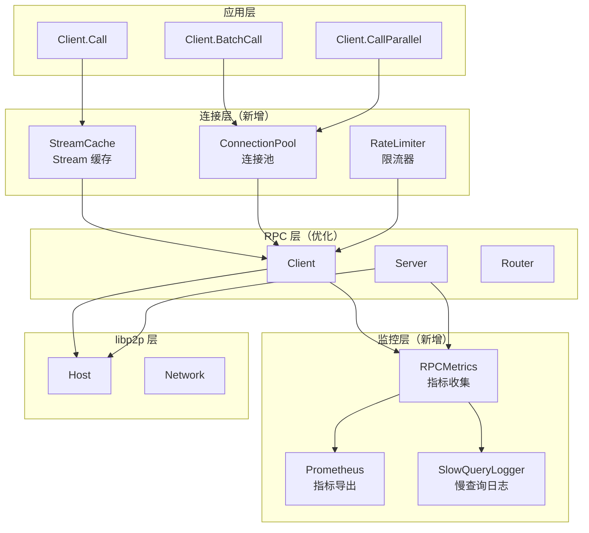
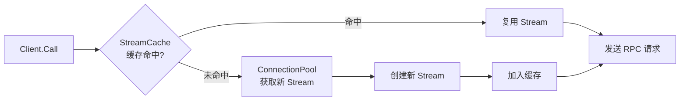

# 【PR全流程文档】Feature - RPC 性能优化与生产就绪

> **文档说明**：本文档为 Pre 文档（前置规划），记录需求、设计和风险评估，在开工前完成，需架构师评审通过后才能启动开发。

---

## 第一部分：前置部分（开工前必完成，架构师评审通过）

### 1. 基础信息（与分支/PR绑定）

| 项目 | 内容 |
|------|------|
| 工作类型 | 性能优化（Optimization） |
| PR编号 | PR-libp2p-003 + 009（整合） |
| 分支名称 | feature/libp2p-rpc-performance-optimization |
| 工作主题 | RPC 性能优化与生产就绪 - 连接池、监控、批量调用、安全加固 |
| 负责人 | 🤖 核心开发工程师 A（存储/一致性） |
| 分支创建日期 | 2026-02-07 |
| 计划开工日期 | 2026-02-07 |
| 计划CI通过日期 | 2026-02-18 |
| 关联需求单号 | [需求单：RPC 性能优化] |
| 架构师评审状态 | □ 待评审 □ 评审中 □ 评审通过 □ 需优化（循环记录） |
| 预审批结果 | □ 未通过 □ 已通过（架构师签字/备注：____________） |

### 2. 背景与目标（为什么干）

#### 2.1 背景

**业务场景**：
NexKV 已完成基于 libp2p 的 RPC 基础框架（PR-libp2p-002），需要优化性能以满足生产环境要求：
- 当前每次 RPC 调用都创建新 Stream，无连接复用
- 缺少性能监控指标，无法定位性能瓶颈
- 缺少批量调用支持，高并发场景效率低
- 缺少安全加固机制（限流、认证）

**现有问题**：
1. **连接管理低效**：每次 `Call()` 创建新 Stream，延迟高（~5ms）
2. **无性能监控**：缺少 Prometheus 指标，问题排查困难
3. **无批量支持**：无法并行调用多个 RPC
4. **无安全保护**：缺少限流、认证机制

**价值**：
- **提升性能**：连接复用降低延迟，批量调用提升吞吐量
- **提高可观测性**：监控指标支持故障排查和性能调优
- **生产就绪**：安全加固保障生产部署

#### 2.2 核心目标（可量化、可验证）

1. **性能目标**：
   - RPC 吞吐量：从 3171 calls/sec 提升至 **5000+ calls/sec**
   - P99 延迟：< 10ms（本地测试）
   - Stream 复用率：> 90%
   - 内存占用：< 200MB（1000 连接）

2. **功能目标**：
   - 实现 Stream 缓存和连接池
   - 集成 Prometheus 监控指标
   - 支持批量 RPC 调用
   - 实现连接限流保护

3. **质量目标**：
   - 测试覆盖率 ≥ 80%
   - Race detector 通过
   - 无内存泄漏

#### 2.3 明确边界（不做什么，避免范围蔓延）

- **本次不支持**：
  - 不实现新的 RPC 协议（保持 MessagePack）
  - 不重构 Cluster 层（范围外）
  - 不实现分布式追踪（后续 PR）

- **本次不优化**：
  - 不优化 Gossip 协议（Cluster 层）
  - 不实现压缩算法（后续 PR）

### 3. 实现方案（怎么干，核心设计）

#### 3.1 整体架构



#### 3.2 连接池设计



**核心数据结构**：
```go
// StreamCache Stream 缓存（按 peer ID 分组）
type StreamCache struct {
    caches map[peer.ID]*streamEntry
    mu     sync.RWMutex
    ttl    time.Duration  // Stream 最大存活时间
    metrics *CacheMetrics
}

// streamEntry 单个 Stream 缓存条目
type streamEntry struct {
    stream      network.MuxedStream
    createdAt   time.Time
    lastUsedAt  time.Time
    messageCount uint64  // 已处理消息数
}

// ConnectionPool 连接池
type ConnectionPool struct {
    host        host.Host
    cache       *StreamCache
    maxStreams  int           // 每个 peer 最大 Stream 数
    maxMessages uint64        // 单 Stream 最大消息数
    metrics     *PoolMetrics
}
```

#### 3.3 监控指标设计

**Prometheus 指标**：
```go
type RPCMetrics struct {
    // 连接指标
    StreamsActive     prometheus.Gauge
    StreamsCreated    prometheus.Counter
    StreamsReused     prometheus.Counter
    StreamsExpired    prometheus.Counter

    // 性能指标
    CallLatency       prometheus.Histogram  // P50, P95, P99
    CallThroughput    prometheus.Counter
    CallActive        prometheus.Gauge

    // 错误指标
    CallErrors        prometheus.Counter
    CallTimeouts      prometheus.Counter
    StreamErrors      *prometheus.CounterVec

    // 批量操作指标
    BatchCalls        prometheus.Counter
    BatchSize         prometheus.Histogram
}
```

**监控仪表盘**：
- **实时性能**：QPS、延迟（P50/P95/P99）
- **连接状态**：活跃 Stream、缓存命中率
- **错误率**：调用错误、超时、Stream 错误

#### 3.4 批量调用设计

```go
// BatchRequest 批量请求
type BatchRequest struct {
    Method string
    Bodies [][]byte
}

// BatchResponse 批量响应
type BatchResponse struct {
    Responses [][]byte
    Errors    []error
}

// CallParallel 并行调用多个 RPC
func (c *Client) CallParallel(
    ctx context.Context,
    peerID peer.ID,
    reqs []BatchRequest,
) []BatchResponse
```

#### 3.5 连接限流设计

```go
// RateLimiter 速率限制器
type RateLimiter struct {
    maxConns int           // 最大并发连接数
    maxCalls int           // 每 peer 最大调用速率
    window   time.Duration // 时间窗口
    counters map[peer.ID]*callCounter
    mu       sync.RWMutex
}

// Acquire 获取调用许可
func (r *RateLimiter) Acquire(peerID peer.ID) error
```

#### 3.6 TDD 测试策略

##### 3.6.1 性能测试重点

**测试文件**：`internal/rpc/performance_test.go`

```go
// BenchmarkRPC_Call 基准测试：单次 RPC 调用
func BenchmarkRPC_Call(b *testing.B) {
    // 测试无连接池 vs 有连接池的性能差异
}

// BenchmarkRPC_BatchCall 基准测试：批量调用
func BenchmarkRPC_BatchCall(b *testing.B) {
    // 测试批量调用性能
}

// BenchmarkRPC_ParallelCalls 基准测试：并发调用
func BenchmarkRPC_ParallelCalls(b *testing.B) {
    // 测试并发场景性能
}

// TestRPC_StreamReuse 测试 Stream 复用
func TestRPC_StreamReuse(t *testing.T) {
    // 验证 Stream 缓存命中率 > 80%
}

// TestRPC_ConnectionPool 测试连接池
func TestRPC_ConnectionPool(t *testing.T) {
    // 验证连接池正确性
}
```

##### 3.6.2 监控测试

```go
// TestRPCMetricsCollection 测试指标收集
func TestRPCMetricsCollection(t *testing.T) {
    // 验证指标被正确收集
}

// TestRPCPrometheusExport 测试 Prometheus 导出
func TestRPCPrometheusExport(t *testing.T) {
    // 验证 Prometheus 格式正确
}
```

##### 3.6.3 限流测试

```go
// TestRPCRateLimiter 测试限流
func TestRPCRateLimiter(t *testing.T) {
    // 验证限流生效
}
```

##### 3.6.4 TDD 实施清单

**阶段 1: 连接池**：
- [ ] RED: 编写 Stream 缓存测试
- [ ] GREEN: 实现 Stream 缓存
- [ ] REFACTOR: 优化缓存策略

**阶段 2: 监控**：
- [ ] RED: 编写指标收集测试
- [ ] GREEN: 实现监控逻辑
- [ ] REFACTOR: 优化监控开销

**阶段 3: 批量调用**：
- [ ] RED: 编写批量调用测试
- [ ] GREEN: 实现批量逻辑
- [ ] REFACTOR: 优化并发策略

### 4. 风险评估与应对措施

| 风险点 | 影响等级 | 应对措施 |
|--------|----------|----------|
| 连接池 bug 导致资源泄漏 | 高 | 1. 严格测试<br/>2. 资源限制<br/>3. 监控告警 |
| 性能优化效果不明显 | 中 | 1. 基准测试对比<br/>2. 分阶段验证<br/>3. 回滚机制 |
| 监控 overhead 影响性能 | 中 | 1. 采样率控制<br/>2. 异步上报<br/>3. 指标聚合 |
| 限流误杀正常请求 | 低 | 1. 配置验证<br/>2. 动态调整<br/>3. 监控限流效果 |

### 5. 架构师评审记录（循环优化，直至通过）

| 评审轮次 | 评审日期 | 评审人（架构师） | 核心评审意见 | 优化措施（含AI辅助修改） | 优化结果 |
|----------|----------|------------------|--------------|--------------------------|----------|
| 第1轮 | [待定] | [待定] | [待评审] | [待定] | [待定] |

### 6. 预审批确认
> **架构师签字/备注**：____________ 202X-XX-XX 该Feature方案可行，风险可控，同意启动开发，需严格按照文档落地，确保CI通过后提交Post总结。

---

## 第二部分：流程节点记录（开发/CI过程追溯）

### 1. 开发过程记录

| 节点 | 完成日期 | 具体内容 | 交付物 |
|------|----------|----------|--------|
| 启动开发 | [待定] | [待开发] | [代码提交至分支] |
| 本地测试 | [待定] | [待测试] | [测试报告/覆盖率数据] |
| Post文档编写 | [待定] | [编写后置总结文档] | [第三部分：后置部分] |
| 架构师Post批准 | [待定] | [架构师评审Post文档] | [批准签字/备注] |
| 提交GitHub | [待定] | [推送分支，创建PR] | [GitHub PR链接] |

### 2. CI流程记录（修复Bug直至通过）

| CI轮次 | 触发时间 | 结果 | 问题详情 | 修复措施 | 修复结果 |
|--------|----------|------|----------|----------|----------|
| 第1轮 | [待定] | [待定] | [待定] | [待定] | [待定] |

### 3. 合并记录

| 合并时间 | 合并方式 | 审批人 | 备注 |
|----------|----------|--------|------|
| [待定] | [待定] | [待定] | [待定] |

---

## 第三部分：后置部分（CI通过后编写，总结/成果/ToDo）

> **说明**：CI 通过后填写本部分内容

### 1. 核心成果总结（开发了啥，结果怎样）

#### 1.1 功能成果
- **已完成**：
  - [ ] Stream 缓存实现
  - [ ] 连接池实现
  - [ ] Prometheus 监控集成
  - [ ] 批量 RPC 调用支持
  - [ ] 连接限流保护
  - [ ] 慢查询日志
  - [ ] 性能基准测试
  - [ ] 单元测试（覆盖率 ≥ 80%）

- **与Pre文档差异**：[待开发后填写]

#### 1.2 性能/数据成果
- **性能数据**：
  - RPC 吞吐量：____ calls/sec（目标 > 5000）
  - P99 延迟：____ ms（目标 < 10）
  - Stream 复用率：____ %（目标 > 90）
  - 内存占用：____ MB（目标 < 200）

- **测试成果**：
  - 压力测试通过：[待定]
  - 监控指标验证：[待定]
  - 内存泄漏测试：[待定]

#### 1.3 代码/文档交付物

| 类型 | 具体内容 | 链接/路径 |
|------|----------|-----------|
| 代码变更 | 连接池、监控、批量调用 | [GitHub PR链接] |
| 文档更新 | 性能调优指南、监控文档 | [文档路径] |

### 2. 未完成项与ToDo清单（有哪些没干，后续规划）

#### 2.1 本次PR未完成项
- **未支持**：
  - 分布式追踪（后续 PR）
  - 高级压缩算法（后续 PR）

- **遗留问题**：
  - [待开发后填写]

#### 2.2 ToDo清单（优先级排序）

| 优先级 | 任务内容 | 预估工期 | 关联PR/需求 | 备注 |
|--------|----------|----------|-------------|------|
| 中 | RPC 认证和加密 | 3天 | PR-libp2p-004 | TLS 认证 |
| 低 | 分布式追踪 | 2天 | 待规划 | OpenTelemetry |
| 低 | 高级压缩算法 | 3天 | 待规划 | 带宽优化 |

### 3. 下一步工作建议（建议干啥）

1. **优先推进**：
   - 监控指标在生产环境的验证
   - 性能调优参数优化

2. **监控要点**：
   - Stream 缓存命中率
   - 批量调用使用率
   - 限流触发频率
   - 慢查询 Top N

3. **运维补充**：
   - 编写监控告警规则
   - 编写性能调优手册
   - 编写故障排查手册

4. **后续规划**：
   - 基于监控数据持续优化
   - 考虑引入认证机制（PR-libp2p-004）

5. **反馈收集**：
   - 收集生产环境性能数据
   - 关注用户反馈的问题

---

## 附录：代码示例

### A.1 Stream 缓存实现

```go
package rpc

import (
    "context"
    "sync"
    "time"

    "github.com/libp2p/go-libp2p/core/host"
    "github.com/libp2p/go-libp2p/core/network"
    "github.com/libp2p/go-libp2p/core/peer"
)

// StreamCache Stream 缓存
type StreamCache struct {
    caches map[peer.ID]*streamEntry
    mu     sync.RWMutex
    ttl    time.Duration
    maxMessages uint64
    metrics *CacheMetrics
}

// streamEntry 单个 Stream 缓存条目
type streamEntry struct {
    stream      network.MuxedStream
    createdAt   time.Time
    lastUsedAt  time.Time
    messageCount uint64
}

// NewStreamCache 创建 Stream 缓存
func NewStreamCache(ttl time.Duration, maxMessages uint64) *StreamCache {
    return &StreamCache{
        caches:     make(map[peer.ID]*streamEntry),
        ttl:        ttl,
        maxMessages: maxMessages,
        metrics:    NewCacheMetrics(),
    }
}

// Get 获取或创建 Stream
func (c *StreamCache) Get(ctx context.Context, h host.Host, pid peer.ID) (network.MuxedStream, error) {
    c.mu.Lock()
    defer c.mu.Unlock()

    // 检查缓存
    if entry, ok := c.caches[pid]; ok && c.isValid(entry) {
        entry.lastUsedAt = time.Now()
        entry.messageCount++
        c.metrics.Hit.Inc()
        return entry.stream, nil
    }

    // 创建新 Stream
    stream, err := h.NewStream(ctx, pid, transport.ProtocolNexKVRPC)
    if err != nil {
        c.metrics.Miss.Inc()
        return nil, err
    }

    c.caches[pid] = &streamEntry{
        stream:      stream,
        createdAt:   time.Now(),
        lastUsedAt:  time.Now(),
        messageCount: 1,
    }
    c.metrics.Created.Inc()
    return stream, nil
}

// isValid 检查 Stream 是否有效
func (c *StreamCache) isValid(entry *streamEntry) bool {
    // 检查存活时间
    if time.Since(entry.createdAt) > c.ttl {
        return false
    }
    // 检查消息数
    if entry.messageCount >= c.maxMessages {
        return false
    }
    return true
}

// Cleanup 清理过期 Stream
func (c *StreamCache) Cleanup() {
    c.mu.Lock()
    defer c.mu.Unlock()

    for pid, entry := range c.caches {
        if !c.isValid(entry) {
            entry.stream.Close()
            delete(c.caches, pid)
            c.metrics.Expired.Inc()
        }
    }
}
```

### A.2 连接池实现

```go
package rpc

import (
    "context"
    "sync"

    "github.com/libp2p/go-libp2p/core/host"
    "github.com/libp2p/go-libp2p/core/network"
    "github.com/libp2p/go-libp2p/core/peer"
)

// ConnectionPool 连接池
type ConnectionPool struct {
    host        host.Host
    cache       *StreamCache
    maxStreams  int
    metrics     *PoolMetrics
    mu          sync.RWMutex
}

// NewConnectionPool 创建连接池
func NewConnectionPool(h host.Host, maxStreams int) *ConnectionPool {
    return &ConnectionPool{
        host:       h,
        cache:      NewStreamCache(5*time.Minute, 1000),
        maxStreams: maxStreams,
        metrics:    NewPoolMetrics(),
    }
}

// GetStream 获取 Stream（优先从缓存）
func (p *ConnectionPool) GetStream(ctx context.Context, pid peer.ID) (network.MuxedStream, error) {
    // 尝试从缓存获取
    stream, err := p.cache.Get(ctx, p.host, pid)
    if err == nil {
        p.metrics.CacheHit.Inc()
        return stream, nil
    }

    // 创建新 Stream
    p.metrics.CacheMiss.Inc()
    stream, err = p.host.NewStream(ctx, pid, transport.ProtocolNexKVRPC)
    if err != nil {
        return nil, err
    }

    p.metrics.Active.Inc()
    return stream, nil
}

// ReturnStream 返回 Stream 到缓存
func (p *ConnectionPool) ReturnStream(stream network.Stream) {
    p.cache.Put(stream)
}

// Cleanup 定期清理
func (p *ConnectionPool) Cleanup() {
    p.cache.Cleanup()
}
```

### A.3 监控指标

```go
package rpc

import (
    "github.com/prometheus/client_golang/prometheus"
    "github.com/prometheus/client_golang/prometheus/promauto"
)

// RPCMetrics RPC 指标
type RPCMetrics struct {
    // 连接指标
    StreamsActive    prometheus.Gauge
    StreamsCreated   prometheus.Counter
    StreamsReused    prometheus.Counter
    StreamsExpired   prometheus.Counter

    // 性能指标
    CallLatency      prometheus.Histogram
    CallThroughput   prometheus.Counter
    CallActive       prometheus.Gauge

    // 错误指标
    CallErrors       prometheus.Counter
    CallTimeouts     prometheus.Counter
    StreamErrors     *prometheus.CounterVec

    // 批量操作指标
    BatchCalls       prometheus.Counter
    BatchSize        prometheus.Histogram
}

// NewRPCMetrics 创建 RPC 指标
func NewRPCMetrics() *RPCMetrics {
    return &RPCMetrics{
        StreamsActive: promauto.NewGauge(prometheus.GaugeOpts{
            Name: "nexkv_rpc_streams_active",
            Help: "Active streams count",
        }),
        StreamsCreated: promauto.NewCounter(prometheus.CounterOpts{
            Name: "nexkv_rpc_streams_created_total",
            Help: "Total streams created",
        }),
        StreamsReused: promauto.NewCounter(prometheus.CounterOpts{
            Name: "nexkv_rpc_streams_reused_total",
            Help: "Total streams reused",
        }),
        StreamsExpired: promauto.NewCounter(prometheus.CounterOpts{
            Name: "nexkv_rpc_streams_expired_total",
            Help: "Total streams expired",
        }),
        CallLatency: promauto.NewHistogram(prometheus.HistogramOpts{
            Name:    "nexkv_rpc_call_latency_ms",
            Help:    "RPC call latency in milliseconds",
            Buckets: []float64{1, 5, 10, 25, 50, 100, 250, 500, 1000},
        }),
        CallThroughput: promauto.NewCounter(prometheus.CounterOpts{
            Name: "nexkv_rpc_calls_total",
            Help: "Total RPC calls",
        }),
        CallActive: promauto.NewGauge(prometheus.GaugeOpts{
            Name: "nexkv_rpc_calls_active",
            Help: "Active RPC calls",
        }),
        CallErrors: promauto.NewCounter(prometheus.CounterOpts{
            Name: "nexkv_rpc_errors_total",
            Help: "Total RPC errors",
        }),
        CallTimeouts: promauto.NewCounter(prometheus.CounterOpts{
            Name: "nexkv_rpc_timeouts_total",
            Help: "Total RPC timeouts",
        }),
        StreamErrors: promauto.NewCounterVec(prometheus.CounterOpts{
            Name: "nexkv_rpc_stream_errors_total",
            Help: "Stream errors by type",
        }, []string{"type"}),
        BatchCalls: promauto.NewCounter(prometheus.CounterOpts{
            Name: "nexkv_rpc_batch_calls_total",
            Help: "Total batch RPC calls",
        }),
        BatchSize: promauto.NewHistogram(prometheus.HistogramOpts{
            Name:    "nexkv_rpc_batch_size",
            Help:    "Batch RPC call size",
            Buckets: []float64{1, 2, 5, 10, 20, 50, 100},
        }),
    }
}
```

---

## 文档归档信息

| 项目 | 内容 |
|------|------|
| 文档最终版本 | V1.0 |
| 归档日期 | [待定] |
| 归档路径 | `docs/06_project_management/pr_documents/feature/2026-02-07_PR-libp2p-003-009_RPC-Performance-Optimization_Pre.md` |
| 后续维护人 | [待定] |
