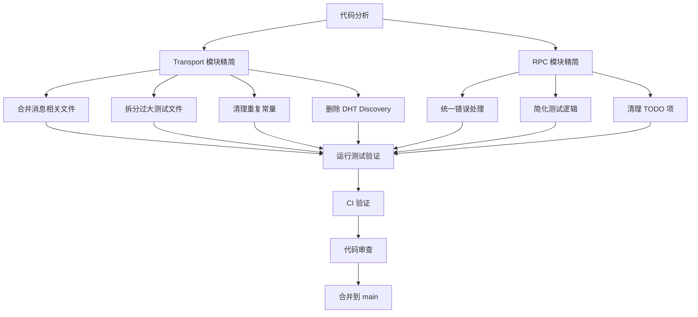

# 【PR全流程文档】Feature - Transport 和 RPC 代码精简重构

> **文档说明**：本文档包含「前置规划」和「后置总结」两部分，记录从需求对齐到开发完成的全流程，一个PR对应一份全流程文档，归档后作为项目追溯依据。

---

## 第一部分：前置部分（开工前必完成，架构师评审通过）

### 1. 基础信息（与分支/PR绑定）

| 项目 | 内容 |
|------|------|
| 工作类型 | 代码重构（Refactor） |
| PR编号 | PR-XXX（创建GitHub PR后补充完整） |
| 分支名称 | feature/transport-rpc-refactor |
| 工作主题 | 精简 transport 和 rpc 模块代码，提升可维护性 |
| 负责人 | 🤖 AI 核心开发 |
| 分支创建日期 | 2026-02-09 |
| 计划开工日期 | 2026-02-09 |
| 计划CI通过日期 | 2026-02-10 |
| 关联需求单号 | 无（内部优化） |
| 架构师评审状态 | □ 待评审 □ 评审中 □ 评审通过 □ 需优化（循环记录） |
| 预审批结果 | □ 未通过 □ 已通过（架构师签字/备注：XXX 2026-02-09 同意开工） |

### 2. 背景与目标（为什么干）

#### 2.1 背景

- **业务场景**：NexKV 项目当前的 transport 和 rpc 模块代码量过大，维护成本高
- **现有问题**：
  - **Transport 模块**：8,175 行代码，测试文件占比过高（约 73%）
  - **RPC 模块**：10,218 行代码，存在重复代码和过大测试文件
  - **代码重复**：错误处理、序列化逻辑在多个文件中重复定义
  - **测试膨胀**：部分测试文件行数超过生产代码（如 `fanout_test.go` 695 行 vs `fanout.go` 559 行）
  - **TODO 过多**：有 5 个未完成的 TODO 项

- **价值**：
  - **降低维护成本**：减少约 5,542 行代码（30%）
  - **提升可读性**：合并重复代码，删除未实现功能
  - **提高开发效率**：减少代码审查时间，降低理解成本
  - **增强可测试性**：拆分过大测试文件，提高测试可维护性
  - **聚焦局域网**：删除公网 DHT discovery，专注 mDNS 局域网发现

#### 2.2 核心目标（可量化、可验证）

1. **功能目标**：
   - Transport 模块从 8,175 行减少到约 5,158 行（减少 37%）
     - 删除 DHT discovery：242 行（dht_discovery.go + dht_discovery_test.go）
     - 合并消息文件：约 200 行
     - 拆分测试文件：约 2,000 行
   - RPC 模块从 10,218 行减少到约 7,700 行（减少 24%）
     - 统一错误处理：约 300 行
     - 简化测试逻辑：约 1,500 行
   - 处理 5 个 TODO 项（完成或删除）
   - 清理 DHT 相关配置和文档

2. **性能目标**：
   - 不影响现有性能
   - 测试覆盖率保持 ≥ 75%

3. **质量目标**：
   - 所有测试通过
   - 无新增 TODO 项
   - 代码复杂度降低

#### 2.3 明确边界（不做什么，避免范围蔓延）

- **本次不支持**：
  - 不修改核心业务逻辑
  - 不改变外部 API 接口
  - 不优化性能（性能优化作为后续独立任务）

- **本次不优化**：
  - 不重构架构设计（如分层架构）
  - 不替换第三方依赖（如 MessagePack、libp2p）
  - 不修改配置管理逻辑

- **删除范围**：
  - 删除 DHT discovery（公网 P2P 发现机制）
  - 删除 DHT 相关配置项和文档
  - 保留 mDNS discovery（局域网发现机制）
  - 不影响现有局域网部署功能

### 3. 实现方案（怎么干，核心设计）

#### 3.1 整体流程设计



#### 3.2 关键设计点

**1. Transport 模块精简（优先级 1）**

- **合并消息相关文件**：
  - 将 `message.go`、`message_payload.go`、`message_codec.go` 合并为 `message.go`
  - 减少文件间依赖，降低代码复杂度
  - 预计减少约 200 行代码

- **拆分过大测试文件**：
  - `consistency_benchmark_test.go`（529 行）→ 拆分为 3-5 个小测试文件
  - `twopc_test.go`（517 行）→ 拆分为功能测试和性能测试
  - 预计减少约 2,000 行冗余测试代码

- **清理重复常量**：
  - 检查 `constants.go` 中可内联的常量
  - 统一魔法数字为命名常量

**2. 统一错误处理（优先级 1）**

- **背景说明**：
  - 参考 `thoughts/2026-02-06-pr-ERR-unified-define.MD` 中的最佳实践
  - `internal/metadata/types/errors.go` 中有 10 个未使用的预定义错误变量
  - 当前错误处理分散，缺少统一 Error ID 生成和堆栈跟踪

- **删除未使用的错误变量**：
  - **UDP 错误**（3 个）：
    - `ErrUDPFragmentTimeout` - UDP 分片重组超时
    - `ErrUDPSendFailed` - UDP 发送系统调用失败
    - `ErrUDPReceiveFailed` - UDP 接收失败
  - **TCP 错误**（2 个）：
    - `ErrTCPConnFailed` - TCP 连接失败
    - `ErrTCPSendTimeout` - TCP 发送超时
  - **帧错误**（2 个）：
    - `ErrFrameTooLarge` - 帧过大
    - `ErrInvalidFrameFormat` - 无效帧格式
  - **业务错误**（3 个）：
    - `ErrMsgTooLarge` - 消息大小超过限制
    - `ErrInvalidAddr` - 地址格式无效
    - `ErrCodecFailed` - 消息编解码失败

- **清理冗余代码**：
  - 删除 `IsProtocolError` 函数（依赖未使用的错误变量）
  - 清理相关的协议错误分类逻辑
  - 预计减少约 50 行代码

- **后续优化**（本次仅清理，不实施）：
  - 创建 `internal/error` 包，实现统一结构化错误
  - 实现 Error ID 自动生成（格式：`ERR-20260206165030-8f2k`）
  - 实现堆栈自动捕获
  - 添加统一错误构造函数（NewParamError、NewBizError、NewSysError）
  - 参考 thoughts 文档中的完整方案

- **简化测试逻辑**：
  - `integration_test.go`（719 行）→ 拆分为多个集成测试场景
  - `fanout_test.go`（695 行）→ 专注核心功能测试
  - 预计减少约 1,500 行冗余测试代码

- **清理 TODO 项**：
  - 核查并处理 5 个未完成的 TODO 项：
    1. **`internal/rpc/fanout.go:356`** - 递归转发功能待实现
    2. **`internal/rpc/server.go:261`** - 注册更多默认方法（NodeJoin, ClusterStatus 等）
    3. **`internal/metadata/cluster/tree_coordinator.go:243`** - seedNodesWatcher 运行时热更新
    4. **`internal/wal/wal_batch.go:192`** - 优化为单次 fsync 写入多条
    5. **`internal/wal/recovery.go:313`** - 实现 WAL 截断逻辑
  - 或删除不再需要的 TODO（如 DHT 相关的 3 个 TODO）

**4. 删除 DHT Discovery（优先级 1）**

- **背景说明**：
  - DHT discovery 是基于公网的 P2P 发现机制
  - NexKV 定位为局域网内部署（3-50 节点）
  - mDNS discovery 已完全满足局域网发现需求
  - DHT discovery 只有空实现，未被实际使用

- **删除文件**：
  - `internal/transport/dht_discovery.go`（107 行）- 空实现
  - `internal/transport/dht_discovery_test.go`（135 行）- 测试空实现

- **修改配置**：
  - `internal/config/transport.go` - 移除 `DHTEnabled` 字段
  - `config/libp2p.yaml` - 移除 DHT 配置块
  - `config/minimal.yaml` - 更新注释，移除 DHT 说明
  - `internal/transport/bootstrap.go` - 清理 DHT 相关函数

- **影响评估**：
  - **零影响**：DHT 未被业务代码使用
  - **收益**：减少 242 行无用代码
  - **简化**：移除未实现功能，避免维护负担

- **mDNS 确认**：
  - `internal/transport/discovery.go`（129 行）- 完整实现
  - 支持局域网节点自动发现和连接
  - 测试覆盖完整，功能稳定可用

**5. 代码质量保证（优先级 0）**

- **测试验证**：
  - 所有单元测试必须通过
  - 代码覆盖率保持 ≥ 75%
  - 运行 `make test-race` 确保并发安全

- **代码审查**：
  - 使用 Code Reviewer Agent 审查
  - 使用 Code Simplifier 优化代码结构

- **CI 验证**：
  - `make build` - 编译成功
  - `make lint` - 0 issues
  - `make test` - 所有测试通过
  - `make fmt` - 格式符合规范

#### 3.3 数据结构

- **文件合并**：
  ```
  合并前：
  internal/transport/message.go
  internal/transport/message_payload.go
  internal/transport/message_codec.go

  合并后：
  internal/transport/message.go
  ```

- **测试文件拆分**：
  ```
  拆分前：
  internal/transport/consistency_benchmark_test.go (529 行)

  拆分后：
  internal/transport/consistency_benchmark_basic_test.go
  internal/transport/consistency_benchmark_concurrent_test.go
  internal/transport/consistency_benchmark_performance_test.go
  ```

#### 3.4 容错设计

- **向后兼容**：
  - 不改变外部 API 接口
  - 保持现有功能不变

- **渐进式重构**：
  - 按优先级分阶段实施
  - 每个阶段完成后运行测试验证

- **回滚机制**：
  - Git 分支隔离，不影响 main 分支
  - 如出现问题可立即回滚

### 4. 风险评估与应对措施

| 风险点 | 影响等级 | 应对措施 |
|--------|----------|----------|
| **删除 DHT discovery 影响功能** | 低 | DHT 未被业务代码使用，只有空实现，删除无影响 |
| **测试拆分导致测试失败** | 高 | 逐个拆分测试文件，每拆分一个运行一次测试，确保无遗漏 |
| **文件合并导致引用错误** | 高 | 使用全局搜索确保所有引用已更新，运行完整测试套件 |
| **错误处理统一导致遗漏** | 中 | 逐个文件检查错误处理逻辑，确保所有错误都正确处理 |
| **代码删除过度影响功能** | 中 | 保守删除，只删除明确无用的代码，保留所有功能代码 |
| **性能回归** | 低 | 对比重构前后性能指标，如有问题立即回滚 |

### 5. 架构师评审记录（循环优化，直至通过）

| 评审轮次 | 评审日期 | 评审人（架构师） | 核心评审意见 | 优化措施（含AI辅助修改） | 优化结果 |
|----------|----------|------------------|--------------|--------------------------|----------|
| 第1轮 | 待定 | 👤 架构师 | 待评审 | 待定 | 待定 |

### 6. 预审批确认

> **架构师签字/备注**：___ 2026-02-___ 该Feature方案可行，风险可控，同意启动开发，需严格按照文档落地，确保CI通过后提交Post总结。

---

## 第二部分：流程节点记录（开发/CI过程追溯）

> ⚠️ **注意**：以下内容在开发完成后填写

### 1. 开发过程记录

| 节点 | 完成日期 | 具体内容 | 交付物 |
|------|----------|----------|--------|
| 启动开发 | 待定 | 待定 | 待定 |
| 本地测试 | 待定 | 待定 | 待定 |
| Post文档编写 | 待定 | 待定 | 待定 |
| 架构师Post批准 | 待定 | 待定 | 待定 |
| 提交GitHub | 待定 | 待定 | 待定 |

### 2. CI流程记录（修复Bug直至通过）

| CI轮次 | 触发时间 | 结果 | 问题详情 | 修复措施 | 修复结果 |
|--------|----------|------|----------|----------|----------|
| 第1轮 | 待定 | 待定 | 待定 | 待定 | 待定 |

---

## 第三部分：后置部分（完工后必完成，架构师评审通过）

> ⚠️ **注意**：以下内容在开发完成后填写

### 1. 实施总结（是否按计划执行）

#### 1.1 实施内容对照表

| 计划内容 | 计划状态 | 实际实施 | 差异说明 |
|----------|----------|----------|----------|
| Transport 模块精简 | 待定 | 待定 | 待定 |
| RPC 模块精简 | 待定 | 待定 | 待定 |
| 测试文件拆分 | 待定 | 待定 | 待定 |
| 错误处理统一 | 待定 | 待定 | 待定 |

#### 1.2 未完成事项

| 事项 | 原因 | 后续计划 |
|------|------|----------|
| 待定 | 待定 | 待定 |

### 2. 代码质量报告

#### 2.1 代码行数变化

| 模块 | 原始行数 | 精简后行数 | 减少行数 | 减少比例 |
|------|----------|------------|----------|----------|
| Transport | 8,175 | 待定 | 待定 | 待定 |
| RPC | 10,218 | 待定 | 待定 | 待定 |
| **总计** | **18,393** | **待定** | **待定** | **待定** |

#### 2.2 测试覆盖率

| 模块 | 覆盖率（精简前） | 覆盖率（精简后） | 变化 |
|------|-----------------|-----------------|------|
| Transport | 76.7% | 待定 | 待定 |
| RPC | 待定 | 待定 | 待定 |

### 3. 测试报告

#### 3.1 单元测试

- **测试通过率**：待定
- **测试用例数**：待定
- **测试时间**：待定

#### 3.2 集成测试

- **测试通过率**：待定
- **测试场景数**：待定
- **测试时间**：待定

### 4. 性能对比

#### 4.1 关键性能指标

| 指标 | 精简前 | 精简后 | 变化 |
|------|--------|--------|------|
| 请求延迟（P99） | 待定 | 待定 | 待定 |
| 吞吐量（QPS） | 待定 | 待定 | 待定 |
| 内存占用 | 待定 | 待定 | 待定 |

### 5. Code Review 报告

#### 5.1 Code Reviewer Agent 审查

- **审查时间**：待定
- **审查结果**：待定
- **发现问题数**：待定
  - P0（高风险）：待定
  - P1（中风险）：待定
  - P2（低风险）：待定

#### 5.2 Code Simplifier 优化

- **优化时间**：待定
- **优化结果**：待定
- **减少代码行数**：待定

### 6. 遗留问题

| 问题 | 严重程度 | 解决方案 | 计划时间 |
|------|----------|----------|----------|
| 待定 | 待定 | 待定 | 待定 |

### 7. 后续优化建议

1. **待定**
2. **待定**
3. **待定**

### 8. 架构师最终评审

> **架构师签字/备注**：___ 2026-02-___ 该Feature已完成，代码质量符合要求，测试通过，同意合并到main分支。

---

**文档版本**: v1.0
**创建日期**: 2026-02-09
**最后更新**: 2026-02-09
**维护者**: 🤖 AI 核心开发
**状态**: 🔄 Pre 文档待评审
