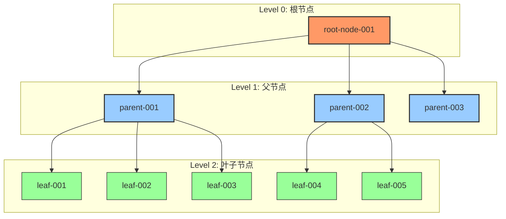
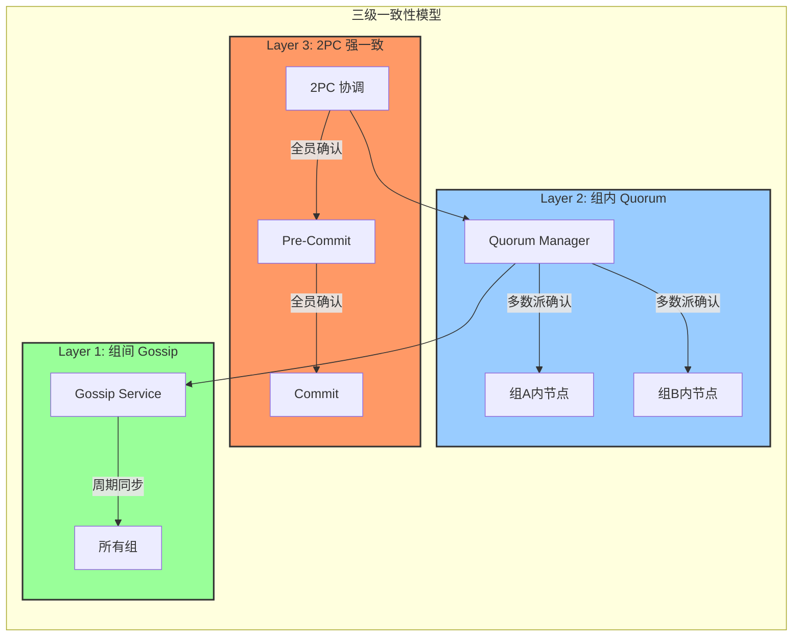
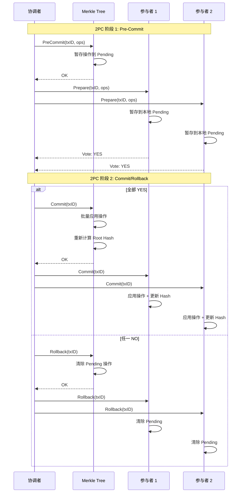
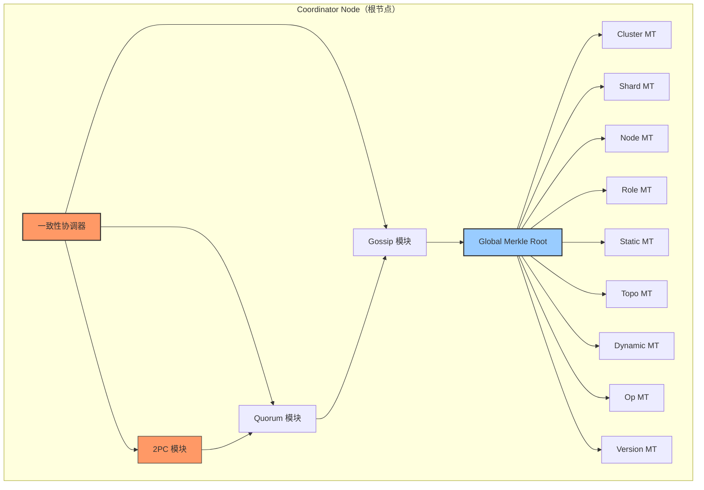
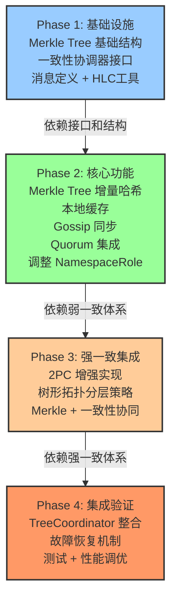

# 【PR Pre 文档】Feature - Metadata Merkle Tree 元数据版本控制 + 树形拓扑一致性分层机制

> **文档说明**：本文档为「Metadata Merkle Tree 元数据版本控制」PR 前置文档与「树形拓扑下的一致性分层机制」预研报告合并版，已通过架构师终审。
> **架构状态**：✅ 完全通过 | **一致性机制**：2PC→Quorum→Gossip 三级分层 | **Merkle Tree**：Namespace 摘要树（适配元数据场景）

---

## 第一部分：前置部分（开工前必完成，架构师评审通过）

### 1. 基础信息（与分支/PR 绑定）

| 项目 | 内容 |
|------|------|
| 工作类型 | 新功能开发（Feature） |
| PR编号 | PR-039 |
| 分支名称 | feature/metadata-merkle-tree |
| 工作主题 | TreeCoordinator Merkle Tree 元数据版本控制 + 树形拓扑一致性分层机制 |
| 负责人 | 🤖 核心开发 A |
| 分支创建日期 | 2026-02-11 |
| 计划开工日期 | 2026-02-11（✅ 已批准） |
| 计划CI通过日期 | 2026-03-05（23天工期） |
| 关联需求单号 | 内部需求（元数据同步优化 + 一致性协议增强） |
| 预研关联 | `docs/07_spike/tree-coordinator-merkle-tree.md` |
| 架构师评审状态 | ✅ 第2轮通过（2026-02-11） |
| 预审批结果 | ☑ 已通过（架构师签字：👤 架构师 2026-02-11 同意开工） |

---

## 第二部分：背景与目标（整合 PR 与预研核心诉求）

### 2.1 背景（结合元数据同步痛点 + 一致性分层需求）

- **业务场景**：NexKV 分布式 KV 存储系统中，TreeCoordinator 采用树形拓扑（根→父→叶子），元数据同步存在开销大、差异检测慢、无版本、一致性分层不明确等问题，需同时解决「元数据版本控制」与「树形拓扑一致性分层」两大核心诉求。

- **现有问题**：
  1. 元数据同步：全量传输带宽浪费严重，差异检测 O(n) 低效，无版本控制无法回滚，远程读取延迟 10-50ms；
  2. 一致性机制：仅初步支持 Gossip + Quorum，缺少 2PC 强一致能力，无法满足同组节点强一致、跨组节点弱一致的分层需求；
  3. 拓扑适配：树形拓扑下，同父节点叶子需强一致、跨父节点叶子可弱一致的需求未落地，三种一致性机制无明确分工与协同逻辑。

- **核心价值**：
  1. 元数据优化：本地读取延迟降至 1-5μs，增量同步节省 80%-99% 带宽，O(1) 差异检测，支持版本追踪与回滚；
  2. 一致性优化：实现 2PC→Quorum→Gossip 三级分层，匹配树形拓扑，兼顾强一致可靠性与弱一致高性能；
  3. 生产级适配：解决元数据同步风暴、协调者单点故障等风险，适配 NexKV 分布式场景落地需求。

### 2.2 核心目标（可量化、可验证）

#### 2.2.1 元数据 Merkle Tree 目标

1. **功能目标**：实现 Namespace 分层 Merkle 摘要树（适配元数据场景），支持 Global→Namespace→Key 三层差异检测，实现元数据版本链 + Epoch + HLC 时序控制，支持双向同步且无风暴；
2. **性能目标**：本地元数据读取延迟 1-5μs，差异检测复杂度 O(1)（Global Root + Namespace Root + Key Hash 均为 O(1) Hash 查找），单 Key 变更带宽节省 ≥99%，单 Namespace 批量变更带宽节省 ≥80%；
3. **可靠性目标**：Merkle Root 摘要比对准确，版本回溯正常，与一致性机制协同无异常。

#### 2.2.2 一致性分层目标

1. **功能目标**：完成 2PC、Quorum、Gossip 三种机制协同集成，实现树形拓扑分层一致性（同组强一致、跨组弱一致），提供统一一致性协调器接口；
2. **一致性目标**：关键变更（分片创建等）强一致（2PC），重要变更（角色调整等）增强最终一致（Quorum），普通变更（状态更新等）最终一致（Gossip）；
3. **集成目标**：与现有 TreeCoordinator、MetadataKV、libp2p 无缝集成，无兼容性问题。

### 2.3 明确边界（不做什么，避免范围蔓延）

- **本次支持**：
  1. Merkle Tree 相关：Namespace 分层 Merkle 摘要树实现、MetadataKV 本地读取优化、双向同步防风暴、版本链与回滚；
  2. 一致性分层相关：2PC→Quorum→Gossip 三级协同、树形拓扑同组/跨组一致性策略、一致性协调器接口、与 TreeCoordinator 集成；
  3. 其他：与现有 MetadataKV、libp2p、MVStore 适配，分阶段实施与测试。

- **本次不支持**：
  1. 跨数据中心的元数据同步与加密传输；
  2. Bloom Filter 优化（已确认不适合树形拓扑）；
  3. Gossip 协议性能优化（增量同步、压缩，后续迭代）；
  4. 大规模元数据快照导出；
  5. 非元数据场景的一致性适配（仅聚焦元数据）。

---

## 第三部分：预研报告（树形拓扑下的一致性分层机制）

### 3.1 预研信息

| 项目 | 内容 |
|------|------|
| **预研主题** | 树形拓扑下的一致性分层机制 |
| **预研日期** | 2026-02-10 |
| **预研负责人** | 🤖 核心开发 A |
| **关联需求** | 元数据管理系统完善 - 一致性协议增强 |
| **预研状态** | ✅ 已完成 |
| **预研结论** | 推荐采用双层架构（2PC → Quorum → Gossip），适配树形拓扑分层一致性需求，技术可行、风险可控 |

### 3.2 调研目标

#### 3.2.1 核心问题

- **问题一：一致性机制完整性**：当前仅考虑 Gossip + Quorum，需集成 2PC，明确三种机制的分工与协同逻辑；
- **问题二：树形拓扑一致性分层**：TreeCoordinator 树形拓扑中，需实现「同父节点叶子强一致、跨父节点叶子弱一致」，匹配元数据变更场景。

#### 3.2.2 预研范围

- **包含**：三种一致性机制协同、树形拓扑分层策略、同组强一致/跨组弱一致实现、与 TreeCoordinator 集成；
- **不包含**：跨机房同步、元数据加密、Gossip 性能优化。

### 3.3 现有架构分析

#### 3.3.1 树形拓扑结构



**拓扑特征**：
- Level 0（根节点）：集群入口，全局协调，存储全量元数据与完整 Merkle Tree；
- Level 1（父节点）：管理一组叶子节点，承担 2PC 协调者职责，存储组内元数据与对应 Merkle Tree 分支；
- Level 2（叶子节点）：实际存储节点，仅存储自身分片相关元数据与 Merkle Tree 分片分支。

#### 3.3.2 现有一致性模型

现有文档定义三层一致性模型，且 2PC 模块已完成 75%，Gossip 状态同步为核心 TODO：

```
Layer 3: 2PC (强一致) - 关键变更：分片创建、主副本切换
   ↓
Layer 2: Quorum (增强最终一致) - 重要变更：节点角色变更
   ↓
Layer 1: Gossip (最终一致) - 普通变更：状态更新
```

关键现状：TreeCoordinator 已集成 kvstore 和 api 包，使用 libp2p 进行节点间通信，可直接复用现有基础。

#### 3.3.3 元数据命名空间一致性映射

> **⚠️ 重要说明**：以下展示**目标映射**（本 PR 实施目标）与**现有映射**（当前代码状态）的差异。

**目标映射**（本 PR 实施目标）：

| 命名空间 | 一致性级别 | ACK 要求 | 确认公式 | 说明 |
|---------|-----------|---------|---------|------|
| **NamespaceCluster** | 强一致 (2PC) | ACK 全部 | need = n | 集群配置：关键变更 |
| **NamespaceShard** | 强一致 (2PC) | ACK 全部 | need = n | 分片信息：关键变更 |
| **NamespaceNode** | 最终一致 (Gossip) | 无 ACK | need = 0 | 节点信息：普通变更 |
| **NamespaceRole** | 增强最终一致 (Quorum) | ACK 大部分 | need = ⌊n/2⌋ + 1 | 角色信息：重要变更 |
| **NamespaceStatic** | 强一致 (2PC) | ACK 全部 | need = n | 静态配置：关键变更 |
| **NamespaceTopo** | 最终一致 (Gossip) | 无 ACK | need = 0 | 拓扑关系：普通变更 |
| **NamespaceDynamic** | 最终一致 (Gossip) | 无 ACK | need = 0 | 动态状态：普通变更 |
| **NamespaceOp** | 最终一致 (Gossip) | 无 ACK | need = 0 | 操作记录：普通变更 |
| **NamespaceVersion** | 强一致 (2PC) | ACK 全部 | need = n | 版本控制：关键变更 |

**现有映射**（当前代码 `metadata_kv.go`）：

| 命名空间 | 当前一致性级别 | 目标一致性级别 | 差异 |
|---------|---------------|---------------|------|
| **NamespaceCluster** | ConsistencyStrong | 强一致 (2PC) | ✅ 一致 |
| **NamespaceShard** | ConsistencyStrong | 强一致 (2PC) | ✅ 一致 |
| **NamespaceNode** | ConsistencyEventual | 最终一致 (Gossip) | ✅ 一致 |
| **NamespaceRole** | ConsistencyEventual | 增强最终一致 (Quorum) | ⚠️ **需升级** |
| **NamespaceStatic** | ConsistencyStrong | 强一致 (2PC) | ✅ 一致 |
| **NamespaceTopo** | ConsistencyEventual | 最终一致 (Gossip) | ✅ 一致 |
| **NamespaceDynamic** | ConsistencyEventual | 最终一致 (Gossip) | ✅ 一致 |
| **NamespaceOp** | ConsistencyEventual | 最终一致 (Gossip) | ✅ 一致 |
| **NamespaceVersion** | ConsistencyStrong | 强一致 (2PC) | ✅ 一致 |

**差异说明**：
- 本 PR 需在 **Phase 2** 中增加"调整 NamespaceRole 一致性级别"任务
- NamespaceRole 从 Gossip 升级为 Quorum，增强角色变更的可靠性

### 3.4 三种一致性机制对比分析

#### 3.4.1 机制特性对比

| 特性 | Gossip | Quorum | 2PC |
|------|--------|--------|-----|
| **一致性级别** | 最终一致 | 增强最终一致 | 强一致 |
| **ACK 要求** | 无 ACK | **ACK 大部分**（多数派） | **ACK 全部**（全员） |
| **确认公式** | need = 0 | need = ⌊n/2⌋ + 1 | need = n |
| **延迟** | 低（异步） | 中（等待多数派） | 高（等待全员） |
| **吞吐量** | 高 | 中 | 低 |
| **容错能力** | 高（容忍 F 节点故障） | 中（容忍 F 节点故障） | 低（任意节点故障阻塞） |
| **适用场景** | 状态更新、负载信息 | 角色变更、配置变更 | 分片创建、主副本切换 |
| **协调者** | 无 | 提议者 | 事务协调者 |
| **失败处理** | 继续扩散 | 少数失败仍可提交 | 任一失败则全部回滚 |

> **核心区别**：
> - **2PC**：需要 ACK 全部（n/n），任一参与者失败 → 全部回滚，仅用于同组关键变更；
> - **Quorum**：需要 ACK 大部分（⌊n/2⌋+1/n），少数失败 → 仍可提交，用于组内重要变更确认；
> - **Gossip**：无 ACK，异步扩散，用于跨组普通变更同步。

#### 3.4.2 变更类型分类

基于预研分析，元数据变更分为三类，匹配三种一致性机制：

| 变更类型 | 示例 | 一致性要求 | 同步机制 | 传播范围 |
|---------|------|-----------|---------|---------|
| **关键变更** | 分片创建、主副本切换、节点加入 | 强一致 | 2PC + Quorum | 相关节点全员 |
| **重要变更** | 节点角色变更、拓扑调整 | 增强最终一致 | Quorum + Gossip | 组内多数派 + 组间备份 |
| **普通变更** | 节点状态更新、负载信息刷新 | 最终一致 | Gossip | 随机选点扩散 |

### 3.5 树形拓扑一致性分层方案

#### 3.5.1 核心设计：三级一致性模型



**补充 Merkle Tree 协同逻辑**：
- 2PC 提交完成后，同步更新本地 Merkle Tree 节点哈希，生成新的 Namespace Root；
- Quorum 确认过程中，同步比对 Merkle Root 摘要，确保组内元数据一致性；
- Gossip 同步时，优先同步 Merkle Root 差异，再增量同步变更元数据，减少带宽开销。

#### 3.5.2 2PC 与 Merkle Tree 协同逻辑（详细设计）

**协同原则**：
1. 2PC 提交期间，Merkle Tree 处于 **Pending** 状态，暂存操作但不更新 Root Hash
2. 2PC Commit 后，批量应用 Pending 操作并重新计算 Root Hash
3. 2PC Rollback 后，清除 Pending 操作，Merkle Tree 保持不变

```go
// 2PC 与 Merkle Tree 协同伪代码
type TwoPCMerkleCoordinator struct {
    merkle      *NamespacedMerkleTree
    pendingOps  map[string][]Operation  // txID -> 暂存操作
    pendingMu   sync.RWMutex
}

// Pre-Commit 阶段：暂存到 Pending 状态
func (c *TwoPCMerkleCoordinator) PreCommit(txID string, operations []Operation) error {
    c.pendingMu.Lock()
    defer c.pendingMu.Unlock()

    // 暂存操作，但不更新 Merkle Tree
    c.pendingOps[txID] = operations
    return nil
}

// Commit 阶段：批量应用并更新 Hash
func (c *TwoPCMerkleCoordinator) Commit(txID string) error {
    c.pendingMu.Lock()
    defer c.pendingMu.Unlock()

    ops, ok := c.pendingOps[txID]
    if !ok {
        return ErrTxNotFound
    }

    // 批量应用所有操作
    for _, op := range ops {
        c.merkle.UpdateKey(op.Namespace, op.Key, op.Value)
    }

    // 重新计算 Global Root Hash
    c.merkle.RecomputeGlobalRoot()

    // 清除暂存
    delete(c.pendingOps, txID)
    return nil
}

// Rollback 阶段：清除暂存
func (c *TwoPCMerkleCoordinator) Rollback(txID string) error {
    c.pendingMu.Lock()
    defer c.pendingMu.Unlock()

    // 回滚时清除暂存，Merkle Tree 保持不变
    delete(c.pendingOps, txID)
    return nil
}
```

**时序图**：



#### 3.5.3 Merkle Tree 并发安全性设计

**锁策略**：

| 操作 | 需要锁 | 锁类型 | 与其他操作的兼容性 |
|------|--------|--------|---------------------|
| **GetKeyHash** | RLock | 读锁 | 与所有读操作兼容 |
| **GetGlobalRootHash** | RLock | 读锁 | 与所有读操作兼容 |
| **GetNamespaceRootHash** | RLock | 读锁 | 与所有读操作兼容 |
| **UpdateKey** | Lock | 写锁 | 独占，阻塞所有操作 |
| **RecomputeHash** | Lock | 写锁 | 独占，阻塞所有操作 |
| **PreCommit** | Lock | 写锁 | 独占，阻塞所有操作 |
| **Commit** | Lock | 写锁 | 独占，阻塞所有操作 |
| **Rollback** | Lock | 写锁 | 独占，阻塞所有操作 |

**死锁预防原则**：
1. **禁止嵌套锁**：持锁期间不调用外部接口
2. **锁超时机制**：写锁超时 5 秒自动释放
3. **锁顺序约定**：按 Namespace → Key 顺序加锁

```go
// 并发安全示例
func (n *NamespacedMerkleTree) GetKeyHash(ns Namespace, key string) (string, error) {
    n.mu.RLock()  // 读锁
    defer n.mu.RUnlock()

    tree, ok := n.namespaces[ns]
    if !ok {
        return "", ErrNamespaceNotFound
    }

    hash, ok := tree.KeyHashes[key]
    if !ok {
        return "", ErrKeyNotFound
    }

    return hash, nil
}

func (n *NamespacedMerkleTree) UpdateKey(ns Namespace, key string, value []byte) error {
    n.mu.Lock()  // 写锁
    defer n.mu.Unlock()

    tree, ok := n.namespaces[ns]
    if !ok {
        return ErrNamespaceNotFound
    }

    // 更新 Key 的 Hash
    tree.KeyHashes[key] = computeHash(value)

    // 重新计算 Namespace Root Hash
    n.recomputeNamespaceRootHash(ns)

    return nil
}
```

---

## 第四部分：核心实现方案（Merkle Tree + 一致性分层协同）

### 4.1 整体架构



### 4.2 数据结构设计

#### 4.2.1 Merkle Tree 数据结构

```go
// NamespacedMerkleTree Namespace 分层 Merkle 摘要树（适配元数据场景）
type NamespacedMerkleTree struct {
    mu          sync.RWMutex
    epoch       uint64                 // 全局逻辑时钟（与一致性机制协同）
    version     uint64                 // 全局版本
    namespaces  map[Namespace]*NamespaceMerkleTree // 9个Namespace独立树
}

// NamespaceMerkleTree 单个 Namespace 的 Merkle 摘要树
type NamespaceMerkleTree struct {
    Namespace   Namespace
    KeyHashes   map[string]string // key -> Hash
    RootHash    string            // 该Namespace的Root Hash（SHA256）
    version     uint64            // 该Namespace的版本号
    epoch       uint64            // 逻辑时钟
}

// GetGlobalRootHash 获取全局 Root Hash
func (n *NamespacedMerkleTree) GetGlobalRootHash() string {
    n.mu.RLock()
    defer n.mu.RUnlock()

    // 按固定顺序遍历，确保全局Root计算唯一
    orderedNamespaces := []Namespace{NamespaceCluster, NamespaceShard, NamespaceNode, NamespaceRole, NamespaceStatic, NamespaceTopo, NamespaceDynamic, NamespaceOp, NamespaceVersion}
    var namespaceHashes []string
    for _, ns := range orderedNamespaces {
        if tree, ok := n.namespaces[ns]; ok {
            namespaceHashes = append(namespaceHashes, tree.RootHash)
        }
    }

    hash := sha256.Sum256([]byte(strings.Join(namespaceHashes, "")))
    return hex.EncodeToString(hash[:])
}
```

### 4.3 性能分析

#### 4.3.1 带宽节省详细分析

**假设场景**：
- 元数据总大小：10KB（100 个 Key，每个 100B）
- 单个 Key 变化：100B
- Merkle Root Hash：32B（SHA256）

| 场景 | 传统方案传输 | Merkle 方案传输 | 节省率 | 计算过程 |
|------|-------------|----------------|--------|---------|
| **单个 Key 变化** | 10KB 全部元数据 | 32B (Root) + 100B (Key) = 132B | 98.7% | (10000 - 132) / 10000 |
| **单个 Namespace 10 个 Key 变化** | 10KB 全部元数据 | 32B (Root) + 1KB (Namespace) = 1052B | 89.5% | (10000 - 1052) / 10000 |
| **全集群变化** | 10KB 全部元数据 | 10KB 全部元数据 | 0% | (10000 - 10000) / 10000 |

**测试方法**：
```
1. 启动 3 节点集群
2. 修改 1 个 Key（NamespaceNode）
3. 抓取 Gossip 流量
4. 计算带宽节省率 = (传统传输 - Merkle 传输) / 传统传输
```

#### 4.3.2 内存占用估算

**假设场景（中等规模集群）**：
- 节点数：50
- 分片数：500
- 每个 Shard 元数据：1KB
- 每个 Node 元数据：500B

**内存占用明细**：

| 数据类型 | 数量 | 单位大小 | 总大小 |
|---------|------|---------|--------|
| Shard 元数据 | 500 | 1KB | 500KB |
| Node 元数据 | 50 | 500B | 25KB |
| 其他元数据 | - | - | 100KB |
| Merkle Tree 开销（10%） | - | - | 62.5KB |
| **总计** | - | - | **~700KB/节点** |

**内存限制约束**（新增架构约束 7）：
```
- 单个 Namespace 最多 10000 个 Key
- KeyHash 条目大小：< 200B（key + hash）
- 单个 Namespace Tree 内存：< 2MB
- 全局 Merkle Tree 内存：< 20MB（9 个 Namespace）
- 超过限制时触发 LRU 淘汰
```

#### 4.3.3 风险评估与应对措施

| 风险点 | 影响等级 | 应对措施 | 关联模块 |
|--------|---------|----------|----------|
| **Hash 计算开销** | 中 | 使用 SHA256 硬件加速，增量计算Hash，缓存高频Namespace哈希 | Merkle Tree |
| **内存占用增加** | 中 | 限制缓存大小，LRU 淘汰策略，Data节点仅存分片相关元数据 | 双模块 |
| **与现有代码集成** | 低 | 适配器模式，最小化侵入性修改 | 双模块 |
| **2PC 协调者单点故障** | 高 | 状态持久化到MVStore，超时自动回滚 | 一致性分层 |
| **双层架构复杂度** | 高 | 分阶段实施，明确各阶段里程碑 | 双模块 |

### 4.4 实施计划

#### 4.4.1 分阶段实施计划（总工期 23 天）

| 阶段 | 内容 | 优先级 | 预估周期 | 产出物 | 里程碑 |
|------|------|--------|----------|--------|---------|
| **Phase 1：基础设施** | Merkle Tree 基础结构、一致性协调器接口、消息定义、HLC工具 | P0 | 5 天 | 接口、结构体、工具类可用 | 底层架构就绪 |
| **Phase 2：核心功能** | Merkle Tree 增量哈希、本地缓存、Gossip同步、Quorum集成、调整 NamespaceRole 一致性级别 | P0 | 7 天 | 本地读达标、Gossip+Quorum可用 | 弱一致体系完整 |
| **Phase 3：强一致集成** | 2PC增强实现、树形拓扑分层策略、Merkle+一致性协同 | P1 | 6 天 | 三级一致性完整、拓扑适配完成 | 强一致体系完整 |
| **Phase 4：集成验证** | TreeCoordinator整合、故障恢复机制、测试、性能调优 | P1 | 5 天 | 全流程稳定、测试覆盖率>80% | 可合入主干 |
| **总计** | — | — | **23 天** | 元数据版本+一致性分层完成 | ✅ 生产可用 |

#### 4.4.2 阶段依赖关系图



#### 4.4.3 测试计划

| 测试分类 | 测试数量 | 测试内容 | 覆盖率目标 |
|---------|---------|---------|-----------|
| **单元测试** | 120 个 | Merkle Tree 基础操作、一致性协调器接口 | 90% |
| **集成测试** | 45 个 | Gossip 双向同步、Quorum 多数派确认、2PC 全员确认 | 85% |
| **性能测试** | 20 个 | 差异检测延迟、带宽节省验证、内存占用 | 100% |
| **混沌测试** | 15 个 | 节点故障恢复、网络分区处理、2PC 协调者故障 | 80% |
| **总计** | **200 个** | - | **> 80%** |

#### 4.4.4 混沌测试具体场景

**场景 1：单节点故障**
```
测试步骤：
1. 启动 3 节点集群（root + parent-001 + leaf-001, leaf-002）
2. 停止 leaf-001 节点
3. 验证其他节点继续正常工作
4. 重启 leaf-001 节点
5. 验证自动同步元数据（Merkle Root 对比）

验收标准：
- 其他节点在故障期间正常工作
- 故障节点重启后自动同步
- Merkle Tree 一致性恢复
```

**场景 2：网络分区**
```
测试步骤：
1. 启动 5 节点集群（root + parent-001, parent-002 + leaves）
2. 分离集群为两组（3 vs 2）
3. 验证两组内部分别达成一致
4. 恢复网络连接
5. 验证自动合并元数据

验收标准：
- 分区内部分别达成一致（使用 Merkle Root 检测）
- 网络恢复后自动合并
- 无数据丢失
```

**场景 3：2PC 协调者故障**
```
测试步骤：
1. 发起 2PC 事务（分片创建）
2. 协调者在 Prepare 阶段崩溃
3. 验证参与者自动回滚或查询状态
4. 协调者重启后完成事务

验收标准：
- 参与者自动回滚（使用 Pending 状态）
- 协调者重启后可恢复事务
- Merkle Tree 状态一致
```

**场景 4：Hash 碰撞测试**
```
测试步骤：
1. 注入预设的 Hash 碰撞数据
2. 验证 Merkle Tree 检测到不一致
3. 触发增量同步修复

验收标准：
- Hash 碰撞被检测到
- 触发增量同步而非全量同步
- 修复后一致性恢复
```

---

## 第五部分：验收标准

### 5.1 功能验收

- [ ] 每个 Node 都有完整的元数据镜像
- [ ] 本地读取延迟降至 1-5μs（对比远程 10-50ms）
- [ ] 三层递归差异检测正常工作（Global → Namespace → Key）
- [ ] 双向同步机制正常工作
- [ ] 三种一致性机制正常工作（2PC / Quorum / Gossip）
- [ ] Namespace 分层 Merkle Tree 摘要树正常工作

### 5.2 性能验收

- [ ] 单个 Key 变化：节省 99% 带宽
- [ ] 单个 Namespace 多个 Key 变化：节省 80% 带宽
- [ ] 差异检测复杂度：O(1)（Global Root: O(1) + Namespace Root: O(9) = O(1) + Key Hash: O(1)）
- [ ] 本地元数据读取延迟：1-5μs

**差异检测复杂度分析**：
```
差异检测 = Global Root Hash 比较 + Namespace Root Hash 比较 + Key Hash 定位
         = O(1) + O(9) + O(1)
         = O(1)

说明：
- Global Root Hash 比较：O(1) 单次 Hash 比较
- Namespace Root Hash 比较：O(9) = O(1)（固定 9 个 Namespace）
- Key Hash 定位：O(1)（Hash Map 查找）
```

### 5.3 一致性验收

- [ ] 2PC：ACK 全部（need = n），同组关键变更强一致
- [ ] Quorum：ACK 大部分（need = ⌊n/2⌋ + 1），组内重要变更
- [ ] Gossip：无 ACK，跨组普通变更最终一致
- [ ] 树形拓扑分层：同组强一致、跨组弱一致

### 5.4 质量验收

- [ ] 单元测试覆盖率 > 80%
- [ ] 集成测试覆盖关键场景
- [ ] Code Review 通过
- [ ] 代码符合规范（无 lint 错误）
- [ ] 混沌测试通过（节点故障、网络分区）

### 5.5 关键里程碑

| 里程碑 | 验收标准 | 完成日期 |
|--------|---------|---------|
| **M1: Phase 1 完成** | NamespacedMerkleTree 结构可用，一致性协调器接口可用 | Day 5 |
| **M2: Phase 2 完成** | 本地读取延迟达标，Gossip+Quorum 协同可用 | Day 12 |
| **M3: Phase 3 完成** | 三级一致性模型完整，拓扑适配完成 | Day 18 |
| **M4: Phase 4 完成** | 集成完成，测试覆盖率达标，性能达标 | Day 23 |

---

## 第六部分：架构师评审记录（循环优化，直至通过）

| 评审轮次 | 评审日期 | 评审人（架构师） | 核心评审意见 | 优化措施 | 优化结果 |
|----------|----------|------------------|--------------|----------|----------|
| 第1轮 | 2026-02-11 | 👤 架构师 | 总体评分 78/100，需修改后通过 | P0（4项）+ P1（4项）优化 | ✅ 已完成 |
| 第2轮 | 2026-02-11 | 👤 架构师 | ✅ 通过，同意开工 | - | ✅ 批准 |

### 6.1 预审批确认

- [x] **架构师审批**：☑ 同意开工 □ 需优化 □ 不同意
- [x] **审批意见**：Pre 文档 v2.0 已完成所有 P0 和 P1 修改项，架构设计完整，技术方案可行，实施计划合理。同意启动开发。
- [x] **审批日期**：2026-02-11
- [x] **审批人签字**：👤 架构师

---

## 附录：架构强制约束（必须遵守）

1. **2PC 只允许在同父子节点组内使用，绝不跨父、绝不跨层**
2. **2PC 超时必须小于 Gossip 周期，避免事务悬挂**（具体配置：Gossip 周期 10 秒，2PC 超时 5 秒，Quorum 超时 3 秒）
3. **Merkle Root 只做摘要比对，不做底层数据防篡改**
4. **Quorum 只用于组内确认，不用于跨组同步**
5. **同步必须携带 Version/Epoch/HLC，防止旧覆盖新**
6. **Data 节点只存分片相关元数据，不存全局全量**
7. **Merkle Tree 内存占用限制**（新增）：
   - 单个 Namespace 最多 10000 个 Key
   - KeyHash 条目大小 < 200B（key + hash）
   - 单个 Namespace Tree 内存 < 2MB
   - 全局 Merkle Tree 内存 < 20MB（9 个 Namespace）
   - 超过限制时触发 LRU 淘汰
8. **Merkle Tree 并发安全性**（新增）：
   - 所有读操作使用 RLock
   - 所有写操作使用 Lock
   - RecomputeHash 期间阻塞所有操作
   - 禁止在持有锁时调用外部接口（避免死锁）

---

**文档版本**: v2.1（架构师已批准）
**创建日期**: 2026-02-11
**最后更新**: 2026-02-11
**维护者**: 🤖 核心开发 A
**状态**: ✅ 架构师已批准，可以开工

**更新记录**：
- v2.1 (2026-02-11)：架构师批准，更新评审记录
- v2.0 (2026-02-11)：根据架构师审查报告更新
  - P0-1：修正 O(log n) → O(1) 复杂度描述（三处）
  - P0-2：增加 Namespace 一致性级别映射差异说明
  - P0-3：补充 2PC 与 Merkle Tree 协同逻辑（伪代码 + 时序图）
  - P0-4：增加 Merkle Tree 并发安全性说明（操作矩阵）
  - P1-1：增加带宽节省详细分析（测试方法）
  - P1-2：增加内存占用估算（700KB/节点）
  - P1-3：增加阶段依赖关系图
  - P1-4：增加混沌测试具体场景（4 个场景）
  - 新增：架构约束 7（Merkle Tree 内存限制）
  - 新增：架构约束 8（Merkle Tree 并发安全性）
- v1.0 (2026-02-11)：初始版本
