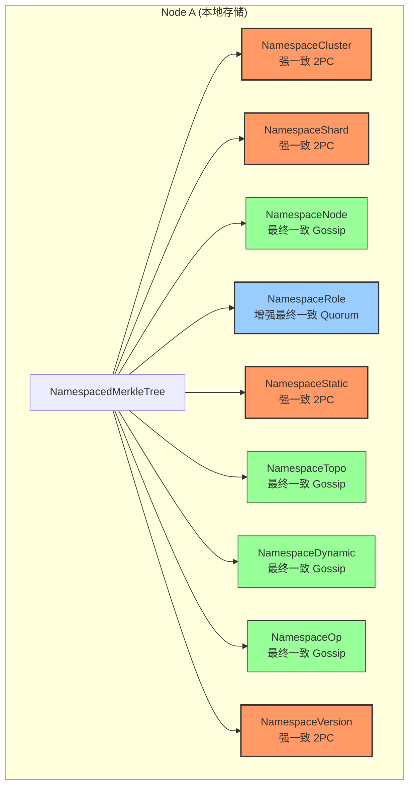
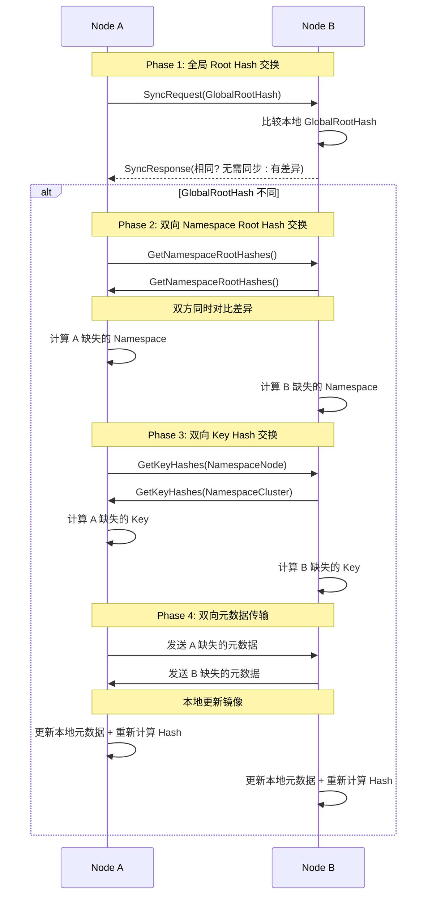

# 【PR Pre 文档】Feature - Metadata Merkle Tree 元数据版本控制

> **文档说明**：本文档为 PR 前置规划文档，必须经过架构师评审通过后方可启动开发。

---

## 第一部分：前置部分（开工前必完成，架构师评审通过）

### 1. 基础信息（与分支/PR绑定）

| 项目 | 内容 |
|------|------|
| 工作类型 | 新功能开发（Feature） |
| PR编号 | PR-039（创建GitHub PR后补充完整） |
| 分支名称 | feature/metadata-merkle-tree |
| 工作主题 | TreeCoordinator Merkle Tree 元数据版本控制 |
| 负责人 | 🤖 核心开发 A |
| 分支创建日期 | 2026-02-11 |
| 计划开工日期 | 待架构师评审通过 |
| 计划CI通过日期 | 待定 |
| 关联需求单号 | 内部需求（元数据同步优化） |
| 预研关联 | `docs/07_spike/tree-coordinator-merkle-tree.md` |
| 架构师评审状态 | ⏳ 待评审 |
| 预审批结果 | □ 未通过 □ 已通过（架构师签字/备注：XXX 2026-02-XX 同意开工） |

### 2. 背景与目标（为什么干）

#### 2.1 背景

- **业务场景**：NexKV 分布式 KV 存储系统中，节点间元数据同步开销大，差异检测效率低
- **现有问题**：
  - **全量同步开销大**：节点间同步传输全部元数据，浪费带宽
  - **差异检测低效**：O(n) 线性扫描，无法快速定位变化
  - **无版本控制**：元数据变更难以追踪和回滚
  - **读取延迟高**：元数据读取需要远程查询，延迟 10-50ms

- **价值**：
  - **性能提升**：本地读取元数据，延迟降至 1-5μs（10000x 提升）
  - **带宽节省**：增量同步，节省 80%-99% 带宽
  - **快速定位**：O(log n) 差异检测，快速定位变化分支
  - **版本控制**：Merkle Tree 天然支持版本追踪

#### 2.2 核心目标（可量化、可验证）

1. **功能目标**：
   - 完整元数据镜像：每个节点都有所有元数据副本
   - Namespace 分层：9 个 Namespace，每个一个 Merkle Tree
   - 三层递归检测：Global → Namespace → Key
   - 双向同步：双方同时交换差异

2. **性能目标**：
   - 本地读取延迟：1-5μs（对比远程 10-50ms）
   - 差异检测复杂度：O(log n)
   - 单个 Key 变化节省带宽：99%
   - 单个 Namespace 多个 Key 变化节省带宽：80%

3. **一致性目标**：
   - 强一致 (2PC)：ACK 全部 (need = n)
   - 增强最终一致 (Quorum)：ACK 大部分 (need = ⌊n/2⌋ + 1)
   - 最终一致 (Gossip)：无 ACK

#### 2.3 明确边界（不做什么，避免范围蔓延）

- **本次支持**：
  - NamespacedMerkleTree 基础结构实现
  - MetadataKV 本地读取优化
  - Gossip 协议扩展（双向同步 + Namespace 分层）
  - 多一致性级别支持（2PC / Quorum / Gossip）

- **本次不支持**：
  - 跨数据中心的元数据同步
  - 元数据加密传输
  - Bloom Filter 优化（已确认不适合树形拓扑）

### 3. 实现方案（怎么干，核心设计）

#### 3.1 整体架构



#### 3.2 数据结构设计

```go
// NamespacedMerkleTree Namespace 分层 Merkle Tree
type NamespacedMerkleTree struct {
    mu         sync.RWMutex
    namespaces map[Namespace]*NamespaceMerkleTree
}

// NamespaceMerkleTree 单个 Namespace 的 Merkle Tree
type NamespaceMerkleTree struct {
    Namespace Namespace
    KeyHashes map[string]string // key -> Hash
    RootHash  string            // SHA256(所有 Key Hash 的组合)
}

// GetGlobalRootHash 获取全局 Root Hash
func (n *NamespacedMerkleTree) GetGlobalRootHash() string {
    n.mu.RLock()
    defer n.mu.RUnlock()

    var namespaceHashes []string
    for _, tree := range n.namespaces {
        namespaceHashes = append(namespaceHashes, tree.RootHash)
    }

    sort.Strings(namespaceHashes)
    hash := sha256.Sum256([]byte(strings.Join(namespaceHashes, "")))
    return hex.EncodeToString(hash[:])
}
```

#### 3.3 同步流程设计



#### 3.4 一致性级别映射

| Namespace | 说明 | 一致性级别 | ACK 要求 | 同步机制 |
|-----------|------|-----------|---------|---------|
| `NamespaceCluster` | 集群元数据 | **强一致 (2PC)** | ACK 全部 | 同步返回 |
| `NamespaceShard` | 分片元数据 | **强一致 (2PC)** | ACK 全部 | 同步返回 |
| `NamespaceNode` | 节点元数据 | **最终一致 (Gossip)** | 无 ACK | 10秒内异步 |
| `NamespaceRole` | 角色元数据 | **增强最终一致 (Quorum)** | ACK 大部分 | 多数派确认 |
| `NamespaceStatic` | 静态元数据 | **强一致 (2PC)** | ACK 全部 | 同步返回 |
| `NamespaceTopo` | 拓扑元数据 | **最终一致 (Gossip)** | 无 ACK | 10秒内异步 |
| `NamespaceDynamic` | 动态元数据 | **最终一致 (Gossip)** | 无 ACK | 10秒内异步 |
| `NamespaceOp` | 运维元数据 | **最终一致 (Gossip)** | 无 ACK | 10秒内异步 |
| `NamespaceVersion` | 版本号 | **强一致 (2PC)** | ACK 全部 | 同步返回 |

> **ACK 要求说明**：
> - **ACK 全部 (2PC)**：need = n，所有参与者必须确认，任一失败则回滚
> - **ACK 大部分 (Quorum)**：need = ⌊n/2⌋ + 1，多数派确认即可
> - **无 ACK (Gossip)**：异步扩散，最终一致

### 4. 风险评估与应对措施

| 风险点 | 影响等级 | 应对措施 |
|--------|---------|----------|
| **Hash 计算开销** | 中 | 使用 SHA256 硬件加速，缓存计算结果 |
| **内存占用增加** | 中 | 限制缓存大小，LRU 淘汰策略 |
| **与现有代码集成** | 低 | 适配器模式，最小化侵入性修改 |
| **Gossip 协议复杂度** | 中 | 参考现有实现，分阶段集成 |
| **测试时间不足** | 低 | 并行开发测试用例 |

### 5. 实施计划

#### 5.1 工作量评估

| 阶段 | 内容 | 优先级 | 预估周期 | 产出物 |
|------|------|--------|----------|--------|
| **Phase 1** | 实现 NamespacedMerkleTree 基础结构 | P0 | 3 天 | 数据结构、Hash 计算 |
| **Phase 2** | 集成到 MetadataKV（本地读取） | P0 | 2 天 | 本地读取优化 |
| **Phase 3** | 扩展 Gossip 协议（双向同步 + Namespace 分层） | P1 | 4 天 | Gossip 扩展 |
| **Phase 4** | 多一致性级别实现（2PC + Quorum + Gossip） | P1 | 3 天 | 一致性协调器 |
| **Phase 5** | 性能测试与优化 | P1 | 2 天 | 测试报告 |
| **总计** | - | - | **14 天** | - |

#### 5.2 文件结构规划

```
internal/metadata/
├── merkletree/              # 新增：Merkle Tree 模块
│   ├── namespaced_tree.go   # Namespace 分层 Merkle Tree
│   ├── hash_calculator.go   # Hash 计算器
│   └── sync_protocol.go     # 同步协议
│
├── kvstore/
│   ├── metadata_kv.go       # 修改：集成 Merkle Tree
│   └── local_cache.go       # 新增：本地读取缓存
│
└── consistency/             # 新增：一致性协调器
    ├── coordinator.go       # 一致性协调器接口
    ├── twopc.go             # 2PC 实现（ACK 全部）
    ├── quorum.go            # Quorum 实现（ACK 大部分）
    └── gossip.go            # Gossip 实现（无 ACK）
```

#### 5.3 关键里程碑

| 里程碑 | 验收标准 | 完成日期 |
|--------|---------|---------|
| **M1: Phase 1 完成** | NamespacedMerkleTree 结构可用，Hash 计算正确 | Day 3 |
| **M2: Phase 2 完成** | 本地读取延迟降至 1-5μs | Day 5 |
| **M3: Phase 3 完成** | Gossip 双向同步工作，带宽节省 80%+ | Day 9 |
| **M4: Phase 4 完成** | 三种一致性机制正常工作 | Day 12 |
| **M5: Phase 5 完成** | 测试覆盖率 > 80%，性能达标 | Day 14 |

### 6. 验收标准

#### 6.1 功能验收

- [ ] 每个 Node 都有完整的元数据镜像
- [ ] 本地读取延迟降至 1-5μs（对比远程 10-50ms）
- [ ] 三层递归差异检测正常工作（Global → Namespace → Key）
- [ ] 双向同步机制正常工作
- [ ] 三种一致性机制正常工作（2PC / Quorum / Gossip）

#### 6.2 性能验收

- [ ] 单个 Key 变化：节省 99% 带宽
- [ ] 单个 Namespace 多个 Key 变化：节省 80% 带宽
- [ ] 差异检测复杂度：O(log n)

#### 6.3 质量验收

- [ ] 单元测试覆盖率 > 80%
- [ ] 集成测试覆盖关键场景
- [ ] Code Review 通过
- [ ] 代码符合规范（无 lint 错误）

### 7. 架构师评审记录（循环优化，直至通过）

| 评审轮次 | 评审日期 | 评审人（架构师） | 核心评审意见 | 优化措施（含AI辅助修改） | 优化结果 |
|----------|----------|------------------|--------------|--------------------------|----------|
| 第1轮 | 待定 | 👤 架构师 | 待评审 | - | 待定 |

### 8. 预审批确认

- [ ] **架构师审批**：□ 同意开工 □ 需优化 □ 不同意
- [ ] **审批意见**：_______________________________________
- [ ] **审批日期**：2026-02-___
- [ ] **审批人签字**：👤 架构师

---

**文档版本**: v1.0
**创建日期**: 2026-02-11
**维护者**: 🤖 核心开发 A
**状态**: ⏳ 等待架构师评审
