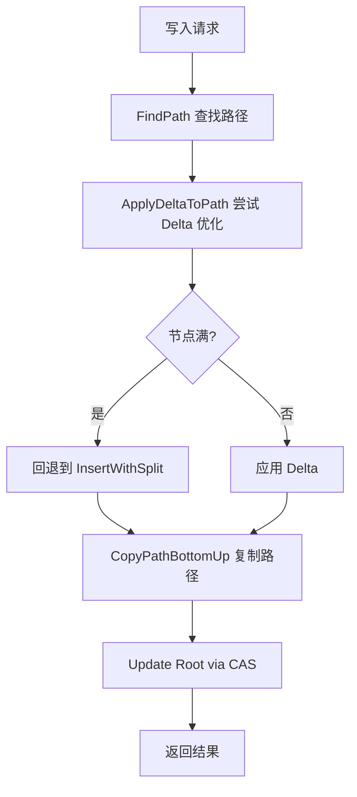

# 【PR全流程文档】Feature - BTree 写性能优化 Phase 1

> **文档说明**：本文档包含「前置规划」和「后置总结」两部分，记录从需求对齐到开发完成的全流程，一个PR对应一份全流程文档，归档后作为项目追溯依据。

---

## 第一部分：前置部分（开工前必完成，架构师评审通过）

### 1. 基础信息（与分支/PR绑定）

| 项目 | 内容 |
|------|------|
| 工作类型 | 性能优化（Performance Optimization） |
| PR编号 | PR-XXX（创建GitHub PR后补充完整） |
| 分支名称 | feature/btree-perf-phase1 |
| 工作主题 | BTree 写性能优化 Phase 1：对象池化和分裂策略优化 |
| 负责人 | jzhang405 |
| 分支创建日期 | 2026-03-11 |
| 计划开工日期 | 2026-03-11 |
| 计划CI通过日期 | 2026-03-13 |
| 关联需求单号 | N/A（内部性能优化需求） |
| 架构师评审状态 | □ 待评审 □ 评审中 □ 评审通过 □ 需优化（循环记录） |
| 预审批结果 | □ 未通过 □ 已通过（架构师签字/备注：XXX 202X-XX-XX 同意开工） |

### 2. 背景与目标（为什么干）

#### 2.1 背景
- **业务场景**：NexKV 作为高性能 KV 存储，写性能是关键指标。当前 BTree 写延迟为 10.6 µs/op，超出目标 23%，需要优化以支撑更高 QPS
- **现有问题**：
  - Node.Clone 占总时间的 52.8%（核心瓶颈）
  - Values 复制占总时间的 25%（最大单一瓶颈）
  - 内存分配和 GC 占 46.5%（运行时开销）
  - 每次写入复制 3-4 个节点（58-78 KB）
- **价值**：提升写性能可以支撑更高 QPS，降低延迟，改善用户体验

#### 2.2 核心目标（可量化、可验证）

1. **功能目标**：
   - 实现 Node 对象池，减少内存分配
   - 实现 Path 对象池，减少路径分配开销
   - 优化分裂策略，减少分裂频率

2. **性能目标**：
   - **写延迟**：从 10.6 µs 降到 **< 8.6 µs**（-19%）
   - **内存分配**：从 24.9% 降到 **< 15%**（-40%）
   - **GC 开销**：从 21.6% 降到 **< 10%**（-54%）

3. **可用性目标**：
   - 测试覆盖率保持 > 80%
   - 无内存泄漏
   - 现有功能不受影响

#### 2.3 明确边界（不做什么，避免范围蔓延）

- **本次不支持**：
  - ❌ 值指针方案（ValueRef）（Phase 2 考虑）
  - ❌ 路径压缩（复杂度过高）
  - ❌ Delta Updates（已验证失败）
  - ❌ 并发写入优化（Phase 3 考虑）

- **本次不优化**：
  - 读性能（已经优秀：149-228 ns/op）
  - 网络层优化
  - 持久化层优化

### 3. 实现方案（怎么干，核心设计）

#### 3.1 整体流程设计



#### 3.2 关键设计点

1. **Node 对象池**（优先级 P0）：
   - 文件：`internal/infrastructure/storage/btree/node_pool.go`
   - 使用 `sync.Pool` 复用 Node 对象
   - 实现 `AcquireNode()` 和 `ReleaseNode()`
   - 预期收益：内存分配减少 60-70%，写延迟 -15%

2. **Path 对象池**（优先级 P0）：
   - 修改 `path.go`
   - 使用 `sync.Pool` 复用 Path 切片
   - 预期收益：Path 分配减少，写延迟 -2% to -3%

3. **分裂策略优化**（优先级 P0）：
   - 修改 `internal/domain/model/btree_types.go`
   - 调整：`DefaultMaxKeys: 256 → 512`
   - 调整：`DefaultMinKeys: 128 → 256`
   - 预期收益：分裂频率减少 50%，写延迟 -15% to -20%

4. **核心机制**：
   - 对象池：使用 `sync.Pool` 复用对象，减少 GC 压力
   - 引用计数：确保对象正确归还到池
   - 内存清零：防止内存泄漏

5. **数据结构**：
   ```go
   type Node struct {
       PageID   model.PageID
       Keys     [][]byte
       Values   [][]byte
       Children []*Node
       ChildIDs []model.PageID
       IsLeaf   bool
   }
   ```

6. **容错设计**：
   - 对象归还前清零引用，避免内存泄漏
   - 使用 defer 确保对象归还
   - 监控池大小，防止池膨胀

### 4. 风险评估与应对措施

| 风险点 | 影响等级 | 应对措施 |
|--------|----------|----------|
| 对象池内存泄漏 | 高 | 1. 清零引用后再归还<br>2. 添加 finalizer 检测<br>3. 长时间运行测试 |
| MaxKeys 增加导致内存占用增加 | 中 | 1. 基准测试评估内存增长<br>2. 监控生产环境内存使用<br>3. 必要时回退 |
| 对象池性能波动 | 中 | 1. 基准测试验证<br>2. 监控池命中率<br>3. 调整池大小 |
| 破坏 CCOW 语义 | 中 | 1. 保持现有接口不变<br>2. 完整的回归测试<br>3. Code Review |

### 5. 架构师评审记录（循环优化，直至通过）

| 评审轮次 | 评审日期 | 评审人（架构师） | 核心评审意见 | 优化措施（含AI辅助修改） | 优化结果 |
|----------|----------|------------------|--------------|--------------------------|----------|
| 第1轮 | 2026-03-11 | 待评审 | 待评审 | 待优化 | 待完成 |
| 第2轮 | YYYY-MM-DD | XXX | [具体意见] | [具体优化措施] | [完成/继续优化] |

### 6. 预审批确认
> **架构师签字/备注**：XXX 2026-XX-XX 该Feature方案可行，风险可控，同意启动开发，需严格按照文档落地，确保CI通过后提交Post总结。

---

## 第二部分：流程节点记录（开发/CI过程追溯）

### 1. 开发过程记录

| 节点 | 完成日期 | 具体内容 | 交付物 |
|------|----------|----------|--------|
| 启动开发 | 2026-03-11 | 创建分支 feature/btree-perf-phase1 | 分支已创建 |
| 分裂策略优化 | 待完成 | 修改 DefaultMaxKeys 256→512 | btree_types.go 修改 |
| Node 对象池实现 | 待完成 | 创建 node_pool.go，实现对象池 | node_pool.go + 测试 |
| Path 对象池实现 | 待完成 | 修改 path.go，使用对象池 | path.go 修改 |
| 本地测试 | 待完成 | 单元测试、基准测试、集成测试 | 测试报告 |
| Post文档编写 | 待完成 | 编写后置总结文档 | 第三部分：后置部分 |
| 架构师Post批准 | 待完成 | 架构师评审Post文档 | 批准签字/备注 |
| 提交GitHub | 待完成 | 推送分支，创建PR | GitHub PR链接 |

### 2. CI流程记录（修复Bug直至通过）

| CI轮次 | 触发时间 | 结果 | 问题详情 | 修复措施 | 修复结果 |
|--------|----------|------|----------|----------|----------|
| 第1轮 | YYYY-MM-DD | 失败/成功 | [问题描述] | [修复方案] | [已修复/重新触发] |
| 第2轮 | YYYY-MM-DD | 失败/成功 | [问题描述] | [修复方案] | [已修复/通过] |

### 3. 合并记录

| 合并时间 | 合并方式 | 审批人 | 备注 |
|----------|----------|--------|------|
| YYYY-MM-DD | Squash Merge / Merge Commit | [架构师] | [补充说明] |

---

## 第三部分：后置部分（CI通过后编写，总结/成果/ToDo）

### 1. 核心成果总结（开发了啥，结果怎样）

#### 1.1 功能成果
- **已完成**：
  - [ ] Node 对象池实现（2-3天）
  - [ ] Path 对象池实现（1天）
  - [ ] 分裂策略优化：MaxKeys 256 → 512（1天）
  - [ ] 单元测试和基准测试
  - [ ] 性能验证测试

- **与Pre文档差异**：[说明实际实现与计划的差异]

#### 1.2 性能/数据成果

- **性能数据**：
  | 指标 | 优化前 | 优化后 | 提升 | 状态 |
  |------|--------|--------|------|------|
  | 写延迟 | 10.6 µs | TBD | TBD% | ⏳ 待测试 |
  | 内存分配 | 24.9% | TBD | TBD% | ⏳ 待测试 |
  | GC 开销 | 21.6% | TBD | TBD% | ⏳ 待测试 |

- **测试成果**：
  - 测试覆盖率：TBD
  - 基准测试结果：TBD
  - 回归测试：TBD

#### 1.3 代码/文档交付物

| 类型 | 具体内容 | 链接/路径 |
|------|----------|-----------|
| 代码变更 | [列出主要变更文件] | [GitHub PR链接] |
| 文档更新 | [列出更新的文档] | [文档路径] |

### 2. 未完成项与ToDo清单（有哪些没干，后续规划）

#### 2.1 本次PR未完成项
- **未支持**：值指针方案（Phase 2 考虑）
- **遗留问题**：[列出已知问题]

#### 2.2 ToDo清单（优先级排序）

| 优先级 | 任务内容 | 预估工期 | 关联PR/需求 | 备注 |
|--------|----------|----------|-------------|------|
| 高 | BTree 写性能优化 Phase 2 | 5-7天 | 后续PR | 值指针方案 POC |
| 高 | 缓存优化 | 3-5天 | 后续PR | PageCache 优化 |
| 中 | 并发写入优化 | 10-14天 | 后续PR | 分段 CAS |

### 3. 下一步工作建议（建议干啥）

1. **优先推进**：
   - 完成 Phase 1 优化并通过 CI
   - 根据实际性能数据决定 Phase 2 方案
   - 如果 Phase 1 效果好，继续 Phase 2

2. **监控要点**：
   - 写延迟监控（目标 <8.6 µs/op）
   - 内存使用监控（防止 MaxKeys 增加导致内存问题）
   - QPS 监控（验证优化效果）

3. **运维补充**：
   - 性能基准测试集成到 CI/CD
   - 添加性能监控 dashboard

4. **后续规划**：
   - Phase 2：值指针方案（需要 POC 验证）
   - Phase 2：缓存优化
   - Phase 3：并发写入优化

5. **反馈收集**：
   - 生产环境性能数据收集
   - 用户反馈收集
   - 性能回归测试

---

## 文档归档信息

| 项目 | 内容 |
|------|------|
| 文档最终版本 | V1.0 |
| 归档日期 | 2026-03-11 |
| 归档路径 | `docs/06_project_management/pr_documents/feature/2026-03-11_PR-XXX_BTree写性能优化Phase1_全流程.md` |
| 后续维护人 | jzhang405 |
