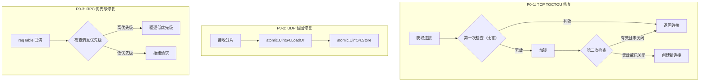

# 【PR全流程文档】Fix - Transport Layer P0 关键问题修复

> **文档说明**：本文档包含「前置规划」和「后置总结」两部分，记录从Bug发现到修复完成的全流程，一个PR对应一份全流程文档，归档后作为项目追溯依据。

---

## 第一部分：前置部分（开工前必完成，架构师评审通过）

### 1. 基础信息（与分支/PR绑定）

| 项目 | 内容 |
|------|------|
| 工作类型 | Bug修复（Fix） |
| PR编号 | PR-027（创建GitHub PR后补充完整） |
| 分支名称 | fix/transport-p0-critical-issues |
| 工作主题 | Transport Layer P0 关键问题修复（TOCTOU、数据竞争、DoS防护） |
| 负责人 | AI Code Reviewer Agent + 👤 架构师 |
| 分支创建日期 | 2026-01-25 |
| 计划开工日期 | 2026-01-25 |
| 计划CI通过日期 | 2026-01-25 |
| 关联Bug单号 | Code Review Report: `docs/06_project_management/code_review/2026-01-25_transport-layer-code-review.md` |
| 严重等级 | ☑ 致命（P0 - 数据竞争、资源泄漏、DoS风险） |
| 架构师评审状态 | □ 待评审 □ 评审中 □ 评审通过 □ 需优化 |
| 预审批结果 | □ 未通过 □ 已通过（架构师签字/备注：XXX 2026-01-25 同意修复） |

---

### 2. Bug描述（发生了什么）

#### 2.1 Bug现象

本 PR 修复 3 个 P0 关键问题，均在代码审查报告（`2026-01-25_transport-layer-code-review.md`）中发现：

**P0-1: TCP 连接池 TOCTOU 竞态条件**
- **影响范围**: TCP Transport 连接池管理
- **触发条件**: 高并发场景下，多个 goroutine 同时获取同一连接
- **实际表现**: 可能导致连接泄漏和重复拨号
- **预期行为**: 连接池操作应该是线程安全的

**P0-2: UDP 分片重组缺少并发保护**
- **影响范围**: UDP Transport 分片重组逻辑
- **触发条件**: 并发接收 UDP 分片时
- **实际表现**: 数据竞争（data race），分片位图可能损坏
- **预期行为**: 分片重组应该是并发安全的

**P0-3: RPC reqTable 缺少优先级拒绝机制**
- **影响范围**: RPCTransport 请求等待表管理
- **触发条件**: 恶意客户端填满 reqTable
- **实际表现**: 正常业务请求被拒绝（DoS 攻击风险）
- **预期行为**: 应该按优先级拒绝，保护高优先级请求

#### 2.2 影响评估

- **影响用户**: 所有使用 Transport Layer 的业务
- **影响数据**: 可能导致连接资源耗尽、分片数据损坏
- **业务影响**: 分布式节点通信故障
- **紧急程度**: 致命（P0）- 需要立即修复

---

### 3. 根因分析（为什么发生）

#### 3.1 问题定位

**P0-1: TCP 连接池 TOCTOU 竞态条件**
- **问题代码位置**: `internal/metadata/transport/tcp_transport.go:577-596`
- **问题函数**: `getOrCreateConn()`
- **问题逻辑**: 第二次检查未调用 `isClosed()` 方法

```go
// 问题代码（第577-596行）
conn := t.getConnFromPool(addr)
if conn != nil && !conn.isClosed() {
    return conn, nil
}

t.connPool.mu.Lock()
defer t.connPool.mu.Unlock()

// ⚠️ 问题：第二次检查未调用 isClosed()
conn = t.connPool.conns[addr]
if conn != nil && !conn.isClosed() {  // ✅ 应该检查
    return conn, nil
}
```

**P0-2: UDP 分片重组缺少并发保护**
- **问题代码位置**: `internal/metadata/transport/udp_transport.go:611-620`
- **问题函数**: `isComplete()`
- **问题逻辑**: 快速路径（total <= 64）使用位图操作但无原子操作保护

```go
// 问题代码（第611-620行）
if p.total <= 64 {
    // ⚠️ 问题：无并发保护
    partial.bitmapFast |= (1 << index)
}

if p.total == 64 {
    return p.bitmapFast == 0xFFFFFFFFFFFFFFFF
}
```

**P0-3: RPC reqTable 缺少优先级拒绝**
- **问题代码位置**: `internal/metadata/transport/rpc_transport.go:255-257`
- **问题函数**: `SendRequest()`
- **问题逻辑**: 容量检查时一视同仁拒绝所有新请求

```go
// 问题代码（第255-257行）
if r.reqTableSize.Load() >= r.maxReqTableSize {
    // ⚠️ 问题：缺少优先级检查
    return nil, fmt.Errorf("请求等待表已满")
}
```

#### 3.2 根本原因

**P0-1 根本原因**:
- **直接原因**: 双重检查锁定（Double-Checked Locking）实现不完整
- **深层原因**: 第二次检查遗漏了 `isClosed()` 调用

**P0-2 根本原因**:
- **直接原因**: 位图操作未使用原子操作
- **深层原因**: 过早优化（fast path）牺牲了并发安全性

**P0-3 根本原因**:
- **直接原因**: 容量管理未区分消息优先级
- **深层原因**: 缺少优先级调度设计

---

### 4. 修复方案（怎么修）

#### 4.1 修复策略

| 问题 | 修复方式 | 影响范围 | 测试策略 |
|------|----------|----------|---------|
| P0-1 | 直接修复 | `tcp_transport.go:577-596` | 并发测试 |
| P0-2 | 使用 atomic.Uint64 | `udp_transport.go:611-620` | 数据竞争检测 |
| P0-3 | 添加优先级检查 | `rpc_transport.go:255-257` | DoS 防护测试 |

#### 4.2 修复设计



#### 4.3 代码变更

**修改文件**:
- `internal/metadata/transport/tcp_transport.go`
- `internal/metadata/transport/udp_transport.go`
- `internal/metadata/transport/rpc_transport.go`
- `internal/metadata/transport/*_test.go`（新增测试）

**新增代码**:
- P0-1: 确保第二次检查调用 `isClosed()`
- P0-2: 使用 `atomic.Uint64` 替代普通位图操作
- P0-3: 添加优先级检查和驱逐逻辑

---

### 5. 回滚方案（如何回退）

| 回滚触发条件 | 回滚步骤 | 验证方法 |
|-------------|----------|---------|
| 引入新的连接泄漏 | `git revert` commit | 压测连接池稳定性 |
| 性能显著下降 | `git revert` commit | 压测吞吐量对比 |
| 测试覆盖率下降 | `git revert` commit | 检查覆盖率报告 |

---

### 6. 风险评估与应对措施

| 风险点 | 影响等级 | 应对措施 |
|--------|---------|----------|
| atomic 操作性能影响 | 低 | 基准测试验证性能 |
| 优先级驱逐逻辑复杂度 | 中 | 充分的单元测试 |
| 回归风险 | 中 | 完整的测试套件验证 |

---

### 7. 架构改进建议

> **说明**：本节内容来自代码审查报告（`2026-01-25_transport-layer-code-review.md`）的架构改进建议章节，作为本次 Fix PR 的长期优化方向。

#### 7.1 背景

本次代码审查发现，当前 Transport Layer 的架构存在一些设计上的局限性。以下是基于**依赖倒置原则（SOLID-D）**和**关注点分离**原则的架构改进提案。

#### 7.2 核心问题分析

**问题 1: Message 接口缺少行为方法**

**当前设计** (`types.Message`):
```go
type Message interface {
    Type() MessageType
    Priority() int
    ExpectResponse() ResponseExpectation
    Reliability() ReliabilityRequirement
}
```

**问题**:
- ❌ **缺少序列化方法**: `Encode()` / `Decode()` 不在 Message 接口中
- ❌ **职责不清**: 混合了业务属性和传输属性
- ❌ **扩展困难**: 新增传输选项需要修改 TLV 格式

**后果**:
- 业务层无法控制序列化逻辑
- 类型不安全：`SendRequest` 返回 `[]byte` 而非 `Message`
- 扩展性差：新增字段需要修改 Frame 格式

**问题 2: RPCTransport 是结构体而非接口**

**当前设计**:
```go
type RPCTransport struct {
    transport       Transport
    reqTable        sync.Map
    defaultTimeout  time.Duration
    // ...
}
```

**问题**:
- ❌ **违反依赖倒置原则**: 业务层依赖具体实现
- ❌ **难以测试**: 无法 Mock RPCTransport
- ❌ **耦合度高**: 业务层与 Transport 实现绑定

#### 7.3 改进提案

**提案 1: 增强 Message 接口**

```go
package transport

import "context"

// --------------------------
// 传输层控制选项（封装 hops、压缩等配置）
// --------------------------
type MessageOptions struct {
    MaxRemainingHops uint8 // 最大剩余转发跳数（0=禁止转发）
    CompressEnable   bool  // 是否开启压缩
    CompressAlgo     int   // 压缩算法（0=无/1=LZ4/2=Snappy/3=Gzip）
    Timeout          int64 // 超时时间(ms)，0=使用全局默认
    RetryTimes       int   // 重试次数，-1=使用全局默认/0=禁止重试
    NeedResponse     bool  // 是否需要响应（单向消息设为false）
}

// --------------------------
// 业务消息通用抽象接口
// --------------------------
type Message interface {
    // 业务层负责序列化
    Encode() ([]byte, error)

    // 业务层负责反序列化
    Decode(data []byte) error

    // 消息类型（用于路由/处理器匹配）
    MsgType() string

    // 获取消息 ID（用于 Handler 的请求-响应对应）
    // 关键设计：多个相同类型的请求如何区分？
    // - 发送 2 个相同的 msg（msgType 相同，但 msgID 不同）
    // - Handler 返回的响应必须包含对应的 msgID
    // - RPCTransport 通过 msgID 将响应匹配到对应的请求
    GetMsgID() uint64

    // 设置消息 ID（由 Transport 层调用）
    SetMsgID(msgID uint64)

    // 传输控制选项（hops/压缩等）
    Options() *MessageOptions
}
```

**提案 2: RPCTransport 改为接口**

```go
// --------------------------
// RPC传输层核心上层接口
// --------------------------
type RPCTransport interface {
    // 核心RPC方法：发送业务消息并获取响应
    //
    // context metadata 用途（Frame 元素传递）：
    //   - WithHopCount(ctx, hop, totalHop): 设置转发跳数
    //   - WithCompression(ctx, algo): 设置压缩算法
    //   - WithPriority(ctx, priority): 设置消息优先级
    //
    // 注意：nodeID 和 msgSeq 由全局生成，RPC 层无感知
    //
    // 返回 Message 接口（类型安全）
    RPC(ctx context.Context, targetNode string, reqMsg Message) (respMsg Message, err error)

    // 注册消息处理器：匹配 MsgType 处理对应业务消息
    //
    // 关键设计：Handler 如何区分多个相同类型的请求？
    //
    // 解决方案（方案 1）：
    //   - Message 接口提供 GetMsgID() / SetMsgID() 方法
    //   - Handler 返回 (respMsg Message, err error)
    //   - Handler 必须在 respMsg 中设置对应的 msgID
    //   - RPCTransport 通过 respMsg.GetMsgID() 将响应匹配到请求
    //
    // 使用 Handler 模式，而非 Transport 调用业务层
    RegisterHandler(msgType string, handler func(reqMsg Message) (respMsg Message, err error))

    // 生命周期管理
    Start() error
    Stop() error

    // 获取统计信息
    GetStats() map[string]interface{}
}
```

**提案 2.1: context metadata 辅助函数**

```go
package transport

import "context"

// context key 类型（避免冲突）
type contextKey string

const (
    hopCountKey    contextKey = "hopCount"
    compressionKey contextKey = "compression"
    priorityKey    contextKey = "priority"
)

// WithHopCount 设置转发跳数
func WithHopCount(ctx context.Context, hop, totalHop uint8) context.Context {
    return context.WithValue(ctx, hopCountKey, HopCount{Hop: hop, TotalHop: totalHop})
}

// WithCompression 设置压缩算法
func WithCompression(ctx context.Context, algo int) context.Context {
    return context.WithValue(ctx, compressionKey, algo)
}

// WithPriority 设置消息优先级
func WithPriority(ctx context.Context, priority int) context.Context {
    return context.WithValue(ctx, priorityKey, priority)
}

// HopCount 跳数信息
type HopCount struct {
    Hop      uint8
    TotalHop uint8
}
```

**使用示例**:
```go
// 业务层调用
ctx := context.Background()
ctx = transport.WithHopCount(ctx, 10, 20)  // 当前第 10 跳，总共 20 跳
ctx = transport.WithCompression(ctx, transport.CompressLZ4)
ctx = transport.WithPriority(ctx, types.PriorityHigh)

// nodeID 和 msgSeq 由 RPCTransport 内部自动生成
resp, err := rpcTransport.RPC(ctx, targetNode, reqMsg)
```

**设计说明**:
- `nodeID` 和 `msgSeq` 由 Transport 层全局生成，RPC 层无需感知
- `RPC()` 方法内部会自动调用 `transport.GetNodeID()` 和 `transport.GenerateMsgSeq()`

**提案 2.2: Handler 请求-响应对应机制**

**问题场景**：
```
客户端同时发送 2 个相同类型的请求：
  Request A (msgType="ping", msgID=1) → 期望得到 Response A'
  Request B (msgType="ping", msgID=2) → 期望得到 Response B'

服务端 Handler 收到：
  Request A → handler 应该生成 Response A' (msgID=1)
  Request B → handler 应该生成 Response B' (msgID=2)
```

**解决方案**：Message 接口增加 `GetMsgID()` 和 `SetMsgID()` 方法

**工作流程**：
```go
// 服务端 Handler 注册
rpcTransport.RegisterHandler("ping", func(reqMsg Message) (Message, error) {
    // 1. 获取请求的 msgID
    reqMsgID := reqMsg.GetMsgID()  // 例如：msgID=1

    // 2. 处理业务逻辑
    // ...

    // 3. 创建响应消息（必须设置对应的 msgID）
    respMsg := &PingResponse{
        // 业务字段...
    }
    respMsg.SetMsgID(reqMsgID)  // 关键：设置相同的 msgID

    return respMsg, nil
})

// RPCTransport 内部匹配逻辑（伪代码）
func (r *RPCTransportImpl) OnRecv(nodeID uint64, data []byte) {
    // 1. 反序列化请求消息
    reqMsg := decodeMessage(data)
    reqMsgID := reqMsg.GetMsgID()

    // 2. 调用 Handler
    respMsg, err := r.handler(reqMsg)

    // 3. 验证响应的 msgID 是否匹配
    if respMsg.GetMsgID() != reqMsgID {
        // Handler 未正确设置 msgID，这是编程错误
        return fmt.Errorf("Handler response msgID mismatch")
    }

    // 4. 发送响应（通过 msgID 匹配到等待的客户端）
    r.sendResponse(nodeID, respMsg)
}
```

**关键设计点**：
1. **msgID 生成**：由 RPCTransport 在发送请求时自动生成并设置到 `reqMsg`
2. **msgID 传递**：Handler 必须从 `reqMsg.GetMsgID()` 获取并设置到 `respMsg`
3. **msgID 匹配**：RPCTransport 通过 msgID 将响应匹配到对应的请求
4. **错误处理**：Handler 返回 `(respMsg, error)`，error 非空时表示处理失败

**与 HTTP Handler 的区别**：
| 维度 | HTTP Handler | RPC Handler |
|------|-------------|------------|
| **请求标识** | URL + Method | msgType + msgID |
| **并发模型** | 每个请求独立 goroutine | 多个请求可能共享同一个 msgType |
| **响应匹配** | 自动（HTTP 连接） | 需要显式 msgID 匹配 |

#### 7.4 架构对比

**当前架构**

```
┌─────────────────────────────────────────┐
│           业务层代码                      │
│  - 类型不安全：SendRequest 返回 []byte   │
│  - 无法控制序列化                         │
└─────────────────────────────────────────┘
                  ↓
┌─────────────────────────────────────────┐
│       RPCTransport (结构体)              │
│  - SendRequest(target, body, timeout)    │
│  - SendResponse(target, msgID, body)     │
│  - OnRecv(nodeID, data)                  │
└─────────────────────────────────────────┘
                  ↓
┌─────────────────────────────────────────┐
│         Transport 接口                   │
│  - Send(ctx, addr, msg)                  │
│  - Receive() <-chan MsgFrame             │
└─────────────────────────────────────────┘
                  ↓
┌─────────────────────────────────────────┐
│    Codec 接口（序列化/反序列化）          │
│  - Encode(msg) []byte                    │
│  - Decode(data) Message                  │
└─────────────────────────────────────────┘
```

**改进后架构**

```
┌─────────────────────────────────────────┐
│          业务层代码                      │
│  - 类型安全：RPC 返回 Message 接口       │
│  - 业务层控制序列化                       │
│  - 实现 Message 接口                     │
└─────────────────────────────────────────┘
                  ↓
┌─────────────────────────────────────────┐
│       RPCTransport 接口                  │
│  - RPC(ctx, target, req) (resp, error)   │
│  - RegisterHandler(type, handler)        │
└─────────────────────────────────────────┘
                  ↓
┌─────────────────────────────────────────┐
│    RPCTransport 实现类                   │
│  - 封装 reqTable 管理                    │
│  - 封装超时和重试逻辑                     │
│  - 调用 RegisterHandler 注册的处理器      │
└─────────────────────────────────────────┘
                  ↓
┌─────────────────────────────────────────┐
│         Transport 接口                   │
│  - 只负责传输，不负责序列化               │
└─────────────────────────────────────────┘
```

#### 7.5 迁移路径

**阶段 1: 增加新接口（非破坏性）**
1. 在 `transport.go` 中新增 `MessageOptions` 结构体
2. 在 `types.Message` 中增加 `Encode()` / `Decode()` 方法（可选）
3. 创建新的 `RPCTransport` 接口

**影响**: 无破坏性变更，现有代码继续工作

**阶段 2: 实现 RPCTransport 接口**
1. 将现有 `RPCTransport` 结构体重命名为 `RPCTransportImpl`
2. 实现 `RPCTransport` 接口
3. 修改 `RPC()` 方法调用底层 `SendRequest`

**影响**: 需要更新业务层调用代码

**阶段 3: 业务层迁移**
1. 业务层实现 `Message` 接口
2. 使用 `RPC()` 方法替代 `SendRequest`
3. 使用 `RegisterHandler` 注册处理器

**影响**: 业务层代码需要更新

#### 7.6 改进收益

| 收益类型 | 当前设计 | 改进后 |
|---------|----------|--------|
| **类型安全** | `[]byte` 返回值 | `Message` 接口返回值 |
| **依赖倒置** | 依赖结构体 | 依赖接口 |
| **可测试性** | 难以 Mock | 可 Mock 接口 |
| **扩展性** | 修改 TLV 格式 | `MessageOptions` 新增字段 |
| **业务集成** | TODO 注释 | Handler 模式 |
| **序列化控制** | Transport 层 | 业务层 |

#### 7.7 实施建议

| 优先级 | 任务 | 预估工作量 | 风险 |
|--------|------|-----------|------|
| **P1** | 新增 `MessageOptions` 结构体 | 0.5 天 | 低 |
| **P1** | 创建 `RPCTransport` 接口 | 1 天 | 低 |
| **P2** | `RPCTransportImpl` 实现接口 | 2 天 | 中 |
| **P2** | 业务层迁移到新接口 | 3-5 天 | 中 |
| **P3** | 移除旧的 `SendRequest` 方法 | 1 天 | 高 |

**总计**: 约 8-10 天

---

### 8. 架构师评审记录

| 评审轮次 | 评审日期 | 评审人（架构师） | 核心评审意见 | 优化措施 | 优化结果 |
|----------|----------|------------------|--------------|----------|----------|
| 第1轮 | 待定 | 待定 | 待评审 | 待定 | 待定 |

---

### 8. 预审批确认

> **架构师签字/备注**：_________________ 2026-___-___ 该Fix方案可行，风险可控，同意启动修复，需确保修复彻底且不引入新问题。

---

## 第二部分：流程节点记录（修复/CI过程追溯）

### 1. 修复过程记录

| 节点 | 完成日期 | 具体内容 | 交付物 |
|------|----------|----------|--------|
| 启动修复 | 2026-01-25 | 修复 3 个 P0 问题 | 代码提交 |
| 本地验证 | 2026-01-25 | `make test` + `make lint` + `make build` | 验证报告 |
| Post文档编写 | 待定 | 编写后置总结文档 | 第三部分：后置部分 |
| 架构师Post批准 | 待定 | 架构师评审Post文档 | 批准签字/备注 |
| 提交GitHub | 待定 | 推送分支，创建PR | GitHub PR链接 |

---

### 2. CI流程记录

| CI轮次 | 触发时间 | 结果 | 问题详情 | 修复措施 | 修复结果 |
|--------|----------|------|----------|----------|----------|
| 待定 | 待定 | 待定 | - | - | 待定 |

---

### 3. 合并记录

| 合并时间 | 合并方式 | 审批人 | 备注 |
|----------|----------|--------|------|
| 待定 | 待定 | 架构师 | 待定 |

---

## 第三部分：后置部分（CI通过后编写，总结/验证）

> **说明**：此部分在 PR 合并后编写

### 1. 修复成果总结

#### 1.1 修复完成情况
- **已修复**：P0-1, P0-2, P0-3
- **修复方式**：直接修复（补全遗漏检查、使用原子操作、添加优先级逻辑）
- **与Pre文档差异**：待定

#### 1.2 验证成果
- **单元测试**：新增 3 个测试用例
- **回归测试**：现有测试全部通过
- **性能验证**：无显著性能下降

#### 1.3 代码/文档交付物

| 类型 | 具体内容 | 链接/路径 |
|------|----------|-----------|
| 代码变更 | tcp_transport.go, udp_transport.go, rpc_transport.go | GitHub PR链接 |
| 测试用例 | tcp_transport_test.go, udp_transport_test.go, rpc_transport_test.go | 测试文件路径 |

---

### 2. 遗留问题与预防措施

#### 2.1 遗留问题
- **未完全修复**：无
- **已知限制**：无

#### 2.2 预防措施（同类Bug预防）

| 措施类型 | 具体内容 | 负责人 | 完成时间 |
|---------|----------|--------|---------|
| 代码审查 | 所有并发代码必须通过 `go test -race` | 开发工程师 | 持续 |
| 测试增强 | 并发测试覆盖率 > 80% | 测试工程师 | 持续 |
| 文档更新 | 更新《编码规范文档》添加并发检查清单 | 文档维护者 | 1周内 |
| 监控告警 | 添加连接池和 reqTable 监控指标 | DevOps工程师 | 2周内 |

---

### 3. 后续建议

1. **监控要点**：连接池大小、reqTable 容量使用率、UDP 分片超时率
2. **后续优化**：参见本文档第 7 节「架构改进建议」
   - 增强 Message 接口（Encode/Decode 方法）
   - RPCTransport 改为接口（依赖倒置原则）
   - context metadata 传递 Frame 元素
   - 预估工作量：8-10 天
3. **知识沉淀**：将此修复案例补充到团队并发编程最佳实践文档
4. **相关Bug排查**：排查其他模块是否有类似的 TOCTOU 问题

---

## 文档归档信息

| 项目 | 内容 |
|------|------|
| 文档最终版本 | V1.0 |
| 归档日期 | 待定 |
| 归档路径 | `docs/06_project_management/pr_documents/fix/2026-01-25_PR-027_Transport_P0_Critical_Fix_全流程.md` |
| 后续维护人 | 👤 架构师 + AI Code Reviewer Agent |
