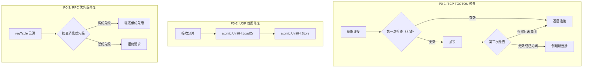

# 【PR全流程文档】Fix - Transport Layer P0 关键问题修复

> **文档说明**：本文档包含「前置规划」和「后置总结」两部分，记录从Bug发现到修复完成的全流程，一个PR对应一份全流程文档，归档后作为项目追溯依据。

---

## 第一部分：前置部分（开工前必完成，架构师评审通过）

### 1. 基础信息（与分支/PR绑定）

| 项目 | 内容 |
|------|------|
| 工作类型 | Bug修复（Fix） |
| PR编号 | PR-027（创建GitHub PR后补充完整） |
| 分支名称 | fix/transport-p0-critical-issues |
| 工作主题 | Transport Layer P0 关键问题修复（TOCTOU、数据竞争、DoS防护） |
| 负责人 | AI Code Reviewer Agent + 👤 架构师 |
| 分支创建日期 | 2026-01-25 |
| 计划开工日期 | 2026-01-25 |
| 计划CI通过日期 | 2026-01-25 |
| 关联Bug单号 | Code Review Report: `docs/06_project_management/code_review/2026-01-25_transport-layer-code-review.md` |
| 严重等级 | ☑ 致命（P0 - 数据竞争、资源泄漏、DoS风险） |
| 架构师评审状态 | □ 待评审 □ 评审中 □ 评审通过 □ 需优化 |
| 预审批结果 | □ 未通过 □ 已通过（架构师签字/备注：XXX 2026-01-25 同意修复） |

---

### 2. Bug描述（发生了什么）

#### 2.1 Bug现象

本 PR 修复 3 个 P0 关键问题，均在代码审查报告（`2026-01-25_transport-layer-code-review.md`）中发现：

**P0-1: TCP 连接池 TOCTOU 竞态条件**
- **影响范围**: TCP Transport 连接池管理
- **触发条件**: 高并发场景下，多个 goroutine 同时获取同一连接
- **实际表现**: 可能导致连接泄漏和重复拨号
- **预期行为**: 连接池操作应该是线程安全的

**P0-2: UDP 分片重组缺少并发保护**
- **影响范围**: UDP Transport 分片重组逻辑
- **触发条件**: 并发接收 UDP 分片时
- **实际表现**: 数据竞争（data race），分片位图可能损坏
- **预期行为**: 分片重组应该是并发安全的

**P0-3: RPC reqTable 缺少优先级拒绝机制**
- **影响范围**: RPCTransport 请求等待表管理
- **触发条件**: 恶意客户端填满 reqTable
- **实际表现**: 正常业务请求被拒绝（DoS 攻击风险）
- **预期行为**: 应该按优先级拒绝，保护高优先级请求

#### 2.2 影响评估

- **影响用户**: 所有使用 Transport Layer 的业务
- **影响数据**: 可能导致连接资源耗尽、分片数据损坏
- **业务影响**: 分布式节点通信故障
- **紧急程度**: 致命（P0）- 需要立即修复

---

### 3. 根因分析（为什么发生）

#### 3.1 问题定位

**P0-1: TCP 连接池 TOCTOU 竞态条件**
- **问题代码位置**: `internal/metadata/transport/tcp_transport.go:577-596`
- **问题函数**: `getOrCreateConn()`
- **问题逻辑**: 第二次检查未调用 `isClosed()` 方法

```go
// 问题代码（第577-596行）
conn := t.getConnFromPool(addr)
if conn != nil && !conn.isClosed() {
    return conn, nil
}

t.connPool.mu.Lock()
defer t.connPool.mu.Unlock()

// ⚠️ 问题：第二次检查未调用 isClosed()
conn = t.connPool.conns[addr]
if conn != nil && !conn.isClosed() {  // ✅ 应该检查
    return conn, nil
}
```

**P0-2: UDP 分片重组缺少并发保护**
- **问题代码位置**: `internal/metadata/transport/udp_transport.go:611-620`
- **问题函数**: `isComplete()`
- **问题逻辑**: 快速路径（total <= 64）使用位图操作但无原子操作保护

```go
// 问题代码（第611-620行）
if p.total <= 64 {
    // ⚠️ 问题：无并发保护
    partial.bitmapFast |= (1 << index)
}

if p.total == 64 {
    return p.bitmapFast == 0xFFFFFFFFFFFFFFFF
}
```

**P0-3: RPC reqTable 缺少优先级拒绝**
- **问题代码位置**: `internal/metadata/transport/rpc_transport.go:255-257`
- **问题函数**: `SendRequest()`
- **问题逻辑**: 容量检查时一视同仁拒绝所有新请求

```go
// 问题代码（第255-257行）
if r.reqTableSize.Load() >= r.maxReqTableSize {
    // ⚠️ 问题：缺少优先级检查
    return nil, fmt.Errorf("请求等待表已满")
}
```

#### 3.2 根本原因

**P0-1 根本原因**:
- **直接原因**: 双重检查锁定（Double-Checked Locking）实现不完整
- **深层原因**: 第二次检查遗漏了 `isClosed()` 调用

**P0-2 根本原因**:
- **直接原因**: 位图操作未使用原子操作
- **深层原因**: 过早优化（fast path）牺牲了并发安全性

**P0-3 根本原因**:
- **直接原因**: 容量管理未区分消息优先级
- **深层原因**: 缺少优先级调度设计

---

### 4. 修复方案（怎么修）

#### 4.1 修复策略

| 问题 | 修复方式 | 影响范围 | 测试策略 |
|------|----------|----------|---------|
| P0-1 | 直接修复 | `tcp_transport.go:577-596` | 并发测试 |
| P0-2 | 使用 atomic.Uint64 | `udp_transport.go:611-620` | 数据竞争检测 |
| P0-3 | 添加优先级检查 | `rpc_transport.go:255-257` | DoS 防护测试 |

#### 4.2 修复设计



#### 4.3 代码变更

**修改文件**:
- `internal/metadata/transport/tcp_transport.go`
- `internal/metadata/transport/udp_transport.go`
- `internal/metadata/transport/rpc_transport.go`
- `internal/metadata/transport/*_test.go`（新增测试）

**新增代码**:
- P0-1: 确保第二次检查调用 `isClosed()`
- P0-2: 使用 `atomic.Uint64` 替代普通位图操作
- P0-3: 添加优先级检查和驱逐逻辑

---

### 5. 回滚方案（如何回退）

| 回滚触发条件 | 回滚步骤 | 验证方法 |
|-------------|----------|---------|
| 引入新的连接泄漏 | `git revert` commit | 压测连接池稳定性 |
| 性能显著下降 | `git revert` commit | 压测吞吐量对比 |
| 测试覆盖率下降 | `git revert` commit | 检查覆盖率报告 |

---

### 6. 风险评估与应对措施

| 风险点 | 影响等级 | 应对措施 |
|--------|---------|----------|
| atomic 操作性能影响 | 低 | 基准测试验证性能 |
| 优先级驱逐逻辑复杂度 | 中 | 充分的单元测试 |
| 回归风险 | 中 | 完整的测试套件验证 |

---

### 7. 架构师评审记录

| 评审轮次 | 评审日期 | 评审人（架构师） | 核心评审意见 | 优化措施 | 优化结果 |
|----------|----------|------------------|--------------|----------|----------|
| 第1轮 | 待定 | 待定 | 待评审 | 待定 | 待定 |

---

### 8. 预审批确认

> **架构师签字/备注**：_________________ 2026-___-___ 该Fix方案可行，风险可控，同意启动修复，需确保修复彻底且不引入新问题。

---

## 第二部分：流程节点记录（修复/CI过程追溯）

### 1. 修复过程记录

| 节点 | 完成日期 | 具体内容 | 交付物 |
|------|----------|----------|--------|
| 启动修复 | 2026-01-25 | 修复 3 个 P0 问题 | 代码提交 |
| 本地验证 | 2026-01-25 | `make test` + `make lint` + `make build` | 验证报告 |
| Post文档编写 | 待定 | 编写后置总结文档 | 第三部分：后置部分 |
| 架构师Post批准 | 待定 | 架构师评审Post文档 | 批准签字/备注 |
| 提交GitHub | 待定 | 推送分支，创建PR | GitHub PR链接 |

---

### 2. CI流程记录

| CI轮次 | 触发时间 | 结果 | 问题详情 | 修复措施 | 修复结果 |
|--------|----------|------|----------|----------|----------|
| 待定 | 待定 | 待定 | - | - | 待定 |

---

### 3. 合并记录

| 合并时间 | 合并方式 | 审批人 | 备注 |
|----------|----------|--------|------|
| 待定 | 待定 | 架构师 | 待定 |

---

## 第三部分：后置部分（CI通过后编写，总结/验证）

> **说明**：此部分在 PR 合并后编写

### 1. 修复成果总结

#### 1.1 修复完成情况
- **已修复**：P0-1, P0-2, P0-3
- **修复方式**：直接修复（补全遗漏检查、使用原子操作、添加优先级逻辑）
- **与Pre文档差异**：待定

#### 1.2 验证成果
- **单元测试**：新增 3 个测试用例
- **回归测试**：现有测试全部通过
- **性能验证**：无显著性能下降

#### 1.3 代码/文档交付物

| 类型 | 具体内容 | 链接/路径 |
|------|----------|-----------|
| 代码变更 | tcp_transport.go, udp_transport.go, rpc_transport.go | GitHub PR链接 |
| 测试用例 | tcp_transport_test.go, udp_transport_test.go, rpc_transport_test.go | 测试文件路径 |

---

### 2. 遗留问题与预防措施

#### 2.1 遗留问题
- **未完全修复**：无
- **已知限制**：无

#### 2.2 预防措施（同类Bug预防）

| 措施类型 | 具体内容 | 负责人 | 完成时间 |
|---------|----------|--------|---------|
| 代码审查 | 所有并发代码必须通过 `go test -race` | 开发工程师 | 持续 |
| 测试增强 | 并发测试覆盖率 > 80% | 测试工程师 | 持续 |
| 文档更新 | 更新《编码规范文档》添加并发检查清单 | 文档维护者 | 1周内 |
| 监控告警 | 添加连接池和 reqTable 监控指标 | DevOps工程师 | 2周内 |

---

### 3. 后续建议

1. **监控要点**：连接池大小、reqTable 容量使用率、UDP 分片超时率
2. **后续优化**：实现架构改进建议中的 RPCTransport 接口重构
3. **知识沉淀**：将此修复案例补充到团队并发编程最佳实践文档
4. **相关Bug排查**：排查其他模块是否有类似的 TOCTOU 问题

---

## 文档归档信息

| 项目 | 内容 |
|------|------|
| 文档最终版本 | V1.0 |
| 归档日期 | 待定 |
| 归档路径 | `docs/06_project_management/pr_documents/fix/2026-01-25_PR-027_Transport_P0_Critical_Fix_全流程.md` |
| 后续维护人 | 👤 架构师 + AI Code Reviewer Agent |
