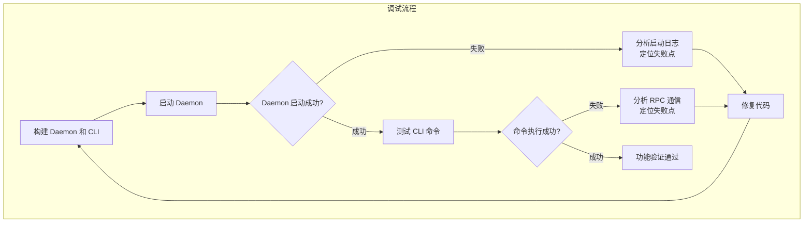

# 【PR全流程文档】Fix - Daemon 与 CLI 调试

> **文档说明**：本文档包含「前置规划」和「后置总结」两部分，记录从Bug发现到修复完成的全流程，一个PR对应一份全流程文档，归档后作为项目追溯依据。

---

## 第一部分：前置部分（开工前必完成，架构师评审通过）

### 1. 基础信息（与分支/PR绑定）

| 项目 | 内容 |
|------|------|
| 工作类型 | Bug修复（Fix） |
| PR编号 | PR-038（创建GitHub PR后补充完整） |
| 分支名称 | fix/debug-daemon-cli |
| 工作主题 | 调试和修复 NexKV Daemon 与 CLI 交互问题 |
| 负责人 | 🤖 核心开发 + AI 团队 |
| 分支创建日期 | 2026-02-04 |
| 计划开工日期 | 2026-02-04 |
| 计划CI通过日期 | 2026-02-05 |
| 关联Bug单号 | 待发现（调试过程中识别） |
| 严重等级 | □ 致命 ☑ 严重 □ 一般 □ 较低 |
| 架构师评审状态 | □ 待评审 ☑ 评审中 □ 评审通过 □ 需优化 |
| 预审批结果 | ☑ 未通过 □ 已通过（架构师签字/备注：XXX 202X-XX-XX 同意修复） |

### 2. Bug描述（发生了什么）

#### 2.1 Bug现象
- **影响范围**：Daemon 启动、CLI 与 Daemon 的 RPC 通信
- **触发条件**：启动 Daemon 进程，使用 CLI 命令与 Daemon 交互
- **实际表现**：待调试（需要实际运行发现）
- **预期行为**：
  - Daemon 应该能够正常启动并监听在指定地址（默认 127.0.0.1:9211）
  - CLI 应该能够通过 RPC 与 Daemon 通信
  - 所有 CLI 命令（node add/remove/list/ping, cluster status/topology/info/health）应该正常工作

#### 2.2 影响评估
- **影响用户**：所有使用 NexKV 的用户
- **影响数据**：无（仅影响功能使用）
- **业务影响**：高（无法正常使用 CLI 管理 Daemon）
- **紧急程度**：高（阻塞基本功能使用）

### 3. 根因分析（为什么发生）

#### 3.1 问题定位
- **问题代码位置**：待定位（调试过程中发现）
- **问题函数**：待定位
- **问题逻辑**：待分析

#### 3.2 根本原因
- **直接原因**：待分析（可能的问题点）
  - Daemon 初始化失败（7步初始化过程中的某一步）
  - Transport 层绑定端口失败
  - RPC Server/Client 创建失败
  - TreeCoordinator 启动失败
- **深层原因**：待分析
- **相关代码**：
  - `cmd/nexkvd/main.go:223-401` - Daemon 7步初始化流程
  - `cmd/nexkv/commands/node.go` - CLI Node 命令
  - `cmd/nexkv/commands/cluster.go` - CLI Cluster 命令
  - `internal/metadata/transport/tcp_transport.go` - TCP Transport 实现
  - `internal/metadata/transport/rpc_server.go` - RPC Server 实现
  - `internal/metadata/transport/rpc_client.go` - RPC Client 实现

### 4. 修复方案（怎么修）

#### 4.1 修复策略
- **修复方式**：□ 直接修复 ☑ 重构 □ 其他
- **影响范围**：待确定（根据调试结果）
- **测试策略**：
  1. 启动 Daemon 并验证日志输出
  2. 使用 CLI 执行所有命令并验证响应
  3. 检查端口绑定和网络通信
  4. 验证 RPC 消息序列化和反序列化

#### 4.2 修复设计

#### 4.3 代码变更
- **修改文件**：待确定（根据调试结果）
- **新增代码**：待定
- **删除代码**：待定

### 5. 回滚方案（如何回退）

| 回滚触发条件 | 回滚步骤 | 验证方法 |
|-------------|----------|---------|
| 修复引入新问题 | git revert commit | 重新测试基本功能 |
| 影响其他功能 | 回滚到修复前版本 | 执行回归测试 |

### 6. 风险评估与应对措施

| 风险点 | 影响等级（高/中/低） | 应对措施 |
|--------|----------------------|----------|
| Daemon 无法启动 | 高 | 检查初始化流程，添加详细日志 |
| RPC 通信失败 | 高 | 检查 Transport 层实现和消息序列化 |
| 端口占用 | 中 | 添加端口冲突检测和友好提示 |
| 配置文件错误 | 中 | 添加配置验证和错误提示 |

### 7. 架构师评审记录

| 评审轮次 | 评审日期 | 评审人（架构师） | 核心评审意见 | 优化措施 | 优化结果 |
|----------|----------|------------------|--------------|----------|----------|
| 第1轮 | 待评审 | 👤 架构师 | 待评审 | 待优化 | 待完成 |

### 8. 预审批确认
> **架构师签字/备注**：待评审

---

## 第二部分：流程节点记录（修复/CI过程追溯）

### 1. 修复过程记录

| 节点 | 完成日期 | 具体内容 | 交付物 |
|------|----------|----------|--------|
| 启动修复 | 待定 | 待定 | 待定 |
| 本地验证 | 待定 | 待定 | 待定 |
| Post文档编写 | 待定 | 待定 | 待定 |
| 架构师Post批准 | 待定 | 待定 | 待定 |
| 提交GitHub | 待定 | 待定 | 待定 |

### 2. CI流程记录

| CI轮次 | 触发时间 | 结果 | 问题详情 | 修复措施 | 修复结果 |
|--------|----------|------|----------|----------|----------|
| 第1轮 | 待定 | 待定 | 待定 | 待定 | 待定 |

### 3. 合并记录

| 合并时间 | 合并方式 | 审批人 | 备注 |
|----------|----------|--------|------|
| 待定 | 待定 | 👤 架构师 | 待定 |

---

## 第三部分：后置部分（CI通过后编写，总结/验证）

> **说明**：此部分在 CI 通过后编写，当前为 Pre 文档阶段，待开发完成后补充。

### 1. 修复成果总结

#### 1.1 修复完成情况
- **已修复**：待补充
- **修复方式**：待补充
- **与Pre文档差异**：待补充

#### 1.2 验证成果
- **单元测试**：待补充
- **回归测试**：待补充
- **性能验证**：待补充

#### 1.3 代码/文档交付物

| 类型 | 具体内容 | 链接/路径 |
|------|----------|-----------|
| 代码变更 | 待补充 | 待补充 |
| 测试用例 | 待补充 | 待补充 |

### 2. 遗留问题与预防措施

#### 2.1 遗留问题
- **未完全修复**：待补充
- **已知限制**：待补充

#### 2.2 预防措施（同类Bug预防）

| 措施类型 | 具体内容 | 负责人 | 完成时间 |
|---------|----------|--------|---------|
| 代码审查 | 待补充 | 待定 | 待定 |
| 测试增强 | 待补充 | 待定 | 待定 |
| 文档更新 | 待补充 | 待定 | 待定 |
| 监控告警 | 待补充 | 待定 | 待定 |

### 3. 后续建议

1. **监控要点**：待补充
2. **后续优化**：待补充
3. **知识沉淀**：待补充
4. **相关Bug排查**：待补充

---

## 文档归档信息

| 项目 | 内容 |
|------|------|
| 文档最终版本 | V0.1（Pre 文档） |
| 归档日期 | 2026-02-04 |
| 归档路径 | `docs/06_project_management/pr_documents/fix/2026-02-04_PR-038_Daemon_CLI_Debug_全流程.md` |
| 后续维护人 | 🤖 核心开发 + 👤 架构师 |

---

**维护者**: 🤖 AI 团队
**最后更新**: 2026-02-04
**状态**: 📋 Pre 文档 - 待架构师评审
