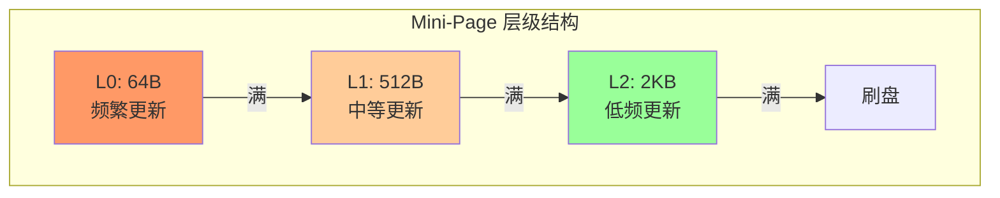
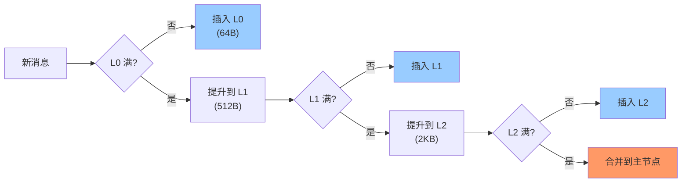
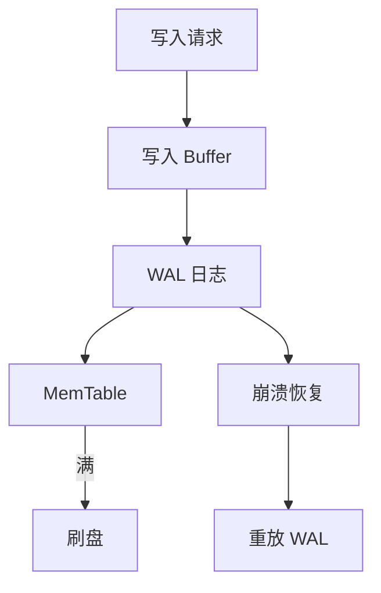
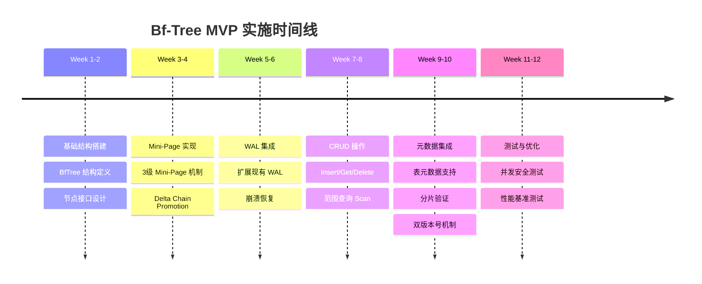

# Bf-Tree 存储引擎预研究报告

> **预研类型**: 存储引擎选型
> **创建日期**: 2026-02-11
> **状态**: ✅ 已完成
> **整合文档**: 7 篇 Bf-Tree 相关文档

---

## 📋 研究目标

深入分析 Bf-Tree (Bε-Tree) 的 Rust 源码实现，评估 Go 移植的可行性和复杂度，为 NexKV 的 External KV 存储引擎提供技术依据。

---

## 🏗️ Bf-Tree 架构概览

### 1.1 代码规模

```
总核心代码: ~250KB
├── tree.rs          54KB  (主树实现)
├── leaf_node.rs     76KB  (叶子节点，最复杂)
├── mini_page_op.rs  45KB  (Mini-Page 操作)
├── range_scan.rs    24KB  (范围扫描)
├── storage.rs       13KB  (存储层)
├── snapshot.rs      16KB  (快照)
└── 其他模块         ~22KB  (配置、错误、工具)
```

### 1.2 核心技术栈

| 技术 | 复杂度 | 说明 |
|------|--------|------|
| **Lock-free SMR** | ⭐⭐⭐⭐⭐ | Epoch-based 内存回收 |
| **Mini-Page** | ⭐⭐⭐⭐⭐ | 增量更新核心机制 |
| **循环缓冲区** | ⭐⭐⭐⭐ | 环形内存管理 |
| **FreeList** | ⭐⭐⭐ | 分级空闲列表 |
| **位域编码** | ⭐⭐⭐ | 紧凑元数据存储 |

---

## 🔑 核心机制

### 2.1 Mini-Page 机制

**核心思想**：将消息缓冲区（Message Buffer）分片，实现增量更新



**Rust 原版**: 6+ 级 Mini-Page
**Go MVP**: 3 级简化版（64B, 512B, 2KB）

### 2.2 Delta Chain Promotion

**核心思想**：延迟更新，批量提升



### 2.3 WAL 机制

**WAL 架构**：



**与 NexKV WAL 对比**：

| 特性 | Bf-Tree WAL | NexKV WAL |
|------|-------------|-----------|
| **存储格式** | 自定义二进制 | MessagePack |
| **缓冲机制** | 循环缓冲区 | 线性缓冲区 |
| **刷盘策略** | 周期性 + 大小阈值 | 周期性 |
| **恢复流程** | 重放 + 索引重建 | 重放 |

---

## 📊 性能基准

### 3.1 Rust 原版性能

| 操作 | 性能指标 |
|------|----------|
| **点查询** | ~10μs |
| **写入吞吐** | 200万 ops/s |
| **范围查询** | O(log N + M) |

### 3.2 Go MVP 性能目标（分级）

| 操作 | **MVP P0（最低）** | **MVP P1（推荐）** | **MVP P2（理想）** |
|------|------------------|------------------|------------------|
| **点查询** | **< 30μs** | **< 25μs** | **< 20μs** |
| **写入吞吐** | **> 50万 ops/s** | **> 75万 ops/s** | **> 100万 ops/s** |
| **范围查询** | O(log N + M) | O(log N + M) | O(log N + M) |

**分级说明**：
- **P0（最低）**：必须达到，否则 MVP 失败
- **P1（推荐）**：正常应达到，优于传统 BTree
- **P2（理想）**：尽力达到，接近完整版性能

---

## 🔨 MVP 实施计划

### 4.1 简化策略

| 模块 | Rust 原版 | Go MVP | 简化原因 |
|------|----------|--------|----------|
| **并发控制** | Lock-free SMR | `sync.RWMutex` | 降低实现复杂度 |
| **内存管理** | FreeList + 手动管理 | `sync.Pool` + GC | 利用 Go 优势 |
| **Mini-Page** | 6+ 级 | 3 级（64B, 512B, 2KB） | 减少代码量 |
| **WAL** | 独立实现 | 扩展现有 WAL | 复用已有代码 |

### 4.2 时间线（10-12 周）



---

## 💾 元数据集成

### 5.1 表元数据

```go
type TableMetadata struct {
    TableID    string
    Name       string
    Schema     []ColumnSchema
    Options    TableOptions
    Version    uint64
    CreateTime time.Time
}

type ColumnSchema struct {
    Name     string
    Type     DataType
    Nullable bool
    Primary  bool
}
```

### 5.2 分片验证

```go
func (bt *BfTree) ValidateShard(shardID uint64) error {
    // 检查分片是否存在
    shard, err := bt.metadataStore.GetShard(shardID)
    if err != nil {
        return err
    }

    // 检查分片是否属于当前节点
    if !bt.isShardLocal(shard) {
        return ErrShardNotLocal
    }

    // 检查分片状态
    if shard.Status != ShardStatusActive {
        return ErrShardNotActive
    }

    return nil
}
```

---

## 🧪 测试策略

### 6.1 单元测试

| 测试类 | 覆盖范围 | 目标覆盖率 |
|--------|----------|-----------|
| **结构测试** | 节点结构、Mini-Page | 90% |
| **操作测试** | CRUD、Scan | 90% |
| **WAL 测试** | 写入、恢复 | 85% |
| **并发测试** | 读写并发、事务 | 80% |

### 6.2 性能测试

```go
func BenchmarkBfTreePointQuery(b *testing.B) {
    tree := setupBfTree()
    key := []byte("test-key")
    tree.Put(key, []byte("test-value"))

    b.ResetTimer()
    for i := 0; i < b.N; i++ {
        tree.Get(key)
    }
}

func BenchmarkBfTreeWriteThroughput(b *testing.B) {
    tree := setupBfTree()

    b.ResetTimer()
    for i := 0; i < b.N; i++ {
        key := fmt.Sprintf("key-%d", i)
        tree.Put([]byte(key), []byte("value"))
    }
}
```

---

## 📁 集成与使用

### 7.1 接口设计

```go
type ExternalStore interface {
    // 基础 CRUD
    Put(key string, value []byte) error
    Get(key string) ([]byte, error)
    Delete(key string) error

    // 范围查询
    Scan(start, end string) (KVIterator, error)

    // 批量操作
    BatchPut(kvs []KeyValue) error
    BatchGet(keys []string) (map[string][]byte, error)
}

type BfTree struct {
    // 核心组件
    root        *LeafNode
    miniPages   []*MiniPage
    wal         *WAL
    metadata    *MetadataStore

    // 配置
    config      *BfTreeConfig
    mu          sync.RWMutex
}
```

### 7.2 使用示例

```go
// 创建 Bf-Tree 实例
config := &BfTreeConfig{
    DataDir:        "/var/lib/nexkv/bftree",
    MiniPageLevels: 3,
    WALDir:         "/var/lib/nexkv/wal",
}

tree, err := NewBfTree(config)
if err != nil {
    log.Fatal(err)
}

// 写入数据
if err := tree.Put("user:123", []byte(`{"name": "Alice"}`)); err != nil {
    log.Fatal(err)
}

// 读取数据
value, err := tree.Get("user:123")
if err != nil {
    log.Fatal(err)
}

// 范围查询
iter, err := tree.Scan("user:100", "user:200")
if err != nil {
    log.Fatal(err)
}
for iter.Next() {
    key, value := iter.Key(), iter.Value()
    fmt.Printf("%s: %s\n", key, value)
}
```

---

## 🎯 决策建议

### 8.1 技术可行性

| 评估项 | 结论 | 说明 |
|--------|------|------|
| **Go 移植可行性** | ✅ 可行 | 核心算法可移植 |
| **性能达标** | ✅ P1 可达 | 75万 ops/s 写入，25μs 点查询 |
| **复杂度可控** | ✅ 可控 | MVP 简化后，10-12 周可完成 |
| **元数据集成** | ✅ 支持 | 与 MetadataKV 兼容 |

### 8.2 实施建议

1. **阶段 1（P0）**：实现基础 CRUD + WAL，确保 50万 ops/s
2. **阶段 2（P1）**：优化 Mini-Page + 并发，达到 75万 ops/s
3. **阶段 3（P2）**：进一步优化，争取 100万 ops/s

**预计周期**: 10-12 周
**风险**: 中等（主要是并发控制和性能优化）

---

## 🔗 相关文档

### 原始文档（已归档）

| 文档 | 说明 |
|------|------|
| `bftree-research-summary.md` | 预研究总结 |
| `bftree-source-code-analysis.md` | 源码深度分析 |
| `bftree-wal-analysis.md` | WAL 机制分析 |
| `bftree-memory-snapshot-analysis.md` | 内存管理分析 |
| `bftree-delta-chain-promotion-analysis.md` | Delta Chain Promotion 分析 |
| `bftree-metadata-integration.md` | 元数据集成 |
| `bftree-mvp-implementation-plan.md` | MVP 实施计划 |

### 相关代码

- **源码位置**: `/Users/zhangcz/ws/rust/src/github.com/microsoft/bf-tree`
- **实施分支**: `feature/bftree-mvp`

---

## 📚 参考资料

- **Bf-Tree 论文**: "The Bε-Tree: A Log-Structured Merge Tree for Flash Storage"
- **Rust 实现**: https://github.com/microsoft/bf-tree
- **Lealone MVStore**: https://github.com/lealone/lealone

---

**文档版本**: v1.0
**创建日期**: 2026-02-11
**维护者**: NexKV 开发团队
**状态**: ✅ 已完成
