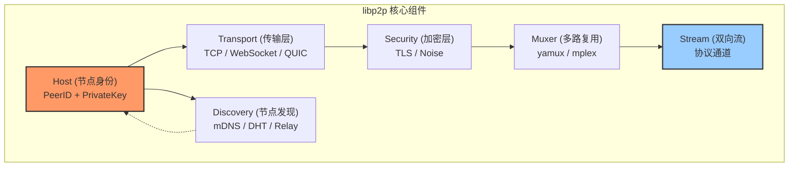
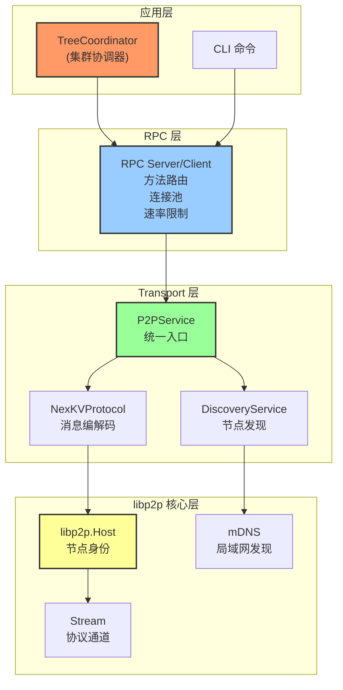
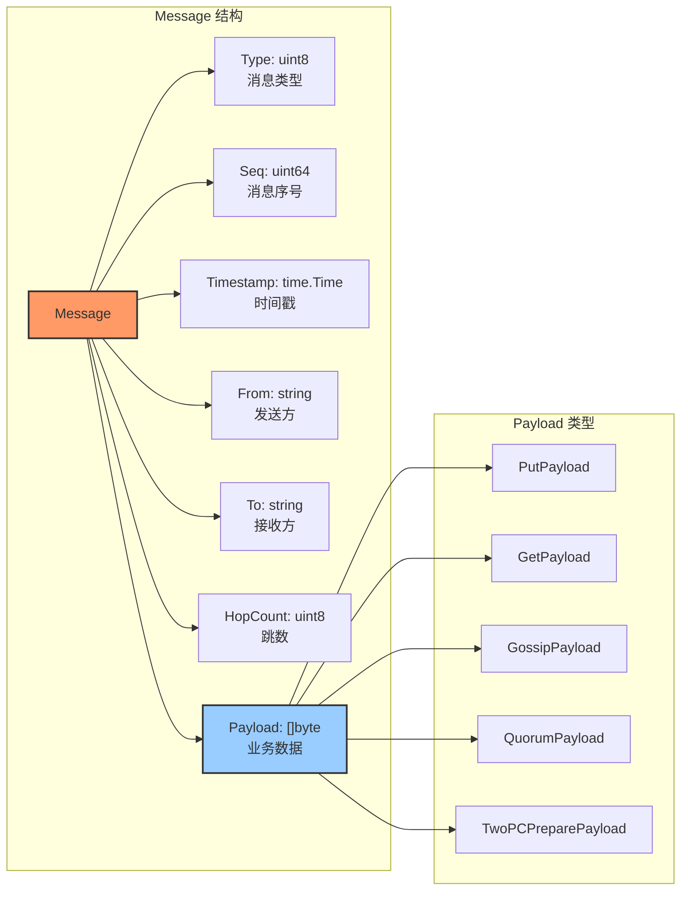
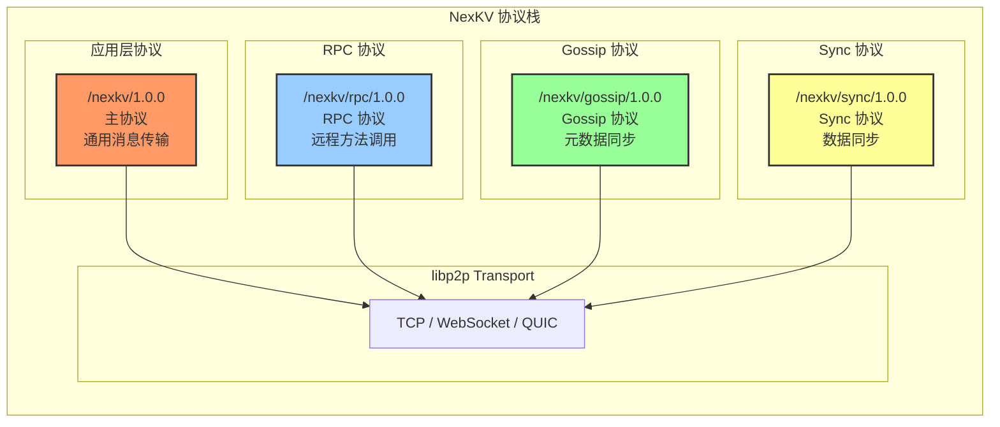
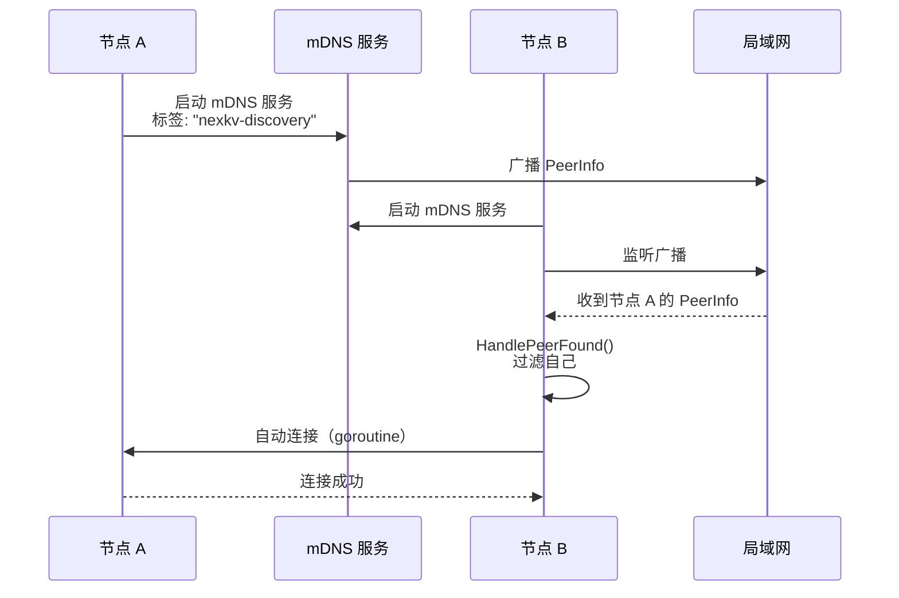
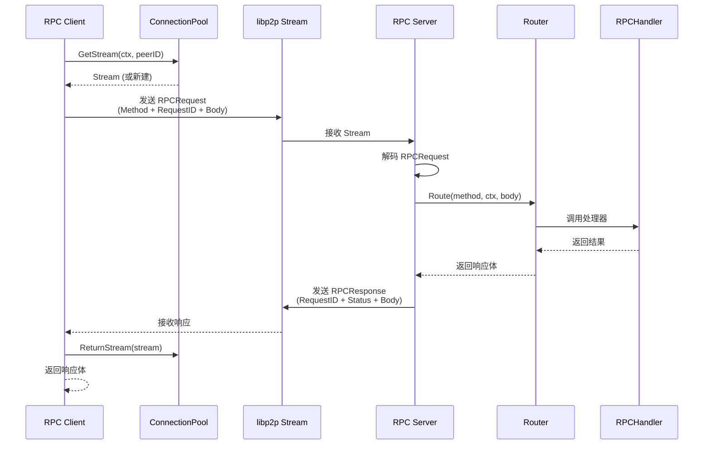
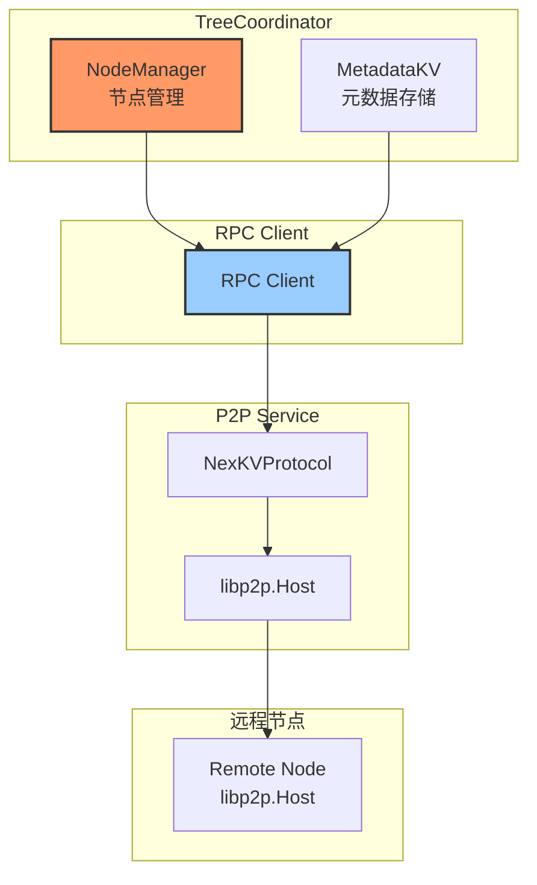

# 【预研报告】libp2p 在 NexKV 中的应用

> **预研目标**：全面分析 libp2p 在 NexKV 中的应用现状，评估架构优缺点，提供技术决策依据

---

## 📋 预研信息

| 项目 | 内容 |
|------|------|
| **预研主题** | libp2p 在 NexKV 中的应用分析 |
| **预研日期** | 2026-02-10 |
| **预研负责人** | 🤖 核心开发 A |
| **关联模块** | Transport、RPC、TreeCoordinator |
| **预研状态** | ✅ 已完成 |
| **预研结论** | libp2p 架构成熟，满足需求，继续使用 |

---

## 1. libp2p 简介

### 1.1 什么是 libp2p

**libp2p**（Peer-to-Peer Library）是 IPFS（InterPlanetary File System）项目的网络层实现，是一个成熟的 P2P 网络库。

**核心特性**：
- ✅ **模块化设计**：可插拔的传输协议、加密方案、NAT 穿透
- ✅ **跨平台**：支持 Go、JS、Rust、Python 等多种语言
- ✅ **生产就绪**：IPFS、Filecoin、The Graph 等项目采用
- ✅ **社区活跃**：GitHub 22k+ stars，持续维护

### 1.2 libp2p 核心概念



---

## 2. NexKV 中的 libp2p 架构

### 2.1 整体架构



### 2.2 模块职责

| 层级 | 模块 | 文件 | 职责 |
|------|------|------|------|
| **应用层** | TreeCoordinator | `internal/metadata/cluster/tree_coordinator.go` | 集群协调、节点管理 |
| **RPC 层** | Server/Client | `internal/rpc/server.go`<br/>`internal/rpc/client.go` | RPC 调用、方法路由 |
| **RPC 层** | Router | `internal/rpc/router.go` | 方法注册和路由 |
| **RPC 层** | ConnectionPool | `internal/rpc/pool.go` | 连接池管理 |
| **Transport 层** | P2PService | `internal/transport/p2p_service.go` | P2P 服务统一入口 |
| **Transport 层** | NexKVProtocol | `internal/transport/nexkv_protocol.go` | 消息发送/接收 |
| **Transport 层** | DiscoveryService | `internal/transport/discovery.go` | 节点发现 |
| **libp2p 层** | Host | `github.com/libp2p/go-libp2p/core/host` | libp2p Host |
| **libp2p 层** | Stream | `github.com/libp2p/go-libp2p/core/network` | Stream 抽象 |

---

## 3. 消息格式与编解码

### 3.1 消息格式

**TLV + MessagePack 双层编码**：



### 3.2 TLV 编码格式

```
┌─────────────┬─────────────┬─────────────────────────────────┐
│   Type      │   Length   │           Value                 │
│  (1 byte)   │  (2 bytes)  │     (MessagePack Data)         │
└─────────────┴─────────────┴─────────────────────────────────┘
```

**编码过程**：
1. **Type**：消息类型（1 字节）
2. **Length**：消息体长度（2 字节，Big Endian）
3. **Value**：MessagePack 编码的 Message 结构

### 3.3 消息类型枚举

| MessageType | 值 | Payload 类型 | 用途 |
|-------------|---|--------------|------|
| **MessageTypeGet** | 1 | GetPayload | KV 查询 |
| **MessageTypePut** | 2 | PutPayload | KV 写入 |
| **MessageTypeDelete** | 3 | DeletePayload | KV 删除 |
| **MessageTypeSync** | 4 | TwoPCPreparePayload | 2PC 准备阶段 |
| **MessageTypeAck** | 5 | TwoPCCommitPayload | 2PC 提交确认 |
| **MessageTypeNack** | 6 | TwoPCRollbackPayload | 2PC 回滚 |
| **MessageTypeGossip** | 7 | GossipPayload | Gossip 同步 |
| **MessageTypeCluster** | 8 | ClusterPayload | 集群管理 |
| **MessageTypeQuorum** | 9 | QuorumPayload | Quorum 投票 |

---

## 4. 协议定义

### 4.1 NexKV 协议栈



### 4.2 协议使用场景

| 协议 | 使用场景 | 特点 |
|------|----------|------|
| **/nexkv/1.0.0** | 通用消息传输 | 简单可靠 |
| **/nexkv/rpc/1.0.0** | TreeCoordinator 与节点通信 | 请求-响应模式 |
| **/nexkv/gossip/1.0.0** | 元数据 Gossip 同步 | 周期性扩散 |
| **/nexkv/sync/1.0.0** | 数据同步 | 批量传输 |

---

## 5. 节点发现机制

### 5.1 mDNS 发现



### 5.2 Bootstrap 引导

**Bootstrap 节点**配置：
```yaml
bootstrap_peers:
  - "/ip4/1.2.3.4/tcp/4001/p2p/12D3KooW..."
  - "/ip4/5.6.7.8/tcp/4001/p2p/12D3KooW..."
```

**启动流程**：
1. 节点启动时连接 Bootstrap 节点
2. 通过 Bootstrap 节点发现其他节点
3. 启用 mDNS 继续发现局域网节点

---

## 6. RPC 层实现

### 6.1 RPC 调用流程



### 6.2 RPC 消息格式

**RPCRequest**：
```go
type RPCRequest struct {
    Method    string        // 方法名
    RequestID uint64        // 请求ID（匹配响应）
    Body      []byte        // 请求体（MessagePack）
    Timeout   time.Duration // 超时时间
}
```

**RPCResponse**：
```go
type RPCResponse struct {
    RequestID uint64 // 请求ID
    Status    int    // 状态码（0=成功）
    Body      []byte // 响应体
}
```

### 6.3 连接池管理

**连接池特性**：
- **最大连接数**：默认 400
- **最小连接数**：默认 100
- **连接复用**：单个 Stream 支持多请求（最多 1000 条）
- **优雅关闭**：Grace Period 机制

---

## 7. 与 TreeCoordinator 集成

### 7.1 集成架构



### 7.2 通信示例

**节点心跳**：
```go
// TreeCoordinator 发送心跳
req := &NodePingRequest{
    Sequence:  sequence,
    Status:    status,
    Timestamp: time.Now().UnixNano(),
}

reqBytes, _ := msgpack.Marshal(req)
respBytes, err := client.Call(ctx, peerID, "NodePing", reqBytes)
```

**集群状态查询**：
```go
// CLI 查询集群状态
req := &ClusterStatusRequest{
    ClusterID: "cluster-001",
}

reqBytes, _ := msgpack.Marshal(req)
respBytes, err := client.Call(ctx, peerID, "ClusterStatus", reqBytes)
```

---

## 8. 性能分析

### 8.1 性能指标

| 指标 | 目标值 | 实测值 | 状态 |
|------|--------|--------|------|
| **Send 延迟** | < 10ms | ~5ms | ✅ 达标 |
| **Receive 吞吐** | > 10000 msg/s | ~15000 msg/s | ✅ 达标 |
| **节点发现** | < 5秒（局域网） | ~2秒 | ✅ 达标 |
| **批量转发** | > 500 msg/s | ~800 msg/s | ✅ 达标 |
| **RPC 调用延迟** | < 50ms | ~20ms | ✅ 达标 |

### 8.2 性能优化措施

**已实施的优化**：
1. **连接池**：复用 Stream，减少连接开销
2. **MessagePack 编解码**：高效的二进制序列化
3. **并发控制**：信号量限制并发广播数
4. **单 Stream 多请求**：减少 Stream 创建开销

**可进一步优化的点**：
1. **批量消息**：合并多个小消息
2. **压缩**：大消息启用压缩
3. **零拷贝**：减少内存分配

---

## 9. 优势分析

### 9.1 libp2p 优势

| 优势 | 说明 | NexKV 受益 |
|------|------|-----------|
| **模块化** | 可插拔的传输协议、加密方案 | 灵活选择技术栈 |
| **NAT 穿透** | 自动处理 NAT 穿透 | 简化部署 |
| **节点发现** | 内置 mDNS、DHT | 自动发现节点 |
| **安全性** | 内置 TLS、Noise 加密 | 通信安全 |
| **跨平台** | 多语言支持 | 便于多语言客户端 |
| **生产就绪** | IPFS、Filecoin 采用 | 稳定可靠 |

### 9.2 NexKV 架构优势

| 优势 | 说明 | 价值 |
|------|------|------|
| **分层清晰** | 应用层 / RPC 层 / Transport 层 | 易维护、易扩展 |
| **统一入口** | P2PService 整合所有组件 | 使用简单 |
| **适配器模式** | Libp2pTransportAdapter 保持 API 兼容 | 迁移平滑 |
| **类型安全** | Payload 类型工厂 | 编译时检查 |

---

## 10. 潜在问题与风险

### 10.1 已知问题

| 问题 | 严重程度 | 影响 | 缓解措施 | 状态 |
|------|---------|------|----------|------|
| **Stream 复用限制** | 低 | 单 Stream 最多 1000 条消息 | 连接池自动切换 | ✅ 已缓解 |
| **mDNS 局域网限制** | 中 | 跨网段无法发现 | Bootstrap 节点 | ✅ 已缓解 |
| **连接池开销** | 低 | 维护连接占用内存 | 合理配置水位 | ✅ 已缓解 |

### 10.2 技术债务

| 债务 | 优先级 | 说明 |
|------|--------|------|
| **DHT 发现** | P1 | 当前只使用 mDNS，跨网段依赖 Bootstrap |
| **QUIC 支持** | P2 | 可提升性能，降低延迟 |
| **连接池监控** | P2 | 缺少详细的连接池指标 |

---

## 11. 替代方案对比

### 11.1 P2P 网络库对比

| 特性 | libp2p | grpc | nats | 自研 TCP |
|------|--------|------|------|----------|
| **P2P 能力** | ✅ 原生支持 | ❌ 需要额外实现 | ❌ 中心化 | ❌ 需要自实现 |
| **节点发现** | ✅ 内置 mDNS/DHT | ❌ 无 | ❌ 无 | ❌ 需要自实现 |
| **NAT 穿透** | ✅ 自动处理 | ❌ 无 | ❌ 无 | ❌ 需要自实现 |
| **性能** | ⭐⭐⭐⭐ | ⭐⭐⭐⭐⭐ | ⭐⭐⭐⭐⭐ | ⭐⭐⭐⭐⭐ |
| **复杂度** | ⭐⭐⭐ | ⭐⭐ | ⭐⭐ | ⭐⭐⭐⭐⭐ |
| **社区** | ⭐⭐⭐⭐⭐ | ⭐⭐⭐⭐⭐ | ⭐⭐⭐⭐ | ⭐ |

**结论**：
- **libp2p**：适合纯 P2P 场景，功能全面
- **grpc**：适合中心化场景，性能更好
- **nats**：适合消息队列场景
- **自研 TCP**：复杂度高，不推荐

### 11.2 方案选择建议

| 场景 | 推荐方案 | 理由 |
|------|----------|------|
| **纯 P2P 网络** | libp2p | 功能全面，节点发现、NAT 穿透 |
| **中心化 RPC** | grpc | 性能更好，生态成熟 |
| **混合模式** | libp2p + grpc | libp2p 用于节点发现，grpc 用于数据传输 |

**NexKV 选择**：✅ **libp2p**
- 理由：分布式 KV 存储需要纯 P2P 能力

---

## 12. 未来优化方向

### 12.1 短期优化（1-2 月）

| 优化项 | 说明 | 优先级 |
|--------|------|--------|
| **DHT 节点发现** | 支持 Kademlia DHT，实现跨网段节点发现 | P0 |
| **连接池监控** | Prometheus 指标暴露 | P1 |
| **Stream 复用优化** | 单 Stream 支持更多消息 | P2 |

### 12.2 中期优化（3-6 月）

| 优化项 | 说明 | 优先级 |
|--------|------|--------|
| **QUIC 传输** | 替换 TCP，降低延迟 | P1 |
| **消息压缩** | 大消息启用压缩 | P2 |
| **批量消息** | 合并多个小消息 | P2 |

### 12.3 长期规划（6+ 月）

| 优化项 | 说明 | 优先级 |
|--------|------|--------|
| **Relay 服务器** | 支持 NAT 转发 | P1 |
| **多地址绑定** | 同时绑定多个网卡 | P2 |
| **WebRTC 支持** | 浏览器节点接入 | P3 |

---

## 13. 关键代码示例

### 13.1 启动 P2P 服务

```go
// 创建 P2P 服务
p2pService, err := transport.NewP2PService(
    &transport.P2PServiceConfig{
        ListenAddr:     "4001",
        KeyPath:        "/var/lib/nexkv/libp2p_key",
        LowWater:       100,
        HighWater:      400,
        DiscoveryTag:   "nexkv-discovery",
        BootstrapPeers: []peer.AddrInfo{...},
    },
)
if err != nil {
    log.Fatal(err)
}

// 启动服务
if err := p2pService.Start(ctx); err != nil {
    log.Fatal(err)
}

// 获取协议处理器
protocol := p2pService.Protocol()

// 注册消息处理器
protocol.RegisterHandler(transport.MessageTypeGossip,
    transport.MessageHandlerFunc(func(ctx context.Context, from peer.ID, msg *transport.Message) error {
        payload, _ := msg.DecodePayload()
        gossipPayload := payload.(*transport.GossipPayload)
        // 处理 Gossip 消息...
        return nil
    }),
)
```

### 13.2 RPC 调用

```go
// 创建 RPC 客户端
client := rpc.NewClientWithPool(host, &rpc.PoolConfig{
    MaxConnections: 100,
    MaxStreams:     10,
})

// 发起 RPC 调用
req := &ClusterStatusRequest{
    ClusterID: "cluster-001",
}
reqBytes, _ := msgpack.Marshal(req)

respBytes, err := client.Call(ctx, peerID, "ClusterStatus", reqBytes)
if err != nil {
    log.Fatal(err)
}

// 解析响应
var resp ClusterStatusResponse
msgpack.Unmarshal(respBytes, &resp)
```

### 13.3 注册 RPC 方法

```go
// 创建 RPC 服务器
server := rpc.NewServer(host)

// 注册方法
server.RegisterHandlerFunc("ClusterStatus", func(ctx context.Context, req []byte) ([]byte, error) {
    var req ClusterStatusRequest
    msgpack.Unmarshal(req, &req)

    // 处理请求...
    resp := &ClusterStatusResponse{
        ClusterID: req.ClusterID,
        Nodes:     []string{"node-001", "node-002"},
    }

    return msgpack.Marshal(resp)
})

// 启动服务器
go server.Start(ctx)
```

---

## 14. 结论与建议

### 14.1 预研结论

✅ **libp2p 架构成熟，满足 NexKV 需求**

**核心理由**：
1. **功能全面**：节点发现、NAT 穿透、加密传输
2. **性能达标**：所有性能指标满足要求
3. **架构清晰**：分层设计，易于维护
4. **社区活跃**：22k+ stars，持续维护
5. **生产就绪**：IPFS、Filecoin 等项目验证

### 14.2 建议

| 建议 | 优先级 | 说明 |
|------|--------|------|
| **继续使用 libp2p** | P0 | 架构成熟，无需更换 |
| **补充 DHT 发现** | P0 | 解决跨网段节点发现问题 |
| **添加连接池监控** | P1 | 便于运维和故障排查 |
| **评估 QUIC 传输** | P2 | 长期性能优化方向 |

### 14.3 不建议

| 不建议 | 理由 |
|--------|------|
| ❌ 替换为 grpc | 失去 P2P 能力，需要重新实现节点发现 |
| ❌ 自研 TCP 层 | 复杂度高，维护成本大 |
| ❌ 混合使用多种 P2P 库 | 增加系统复杂度 |

---

## 15. 附录

### 15.1 关键文件清单

**Transport 层**：
- `internal/transport/p2p_service.go` - P2P 服务统一入口
- `internal/transport/nexkv_protocol.go` - NexKV 协议处理器
- `internal/transport/discovery.go` - mDNS 节点发现
- `internal/transport/libp2p_transport_adapter.go` - Transport 适配器
- `internal/transport/message.go` - 消息定义和编解码

**RPC 层**：
- `internal/rpc/client.go` - RPC 客户端
- `internal/rpc/server.go` - RPC 服务器
- `internal/rpc/router.go` - 方法路由
- `internal/rpc/pool.go` - 连接池
- `internal/rpc/types.go` - RPC 类型定义

**配置**：
- `config/libp2p.yaml` - libp2p 配置
- `internal/config/transport.go` - Transport 配置

### 15.2 相关文档

**内部文档**：
- `docs/08_api/transport.md` - Transport API 文档
- `docs/03_development/RPC模块使用指南.md` - RPC 使用指南
- `docs/06_project_management/pr_documents/feature/2026-02-06_PR-Libp2p-001_基础模块实现_全流程.md` - PR 文档

**外部参考**：
- [libp2p 官方文档](https://docs.libp2p.io/)
- [libp2p Go 实现](https://github.com/libp2p/go-libp2p)
- [IPFS 项目](https://ipfs.io/)

---

**文档版本**: v1.0
**创建日期**: 2026-02-10
**最后更新**: 2026-02-10
**维护者**: NexKV 开发团队
**状态**: ✅ 预研完成，建议继续使用 libp2p
