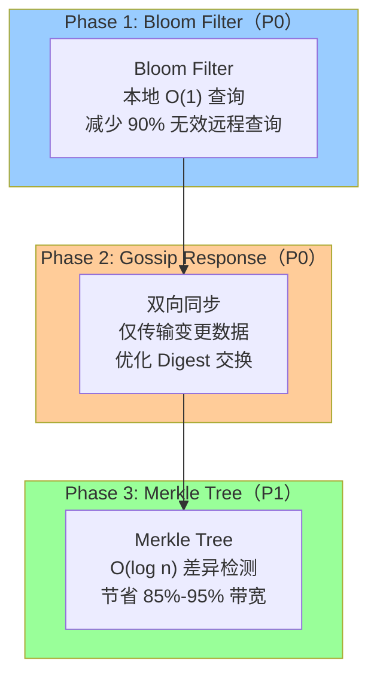
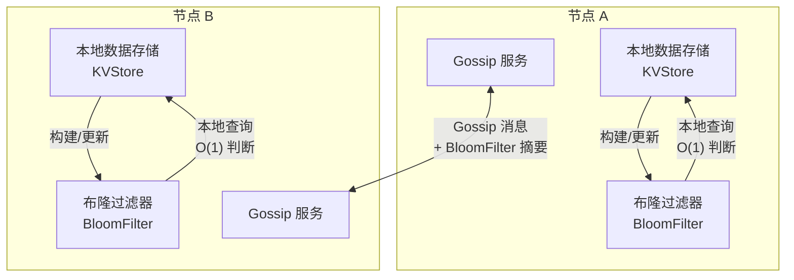
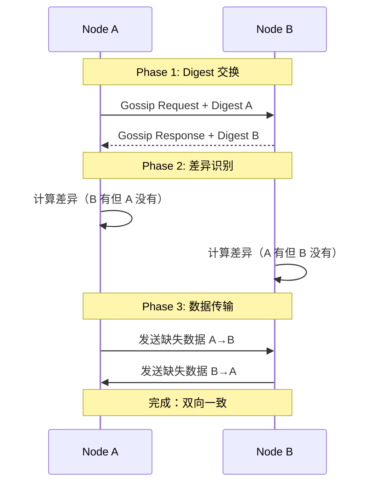
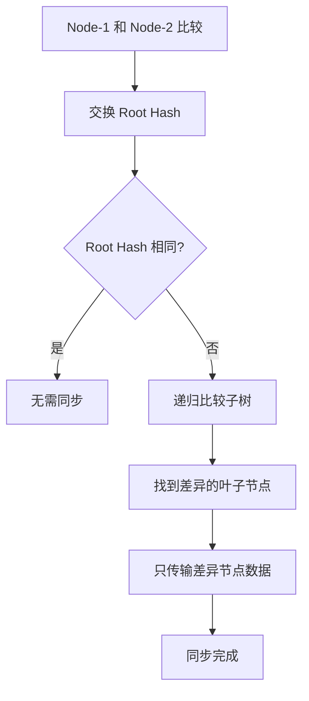

# 节点同步优化预研究报告

> **预研类型**: 性能优化
> **创建日期**: 2026-02-11
> **状态**: ✅ 已完成
> **整合文档**: 3 篇节点同步优化相关文档（Bloom Filter + Merkle Tree）

---

## 📋 研究目标

优化 NexKV 节点间的元数据同步效率，通过 **Bloom Filter + Merkle Tree** 组合方案，减少无效查询和网络开销。

---

## 🎯 问题分析

### 当前 Gossip 协议的问题

| 问题 | 说明 | 影响 |
|------|------|------|
| **无效查询多** | 节点间同步时大量请求的 key 在本地不存在 | 网络浪费 |
| **网络开销大** | 频繁的全量同步导致带宽浪费 | 扩展性差 |
| **查询延迟高** | 远程查询需要网络往返 | 性能下降 |
| **差异检测低效** | 线性扫描所有变更日志 | CPU 开销大 |

### 当前消息结构

**文件**: `internal/transport/message.go`

```go
// GossipPayload Gossip 协议专属 Payload
type GossipPayload struct {
    Digest       map[string]uint64 `msgpack:"digest"`        // key -> version
    VersionDelta uint64            `msgpack:"version_delta"` // 版本增量
    FullSync     bool              `msgpack:"full_sync"`     // 是否全量同步
}
```

---

## 🚀 优化方案总览

### 三阶段优化策略



### 预期收益

| 阶段 | 收益 | 实施周期 |
|------|------|---------|
| **Phase 1** | 减少 90% 无效远程查询 | 1 周 |
| **Phase 2** | 仅传输变更数据，减少 50% 网络开销 | 1 周 |
| **Phase 3** | 节省 85%-95% 带宽 | 2 周 |

---

## 📊 Phase 1: Bloom Filter

### 1.1 核心原理

**Bloom Filter**: 一种空间效率高的概率数据结构，用于判断一个元素是否在集合中。

| 特性 | 说明 |
|------|------|
| **时间复杂度** | O(1) 查询和插入 |
| **空间效率** | 比哈希表节省 80%-90% 空间 |
| **误判率** | 可配置（如 0.1%） |
| **缺陷** | 存在误判（False Positive），但无漏判（False Negative） |

### 1.2 架构设计



### 1.3 代码实现

```go
package gossip

import (
    "encoding/json"
    "github.com/bits-and-blooms/bloom/v3"
    "sync"
)

// BloomFilterWrapper 布隆过滤器包装器（支持序列化）
type BloomFilterWrapper struct {
    mu    sync.RWMutex
    bloom *bloom.BloomFilter
}

// NewBloomFilterWrapper 创建布隆过滤器
func NewBloomFilterWrapper(n uint, fpRate float64) *BloomFilterWrapper {
    return &BloomFilterWrapper{
        bloom: bloom.NewWithEstimates(n, fpRate),
    }
}

// Add 添加 key 到布隆过滤器
func (bf *BloomFilterWrapper) Add(key string) {
    bf.mu.Lock()
    defer bf.mu.Unlock()
    bf.bloom.AddString(key)
}

// Exists 检查 key 是否可能存在
func (bf *BloomFilterWrapper) Exists(key string) bool {
    bf.mu.RLock()
    defer bf.mu.RUnlock()
    return bf.bloom.MightContainString(key)
}

// ToJSON 序列化为 JSON（用于网络传输）
func (bf *BloomFilterWrapper) ToJSON() ([]byte, error) {
    bf.mu.RLock()
    defer bf.mu.RUnlock()
    data, err := bf.bloom.GobEncode()
    if err != nil {
        return nil, err
    }
    return json.Marshal(map[string]interface{}{
        "data": data,
        "n":    bf.bloom.Cap(),
    })
}

// FromJSON 从 JSON 反序列化
func (bf *BloomFilterWrapper) FromJSON(data []byte) error {
    bf.mu.Lock()
    defer bf.mu.Unlock()

    var m map[string]interface{}
    if err := json.Unmarshal(data, &m); err != nil {
        return err
    }

    newBF := &bloom.BloomFilter{}
    if err := newBF.GobDecode(m["data"].([]byte)); err != nil {
        return err
    }

    bf.bloom = newBF
    return nil
}
```

### 1.4 集成到 MetadataKV

```go
type MetadataKV struct {
    // 现有字段
    store      *mvstore.MVStore
    namespaces map[Namespace]*namespaceData

    // 新增字段
    bloomFilter *BloomFilterWrapper
}

func (mkv *MetadataKV) Put(ns Namespace, key string, value []byte) error {
    // 原有逻辑
    // ...

    // 更新 Bloom Filter
    mkv.bloomFilter.Add(key)

    return nil
}

func (mkv *MetadataKV) Get(ns Namespace, key string) ([]byte, uint64, error) {
    // 先通过 Bloom Filter 快速判断
    if !mkv.bloomFilter.Exists(key) {
        return nil, 0, ErrKeyNotFound
    }

    // 原有查询逻辑
    // ...
}
```

---

## 🌳 Phase 2: Gossip 双向同步

### 2.1 当前问题

当前 Gossip 是单向的（发起方 → 接收方），效率不高。

### 2.2 优化方案

**双向同步**: 双方同时交换 Digest，识别差异后各自发送缺失的数据。



### 2.3 扩展 GossipPayload

```go
type GossipPayload struct {
    // 原有字段
    Digest       map[string]uint64 `msgpack:"digest"`
    VersionDelta uint64            `msgpack:"version_delta"`
    FullSync     bool              `msgpack:"full_sync"`

    // Phase 1 新增字段
    BloomFilter  []byte  `msgpack:"bloom_filter,omitempty"`  // Bloom Filter 数据
    BFVersion    uint64  `msgpack:"bf_version,omitempty"`    // Bloom Filter 版本
    BFKeyCount   uint32  `msgpack:"bf_key_count,omitempty"`  // Bloom Filter 包含的 key 数量
}
```

---

## 🔍 Phase 3: Merkle Tree

### 3.1 核心原理

**Merkle Tree**: 一种树形数据结构，每个非叶子节点的哈希值是其子节点哈希值的组合。

| 特性 | 说明 |
|------|------|
| **差异检测** | O(log n) 树形递归比较 |
| **网络传输** | 只传输差异的叶子节点 |
| **计算开销** | 只需计算哈希 |
| **带宽节省** | 85%-95% |

### 3.2 Merkle Tree 结构

```
           Root Hash
              /    \
          Shard    Node    Table
         /  |  \    /  \     /   \
      s1  s2  s3  n1  n2  t1  t2  t3

每个节点：
- 存储：元数据的 MessagePack 序列化数据
- 哈希：SHA256(序列化数据)
- 树形：父节点哈希 = SHA256(子节点哈希列表)
```

### 3.3 工作流程



### 3.4 代码实现

```go
package metadata

import (
    "crypto/sha256"
    "encoding/hex"
)

// MerkleNode Merkle 树节点
type MerkleNode struct {
    Type     NodeType   `msgpack:"type"`      // 节点类型
    Hash     string     `msgpack:"hash"`      // 哈希值
    Children []*MerkleNode `msgpack:"children"` // 子节点
    Data     []byte     `msgpack:"data,omitempty"` // 叶子节点数据
}

type NodeType string

const (
    NodeTypeRoot   NodeType = "root"
    NodeTypeBranch NodeType = "branch"
    NodeTypeLeaf   NodeType = "leaf"
)

// ComputeHash 计算节点哈希
func (n *MerkleNode) ComputeHash() error {
    if n.Type == NodeTypeLeaf {
        // 叶子节点：哈希 = SHA256(Data)
        h := sha256.Sum256(n.Data)
        n.Hash = hex.EncodeToString(h[:])
        return nil
    }

    // 分支节点：哈希 = SHA256(子节点哈希列表)
    var childHashes []byte
    for _, child := range n.Children {
        childHashes = append(childHashes, []byte(child.Hash)...)
    }
    h := sha256.Sum256(childHashes)
    n.Hash = hex.EncodeToString(h[:])
    return nil
}

// FindDifferences 找出与另一棵树的差异
func (n *MerkleNode) FindDifferences(other *MerkleNode) []*MerkleNode {
    var diffs []*MerkleNode

    // Root Hash 相同，无差异
    if n.Hash == other.Hash {
        return diffs
    }

    // 都是叶子节点，但有不同哈希 → 差异
    if n.Type == NodeTypeLeaf && other.Type == NodeTypeLeaf {
        diffs = append(diffs, n, other)
        return diffs
    }

    // 递归比较子节点
    for i := 0; i < len(n.Children) && i < len(other.Children); i++ {
        childDiffs := n.Children[i].FindDifferences(other.Children[i])
        diffs = append(diffs, childDiffs...)
    }

    return diffs
}
```

### 3.5 扩展 GossipPayload（Phase 3）

```go
type GossipPayload struct {
    // ... 原有字段

    // Phase 3 新增字段
    MerkleRoot  []byte  `msgpack:"merkle_root,omitempty"`   // Merkle Tree 根哈希
    MerkleProof []byte  `msgpack:"merkle_proof,omitempty"`  // Merkle Proof（差异证明）
}
```

---

## 📈 性能对比

| 方案 | 差异检测复杂度 | 网络传输量 | 实施周期 |
|------|---------------|-----------|---------|
| **当前（Digest）** | O(n) 线性扫描 | 传输所有变更 | - |
| **+ Bloom Filter** | O(1) 本地查询 | 减少 90% 无效查询 | 1 周 |
| **+ 双向同步** | O(n) | 仅传输变更数据 | 1 周 |
| **+ Merkle Tree** | O(log n) | 节省 85%-95% 带宽 | 2 周 |

---

## 🔗 集成方案

### 与现有代码集成

**文件**: `internal/transport/message.go`

```go
// 扩展消息类型
const (
    // ... 现有类型
    MessageTypeGossipReply MessageType = 10 // Gossip 响应（双向同步）
    MessageTypeMerkleReq   MessageType = 11 // Merkle Tree 请求
    MessageTypeMerkleResp  MessageType = 12 // Merkle Tree 响应
)

// 扩展 GossipPayload（保持向后兼容）
type GossipPayload struct {
    // 原有字段
    Digest       map[string]uint64 `msgpack:"digest"`
    VersionDelta uint64            `msgpack:"version_delta"`
    FullSync     bool              `msgpack:"full_sync"`

    // Phase 1: Bloom Filter
    BloomFilter  []byte  `msgpack:"bloom_filter,omitempty"`
    BFVersion    uint64  `msgpack:"bf_version,omitempty"`
    BFKeyCount   uint32  `msgpack:"bf_key_count,omitempty"`

    // Phase 3: Merkle Tree
    MerkleRoot   []byte  `msgpack:"merkle_root,omitempty"`
    MerkleProof  []byte  `msgpack:"merkle_proof,omitempty"`
}
```

---

## 📝 实施建议

### 分阶段实施

| 阶段 | 内容 | 优先级 | 周期 |
|------|------|--------|------|
| **Phase 1** | Bloom Filter 本地查询优化 | P0 | 1 周 |
| **Phase 2** | Gossip 双向同步机制 | P0 | 1 周 |
| **Phase 3** | Merkle Tree 差异检测 | P1 | 2 周 |

### 关键依赖

- **Bloom Filter 库**: `github.com/bits-and-blooms/bloom/v3`
- **现有模块**: Transport、Gossip、MetadataKV

---

## 🔗 相关文档

### 原始文档（已归档）

| 文档 | 说明 |
|------|------|
| `merkle-tree_2026-01-18_gossip-optimization.md` | Merkle Tree 优化 Gossip 增量同步 |
| `bloom-filter_2026-01-18_gossip-integration.md` | Bloom Filter + Gossip 协议整合 |
| `node-sync-optimization.md` | 节点同步优化（整合版） |

### 相关代码

- `internal/transport/message.go` - 消息定义
- `internal/metadata/kvstore/metadata_kv.go` - MetadataKV 实现
- `internal/transport/gossip.go` - Gossip 协议实现

---

**文档版本**: v1.0
**创建日期**: 2026-02-11
**维护者**: NexKV 开发团队
**状态**: ✅ 已完成
