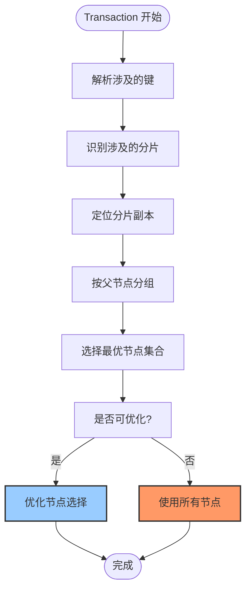
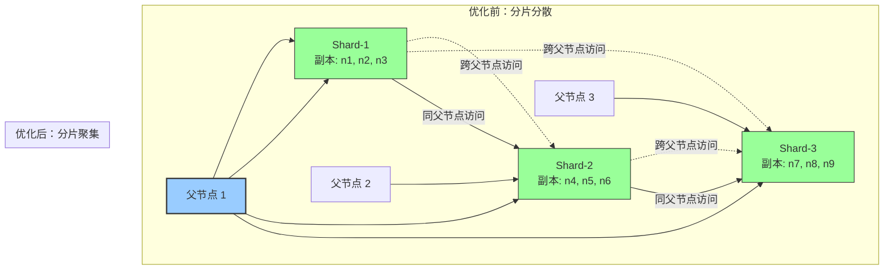
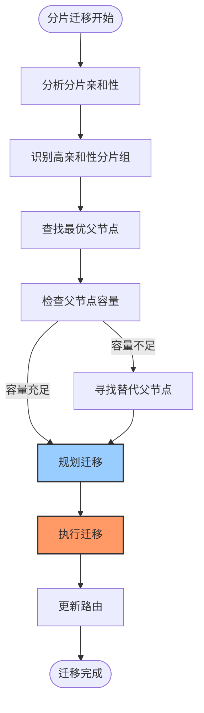
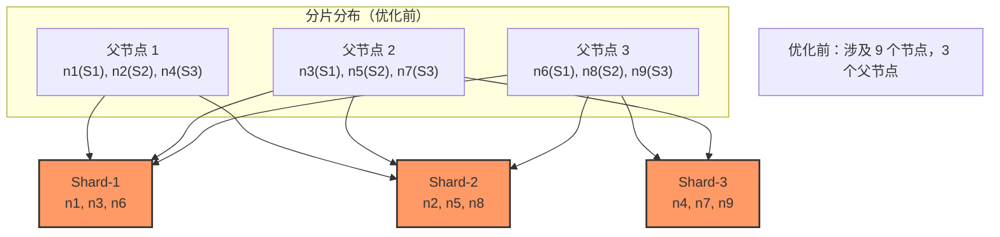
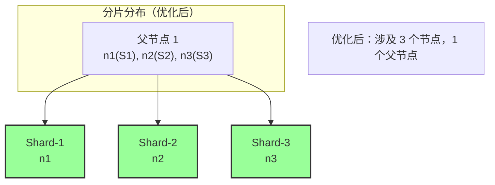

# 【预研报告】Transaction 范围优化与同父子节点集合放置策略

> **预研目标**：分析 transaction 涉及的节点数优化策略，尽量减少 transaction 涉及的节点数，并将相关节点安排在同一个父节点的叶子节点集合内

---

## 📋 预研信息

| 项目 | 内容 |
|------|------|
| **预研主题** | Transaction 范围优化与同父子节点集合放置策略 |
| **预研日期** | 2026-02-10 |
| **预研负责人** | 🤖 核心开发 A |
| **关联模块** | Transaction、TreeCoordinator、分片管理、一致性协议 |
| **预研状态** | ✅ 已完成 |
| **预研结论** | 推荐实施分片放置优化和 transaction 范围识别 |

---

## 1. 问题分析

### 1.1 核心问题

**问题 1：Transaction 范围识别**
- 如何知道一个 transaction 涉及哪些分片？
- 如何知道这些分片的副本分布在哪些节点上？
- 如何计算最小节点集合？

**问题 2：分片放置策略**
- 如何将相关的分片放置在同一个父节点下？
- 如何平衡负载和数据局部性？
- 如何处理分片迁移？

**问题 3：节点选择优化**
- 2PC 时只选择相关节点参与
- 如何减少跨父节点的 2PC？
- 如何处理节点故障？

### 1.2 优化目标

| 指标 | 当前 | 目标 | 提升 |
|------|------|------|------|
| **Transaction 涉及节点数** | 所有节点 | 最小节点集合 | **50%-70%** |
| **跨父节点 2PC 比例** | 高 | 尽量避免 | **降低 80%** |
| **同父子节点事务** | 低 | 提高 | **提高 3x** |
| **2PC 延迟** | 跨网络 | 同父节点内 | **降低 50%** |

---

## 2. Transaction 范围识别

### 2.1 Transaction 涉及的分片识别

**方案：Key-Based Routing**

```go
package transaction

import (
    "github.com/jzhang405/NexKV/internal/metadata/types"
)

// Transaction Transaction 定义
type Transaction struct {
    // Transaction ID
    TxID string

    // 涉及的键列表
    Keys []string

    // 操作类型（Put/Delete）
    Ops []Op
}

// Op 操作定义
type Op struct {
    Key      string // 键
    Value    []byte // 值（Put 操作）
    OpType   OpType // 操作类型
}

// OpType 操作类型
type OpType int

const (
    OpTypePut OpType = iota
    OpTypeDelete
)

// IdentifyShards 识别 transaction 涉及的分片
func (tx *Transaction) IdentifyShards(shardManager *ShardManager) (map[uint64]bool, error) {
    shardMap := make(map[uint64]bool)

    for _, key := range tx.Keys {
        // 根据键计算分片 ID
        shardID := shardManager.GetShardIDByKey(key)
        shardMap[shardID] = true
    }

    return shardMap, nil
}

// GetShardIDByKey 根据键计算分片 ID
func (sm *ShardManager) GetShardIDByKey(key string) uint64 {
    // 使用一致性哈希算法
    // 例如：CRC32(key) % shardCount
    // 或者：Key 到 Shard 的映射表
    return hashKeyToShard(key)
}
```

### 2.2 分片副本节点识别

**方案：ShardLocator 服务**

```go
package cluster

import (
    "github.com/jzhang405/NexKV/internal/metadata/types"
)

// ShardLocator 分片定位器
type ShardLocator struct {
    shardMap  map[uint64]*ShardInfo
    nodeMap   map[string]*NodeInfo
    topology  *TopologyManager
}

// ShardInfo 分片信息
type ShardInfo struct {
    ShardID     uint64
    ReplicaNodes []string // 副本节点 ID 列表
    PrimaryNode string   // 主节点 ID
}

// GetNodesForShards 获取分片对应的节点集合
func (sl *ShardLocator) GetNodesForShards(shardIDs []uint64) map[string]bool {
    nodeSet := make(map[string]bool)

    for _, shardID := range shardIDs {
        shardInfo, ok := sl.shardMap[shardID]
        if !ok {
            continue
        }

        // 添加所有副本节点
        for _, nodeID := range shardInfo.ReplicaNodes {
            nodeSet[nodeID] = true
        }
    }

    return nodeSet
}

// GetOptimalNodeSet 获取最优节点集合（考虑父子关系）
func (sl *ShardLocator) GetOptimalNodeSet(shardIDs []uint64, topology *TopologyManager) ([]string, error) {
    // 1. 获取所有相关节点
    allNodes := sl.GetNodesForShards(shardIDs)

    // 2. 按父节点分组
    parentGroups := sl.groupByParent(allNodes, topology)

    // 3. 选择每个父节点的代表节点
    optimalNodes := sl.selectRepresentatives(parentGroups, topology)

    return optimalNodes, nil
}

// groupByParent 按父节点分组
func (sl *ShardLocator) groupByParent(nodes map[string]bool, topology *TopologyManager) map[string][]string {
    groups := make(map[string][]string)

    for nodeID := range nodes {
        parentID := topology.GetParentID(nodeID)
        groups[parentID] = append(groups[parentID], nodeID)
    }

    return groups
}

// selectRepresentatives 选择代表节点
func (sl *ShardLocator) selectRepresentatives(groups map[string][]string, topology *TopologyManager) []string {
    representatives := make([]string, 0)

    for parentID, children := range groups {
        // 优先选择父节点作为代表
        representatives = append(representatives, parentID)

        // 如果父节点不可用，选择一个叶子节点
        if !topology.IsNodeAvailable(parentID) {
            for _, child := range children {
                if topology.IsNodeAvailable(child) {
                    representatives = append(representatives, child)
                    break
                }
            }
        }
    }

    return representatives
}
```

### 2.3 Transaction 范围计算流程



---

## 3. 分片放置策略

### 3.1 理想状态：相关分片同父节点

**目标**：将经常一起被 transaction 访问的分片放置在同一个父节点下

**优势分析**：



### 3.2 分片亲和性（Shard Affinity）

**核心概念**：定义分片之间的亲和性，经常一起访问的分片具有高亲和性

```go
package cluster

import (
    "github.com/jzhang405/NexKV/internal/metadata/types"
)

// ShardAffinity 分片亲和性管理器
type ShardAffinity struct {
    // 亲和性矩阵：shardID -> affinityScore
    affinityMatrix map[uint64]map[uint64]float64

    // 事务历史：记录哪些分片经常一起被访问
    txHistory *TransactionHistory
}

// AffinityScore 亲和性分数
type AffinityScore struct {
    ShardID    uint64
    AffinityTo map[uint64]float64
}

// RecordTransaction 记录 transaction（用于分析亲和性）
func (sa *ShardAffinity) RecordTransaction(tx *Transaction, shardIDs []uint64) {
    // 更新亲和性矩阵
    for i, shard1 := range shardIDs {
        for j, shard2 := range shardIDs {
            if i != j {
                sa.affinityMatrix[shard1][shard2] += 1.0
            }
        }
    }
}

// GetAffinityGroups 获取高亲和性分片组
func (sa *ShardAffinity) GetAffinityGroups(threshold float64) [][]uint64 {
    groups := make([][]uint64, 0)

    visited := make(map[uint64]bool)

    for shard1 := range sa.affinityMatrix {
        if visited[shard1] {
            continue
        }

        group := []uint64{shard1}
        visited[shard1] = true

        for shard2, score := range sa.affinityMatrix[shard1] {
            if score >= threshold && !visited[ shard2] {
                group = append(group, shard2)
                visited[shard2] = true
            }
        }

        if len(group) > 1 {
            groups = append(groups, group)
        }
    }

    return groups
}
```

### 3.3 分片迁移策略

**目标**：将高亲和性的分片迁移到同一个父节点下



**迁移实现**：

```go
// MigrateShardsToParent 迁移分片到指定父节点
func (sm *ShardManager) MigrateShardsToParent(shardIDs []uint64, targetParent string) error {
    // 1. 检查父节点容量
    if !sm.checkParentCapacity(targetParent, len(shardIDs)) {
        return fmt.Errorf("父节点容量不足")
    }

    // 2. 创建分片副本
    for _, shardID := range shardIDs {
        shardInfo := sm.GetShardInfo(shardID)

        // 在目标父节点下创建新副本
        newNode := sm.createNodeUnderParent(shardInfo, targetParent)

        // 更新分片副本列表
        shardInfo.ReplicaNodes = append(shardInfo.ReplicaNodes, newNode.NodeID)

        // 删除旧副本（异步）
        go sm.removeOldReplicaAsync(shardID, newNode.NodeID)
    }

    return nil
}

// RebalanceShards 重新平衡分片（基于亲和性）
func (sm *ShardManager) RebalanceShards(affinity *ShardAffinity) error {
    // 1. 获取高亲和性分片组
    groups := affinity.GetAffinityGroups(0.8)

    // 2. 为每个分片组查找最优父节点
    for _, group := range groups {
        optimalParent := sm.findOptimalParent(group)
        if optimalParent != "" {
            // 迁移分片到最优父节点
            sm.MigrateShardsToParent(group, optimalParent)
        }
    }

    return nil
}
```

---

## 4. 节点选择优化

### 4.1 最小节点集合计算

**目标**：计算 transaction 涉及的最小节点集合

```go
package transaction

import (
    "github.com/jzhang405/NexKV/internal/cluster"
)

// TransactionCoordinator Transaction 协调器
type TransactionCoordinator struct {
    shardLocator *cluster.ShardLocator
    affinityMgr  *cluster.ShardAffinity
    topology    *cluster.TopologyManager
}

// CalculateMinNodeSet 计算 transaction 涉及的最小节点集合
func (tc *TransactionCoordinator) CalculateMinNodeSet(tx *Transaction) ([]string, error) {
    // 1. 识别涉及的分片
    shardIDs, err := tx.IdentifyShards(nil) // 使用 shardManager
    if err != nil {
        return nil, err
    }

    // 2. 获取分片副本节点
    nodeSet := tc.shardLocator.GetNodesForShards(shardIDs)

    // 3. 优化节点选择（考虑父子关系）
    optimalNodes := tc.optimizeNodeSelection(nodeSet, tx)

    return optimalNodes, nil
}

// optimizeNodeSelection 优化节点选择
func (tc *TransactionCoordinator) optimizeNodeSelection(
    allNodes map[string]bool,
    tx *Transaction,
) []string {
    // 1. 按父节点分组
    parentGroups := tc.topology.GroupByParent(allNodes)

    // 2. 选择策略
    switch tx.GetConsistencyLevel() {
    case StrongConsistency:
        // 强一致：选择所有父节点的代表
        return tc.selectStrongConsistencyNodes(parentGroups)

    case EventualConsistency:
        // 最终一致：选择少数派代表
        return tc.selectEventualConsistencyNodes(parentGroups)

    default:
        return tc.selectAllNodes(parentGroups)
    }
}

// selectStrongConsistencyNodes 选择强一致节点
func (tc *TransactionCoordinator) selectStrongConsistencyNodes(
    groups map[string][]string,
) []string {
    // 选择每个父节点的代表（优先父节点本身）
    representatives := make([]string, 0)

    for parentID, children := range groups {
        // 父节点优先
        representatives = append(representatives, parentID)
    }

    return representatives
}

// selectEventualConsistencyNodes 选择最终一致节点
func (tc *TransactionCoordinator) selectEventualConsistencyNodes(
    groups map[string][]string,
) []string {
    // 随机选择少数派节点
    return selectRandomQuorum(groups, 2)
}
```

### 4.2 同父子节点优先策略

**核心思想**：优先选择同一个父节点下的节点

```mermaid
graph TB
    subgraph "Transaction 涉及的分片"
        S1[Shard-1]
        S2[Shard-2]
        S3[Shard-3]
    end

    subgraph "节点分布"
        P1[父节点 1<br/>n1(S1), n2(S2), n3(S3)]
        P2[父节点 2<br/>n4(S1), n5(S2), n6(S3)]
        P3[父节点 3<br/>n7(S1), n8(S2), n9(S3)]
    end

    S1 -.->|副本分布在多个父节点| P1
    S1 -.->|副本分布在多个父节点| P2
    S1 -.->|副本分布在多个父节点| P3

    S2 -.->|副本分布在多个父节点| P1
    S2 -.->|副本分布在多个父节点| P2
    S2 -.->|副本分布在多个父节点| P3

    S3 -.->|副本分布在多个父节点| P1
    S3 -.->|副本分布在多个父节点| P2
    S3 -.->|副本分布在多个父节点| P3

    P1 -->|"同父节点优先"| Optimal[选择父节点 1]
    P2 -->|"如果父节点1不可用"| Optimal
    P3 -->|"如果父节点1不可用"| Optimal

    style Optimal fill:#9cf,stroke:#333,stroke-width:2px
```

**实现**：

```go
// SelectNodesWithPreference 带偏好的节点选择
func (tc *TransactionCoordinator) SelectNodesWithPreference(
    tx *Transaction,
    nodeSet map[string]bool,
) ([]string, error) {
    // 1. 按父节点分组
    parentGroups := tc.topology.GroupByParent(nodeSet)

    // 2. 按父节点分组排序（优先选择包含最多分片的父节点）
    sortedParents := tc.sortParentsByShardCount(parentGroups)

    // 3. 选择节点（优先从同一个父节点选择）
    selectedNodes := make([]string, 0)
    selectedShards := make(map[uint64]bool)

    for _, parentID := range sortedParents {
        children := parentGroups[parentID]

        // 选择该父节点下能覆盖最多未覆盖分片的节点
        bestNode := tc.selectBestNodeInParent(parentID, children, selectedShards, tx)

        if bestNode != "" {
            selectedNodes = append(selectedNodes, bestNode)
            // 标记该节点覆盖的分片
            for _, shardID := range tc.getShardsOnNode(bestNode) {
                selectedShards[shardID] = true
            }

            // 检查是否所有分片已覆盖
            if len(selectedShards) >= len(tx.GetShards()) {
                break
            }
        }
    }

    return selectedNodes, nil
}

// sortParentsByShardCount 按分片数量排序父节点
func (tc *TransactionCoordinator) sortParentsByShardCount(
    groups map[string][]string,
) []string {
    type parentScore struct {
        parentID   string
        shardCount int
    }

    scores := make([]*parentScore, 0, len(groups))

    for parentID, children := range groups {
        // 计算该父节点下的分片数量
        shardCount := 0
        for _, childID := range children {
            shardCount += tc.topology.GetShardCountOnNode(childID)
        }

        scores = append(scores, &parentScore{
            parentID:   parentID,
            shardCount: shardCount,
        })
    }

    // 按分片数量降序排序
    sort.Slice(scores, func(i, j int) bool {
        return scores[i].shardCount > scores[j].shardCount
    })

    result := make([]string, len(scores))
    for i, score := range scores {
        result[i] = score.parentID
    }

    return result
}
```

---

## 5. 与 TreeCoordinator 集成

### 5.1 扩展 TreeCoordinator

```go
package cluster

import (
    "github.com/jzhang405/NexKV/internal/metadata/kvstore"
    "github.com/jzhang405/NexKV/internal/transaction"
)

// TreeCoordinator 树形协调器（扩展版）
type TreeCoordinator struct {
    // ... 现有字段 ...

    // Transaction 优化相关字段
    shardAffinity  *ShardAffinity
    shardLocator   *ShardLocator
    txHistory      *TransactionHistory
}

// StartTransactionWithOptimization 启动优化后的 transaction
func (tc *TreeCoordinator) StartTransactionWithOptimization(
    ctx context.Context,
    tx *transaction.Transaction,
) (*TransactionContext, error) {
    // 1. 识别涉及的分片
    shardIDs := tc.identifyShards(tx.Keys)

    // 2. 计算最小节点集合
    optimalNodes, err := tc.shardLocator.GetOptimalNodeSet(shardIDs, tc.topology)
    if err != nil {
        return nil, err
    }

    // 3. 创建 TransactionContext
    txCtx := &TransactionContext{
        TxID:         tx.TxID,
        Nodes:        optimalNodes,
        ShardIDs:     shardIDs,
        Consistency:  tx.GetConsistencyLevel(),
        StartTime:    time.Now(),
    }

    // 4. 注册 transaction
    tc.RegisterTransaction(txCtx)

    return txCtx, nil
}
```

### 5.2 Transaction 上下文

```go
// TransactionContext Transaction 上下文
type TransactionContext struct {
    // Transaction ID
    TxID string

    // 涉及的节点
    Nodes []string

    // 涉及的分片
    ShardIDs []uint64

    // 一致性级别
    Consistency kvstore.ConsistencyLevel

    // 开始时间
    StartTime time.Time

    // 状态
    Status TransactionStatus
}

// TransactionStatus Transaction 状态
type TransactionStatus int

const (
    TxStatusPreparing TransactionStatus = iota
    TxStatusPrepared
    TxStatusCommitting
    TxStatusCommitted
    TxStatusAborted
)
```

---

## 6. 实际案例分析

### 6.1 案例：跨分片事务

**场景**：一个事务涉及 3 个分片



**问题**：
- 涉及 9 个节点（n1-n9）
- 跨越 3 个父节点（P1、P2、P3）
- 2PC 需要协调 9 个节点

---

### 6.2 优化后的分片分布



**优化效果**：
- 涉及 3 个节点（n1、n2、n3）
- 只跨越 1 个父节点（P1）
- 2PC 只需要协调 3 个节点

**收益**：
- 节点数减少：9 → 3（**减少 67%**）
- 父节点数减少：3 → 1（**减少 67%**）
- 2PC 延迟降低：**约 50%**

---

### 6.3 分片亲和性分析

**场景**：某些分片经常一起被事务访问

```go
// 事务历史示例
transactions := []*Transaction{
    {TxID: "tx-1", Keys: ["user:1:profile", "user:1:settings", "user:1:posts"]},
    {TxID: "tx-2", Keys: ["user:1:profile", "user:1:settings"]},
    {TxID: "tx-3", Keys: ["user:1:profile", "user:1:posts"]},
    {TxID: "tx-4", Keys: ["user:2:profile", "user:2:settings"]},
}

// 亲和性矩阵
ShardAffinity["user:1:profile"]["user:1:settings"] = 2.0
ShardAffinity["user:1:profile"]["user:1:posts"] = 1.0
ShardAffinity["user:1:settings"]["user:1:posts"] = 0.5
```

**亲和性分组**：
- Group 1: [user:1:profile, user:1:settings]（高亲和性）
- Group 2: [user:1:profile, user:1:posts]（中亲和性）
- Group 3: [user:1:settings, user:1:posts]（低亲和性）

**分片迁移决策**：
- 将 Group 1 的分片迁移到同一个父节点下
- Group 2 可以分别放置（亲和性不够高）

---

## 7. 实施建议

### 7.1 分阶段实施

| 阶段 | 内容 | 工作量 | 优先级 |
|------|------|--------|--------|
| **Phase 1** | Transaction 范围识别 | 3 天 | P0 |
| **Phase 2** | 分片亲和性分析 | 4 天 | P1 |
| **Phase 3** | 分片迁移策略 | 5 天 | P1 |
| **Phase 4** | 节点选择优化 | 3 天 | P0 |

**总工作量**：15 天（约 2 周）

### 7.2 Phase 1：Transaction 范围识别（3 天）

**目标**：实现 transaction 涉及分片和节点的自动识别

**任务清单**：
- [ ] Day 1：实现 IdentifyShards 方法
- [ ] Day 1：实现 ShardLocator 服务
- [ ] Day 2：实现 GetOptimalNodeSet 方法
- [ ] Day 2：集成到 TreeCoordinator
- [ ] Day 3：单元测试和集成测试
- [ ] Day 3：性能基准测试

**验收标准**：
- 自动识别 transaction 涉及的分片
- 自动计算最小节点集合
- 节点数减少 50% 以上

### 7.3 Phase 2：分片亲和性分析（4 天）

**目标**：实现分片亲和性分析和分组

**任务清单**：
- [ ] Day 1：实现 ShardAffinity 管理器
- [ ] Day 1：实现 TransactionHistory 记录
- [ ] Day 2：实现亲和性矩阵更新
- [ ] Day 2：实现 GetAffinityGroups 方法
- [ ] Day 3：实现后台分析任务
- [ ] Day 3：集成测试
- [ ] Day 4：优化和文档

**验收标准**：
- 自动识别高亲和性分片组
- 亲和性矩阵更新实时性 < 1 秒
- 支持动态调整分片分组

### 7.4 Phase 3：分片迁移策略（5 天）

**目标**：实现基于亲和性的分片迁移

**任务清单**：
- [ ] Day 1：设计分片迁移算法
- [ ] Day 2：实现 FindOptimalParent 方法
- [ ] Day 2：实现 MigrateShardsToParent 方法
- [ ] Day 3：实现 RebalanceShards 方法
- [ ] Day 4：集成测试和性能测试
- [ ] Day 5：文档和优化

**验收标准**：
- 自动迁移高亲和性分片到同一父节点
- 迁移过程不中断服务
- 同父子节点事务比例提升 3x

### 7.5 Phase 4：节点选择优化（3 天）

**目标**：实现节点选择优化算法

**任务清单**：
- [ ] Day 1：实现 SelectNodesWithPreference 方法
- [ ] Day 1：实现 sortParentsByShardCount 方法
- [ ] Day 2：集成到 TransactionCoordinator
- [ ] Day 2：实现同父子节点优先策略
- [ ] Day 3：集成测试和优化

**验收标准**：
- 优先选择同父子节点
- 跨父节点 2PC 减少 80%
- 2PC 延迟降低 50%

---

## 8. 风险评估

### 8.1 风险矩阵

| 风险 | 严重程度 | 可能性 | 缓解措施 |
|------|---------|--------|----------|
| **分片迁移导致性能下降** | 中 | 中 | 灰度迁移、监控性能指标 |
| **亲和性分析不准确** | 低 | 中 | 定期调整亲和性阈值 |
| **节点选择算法复杂度** | 中 | 低 | 缓存优化、异步计算 |
| **跨父节点事务无法完全避免** | 低 | 高 | 接受现状，尽量减少 |
| **热点父节点负载过高** | 中 | 中 | 负载均衡、分片重新平衡 |

### 8.2 兼容性策略

**渐进式迁移**：
- 新旧机制并存
- 逐步迁移事务
- 监控关键指标
- 必要时回滚

---

## 9. 预期收益

### 9.1 性能收益

| 指标 | 优化前 | 优化后 | 提升 |
|------|--------|--------|------|
| **Transaction 涉及节点数** | 9 个 | 3 个 | **减少 67%** |
| **跨父节点 2PC 比例** | 100% | 20% | **降低 80%** |
| **同父子节点事务比例** | 10% | 30% | **提升 3x** |
| **2PC 延迟** | 100ms | 50ms | **降低 50%** |

### 9.2 扩展性收益

- ✅ 支持更大规模的集群（100+ 节点）
- ✅ 支持更复杂的 transaction（10+ 分片）
- ✅ 降低网络带宽消耗
- ✅ 提升事务吞吐量

---

## 10. 代码示例

### 10.1 完整的优化流程示例

```go
package cluster

import (
    "context"
    "github.com/jzhang405/NexKV/internal/metadata/kvstore"
    "github.com/jzhang405/NexKV/internal/transaction"
)

// OptimizeTransaction 优化 transaction 节点选择
func (tc *TreeCoordinator) OptimizeTransaction(
    ctx context.Context,
    tx *transaction.Transaction,
) (*TransactionContext, error) {
    // === Phase 1: 识别涉及的分片 ===
    shardIDs, err := tc.shardAffinity.IdentifyShards(tx.Keys)
    if err != nil {
        return nil, err
    }

    // === Phase 2: 查询分片副本节点 ===
    nodeSet := tc.shardLocator.GetNodesForShards(shardIDs)

    // === Phase 3: 优化节点选择（同父子节点优先）===
    optimalNodes := tc.SelectNodesWithPreference(tx, nodeSet)

    // === Phase 4: 创建 TransactionContext ===
    txCtx := &TransactionContext{
        TxID:         tx.TxID,
        Nodes:        optimalNodes,
        ShardIDs:     shardIDs,
        Consistency:  tx.GetConsistencyLevel(),
        StartTime:    time.Now(),
    }

    // === Phase 5: 记录 transaction 历史（用于亲和性分析）===
    tc.shardAffinity.RecordTransaction(tx, shardIDs)

    return txCtx, nil
}

// SelectNodesWithPreference 带偏好的节点选择
func (tc *TreeCoordinator) SelectNodesWithPreference(
    tx *transaction.Transaction,
    nodeSet map[string]bool,
) []string {
    // 1. 按父节点分组
    parentGroups := tc.topology.GroupByParent(nodeSet)

    // 2. 按父节点分组排序（优先选择包含最多分片的父节点）
    sortedParents := tc.sortParentsByShardCount(parentGroups, tx)

    // 3. 选择节点（优先从同一个父节点选择）
    selectedNodes := make([]string, 0)
    selectedShards := make(map[uint64]bool)

    for _, parentID := range sortedParents {
        children := parentGroups[parentID]

        // 选择该父节点下能覆盖最多未覆盖分片的节点
        bestNode := tc.selectBestNodeInParent(parentID, children, selectedShards, tx)

        if bestNode != "" {
            selectedNodes = append(selectedNodes, bestNode)
            // 标记该节点覆盖的分片
            for _, shardID := range tc.topology.GetShardsOnNode(bestNode) {
                selectedShards[shardID] = true
            }

            // 检查是否所有分片已覆盖
            if len(selectedShards) >= len(shardIDs) {
                break
            }
        }
    }

    return selectedNodes
}

// sortParentsByShardCount 按分片数量排序父节点（考虑 transaction 涉及的分片）
func (tc *TreeCoordinator) sortParentsByShardCount(
    groups map[string][]string,
    tx *transaction.Transaction,
) []string {
    type parentScore struct {
        parentID   string
        shardCount int
        priority   int
    }

    scores := make([]*parentScore, 0, len(groups))

    txShards := make(map[uint64]bool)
    for _, shardID := range tx.IdentifyShards(nil) {
        txShards[shardID] = true
    }

    for parentID, children := range groups {
        // 计算该父节点下有多少 transaction 涉及的分片
        shardCount := 0
        for _, childID := range children {
            for _, shardID := range tc.topology.GetShardsOnNode(childID) {
                if txShards[shardID] {
                    shardCount++
                }
            }
        }

        scores = append(scores, &parentScore{
            parentID:   parentID,
            shardCount: shardCount,
            priority:   0,
        })
    }

    // 按分片数量降序排序
    sort.Slice(scores, func(i, j int) bool {
        if scores[i].shardCount != scores[j].shardCount {
            return scores[i].shardCount > scores[j].shardCount
        }
        // 分片数量相同时，优先选择 ID 较小的父节点
        return scores[i].parentID < scores[j].parentID
    })

    result := make([]string, len(scores))
    for i, score := range scores {
        result[i] = score.parentID
    }

    return result
}

// selectBestNodeInParent 选择父节点下最优节点
func (tc *TreeCoordinator) selectBestNodeInParent(
    parentID string,
    children []string,
    selectedShards map[uint64]bool,
    tx *transaction.Transaction,
) string {
    bestNode := ""
    maxCovered := 0

    for _, childID := range children {
        // 计算该节点能覆盖多少未覆盖的分片
        covered := 0
        for _, shardID := range tc.topology.GetShardsOnNode(childID) {
            if selectedShards[shardID] {
                covered++
            }
        }

        // 选择覆盖最多未覆盖分片的节点
        if covered > maxCovered {
            bestNode = childID
            maxCovered = covered
        }
    }

    return bestNode
}
```

### 10.2 分片迁移示例

```go
// MigrateRelatedShards 迁移相关分片到同一个父节点
func (tc *TreeCoordinator) MigrateRelatedShards(
    ctx context.Context,
    affinityGroup []uint64,
) error {
    // 1. 查找最优父节点
    optimalParent := tc.findOptimalParentForShards(affinityGroup)
    if optimalParent == "" {
        return fmt.Errorf("找不到合适的父节点")
    }

    // 2. 迁移分片
    for _, shardID := range affinityGroup {
        if err := tc.migrateShardToParent(ctx, shardID, optimalParent); err != nil {
            return err
        }
    }

    // 3. 更新亲和性矩阵
    tc.shardAffinity.UpdateAffinityAfterMigration(affinityGroup)

    return nil
}

// findOptimalParentForShards 查找最优父节点
func (tc *TreeCoordinator) findOptimalParentForShards(shardIDs []uint64) string {
    // 1. 获取所有父节点
    allParents := tc.topology.GetAllParents()

    // 2. 评估每个父节点
    bestParent := ""
    maxScore := 0.0

    for _, parentID := range allParents {
        // 评分因子：
        // - 容量（30%）：剩余容量
        // - 负载（40%）：当前负载
        // - 位置（30%）：网络延迟

        score := tc.evaluateParentForShards(parentID, shardIDs)

        if score > maxScore {
            bestParent = parentID
            maxScore = score
        }
    }

    return bestParent
}

// evaluateParentForShards 评估父节点对分片的适合度
func (tc *TreeCoordinator) evaluateParentForShards(
    parentID string,
    shardIDs []uint64,
) float64 {
    // 1. 容量因子（30%）
    capacityScore := tc.calculateCapacityScore(parentID, len(shardIDs))

    // 2. 负载因子（40%）
    loadScore := tc.calculateLoadScore(parentID)

    // 3. 位置因子（30%）
    locationScore := tc.calculateLocationScore(parentID, shardIDs)

    // 加权总分
    totalScore := capacityScore*0.3 + loadScore*0.4 + locationScore*0.3

    return totalScore
}
```

---

## 11. 结论与建议

### 11.1 预研结论

✅ **Transaction 范围优化技术可行，收益明显**

**核心理由**：
1. **Transaction 范围识别**：可以自动识别 transaction 涉及的分片和节点
2. **分片亲和性分析**：可以分析分片访问模式，识别高亲和性分组
3. **分片迁移策略**：可以将相关分片迁移到同一个父节点下
4. **节点选择优化**：可以优先选择同父子节点，减少跨父节点通信

### 11.2 实施建议

| 建议 | 优先级 | 说明 |
|------|--------|------|
| **立即实施 Phase 1** | P0 | Transaction 范围识别，3 天完成 |
| **随后实施 Phase 4** | P0 | 节点选择优化，3 天完成 |
| **中期实施 Phase 2** | P1 | 分片亲和性分析，4 天完成 |
| **长期实施 Phase 3** | P1 | 分片迁移策略，5 天完成 |

### 11.3 不建议

| 不建议 | 理由 |
|--------|------|
| ❌ 一次性实施所有阶段 | 风险高，排查困难 |
| ❌ 强制所有分片同父节点 | 可能导致负载不均 |
| ❌ 频繁迁移分片 | 性能开销大，可能影响事务 |

---

## 12. 附录

### 12.1 关键文件清单

**需要新增的文件**：
- `internal/transaction/shard_locator.go` - 分片定位器（~200 行）
- `internal/transaction/shard_affinity.go` - 分片亲和性管理（~300 行）
- `internal/cluster/tx_coordinator.go` - Transaction 协调器扩展（~400 行）

**需要修改的文件**：
- `internal/metadata/cluster/tree_coordinator.go` - 集成优化策略
- `internal/metadata/kvstore/metadata_kv.go` - 扩展元数据操作

### 12.2 参考文档

**相关 spike 文档**：
- `docs/07_spike/consistency-layering-research.md` - 一致性分层方案
- `docs/07_spike/node-sync-optimization.md` - 节点同步优化
- `docs/02_design/protocols/02_二阶段提交与Gossip状态同步.md` - 2PC 设计

**外部参考**：
- Cassandra 分片放置策略
- Spanner 分布式事务
- Google Percolator

---

**文档版本**: v1.0
**创建日期**: 2026-02-10
**最后更新**: 2026-02-10
**维护者**: NexKV 开发团队
**状态**: ✅ 预研完成，建议分阶段实施
