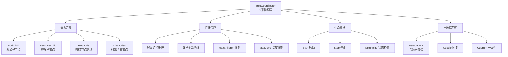
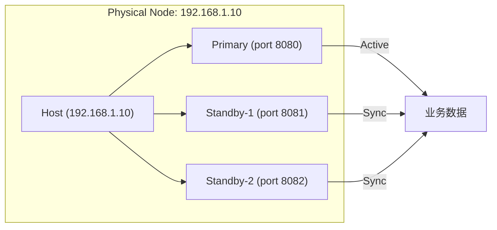
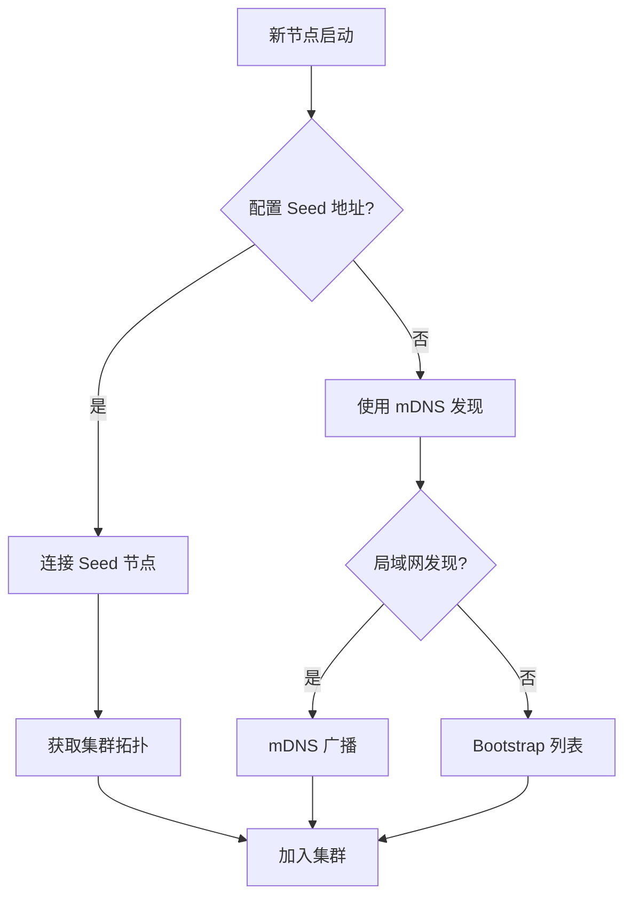
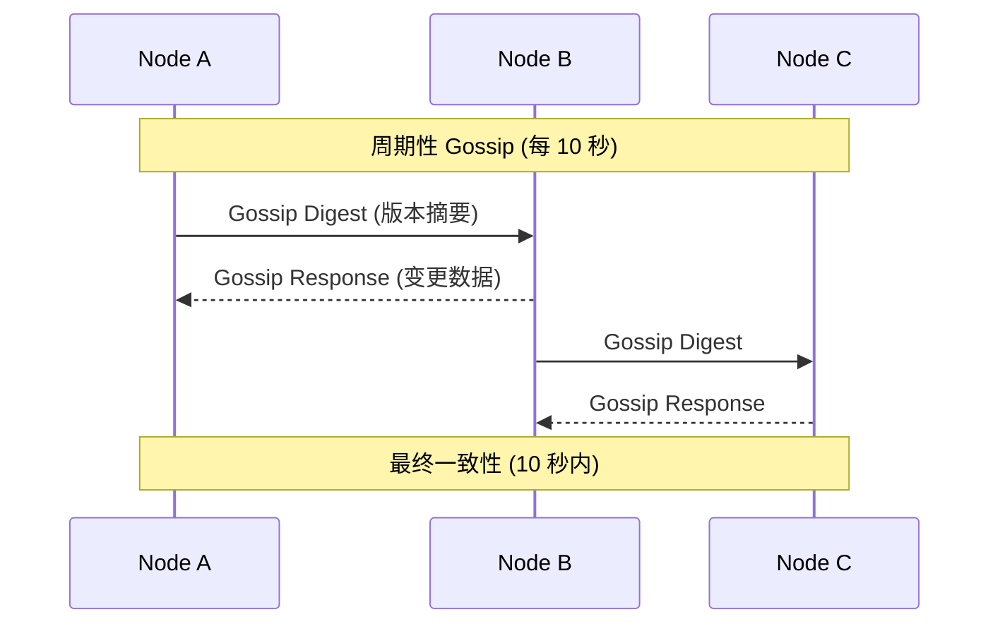
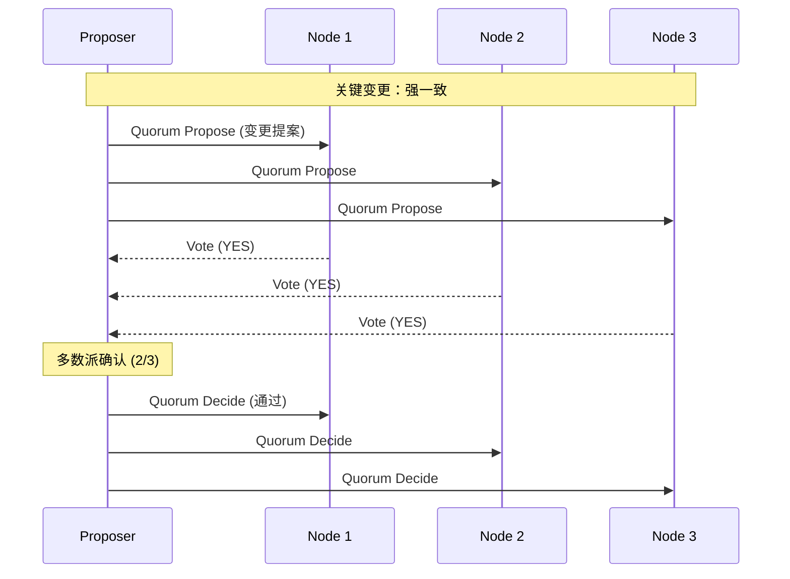

# TreeCoordinator 预研究报告

> **预研类型**: 核心组件设计
> **创建日期**: 2026-02-11
> **状态**: ✅ 已完成
> **整合文档**: 7 篇 TreeCoordinator 相关文档

---

## 📋 研究目标

设计并实现 NexKV 分布式 KV 存储系统的**树形节点协调器**，负责：
- 维护树形拓扑结构（层级化管理）
- 管理节点父子关系（AddChild/RemoveChild）
- 协调节点生命周期（加入/离开/故障自愈）
- 提供元数据管理（MetadataKV 映射）

---

## 🏗️ 架构设计

### 核心组件



### 树形拓扑结构

```
                    Level 0
                       ↓
                  Root Node
                 (TreeCoordinator)
                       ↓
    ┌──────────────────┼──────────────────┐
    ↓                  ↓                  ↓          Level 1
Parent Node A    Parent Node B    Parent Node C
(Host: Primary)   (Host: Primary)   (Host: Primary)
    ↓                  ↓                  ↓
    ├────┬────┐       ├────┬────┐        Level 2
    ↓    ↓    ↓       ↓    ↓    ↓
Leaf Leaf Leaf    Leaf Leaf Leaf
(Node)(Node)(Node) (Node)(Node)(Node)
```

**层级说明**：
| 层级 | 角色 | 职责 | 一致性要求 |
|------|------|------|-----------|
| **Level 0** | Root | 集群根节点 | 强一致 |
| **Level 1** | Parent | 协调节点，托管多个 Leaf | 增强一致 |
| **Level 2** | Leaf | 存储节点 | 最终一致 |

---

## 🎯 Host 架构

### Host 机制

**核心思想**：同一物理节点可运行多个逻辑节点（Primary + Standby）



**Host 配置示例**：
```go
type Host struct {
    HostID     string            // host-001
    Address    string            // 192.168.1.10
    Nodes      map[string]*Node  // 包含的节点列表
    Role       HostRole          // HOST_ROLE_LEAF/COORDINATOR
    Capacity   int               // 最大节点数量
}

type HostRole string

const (
    HOST_ROLE_LEAF       HostRole = "leaf"        // 纯叶子节点 Host
    HOST_ROLE_COORDINATOR HostRole = "coordinator" // 协调节点 Host
)
```

---

## 💾 元数据管理

### MetadataKV 映射方案

**设计原则**：使用 MVStore + Namespace 实现分层元数据管理

| Namespace | 说明 | 一致性级别 | 回调机制 |
|-----------|------|-----------|---------|
| `NamespaceCluster` | 集群元数据（ClusterID, RootID） | 强一致 | quorumCallback |
| `NamespaceShard` | 分片元数据（ShardID, ReplicaList） | 强一致 | quorumCallback |
| `NamespaceNode` | 节点元数据（NodeID, Status, Address） | 最终一致 | gossipCallback |
| `NamespaceRole` | 角色元数据（NodeRole, HostRole） | 最终一致 | gossipCallback |
| `NamespaceStatic` | 静态元数据（Version, StartTime） | 强一致 | quorumCallback |
| `NamespaceTopo` | 拓扑元数据（ParentID, Children） | 最终一致 | gossipCallback |
| `NamespaceDynamic` | 动态元数据（Load, Health） | 最终一致 | gossipCallback |
| `NamespaceOp` | 运维元数据（Maintenance, Tags） | 最终一致 | gossipCallback |
| `NamespaceVersion` | 版本号（HLC, VersionVector） | 强一致 | quorumCallback |

### 元数据 Key 格式

```go
// Node 元数据
"node:{nodeID}" -> NodeMetadata JSON

// Host 元数据
"host:{hostID}" -> HostMetadata JSON

// 分片元数据
"shard:{shardID}" -> ShardMetadata JSON

// 拓扑元数据
"topo:parent:{parentID}" -> ParentMetadata JSON
"topo:child:{childID}" -> ChildMetadata JSON
```

---

## 🔗 节点发现与 Seed 地址

### Seed 机制



**Seed 配置示例**：
```toml
[network]
seed_addresses = [
    "192.168.1.10:8080",
    "192.168.1.11:8080",
    "192.168.1.12:8080"
]
```

---

## 📊 核心接口

### TreeCoordinator 接口

```go
type TreeCoordinator interface {
    // 节点管理
    AddChild(parentID, childID string) error
    RemoveChild(parentID, childID string) error
    GetNode(nodeID string) (*Node, error)
    ListNodes() []*Node

    // 拓扑管理
    GetTreeDepth() int
    GetParent(nodeID string) (string, error)
    GetChildren(parentID string) ([]string, error)

    // 生命周期
    Start() error
    Stop() error
    IsRunning() bool

    // 统计信息
    GetStats() *CoordinatorStats
}
```

### MetadataKV 接口

```go
type MetadataKV interface {
    // 基础操作
    Put(ns Namespace, key string, value []byte, version uint64) error
    Get(ns Namespace, key string) ([]byte, uint64, error)
    Delete(ns Namespace, key string) error

    // 前缀扫描
    Scan(ns Namespace, prefix string) (Iterator, error)

    // 一致性控制
    SetConsistency(ns Namespace, level ConsistencyLevel)
    RegisterCallback(ns Namespace, cb CallbackFunc)
}
```

---

## 🔄 同步机制

### Gossip 协议（元数据同步）



### Quorum 机制（关键变更）



---

## 📁 集成与使用

### 集成示例

```go
// 创建 TreeCoordinator
coordinator := NewTreeCoordinator(&Config{
    MaxChildren: 8,
    MaxLevel:    3,
})

// 启动协调器
if err := coordinator.Start(); err != nil {
    log.Fatal(err)
}

// 添加节点
coordinator.AddChild("root", "parent-001")
coordinator.AddChild("parent-001", "leaf-001")

// 获取节点信息
node, err := coordinator.GetNode("leaf-001")
if err != nil {
    log.Fatal(err)
}

// 查询元数据
metadataKV := coordinator.GetMetadataKV()
value, version, err := metadataKV.Get(NamespaceNode, "node:leaf-001")
```

---

## 📝 实施状态

| 模块 | 状态 | 说明 |
|------|------|------|
| **节点管理** | ✅ 80% | 核心功能已实现 |
| **拓扑管理** | ✅ 80% | 层级结构维护完整 |
| **生命周期** | ✅ 80% | Start/Stop 已实现 |
| **元数据管理** | 🔄 60% | MetadataKV 已实现，同步待完善 |
| **心跳机制** | ⏳ 0% | 待实现 |
| **故障自愈** | ⏳ 0% | 待实现 |
| **Gossip 同步** | 🔄 50% | 基础实现，待优化 |

---

## 🔗 相关文档

### 原始文档（已归档）

| 文档 | 说明 |
|------|------|
| `cluster_2026-01-28_tree-coordinator-design.md` | 树形协调器核心设计 |
| `cluster_2026-01-29_host-based-architecture-proposal.md` | Host 架构提案 |
| `cluster_2026-01-29_tree-coordinator-complete-reference.md` | 完整参考手册 |
| `cluster_2026-02-04_seed-address-architecture.md` | Seed 地址架构 |
| `cluster_2026-02-09_metadata-design-decisions.md` | 元数据设计决策 |
| `cluster_2026-02-09_tree-coordinator-metadata-kv-mapping.md` | KV 映射方案 |
| `cluster_2026-02-09_tree-coordinator-metadata-management.md` | 元数据管理（已废弃） |

### 相关代码

- `internal/metadata/cluster/tree_coordinator.go` - TreeCoordinator 实现
- `internal/metadata/kvstore/metadata_kv.go` - MetadataKV 实现
- `internal/cluster/node.go` - 节点结构定义

---

**文档版本**: v1.0
**创建日期**: 2026-02-11
**维护者**: NexKV 开发团队
**状态**: ✅ 已完成
