# 【预研报告】NexKV 分布式一致性验证方案深度研究

> **预研目标**：系统性地研究和对比三种一致性验证方案（Porcupine 线性化验证、go-ycsb 性能基准测试、E2E 测试框架），为 NexKV 选择最佳的一致性验证策略

---

## 📋 预研信息

| 项目 | 内容 |
|------|------|
| **预研主题** | NexKV 分布式一致性验证方案 |
| **预研日期** | 2026-02-13 |
| **预研负责人** | 🤖 核心开发 A |
| **关联需求** | Layer 1 元数据一致性层验证 |
| **预研状态** | ✅ 已完成 |
| **预研结论** | 推荐 Porcupine + E2E 框架组合方案，分阶段实施 |

---

## 1. 问题背景

### 1.1 为什么一致性验证是最头疼的问题

分布式系统的一致性验证是分布式系统开发中最困难的挑战之一，原因如下：

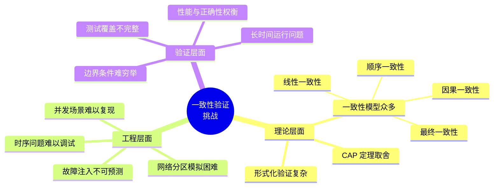

### 1.2 NexKV 的一致性挑战

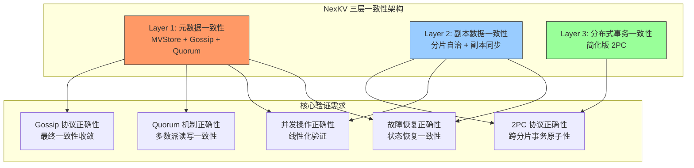

### 1.3 一致性模型对比

| 一致性模型 | 严格程度 | 实现难度 | 性能影响 | NexKV 适用场景 |
|-----------|---------|---------|---------|---------------|
| **线性一致性** | ⭐⭐⭐⭐⭐ | 很高 | 大 | 关键元数据变更 |
| **顺序一致性** | ⭐⭐⭐⭐ | 高 | 中 | - |
| **因果一致性** | ⭐⭐⭐ | 中 | 小 | Follower 读取 |
| **最终一致性** | ⭐⭐ | 低 | 最小 | Gossip 同步 |

---

## 2. 三种验证方案概述

### 2.1 方案全景图

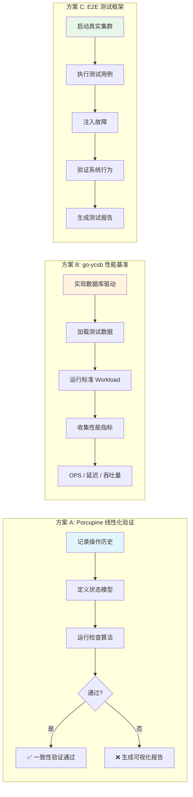

### 2.2 方案快速对比

| 维度 | Porcupine | go-ycsb | E2E 框架 |
|------|-----------|---------|----------|
| **核心目标** | 线性一致性验证 | 性能基准测试 | 完整功能验证 |
| **验证深度** | 数学证明级别 | 基础正确性 | 端到端覆盖 |
| **实施难度** | ⭐⭐⭐ 中等 | ⭐⭐ 需客户端 | ⭐⭐⭐⭐ 高 |
| **开发周期** | 1-2 周 | 2-3 周 | 4+ 周 |
| **当前可行性** | ✅ 可立即开始 | ❌ 需客户端 | ⏳ 需评审 |
| **CI 集成** | ✅ 容易 | ✅ 容易 | ⚠️ 复杂 |
| **问题定位** | ✅ 可视化报告 | ⚠️ 需分析 | ⚠️ 需调试 |

---

## 3. 方案 A: Porcupine 线性化验证

### 3.1 什么是 Porcupine

**Porcupine** 是由 Anish Athalye 开发的快速线性一致性检查器，使用 Go 语言编写。

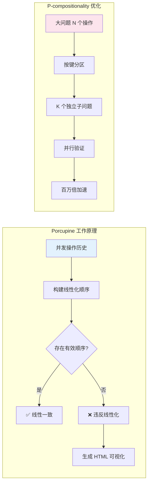

### 3.2 线性一致性形式化定义

**定义**：给定历史 H，如果存在一个顺序历史 S，满足以下三个条件，则 H 是线性一致的：

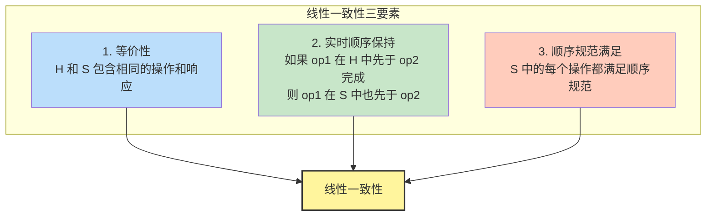

### 3.3 Porcupine 核心组件

```go
// Porcupine 模型定义
type Model struct {
    // 初始化状态
    Init func() interface{}

    // 状态转移函数：返回 (是否合法, 新状态)
    Step func(state, input, output interface{}) (bool, interface{})

    // 可选：操作描述（用于可视化）
    DescribeOperation func(state, input, output interface{}) string

    // 可选：状态描述（用于可视化）
    DescribeState func(state interface{}) string
}

// 事件记录
type Event struct {
    Kind      EventKind  // CallEvent 或 ReturnEvent
    Value     interface{} // 输入（Call）或输出（Return）
    Id        int        // 操作唯一标识
    ClientId  int        // 客户端标识
    Timestamp int64      // 时间戳
}
```

### 3.4 NexKV 模型设计

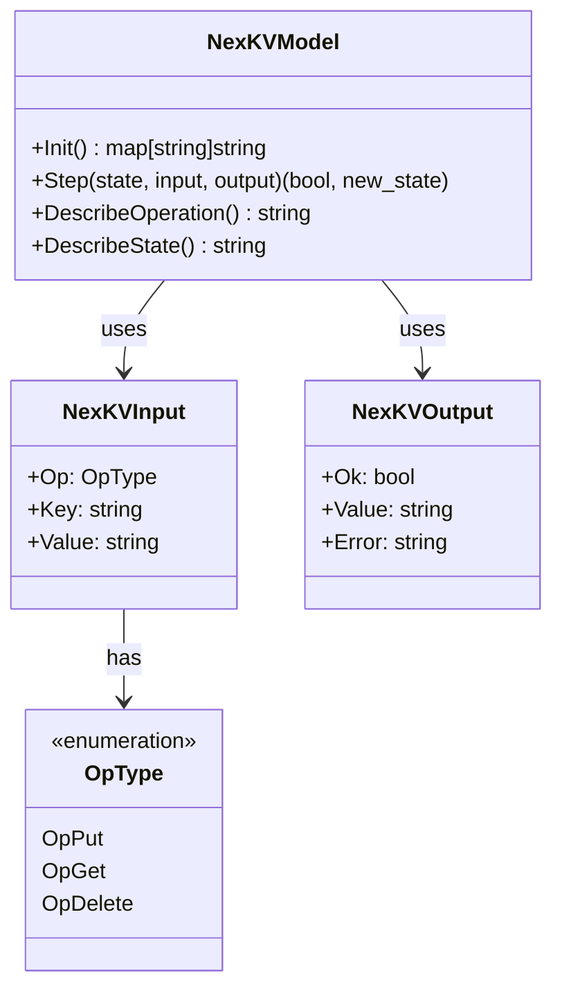

### 3.5 Porcupine 架构集成

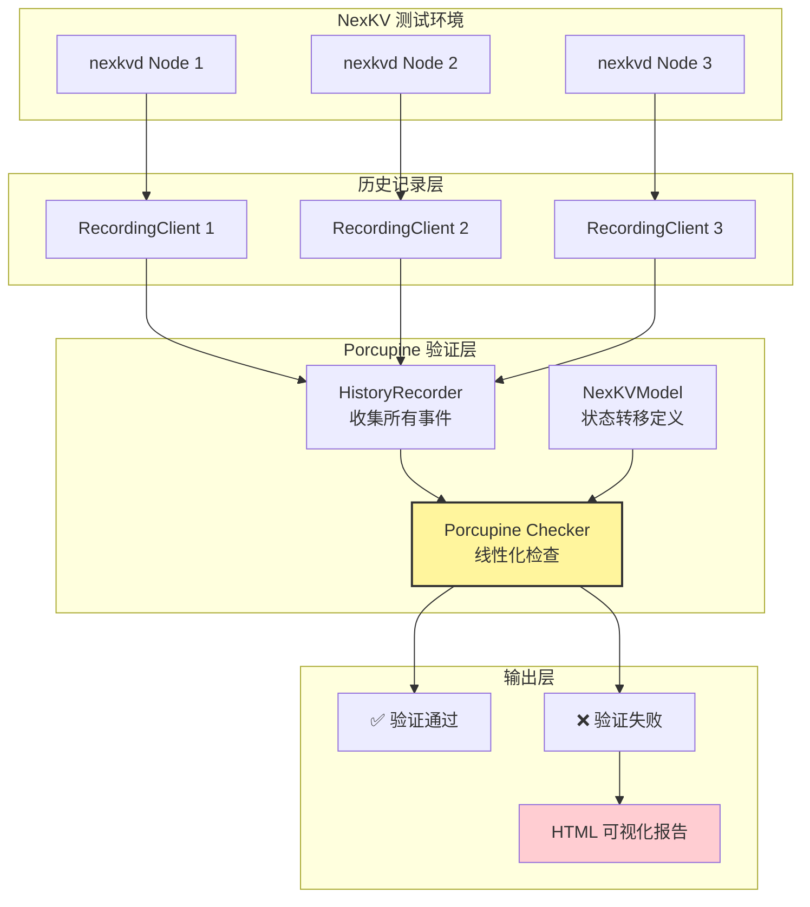

### 3.6 性能特点

```mermaid
xychart-beta
    title "Porcupine vs Knossos 性能对比"
    x-axis ["小历史<br/>&lt;100 ops", "中等历史<br/>100-1000 ops", "大历史<br/>&gt;1000 ops"]
    y-axis "检查时间（毫秒）" 0 --> 12000
    bar [1, 100, 1000]
    bar [100, 10000, 12000]
```

| 指标 | Porcupine | Knossos |
|------|-----------|---------|
| **小历史（<100 操作）** | <1ms | ~100ms |
| **中等历史（100-1000）** | <100ms | ~10s |
| **大历史（>1000）** | <1s | 超时 |
| **P-compositionality** | ✅ 支持 | ❌ 不支持 |
| **内存占用** | 低 | 高 |

### 3.7 优缺点分析

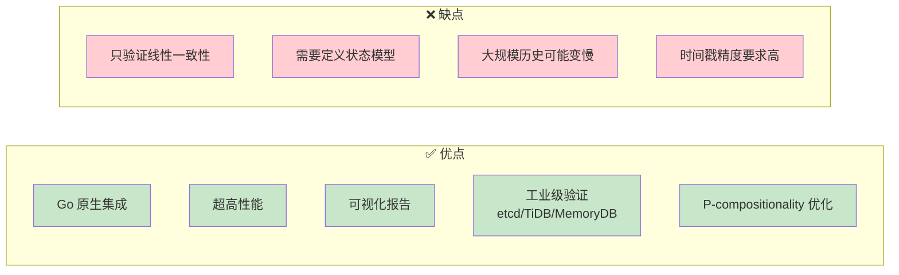

### 3.8 适用场景

| 场景 | 适用性 | 说明 |
|------|--------|------|
| **Gossip 协议验证** | ⚠️ 有限 | Gossip 是最终一致，不满足线性化 |
| **Quorum 读写验证** | ✅ 非常适合 | Quorum 提供强一致，可线性化验证 |
| **2PC 事务验证** | ✅ 非常适合 | 跨分片事务需要原子性 |
| **并发操作验证** | ✅ 非常适合 | 检测竞态条件和顺序问题 |
| **故障恢复验证** | ✅ 适合 | 可注入故障后验证一致性 |

---

## 4. 方案 B: go-ycsb 性能基准测试

### 4.1 什么是 YCSB

**YCSB (Yahoo! Cloud Serving Benchmark)** 是 Yahoo! 开发的云服务基准测试工具，用于评估各种数据库系统的性能。

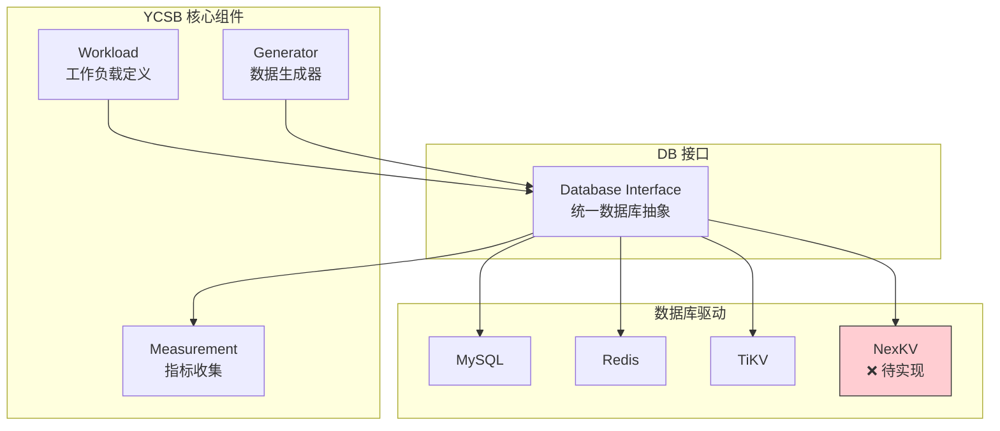

### 4.2 为什么选择 go-ycsb

| 特性 | go-ycsb | 原版 YCSB (Java) |
|------|---------|------------------|
| **语言** | Go | Java |
| **性能** | 更低开销 | JVM 开销 |
| **部署** | 单二进制 | 需要 JVM |
| **扩展性** | Go 接口 | Java 接口 |
| **维护方** | PingCAP | Yahoo! |

### 4.3 内置 Workload 详解

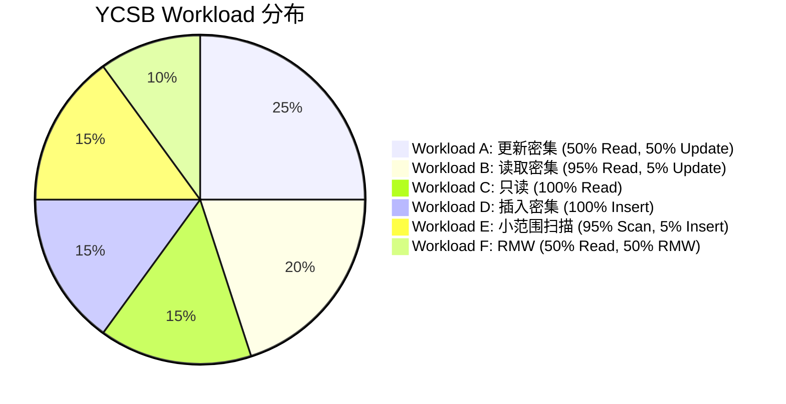

| Workload | 读写比例 | 典型场景 | NexKV 适用性 |
|----------|---------|---------|-------------|
| **A** | 50% Read, 50% Update | 用户会话存储 | ⭐⭐⭐ |
| **B** | 95% Read, 5% Update | 照片标签缓存 | ⭐⭐⭐⭐ |
| **C** | 100% Read | 配置文件缓存 | ⭐⭐⭐⭐⭐ |
| **D** | 100% Insert | 事件日志 | ⭐⭐ |
| **E** | 95% Scan, 5% Insert | 好友列表 | ⭐⭐ |
| **F** | 50% Read, 50% RMW | 文档编辑 | ⭐⭐⭐ |

### 4.4 NexKV 驱动实现需求

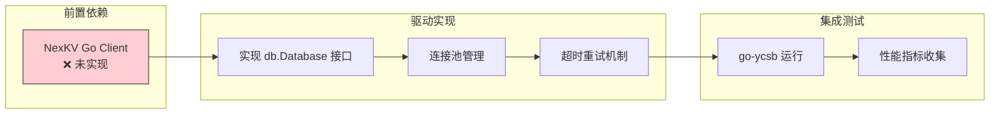

### 4.5 db.Database 接口定义

```go
type Database interface {
    // 初始化和清理
    InitThread(ctx context.Context, threadID int, threadCount int) context.Context
    CleanupThread(ctx context.Context)
    Close() error

    // CRUD 操作
    Read(ctx context.Context, table string, key string, fields []string) (map[string][]byte, error)
    Scan(ctx context.Context, table string, startKey string, count int64, fields []string) ([]map[string][]byte, error)
    Update(ctx context.Context, table string, key string, values map[string][]byte) error
    Insert(ctx context.Context, table string, key string, values map[string][]byte) error
    Delete(ctx context.Context, table string, key string) error
}
```

### 4.6 实施依赖链

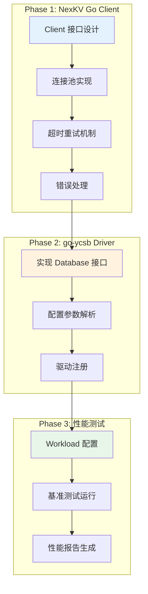

### 4.7 优缺点分析

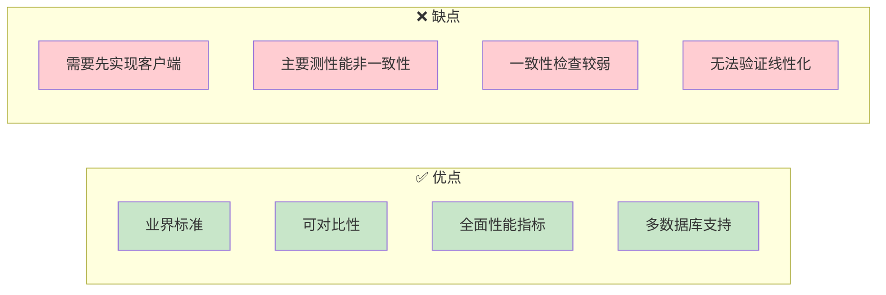

---

## 5. 方案 C: E2E 测试框架

### 5.1 什么是 E2E 测试框架

E2E（End-to-End）测试框架是一个完整的测试基础设施，用于验证 NexKV 从客户端到存储层的完整功能链路。

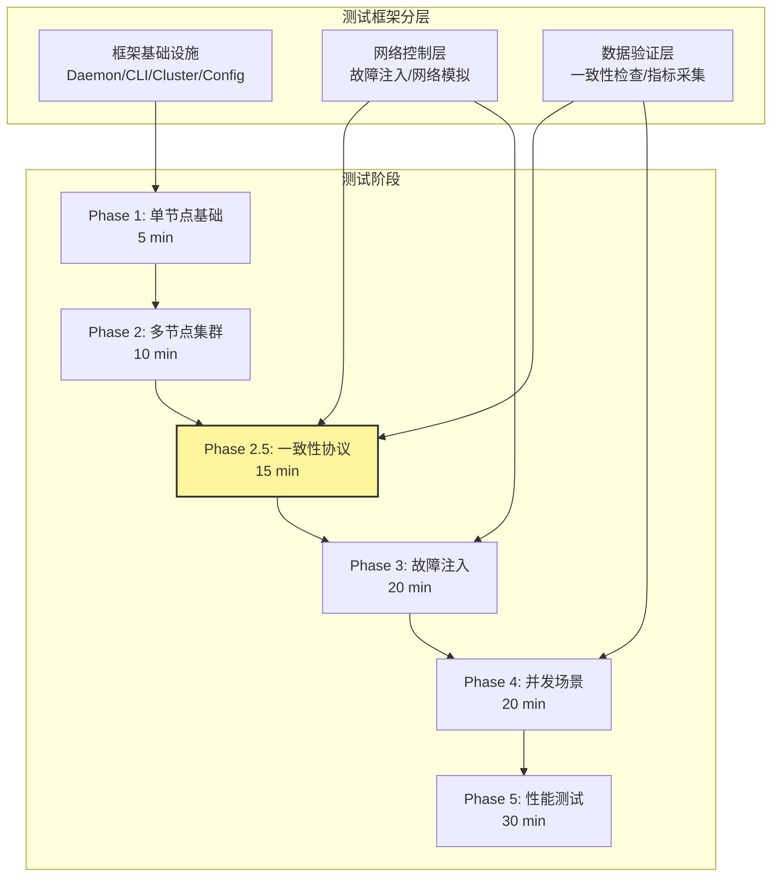

### 5.2 Phase 2.5 一致性协议专项测试

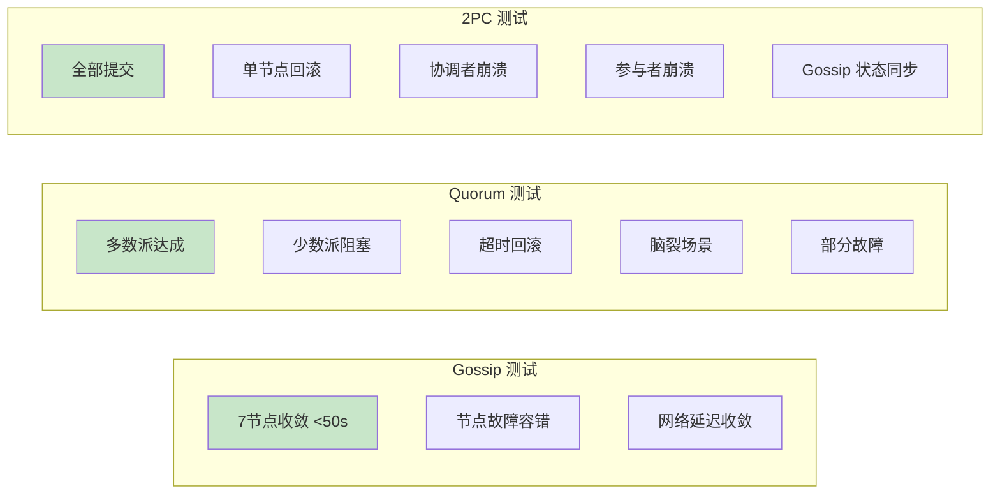

### 5.3 框架目录结构

```
test/e2e/
├── framework/           # 测试框架核心
│   ├── daemon.go       # Daemon 进程管理
│   ├── cli.go          # CLI 命令执行
│   ├── cluster.go      # 集群编排
│   ├── config.go       # 配置生成
│   ├── network.go      # 网络控制（libp2p 故障注入）
│   ├── metrics.go      # 指标采集
│   ├── log_analyzer.go # 日志分析
│   ├── data_verifier.go # 数据一致性验证
│   └── assert.go       # E2E 断言
├── phases/             # 分阶段测试
│   ├── phase1_single_node/
│   ├── phase2_cluster/
│   ├── phase2_5_consistency/  # 一致性协议专项
│   ├── phase3_fault_injection/
│   ├── phase4_concurrency/
│   └── phase5_performance/
├── scripts/            # 辅助脚本
│   ├── cleanup.sh
│   ├── setup_env.sh
│   └── verify_consistency.sh
└── README.md
```

### 5.4 网络控制实现方案

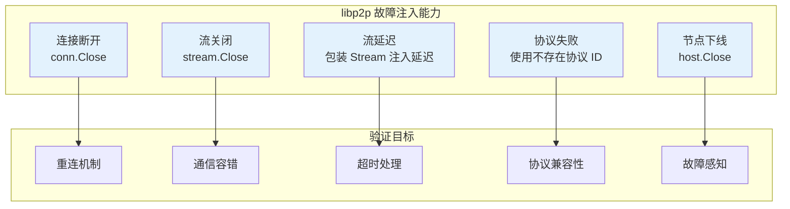

### 5.5 三层数据验证架构

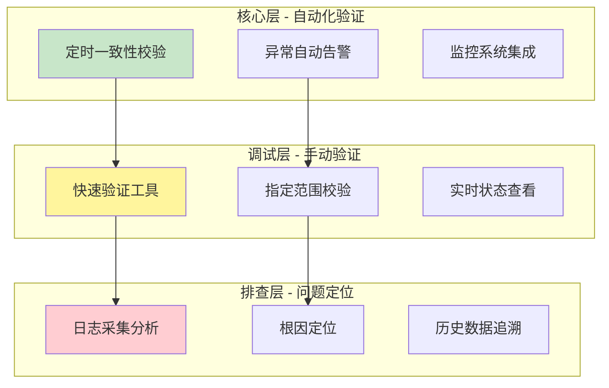

### 5.6 实施周期

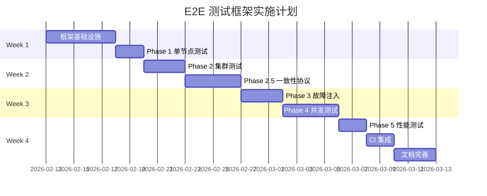

### 5.7 优缺点分析

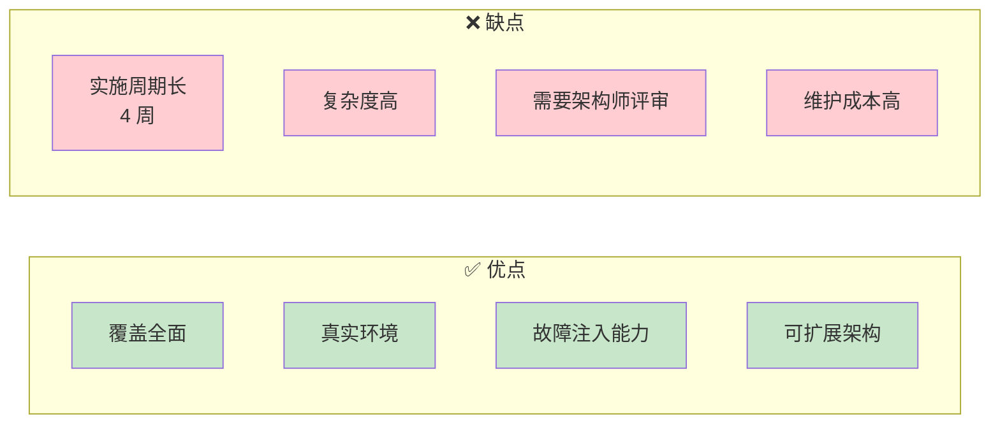

---

## 6. 深度对比分析

### 6.1 一致性验证能力对比

```mermaid
radar-beta
    title "一致性验证能力对比"
    axis 线性化验证["线性化验证"], 最终一致性["最终一致性"], 故障场景["故障场景"], 并发正确性["并发正确性"], 性能验证["性能验证"], 可视化["可视化调试"]

    curve Porcupine: [5, 2, 3, 5, 1, 5]
    curve go-ycsb: [1, 2, 1, 2, 5, 2]
    curve E2E框架: [3, 4, 5, 4, 3, 3]

    max 5
```

### 6.2 实施可行性对比

| 维度 | Porcupine | go-ycsb | E2E 框架 |
|------|-----------|---------|----------|
| **当前可开始** | ✅ 是 | ❌ 需客户端 | ⏳ 需评审 |
| **依赖 NexKV Client** | ❌ 不需要 | ✅ 必须 | ❌ 不需要 |
| **开发周期** | 1-2 周 | 2-3 周 | 4+ 周 |
| **人力投入** | 1 人 | 1-2 人 | 2-3 人 |
| **风险等级** | 低 | 中 | 高 |

### 6.3 与 NexKV 架构的契合度

```mermaid
graph TB
    subgraph "NexKV Layer 1 验证需求"
        L1[Gossip 协议]
        L2[Quorum 机制]
        L3[2PC 协议]
    end

    subgraph "Porcupine 覆盖"
        P1[✅ Quorum 验证]
        P2[✅ 2PC 验证]
        P3[⚠️ Gossip 有限]
    end

    subgraph "go-ycsb 覆盖"
        Y1[⚠️ 性能测试]
        Y2[⚠️ 压力测试]
        Y3[❌ 一致性验证弱]
    end

    subgraph "E2E 覆盖"
        E1[✅ 全覆盖]
        E2[✅ 故障注入]
        E3[✅ 真实环境]
    end

    L1 --> E1
    L2 --> P1
    L2 --> E2
    L3 --> P2
    L3 --> E3

    style P1 fill:#c8e6c9
    style P2 fill:#c8e6c9
    style E1 fill:#c8e6c9
    style E2 fill:#c8e6c9
    style E3 fill:#c8e6c9
```

---

## 7. 推荐方案

### 7.1 组合策略

基于以上分析，推荐采用 **Porcupine + E2E 框架组合方案**：

```mermaid
flowchart LR
    subgraph "Phase 1: Porcupine 快速验证（1-2 周）"
        A1[添加 Porcupine 依赖]
        A2[定义 NexKV 状态模型]
        A3[集成到现有测试]
        A4[线性化验证通过]
    end

    subgraph "Phase 2: E2E 框架建设（4 周）"
        B1[框架基础设施]
        B2[Phase 2.5 一致性测试]
        B3[故障注入测试]
        B4[集成 Porcupine]
    end

    subgraph "Phase 3: go-ycsb 性能基准（后续）"
        C1[实现 NexKV Client]
        C2[实现 go-ycsb 驱动]
        C3[运行性能测试]
    end

    A1 --> A2 --> A3 --> A4
    A4 --> B1 --> B2 --> B3 --> B4
    B4 --> C1 --> C2 --> C3

    style A4 fill:#c8e6c9
    style B4 fill:#c8e6c9
    style C3 fill:#e1f5fe
```

### 7.2 实施路径

```mermaid
timeline
    title 一致性验证实施时间线
    section 第 1-2 周
        Porcupine 集成 : 添加依赖 : 定义模型 : 集成测试
    section 第 3-6 周
        E2E 框架 Phase 1-2 : 基础设施 : 单节点/集群测试
    section 第 7-8 周
        E2E 框架 Phase 2.5-3 : 一致性协议 : 故障注入
    section 后续
        go-ycsb 集成 : 客户端实现 : 性能基准
```

### 7.3 Porcupine 快速启动代码

```go
// internal/metadata/consistency/porcupine/model.go
package porcupine

import (
    "fmt"
    "github.com/anishathalye/porcupine"
)

// 操作类型
type OpType int
const (
    OpPut OpType = iota
    OpGet
    OpDelete
)

// NexKV 顺序规范模型
var NexKVModel = porcupine.Model{
    Init: func() interface{} {
        return make(map[string]string)
    },

    Step: func(state, input, output interface{}) (bool, interface{}) {
        store := state.(map[string]string)
        in := input.(NexKVInput)
        out := output.(NexKVOutput)

        newStore := make(map[string]string)
        for k, v := range store {
            newStore[k] = v
        }

        switch in.Op {
        case OpPut:
            newStore[in.Key] = in.Value
            return out.Ok, newStore
        case OpGet:
            expected, exists := store[in.Key]
            if !exists {
                return !out.Ok || out.Value == "", newStore
            }
            return out.Ok && out.Value == expected, newStore
        case OpDelete:
            delete(newStore, in.Key)
            return out.Ok, newStore
        default:
            return false, state
        }
    },
}
```

---

## 8. 风险评估

### 8.1 技术风险

| 风险 | 概率 | 影响 | 缓解措施 |
|------|------|------|---------|
| **Porcupine 历史规模限制** | 中 | 中 | 使用 P-compositionality 分区检查 |
| **时间戳精度问题** | 低 | 高 | 使用单调时间戳生成器 |
| **E2E 框架延期** | 高 | 高 | 渐进式交付，先 MVP |
| **go-ycsb 客户端实现复杂** | 中 | 低 | 可延后到 Phase 3 |

### 8.2 依赖风险

```mermaid
graph LR
    subgraph "Porcupine 依赖"
        P1[github.com/anishathalye/porcupine]
        P2[Go 1.16+]
    end

    subgraph "go-ycsb 依赖"
        G1[github.com/pingcap/go-ycsb]
        G2[NexKV Go Client ❌]
    end

    subgraph "E2E 依赖"
        E1[libp2p]
        E2[nexkvd/nexkv CLI]
    end

    style G2 fill:#ffcdd2
```

---

## 9. 结论与建议

### 9.1 核心结论

1. **Porcupine 是当前最佳选择**
   - 可立即开始，无外部依赖
   - 数学严格性，工业级验证
   - 可视化调试，问题定位快

2. **E2E 框架是长期目标**
   - 覆盖全面，真实环境
   - 需要架构师评审，周期较长
   - 可与 Porcupine 结合增强验证能力

3. **go-ycsb 是后续补充**
   - 需要先实现 NexKV Client
   - 主要用于性能测试，非一致性验证
   - 可作为长期性能监控手段

### 9.2 行动建议

```mermaid
graph TB
    A[立即开始] --> B[Porcupine 集成]
    B --> C[线性化验证通过]
    C --> D{E2E 文档评审}
    D -->|通过| E[启动 E2E 框架开发]
    D -->|修改| F[迭代文档]
    F --> D
    E --> G[集成 Porcupine 到 E2E]
    G --> H[完整一致性验证]

    style A fill:#c8e6c9
    style C fill:#c8e6c9
    style H fill:#c8e6c9
```

---

## 10. 附录

### 10.1 参考资料

| 资源 | 链接 |
|------|------|
| Porcupine GitHub | https://github.com/anishathalye/porcupine |
| P-compositionality 论文 | https://dl.acm.org/citation.cfm?id=3154503 |
| 线性一致性理论 | https://jepsen.io/consistency/models/linearizable |
| go-ycsb GitHub | https://github.com/pingcap/go-ycsb |
| etcd 健壮性测试 | https://etcd.io/docs/latest/learning/api_guarantees/ |
| Jepsen 测试方法论 | https://jepsen.io/ |

### 10.2 术语表

| 术语 | 定义 |
|------|------|
| **线性一致性 (Linearizability)** | 最强的一致性模型，每个操作看起来都在某个瞬时点原子执行 |
| **P-compositionality** | Porcupine 的优化算法，将大问题分解为独立子问题 |
| **线性化点 (Linearization Point)** | 操作在顺序历史中生效的时间点 |
| **历史 (History)** | 并发操作的 Call/Return 事件序列 |
| **顺序规范 (Sequential Specification)** | 单线程执行时系统应满足的行为规范 |

---

**文档版本**: v1.0
**创建日期**: 2026-02-13
**最后更新**: 2026-02-13
**维护者**: 🤖 核心开发 A
**状态**: ✅ 已完成
