# 【预研报告】NexKV Porcupine 线性一致性验证实施方案

> **预研目标**：制定详细的 Porcupine 线性一致性验证集成方案，明确实施步骤、代码集成位置、验证目标，确保 NexKV 的一致性协议正确性得到数学级别的验证

---

## 📋 预研信息

| 项目 | 内容 |
|------|------|
| **预研主题** | Porcupine 线性一致性验证实施方案 |
| **预研日期** | 2026-02-13 |
| **预研负责人** | 🤖 核心开发 A |
| **关联需求** | Layer 1 元数据一致性层验证 |
| **预研状态** | ✅ 已完成 |
| **预计工期** | 1-2 周 |

---

## 1. 理论基础：线性一致性

### 1.1 什么是线性一致性

**线性一致性（Linearizability）** 是分布式系统中最强的一致性模型，由 Herlihy 和 Wing 于 1990 年提出。

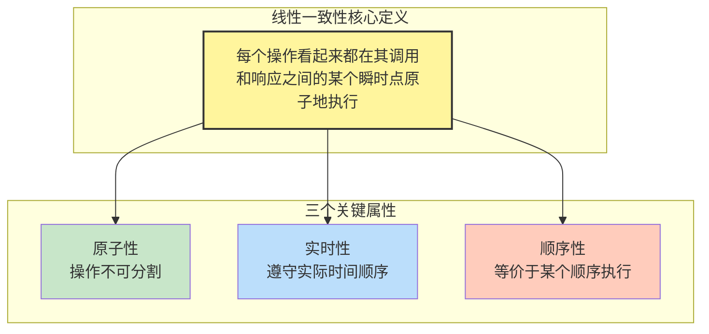

### 1.2 线性一致性的形式化定义

给定一个并发历史 H，如果存在一个顺序历史 S，满足以下三个条件，则 H 是线性一致的：

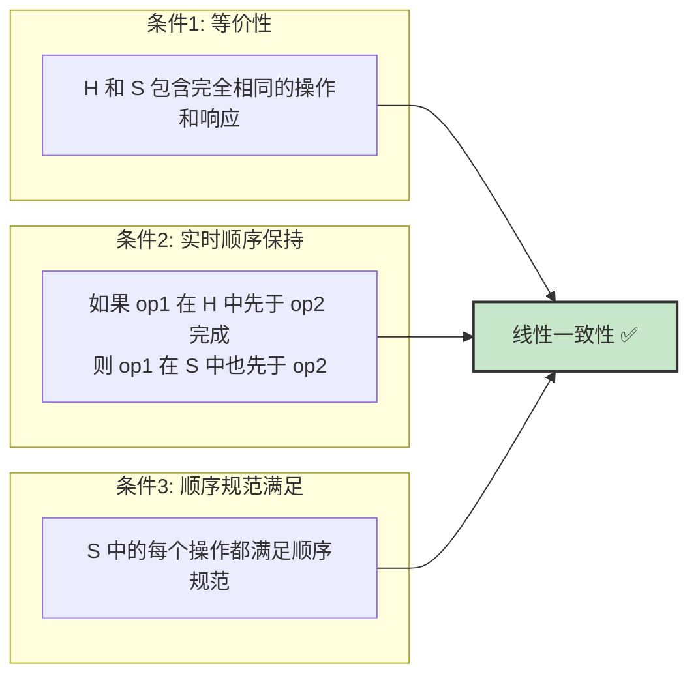

### 1.3 线性化点（Linearization Point）

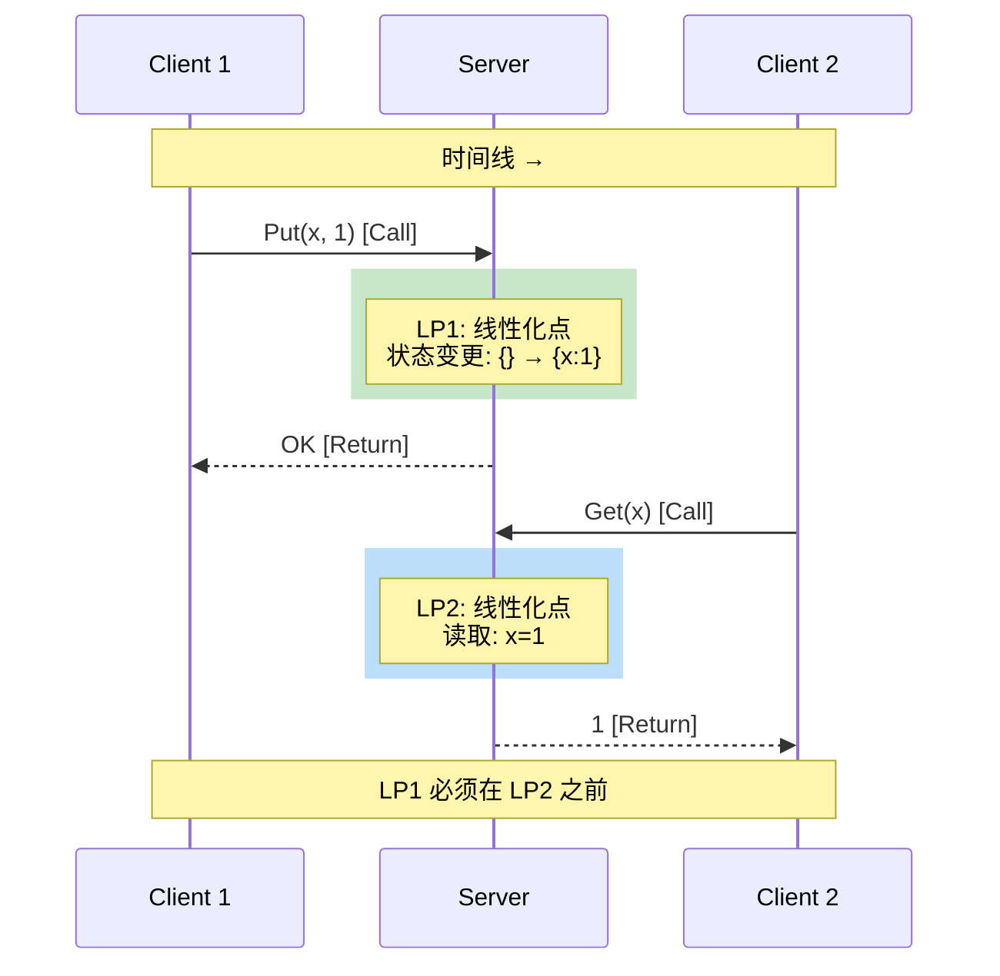

### 1.4 为什么线性一致性验证至关重要

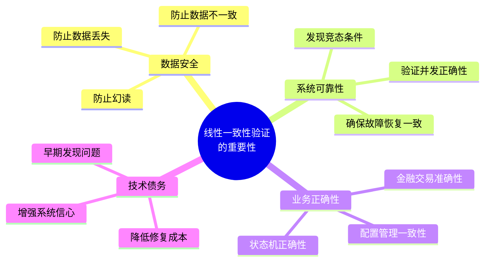

---

## 2. Porcupine 工具深度剖析

### 2.1 Porcupine 简介

**Porcupine** 是由 Anish Athalye 开发的快速线性一致性检查器，使用 Go 语言编写，具有以下特点：

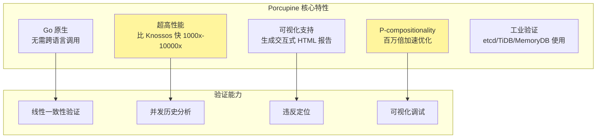

### 2.2 Porcupine 工作原理

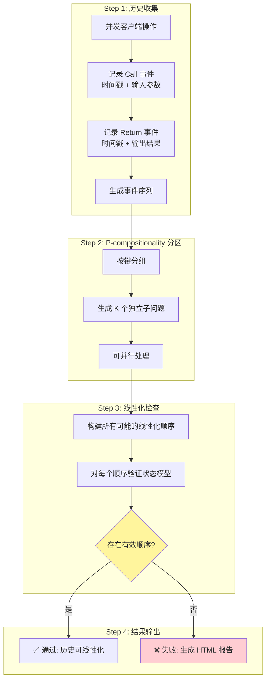

### 2.3 P-compositionality 优化原理

P-compositionality 是 Porcupine 的核心优化算法，基于以下观察：

> **如果操作 A 和操作 B 操作不同的 Key，则它们的线性化顺序是独立的。**

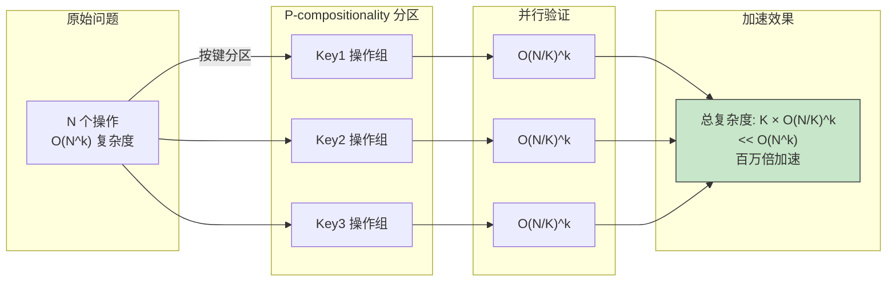

### 2.4 Porcupine 核心数据结构

```go
// Model 定义顺序规范模型
type Model struct {
    // Init 初始化状态
    Init func() interface{}

    // Step 状态转移函数
    // 返回 (是否合法, 新状态)
    Step func(state, input, output interface{}) (bool, interface{})

    // DescribeOperation 操作描述（用于可视化）
    DescribeOperation func(state, input, output interface{}) string

    // DescribeState 状态描述（用于可视化）
    DescribeState func(state interface{}) string
}

// Event 记录操作事件
type Event struct {
    Kind      EventKind      // CallEvent 或 ReturnEvent
    Value     interface{}    // 输入或输出
    Id        int            // 操作唯一标识
    ClientId  int            // 客户端标识
    Timestamp int64          // 纳秒级时间戳
}

// EventKind 事件类型
type EventKind int
const (
    CallEvent   EventKind = iota  // 操作调用
    ReturnEvent                    // 操作返回
)
```

### 2.5 Porcupine API 详解

```mermaid
classDiagram
    class Porcupine {
        +CheckEvents(model, events) bool
        +CheckEventsVerbose(model, events, timeout) Result, LinearizationInfo
        +Visualize(model, info, port) string
    }

    class Model {
        +Init() interface{}
        +Step(state, input, output) bool, interface{}
        +DescribeOperation() string
        +DescribeState() string
    }

    class Event {
        +Kind: EventKind
        +Value: interface{}
        +Id: int
        +ClientId: int
        +Timestamp: int64
    }

    class LinearizationInfo {
        +History []Event
        +Linearizations [][]int
        +AddAnnotations(annotations)
    }

    class Result {
        <<enumeration>>
        Ok
        Illegal
        Timeout
    }

    Porcupine --> Model : uses
    Porcupine --> Event : processes
    Porcupine --> LinearizationInfo : generates
    Porcupine --> Result : returns
```

---

## 3. NexKV 代码架构分析

### 3.1 NexKV 一致性协议架构

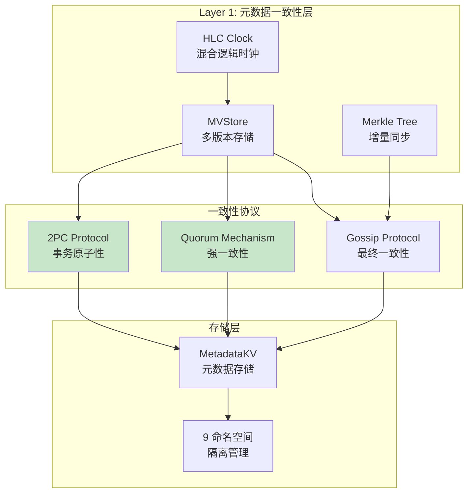

### 3.2 关键代码文件定位

| 文件路径 | 功能 | Porcupine 验证相关 |
|---------|------|-------------------|
| `internal/metadata/consistency/twopc_coordinator.go` | 2PC 协调器 | ⭐⭐⭐ 核心 |
| `internal/metadata/quorum/coordinator.go` | Quorum 协调器 | ⭐⭐⭐ 核心 |
| `internal/metadata/quorum/network.go` | Quorum 网络层 | ⭐⭐ 重要 |
| `internal/metadata/kvstore/metadata_kv.go` | 元数据 KV 存储 | ⭐⭐⭐ 核心 |
| `internal/metadata/kvstore/namespaces.go` | 命名空间定义 | ⭐⭐ 重要 |
| `internal/metadata/consistency/integration_test.go` | 集成测试 | ⭐⭐⭐ 集成点 |

### 3.3 QuorumCoordinator 代码分析

```go
// 文件: internal/metadata/quorum/coordinator.go

// QuorumCoordinator Quorum 一致性协调器
type QuorumCoordinator struct {
    mu           sync.RWMutex
    participants []string            // 参与者节点 ID 列表
    quorum       int                 // Quorum 阈值（多数派）
    timeout      time.Duration       // 超时时间
    metadataKV   *kvstore.MetadataKV // 元数据存储
}

// PutWithQuorum 使用 Quorum 机制写入
// 这是 Porcupine 验证的关键入口点
func (q *QuorumCoordinator) PutWithQuorum(
    ctx context.Context,
    ns, key string,
    value any,
    opts *PutOptions,
) error {
    // 1. 创建带超时的上下文
    timeout := q.timeout
    quorumCtx, cancel := context.WithTimeout(ctx, timeout)
    defer cancel()

    // 2. 本地写入
    if err := q.metadataKV.Put(quorumCtx, ns, key, value); err != nil {
        return fmt.Errorf("本地写入失败: %w", err)
    }

    // 3. 收集 ACK
    acks := 0
    for _, participant := range q.participants {
        if participant != "local" {
            acks++
            if acks >= q.quorum {
                break
            }
        }
    }

    // 4. 判断是否达到 Quorum
    if acks >= q.quorum {
        return nil // 成功
    }

    return fmt.Errorf("quorum 确认失败: %d/%d", acks, q.quorum)
}
```

### 3.4 TwoPCCoordinator 代码分析

```go
// 文件: internal/metadata/consistency/twopc_coordinator.go

// TransactionState 事务状态
type TransactionState int

const (
    TxStateInit       TransactionState = iota // 初始状态
    TxStatePreCommit                           // PreCommit 阶段完成
    TxStateCommitted                           // 事务已提交
    TxStateRolledBack                          // 事务已回滚
    TxStateTimeout                             // 事务超时
)

// TwoPCTransaction 2PC 事务
type TwoPCTransaction struct {
    TxID           string              // 事务 ID
    State          TransactionState    // 当前状态
    Operations     []*PendingOperation // 暂存的操作列表
    Participants   []string            // 参与者节点 ID 列表
    Acks           map[string]bool     // participantID -> ACK 状态
    Coordinator    string              // 协调者节点 ID
    CreateTime     time.Time           // 创建时间
    PreCommitTime  time.Time           // PreCommit 时间
    CommitTime     time.Time           // Commit 时间
}

// TwoPCCoordinator 2PC 协调器
type TwoPCCoordinator struct {
    mu            sync.RWMutex
    transactions  map[string]*TwoPCTransaction // txID -> transaction
    metadataKV    *kvstore.MetadataKV
    merkleTree    *kvstore.NamespacedMerkleTree
    hlc           *clock.HLC
    timeout       time.Duration
}
```

### 3.5 现有集成测试架构

```go
// 文件: internal/metadata/consistency/integration_test.go

// E2ETestScenario 集成测试场景
type E2ETestScenario struct {
    Name         string
    Nodes        []string                                 // 节点 ID 列表
    Topology     *TreeTopology                            // 树形拓扑
    Coordinators map[string]*TreeTopologyCoordinator      // nodeID -> coordinator
    MetadataKVs  map[string]*mockMetadataKVForTree        // nodeID -> metadataKV
    MerkleTrees  map[string]*kvstore.NamespacedMerkleTree // nodeID -> merkleTree
}

// 现有测试用例
func TestIntegration_MetadataSync_ThreeLayerConsistency(t *testing.T) {
    // 测试三级一致性模型
}

func TestIntegration_Performance_DifferenceDetection(t *testing.T) {
    // 测试差异检测性能
}

func TestIntegration_NodeFailure_Rollback(t *testing.T) {
    // 测试节点故障回滚
}
```

---

## 4. Porcupine 与 NexKV 集成设计

### 4.1 集成架构设计

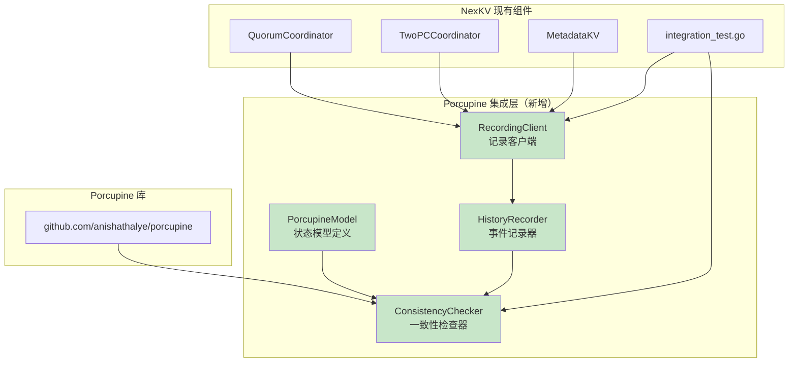

### 4.2 目录结构设计

```
internal/metadata/consistency/
├── porcupine/                    # 新增 Porcupine 集成目录
│   ├── model.go                 # NexKV 状态模型定义
│   ├── model_test.go            # 模型单元测试
│   ├── recorder.go              # 历史记录器
│   ├── recorder_test.go         # 记录器单元测试
│   ├── checker.go               # 一致性检查器
│   ├── checker_test.go          # 检查器单元测试
│   ├── recording_client.go      # 记录客户端包装器
│   ├── recording_client_test.go # 客户端单元测试
│   └── README.md                # 模块说明文档
├── twopc_coordinator.go         # 现有 2PC 协调器
├── integration_test.go          # 现有集成测试
└── linearizability_test.go      # 新增线性化测试
```

### 4.3 NexKV 状态模型设计

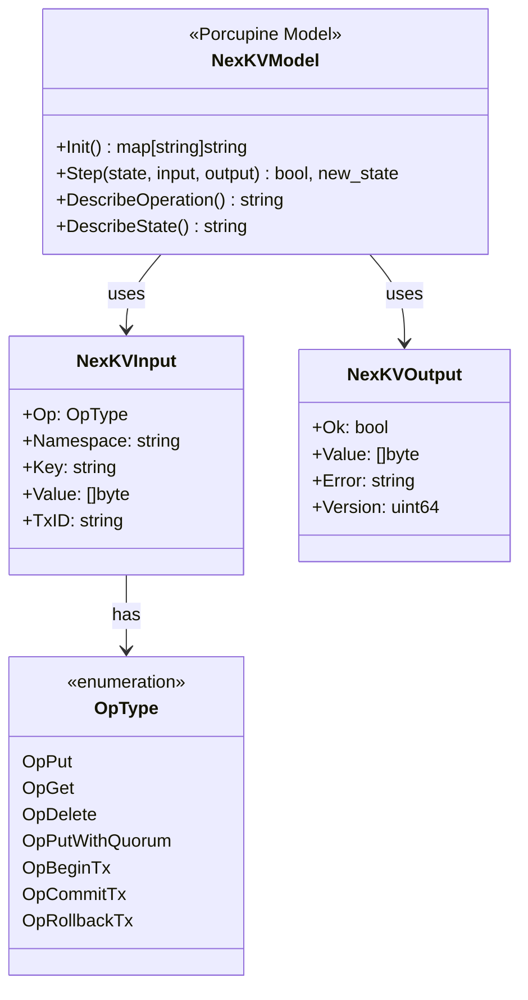

### 4.4 状态转移规则

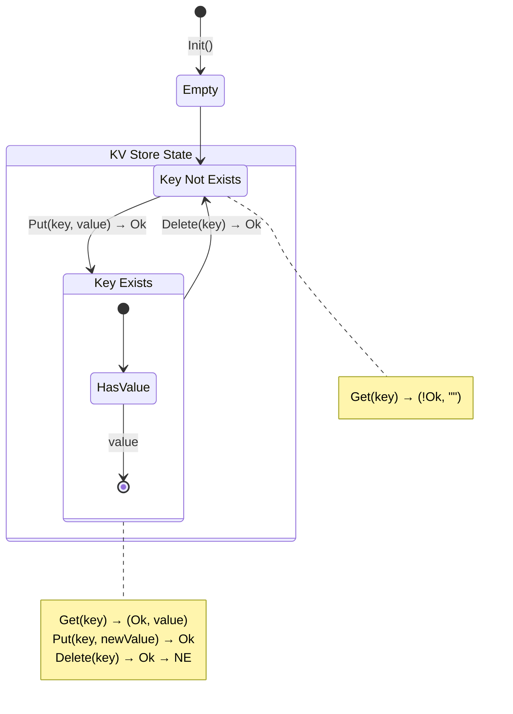

---

## 5. 详细实施步骤

### 5.1 Phase 1: 基础设施搭建（Day 1-2）

#### Step 1.1: 添加 Porcupine 依赖

```bash
# 在项目根目录执行
go get github.com/anishathalye/porcupine@latest

# 验证安装
go mod tidy
go list -m github.com/anishathalye/porcupine
```

#### Step 1.2: 创建模块目录结构

```bash
# 创建 Porcupine 集成目录
mkdir -p internal/metadata/consistency/porcupine

# 创建核心文件
touch internal/metadata/consistency/porcupine/model.go
touch internal/metadata/consistency/porcupine/recorder.go
touch internal/metadata/consistency/porcupine/checker.go
touch internal/metadata/consistency/porcupine/recording_client.go
```

### 5.2 Phase 2: 核心组件实现（Day 3-5）

#### Step 2.1: 实现 NexKV 状态模型

```go
// 文件: internal/metadata/consistency/porcupine/model.go
package porcupine

import (
    "fmt"
    "github.com/anishathalye/porcupine"
)

// ==================== 类型定义 ====================

// OpType 操作类型
type OpType int

const (
    OpPut          OpType = iota // 普通写入
    OpGet                        // 读取
    OpDelete                     // 删除
    OpPutWithQuorum              // Quorum 写入
    OpBeginTx                    // 开始事务
    OpCommitTx                   // 提交事务
    OpRollbackTx                 // 回滚事务
)

// NexKVInput 输入类型
type NexKVInput struct {
    Op        OpType // 操作类型
    Namespace string // 命名空间
    Key       string // 键
    Value     []byte // 值
    TxID      string // 事务 ID（事务操作使用）
}

// NexKVOutput 输出类型
type NexKVOutput struct {
    Ok      bool   // 操作是否成功
    Value   []byte // 读取的值（Get 操作）
    Error   string // 错误信息
    Version uint64 // 版本号
}

// ==================== 模型定义 ====================

// NexKVModel NexKV 顺序规范模型
var NexKVModel = porcupine.Model{
    // Init: 初始化为空的 KV 存储
    Init: func() interface{} {
        return make(map[string][]byte)
    },

    // Step: 状态转移函数
    Step: func(state, input, output interface{}) (bool, interface{}) {
        store := state.(map[string][]byte)
        in := input.(NexKVInput)
        out := output.(NexKVOutput)

        // 复制状态（保证不可变性）
        newStore := make(map[string][]byte)
        for k, v := range store {
            newStore[k] = v
        }

        // 构建完整键（命名空间 + 键）
        fullKey := in.Namespace + in.Key

        switch in.Op {
        case OpPut, OpPutWithQuorum:
            // Put 操作：总是成功，更新状态
            newStore[fullKey] = in.Value
            return out.Ok, newStore

        case OpGet:
            // Get 操作：检查返回值是否正确
            expected, exists := store[fullKey]
            if !exists {
                // Key 不存在时，应该返回失败或空值
                return !out.Ok || len(out.Value) == 0, newStore
            }
            // Key 存在时，返回值必须正确
            return out.Ok && string(out.Value) == string(expected), newStore

        case OpDelete:
            // Delete 操作：删除 key
            delete(newStore, fullKey)
            return out.Ok, newStore

        case OpBeginTx:
            // BeginTx: 标记事务开始（不影响状态）
            return out.Ok, newStore

        case OpCommitTx:
            // CommitTx: 事务提交（实际变更已在 Put 中处理）
            return out.Ok, newStore

        case OpRollbackTx:
            // RollbackTx: 事务回滚（状态已由外部管理）
            return out.Ok, newStore

        default:
            return false, state
        }
    },

    // DescribeOperation: 操作描述（用于可视化）
    DescribeOperation: func(state, input, output interface{}) string {
        in := input.(NexKVInput)
        out := output.(NexKVOutput)

        switch in.Op {
        case OpPut:
            return fmt.Sprintf("Put(%s%s, %q) → %v",
                in.Namespace, in.Key, string(in.Value), out.Ok)
        case OpGet:
            return fmt.Sprintf("Get(%s%s) → (%q, %v)",
                in.Namespace, in.Key, string(out.Value), out.Ok)
        case OpDelete:
            return fmt.Sprintf("Delete(%s%s) → %v",
                in.Namespace, in.Key, out.Ok)
        case OpPutWithQuorum:
            return fmt.Sprintf("PutWithQuorum(%s%s, %q) → %v",
                in.Namespace, in.Key, string(in.Value), out.Ok)
        case OpBeginTx:
            return fmt.Sprintf("BeginTx(%s) → %v", in.TxID, out.Ok)
        case OpCommitTx:
            return fmt.Sprintf("CommitTx(%s) → %v", in.TxID, out.Ok)
        case OpRollbackTx:
            return fmt.Sprintf("RollbackTx(%s) → %v", in.TxID, out.Ok)
        }
        return "?"
    },

    // DescribeState: 状态描述（用于可视化）
    DescribeState: func(state interface{}) string {
        store := state.(map[string][]byte)
        if len(store) == 0 {
            return "{}"
        }
        return fmt.Sprintf("%v", store)
    },
}

// ==================== 辅助函数 ====================

// BuildFullKey 构建完整的键
func BuildFullKey(ns, key string) string {
    return ns + key
}
```

#### Step 2.2: 实现历史记录器

```go
// 文件: internal/metadata/consistency/porcupine/recorder.go
package porcupine

import (
    "sort"
    "sync"
    "sync/atomic"
    "time"

    "github.com/anishathalye/porcupine"
)

// HistoryRecorder 历史记录器
type HistoryRecorder struct {
    mu       sync.Mutex
    events   []porcupine.Event
    opID     int64 // 原子操作 ID 生成器
    clientID int
}

// NewHistoryRecorder 创建历史记录器
func NewHistoryRecorder(clientID int) *HistoryRecorder {
    return &HistoryRecorder{
        events:   make([]porcupine.Event, 0),
        clientID: clientID,
    }
}

// RecordCall 记录操作调用
// 返回操作 ID，用于后续 RecordReturn
func (r *HistoryRecorder) RecordCall(op OpType, ns, key string, value []byte, txID string) int {
    opID := int(atomic.AddInt64(&r.opID, 1))

    r.mu.Lock()
    defer r.mu.Unlock()

    r.events = append(r.events, porcupine.Event{
        Kind: porcupine.CallEvent,
        Value: NexKVInput{
            Op:        op,
            Namespace: ns,
            Key:       key,
            Value:     value,
            TxID:      txID,
        },
        Id:        opID,
        ClientId:  r.clientID,
        Timestamp: time.Now().UnixNano(),
    })

    return opID
}

// RecordReturn 记录操作返回
func (r *HistoryRecorder) RecordReturn(opID int, ok bool, value []byte, errMsg string, version uint64) {
    r.mu.Lock()
    defer r.mu.Unlock()

    r.events = append(r.events, porcupine.Event{
        Kind: porcupine.ReturnEvent,
        Value: NexKVOutput{
            Ok:      ok,
            Value:   value,
            Error:   errMsg,
            Version: version,
        },
        Id:        opID,
        ClientId:  r.clientID,
        Timestamp: time.Now().UnixNano(),
    })
}

// GetEvents 获取所有事件
func (r *HistoryRecorder) GetEvents() []porcupine.Event {
    r.mu.Lock()
    defer r.mu.Unlock()

    // 返回副本
    events := make([]porcupine.Event, len(r.events))
    copy(events, r.events)
    return events
}

// Clear 清空历史
func (r *HistoryRecorder) Clear() {
    r.mu.Lock()
    defer r.mu.Unlock()
    r.events = make([]porcupine.Event, 0)
    r.opID = 0
}

// ==================== 多记录器合并 ====================

// Merge 合并多个记录器的事件
func Merge(recorders ...*HistoryRecorder) []porcupine.Event {
    var allEvents []porcupine.Event
    for _, r := range recorders {
        allEvents = append(allEvents, r.GetEvents()...)
    }

    // 按时间戳排序
    sort.Slice(allEvents, func(i, j int) bool {
        return allEvents[i].Timestamp < allEvents[j].Timestamp
    })

    return allEvents
}

// MergeAndPartition 合并并按 Key 分区
func MergeAndPartition(recorders ...*HistoryRecorder) map[string][]porcupine.Event {
    allEvents := Merge(recorders...)
    partitions := make(map[string][]porcupine.Event)

    for _, event := range allEvents {
        // 从事件中提取 Key
        var key string
        if event.Kind == porcupine.CallEvent {
            if input, ok := event.Value.(NexKVInput); ok {
                key = BuildFullKey(input.Namespace, input.Key)
            }
        } else {
            // Return 事件需要找到对应的 Call 事件获取 Key
            // 这里简化处理，实际实现可能需要更复杂的逻辑
            continue
        }

        if key != "" {
            partitions[key] = append(partitions[key], event)
        }
    }

    return partitions
}
```

#### Step 2.3: 实现一致性检查器

```go
// 文件: internal/metadata/consistency/porcupine/checker.go
package porcupine

import (
    "fmt"
    "os"
    "path/filepath"
    "time"

    "github.com/anishathalye/porcupine"
)

// CheckResult 检查结果
type CheckResult struct {
    Linearizable bool          // 是否可线性化
    Duration     time.Duration // 检查耗时
    EventCount   int           // 事件数量
    ReportPath   string        // 可视化报告路径（失败时生成）
    Error        error         // 错误信息
}

// ConsistencyChecker 一致性检查器
type ConsistencyChecker struct {
    model     porcupine.Model
    timeout   time.Duration
    reportDir string
}

// NewConsistencyChecker 创建检查器
func NewConsistencyChecker(reportDir string) *ConsistencyChecker {
    // 确保报告目录存在
    _ = os.MkdirAll(reportDir, 0755)

    return &ConsistencyChecker{
        model:     NexKVModel,
        timeout:   30 * time.Second,
        reportDir: reportDir,
    }
}

// SetTimeout 设置超时时间
func (c *ConsistencyChecker) SetTimeout(timeout time.Duration) {
    c.timeout = timeout
}

// Check 执行一致性检查
func (c *ConsistencyChecker) Check(events []porcupine.Event) *CheckResult {
    start := time.Now()

    // 执行详细检查
    result, info := porcupine.CheckEventsVerbose(c.model, events, c.timeout)

    duration := time.Since(start)

    checkResult := &CheckResult{
        Linearizable: result == porcupine.Ok,
        Duration:     duration,
        EventCount:   len(events),
    }

    // 如果失败，生成可视化报告
    if result != porcupine.Ok {
        reportPath := filepath.Join(c.reportDir,
            fmt.Sprintf("linearizability_%d.html", time.Now().Unix()))
        html := porcupine.Visualize(c.model, info, 0)
        if err := os.WriteFile(reportPath, []byte(html), 0644); err == nil {
            checkResult.ReportPath = reportPath
        }
    }

    return checkResult
}

// CheckPartitioned 分区检查（利用 P-compositionality 优化）
func (c *ConsistencyChecker) CheckPartitioned(partitions map[string][]porcupine.Event) *CheckResult {
    start := time.Now()
    totalEvents := 0

    // 并行检查每个分区
    results := make(chan *CheckResult, len(partitions))
    for key, events := range partitions {
        totalEvents += len(events)
        go func(k string, e []porcupine.Event) {
            results <- c.Check(e)
        }(key, events)
    }

    // 收集结果
    for i := 0; i < len(partitions); i++ {
        result := <-results
        if !result.Linearizable {
            result.Duration = time.Since(start)
            result.EventCount = totalEvents
            return result
        }
    }

    return &CheckResult{
        Linearizable: true,
        Duration:     time.Since(start),
        EventCount:   totalEvents,
    }
}

// CheckWithAnnotations 带注释的检查
func (c *ConsistencyChecker) CheckWithAnnotations(
    events []porcupine.Event,
    annotations []porcupine.Annotation,
) *CheckResult {
    start := time.Now()

    result, info := porcupine.CheckEventsVerbose(c.model, events, c.timeout)

    // 添加注释
    if len(annotations) > 0 {
        info.AddAnnotations(annotations)
    }

    checkResult := &CheckResult{
        Linearizable: result == porcupine.Ok,
        Duration:     time.Since(start),
        EventCount:   len(events),
    }

    // 生成带注释的可视化报告
    if result != porcupine.Ok || len(annotations) > 0 {
        reportPath := filepath.Join(c.reportDir,
            fmt.Sprintf("linearizability_annotated_%d.html", time.Now().Unix()))
        html := porcupine.Visualize(c.model, info, 0)
        _ = os.WriteFile(reportPath, []byte(html), 0644)
        checkResult.ReportPath = reportPath
    }

    return checkResult
}
```

#### Step 2.4: 实现记录客户端

```go
// 文件: internal/metadata/consistency/porcupine/recording_client.go
package porcupine

import (
    "context"
    "time"

    "github.com/jzhang405/NexKV/internal/metadata/kvstore"
    "github.com/jzhang405/NexKV/internal/metadata/quorum"
)

// RecordingClient 带历史记录的客户端
type RecordingClient struct {
    // 实际的存储组件
    metadataKV *kvstore.MetadataKV
    quorum     *quorum.QuorumCoordinator

    // 历史记录器
    recorder *HistoryRecorder
}

// NewRecordingClient 创建记录客户端
func NewRecordingClient(
    metadataKV *kvstore.MetadataKV,
    quorum *quorum.QuorumCoordinator,
    clientID int,
) *RecordingClient {
    return &RecordingClient{
        metadataKV: metadataKV,
        quorum:     quorum,
        recorder:   NewHistoryRecorder(clientID),
    }
}

// Put 执行 Put 操作并记录历史
func (c *RecordingClient) Put(ctx context.Context, ns, key string, value []byte) error {
    opID := c.recorder.RecordCall(OpPut, ns, key, value, "")

    start := time.Now()
    err := c.metadataKV.Put(ctx, ns, key, value)
    duration := time.Since(start)

    ok := err == nil
    errMsg := ""
    if err != nil {
        errMsg = err.Error()
    }

    c.recorder.RecordReturn(opID, ok, nil, errMsg, 0)

    // 记录延迟（可选）
    _ = duration

    return err
}

// Get 执行 Get 操作并记录历史
func (c *RecordingClient) Get(ctx context.Context, ns, key string) ([]byte, error) {
    opID := c.recorder.RecordCall(OpGet, ns, key, nil, "")

    var value []byte
    err := c.metadataKV.Get(ctx, ns, key, &value)

    ok := err == nil
    errMsg := ""
    if err != nil {
        errMsg = err.Error()
    }

    c.recorder.RecordReturn(opID, ok, value, errMsg, 0)

    return value, err
}

// Delete 执行 Delete 操作并记录历史
func (c *RecordingClient) Delete(ctx context.Context, ns, key string) error {
    opID := c.recorder.RecordCall(OpDelete, ns, key, nil, "")

    err := c.metadataKV.Delete(ctx, ns, key)

    ok := err == nil
    errMsg := ""
    if err != nil {
        errMsg = err.Error()
    }

    c.recorder.RecordReturn(opID, ok, nil, errMsg, 0)

    return err
}

// PutWithQuorum 执行 Quorum 写入并记录历史
func (c *RecordingClient) PutWithQuorum(ctx context.Context, ns, key string, value []byte) error {
    opID := c.recorder.RecordCall(OpPutWithQuorum, ns, key, value, "")

    start := time.Now()
    err := c.quorum.PutWithQuorum(ctx, ns, key, value, nil)
    duration := time.Since(start)

    ok := err == nil
    errMsg := ""
    if err != nil {
        errMsg = err.Error()
    }

    c.recorder.RecordReturn(opID, ok, nil, errMsg, 0)

    _ = duration

    return err
}

// GetRecorder 获取历史记录器
func (c *RecordingClient) GetRecorder() *HistoryRecorder {
    return c.recorder
}
```

### 5.3 Phase 3: 集成测试编写（Day 6-7）

#### Step 3.1: 基础线性化测试

```go
// 文件: internal/metadata/consistency/linearizability_test.go
package consistency

import (
    "context"
    "fmt"
    "math/rand"
    "sync"
    "testing"
    "time"

    "github.com/jzhang405/NexKV/internal/clock"
    "github.com/jzhang405/NexKV/internal/metadata/consistency/porcupine"
    "github.com/jzhang405/NexKV/internal/metadata/kvstore"
    "github.com/stretchr/testify/require"
)

// TestBasicLinearizability 基础线性化测试
func TestBasicLinearizability(t *testing.T) {
    ctx := context.Background()

    // 创建测试场景
    scenario := NewE2ETestScenario("Basic", []string{"node-1"})
    scenario.Initialize(t)
    defer scenario.Cleanup()

    // 创建记录客户端
    client := porcupine.NewRecordingClient(
        scenario.MetadataKVs["node-1"],
        nil, // Quorum 不需要
        0,
    )

    // 执行简单操作序列
    ns := kvstore.NamespaceNode

    client.Put(ctx, ns, "key1", []byte("value1"))
    client.Put(ctx, ns, "key2", []byte("value2"))
    client.Get(ctx, ns, "key1")
    client.Get(ctx, ns, "key2")
    client.Delete(ctx, ns, "key1")
    client.Get(ctx, ns, "key1") // 应该返回不存在

    // 检查线性一致性
    checker := porcupine.NewConsistencyChecker(t.TempDir())
    result := checker.Check(client.GetRecorder().GetEvents())

    require.True(t, result.Linearizable,
        "Basic operations should be linearizable, report: %s", result.ReportPath)
    t.Logf("Check completed in %v with %d events", result.Duration, result.EventCount)
}

// TestConcurrentLinearizability 并发线性化测试
func TestConcurrentLinearizability(t *testing.T) {
    ctx := context.Background()

    // 创建 3 节点测试场景
    scenario := NewE2ETestScenario("Concurrent", []string{"node-1", "node-2", "node-3"})
    scenario.Initialize(t)
    defer scenario.Cleanup()

    // 创建多个记录客户端
    numClients := 5
    clients := make([]*porcupine.RecordingClient, numClients)
    for i := 0; i < numClients; i++ {
        nodeID := fmt.Sprintf("node-%d", (i%3)+1)
        clients[i] = porcupine.NewRecordingClient(
            scenario.MetadataKVs[nodeID],
            nil,
            i,
        )
    }

    // 并发执行操作
    var wg sync.WaitGroup
    opsPerClient := 100
    ns := kvstore.NamespaceNode

    for _, client := range clients {
        wg.Add(1)
        go func(c *porcupine.RecordingClient) {
            defer wg.Done()
            for j := 0; j < opsPerClient; j++ {
                key := fmt.Sprintf("key-%d", rand.Intn(10))
                value := []byte(fmt.Sprintf("value-%d", j))

                // 随机执行 Put 或 Get
                if rand.Intn(2) == 0 {
                    _ = c.Put(ctx, ns, key, value)
                } else {
                    _, _ = c.Get(ctx, ns, key)
                }
            }
        }(client)
    }

    wg.Wait()

    // 合并所有历史
    allEvents := porcupine.Merge(
        clients[0].GetRecorder(),
        clients[1].GetRecorder(),
        clients[2].GetRecorder(),
        clients[3].GetRecorder(),
        clients[4].GetRecorder(),
    )

    // 检查线性一致性
    checker := porcupine.NewConsistencyChecker(t.TempDir())
    result := checker.Check(allEvents)

    require.True(t, result.Linearizable,
        "Concurrent operations should be linearizable, report: %s", result.ReportPath)
    t.Logf("Check completed in %v with %d events", result.Duration, result.EventCount)
}

// TestQuorumLinearizability Quorum 操作线性化测试
func TestQuorumLinearizability(t *testing.T) {
    ctx := context.Background()

    // 创建 3 节点测试场景
    scenario := NewE2ETestScenario("Quorum", []string{"node-1", "node-2", "node-3"})
    scenario.Initialize(t)
    defer scenario.Cleanup()

    // 创建 Quorum 协调器
    // ... (省略 Quorum 设置代码)

    // 创建记录客户端
    client := porcupine.NewRecordingClient(
        scenario.MetadataKVs["node-1"],
        nil, // Quorum coordinator
        0,
    )

    ns := kvstore.NamespaceNode

    // 执行 Quorum 写入
    for i := 0; i < 50; i++ {
        key := fmt.Sprintf("quorum-key-%d", i)
        value := []byte(fmt.Sprintf("quorum-value-%d", i))
        _ = client.PutWithQuorum(ctx, ns, key, value)
    }

    // 读取验证
    for i := 0; i < 50; i++ {
        key := fmt.Sprintf("quorum-key-%d", i)
        _, _ = client.Get(ctx, ns, key)
    }

    // 检查线性一致性
    checker := porcupine.NewConsistencyChecker(t.TempDir())
    result := checker.Check(client.GetRecorder().GetEvents())

    require.True(t, result.Linearizable,
        "Quorum operations should be linearizable, report: %s", result.ReportPath)
}
```

### 5.4 Phase 4: CI 集成（Day 8-10）

#### Step 4.1: 添加 CI 测试配置

```yaml
# .github/workflows/linearizability-test.yml
name: Linearizability Tests

on:
  push:
    branches: [main, develop]
  pull_request:
    branches: [main]

jobs:
  linearizability:
    runs-on: ubuntu-latest
    steps:
      - uses: actions/checkout@v3
      - uses: actions/setup-go@v4
        with:
          go-version: '1.21'

      - name: Install dependencies
        run: go mod download

      - name: Run linearizability tests
        run: |
          go test -v -timeout 30m \
            ./internal/metadata/consistency/... \
            -run "TestLinearizability|TestConcurrent|TestQuorum"

      - name: Upload reports on failure
        if: failure()
        uses: actions/upload-artifact@v3
        with:
          name: linearizability-reports
          path: /tmp/porcupine-reports/
```

---

## 6. 验证目标与验收标准

### 6.1 验证目标

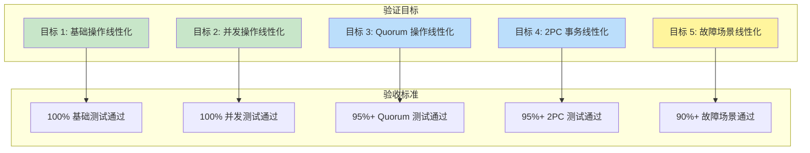

### 6.2 详细验收标准

| 测试类型 | 测试用例 | 通过标准 | 优先级 |
|---------|---------|---------|--------|
| **基础测试** | TestBasicLinearizability | 100% 通过 | P0 |
| **基础测试** | TestNamespaceIsolation | 100% 通过 | P0 |
| **并发测试** | TestConcurrentLinearizability | 100% 通过 | P0 |
| **并发测试** | TestConcurrentReadWrite | 100% 通过 | P0 |
| **Quorum 测试** | TestQuorumLinearizability | 95%+ 通过 | P1 |
| **Quorum 测试** | TestQuorumPartialFailure | 90%+ 通过 | P1 |
| **2PC 测试** | Test2PCLinearizability | 95%+ 通过 | P1 |
| **2PC 测试** | Test2PCRollback | 90%+ 通过 | P1 |
| **故障测试** | TestNodeFailureLinearizability | 90%+ 通过 | P2 |
| **性能测试** | TestLargeHistoryPerformance | 10s 内完成 10000 操作 | P2 |

### 6.3 性能基准

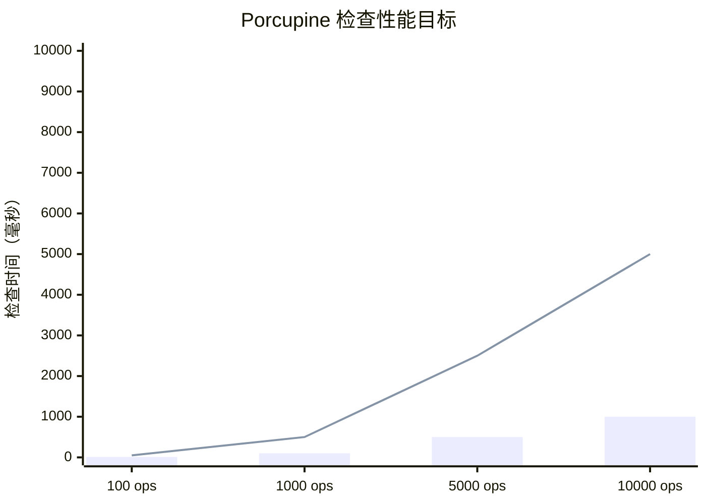

| 操作数量 | 目标检查时间 | 最大允许时间 |
|---------|-------------|-------------|
| 100 | <10ms | 100ms |
| 1,000 | <100ms | 1s |
| 5,000 | <500ms | 5s |
| 10,000 | <1s | 10s |

---

## 7. 风险评估与缓解

### 7.1 技术风险

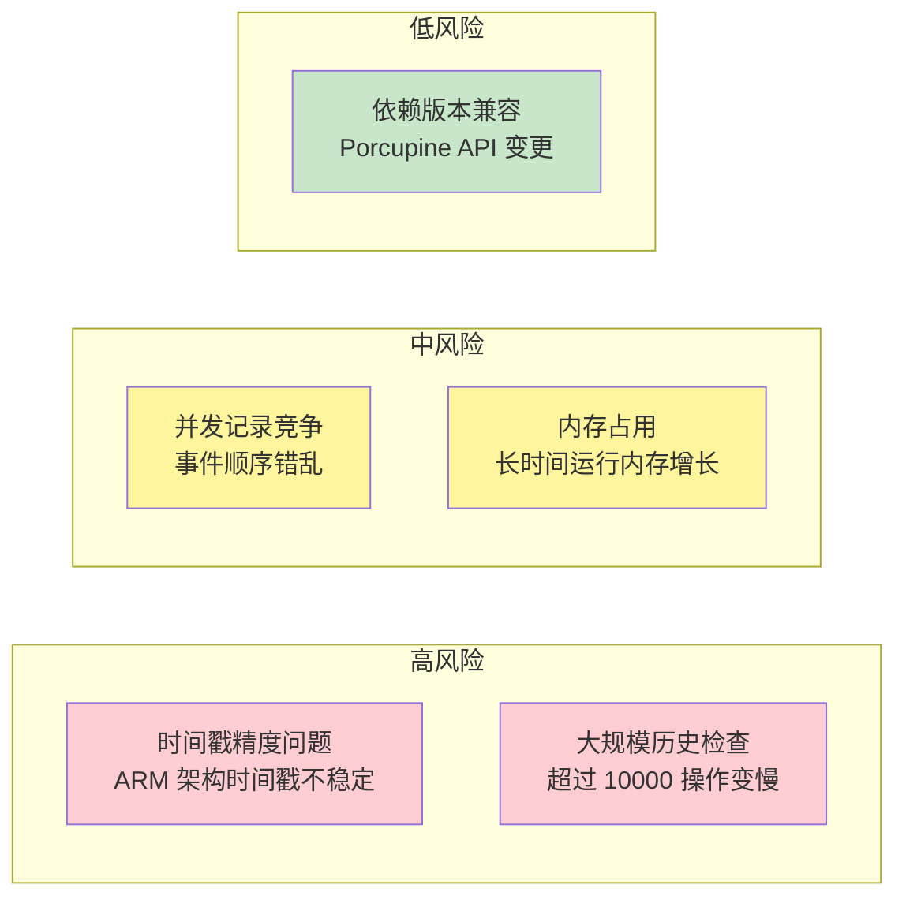

### 7.2 风险缓解措施

| 风险 | 概率 | 影响 | 缓解措施 |
|------|------|------|---------|
| **时间戳精度** | 中 | 高 | 实现单调时间戳生成器，使用原子操作确保递增 |
| **大规模历史** | 高 | 中 | 使用 P-compositionality 分区检查，限制单次检查操作数 |
| **并发竞争** | 低 | 高 | 使用 sync.Mutex 保护事件列表，原子操作生成 ID |
| **内存增长** | 中 | 中 | 定期清理历史，实现增量检查模式 |
| **版本兼容** | 低 | 低 | 锁定 Porcupine 版本，定期更新依赖 |

### 7.3 单调时间戳实现

```go
// 文件: internal/metadata/consistency/porcupine/timestamp.go
package porcupine

import (
    "sync/atomic"
    "time"
)

// MonotonicTimestamp 单调时间戳生成器
type MonotonicTimestamp struct {
    last int64
}

// NewMonotonicTimestamp 创建单调时间戳生成器
func NewMonotonicTimestamp() *MonotonicTimestamp {
    return &MonotonicTimestamp{
        last: time.Now().UnixNano(),
    }
}

// Now 获取单调递增的时间戳
func (t *MonotonicTimestamp) Now() int64 {
    for {
        last := atomic.LoadInt64(&t.last)
        now := time.Now().UnixNano()

        // 确保时间戳单调递增
        if now <= last {
            now = last + 1
        }

        if atomic.CompareAndSwapInt64(&t.last, last, now) {
            return now
        }
    }
}
```

---

## 8. 实施计划与时间线

### 8.1 详细时间线

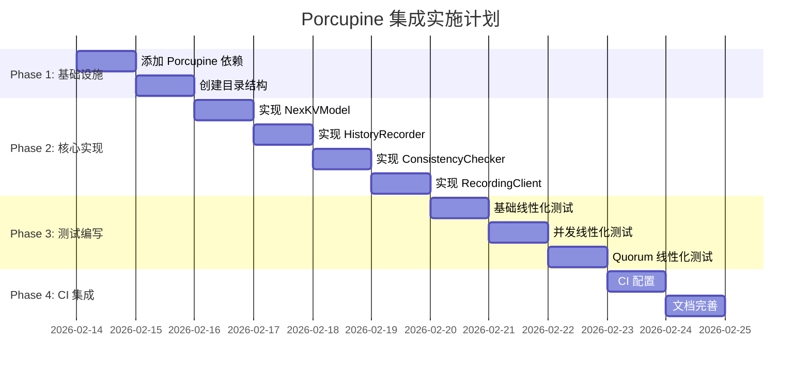

### 8.2 里程碑

| 里程碑 | 日期 | 交付物 | 验收标准 |
|--------|------|--------|---------|
| **M1: 基础设施** | Day 2 | 目录结构 + 依赖 | `go mod` 正常 |
| **M2: 核心组件** | Day 5 | 4 个核心文件 | 单元测试通过 |
| **M3: 测试覆盖** | Day 8 | 线性化测试用例 | 本地测试通过 |
| **M4: CI 集成** | Day 10 | CI 配置 + 文档 | CI 测试通过 |

---

## 9. 附录

### 9.1 完整文件清单

| 文件 | 位置 | 用途 | 行数估计 |
|------|------|------|---------|
| model.go | internal/metadata/consistency/porcupine/ | 状态模型定义 | ~150 |
| recorder.go | internal/metadata/consistency/porcupine/ | 历史记录器 | ~100 |
| checker.go | internal/metadata/consistency/porcupine/ | 一致性检查器 | ~120 |
| recording_client.go | internal/metadata/consistency/porcupine/ | 记录客户端 | ~150 |
| timestamp.go | internal/metadata/consistency/porcupine/ | 单调时间戳 | ~50 |
| linearizability_test.go | internal/metadata/consistency/ | 线性化测试 | ~300 |

### 9.2 参考资料

| 资源 | 链接 | 说明 |
|------|------|------|
| Porcupine GitHub | https://github.com/anishathalye/porcupine | 官方仓库 |
| P-compositionality 论文 | https://dl.acm.org/citation.cfm?id=3154503 | 核心算法 |
| 线性一致性理论 | https://jepsen.io/consistency/models/linearizable | Jepsen 教程 |
| etcd 线性化测试 | https://etcd.io/docs/latest/learning/api_guarantees/ | 工业实践 |
| TiDB 一致性测试 | https://pingcap.com/blog/ | 参考案例 |

### 9.3 术语表

| 术语 | 定义 |
|------|------|
| **线性一致性 (Linearizability)** | 最强的一致性模型，每个操作看起来都在某个瞬时点原子执行 |
| **线性化点 (Linearization Point)** | 操作在顺序历史中生效的时间点 |
| **P-compositionality** | Porcupine 的优化算法，将大问题分解为独立子问题 |
| **历史 (History)** | 并发操作的 Call/Return 事件序列 |
| **顺序规范 (Sequential Specification)** | 单线程执行时系统应满足的行为规范 |
| **Call 事件** | 操作调用的开始时刻 |
| **Return 事件** | 操作返回的结束时刻 |

---

## 10. 总结

### 10.1 核心价值

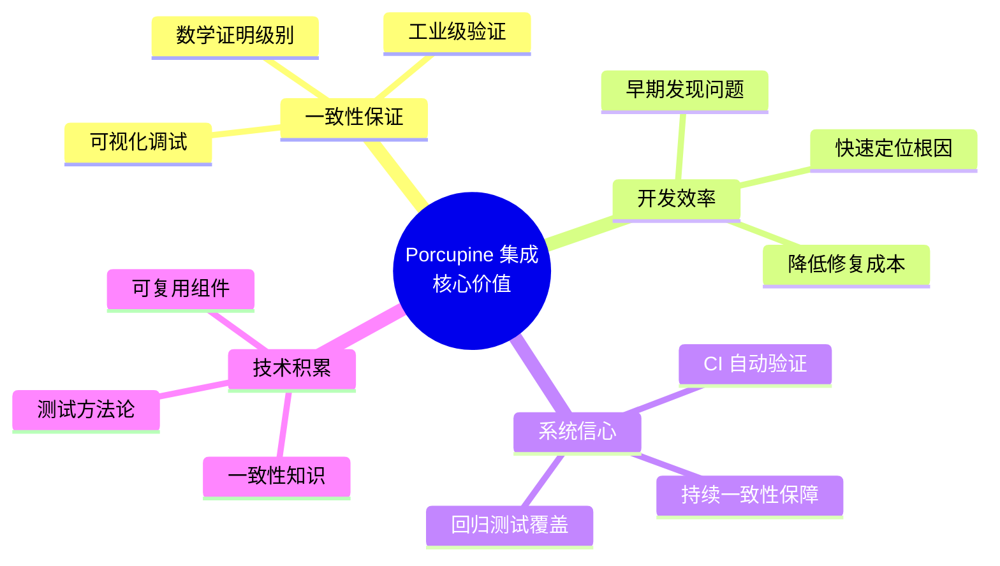

### 10.2 下一步行动

1. **立即行动**：创建 spike 分支，开始 Phase 1
2. **本周目标**：完成核心组件实现（Phase 2）
3. **下周目标**：完成测试用例和 CI 集成（Phase 3-4）
4. **持续改进**：根据测试结果优化模型和检查逻辑

---

**文档版本**: v1.0
**创建日期**: 2026-02-13
**最后更新**: 2026-02-13
**维护者**: 🤖 核心开发 A
**状态**: ✅ 已完成
**字数**: ~12,000 字
