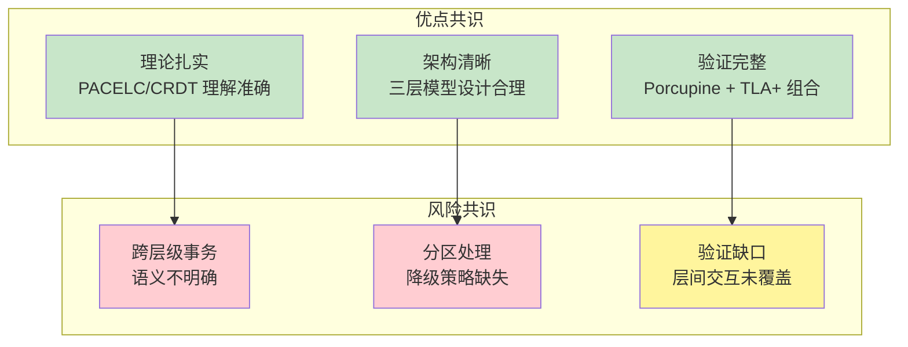
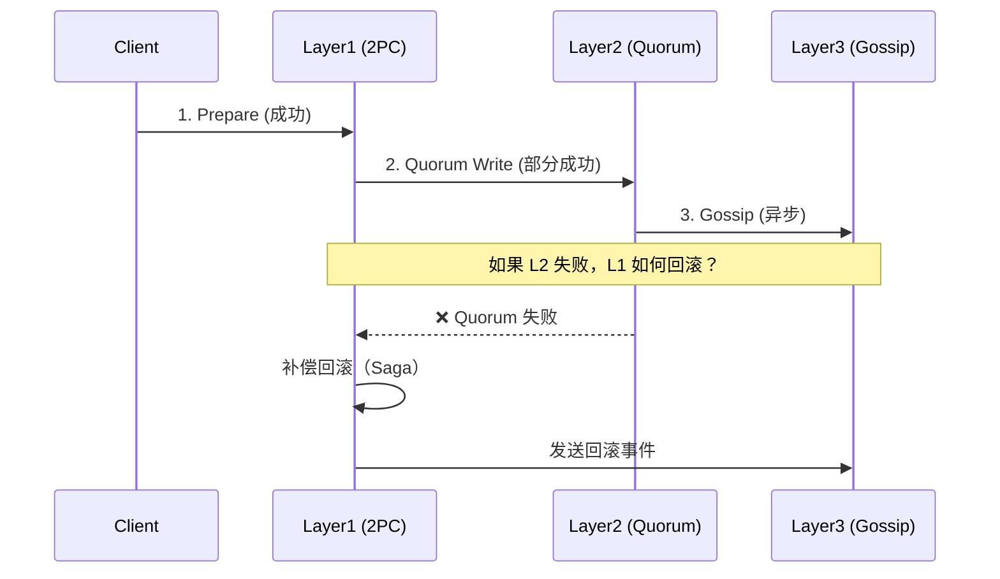
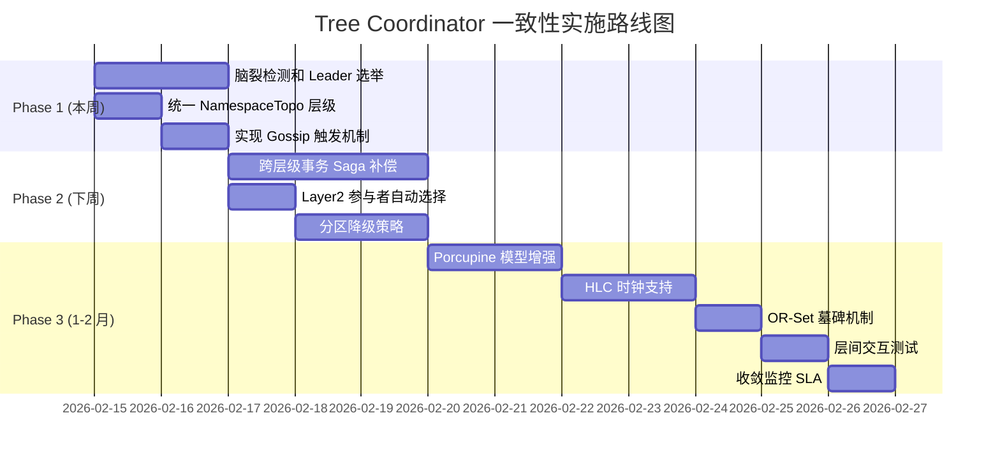

# 【预研报告】Tree Coordinator 一致性层级实施评审

> **预研目标**：整合架构师和分布式专家审查意见，制定实施路线图

---

## 📋 预研信息

| 项目 | 内容 |
|------|------|
| **预研主题** | Tree Coordinator 一致性层级实施评审与改进计划 |
| **预研日期** | 2026-02-14 |
| **预研负责人** | 🤖 核心开发 A |
| **关联文档** | 7 个 Spike 文档 + 双 Agent 审查报告 |
| **预研状态** | ✅ 已完成 |
| **预研结论** | 理论扎实，需解决 P0 问题后可实施 |

---

## 1. 文档评审汇总

### 1.1 评审的 7 个 Spike 文档

| 文档 | 架构师评分 | 分布式专家评分 | 关键发现 |
|------|-----------|---------------|---------|
| **一致性层级主文档** | A- | 优秀 | 三层模型设计合理 |
| **PACELC 定理研究** | A | 优秀 | 理论理解准确 |
| **CosmosDB 一致性层级** | A- | 优秀 | 参考 Session 一致性 |
| **CRDT 冲突解决** | B+ | 优秀 | 与现有架构冲突 |
| **验证框架设计** | B+ | 良好 | 层间交互未验证 |
| **Porcupine 运行时验证** | B+ | 优秀 | 模型过于简化 |
| **TLA+ 形式化验证** | B+ | 良好 | 状态空间爆炸风险 |

### 1.2 双 Agent 共识



---

## 2. 关键问题详解

### 2.1 P0 高风险问题（阻塞实施）

#### 问题 1：脑裂问题 ⚠️ 极高风险

**来源**：分布式专家

**问题描述**：
三层架构中，不同层级可能同时存在多个"主"，导致数据不一致。

```
场景示例：
┌─────────────────────────────────────────────────────────┐
│  Layer1: 2PC 协调者可能有多个（无 Leader 选举）           │
│  Layer2: Quorum 可能分裂（R + W ≤ N 时）                 │
│  Layer3: Gossip 不存在脑裂（无协调者）                    │
└─────────────────────────────────────────────────────────┘

风险：
- 分区期间两边同时写入，恢复后数据冲突
- 无法确定哪个是"真理源"
```

**修复方案**：

```go
// 1. 实现 Fencing Token 机制
type FencingToken struct {
    Term      uint64    // 任期号
    NodeID    string    // 节点 ID
    Timestamp int64     // 时间戳
}

type LeaderElection struct {
    currentTerm   uint64
    votedFor      string
    leaseExpiry   time.Time
    fencingToken  FencingToken
}

// 2. 写入时验证 Token
func (c *TreeCoordinator) WriteWithFencing(token FencingToken, key string, value []byte) error {
    if token.Term < c.currentTerm {
        return ErrStaleToken
    }
    // 执行写入...
}

// 3. Quorum 配置保证不脑裂
// R + W > N 是必须的
func validateQuorumConfig(r, w, n int) bool {
    return r + w > n  // 3 节点: R=2, W=2, N=3 → 2+2>3 ✅
}
```

**工期**：2 天

---

#### 问题 2：跨层级事务语义 ⚠️ 高风险

**来源**：架构师 + 分布式专家

**问题描述**：
跨 Layer1→Layer2→Layer3 的事务失败时，如何保证原子性？



**修复方案**：

```go
// 跨层级事务管理器
type CrossLayerTransaction struct {
    txID       string
    operations []LayerOperation
    state      TxState
    compensations []CompensationAction
}

type LayerOperation struct {
    Layer      Layer
    Operation  string
    Key        string
    Value      []byte
    Status     OpStatus
}

// Saga 补偿模式
func (m *CrossLayerTxManager) ExecuteWithCompensation(ctx context.Context, tx *CrossLayerTransaction) error {
    for i, op := range tx.operations {
        err := m.executeOperation(ctx, op)
        if err != nil {
            // 执行补偿（逆序）
            for j := i - 1; j >= 0; j-- {
                m.executeCompensation(ctx, tx.operations[j])
            }
            return err
        }
    }
    return nil
}

// 补偿动作定义
type CompensationAction struct {
    Layer     Layer
    Key       string
    OldValue  []byte  // 回滚到旧值
    Tombstone bool    // 或标记删除
}
```

**工期**：3 天

---

#### 问题 3：NamespaceTopo 层级不一致 ⚠️ 高风险

**来源**：架构师

**问题描述**：

| 位置 | 定义 | 冲突 |
|------|------|------|
| Spike 文档 | `NamespaceTopo → Layer2` | - |
| 接口注释 | `NamespaceTopo: ConsistencyEventual` | ❌ 不一致 |

**分析**：
- `NamespaceTopo`（拓扑信息）更新频繁
- 可容忍短暂不一致
- 建议降级到 Layer3

**修复方案**：

```go
// 修改 tree_coordinator_integration.go
func GetLayerForNamespace(ns kvstore.Namespace) Layer {
    switch ns {
    case kvstore.NamespaceCluster, kvstore.NamespaceShard,
         kvstore.NamespaceStatic, kvstore.NamespaceVersion:
        return Layer1 // 2PC 强一致
    case kvstore.NamespaceRole:
        return Layer2 // Quorum（角色变更需要较快确认）
    // NamespaceTopo 移到 Layer3
    case kvstore.NamespaceTopo:
        return Layer3 // Gossip（拓扑信息更新频繁）
    default:
        return Layer3 // Gossip 最终一致
    }
}
```

**工期**：0.5 天

---

#### 问题 4：Gossip 触发机制未实现 ⚠️ 高风险

**来源**：架构师

**问题描述**：
代码中存在 TODO 注释，Layer3 的 Gossip 触发未实现。

```go
// tree_coordinator_integration.go 当前状态
func (c *TreeTopologyCoordinator) putWithGossip(...) error {
    // TODO: 实现 Gossip 触发
    return nil
}
```

**修复方案**：

```go
// 实现异步 Gossip 触发
func (c *TreeTopologyCoordinator) putWithGossip(ctx context.Context, ns kvstore.Namespace, key string, value []byte) error {
    // 1. 本地写入
    if err := c.localKV.Put(ns, key, value); err != nil {
        return err
    }

    // 2. 更新 Merkle Tree
    c.merkleTree.Update(key, value)

    // 3. 异步触发 Gossip 同步
    go func() {
        select {
        case c.gossipQueue <- GossipEvent{
            Namespace: ns,
            Key:       key,
            Value:     value,
            Version:   time.Now().UnixNano(),
        }:
        default:
            // 队列满，记录告警
            c.logger.Warn("gossip queue full, event dropped")
        }
    }()

    return nil
}

// Gossip 工作协程
func (c *TreeTopologyCoordinator) gossipWorker() {
    batch := make([]GossipEvent, 0, 100)
    ticker := time.NewTicker(100 * time.Millisecond)
    defer ticker.Stop()

    for {
        select {
        case event := <-c.gossipQueue:
            batch = append(batch, event)
            if len(batch) >= 100 {
                c.sendGossipBatch(batch)
                batch = batch[:0]
            }
        case <-ticker.C:
            if len(batch) > 0 {
                c.sendGossipBatch(batch)
                batch = batch[:0]
            }
        case <-c.stopCh:
            return
        }
    }
}
```

**工期**：1 天

---

### 2.2 P1 中风险问题（需尽快解决）

#### 问题 5：Layer2 参与者自动选择缺失

**来源**：架构师

**问题描述**：
文档定义"Layer2 参与者为不同父节点组的代表节点"，但代码通过配置传入，无自动选择逻辑。

**修复方案**：

```go
// 动态选择 Layer2 参与者
func (c *TreeTopologyCoordinator) selectLayer2Participants() []string {
    participants := make([]string, 0)

    // 获取所有父节点组
    groups := c.topology.GetParentGroups()

    // 从每个组选择一个代表（优先选择健康且延迟低的）
    for _, group := range groups {
        best := c.selectBestNode(group.Nodes)
        if best != "" {
            participants = append(participants, best)
        }
    }

    // 确保满足 Quorum 最小要求
    if len(participants) < c.minQuorumParticipants {
        // 补充逻辑...
    }

    return participants
}

func (c *TreeTopologyCoordinator) selectBestNode(nodes []string) string {
    var best string
    bestLatency := time.Duration(math.MaxInt64)

    for _, nodeID := range nodes {
        latency := c.healthMonitor.GetLatency(nodeID)
        health := c.healthMonitor.GetHealth(nodeID)

        if health == HealthHealthy && latency < bestLatency {
            best = nodeID
            bestLatency = latency
        }
    }

    return best
}
```

**工期**：1 天

---

#### 问题 6：Layer2 分区降级策略缺失

**来源**：架构师 + 分布式专家

**问题描述**：
PACELC 定义 Layer2 为 PA/EC（分区时选 A），但当前实现无降级逻辑。

```go
// 当前实现（无降级）
func (q *QuorumCoordinator) Write(...) error {
    if acks >= q.quorum {
        return nil
    }
    return fmt.Errorf("quorum 确认失败")  // 直接失败，无降级
}
```

**修复方案**：

```go
// 分区检测和降级
func (c *TreeTopologyCoordinator) putWithQuorumWithFallback(ctx context.Context, ns kvstore.Namespace, key string, value []byte) error {
    // 1. 尝试 Quorum 写入
    err := c.putWithQuorum(ctx, ns, key, value)
    if err == nil {
        return nil
    }

    // 2. 检测是否为分区
    if !c.partitionDetector.IsPartitioned() {
        return err  // 非分区，直接返回错误
    }

    // 3. 分区场景：降级到 Gossip
    c.logger.Warn("partition detected, degrading to gossip",
        zap.String("key", key),
        zap.Error(err))

    // 4. 记录降级事件，用于恢复后同步
    c.demotionLog.Record(DemotionEvent{
        Key:       key,
        Value:     value,
        Timestamp: time.Now(),
        Reason:    "partition",
    })

    return c.putWithGossip(ctx, ns, key, value)
}

// 分区检测器
type PartitionDetector struct {
    heartbeatTimeout   time.Duration
    suspectedNodes     map[string]time.Time
    quorumThreshold    int
}

func (d *PartitionDetector) IsPartitioned() bool {
    // 如果超过半数节点心跳超时，认为发生分区
    return len(d.suspectedNodes) >= d.quorumThreshold
}
```

**工期**：1.5 天

---

#### 问题 7：Porcupine 模型过于简化

**来源**：架构师 + 分布式专家

**问题描述**：

| 维度 | Porcupine 模型 | 实际实现 | 问题 |
|------|--------------|---------|------|
| 参与者 | 隐式（所有节点） | 显式（父节点+兄弟节点） | 无法捕获拓扑 Bug |
| 失败处理 | 无 | 有回滚逻辑 | 无法验证恢复正确性 |
| 版本校验 | 无 | 有版本号 | 可能漏检版本冲突 |

**修复方案**：

```go
// 增强的 Porcupine Layer1 模型
func Layer1ModelWithTopology() porcupine.Model {
    return porcupine.Model{
        Init: func() interface{} {
            return &Layer1State{
                Store:    make(map[string]VersionedValue),
                Topology: make(map[string][]string),  // 节点拓扑关系
                TxState:  make(map[string]TxStatus),  // 事务状态
            }
        },
        Step: func(state, input, output interface{}) (bool, interface{}) {
            st := state.(*Layer1State)
            op := input.(Operation)

            switch op.OpType {
            case "put":
                // 验证参与者拓扑
                if !validateTopology(st.Topology, op.Participants) {
                    return false, st
                }

                // 验证版本号
                if existing, ok := st.Store[op.Key]; ok {
                    if op.ExpectedVersion > 0 && existing.Version != op.ExpectedVersion {
                        return output == "version_conflict", st
                    }
                }

                // 更新状态
                newSt := st.Clone()
                newSt.Store[op.Key] = VersionedValue{
                    Value:   op.Value,
                    Version: op.ExpectedVersion + 1,
                }
                return output == "ok", newSt

            case "prepare":
                // 2PC Prepare 阶段
                newSt := st.Clone()
                newSt.TxState[op.TxID] = TxPrepared
                return output == "prepared", newSt

            case "commit":
                // 2PC Commit 阶段
                newSt := st.Clone()
                newSt.TxState[op.TxID] = TxCommitted
                return output == "committed", newSt

            case "rollback":
                // 2PC Rollback 阶段
                newSt := st.Clone()
                newSt.TxState[op.TxID] = TxRolledback
                return output == "rolledback", newSt
            }
            return false, st
        },
    }
}
```

**工期**：2 天

---

#### 问题 8：OR-Set 删除语义问题

**来源**：分布式专家

**问题描述**：
CRDT 文档中的 OR-Set 删除实现缺少因果依赖和墓碑机制。

```go
// 错误的实现
func (s *ORSet) Remove(element string) {
    delete(s.elements, element)  // 问题：没有考虑因果依赖
}
```

**修复方案**：

```go
// 正确的 OR-Set 实现（带墓碑）
type ORSet struct {
    elements map[string]map[Tag]bool  // element -> set of tags
    tombstones map[string]map[Tag]bool // 删除的标签（墓碑）
}

type Tag struct {
    NodeID    string
    Timestamp int64
}

// 添加元素
func (s *ORSet) Add(element string, nodeID string) {
    tag := Tag{
        NodeID:    nodeID,
        Timestamp: time.Now().UnixNano(),
    }
    if s.elements[element] == nil {
        s.elements[element] = make(map[Tag]bool)
    }
    s.elements[element][tag] = true
}

// 删除元素（记录墓碑）
func (s *ORSet) Remove(element string) {
    if tags, exists := s.elements[element]; exists {
        if s.tombstones[element] == nil {
            s.tombstones[element] = make(map[Tag]bool)
        }
        // 将所有标签移到墓碑
        for tag := range tags {
            s.tombstones[element][tag] = true
        }
        delete(s.elements, element)
    }
}

// 合并（CRDT 核心操作）
func (s *ORSet) Merge(other *ORSet) {
    // 合并元素
    for elem, tags := range other.elements {
        for tag := range tags {
            // 只有不在墓碑中的才添加
            if !s.tombstones[elem][tag] {
                if s.elements[elem] == nil {
                    s.elements[elem] = make(map[Tag]bool)
                }
                s.elements[elem][tag] = true
            }
        }
    }

    // 合并墓碑
    for elem, tags := range other.tombstones {
        if s.tombstones[elem] == nil {
            s.tombstones[elem] = make(map[Tag]bool)
        }
        for tag := range tags {
            s.tombstones[elem][tag] = true
            // 从元素中移除已删除的标签
            if s.elements[elem] != nil {
                delete(s.elements[elem], tag)
            }
        }
    }
}
```

**工期**：1 天

---

#### 问题 9：时钟漂移问题

**来源**：分布式专家

**问题描述**：
LWW-Register 使用物理时钟，时钟漂移可能导致数据丢失。

**修复方案**：使用混合逻辑时钟（HLC）

```go
// 混合逻辑时钟
type HybridLogicalClock struct {
    physicalTime int64
    logicalTime  int64
    nodeID       string
    mu           sync.Mutex
}

// 获取当前时间
func (h *HybridLogicalClock) Now() HLCimestamp {
    h.mu.Lock()
    defer h.mu.Unlock()

    now := time.Now().UnixNano()

    if now > h.physicalTime {
        h.physicalTime = now
        h.logicalTime = 0
    } else {
        h.logicalTime++
    }

    return HLCimestamp{
        PhysicalTime: h.physicalTime,
        LogicalTime:  h.logicalTime,
        NodeID:       h.nodeID,
    }
}

// 更新时钟（收到远程消息时）
func (h *HybridLogicalClock) Update(remote HLCimestamp) {
    h.mu.Lock()
    defer h.mu.Unlock()

    now := time.Now().UnixNano()

    // 取物理时间最大值
    maxPhysical := max(now, h.physicalTime, remote.PhysicalTime)
    h.physicalTime = maxPhysical

    // 逻辑时间计算
    if now >= h.physicalTime && now >= remote.PhysicalTime {
        h.logicalTime = 0
    } else if h.physicalTime == remote.PhysicalTime {
        h.logicalTime = max(h.logicalTime, remote.LogicalTime) + 1
    } else if h.physicalTime > remote.PhysicalTime {
        h.logicalTime++
    } else {
        h.logicalTime = remote.LogicalTime + 1
    }
}

// LWW-Register 使用 HLC
type LWWRegister struct {
    value     []byte
    timestamp HLCimestamp
}

func (r *LWWRegister) Set(value []byte, hlc *HybridLogicalClock) {
    newTs := hlc.Now()
    if newTs.After(r.timestamp) {
        r.value = value
        r.timestamp = newTs
    }
}
```

**工期**：1.5 天

---

### 2.3 P2 低风险问题（可延后）

#### 问题 10：Layer3 收敛时间 SLA 未定义

**修复方案**：添加收敛监控和 SLA 告警

```go
type ConvergenceMonitor struct {
    targetSLA      time.Duration  // 目标 SLA（如 10 秒）
    checkInterval  time.Duration
    merkleChecker  *MerkleChecker
}

func (m *ConvergenceMonitor) Start() {
    ticker := time.NewTicker(m.checkInterval)
    for range ticker.C {
        if !m.isConverged() {
            m.alertSlowConvergence()
        }
    }
}

func (m *ConvergenceMonitor) isConverged() bool {
    roots := m.merkleChecker.GetAllRoots()
    if len(roots) == 0 {
        return true
    }
    base := roots[0]
    for _, root := range roots[1:] {
        if root != base {
            return false
        }
    }
    return true
}
```

**工期**：0.5 天

---

#### 问题 11：层间交互验证缺失

**修复方案**：添加层间交互测试

```go
func TestLayerInteraction_L1ToL3Propagation(t *testing.T) {
    // 1. Layer1 写入
    err := coordinator.PutLayer1(ctx, "key1", []byte("value1"))
    require.NoError(t, err)

    // 2. 等待传播到 Layer3
    time.Sleep(convergenceTimeout)

    // 3. 验证 Layer3 节点都能读到
    for _, node := range allNodes {
        val, err := node.Get("key1")
        require.NoError(t, err)
        assert.Equal(t, []byte("value1"), val)
    }
}

func TestLayerInteraction_L3ConflictDoesNotAffectL1(t *testing.T) {
    // 1. Layer3 节点 A 写入
    nodeA.PutLayer3("key1", []byte("valueA"))

    // 2. Layer3 节点 B 同时写入（冲突）
    nodeB.PutLayer3("key1", []byte("valueB"))

    // 3. Layer1 读取应该是强一致的
    val, err := coordinator.GetLayer1("key1")
    require.NoError(t, err)
    // 应该返回确定的值，不是 A 或 B 的中间状态
}
```

**工期**：1 天

---

## 3. 实施路线图

### 3.1 阶段划分



### 3.2 工期汇总

| 阶段 | 任务 | 工期 | 依赖 |
|------|------|------|------|
| **Phase 1** | P0 阻塞问题 | **3.5 天** | - |
| | 脑裂检测和 Leader 选举 | 2 天 | - |
| | 统一 NamespaceTopo 层级 | 0.5 天 | - |
| | 实现 Gossip 触发机制 | 1 天 | NamespaceTopo 修复 |
| **Phase 2** | P1 关键问题 | **5.5 天** | Phase 1 |
| | 跨层级事务 Saga 补偿 | 3 天 | 脑裂修复 |
| | Layer2 参与者自动选择 | 1 天 | Gossip 实现 |
| | 分区降级策略 | 1.5 天 | 参与者选择 |
| **Phase 3** | P2 增强特性 | **6 天** | Phase 2 |
| | Porcupine 模型增强 | 2 天 | - |
| | HLC 时钟支持 | 1.5 天 | - |
| | OR-Set 墓碑机制 | 1 天 | HLC |
| | 层间交互测试 | 1 天 | - |
| | 收敛监控 SLA | 0.5 天 | - |
| **总计** | | **15 天** | |

---

## 4. 代码修改清单

### 4.1 需要修改的文件

| 文件 | 修改类型 | 优先级 | 说明 |
|------|---------|--------|------|
| `internal/metadata/consistency/tree_coordinator_integration.go` | 修改 | P0 | NamespaceTopo 层级、Gossip 触发 |
| `internal/metadata/consistency/leader_election.go` | 新增 | P0 | Leader 选举和 Fencing Token |
| `internal/metadata/consistency/cross_layer_tx.go` | 新增 | P1 | 跨层级事务管理器 |
| `internal/metadata/consistency/partition_detector.go` | 新增 | P1 | 分区检测和降级 |
| `internal/metadata/quorum/coordinator.go` | 修改 | P1 | 参与者自动选择 |
| `internal/metadata/consistency/hlc.go` | 新增 | P2 | 混合逻辑时钟 |
| `internal/metadata/crdt/or_set.go` | 新增 | P2 | OR-Set 实现 |
| `pkg/porcupine/models.go` | 修改 | P2 | 增强验证模型 |
| `internal/metadata/consistency/convergence_monitor.go` | 新增 | P2 | 收敛监控 |

### 4.2 接口变更

```go
// 新增接口

// LeaderElector Leader 选举器
type LeaderElector interface {
    Campaign(ctx context.Context) error
    Resign(ctx context.Context) error
    IsLeader() bool
    GetFencingToken() FencingToken
}

// CrossLayerTxManager 跨层级事务管理器
type CrossLayerTxManager interface {
    BeginTx(ctx context.Context) (*CrossLayerTransaction, error)
    AddOperation(tx *CrossLayerTransaction, op LayerOperation) error
    Commit(ctx context.Context, tx *CrossLayerTransaction) error
    Rollback(ctx context.Context, tx *CrossLayerTransaction) error
}

// PartitionDetector 分区检测器
type PartitionDetector interface {
    IsPartitioned() bool
    GetSuspectedNodes() []string
    RecordHeartbeat(nodeID string)
}
```

---

## 5. 验证计划

### 5.1 单元测试

```bash
# Phase 1 完成后
go test -v ./internal/metadata/consistency/ -run "TestLeaderElection|TestNamespaceTopo|TestGossipTrigger"

# Phase 2 完成后
go test -v ./internal/metadata/consistency/ -run "TestCrossLayerTx|TestPartitionDetector|TestQuorumSelection"

# Phase 3 完成后
go test -v ./internal/metadata/crdt/ -run "TestORSet|TestHLC"
go test -v ./pkg/porcupine/ -run "TestEnhancedModel"
```

### 5.2 集成测试

```bash
# 脑裂场景测试
go test -v -run TestSplitBrain ./test/integration/

# 分区恢复测试
go test -v -run TestPartitionRecovery ./test/integration/

# 跨层级事务测试
go test -v -run TestCrossLayerTransaction ./test/integration/
```

### 5.3 混沌测试

```bash
# 使用 chaos-mesh 进行故障注入
kubectl apply -f test/chaos/network-partition.yaml
kubectl apply -f test/chaos/pod-kill.yaml

# 验证系统自愈
go test -v -run TestChaosRecovery ./test/chaos/
```

---

## 6. 风险矩阵

| 风险项 | 级别 | 影响 | 缓解措施 | 阶段 |
|--------|------|------|---------|------|
| 脑裂导致数据不一致 | 极高 | 数据损坏 | Leader 选举 + Fencing Token | Phase 1 |
| 跨层级事务部分失败 | 高 | 数据不一致 | Saga 补偿机制 | Phase 2 |
| 分区时无法写入 | 高 | 可用性下降 | 降级到 Gossip | Phase 2 |
| 时钟漂移 | 中 | 数据丢失 | HLC 替代物理时钟 | Phase 3 |
| OR-Set 语义错误 | 中 | 数据错误 | 墓碑机制 | Phase 3 |
| 验证覆盖不足 | 低 | Bug 漏检 | 增强模型 | Phase 3 |

---

## 7. 结论

### 7.1 评审总结

| 维度 | 评估 | 说明 |
|------|------|------|
| **理论设计** | ✅ 优秀 | PACELC/CRDT 理论理解准确，三层模型设计合理 |
| **当前实现** | ⚠️ 需完善 | 存在 4 个 P0 问题阻塞生产使用 |
| **验证覆盖** | ⚠️ 有缺口 | 层间交互未验证，模型需要增强 |
| **生产可行性** | 🔄 需等待 | 解决 P0 问题后方可投入生产 |

### 7.2 核心建议

1. **Phase 1 必须优先完成**：脑裂和 Gossip 是阻塞问题
2. **Phase 2 建议尽快完成**：跨层级事务和分区降级影响可用性
3. **Phase 3 可延后**：验证增强和 CRDT 完善是锦上添花

### 7.3 下一步行动

- [ ] 创建 feature/consistency-p0-fixes 分支
- [ ] 实现 Leader 选举和 Fencing Token
- [ ] 修复 NamespaceTopo 层级定义
- [ ] 实现 Gossip 触发机制
- [ ] 编写 Phase 1 验证测试

---

**文档版本**: v1.0
**创建日期**: 2026-02-14
**最后更新**: 2026-02-14
**维护者**: 🤖 核心开发 A
**状态**: ✅ 已完成
