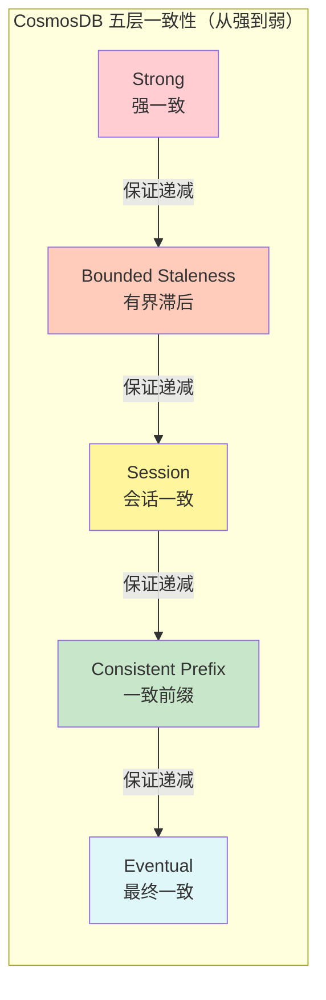
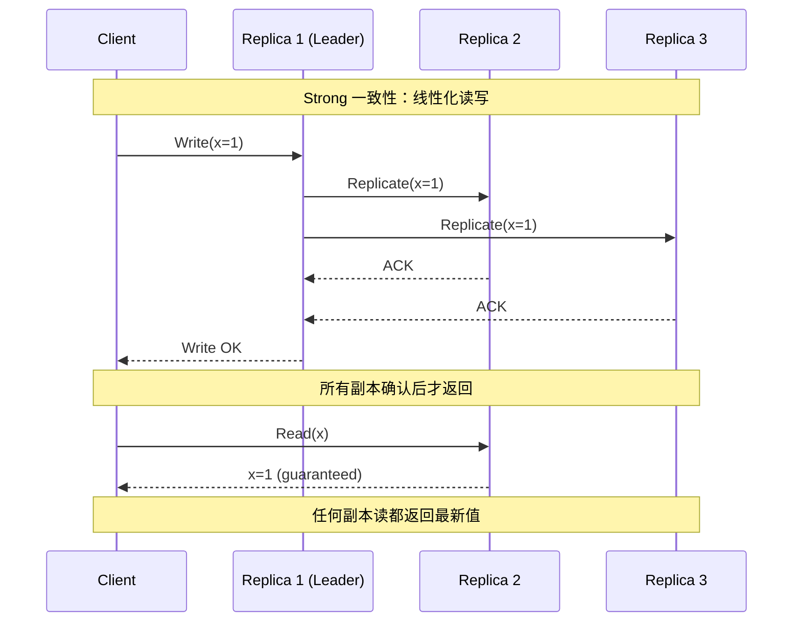
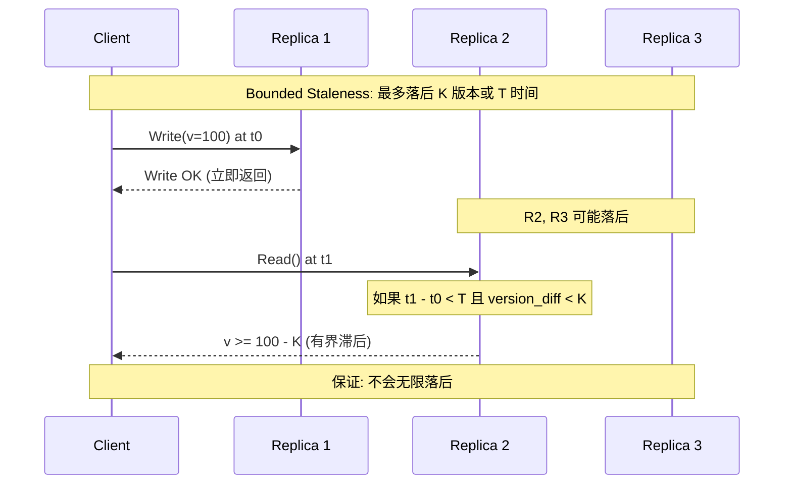
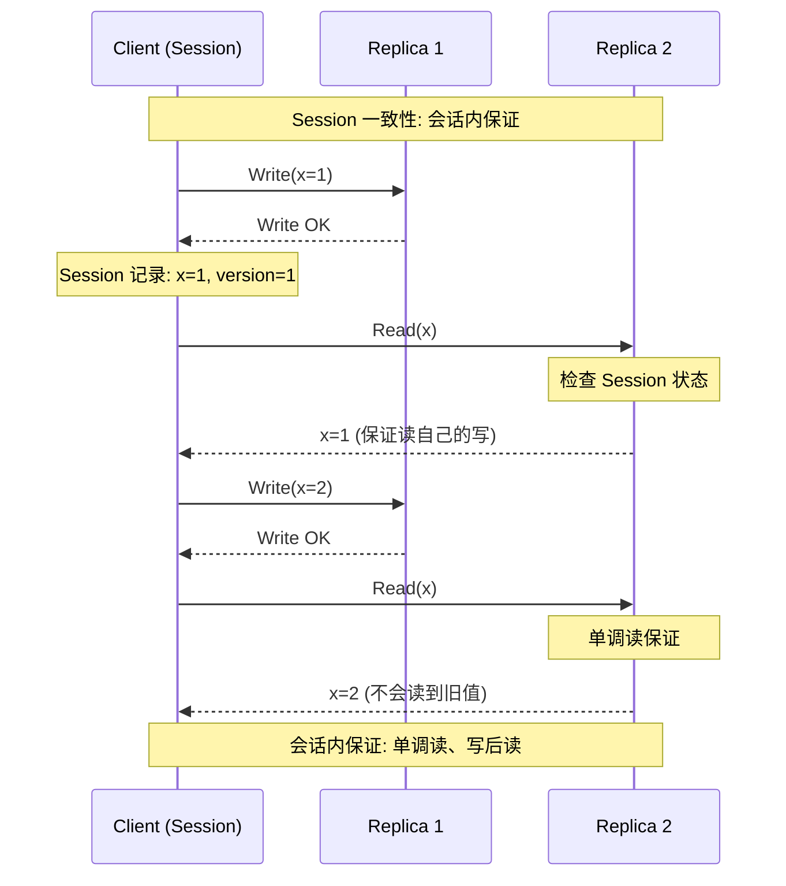
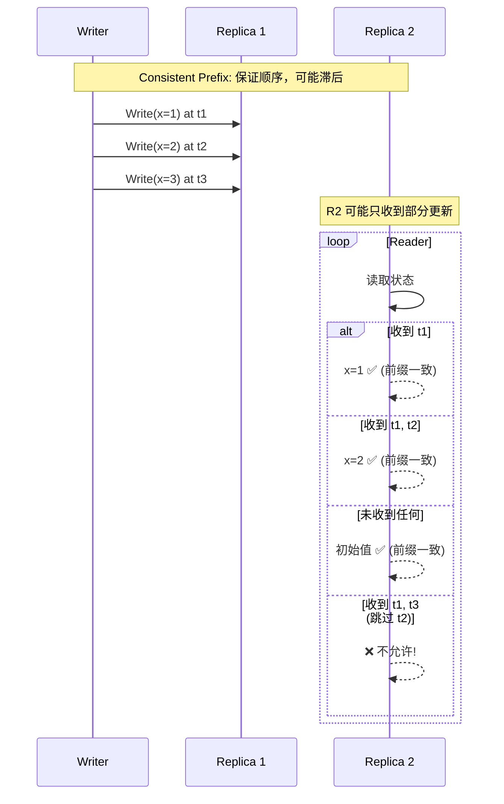
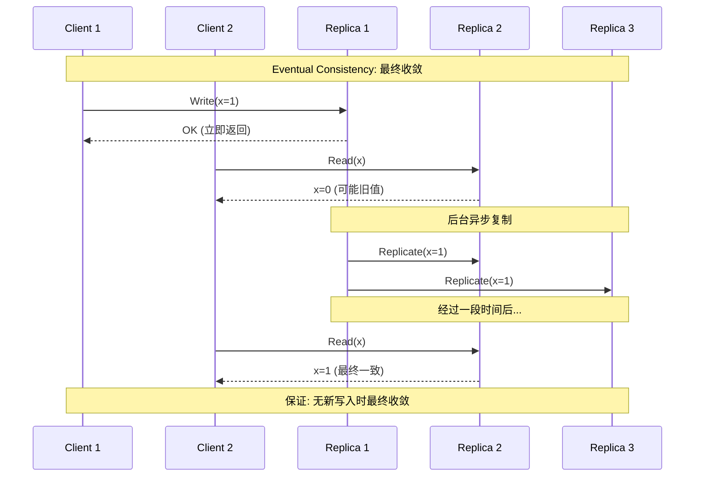
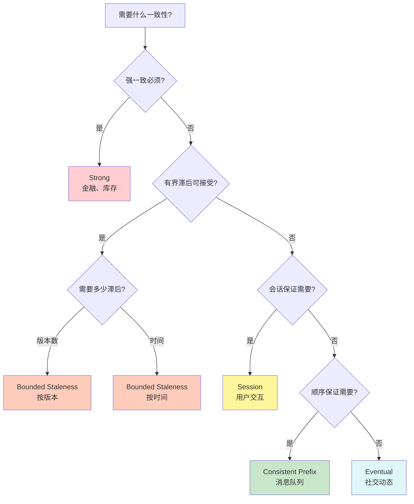
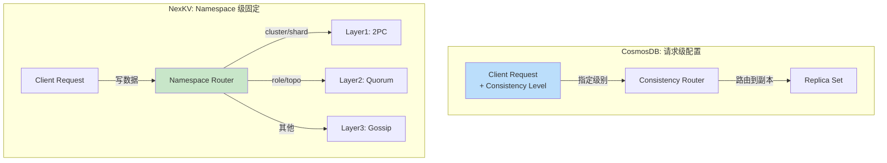
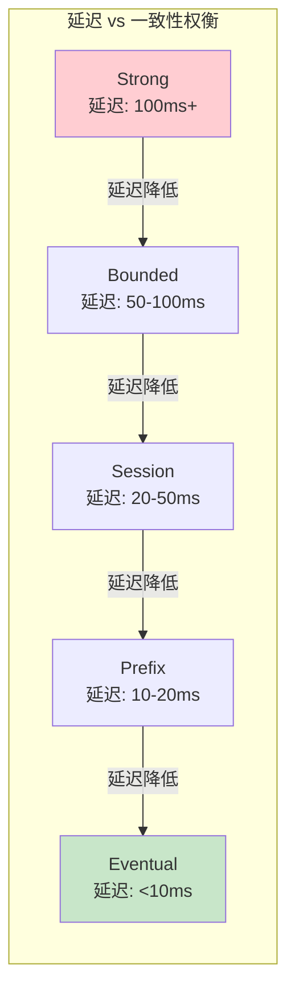

# 【预研报告】CosmosDB 一致性层级深度研究

> **预研目标**：研究 Azure CosmosDB 的五层一致性模型，为 NexKV 提供工业界最佳实践参考

---

## 📋 预研信息

| 项目 | 内容 |
|------|------|
| **预研主题** | CosmosDB 五层一致性模型 |
| **预研日期** | 2026-02-14 |
| **预研负责人** | 🤖 核心开发 A |
| **官方文档** | [Azure CosmosDB Consistency Levels](https://learn.microsoft.com/en-us/azure/cosmos-db/consistency-levels) |
| **预研状态** | ✅ 已完成 |

---

## 1. CosmosDB 一致性层级概述

### 1.1 五层一致性谱系



### 1.2 一致性级别对比

| 级别 | 读保证 | 写保证 | 延迟 | 可用性 | 适用场景 |
|------|--------|--------|------|--------|---------|
| **Strong** | 线性一致 | 同步复制 | 最高 | 最低 | 金融交易 |
| **Bounded Staleness** | 最多落后 K 版本/T 时间 | 同步 + 异步 | 高 | 中 | 实时分析 |
| **Session** | 会话内单调读写 | 异步 | 中 | 高 | 用户会话 |
| **Consistent Prefix** | 保序但可能滞后 | 异步 | 低 | 高 | 消息队列 |
| **Eventual** | 最终收敛 | 异步 | 最低 | 最高 | 社交动态 |

---

## 2. 五层一致性详解

### 2.1 Strong（强一致）



**特点**：
- ✅ 线性一致性（Linearizable）
- ✅ 任何副本的读都返回最新写入
- ❌ 延迟最高（需要同步复制）
- ❌ 可用性最低（任何副本故障都会阻塞）

**数学定义**：
```
Strong Consistency:
  ∀ read(r): r returns the latest committed write
  ∀ ops: total order exists
```

### 2.2 Bounded Staleness（有界滞后）



**特点**：
- ✅ 有界的一致性保证
- ✅ 可配置的滞后阈值（K 版本或 T 时间）
- ⚠️ 延迟和可用性的平衡点
- ⚠️ 实现复杂度高

**数学定义**：
```
Bounded Staleness:
  ∀ read(r) at time t:
    |t - t_latest_commit| ≤ T  ∨
    |version(r) - version_latest| ≤ K
```

**配置参数**：
| 参数 | 说明 | 典型值 |
|------|------|--------|
| **K (Versions)** | 允许落后的版本数 | 10-1000 |
| **T (Time)** | 允许落后的时间 | 100ms-5min |

### 2.3 Session（会话一致）



**Session 一致性保证**：

| 保证 | 说明 |
|------|------|
| **Read Your Writes** | 读到自己最新的写 |
| **Monotonic Reads** | 后续读不会比之前读旧 |
| **Monotonic Writes** | 写顺序保持 |
| **Writes Follow Reads** | 写在相关的读之后 |

**数学定义**：
```
Session Consistency:
  Let S be a session, op1, op2 ∈ S, op1 → op2 (causality):
    - If op1 = Write(x), op2 = Read(x): Read returns value ≥ Write(x).value
    - If op1 = Read(x), op2 = Read(x): op2.value ≥ op1.value
```

### 2.4 Consistent Prefix（一致前缀）



**特点**：
- ✅ 保证更新顺序一致
- ✅ 不会看到"未来"的状态
- ⚠️ 可能看到旧状态
- ⚠️ 不保证时效性

**数学定义**：
```
Consistent Prefix:
  If a read sees version v_n, it must also see all v_i where i < n
  (reads see a prefix of the write sequence)
```

### 2.5 Eventual（最终一致）



**特点**：
- ✅ 最高可用性
- ✅ 最低延迟
- ❌ 可能读到陈旧数据
- ❌ 无顺序保证

**数学定义**：
```
Eventual Consistency:
  If no new updates are made, eventually all accesses return the last updated value
  (no guarantee on when convergence happens)
```

---

## 3. 一致性级别选择指南

### 3.1 决策树



### 3.2 场景映射

| 场景 | 推荐级别 | 理由 |
|------|---------|------|
| **银行转账** | Strong | 余额必须准确 |
| **库存管理** | Strong/Bounded | 超卖不可接受 |
| **用户资料** | Session | 用户看到自己的更新 |
| **消息队列** | Consistent Prefix | 顺序重要 |
| **点赞计数** | Eventual | 最终准确即可 |
| **日志分析** | Bounded Staleness | 允许一定滞后 |
| **购物车** | Session | 用户体验优先 |

---

## 4. NexKV 与 CosmosDB 对比

### 4.1 架构对比



### 4.2 一致性映射

| CosmosDB 级别 | NexKV Layer | 对应关系 |
|--------------|-------------|---------|
| **Strong** | Layer1 (2PC) | 完全对应 |
| **Bounded Staleness** | Layer2 (Quorum) | 部分对应（Quorum 提供有界滞后） |
| **Session** | - | 未实现 |
| **Consistent Prefix** | Layer3 (Gossip) | Gossip 保证顺序传播 |
| **Eventual** | Layer3 (Gossip) | 完全对应 |

### 4.3 差异分析

| 维度 | CosmosDB | NexKV |
|------|----------|-------|
| **配置粒度** | 请求级别 | Namespace 级别 |
| **级别数量** | 5 种 | 3 种 |
| **Session 支持** | ✅ | ❌ |
| **Bounded Staleness** | ✅ 可配置 K/T | ⚠️ 隐式（Quorum） |
| **动态切换** | ✅ | ❌ |
| **SLA 保证** | ✅ 99.999% | ❌ |
| **适用场景** | 多租户云服务 | 单租户内部系统 |

---

## 5. NexKV 优化建议

### 5.1 短期：保持简化

```go
// 当前设计：Namespace 级固定
func (c *TreeTopologyCoordinator) GetLayerForNamespace(ns string) Layer {
    switch ns {
    case "cluster", "shard", "static", "version":
        return Layer1 // ~ Strong
    case "role", "topo":
        return Layer2 // ~ Bounded Staleness
    default:
        return Layer3 // ~ Eventual
    }
}
```

### 5.2 中期：添加 Bounded Staleness

```go
// 增强设计：Layer2 支持配置
type Layer2Config struct {
    // 允许落后的最大版本数
    MaxVersionLag int

    // 允许落后的最大时间
    MaxTimeLag time.Duration

    // 是否启用 Session 保证
    SessionGuarantees bool
}

func (c *TreeTopologyCoordinator) PutWithLayer2Config(
    ctx context.Context,
    ns, key string,
    value any,
    config *Layer2Config,
) error {
    // 检查是否在允许的滞后范围内
    if c.checkLag(config) {
        return c.quorumCoordinator.Put(ctx, ns, key, value)
    }
    // 超出范围，等待同步
    return c.waitForSync(ctx, config)
}
```

### 5.3 长期：Session 支持

```go
// Session 一致性支持
type SessionContext struct {
    SessionID   string
    LastWrite   map[string]Version  // key -> last write version
    LastRead    map[string]Version  // key -> last read version
}

func (c *TreeTopologyCoordinator) ReadWithSession(
    ctx context.Context,
    session *SessionContext,
    key string,
) (any, error) {
    // 1. 获取最后写入版本
    lastWriteVersion := session.LastWrite[key]

    // 2. 确保读到 >= lastWriteVersion
    value, version, err := c.readAtLeastVersion(ctx, key, lastWriteVersion)
    if err != nil {
        return nil, err
    }

    // 3. 更新 session 状态
    session.LastRead[key] = version

    return value, nil
}
```

---

## 6. 一致性权衡矩阵

### 6.1 延迟 vs 一致性



### 6.2 可用性 vs 一致性

| 级别 | 分区时可用性 | 分区时一致性 |
|------|------------|------------|
| **Strong** | ❌ 不可用 | ✅ 完全一致 |
| **Bounded** | ⚠️ 部分可用 | ⚠️ 有界滞后 |
| **Session** | ✅ 可用 | ⚠️ 会话内一致 |
| **Prefix** | ✅ 可用 | ⚠️ 顺序一致 |
| **Eventual** | ✅ 可用 | ❌ 可能不一致 |

---

## 7. 参考资料

### 7.1 官方文档

- [Azure CosmosDB - Consistency Levels](https://learn.microsoft.com/en-us/azure/cosmos-db/consistency-levels)
- [Consistency Level Tradeoffs](https://learn.microsoft.com/en-us/azure/cosmos-db/consistency-level-tradeoffs)

### 7.2 学术论文

- [Principles of Eventual Consistency - Microsoft Research](https://www.microsoft.com/en-us/research/wp-content/uploads/2016/02/final-printversion-10-5-14.pdf)
- [Consistency Models Survey - arXiv](https://arxiv.org/abs/1902.03305)

### 7.3 相关博客

- [CosmosDB Consistency Levels Explained](https://blog.nashtechglobal.com/global-data-distribution-and-consistency-levels-in-cosmos-db/)
- [Bounded Staleness Deep Dive](https://devblogs.microsoft.com/cosmosdb/bounded-staleness-consistency-in-azure-cosmos-db/)

---

## 8. 结论

### 8.1 核心要点

1. **CosmosDB 提供 5 种一致性级别**：从 Strong 到 Eventual
2. **请求级配置**：每个请求可以选择不同的一致性级别
3. **SLA 驱动**：99.999% 可用性保证
4. **NexKV 采用简化设计**：Namespace 级固定，3 种级别

### 8.2 对 NexKV 的启示

| 启示 | 建议 |
|------|------|
| **简化优于灵活** | 当前 3 层设计足够 |
| **Session 一致性有价值** | 可作为中期优化 |
| **Bounded Staleness 可配置** | 可增强 Layer2 |
| **按需演进** | 不需要一次性实现所有级别 |

---

**文档版本**: v1.0
**创建日期**: 2026-02-14
**最后更新**: 2026-02-14
**维护者**: 🤖 核心开发 A
**状态**: ✅ 已完成
