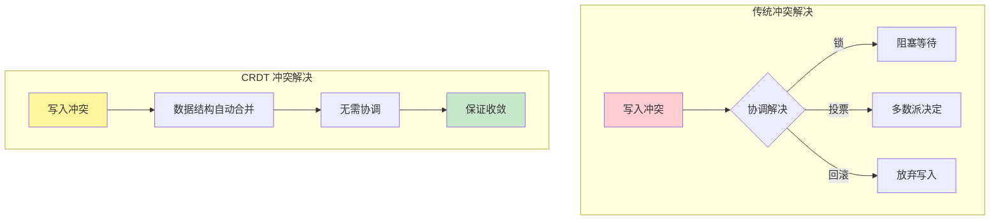
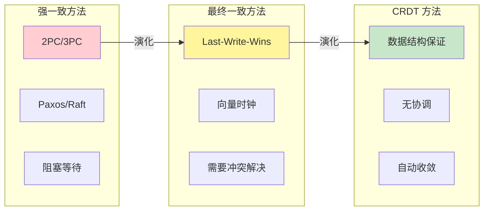
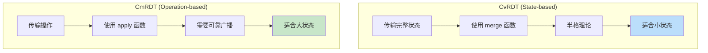
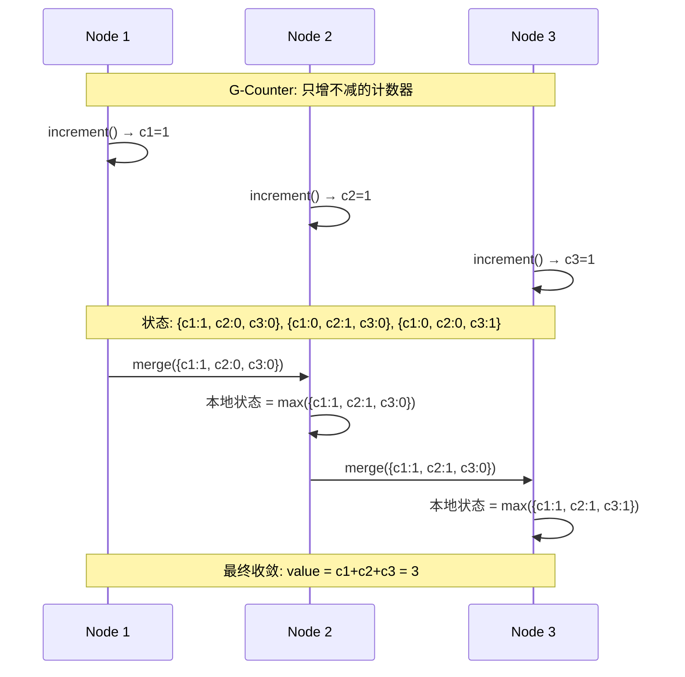
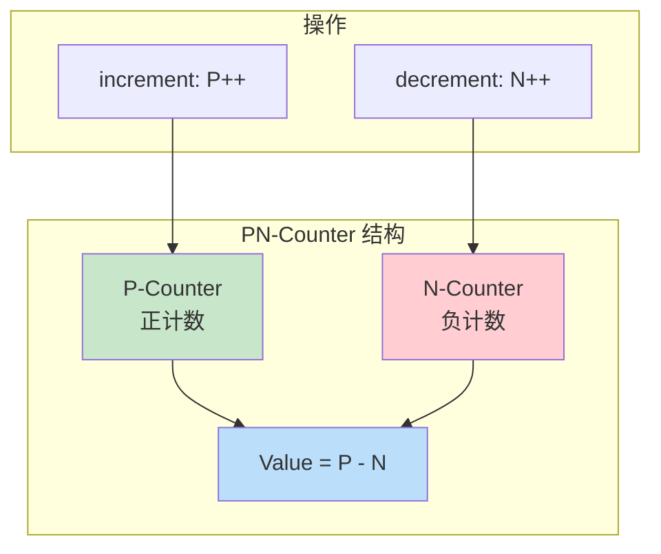
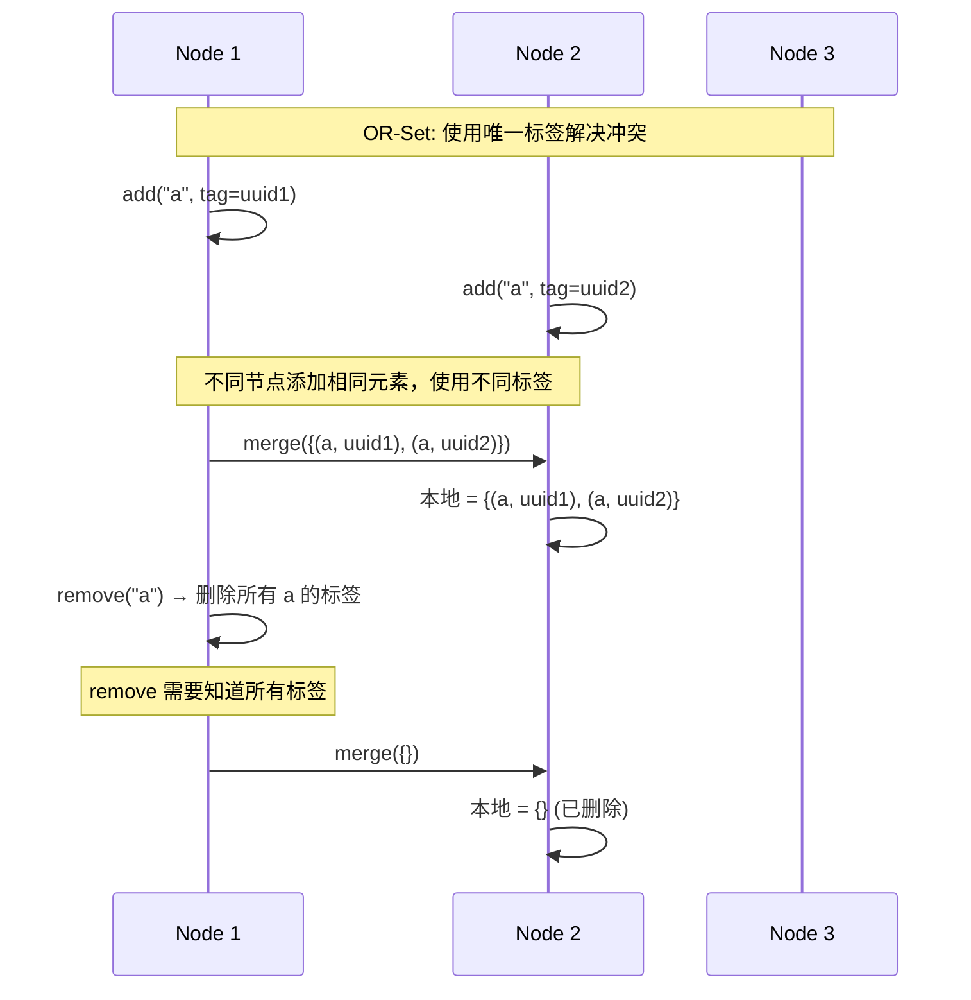
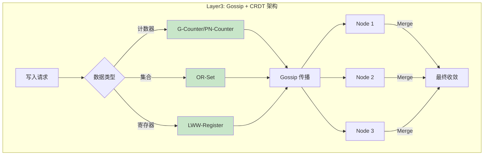
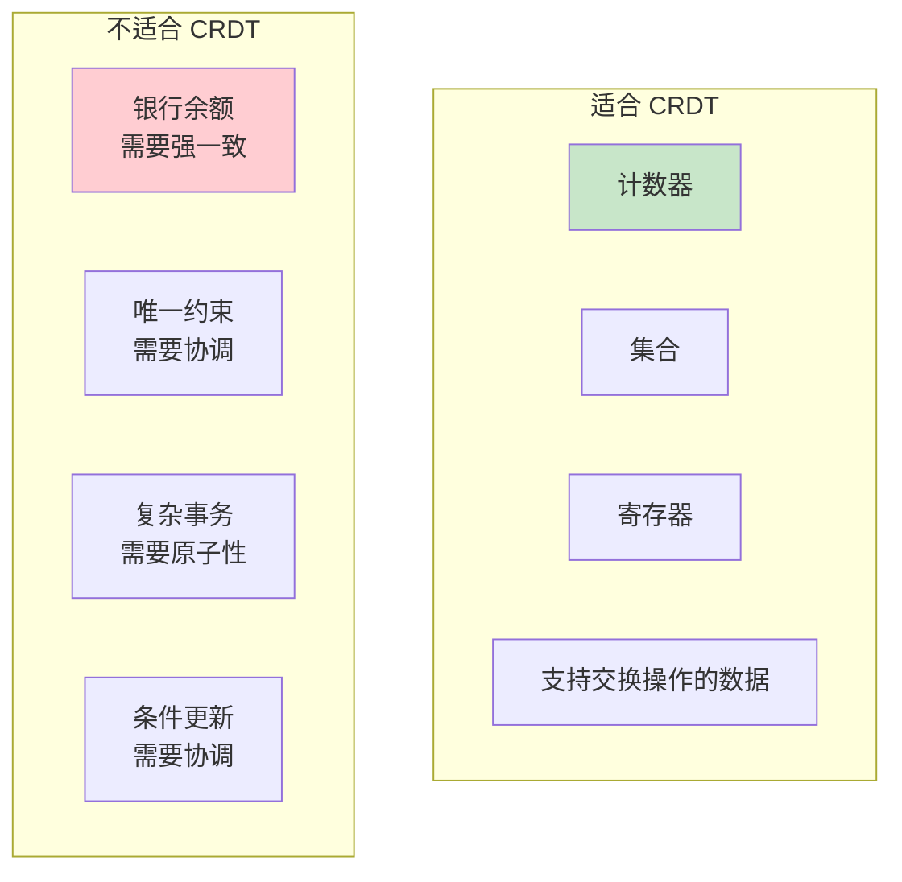
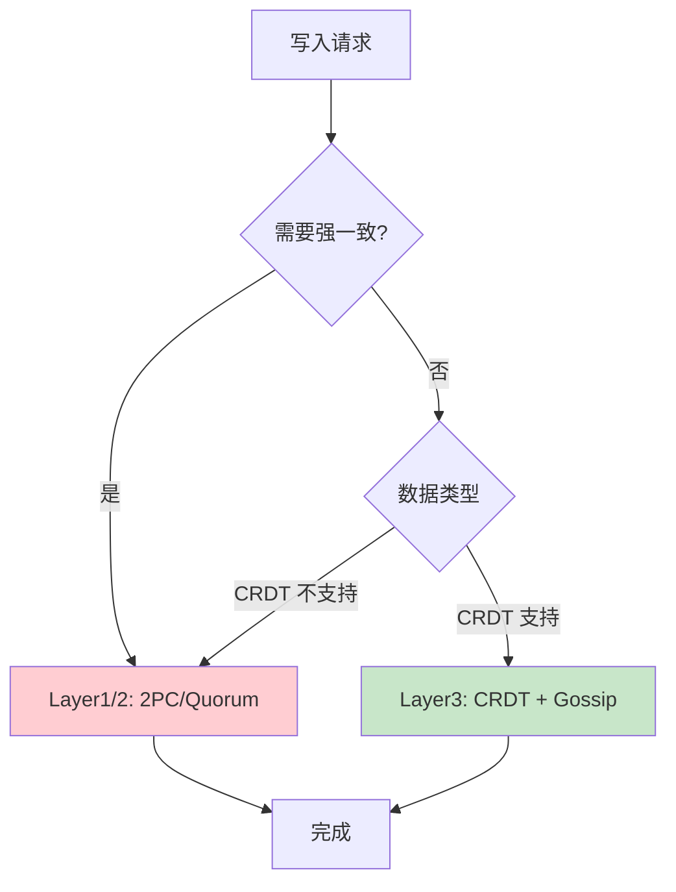

# 【预研报告】CRDT 冲突解决机制深度研究

> **预研目标**：研究 CRDT（Conflict-free Replicated Data Types）无协调冲突解决机制，为 NexKV Layer3 提供理论基础

---

## 📋 预研信息

| 项目 | 内容 |
|------|------|
| **预研主题** | CRDT: 无协调冲突解决的数据类型 |
| **预研日期** | 2026-02-14 |
| **预研负责人** | 🤖 核心开发 A |
| **论文来源** | "A comprehensive study of Convergent and Commutative Replicated Data Types" - Shapiro et al. (2011) |
| **预研状态** | ✅ 已完成 |

---

## 1. CRDT 基础概念

### 1.1 什么是 CRDT



**CRDT 定义**：

> Conflict-free Replicated Data Types（无冲突复制数据类型）是一种特殊的数据结构，允许多个副本独立更新，无需协调，且保证最终收敛到相同状态。

### 1.2 CRDT 核心特性

| 特性 | 说明 | 数学基础 |
|------|------|---------|
| **交换律** | 操作顺序不影响结果 | a ∘ b = b ∘ a |
| **结合律** | 分组不影响结果 | (a ∘ b) ∘ c = a ∘ (b ∘ c) |
| **幂等性** | 重复执行不影响结果 | a ∘ a = a |
| **单调性** | 状态只增不减 | s' ≥ s |

### 1.3 CRDT vs 传统方法



---

## 2. CRDT 类型分类

### 2.1 CvRDT vs CmRDT



| 类型 | 全称 | 传输内容 | 语义保证 | 适用场景 |
|------|------|---------|---------|---------|
| **CvRDT** | Convergent CRDT | 完整状态 | 半格（Semilattice） | 计数器、集合 |
| **CmRDT** | Commutative CRDT | 操作 | 交换律 | 文档编辑、列表 |

### 2.2 CvRDT 数学基础

```
半格（Semilattice）定义:
  集合 S + 二元操作 ∨ (join)
  满足:
    1. 交换律: a ∨ b = b ∨ a
    2. 结合律: (a ∨ b) ∨ c = a ∨ (b ∨ c)
    3. 幂等性: a ∨ a = a

  收敛保证:
    对于任意副本 s1, s2:
      最终 s1 ∨ s2 = s2 ∨ s1 (收敛到相同状态)
```

### 2.3 CmRDT 数学基础

```
交换操作定义:
  操作 op1, op2 满足:
    apply(apply(s, op1), op2) = apply(apply(s, op2), op1)

  可靠广播要求:
    1. 因果顺序保证
    2. 至少一次投递
    3. 无重复
```

---

## 3. 常用 CRDT 类型

### 3.1 G-Counter（增长计数器）



**实现**：

```go
// G-Counter: 只增计数器
type GCounter struct {
    counts map[string]uint64  // nodeID -> count
    mu     sync.RWMutex
}

// Increment 本地增加
func (c *GCounter) Increment(nodeID string) {
    c.mu.Lock()
    defer c.mu.Unlock()
    c.counts[nodeID]++
}

// Value 获取总计数
func (c *GCounter) Value() uint64 {
    c.mu.RLock()
    defer c.mu.RUnlock()
    var total uint64
    for _, count := range c.counts {
        total += count
    }
    return total
}

// Merge 合并其他副本
func (c *GCounter) Merge(other *GCounter) {
    c.mu.Lock()
    defer c.mu.Unlock()

    for nodeID, count := range other.counts {
        if current, ok := c.counts[nodeID]; !ok || count > current {
            c.counts[nodeID] = count  // 取最大值
        }
    }
}
```

### 3.2 PN-Counter（正负计数器）



**实现**：

```go
// PN-Counter: 可增可减计数器
type PNCounter struct {
    p *GCounter  // 正计数
    n *GCounter  // 负计数
}

// Increment 增加计数
func (c *PNCounter) Increment(nodeID string) {
    c.p.Increment(nodeID)
}

// Decrement 减少计数
func (c *PNCounter) Decrement(nodeID string) {
    c.n.Increment(nodeID)
}

// Value 获取净计数
func (c *PNCounter) Value() int64 {
    return int64(c.p.Value()) - int64(c.n.Value())
}

// Merge 合并副本
func (c *PNCounter) Merge(other *PNCounter) {
    c.p.Merge(other.p)
    c.n.Merge(other.n)
}
```

### 3.3 G-Set（只增集合）

```go
// G-Set: 只增不减集合
type GSet struct {
    elements map[string]struct{}
    mu       sync.RWMutex
}

// Add 添加元素
func (s *GSet) Add(element string) {
    s.mu.Lock()
    defer s.mu.Unlock()
    s.elements[element] = struct{}{}
}

// Contains 检查元素是否存在
func (s *GSet) Contains(element string) bool {
    s.mu.RLock()
    defer s.mu.RUnlock()
    _, ok := s.elements[element]
    return ok
}

// Merge 合并（集合并集）
func (s *GSet) Merge(other *GSet) {
    s.mu.Lock()
    defer s.mu.Unlock()

    for elem := range other.elements {
        s.elements[elem] = struct{}{}
    }
}
```

### 3.4 OR-Set（可添加可删除集合）



**实现**：

```go
// OR-Set: 可添加可删除集合（使用唯一标签）
type ORSet struct {
    elements map[string]map[string]struct{}  // element -> set of tags
    mu       sync.RWMutex
}

// Add 添加元素（带唯一标签）
func (s *ORSet) Add(element string, tag string) {
    s.mu.Lock()
    defer s.mu.Unlock()

    if s.elements[element] == nil {
        s.elements[element] = make(map[string]struct{})
    }
    s.elements[element][tag] = struct{}{}
}

// Remove 删除元素（删除所有标签）
func (s *ORSet) Remove(element string) {
    s.mu.Lock()
    defer s.mu.Unlock()
    delete(s.elements, element)
}

// Contains 检查元素是否存在
func (s *ORSet) Contains(element string) bool {
    s.mu.RLock()
    defer s.mu.RUnlock()

    tags, ok := s.elements[element]
    return ok && len(tags) > 0
}

// Merge 合并（标签并集）
func (s *ORSet) Merge(other *ORSet) {
    s.mu.Lock()
    defer s.mu.Unlock()

    for elem, tags := range other.elements {
        if s.elements[elem] == nil {
            s.elements[elem] = make(map[string]struct{})
        }
        for tag := range tags {
            s.elements[elem][tag] = struct{}{}
        }
    }
}
```

### 3.5 LWW-Register（最后写入胜利寄存器）

```go
// LWW-Register: 最后写入胜利
type LWWRegister struct {
    value     []byte
    timestamp int64
    mu        sync.RWMutex
}

// Set 设置值（带时间戳）
func (r *LWWRegister) Set(value []byte, timestamp int64) {
    r.mu.Lock()
    defer r.mu.Unlock()

    // 只接受更新的时间戳
    if timestamp > r.timestamp {
        r.value = value
        r.timestamp = timestamp
    }
}

// Get 获取值
func (r *LWWRegister) Get() []byte {
    r.mu.RLock()
    defer r.mu.RUnlock()
    return r.value
}

// Merge 合并（取更新的时间戳）
func (r *LWWRegister) Merge(other *LWWRegister) {
    r.mu.Lock()
    defer r.mu.Unlock()

    if other.timestamp > r.timestamp {
        r.value = other.value
        r.timestamp = other.timestamp
    }
}
```

---

## 4. CRDT 在 NexKV 中的应用

### 4.1 Layer3 (Gossip) + CRDT



### 4.2 元数据类型 vs CRDT 类型

| 元数据类型 | 数据结构 | 推荐 CRDT | 理由 |
|-----------|---------|----------|------|
| **节点心跳计数** | Counter | G-Counter | 只增不减 |
| **请求计数** | Counter | PN-Counter | 可增可减 |
| **在线节点集合** | Set | OR-Set | 动态加入/离开 |
| **节点状态** | Register | LWW-Register | 最新状态优先 |
| **分片副本列表** | Set | G-Set | 只增不减 |
| **负载信息** | Map | LWW-Map | 最新值优先 |

### 4.3 实现方案

```go
// CRDTStore: CRDT 存储层
type CRDTStore struct {
    counters map[string]*PNCounter   // key -> counter
    sets     map[string]*ORSet       // key -> set
    registers map[string]*LWWRegister // key -> register
    mu       sync.RWMutex
}

// NewCRDTStore 创建 CRDT 存储
func NewCRDTStore() *CRDTStore {
    return &CRDTStore{
        counters:  make(map[string]*PNCounter),
        sets:      make(map[string]*ORSet),
        registers: make(map[string]*LWWRegister),
    }
}

// IncrementCounter 增加计数器
func (s *CRDTStore) IncrementCounter(key, nodeID string) {
    s.mu.Lock()
    defer s.mu.Unlock()

    if s.counters[key] == nil {
        s.counters[key] = &PNCounter{
            p: &GCounter{counts: make(map[string]uint64)},
            n: &GCounter{counts: make(map[string]uint64)},
        }
    }
    s.counters[key].Increment(nodeID)
}

// AddToSet 添加到集合
func (s *CRDTStore) AddToSet(key, element, tag string) {
    s.mu.Lock()
    defer s.mu.Unlock()

    if s.sets[key] == nil {
        s.sets[key] = &ORSet{elements: make(map[string]map[string]struct{})}
    }
    s.sets[key].Add(element, tag)
}

// SetRegister 设置寄存器
func (s *CRDTStore) SetRegister(key string, value []byte, timestamp int64) {
    s.mu.Lock()
    defer s.mu.Unlock()

    if s.registers[key] == nil {
        s.registers[key] = &LWWRegister{}
    }
    s.registers[key].Set(value, timestamp)
}

// MergeFromGossip 从 Gossip 消息合并
func (s *CRDTStore) MergeFromGossip(other *CRDTStore) {
    s.mu.Lock()
    defer s.mu.Unlock()

    // 合并计数器
    for key, counter := range other.counters {
        if s.counters[key] == nil {
            s.counters[key] = counter
        } else {
            s.counters[key].Merge(counter)
        }
    }

    // 合并集合
    for key, set := range other.sets {
        if s.sets[key] == nil {
            s.sets[key] = set
        } else {
            s.sets[key].Merge(set)
        }
    }

    // 合并寄存器
    for key, reg := range other.registers {
        if s.registers[key] == nil {
            s.registers[key] = reg
        } else {
            s.registers[key].Merge(reg)
        }
    }
}
```

---

## 5. CRDT 的局限性

### 5.1 不是所有数据都适合 CRDT



### 5.2 CRDT 的代价

| 代价 | 说明 | 缓解方案 |
|------|------|---------|
| **空间开销** | 需要存储元数据（标签、时间戳） | 定期压缩 |
| **语义限制** | 只能支持特定操作 | 混合架构 |
| **删除问题** | 删除需要特殊处理（墓碑） | 定期垃圾回收 |
| **读修复** | 读取时可能触发合并 | 后台异步合并 |

### 5.3 与强一致性的混合



---

## 6. CRDT 实现库

### 6.1 Go 语言库

| 库 | 类型 | 特点 |
|---|------|------|
| [automerge/automerge-go](https://github.com/automerge/automerge-go) | CRDT | Automerge 的 Go 绑定 |
| [delta-crdts/go-delta-crdt](https://github.com/delta-crdts/go-delta-crdt) | Delta-CRDT | 增量同步优化 |
| [loro-dev/loro](https://github.com/loro-dev/loro) | CRDT | 高性能 CRDT 库 |

### 6.2 其他语言库

| 库 | 语言 | 特点 |
|---|------|------|
| [automerge/automerge](https://github.com/automerge/automerge) | Rust/JS | 最流行的 CRDT 库 |
| [yjs/yjs](https://github.com/yjs/yjs) | JavaScript | 协同编辑 |
| [riak-dot-org/riak_kv](https://github.com/basho/riak_kv) | Erlang | Riak 数据库 |

---

## 7. 参考资料

### 7.1 原始论文

- **Shapiro et al. (2011)**: "A comprehensive study of Convergent and Commutative Replicated Data Types"
  - [HAL-Inria PDF](https://inria.hal.science/hal-00932836/document)

### 7.2 教程和文章

- [CRDTs Explained - Pask Software](https://pasksoftware.com/crdts/)
- [Introduction to CRDTs - Appvia](https://www.appvia.io/blog/introduction-to-crdts)
- [CRDT: Conflict-free Replicated Data Types - Redis Labs](https://redis.com/blog/diving-into-crdts/)

### 7.3 视频讲座

- [CRDTs: The Hard Parts - Martin Kleppmann](https://www.youtube.com/watch?v=PMzDgS5mHuE)
- [Conflict-free Replicated Data Types - Seattle JS](https://www.youtube.com/watch?v=OyFLHL19j0U)

---

## 8. 结论

### 8.1 核心要点

1. **CRDT 提供无协调冲突解决**：适合最终一致场景
2. **数学基础是半格理论**：交换律 + 结合律 + 幂等性
3. **常用类型**：Counter, Set, Register
4. **局限性**：不是所有数据都适合 CRDT

### 8.2 对 NexKV 的启示

| 启示 | 建议 |
|------|------|
| **Layer3 适用 CRDT** | 状态更新、负载信息等弱一致数据 |
| **混合架构** | Layer1/2 保持强一致，Layer3 使用 CRDT |
| **简化冲突解决** | CRDT 自动解决，无需额外逻辑 |
| **空间开销可控** | 选择合适的 CRDT 类型 |

### 8.3 实施优先级

1. **高优先级**：LWW-Register（节点状态）
2. **中优先级**：G-Counter（心跳计数）
3. **低优先级**：OR-Set（动态集合）

---

**文档版本**: v1.0
**创建日期**: 2026-02-14
**最后更新**: 2026-02-14
**维护者**: 🤖 核心开发 A
**状态**: ✅ 已完成
