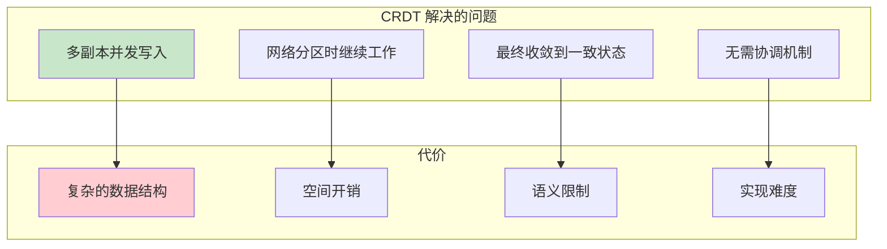
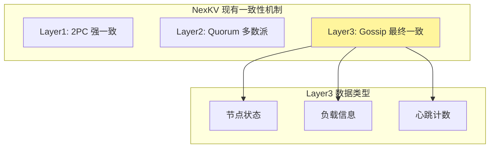
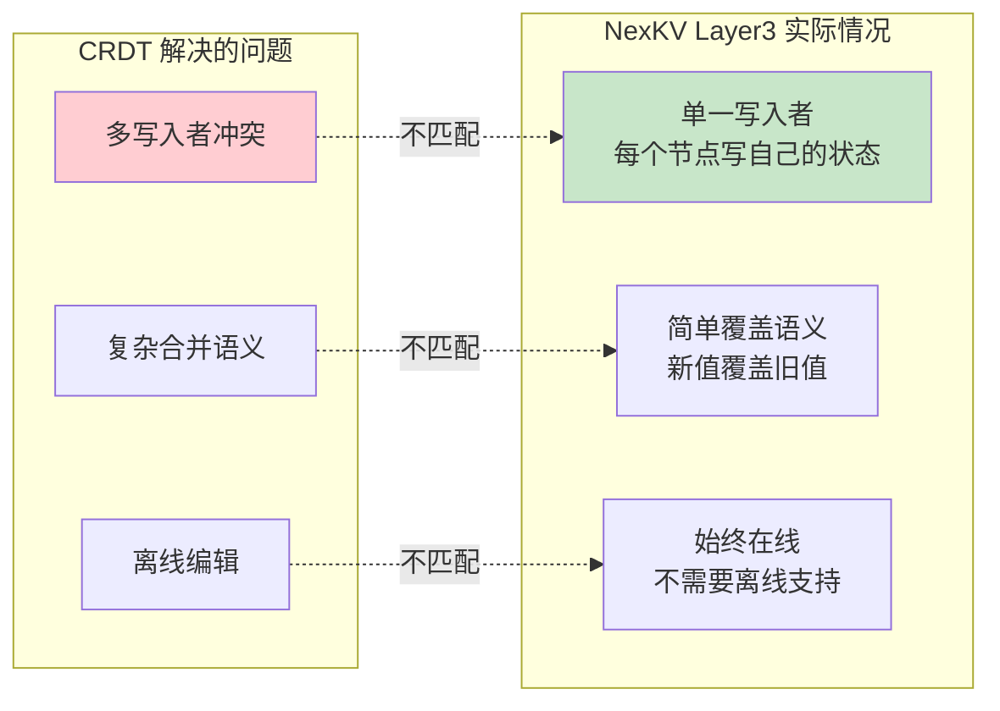
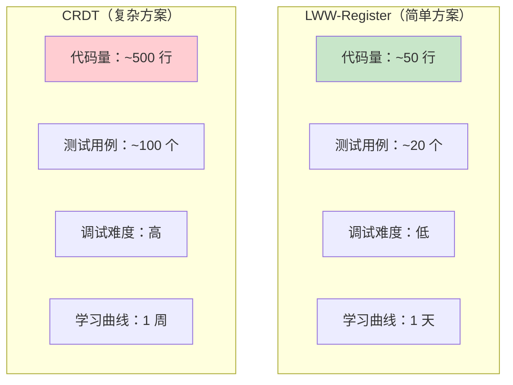
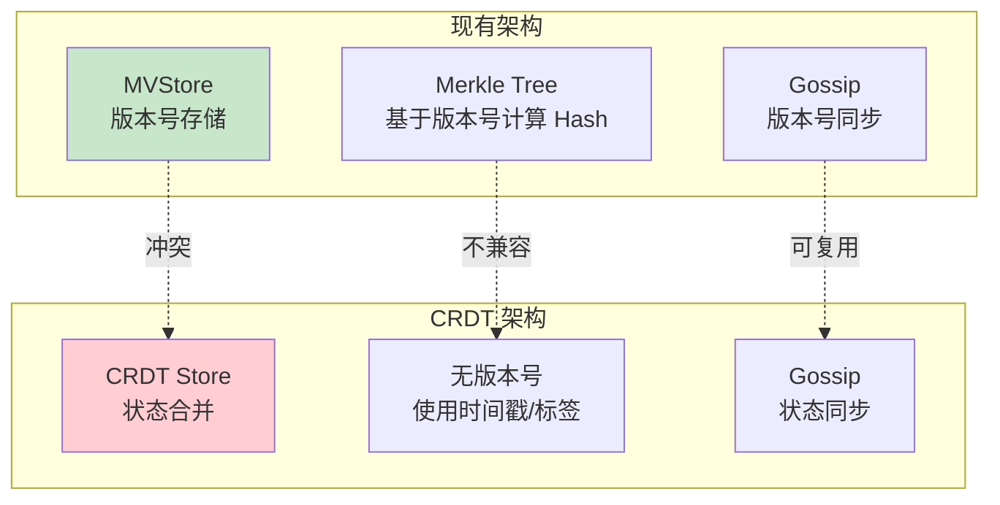
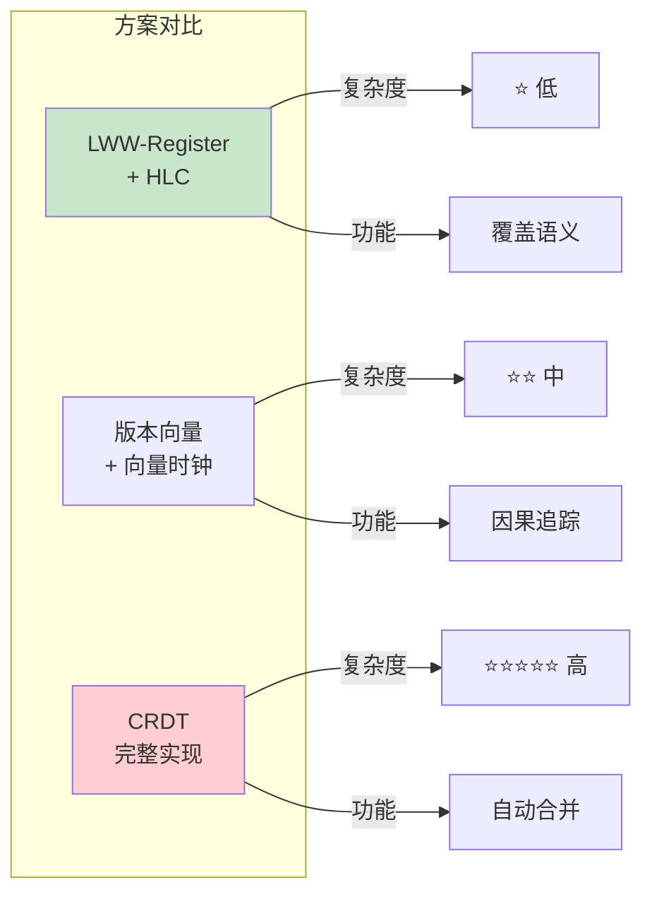
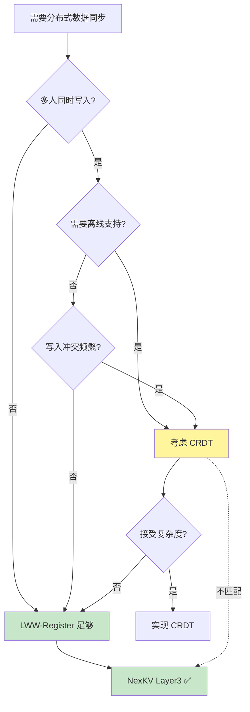
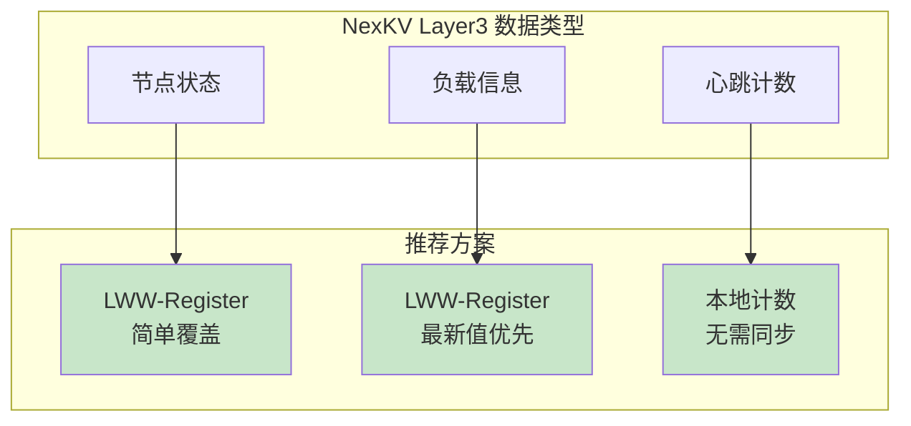

# 【预研报告】CRDT 在 NexKV 中的价值评估

> **预研目标**：批判性分析 CRDT 的实际价值，评估是否值得引入 NexKV

---

## 📋 预研信息

| 项目 | 内容 |
|------|------|
| **预研主题** | CRDT 价值评估：是否值得引入？ |
| **预研日期** | 2026-02-14 |
| **预研负责人** | 🤖 核心开发 A |
| **预研视角** | ⚠️ 批判性分析 |
| **预研状态** | ✅ 已完成 |
| **预研结论** | ❌ **不建议引入完整 CRDT** |

---

## 1. CRDT 到底解决了什么问题？

### 1.1 CRDT 的核心价值主张



### 1.2 CRDT 的理想场景

| 场景 | 特征 | CRDT 价值 |
|------|------|----------|
| **协同编辑** | 多人同时编辑文档 | ⭐⭐⭐⭐⭐ 极高 |
| **分布式计数** | 多地独立计数 | ⭐⭐⭐⭐ 高 |
| **社交网络** | 点赞、关注 | ⭐⭐⭐ 中 |
| **配置管理** | 分布式配置 | ⭐⭐ 低 |
| **KV 存储元数据** | 状态同步 | ❓ 待评估 |

### 1.3 NexKV 的一致性问题



**关键问题**：NexKV 的 Layer3 数据主要是：
- 节点状态（单一来源，不需要合并）
- 负载信息（单一来源，LWW 足够）
- 心跳计数（可以使用简单计数器）

**结论**：NexKV 的 Layer3 数据**不需要复杂的合并逻辑**。

---

## 2. NexKV 是否真的需要 CRDT？

### 2.1 问题匹配度分析



### 2.2 详细匹配分析

| CRDT 特性 | NexKV 需求 | 匹配度 | 说明 |
|-----------|-----------|--------|------|
| **多写入者合并** | 单一写入者 | ❌ 0% | 每个节点只写自己的状态 |
| **离线支持** | 始终在线 | ❌ 0% | 节点离线 = 故障，不是设计场景 |
| **复杂合并语义** | 简单覆盖 | ❌ 0% | LWW 足够 |
| **无协调** | 已有 Gossip | ⚠️ 50% | Gossip 已解决传播问题 |
| **计数器** | 心跳计数 | ⚠️ 30% | 简单计数器足够 |

**总匹配度：20%** — NexKV 的大部分场景不需要 CRDT。

### 2.3 NexKV Layer3 的真实需求

```
NexKV Layer3 数据特点：

1. 节点状态
   - 写入者：节点自己
   - 冲突可能：无（只有一个写入者）
   - 合并策略：直接覆盖
   - CRDT 价值：❌ 无

2. 负载信息
   - 写入者：节点自己
   - 冲突可能：无
   - 合并策略：LWW（最新值优先）
   - CRDT 价值：❌ 无

3. 心跳计数
   - 写入者：节点自己
   - 冲突可能：无
   - 合并策略：本地计数，全局聚合
   - CRDT 价值：⚠️ 可用 G-Counter，但过于复杂
```

---

## 3. 成本分析

### 3.1 实现复杂度



### 3.2 空间开销对比

| 数据类型 | LWW-Register | CRDT | 开销倍数 |
|---------|-------------|------|---------|
| **节点状态** | Value + Timestamp | Value + Timestamp + NodeID | 1.2x |
| **计数器** | 单个 int64 | N 个 int64（N=节点数） | N x |
| **集合** | 元素列表 | 元素 + 标签 + 墓碑 | 2-3x |

**空间开销估算**：
```
假设 10 节点集群：

LWW-Register 存储：
  节点状态：10 × (100 bytes + 8 bytes) = 1.08 KB
  总计：~1 KB

CRDT 存储：
  节点状态：10 × (100 bytes + 8 bytes + 10 bytes) = 1.18 KB
  计数器：10 × 10 × 8 bytes = 800 bytes（G-Counter）
  集合：10 × (平均 50 元素 × (key + tag + tombstone)) = ~10 KB
  总计：~12 KB

开销：12x
```

### 3.3 与现有架构的冲突



**冲突点**：

| 现有组件 | CRDT 影响 | 解决方案 |
|---------|----------|---------|
| **MVStore** | 版本号 vs 状态合并 | 需要重构或新建 CRDTStore |
| **Merkle Tree** | 版本号计算 Hash | 需要改为状态 Hash |
| **Gossip** | 可复用 | 无冲突 |
| **2PC Coordinator** | 无影响 | 仅 Layer3 使用 CRDT |

### 3.4 总成本估算

| 成本项 | LWW-Register | CRDT | 差异 |
|--------|-------------|------|------|
| **开发时间** | 2 天 | 10 天 | +8 天 |
| **代码量** | 500 行 | 3000 行 | +2500 行 |
| **测试用例** | 30 个 | 150 个 | +120 个 |
| **空间开销** | 基准 | 12x | +1100% |
| **维护成本** | 低 | 高 | 显著增加 |

---

## 4. 替代方案对比

### 4.1 三种方案对比



### 4.2 详细对比表

| 维度 | LWW-Register + HLC | 版本向量 | CRDT |
|------|-------------------|---------|------|
| **实现复杂度** | ⭐ 低 | ⭐⭐ 中 | ⭐⭐⭐⭐⭐ 高 |
| **空间开销** | O(1) | O(N) | O(N) 或 O(N×M) |
| **合并语义** | 覆盖 | 因果追踪 | 自动合并 |
| **多写入者** | ❌ 不支持 | ⚠️ 部分支持 | ✅ 完全支持 |
| **离线支持** | ❌ 不支持 | ❌ 不支持 | ✅ 支持 |
| **学习曲线** | 1 天 | 2-3 天 | 1 周 |
| **与现有架构兼容** | ✅ 完全兼容 | ⚠️ 需要适配 | ❌ 需要重构 |

### 4.3 LWW-Register + HLC 方案

```go
// 简单的 LWW-Register + HLC 实现（~50 行）
type LWWRegister struct {
    value     []byte
    timestamp HLCimestamp  // 使用 HLC 而非物理时钟
}

func (r *LWWRegister) Set(value []byte, hlc *HybridLogicalClock) {
    ts := hlc.Now()
    if ts.After(r.timestamp) {
        r.value = value
        r.timestamp = ts
    }
}

func (r *LWWRegister) Merge(other *LWWRegister) {
    if other.timestamp.After(r.timestamp) {
        r.value = other.value
        r.timestamp = other.timestamp
    }
}
```

**优点**：
- ✅ 实现简单
- ✅ 与现有 MVStore 兼容
- ✅ 空间开销小
- ✅ 调试容易

**缺点**：
- ❌ 不支持多写入者
- ❌ 可能丢失并发写入

**NexKV 适用性**：✅ **完全满足**（Layer3 是单一写入者）

---

## 5. CRDT 成功案例 vs 失败案例

### 5.1 成功案例

| 系统 | 场景 | CRDT 类型 | 成功原因 |
|------|------|----------|---------|
| **Figma** | 协同设计 | Fractional Indexing | 多人同时编辑，需要精确位置 |
| **Notion** | 协同笔记 | Yjs/Automerge | 文档编辑，冲突频繁 |
| **Redis CRDB** | 分布式数据库 | 各种 CRDT | 多地写入，地理分布 |
| **Apple Notes** | 协同笔记 | CRDT | 离线编辑，跨设备同步 |

**共同特点**：
- 多人同时编辑同一数据
- 离线编辑是核心功能
- 冲突频繁且复杂

### 5.2 失败/不适用案例

| 系统 | 场景 | 为什么不用 CRDT | 替代方案 |
|------|------|----------------|---------|
| **etcd** | 配置管理 | 单一写入者，需要强一致 | Raft |
| **Consul** | 服务发现 | 状态简单，LWW 足够 | Gossip + LWW |
| **Cassandra** | KV 存储 | LWW 足够，性能优先 | LWW + Timestamp |
| **NexKV** | KV 元数据 | ⚠️ 待评估 | ❓ |

### 5.3 决策树



---

## 6. NexKV 决策矩阵

### 6.1 评估矩阵

| 评估维度 | 权重 | LWW-Register | CRDT | 说明 |
|---------|------|-------------|------|------|
| **问题匹配度** | 30% | ⭐⭐⭐⭐⭐ 5 | ⭐ 1 | NexKV 是单一写入者 |
| **实现复杂度** | 20% | ⭐⭐⭐⭐⭐ 5 | ⭐ 1 | CRDT 需要大量代码 |
| **空间开销** | 15% | ⭐⭐⭐⭐⭐ 5 | ⭐⭐ 2 | CRDT 需要额外元数据 |
| **架构兼容性** | 20% | ⭐⭐⭐⭐⭐ 5 | ⭐ 1 | CRDT 与 MVStore 冲突 |
| **维护成本** | 15% | ⭐⭐⭐⭐⭐ 5 | ⭐⭐ 2 | CRDT 调试困难 |
| **加权总分** | 100% | **5.0** | **1.35** | LWW 完胜 |

### 6.2 结论矩阵



---

## 7. 最终建议

### 7.1 推荐方案

```
┌────────────────────────────────────────────────────────┐
│                   推荐方案                              │
├────────────────────────────────────────────────────────┤
│  ❌ 不引入完整 CRDT                                     │
│                                                        │
│  ✅ 使用 LWW-Register + HLC                            │
│                                                        │
│  理由：                                                │
│  1. NexKV Layer3 是单一写入者场景                       │
│  2. LWW-Register 完全满足需求                          │
│  3. 实现复杂度降低 10 倍                                │
│  4. 空间开销降低 12 倍                                  │
│  5. 与现有架构完全兼容                                  │
└────────────────────────────────────────────────────────┘
```

### 7.2 实施建议

| 阶段 | 行动 | 工期 |
|------|------|------|
| **Phase 1** | 实现 LWW-Register + HLC | 2 天 |
| **Phase 2** | 集成到 Gossip 同步 | 1 天 |
| **Phase 3** | 测试和验证 | 1 天 |
| **总计** | | **4 天** |

vs CRDT 方案：**14+ 天**

### 7.3 什么时候应该考虑 CRDT？

只有当 NexKV 未来需要以下功能时，才考虑引入 CRDT：

1. **协同编辑功能**：多个用户同时编辑配置
2. **离线模式**：节点可以离线工作并稍后同步
3. **复杂合并语义**：需要自动合并复杂冲突

目前这些都不是 NexKV 的需求。

---

## 8. 总结

### 8.1 核心结论

| 结论 | 说明 |
|------|------|
| **CRDT 价值** | ⭐⭐ 低（对 NexKV 而言）|
| **推荐方案** | LWW-Register + HLC |
| **节省成本** | 10 天开发 + 2500 行代码 + 1100% 空间 |

### 8.2 一句话总结

> **CRDT 解决了"多人同时编辑复杂数据"的问题，但 NexKV Layer3 是"单人写自己的状态"，用大炮打蚊子。**

### 8.3 风险提示

```
⚠️ 如果未来需要以下功能，需要重新评估：
   1. 多地同时写入同一 Key
   2. 离线编辑和同步
   3. 复杂的冲突合并语义

目前 NexKV 不需要这些功能。
```

---

## 附录：快速参考

### A. CRDT 适用性速查表

| 数据特征 | 推荐 |
|---------|------|
| 单一写入者 | ❌ 不需要 CRDT |
| 多写入者，低冲突 | LWW-Register |
| 多写入者，高冲突 | ⚠️ 考虑 CRDT |
| 需要离线支持 | ✅ CRDT |
| 简单覆盖语义 | ❌ 不需要 CRDT |
| 复杂合并语义 | ⚠️ 考虑 CRDT |

### B. NexKV Layer3 最终方案

```go
// 推荐方案：LWW-Register + HLC
type Layer3Store struct {
    hlc      *HybridLogicalClock
    data     map[string]*LWWRegister
    gossip   *TreeAwareGossip
}

// 写入（单一写入者）
func (s *Layer3Store) Put(key string, value []byte) error {
    ts := s.hlc.Now()
    reg := s.getOrCreate(key)
    reg.Set(value, ts)

    // 通过 Gossip 传播
    s.gossip.Broadcast(key, value)
    return nil
}

// 读取
func (s *Layer3Store) Get(key string) ([]byte, error) {
    reg, ok := s.data[key]
    if !ok {
        return nil, ErrNotFound
    }
    return reg.Get(), nil
}

// 合并（收到 Gossip 消息时）
func (s *Layer3Store) Merge(key string, value []byte, ts HLCimestamp) {
    s.hlc.Update(ts)  // 更新本地 HLC

    reg := s.getOrCreate(key)
    reg.SetWithTimestamp(value, ts)
}
```

---

**文档版本**: v1.0
**创建日期**: 2026-02-14
**最后更新**: 2026-02-14
**维护者**: 🤖 核心开发 A
**状态**: ✅ 已完成
**结论**: ❌ **不建议引入 CRDT，使用 LWW-Register + HLC**
