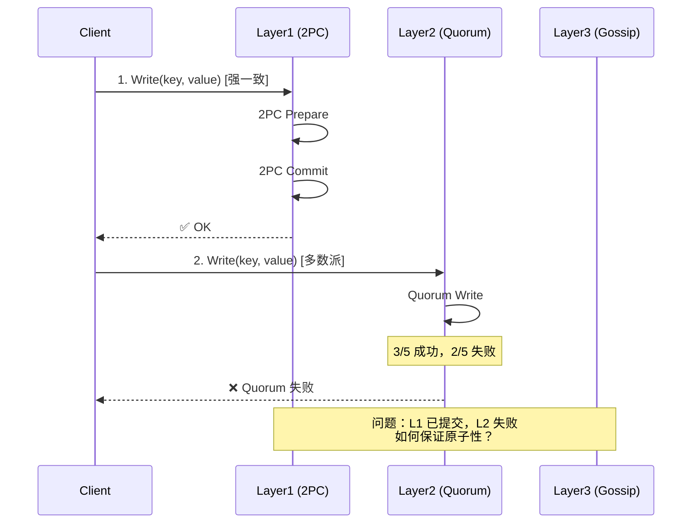
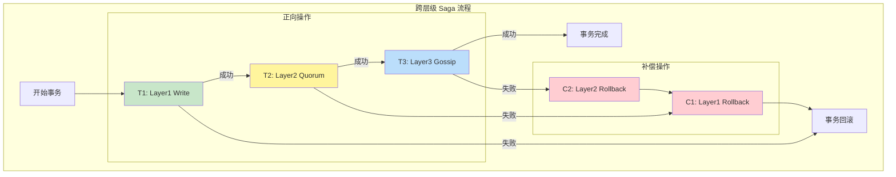

# 【预研报告】跨层级事务 Saga 补偿设计

> **预研目标**：设计 Layer1→Layer2→Layer3 跨层级事务的 Saga 补偿机制

---

## 📋 预研信息

| 项目 | 内容 |
|------|------|
| **预研主题** | 跨层级事务 Saga 补偿设计 |
| **预研日期** | 2026-02-14 |
| **预研负责人** | 🤖 核心开发 A |
| **关联文档** | `2026-02-14_consistency-implementation-review.md` |
| **预研状态** | ✅ 已完成 |

---

## 1. 问题分析

### 1.1 跨层级事务挑战



**核心问题**：
- Layer1 使用 2PC（强一致，阻塞）
- Layer2 使用 Quorum（多数派，可能部分成功）
- Layer3 使用 Gossip（最终一致，异步）
- **不同层级失败时，如何保证事务原子性？**

### 1.2 传统 2PC 的问题

```
传统 2PC 跨层级问题：

1. Prepare 阶段：需要所有层级都 Prepare
   - Layer1: ✅ 可以 Prepare
   - Layer2: ✅ 可以 Prepare
   - Layer3: ❌ Gossip 是异步的，无法 Prepare

2. Commit 阶段：需要所有层级都 Commit
   - 如果 Layer3 Commit 失败，无法回滚 Layer1/Layer2

结论：传统 2PC 不适合跨层级事务
```

---

## 2. Saga 模式设计

### 2.1 Saga 模式原理

Saga 将长事务分解为一系列本地事务，每个本地事务都有对应的补偿操作：

```
正向操作序列:  T1 → T2 → T3 → ... → Tn
补偿操作序列:  C1 ← C2 ← C3 ← ... ← Cn

执行流程：
- 如果所有 Ti 成功 → 事务完成
- 如果 Ti 失败 → 执行 C1, C2, ..., C(i-1) 进行补偿
```

### 2.2 跨层级 Saga 设计



### 2.3 操作定义

```go
// SagaOperation Saga 操作
type SagaOperation struct {
    ID            string          // 操作 ID
    Layer         Layer           // 所属层级
    OperationType OperationType   // 操作类型
    Key           string          // 键
    Value         []byte          // 新值
    OldValue      []byte          // 旧值（用于补偿）
    Status        OperationStatus // 状态
    Timestamp     time.Time       // 时间戳
}

type OperationType int

const (
    OperationTypePut    OperationType = iota
    OperationTypeDelete
)

type OperationStatus int

const (
    OperationStatusPending OperationStatus = iota
    OperationStatusExecuting
    OperationStatusCompleted
    OperationStatusCompensated
    OperationStatusFailed
)

// SagaTransaction Saga 事务
type SagaTransaction struct {
    ID          string           // 事务 ID
    Operations  []SagaOperation  // 操作序列
    Status      TxStatus         // 事务状态
    CurrentStep int              // 当前步骤
    StartTime   time.Time
    EndTime     time.Time
}

type TxStatus int

const (
    TxStatusRunning TxStatus = iota
    TxStatusCommitted
    TxStatusCompensating
    TxStatusCompensated
    TxStatusFailed
)
```

---

## 3. Saga 协调器实现

### 3.1 核心结构

```go
// SagaCoordinator Saga 协调器
type SagaCoordinator struct {
    mu            sync.RWMutex
    transactions  map[string]*SagaTransaction
    layer1        Layer1Executor
    layer2        Layer2Executor
    layer3        Layer3Executor
    store         SagaStore // 持久化存储

    // 配置
    timeout       time.Duration
    retryInterval time.Duration
    maxRetries    int
}

// LayerExecutor 层级执行器接口
type LayerExecutor interface {
    // Execute 执行操作
    Execute(ctx context.Context, op SagaOperation) error

    // Compensate 补偿操作
    Compensate(ctx context.Context, op SagaOperation) error
}

// NewSagaCoordinator 构造函数
func NewSagaCoordinator(
    layer1 Layer1Executor,
    layer2 Layer2Executor,
    layer3 Layer3Executor,
    store SagaStore,
) *SagaCoordinator {
    return &SagaCoordinator{
        transactions:  make(map[string]*SagaTransaction),
        layer1:        layer1,
        layer2:        layer2,
        layer3:        layer3,
        store:         store,
        timeout:       30 * time.Second,
        retryInterval: 100 * time.Millisecond,
        maxRetries:    3,
    }
}
```

### 3.2 事务执行

```go
// BeginTransaction 开始事务
func (c *SagaCoordinator) BeginTransaction() *SagaTransaction {
    tx := &SagaTransaction{
        ID:          uuid.New().String(),
        Operations:  make([]SagaOperation, 0),
        Status:      TxStatusRunning,
        CurrentStep: 0,
        StartTime:   time.Now(),
    }

    c.mu.Lock()
    c.transactions[tx.ID] = tx
    c.mu.Unlock()

    // 持久化事务
    c.store.SaveTransaction(tx)

    return tx
}

// AddOperation 添加操作
func (c *SagaCoordinator) AddOperation(tx *SagaTransaction, layer Layer, key string, value []byte) error {
    // 先读取旧值（用于补偿）
    var oldValue []byte
    var err error

    switch layer {
    case Layer1:
        oldValue, err = c.layer1.(*Layer1ExecutorImpl).Get(key)
    case Layer2:
        oldValue, err = c.layer2.(*Layer2ExecutorImpl).Get(key)
    case Layer3:
        oldValue, err = c.layer3.(*Layer3ExecutorImpl).Get(key)
    }

    if err != nil && err != ErrNotFound {
        return err
    }

    op := SagaOperation{
        ID:            uuid.New().String(),
        Layer:         layer,
        OperationType: OperationTypePut,
        Key:           key,
        Value:         value,
        OldValue:      oldValue,
        Status:        OperationStatusPending,
        Timestamp:     time.Now(),
    }

    tx.Operations = append(tx.Operations, op)
    c.store.SaveTransaction(tx)

    return nil
}

// Execute 执行事务
func (c *SagaCoordinator) Execute(ctx context.Context, tx *SagaTransaction) error {
    ctx, cancel := context.WithTimeout(ctx, c.timeout)
    defer cancel()

    // 按层级顺序执行（Layer1 → Layer2 → Layer3）
    for i, op := range tx.Operations {
        tx.CurrentStep = i
        op.Status = OperationStatusExecuting
        c.store.SaveTransaction(tx)

        var err error
        switch op.Layer {
        case Layer1:
            err = c.layer1.Execute(ctx, op)
        case Layer2:
            err = c.layer2.Execute(ctx, op)
        case Layer3:
            err = c.layer3.Execute(ctx, op)
        }

        if err != nil {
            // 执行失败，开始补偿
            op.Status = OperationStatusFailed
            c.store.SaveTransaction(tx)

            return c.compensate(ctx, tx, i)
        }

        op.Status = OperationStatusCompleted
        c.store.SaveTransaction(tx)
    }

    // 所有操作成功
    tx.Status = TxStatusCommitted
    tx.EndTime = time.Now()
    c.store.SaveTransaction(tx)

    return nil
}

// compensate 补偿操作
func (c *SagaCoordinator) compensate(ctx context.Context, tx *SagaTransaction, failedStep int) error {
    tx.Status = TxStatusCompensating
    c.store.SaveTransaction(tx)

    // 逆序补偿
    for i := failedStep - 1; i >= 0; i-- {
        op := tx.Operations[i]

        var err error
        switch op.Layer {
        case Layer1:
            err = c.layer1.Compensate(ctx, op)
        case Layer2:
            err = c.layer2.Compensate(ctx, op)
        case Layer3:
            err = c.layer3.Compensate(ctx, op)
        }

        if err != nil {
            // 补偿失败，记录并继续尝试
            log.Error("Compensation failed",
                "tx_id", tx.ID,
                "op_id", op.ID,
                "error", err)

            // 重试逻辑
            for retry := 0; retry < c.maxRetries; retry++ {
                time.Sleep(c.retryInterval * time.Duration(retry+1))

                switch op.Layer {
                case Layer1:
                    err = c.layer1.Compensate(ctx, op)
                case Layer2:
                    err = c.layer2.Compensate(ctx, op)
                case Layer3:
                    err = c.layer3.Compensate(ctx, op)
                }

                if err == nil {
                    break
                }
            }

            if err != nil {
                // 补偿最终失败，需要人工干预
                log.Error("Compensation finally failed, manual intervention required",
                    "tx_id", tx.ID,
                    "op_id", op.ID)
            }
        }

        op.Status = OperationStatusCompensated
        c.store.SaveTransaction(tx)
    }

    tx.Status = TxStatusCompensated
    tx.EndTime = time.Now()
    c.store.SaveTransaction(tx)

    return ErrTransactionCompensated
}
```

### 3.3 各层执行器实现

```go
// Layer1ExecutorImpl Layer1 执行器（2PC）
type Layer1ExecutorImpl struct {
    coordinator *TwoPCCoordinator
    store       kvstore.MetadataKV
}

func (e *Layer1ExecutorImpl) Execute(ctx context.Context, op SagaOperation) error {
    // Layer1 使用 2PC
    return e.coordinator.Put(ctx, kvstore.Namespace(op.Key), op.Key, op.Value)
}

func (e *Layer1ExecutorImpl) Compensate(ctx context.Context, op SagaOperation) error {
    // 补偿：恢复旧值或删除
    if op.OldValue == nil {
        return e.store.Delete(kvstore.Namespace(op.Key), op.Key)
    }
    return e.store.Put(kvstore.Namespace(op.Key), op.Key, op.OldValue)
}

func (e *Layer1ExecutorImpl) Get(key string) ([]byte, error) {
    return e.store.Get(kvstore.Namespace(key), key)
}

// Layer2ExecutorImpl Layer2 执行器（Quorum）
type Layer2ExecutorImpl struct {
    coordinator *QuorumCoordinator
    store       kvstore.MetadataKV
}

func (e *Layer2ExecutorImpl) Execute(ctx context.Context, op SagaOperation) error {
    // Layer2 使用 Quorum
    return e.coordinator.Write(ctx, op.Key, op.Value)
}

func (e *Layer2ExecutorImpl) Compensate(ctx context.Context, op SagaOperation) error {
    // 补偿：向多数派发送回滚请求
    return e.coordinator.Write(ctx, op.Key, op.OldValue)
}

func (e *Layer2ExecutorImpl) Get(key string) ([]byte, error) {
    return e.coordinator.Read(ctx, key)
}

// Layer3ExecutorImpl Layer3 执行器（Gossip）
type Layer3ExecutorImpl struct {
    localStore kvstore.MetadataKV
    gossip     *GossipManager
}

func (e *Layer3ExecutorImpl) Execute(ctx context.Context, op SagaOperation) error {
    // Layer3 先本地写入，再 Gossip 同步
    if err := e.localStore.Put(kvstore.Namespace(op.Key), op.Key, op.Value); err != nil {
        return err
    }

    // 触发 Gossip 同步（异步）
    e.gossip.Broadcast(op.Key, op.Value)

    // Layer3 不等待同步完成，直接返回成功
    return nil
}

func (e *Layer3ExecutorImpl) Compensate(ctx context.Context, op SagaOperation) error {
    // 补偿：本地回滚 + 广播回滚
    if op.OldValue == nil {
        if err := e.localStore.Delete(kvstore.Namespace(op.Key), op.Key); err != nil {
            return err
        }
    } else {
        if err := e.localStore.Put(kvstore.Namespace(op.Key), op.Key, op.OldValue); err != nil {
            return err
        }
    }

    // 广播补偿
    e.gossip.Broadcast(op.Key, op.OldValue)

    return nil
}

func (e *Layer3ExecutorImpl) Get(key string) ([]byte, error) {
    return e.localStore.Get(kvstore.Namespace(key), key)
}
```

---

## 4. 持久化与恢复

### 4.1 Saga 状态持久化

```go
// SagaStore Saga 持久化存储
type SagaStore interface {
    SaveTransaction(tx *SagaTransaction) error
    GetTransaction(txID string) (*SagaTransaction, error)
    ListPendingTransactions() ([]*SagaTransaction, error)
    DeleteTransaction(txID string) error
}

// KVSagaStore 基于 KV 的 Saga 存储
type KVSagaStore struct {
    kv kvstore.MetadataKV
}

func (s *KVSagaStore) SaveTransaction(tx *SagaTransaction) error {
    data, err := json.Marshal(tx)
    if err != nil {
        return err
    }
    return s.kv.Put(kvstore.NamespaceSaga, tx.ID, data)
}

func (s *KVSagaStore) GetTransaction(txID string) (*SagaTransaction, error) {
    data, err := s.kv.Get(kvstore.NamespaceSaga, txID)
    if err != nil {
        return nil, err
    }

    var tx SagaTransaction
    if err := json.Unmarshal(data, &tx); err != nil {
        return nil, err
    }

    return &tx, nil
}

func (s *KVSagaStore) ListPendingTransactions() ([]*SagaTransaction, error) {
    // 扫描所有进行中的事务
    var pending []*SagaTransaction

    keys, err := s.kv.ListKeys(kvstore.NamespaceSaga)
    if err != nil {
        return nil, err
    }

    for _, key := range keys {
        tx, err := s.GetTransaction(key)
        if err != nil {
            continue
        }

        if tx.Status == TxStatusRunning || tx.Status == TxStatusCompensating {
            pending = append(pending, tx)
        }
    }

    return pending, nil
}
```

### 4.2 故障恢复

```go
// SagaRecoveryManager Saga 恢复管理器
type SagaRecoveryManager struct {
    coordinator *SagaCoordinator
    store       SagaStore
}

// Recover 恢复未完成的事务
func (m *SagaRecoveryManager) Recover(ctx context.Context) error {
    pending, err := m.store.ListPendingTransactions()
    if err != nil {
        return err
    }

    for _, tx := range pending {
        log.Info("Recovering transaction", "tx_id", tx.ID, "status", tx.Status)

        switch tx.Status {
        case TxStatusRunning:
            // 重新执行未完成的操作
            if err := m.resumeExecution(ctx, tx); err != nil {
                log.Error("Failed to resume transaction", "tx_id", tx.ID, "error", err)
            }

        case TxStatusCompensating:
            // 继续补偿
            if err := m.resumeCompensation(ctx, tx); err != nil {
                log.Error("Failed to resume compensation", "tx_id", tx.ID, "error", err)
            }
        }
    }

    return nil
}

// resumeExecution 恢复执行
func (m *SagaRecoveryManager) resumeExecution(ctx context.Context, tx *SagaTransaction) error {
    // 从当前步骤继续执行
    for i := tx.CurrentStep; i < len(tx.Operations); i++ {
        op := tx.Operations[i]

        // 检查操作是否已完成
        if op.Status == OperationStatusCompleted {
            continue
        }

        // 执行操作
        var err error
        switch op.Layer {
        case Layer1:
            err = m.coordinator.layer1.Execute(ctx, op)
        case Layer2:
            err = m.coordinator.layer2.Execute(ctx, op)
        case Layer3:
            err = m.coordinator.layer3.Execute(ctx, op)
        }

        if err != nil {
            // 执行失败，开始补偿
            return m.coordinator.compensate(ctx, tx, i)
        }

        op.Status = OperationStatusCompleted
        tx.CurrentStep = i + 1
        m.coordinator.store.SaveTransaction(tx)
    }

    // 所有操作成功
    tx.Status = TxStatusCommitted
    tx.EndTime = time.Now()
    m.coordinator.store.SaveTransaction(tx)

    return nil
}

// resumeCompensation 恢复补偿
func (m *SagaRecoveryManager) resumeCompensation(ctx context.Context, tx *SagaTransaction) error {
    // 找到需要补偿的操作
    for i := tx.CurrentStep - 1; i >= 0; i-- {
        op := tx.Operations[i]

        if op.Status == OperationStatusCompensated {
            continue
        }

        // 执行补偿
        var err error
        switch op.Layer {
        case Layer1:
            err = m.coordinator.layer1.Compensate(ctx, op)
        case Layer2:
            err = m.coordinator.layer2.Compensate(ctx, op)
        case Layer3:
            err = m.coordinator.layer3.Compensate(ctx, op)
        }

        if err != nil {
            log.Error("Compensation failed during recovery",
                "tx_id", tx.ID,
                "op_id", op.ID,
                "error", err)
            // 继续尝试下一个
        }

        op.Status = OperationStatusCompensated
        m.coordinator.store.SaveTransaction(tx)
    }

    tx.Status = TxStatusCompensated
    tx.EndTime = time.Now()
    m.coordinator.store.SaveTransaction(tx)

    return nil
}
```

---

## 5. Porcupine 验证

### 5.1 Saga 事务模型

```go
// SagaTransactionModel Saga 事务的 Porcupine 验证模型
func SagaTransactionModel() porcupine.Model {
    return porcupine.Model{
        Init: func() interface{} {
            return &SagaState{
                Stores: map[Layer]map[string]VersionedValue{
                    Layer1: make(map[string]VersionedValue),
                    Layer2: make(map[string]VersionedValue),
                    Layer3: make(map[string]VersionedValue),
                },
                Transactions: make(map[string]*SagaTxInfo),
            }
        },
        Step: func(state, input, output interface{}) (bool, interface{}) {
            st := state.(*SagaState)
            op := input.(SagaOperation)

            switch op.Type {
            case "saga_begin":
                // 开始事务
                newSt := st.Clone()
                newSt.Transactions[op.TxID] = &SagaTxInfo{
                    ID:     op.TxID,
                    Status: TxStatusRunning,
                    Ops:    make([]SagaOpInfo, 0),
                }
                return output == "ok", newSt

            case "saga_execute":
                // 执行操作
                txInfo, exists := st.Transactions[op.TxID]
                if !exists {
                    return false, st
                }

                newSt := st.Clone()

                // 执行写入
                layer := op.Layer
                newSt.Stores[layer][op.Key] = VersionedValue{
                    Value:   op.Value,
                    Version: op.Version,
                }

                // 记录操作
                newSt.Transactions[op.TxID].Ops = append(txInfo.Ops, SagaOpInfo{
                    Layer:    layer,
                    Key:      op.Key,
                    Value:    op.Value,
                    OldValue: st.Stores[layer][op.Key].Value,
                })

                return output == "ok", newSt

            case "saga_compensate":
                // 补偿操作
                txInfo, exists := st.Transactions[op.TxID]
                if !exists {
                    return false, st
                }

                newSt := st.Clone()

                // 找到要补偿的操作
                for i := len(txInfo.Ops) - 1; i >= 0; i-- {
                    opInfo := txInfo.Ops[i]
                    if opInfo.Key == op.Key {
                        // 恢复旧值
                        if opInfo.OldValue == nil {
                            delete(newSt.Stores[opInfo.Layer], opInfo.Key)
                        } else {
                            newSt.Stores[opInfo.Layer][opInfo.Key] = VersionedValue{
                                Value:   opInfo.OldValue,
                                Version: op.Version + 1,
                            }
                        }
                        break
                    }
                }

                return output == "ok", newSt

            case "saga_commit":
                // 提交事务
                newSt := st.Clone()
                if txInfo, exists := newSt.Transactions[op.TxID]; exists {
                    txInfo.Status = TxStatusCommitted
                }
                return output == "ok", newSt

            case "saga_abort":
                // 中止事务（已补偿）
                newSt := st.Clone()
                if txInfo, exists := newSt.Transactions[op.TxID]; exists {
                    txInfo.Status = TxStatusCompensated
                }
                return output == "ok", newSt

            case "read":
                // 读取操作
                layer := op.Layer
                val, exists := st.Stores[layer][op.Key]
                if !exists {
                    return output == nil, st
                }
                return bytes.Equal(output.([]byte), val.Value), st
            }

            return false, st
        },
    }
}

// SagaState Saga 状态
type SagaState struct {
    Stores       map[Layer]map[string]VersionedValue
    Transactions map[string]*SagaTxInfo
}

func (s *SagaState) Clone() *SagaState {
    newStores := make(map[Layer]map[string]VersionedValue)
    for layer, store := range s.Stores {
        newStore := make(map[string]VersionedValue)
        for k, v := range store {
            newStore[k] = v
        }
        newStores[layer] = newStore
    }

    newTx := make(map[string]*SagaTxInfo)
    for k, v := range s.Transactions {
        newTx[k] = &SagaTxInfo{
            ID:     v.ID,
            Status: v.Status,
            Ops:    append([]SagaOpInfo{}, v.Ops...),
        }
    }

    return &SagaState{
        Stores:       newStores,
        Transactions: newTx,
    }
}

type SagaTxInfo struct {
    ID     string
    Status TxStatus
    Ops    []SagaOpInfo
}

type SagaOpInfo struct {
    Layer    Layer
    Key      string
    Value    []byte
    OldValue []byte
}
```

### 5.2 验证场景

```go
// TestSaga_CrossLayerAtomicity 测试跨层级原子性
func TestSaga_CrossLayerAtomicity(t *testing.T) {
    model := SagaTransactionModel()
    recorder := NewSagaRecorder()

    txID := "tx-001"

    // 场景：跨三层写入，Layer2 失败，全部回滚

    // 1. 开始事务
    recorder.Record("client", "saga_begin", SagaOperation{
        Type: "saga_begin",
        TxID: txID,
    }, "ok")

    // 2. Layer1 写入成功
    recorder.Record("client", "saga_execute", SagaOperation{
        Type:    "saga_execute",
        TxID:    txID,
        Layer:   Layer1,
        Key:     "k1",
        Value:   []byte("v1"),
        Version: 1,
    }, "ok")

    // 3. Layer2 写入失败
    recorder.Record("client", "saga_execute", SagaOperation{
        Type:    "saga_execute",
        TxID:    txID,
        Layer:   Layer2,
        Key:     "k1",
        Value:   []byte("v1"),
        Version: 1,
    }, "failed")

    // 4. 补偿 Layer1
    recorder.Record("client", "saga_compensate", SagaOperation{
        Type:  "saga_compensate",
        TxID:  txID,
        Key:   "k1",
        Layer: Layer1,
    }, "ok")

    // 5. 中止事务
    recorder.Record("client", "saga_abort", SagaOperation{
        Type: "saga_abort",
        TxID: txID,
    }, "ok")

    // 验证
    result, _ := porcupine.CheckOperations(model, recorder.GetHistory(), time.Minute)
    assert.Equal(t, porcupine.Ok, result)
}

// TestSaga_PartialCompensation 测试部分补偿
func TestSaga_PartialCompensation(t *testing.T) {
    model := SagaTransactionModel()
    recorder := NewSagaRecorder()

    txID := "tx-002"

    // 场景：三层写入，Layer3 失败，补偿 Layer1 和 Layer2

    // 1. 开始事务
    recorder.Record("client", "saga_begin", SagaOperation{
        Type: "saga_begin",
        TxID: txID,
    }, "ok")

    // 2-4. 三层写入
    for _, layer := range []Layer{Layer1, Layer2, Layer3} {
        status := "ok"
        if layer == Layer3 {
            status = "failed"
        }
        recorder.Record("client", "saga_execute", SagaOperation{
            Type:    "saga_execute",
            TxID:    txID,
            Layer:   layer,
            Key:     "k1",
            Value:   []byte("v1"),
            Version: 1,
        }, status)
    }

    // 5-6. 补偿 Layer2 和 Layer1（逆序）
    for _, layer := range []Layer{Layer2, Layer1} {
        recorder.Record("client", "saga_compensate", SagaOperation{
            Type:  "saga_compensate",
            TxID:  txID,
            Layer: layer,
            Key:   "k1",
        }, "ok")
    }

    // 7. 中止事务
    recorder.Record("client", "saga_abort", SagaOperation{
        Type: "saga_abort",
        TxID: txID,
    }, "ok")

    // 验证
    result, _ := porcupine.CheckOperations(model, recorder.GetHistory(), time.Minute)
    assert.Equal(t, porcupine.Ok, result)
}

// TestSaga_ConcurrentTransactions 测试并发事务
func TestSaga_ConcurrentTransactions(t *testing.T) {
    model := SagaTransactionModel()
    recorder := NewSagaRecorder()

    // 场景：两个并发事务，一个成功一个回滚

    // Tx1: 全部成功
    recorder.Record("client-1", "saga_begin", SagaOperation{
        Type: "saga_begin",
        TxID: "tx-1",
    }, "ok")

    recorder.Record("client-1", "saga_execute", SagaOperation{
        Type:    "saga_execute",
        TxID:    "tx-1",
        Layer:   Layer1,
        Key:     "k1",
        Value:   []byte("v1"),
        Version: 1,
    }, "ok")

    recorder.Record("client-1", "saga_commit", SagaOperation{
        Type: "saga_commit",
        TxID: "tx-1",
    }, "ok")

    // Tx2: 失败回滚
    recorder.Record("client-2", "saga_begin", SagaOperation{
        Type: "saga_begin",
        TxID: "tx-2",
    }, "ok")

    recorder.Record("client-2", "saga_execute", SagaOperation{
        Type:    "saga_execute",
        TxID:    "tx-2",
        Layer:   Layer1,
        Key:     "k2",
        Value:   []byte("v2"),
        Version: 1,
    }, "ok")

    recorder.Record("client-2", "saga_execute", SagaOperation{
        Type:    "saga_execute",
        TxID:    "tx-2",
        Layer:   Layer2,
        Key:     "k2",
        Value:   []byte("v2"),
        Version: 1,
    }, "failed")

    recorder.Record("client-2", "saga_compensate", SagaOperation{
        Type:  "saga_compensate",
        TxID:  "tx-2",
        Layer: Layer1,
        Key:   "k2",
    }, "ok")

    recorder.Record("client-2", "saga_abort", SagaOperation{
        Type: "saga_abort",
        TxID: "tx-2",
    }, "ok")

    // 验证
    result, _ := porcupine.CheckOperations(model, recorder.GetHistory(), time.Minute)
    assert.Equal(t, porcupine.Ok, result)
}
```

---

## 6. 与 Tree Coordinator 集成

### 6.1 集成架构

```go
// TreeTopologyCoordinator 扩展
type TreeTopologyCoordinator struct {
    // 原有字段...

    // 新增：Saga 协调器
    sagaCoordinator *SagaCoordinator
    sagaRecovery    *SagaRecoveryManager
}

// ExecuteCrossLayerTransaction 执行跨层级事务
func (c *TreeTopologyCoordinator) ExecuteCrossLayerTransaction(
    ctx context.Context,
    ops []CrossLayerOp,
) error {
    // 1. 创建 Saga 事务
    tx := c.sagaCoordinator.BeginTransaction()

    // 2. 添加操作
    for _, op := range ops {
        if err := c.sagaCoordinator.AddOperation(tx, op.Layer, op.Key, op.Value); err != nil {
            return err
        }
    }

    // 3. 执行事务
    return c.sagaCoordinator.Execute(ctx, tx)
}

// CrossLayerOp 跨层级操作
type CrossLayerOp struct {
    Layer Layer
    Key   string
    Value []byte
}
```

### 6.2 使用示例

```go
// 示例：创建分片（需要跨层级事务）
func (c *TreeTopologyCoordinator) CreateShard(ctx context.Context, shardID string, config ShardConfig) error {
    // 跨三层写入分片元数据
    ops := []CrossLayerOp{
        // Layer1: 分片元数据（强一致）
        {
            Layer: Layer1,
            Key:   fmt.Sprintf("shard:%s:meta", shardID),
            Value: mustMarshal(config),
        },
        // Layer2: 分片状态（多数派）
        {
            Layer: Layer2,
            Key:   fmt.Sprintf("shard:%s:status", shardID),
            Value: []byte("creating"),
        },
        // Layer3: 分片统计（最终一致）
        {
            Layer: Layer3,
            Key:   fmt.Sprintf("shard:%s:stats", shardID),
            Value: mustMarshal(ShardStats{}),
        },
    }

    return c.ExecuteCrossLayerTransaction(ctx, ops)
}
```

---

## 7. 总结

### 7.1 设计要点

| 机制 | 作用 | 实现 |
|------|------|------|
| **Saga 分解** | 将跨层级事务分解为本地事务 | 按层级顺序执行 |
| **补偿操作** | 失败时回滚已完成的操作 | 逆序执行补偿 |
| **持久化** | 支持故障恢复 | KV 存储事务状态 |
| **重试机制** | 处理暂时性故障 | 指数退避重试 |

### 7.2 Porcupine 验证覆盖

| 场景 | 验证点 |
|------|--------|
| 全部成功 | 原子性 |
| 部分失败 | 补偿完整性 |
| 并发事务 | 隔离性 |
| 故障恢复 | 状态一致性 |

### 7.3 与各层的关系

```
┌─────────────────────────────────────────────────────────┐
│                    Saga Coordinator                      │
├─────────────────────────────────────────────────────────┤
│  Layer 1 Executor (2PC)                                  │
│  - Execute: 2PC Put                                      │
│  - Compensate: 恢复旧值 / 删除                            │
├─────────────────────────────────────────────────────────┤
│  Layer 2 Executor (Quorum)                               │
│  - Execute: Quorum Write                                 │
│  - Compensate: Quorum Write (旧值)                       │
├─────────────────────────────────────────────────────────┤
│  Layer 3 Executor (Gossip)                               │
│  - Execute: Local Put + Gossip                           │
│  - Compensate: Local Rollback + Gossip                   │
└─────────────────────────────────────────────────────────┘
```

---

**文档版本**: v1.0
**创建日期**: 2026-02-14
**最后更新**: 2026-02-14
**维护者**: 🤖 核心开发 A
**状态**: ✅ 已完成
