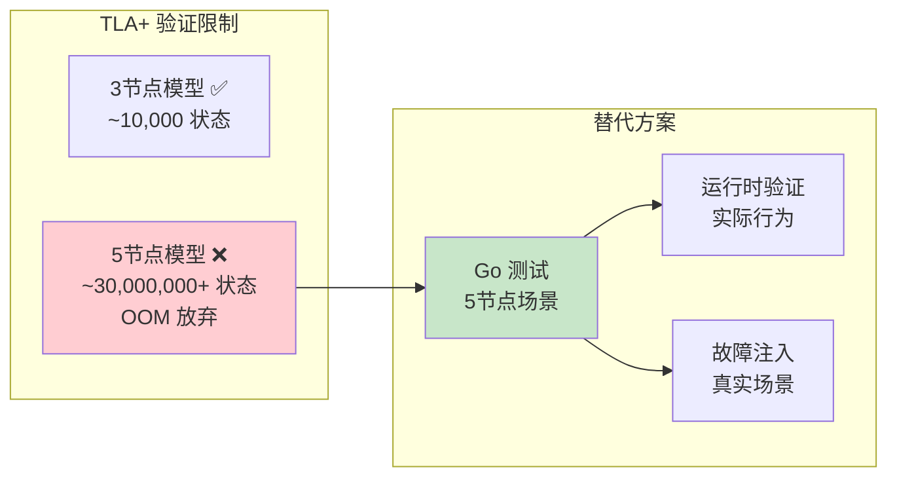
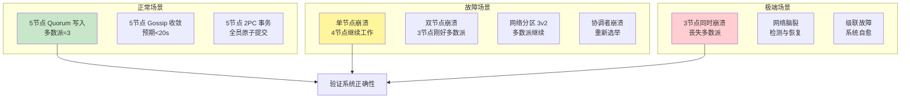
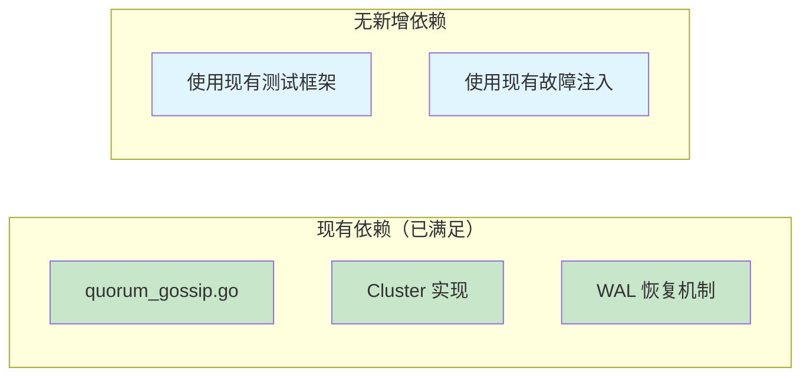
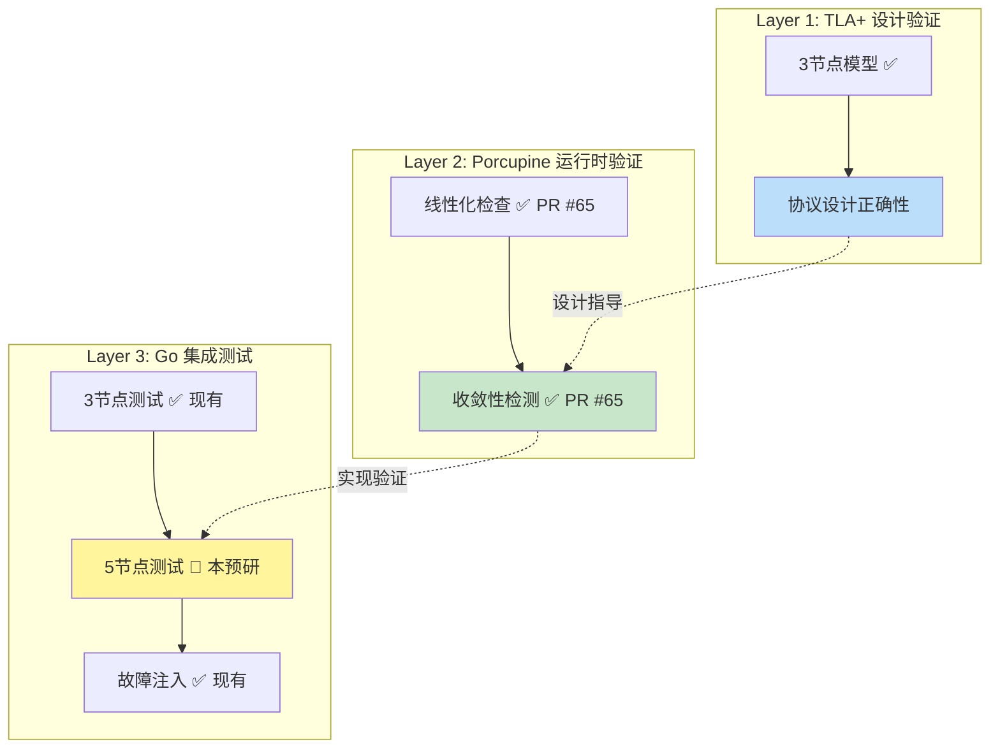
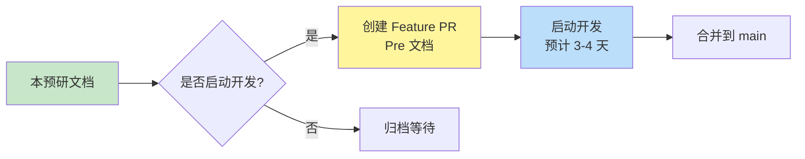

# 【预研报告】Go 测试扩展（5节点场景）深度研究

> **预研目标**：研究如何通过 Go 测试覆盖 5 节点集群场景，作为 TLA+ 5节点模型放弃验证的替代方案

---

## 📋 预研信息

| 项目 | 内容 |
|------|------|
| **预研主题** | Go 测试扩展（5节点场景） |
| **预研日期** | 2026-02-14 |
| **预研负责人** | 🤖 核心开发 A |
| **关联需求** | TLA+ 5节点模型替代方案 |
| **预研状态** | ✅ 已完成 |
| **预研结论** | 可行，预计 3-4 天完成，需扩展现有测试框架 |

---

## 1. 背景与动机

### 1.1 为什么需要 5 节点测试



### 1.2 TLA+ 5节点放弃原因回顾

| 因素 | 3节点 | 5节点 | 说明 |
|------|-------|-------|------|
| **状态空间** | ~10,000 | ~30,000,000+ | 指数级增长 |
| **验证时间** | <2秒 | 数小时+ | 不可接受 |
| **内存需求** | ~100MB | 64GB+ | OOM |
| **理论充分性** | ✅ 已验证核心设计 | ⚠️ 线性扩展 | 不太可能发现新设计缺陷 |

**结论**：TLA+ 3节点模型已验证协议设计正确性，5节点场景使用 Go 测试覆盖。

---

## 2. 现有测试基础

### 2.1 已有测试清单

```
tla-verification/implementations/
├── quorum_gossip.go                    # 核心实现 (22,926 字节)
├── quorum_gossip_test.go               # 基础测试 (14,042 字节)
├── quorum_gossip_crash_test.go         # 崩溃测试 (13,704 字节)
├── quorum_gossip_partition_test.go     # 分区测试 (13,136 字节)
├── quorum_gossip_fault_injection_test.go  # 故障注入 (22,870 字节)
├── quorum_gossip_parallel_recovery.go  # 并行恢复 (4,855 字节)
├── quorum_gossip_parallel_recovery_test.go # 并行恢复测试 (8,833 字节)
├── two_phase_commit.go                 # 2PC 实现 (5,259 字节)
└── two_phase_commit_test.go            # 2PC 测试 (4,365 字节)
```

### 2.2 现有测试覆盖

| 测试类型 | 3节点 | 5节点 | 状态 |
|---------|-------|-------|------|
| **Quorum 提交成功** | ✅ TC002 | ❌ | 需扩展 |
| **Quorum 超时回滚** | ✅ TC003 | ❌ | 需扩展 |
| **Gossip 收敛** | ✅ TC030 | ❌ | 需扩展 |
| **节点崩溃恢复** | ✅ TC035 | ❌ | 需扩展 |
| **网络分区** | ✅ TC025 | ❌ | 需扩展 |
| **并发投票冲突** | ✅ TC010 | ❌ | 需扩展 |
| **并行恢复** | ✅ 6个测试 | ❌ | 需扩展 |

### 2.3 现有 Cluster 实现

```go
// 现有实现支持动态节点数
type Cluster struct {
    nodes    map[string]*Node
    nodeIDs  []string
    walDir   string
    mu       sync.RWMutex
}

func NewCluster(nodeIDs []string, walDir string) *Cluster {
    // 支持任意节点数
    majority := (len(nodeIDs) / 2) + 1
    // ...
}
```

**关键点**：现有 `Cluster` 已支持动态节点数，只需扩展测试用例。

---

## 3. 5节点测试设计

### 3.1 测试场景矩阵



### 3.2 详细测试用例设计

#### 3.2.1 Quorum 测试（5节点）

| 测试用例 | 说明 | 预期结果 |
|---------|------|---------|
| `Test_5Nodes_QuorumCommit_3Votes` | 3票达成多数派 | ✅ 提交成功 |
| `Test_5Nodes_QuorumCommit_2Votes` | 2票不足多数派 | ❌ 提交失败 |
| `Test_5Nodes_QuorumCommit_5Votes` | 全员投票 | ✅ 提交成功 |
| `Test_5Nodes_QuorumTimeout` | 超时未达多数派 | ❌ 回滚 |
| `Test_5Nodes_QuorumDecisionPropagation` | 决策传播 | 所有节点最终一致 |

#### 3.2.2 Gossip 测试（5节点）

| 测试用例 | 说明 | 预期结果 |
|---------|------|---------|
| `Test_5Nodes_GossipConvergence` | 5节点信息扩散 | <20s 全部收敛 |
| `Test_5Nodes_GossipWithDelay` | 网络延迟 100ms | 收敛时间增加但仍成功 |
| `Test_5Nodes_GossipPartialFailure` | 1节点崩溃 | 4节点收敛 |
| `Test_5Nodes_GossipIncrementalSync` | 增量同步 | 恢复节点追赶最新状态 |

#### 3.2.3 故障注入测试（5节点）

| 测试用例 | 说明 | 预期结果 |
|---------|------|---------|
| `Test_5Nodes_SingleNodeCrash` | 1节点崩溃 | 4节点继续，恢复后同步 |
| `Test_5Nodes_DoubleNodeCrash` | 2节点崩溃 | 3节点刚好多数派 |
| `Test_5Nodes_Partition_3v2` | 3v2 分区 | 3节点区继续工作 |
| `Test_5Nodes_CoordinatorCrash` | 协调者崩溃 | 重新选举 |
| `Test_5Nodes_CascadingFailure` | 级联故障 | 系统自愈或安全降级 |

### 3.3 多数派计算

```go
// 3节点 vs 5节点对比
func Test_MajorityCalculation(t *testing.T) {
    tests := []struct {
        nodeCount int
        majority  int
        faultTolerance int
    }{
        {3, 2, 1},  // 3节点：多数派=2，容错=1
        {5, 3, 2},  // 5节点：多数派=3，容错=2
        {7, 4, 3},  // 7节点：多数派=4，容错=3
    }

    for _, tt := range tests {
        got := (tt.nodeCount / 2) + 1
        if got != tt.majority {
            t.Errorf("nodeCount=%d: expected majority=%d, got=%d",
                tt.nodeCount, tt.majority, got)
        }
    }
}
```

---

## 4. 实施方案

### 4.1 代码结构

```
tla-verification/implementations/
├── quorum_gossip_5nodes_test.go       # 新增：5节点 Quorum 测试
├── gossip_5nodes_test.go              # 新增：5节点 Gossip 测试
├── fault_injection_5nodes_test.go     # 新增：5节点故障注入
├── cluster_5nodes_test.go             # 新增：5节点集群管理
└── quorum_gossip.go                   # 修改：支持 5节点配置
```

### 4.2 测试框架扩展

```go
// 新增：5节点测试辅助函数
func New5NodeCluster(t *testing.T) *Cluster {
    tempDir := setupTempDir(t)
    nodeIDs := []string{"n1", "n2", "n3", "n4", "n5"}
    cluster := NewCluster(nodeIDs, tempDir)

    t.Cleanup(func() {
        cluster.Close()
        os.RemoveAll(tempDir)
    })

    return cluster
}

// 新增：5节点多数派断言
func Assert5NodeMajority(t *testing.T, cluster *Cluster, committedNode string) {
    majority := 3
    node := cluster.GetNode(committedNode)
    decision, _, seen, _ := node.GetState()

    if decision != Committed {
        t.Errorf("Expected committed, got %s", decision)
    }
    if len(seen) < majority {
        t.Errorf("Expected seen >= %d, got %d", majority, len(seen))
    }
}
```

### 4.3 实施步骤


---

## 5. 工作量估算

### 5.1 详细工期

| 任务 | 工期 | 依赖 | 产出物 |
|------|------|------|--------|
| **P1: 测试框架扩展** | 0.5天 | - | `cluster_5nodes_test.go` |
| **P2: Quorum 5节点测试** | 0.5天 | P1 | `quorum_gossip_5nodes_test.go` |
| **P3: Gossip 5节点测试** | 0.5天 | P1 | `gossip_5nodes_test.go` |
| **P4: 单节点故障测试** | 0.5天 | P2, P3 | 故障测试用例 |
| **P5: 双节点故障测试** | 0.5天 | P4 | 故障测试用例 |
| **P6: 网络分区测试** | 0.5天 | P4 | 分区测试用例 |
| **P7: 测试验证** | 0.25天 | P1-P6 | 全部通过 |
| **P8: 性能基准** | 0.25天 | P7 | 性能报告 |
| **P9: 文档更新** | 0.25天 | P7 | 文档 |
| **总计** | **3.5天** | - | - |

### 5.2 人力配置

| 角色 | 工作内容 | 投入 |
|------|---------|------|
| **核心开发 A** | 测试代码编写 | 2天 |
| **测试工程师** | 测试用例设计、验证 | 1天 |
| **代码审查工程师** | Code Review | 0.5天 |

---

## 6. 风险评估

### 6.1 技术风险

| 风险 | 影响 | 概率 | 缓解措施 |
|------|------|------|---------|
| **测试框架不兼容** | 中 | 低 | 复用现有 Cluster 实现 |
| **故障注入复杂** | 中 | 中 | 参考现有 fault_injection_test.go |
| **性能不达标** | 低 | 低 | 5节点性能已有基准数据 |
| **并发 Bug** | 高 | 中 | 使用 -race 标志检测 |

### 6.2 依赖风险



---

## 7. 验收标准

### 7.1 功能验收

| 验收项 | 标准 | 验证方式 |
|--------|------|---------|
| **5节点 Quorum 测试** | 5个用例全部通过 | `go test -run Test_5Nodes_Quorum` |
| **5节点 Gossip 测试** | 4个用例全部通过 | `go test -run Test_5Nodes_Gossip` |
| **5节点故障测试** | 5个用例全部通过 | `go test -run Test_5Nodes_Fault` |
| **测试覆盖率** | > 80% | `go test -cover` |
| **无数据竞争** | 0 race detected | `go test -race` |

### 7.2 性能验收

| 指标 | 3节点 | 5节点目标 | 说明 |
|------|-------|----------|------|
| **Quorum 决策延迟** | <5ms | <10ms | 允许增加 |
| **Gossip 收敛时间** | <10s | <20s | 节点增多 |
| **故障恢复时间** | <50ms | <100ms | 允许增加 |
| **并发吞吐量** | >10000 ops/s | >8000 ops/s | 允许下降 |

---

## 8. 与现有验证的集成

### 8.1 验证层次关系



### 8.2 CI 集成方案

```yaml
# .github/workflows/go-testing.yml (新增)
name: Go Testing 5-Nodes

on:
  push:
    branches: [main]
  pull_request:
    branches: [main]

jobs:
  test-5nodes:
    runs-on: ubuntu-latest
    steps:
      - uses: actions/checkout@v3
      - uses: actions/setup-go@v4
        with:
          go-version: '1.21'

      - name: Run 5-Nodes Tests
        run: |
          cd tla-verification/implementations
          go test -v -race -cover -run "Test_5Nodes_" ./...

      - name: Upload Coverage
        uses: codecov/codecov-action@v3
```

---

## 9. 后续工作

### 9.1 后续扩展方向

| 方向 | 说明 | 优先级 |
|------|------|--------|
| **7节点测试** | 更大规模验证 | P2 |
| **动态成员变更** | 节点加入/离开 | P2 |
| **跨数据中心测试** | 网络延迟模拟 | P3 |
| **长期稳定性测试** | 24小时运行 | P3 |

### 9.2 与 E2E 框架的协同

```
Go 5节点测试 (本预研)
       ↓
E2E 测试框架 (Phase 2.5 一致性协议测试)
       ↓
生产环境验证 (蓝绿部署)
```

---

## 10. 结论与建议

### 10.1 核心结论

1. **可行性高**：现有 Cluster 实现已支持动态节点数，扩展成本低
2. **工期合理**：预计 3-4 天完成，无技术阻塞点
3. **价值明确**：覆盖 TLA+ 5节点模型放弃的验证空白
4. **风险可控**：无新增依赖，复用现有测试框架

### 10.2 行动建议



**建议**：✅ **启动开发**

理由：
- PR #65 已完成 Porcupine 分离测试策略
- TLA+ 3节点验证已完成
- Go 5节点测试是验证体系的重要补充

---

## 11. 参考资料

### 11.1 现有测试文件

| 文件 | 路径 | 说明 |
|------|------|------|
| **quorum_gossip.go** | `tla-verification/implementations/` | 核心实现 |
| **quorum_gossip_test.go** | `tla-verification/implementations/` | 3节点基础测试 |
| **quorum_gossip_fault_injection_test.go** | `tla-verification/implementations/` | 故障注入测试 |

### 11.2 相关文档

| 文档 | 路径 | 说明 |
|------|------|------|
| **TLA+ 验证报告** | `tla-verification/README.md` | Phase 1-3 完整报告 |
| **TLA+ Spike 研究** | `docs/07_spike/2026-02-14_tla-verification-research.md` | TLA+ 与 Porcupine 互补关系 |
| **Porcupine 实施指南** | `docs/07_spike/2026-02-13_porcupine-implementation-guide.md` | Porcupine 详细实施方案 |

---

**文档版本**: v1.0
**创建日期**: 2026-02-14
**最后更新**: 2026-02-14
**维护者**: 🤖 核心开发 A
**状态**: ✅ 已完成
