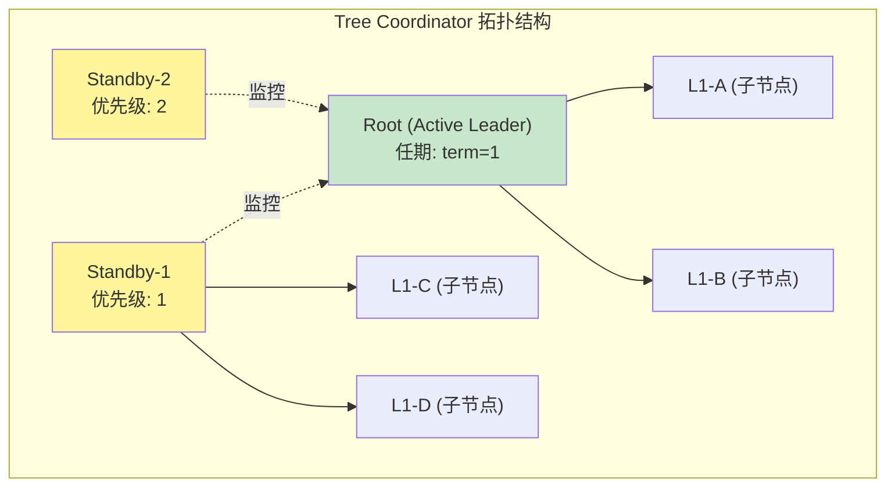
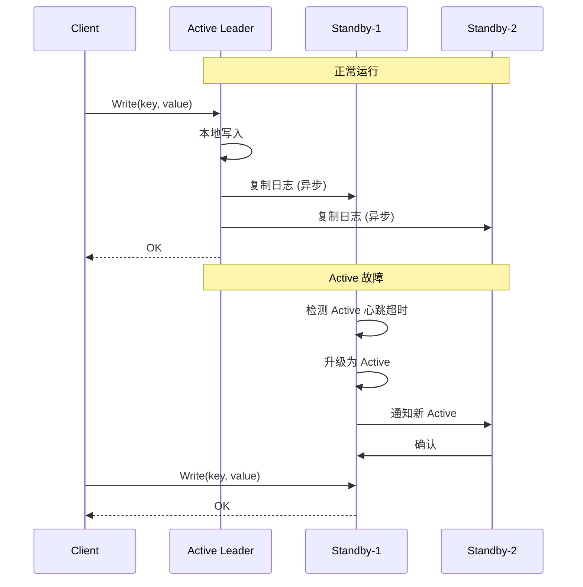
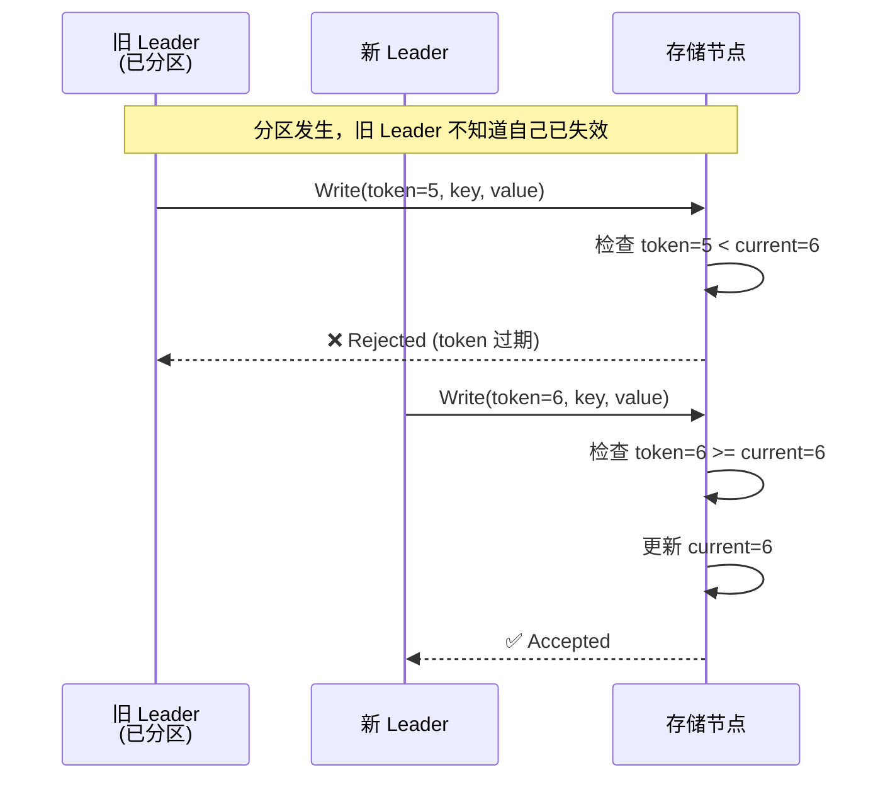
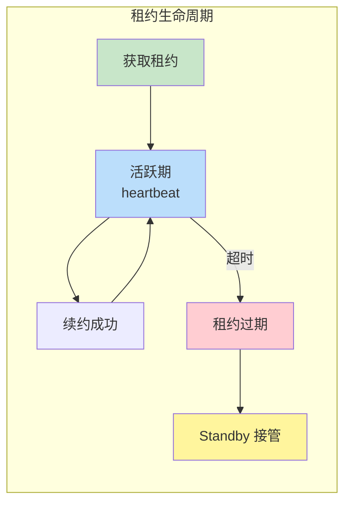
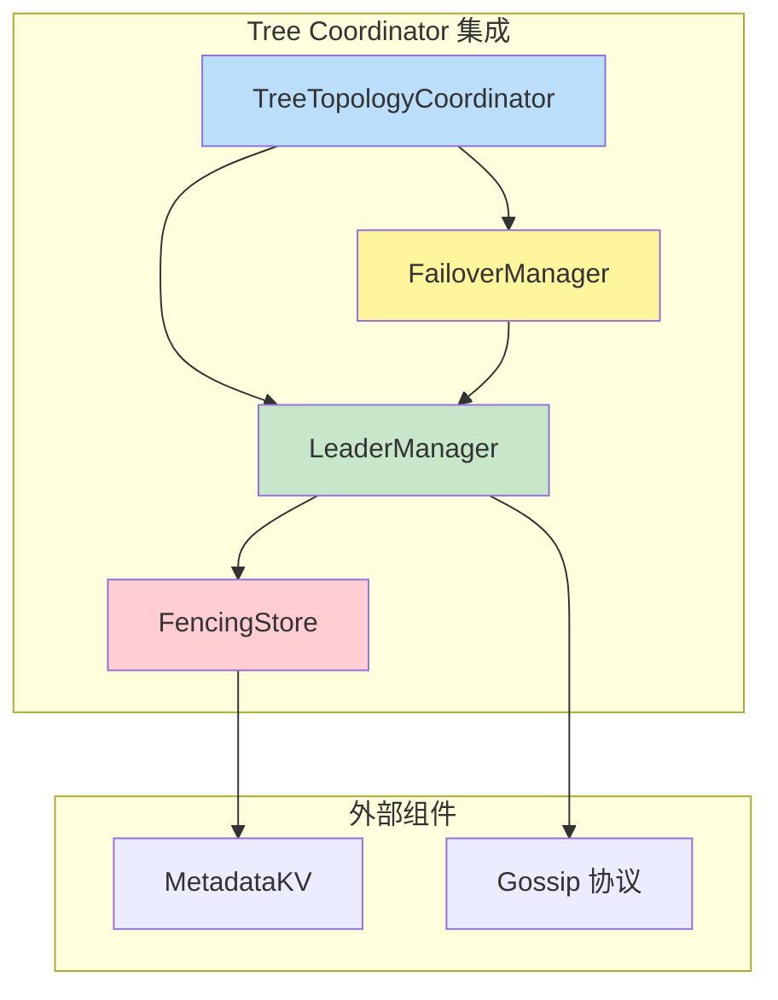

# 【预研报告】Tree Coordinator Leader HA 设计

> **预研目标**：基于 Tree Coordinator 拓扑特性的 Leader 高可用设计，避免脑裂

---

## 📋 预研信息

| 项目 | 内容 |
|------|------|
| **预研主题** | Tree Coordinator Leader HA 设计（父节点天然 Leader + Standby HA）|
| **预研日期** | 2026-02-14 |
| **预研负责人** | 🤖 核心开发 A |
| **关联文档** | `2026-02-14_consistency-implementation-review.md` |
| **预研状态** | ✅ 已完成 |

---

## 1. 核心设计洞察

### 1.1 Tree Coordinator 拓扑优势



**关键洞察**：

| 传统方案 | Tree Coordinator 方案 |
|---------|---------------------|
| 需要 Raft/Paxos 选举 | **父节点 = 天然 Leader** |
| 选举超时 100-500ms | **无选举延迟** |
| 复杂的日志复制 | **利用现有 2PC 机制** |
| 脑裂风险高 | **拓扑结构天然防脑裂** |

### 1.2 无需选举的 Leader 确定机制

```
Leader 确定规则（确定性）：
1. 父节点 ID 最小者为 Active Leader
2. 其他父节点为 Standby（按 ID 排序确定优先级）
3. 故障转移：Active 失败 → 最高优先级 Standby 接管

示例：
  节点列表: [node-001, node-002, node-003]
  Active Leader: node-001（ID 最小）
  Standby-1: node-002
  Standby-2: node-003

  node-001 故障 → node-002 自动成为 Active
```

---

## 2. HA 架构设计

### 2.1 Active-Standby 模式



### 2.2 状态机定义

```go
// LeaderState Leader 状态
type LeaderState int

const (
    LeaderStateUnknown   LeaderState = iota
    LeaderStateActive                // 活跃 Leader
    LeaderStateStandby               // 待命 Standby
    LeaderStateTransitioning         // 切换中
    LeaderStateFailed                // 已故障
)

// LeaderInfo Leader 信息
type LeaderInfo struct {
    NodeID        string
    Term          uint64        // 任期号
    State         LeaderState
    Priority      int           // 优先级（越小越高）
    LastHeartbeat time.Time     // 最后心跳时间
    LeaseExpiry   time.Time     // 租约过期时间
}

// LeaderManager Leader 管理器
type LeaderManager struct {
    mu            sync.RWMutex
    localNodeID   string
    currentLeader *LeaderInfo
    allNodes      []*LeaderInfo

    // 配置
    heartbeatInterval   time.Duration
    heartbeatTimeout    time.Duration
    leaseDuration       time.Duration
}
```

---

## 3. Fencing Token 机制

### 3.1 设计原理

Fencing Token 用于防止**旧 Leader 在故障恢复后继续写入**，这是脑裂场景的核心防护机制。



### 3.2 实现

```go
// FencingToken Fencing Token
type FencingToken struct {
    Term      uint64    // 任期号（全局递增）
    NodeID    string    // 节点 ID
    Timestamp int64     // 时间戳（用于调试）
}

// Compare 比较两个 Token
// 返回: 1 表示 a > b, -1 表示 a < b, 0 表示相等
func (t *FencingToken) Compare(other *FencingToken) int {
    if t.Term > other.Term {
        return 1
    } else if t.Term < other.Term {
        return -1
    }
    return 0
}

// FencingStore 带 Fencing 的存储
type FencingStore struct {
    mu            sync.RWMutex
    currentToken  FencingToken
    data          map[string][]byte
}

// Write 带 Fencing 检查的写入
func (s *FencingStore) Write(token FencingToken, key string, value []byte) error {
    s.mu.Lock()
    defer s.mu.Unlock()

    // Fencing 检查
    if token.Compare(&s.currentToken) < 0 {
        return ErrStaleToken // Token 过期，拒绝写入
    }

    // 更新 Token 和数据
    s.currentToken = token
    s.data[key] = value
    return nil
}

// Read 读取数据（需要验证 Token）
func (s *FencingStore) Read(token FencingToken, key string) ([]byte, error) {
    s.mu.RLock()
    defer s.mu.RUnlock()

    // 读取不需要 Fencing 检查，但返回当前 Token 供验证
    value, exists := s.data[key]
    if !exists {
        return nil, ErrNotFound
    }
    return value, nil
}
```

### 3.3 Term 管理

```go
// TermStorage Term 持久化存储
type TermStorage struct {
    kv kvstore.MetadataKV
}

// GetCurrentTerm 获取当前 Term
func (t *TermStorage) GetCurrentTerm() (uint64, error) {
    data, err := t.kv.Get(kvstore.NamespaceCluster, "current_term")
    if err != nil {
        return 0, err
    }
    return binary.BigEndian.Uint64(data), nil
}

// AdvanceTerm 推进 Term（新 Leader 上任时调用）
func (t *TermStorage) AdvanceTerm() (uint64, error) {
    // 原子递增 Term
    currentTerm, err := t.GetCurrentTerm()
    if err != nil {
        return 0, err
    }

    newTerm := currentTerm + 1
    data := make([]byte, 8)
    binary.BigEndian.PutUint64(data, newTerm)

    if err := t.kv.Put(kvstore.NamespaceCluster, "current_term", data); err != nil {
        return 0, err
    }

    return newTerm, nil
}
```

---

## 4. 租约机制

### 4.1 设计原理

租约（Lease）是 Leader 证明自己仍然活着的机制：

- Leader 定期续约（心跳）
- 租约过期 = Leader 可能已故障
- Standby 检测租约过期后触发故障转移



### 4.2 实现

```go
// Lease 租约
type Lease struct {
    ID         string
    Holder     string      // 租约持有者（Leader ID）
    Term       uint64      // 任期
    Expiry     time.Time   // 过期时间
    Duration   time.Duration // 租约时长
}

// LeaseManager 租约管理器
type LeaseManager struct {
    mu              sync.RWMutex
    currentLease    *Lease
    kv              kvstore.MetadataKV
    leaseDuration   time.Duration
}

// AcquireLease 获取租约
func (m *LeaseManager) AcquireLease(nodeID string, term uint64) (*Lease, error) {
    m.mu.Lock()
    defer m.mu.Unlock()

    now := time.Now()

    // 检查当前租约是否已过期
    if m.currentLease != nil && m.currentLease.Expiry.After(now) {
        // 租约仍然有效，检查是否是同一持有者
        if m.currentLease.Holder == nodeID {
            // 续约
            m.currentLease.Expiry = now.Add(m.leaseDuration)
            return m.currentLease, nil
        }
        // 租约被其他节点持有
        return nil, ErrLeaseHeld
    }

    // 获取新租约
    lease := &Lease{
        ID:       uuid.New().String(),
        Holder:   nodeID,
        Term:     term,
        Expiry:   now.Add(m.leaseDuration),
        Duration: m.leaseDuration,
    }

    // 持久化租约
    if err := m.persistLease(lease); err != nil {
        return nil, err
    }

    m.currentLease = lease
    return lease, nil
}

// IsLeaseValid 检查租约是否有效
func (m *LeaseManager) IsLeaseValid(nodeID string, term uint64) bool {
    m.mu.RLock()
    defer m.mu.RUnlock()

    if m.currentLease == nil {
        return false
    }

    return m.currentLease.Holder == nodeID &&
           m.currentLease.Term == term &&
           m.currentLease.Expiry.After(time.Now())
}

// RenewLease 续约
func (m *LeaseManager) RenewLease(nodeID string, term uint64) error {
    m.mu.Lock()
    defer m.mu.Unlock()

    if m.currentLease == nil {
        return ErrNoLease
    }

    if m.currentLease.Holder != nodeID || m.currentLease.Term != term {
        return ErrLeaseNotHeld
    }

    m.currentLease.Expiry = time.Now().Add(m.leaseDuration)
    return m.persistLease(m.currentLease)
}
```

---

## 5. 故障检测与转移

### 5.1 故障检测

```go
// FailureDetector 故障检测器
type FailureDetector struct {
    mu               sync.RWMutex
    leaderID         string
    lastHeartbeat    time.Time
    heartbeatTimeout time.Duration
    phiThreshold     float64  // Phi Accrual 检测阈值

    // 心跳历史（用于 Phi Accrual 检测）
    heartbeatHistory []time.Duration
    historySize      int
}

// RecordHeartbeat 记录心跳
func (d *FailureDetector) RecordHeartbeat(leaderID string) {
    d.mu.Lock()
    defer d.mu.Unlock()

    now := time.Now()
    if d.lastHeartbeat.IsZero() {
        d.lastHeartbeat = now
        return
    }

    interval := now.Sub(d.lastHeartbeat)
    d.heartbeatHistory = append(d.heartbeatHistory, interval)
    if len(d.heartbeatHistory) > d.historySize {
        d.heartbeatHistory = d.heartbeatHistory[1:]
    }

    d.lastHeartbeat = now
    d.leaderID = leaderID
}

// IsLeaderSuspected 使用 Phi Accrual 检测判断 Leader 是否可疑
func (d *FailureDetector) IsLeaderSuspected() bool {
    d.mu.RLock()
    defer d.mu.RUnlock()

    if d.lastHeartbeat.IsZero() {
        return true
    }

    // 简单超时检测
    if time.Since(d.lastHeartbeat) > d.heartbeatTimeout {
        return true
    }

    // Phi Accrual 检测（基于历史心跳间隔的概率检测）
    if len(d.heartbeatHistory) < 10 {
        return false // 样本不足，不使用 Phi 检测
    }

    phi := d.calculatePhi()
    return phi > d.phiThreshold
}

// calculatePhi 计算 Phi 值
func (d *FailureDetector) calculatePhi() float64 {
    // 计算心跳间隔的均值和标准差
    var sum, sumSq time.Duration
    for _, interval := range d.heartbeatHistory {
        sum += interval
        sumSq += interval * interval
    }

    n := float64(len(d.heartbeatHistory))
    mean := float64(sum) / n
    variance := float64(sumSq)/n - mean*mean
    stdDev := math.Sqrt(variance)

    // 计算当前间隔的 Phi 值
    currentInterval := time.Since(d.lastHeartbeat)
    if stdDev == 0 {
        stdDev = float64(d.heartbeatTimeout) / 4 // 避免除零
    }

    // 正态分布概率
    t := float64(currentInterval)
    y := (t - mean) / stdDev
    phi := -math.Log10(1 - math.Erf(y/math.Sqrt2))

    return phi
}
```

### 5.2 故障转移

```go
// FailoverManager 故障转移管理器
type FailoverManager struct {
    mu               sync.RWMutex
    leaderManager    *LeaderManager
    failureDetector  *FailureDetector
    termStorage      *TermStorage
    leaseManager     *LeaseManager

    // 回调
    onBecomeLeader   func()
    onBecomeStandby  func()
}

// Run 运行故障转移循环
func (m *FailoverManager) Run(ctx context.Context) {
    ticker := time.NewTicker(100 * time.Millisecond)
    defer ticker.Stop()

    for {
        select {
        case <-ctx.Done():
            return
        case <-ticker.C:
            m.checkAndFailover()
        }
    }
}

// checkAndFailover 检查并执行故障转移
func (m *FailoverManager) checkAndFailover() {
    m.mu.Lock()
    defer m.mu.Unlock()

    leaderInfo := m.leaderManager.GetCurrentLeader()

    // 判断当前节点角色
    if leaderInfo.NodeID == m.leaderManager.localNodeID {
        // 当前节点是 Leader
        m.handleLeaderDuties()
    } else if m.leaderManager.IsHighestPriorityStandby() {
        // 当前节点是最高优先级 Standby
        m.handleStandbyDuties()
    }
}

// handleStandbyDuties Standby 职责
func (m *FailoverManager) handleStandbyDuties() {
    // 检测 Leader 是否故障
    if !m.failureDetector.IsLeaderSuspected() {
        return // Leader 正常
    }

    // Leader 可疑，尝试接管
    log.Info("Leader suspected, attempting takeover",
        "leader", m.leaderManager.GetCurrentLeader().NodeID,
        "local", m.leaderManager.localNodeID)

    // 推进 Term
    newTerm, err := m.termStorage.AdvanceTerm()
    if err != nil {
        log.Error("Failed to advance term", "error", err)
        return
    }

    // 尝试获取租约
    lease, err := m.leaseManager.AcquireLease(m.leaderManager.localNodeID, newTerm)
    if err != nil {
        log.Warn("Failed to acquire lease", "error", err)
        return
    }

    // 成功获取租约，成为新 Leader
    m.leaderManager.BecomeLeader(newTerm)

    // 通知回调
    if m.onBecomeLeader != nil {
        m.onBecomeLeader()
    }

    log.Info("Became new leader",
        "term", newTerm,
        "lease", lease.ID)
}

// handleLeaderDuties Leader 职责
func (m *FailoverManager) handleLeaderDuties() {
    // 发送心跳
    m.sendHeartbeat()

    // 续约租约
    if err := m.leaseManager.RenewLease(
        m.leaderManager.localNodeID,
        m.leaderManager.GetCurrentLeader().Term,
    ); err != nil {
        log.Error("Failed to renew lease, stepping down", "error", err)
        m.leaderManager.BecomeStandby()

        if m.onBecomeStandby != nil {
            m.onBecomeStandby()
        }
    }
}
```

---

## 6. Porcupine 验证

### 6.1 验证模型

```go
// LeaderHAModel Leader HA 的 Porcupine 验证模型
func LeaderHAModel() porcupine.Model {
    return porcupine.Model{
        Init: func() interface{} {
            return &LeaderHAState{
                Store:         make(map[string]VersionedValue),
                CurrentLeader: "",
                CurrentTerm:   0,
                LeaderHistory: make([]LeaderTransition, 0),
            }
        },
        Step: func(state, input, output interface{}) (bool, interface{}) {
            st := state.(*LeaderHAState)
            op := input.(LeaderHAOperation)

            switch op.Type {
            case "write":
                // Fencing Token 检查
                if op.Token.Term < st.CurrentTerm {
                    // Token 过期，拒绝写入
                    return output == "stale_token", st
                }

                // 更新 Leader（如果 Token 更新）
                if op.Token.Term > st.CurrentTerm {
                    st.CurrentTerm = op.Token.Term
                    st.CurrentLeader = op.Token.NodeID
                    st.LeaderHistory = append(st.LeaderHistory, LeaderTransition{
                        Term:   op.Token.Term,
                        Leader: op.Token.NodeID,
                    })
                }

                // 执行写入
                newSt := st.Clone()
                newSt.Store[op.Key] = VersionedValue{
                    Value:   op.Value,
                    Version: op.Token.Term,
                }
                return output == "ok", newSt

            case "read":
                val, exists := st.Store[op.Key]
                if !exists {
                    return output == nil, st
                }
                return output == val.Value, st

            case "leader_change":
                // Leader 变更
                if op.NewTerm <= st.CurrentTerm {
                    return output == "rejected", st // 不能回退 Term
                }
                newSt := st.Clone()
                newSt.CurrentTerm = op.NewTerm
                newSt.CurrentLeader = op.NewLeader
                newSt.LeaderHistory = append(newSt.LeaderHistory, LeaderTransition{
                    Term:   op.NewTerm,
                    Leader: op.NewLeader,
                })
                return output == "ok", newSt
            }

            return false, st
        },
    }
}

// LeaderHAState Leader HA 状态
type LeaderHAState struct {
    Store         map[string]VersionedValue
    CurrentLeader string
    CurrentTerm   uint64
    LeaderHistory []LeaderTransition
}

type LeaderTransition struct {
    Term   uint64
    Leader string
}

type LeaderHAOperation struct {
    Type      string
    Key       string
    Value     []byte
    Token     FencingToken
    NewTerm   uint64
    NewLeader string
}
```

### 6.2 验证场景

```go
// TestLeaderHA_FencingToken 测试 Fencing Token 有效性
func TestLeaderHA_FencingToken(t *testing.T) {
    model := LeaderHAModel()
    recorder := NewLeaderHARecorder()

    // 场景：旧 Leader 尝试写入
    // 1. 新 Leader 写入（token=2）
    recorder.Record("node-2", "write", LeaderHAOperation{
        Type:  "write",
        Key:   "k1",
        Value: []byte("v2"),
        Token: FencingToken{Term: 2, NodeID: "node-2"},
    }, "ok")

    // 2. 旧 Leader 尝试写入（token=1，应该被拒绝）
    recorder.Record("node-1", "write", LeaderHAOperation{
        Type:  "write",
        Key:   "k1",
        Value: []byte("v1-old"),
        Token: FencingToken{Term: 1, NodeID: "node-1"},
    }, "stale_token")

    // 验证
    result, _ := porcupine.CheckOperations(model, recorder.GetHistory(), time.Minute)
    assert.Equal(t, porcupine.Ok, result)
}

// TestLeaderHA_LeaderTransition 测试 Leader 切换
func TestLeaderHA_LeaderTransition(t *testing.T) {
    model := LeaderHAModel()
    recorder := NewLeaderHARecorder()

    // 场景：Leader 从 node-1 切换到 node-2
    // 1. node-1 写入
    recorder.Record("node-1", "write", LeaderHAOperation{
        Type:  "write",
        Key:   "k1",
        Value: []byte("v1"),
        Token: FencingToken{Term: 1, NodeID: "node-1"},
    }, "ok")

    // 2. Leader 切换
    recorder.Record("system", "leader_change", LeaderHAOperation{
        Type:      "leader_change",
        NewTerm:   2,
        NewLeader: "node-2",
    }, "ok")

    // 3. node-2 写入
    recorder.Record("node-2", "write", LeaderHAOperation{
        Type:  "write",
        Key:   "k1",
        Value: []byte("v2"),
        Token: FencingToken{Term: 2, NodeID: "node-2"},
    }, "ok")

    // 4. 验证线性化
    result, _ := porcupine.CheckOperations(model, recorder.GetHistory(), time.Minute)
    assert.Equal(t, porcupine.Ok, result)
}
```

---

## 7. 与 Tree Coordinator 集成

### 7.1 集成架构



### 7.2 代码集成

```go
// TreeTopologyCoordinator 扩展
type TreeTopologyCoordinator struct {
    // 原有字段...

    // 新增：Leader HA
    leaderManager   *LeaderManager
    failoverManager *FailoverManager
    fencingStore    *FencingStore
}

// NewTreeTopologyCoordinator 构造函数
func NewTreeTopologyCoordinator(opts CoordinatorOptions) *TreeTopologyCoordinator {
    c := &TreeTopologyCoordinator{
        // 原有初始化...
    }

    // 初始化 Leader HA
    c.leaderManager = NewLeaderManager(
        opts.LocalNodeID,
        opts.ParentNodes, // 所有父节点（用于确定优先级）
    )

    c.fencingStore = NewFencingStore(opts.MetadataKV)

    c.failoverManager = NewFailoverManager(
        c.leaderManager,
        NewFailureDetector(3*time.Second),
        NewTermStorage(opts.MetadataKV),
        NewLeaseManager(opts.MetadataKV, 5*time.Second),
    )

    // 设置回调
    c.failoverManager.onBecomeLeader = c.onBecomeLeader
    c.failoverManager.onBecomeStandby = c.onBecomeStandby

    return c
}

// onBecomeLeader 成为 Leader 回调
func (c *TreeTopologyCoordinator) onBecomeLeader() {
    log.Info("Became leader, initializing coordinator")

    // 初始化作为 Leader 的职责
    // 1. 开始接收写入
    // 2. 开始协调 2PC
    // 3. 开始发送心跳
}

// onBecomeStandby 成为 Standby 回调
func (c *TreeTopologyCoordinator) onBecomeStandby() {
    log.Info("Became standby, stopping leader duties")

    // 停止 Leader 职责
    // 1. 停止接收新写入
    // 2. 等待进行中的 2PC 完成
    // 3. 开始监控 Leader 心跳
}

// Put 带 Fencing 的写入
func (c *TreeTopologyCoordinator) Put(ctx context.Context, ns kvstore.Namespace, key string, value []byte) error {
    // 获取当前 Token
    token := c.leaderManager.GetFencingToken()

    // 检查是否是 Leader
    if !c.leaderManager.IsLeader() {
        return ErrNotLeader
    }

    // 使用 FencingStore 写入
    return c.fencingStore.Write(token, ns, key, value)
}
```

---

## 8. 总结

### 8.1 设计要点

| 机制 | 作用 | 实现 |
|------|------|------|
| **父节点 = 天然 Leader** | 无需选举，确定性 | 节点 ID 排序 |
| **Standby HA** | 高可用备份 | 优先级队列 |
| **Fencing Token** | 防止脑裂 | Term 递增 |
| **租约机制** | 活性检测 | 心跳续约 |
| **Phi Accrual 检测** | 精准故障检测 | 概率模型 |

### 8.2 Porcupine 验证覆盖

| 场景 | 验证点 |
|------|--------|
| 正常写入 | Token 有效性 |
| Leader 切换 | Term 单调递增 |
| 旧 Leader 写入 | Token 过期拒绝 |
| 并发切换 | 线性化 |

### 8.3 与现有架构的关系

```
┌─────────────────────────────────────────────────────────┐
│                   Tree Coordinator                       │
├─────────────────────────────────────────────────────────┤
│  Layer 1: 2PC（父节点 + 子节点组）                        │
│           └── Leader HA + Fencing Token ✅              │
├─────────────────────────────────────────────────────────┤
│  Layer 2: Quorum（跨父节点）                             │
│           └── 使用 Layer1 的 Leader 信息                 │
├─────────────────────────────────────────────────────────┤
│  Layer 3: Gossip（全局）                                 │
│           └── 最终一致，无需 Leader                      │
└─────────────────────────────────────────────────────────┘
```

---

**文档版本**: v1.0
**创建日期**: 2026-02-14
**最后更新**: 2026-02-14
**维护者**: 🤖 核心开发 A
**状态**: ✅ 已完成
