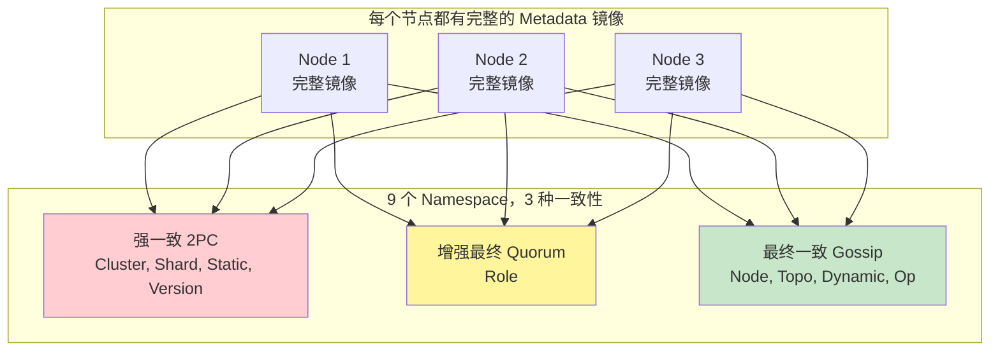
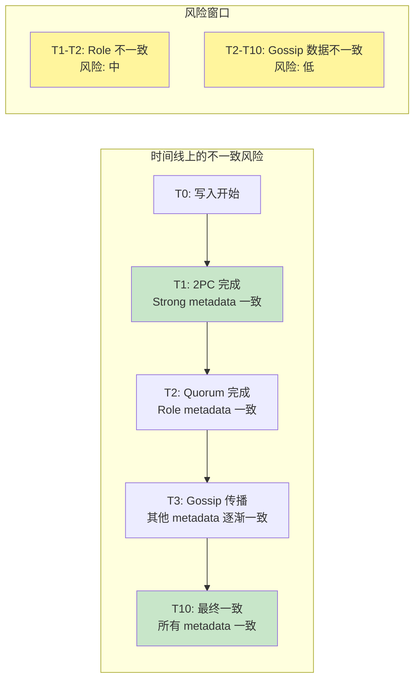
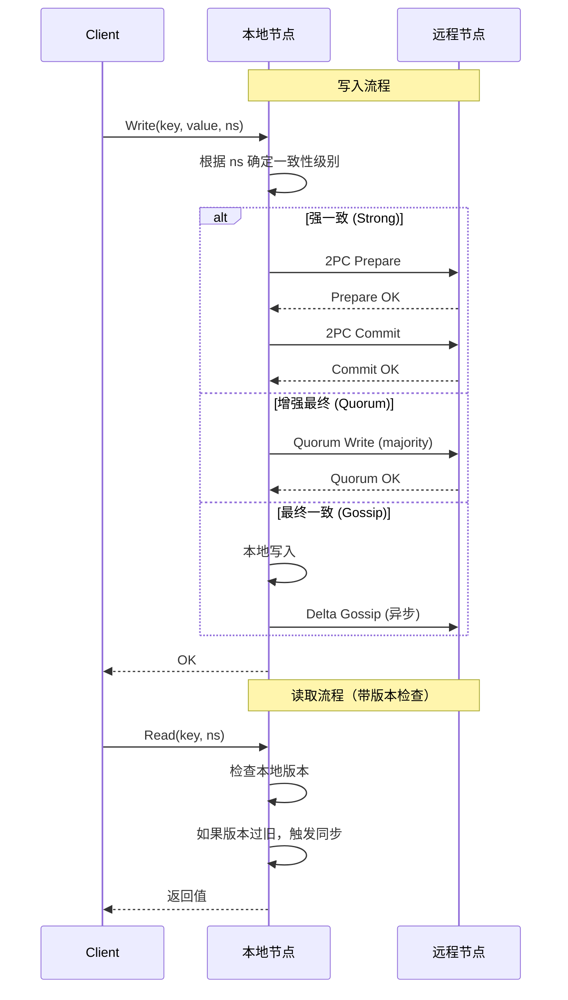

# 【预研报告】Layer3 Metadata 快速同步与时延验证

> **预研目标**：研究全镜像 Metadata 的不一致风险，设计快速同步方案和 Porcupine 时延验证

---

## 📋 预研信息

| 项目 | 内容 |
|------|------|
| **预研主题** | Layer3 Metadata 快速同步 + Porcupine 时延验证 |
| **预研日期** | 2026-02-14 |
| **预研负责人** | 🤖 核心开发 A |
| **问题来源** | 用户提出：每个节点完整镜像 + 不同一致性级别 = 潜在不一致风险 |
| **预研状态** | ✅ 已完成 |

---

## 1. 问题分析

### 1.1 当前架构



### 1.2 不一致风险矩阵



### 1.3 风险场景分析

| 场景 | 涉及 Namespace | 不一致时间窗口 | 风险级别 |
|------|---------------|---------------|---------|
| **新节点加入** | Node, Topo, Role | 0-10s | ⚠️ 中 |
| **分片迁移** | Shard, Node, Role | 0-5s (2PC) | ✅ 低 |
| **负载更新** | Dynamic | 0-10s (Gossip) | ✅ 低 |
| **故障切换** | Node, Topo, Role, Dynamic | 0-10s | ⚠️ 中 |
| **配置变更** | Cluster, Static, Version | 0-5s (2PC) | ✅ 低 |

### 1.4 当前实现分析

**代码位置**：`internal/metadata/kvstore/metadata_kv.go`

```go
// 当前的触发同步逻辑
func (m *MetadataKV) triggerSync(ns, key string, version uint64, consistency ConsistencyLevel) {
    switch consistency {
    case ConsistencyStrong:
        // 强一致：触发 2PC（阻塞等待）
        if m.quorumCallback != nil {
            m.quorumCallback(ns, key, version)
        }
    case ConsistencyEnhancedEventual:
        // 增强最终一致：触发 Quorum
        if m.quorumCallback != nil {
            m.quorumCallback(ns, key, version)
        }
    case ConsistencyEventual:
        // 最终一致：触发 Gossip（异步）
        if m.gossipCallback != nil {
            m.gossipCallback(ns, key, version)
        }
    }
}
```

**问题**：
1. 不同 Namespace 独立同步，没有协调
2. Gossip 传播有延迟（可能 10s）
3. 读取时可能读到"新旧混合"的状态

---

## 2. 快速同步方案设计

### 2.1 方案对比

| 方案 | 复杂度 | 同步时间 | 一致性保证 | 推荐度 |
|------|--------|---------|-----------|--------|
| **A. 优先级同步** | 低 | 1-3s | 按优先级顺序 | ⭐⭐⭐⭐ |
| **B. 批量同步** | 中 | 0.5-2s | 原子批量 | ⭐⭐⭐ |
| **C. 版本门控** | 高 | 1-5s | 读取时等待 | ⭐⭐ |
| **D. Delta 同步** | 中 | 0.1-1s | 增量同步 | ⭐⭐⭐⭐⭐ |

### 2.2 推荐方案：优先级 + Delta 同步



### 2.3 实现方案

```go
// MetadataSyncManager 元数据同步管理器
type MetadataSyncManager struct {
    // 每个 Namespace 的同步状态
    syncStates map[string]*NamespaceSyncState

    // 优先级队列（按一致性级别）
    highPriorityQueue   chan SyncRequest  // Strong
    mediumPriorityQueue chan SyncRequest  // Quorum
    lowPriorityQueue    chan SyncRequest  // Gossip

    // Delta 缓存
    deltaCache *DeltaCache

    // 配置
    config SyncConfig
}

// NamespaceSyncState Namespace 同步状态
type NamespaceSyncState struct {
    Namespace       string
    LocalVersion    uint64
    RemoteVersions  map[string]uint64  // nodeID -> version
    LastSyncTime    time.Time
    PendingDeltas   []DeltaEntry
}

// SyncRequest 同步请求
type SyncRequest struct {
    Namespace string
    Key       string
    Version   uint64
    Priority  SyncPriority
    Timestamp time.Time
}

// SyncConfig 同步配置
type SyncConfig struct {
    // 各级别的同步间隔
    HighSyncInterval   time.Duration  // 100ms
    MediumSyncInterval time.Duration  // 500ms
    LowSyncInterval    time.Duration  // 2000ms

    // Delta 批量大小
    DeltaBatchSize int  // 100

    // 同步超时
    SyncTimeout time.Duration  // 5s
}

// SyncNow 立即同步（带优先级）
func (m *MetadataSyncManager) SyncNow(ns string, keys []string, priority SyncPriority) error {
    // 1. 收集所有需要同步的 key
    deltas := m.deltaCache.Collect(ns, keys)

    // 2. 按优先级发送
    req := SyncRequest{
        Namespace: ns,
        Keys:      keys,
        Deltas:    deltas,
        Priority:  priority,
        Timestamp: time.Now(),
    }

    switch priority {
    case PriorityHigh:
        m.highPriorityQueue <- req
    case PriorityMedium:
        m.mediumPriorityQueue <- req
    case PriorityLow:
        m.lowPriorityQueue <- req
    }

    return nil
}

// syncWorker 同步工作协程
func (m *MetadataSyncManager) syncWorker(queue chan SyncRequest, interval time.Duration) {
    ticker := time.NewTicker(interval)
    defer ticker.Stop()

    batch := make([]SyncRequest, 0, 100)

    for {
        select {
        case req := <-queue:
            batch = append(batch, req)
            if len(batch) >= m.config.DeltaBatchSize {
                m.sendBatch(batch)
                batch = batch[:0]
            }

        case <-ticker.C:
            if len(batch) > 0 {
                m.sendBatch(batch)
                batch = batch[:0]
            }
        }
    }
}

// sendBatch 批量发送
func (m *MetadataSyncManager) sendBatch(batch []SyncRequest) {
    // 按 Namespace 分组
    byNamespace := make(map[string][]SyncRequest)
    for _, req := range batch {
        byNamespace[req.Namespace] = append(byNamespace[req.Namespace], req)
    }

    // 并行发送到各节点
    for ns, reqs := range byNamespace {
        go m.sendToNodes(ns, reqs)
    }
}
```

### 2.4 读取时的版本检查

```go
// ReadWithConsistency 带一致性检查的读取
func (m *MetadataKV) ReadWithConsistency(ns, key string, minVersion uint64) ([]byte, uint64, error) {
    // 1. 本地读取
    value, version, err := m.Get(ns, key)
    if err != nil {
        return nil, 0, err
    }

    // 2. 检查版本是否足够新
    if version < minVersion {
        // 触发同步
        m.syncManager.SyncNow(ns, []string{key}, getPriorityForNamespace(ns))

        // 等待同步完成（带超时）
        ctx, cancel := context.WithTimeout(context.Background(), 5*time.Second)
        defer cancel()

        for {
            select {
            case <-ctx.Done():
                return nil, 0, ErrSyncTimeout
            default:
                value, version, err = m.Get(ns, key)
                if version >= minVersion {
                    return value, version, nil
                }
                time.Sleep(100 * time.Millisecond)
            }
        }
    }

    return value, version, nil
}

// getPriorityForNamespace 根据 Namespace 获取同步优先级
func getPriorityForNamespace(ns string) SyncPriority {
    switch ns {
    case NamespaceCluster, NamespaceShard, NamespaceStatic, NamespaceVersion:
        return PriorityHigh
    case NamespaceRole:
        return PriorityMedium
    default:
        return PriorityLow
    }
}
```

---

## 3. Porcupine 时延验证

### 3.1 验证目标

验证在以下场景中，不同 Namespace 的同步时延特性：

1. **写入后读取**：不同节点的读取是否能看到最新值
2. **并发写入**：多个节点同时写入的收敛时间
3. **分区恢复**：分区后的同步恢复时间

### 3.2 时延验证模型

```go
// MetadataSyncModel 元数据同步的 Porcupine 验证模型
func MetadataSyncModel() porcupine.Model {
    return porcupine.Model{
        Init: func() interface{} {
            return &MetadataSyncState{
                // 每个节点的存储
                NodeStores: make(map[string]map[string]map[string]VersionedValue), // nodeID -> ns -> key -> value

                // 每个 Namespace 的同步延迟
                SyncDelays: map[string]time.Duration{
                    "strong":  0,      // 2PC: 无延迟
                    "quorum":  100,    // Quorum: 100ms
                    "gossip":  2000,   // Gossip: 2s
                },

                // 待同步的更新
                PendingUpdates: make(map[string][]PendingUpdate),

                // 时间线
                Timeline: make([]SyncEvent, 0),
            }
        },
        Step: func(state, input, output interface{}) (bool, interface{}) {
            st := state.(*MetadataSyncState)
            op := input.(MetadataSyncOperation)

            switch op.Type {
            case "write":
                return handleWrite(st, op, output)

            case "read":
                return handleRead(st, op, output)

            case "tick":
                // 时间推进，处理待同步的更新
                return handleTick(st, op, output)

            case "sync_complete":
                // 同步完成通知
                return handleSyncComplete(st, op, output)
            }

            return false, st
        },
    }
}

// MetadataSyncState 元数据同步状态
type MetadataSyncState struct {
    NodeStores     map[string]map[string]map[string]VersionedValue
    SyncDelays     map[string]time.Duration
    PendingUpdates map[string][]PendingUpdate  // namespace -> pending updates
    Timeline       []SyncEvent
    CurrentTime    time.Time
}

// MetadataSyncOperation 元数据同步操作
type MetadataSyncOperation struct {
    Type        string
    NodeID      string
    Namespace   string
    Key         string
    Value       []byte
    Version     uint64
    Consistency string  // "strong", "quorum", "gossip"
    Timestamp   time.Time
    DelayMs     int     // 模拟的延迟毫秒数
}

// PendingUpdate 待同步的更新
type PendingUpdate struct {
    SourceNode  string
    Namespace   string
    Key         string
    Value       []byte
    Version     uint64
    ReadyTime   time.Time  // 何时可以被其他节点看到
    Consistency string
}

// SyncEvent 同步事件
type SyncEvent struct {
    Timestamp   time.Time
    SourceNode  string
    TargetNodes []string
    Namespace   string
    Key         string
    Consistency string
    EventType   string  // "write", "propagate", "visible"
}

// handleWrite 处理写入
func handleWrite(st *MetadataSyncState, op MetadataSyncOperation, output interface{}) (bool, interface{}) {
    newSt := st.Clone()

    // 1. 写入本地节点
    if newSt.NodeStores[op.NodeID] == nil {
        newSt.NodeStores[op.NodeID] = make(map[string]map[string]VersionedValue)
    }
    if newSt.NodeStores[op.NodeID][op.Namespace] == nil {
        newSt.NodeStores[op.NodeID][op.Namespace] = make(map[string]VersionedValue)
    }

    newSt.NodeStores[op.NodeID][op.Namespace][op.Key] = VersionedValue{
        Value:   op.Value,
        Version: op.Version,
    }

    // 2. 根据 consistency 设置同步延迟
    delay := newSt.SyncDelays[op.Consistency]
    readyTime := op.Timestamp.Add(delay)

    // 3. 为其他节点创建待同步更新
    for nodeID := range newSt.NodeStores {
        if nodeID != op.NodeID {
            newSt.PendingUpdates[op.Namespace] = append(newSt.PendingUpdates[op.Namespace], PendingUpdate{
                SourceNode:  op.NodeID,
                Namespace:   op.Namespace,
                Key:         op.Key,
                Value:       op.Value,
                Version:     op.Version,
                ReadyTime:   readyTime,
                Consistency: op.Consistency,
            })
        }
    }

    // 4. 记录事件
    newSt.Timeline = append(newSt.Timeline, SyncEvent{
        Timestamp:   op.Timestamp,
        SourceNode:  op.NodeID,
        Namespace:   op.Namespace,
        Key:         op.Key,
        Consistency: op.Consistency,
        EventType:   "write",
    })

    return output == "ok", newSt
}

// handleRead 处理读取
func handleRead(st *MetadataSyncState, op MetadataSyncOperation, output interface{}) (bool, interface{}) {
    // 检查该节点的存储
    nodeStore, ok := st.NodeStores[op.NodeID]
    if !ok {
        return output == nil, st
    }

    nsStore, ok := nodeStore[op.Namespace]
    if !ok {
        return output == nil, st
    }

    val, ok := nsStore[op.Key]
    if !ok {
        return output == nil, st
    }

    // 验证返回的值
    outVal := output.(ReadOutput)
    return bytes.Equal(outVal.Value, val.Value) &&
           outVal.Version == val.Version, st
}

// handleTick 处理时间推进
func handleTick(st *MetadataSyncState, op MetadataSyncOperation, output interface{}) (bool, interface{}) {
    newSt := st.Clone()
    newSt.CurrentTime = op.Timestamp

    // 处理待同步的更新
    for ns, updates := range newSt.PendingUpdates {
        var remaining []PendingUpdate

        for _, update := range updates {
            if !update.ReadyTime.After(op.Timestamp) {
                // 更新已经可以传播到其他节点
                for nodeID := range newSt.NodeStores {
                    if nodeID != update.SourceNode {
                        // 更新目标节点
                        if newSt.NodeStores[nodeID][ns] == nil {
                            newSt.NodeStores[nodeID][ns] = make(map[string]VersionedValue)
                        }

                        existing := newSt.NodeStores[nodeID][ns][update.Key]
                        if update.Version > existing.Version {
                            newSt.NodeStores[nodeID][ns][update.Key] = VersionedValue{
                                Value:   update.Value,
                                Version: update.Version,
                            }
                        }
                    }
                }

                // 记录传播事件
                newSt.Timeline = append(newSt.Timeline, SyncEvent{
                    Timestamp:   op.Timestamp,
                    SourceNode:  update.SourceNode,
                    Namespace:   ns,
                    Key:         update.Key,
                    Consistency: update.Consistency,
                    EventType:   "propagate",
                })
            } else {
                remaining = append(remaining, update)
            }
        }

        newSt.PendingUpdates[ns] = remaining
    }

    return output == "ok", newSt
}
```

### 3.3 验证场景

```go
// TestMetadataSync_StrongConsistency 测试强一致同步
func TestMetadataSync_StrongConsistency(t *testing.T) {
    model := MetadataSyncModel()
    recorder := NewMetadataSyncRecorder()

    // 场景：强一致写入，其他节点应该立即可见

    // T0: Node1 写入 (Strong)
    recorder.Record("node-1", "write", MetadataSyncOperation{
        Type:        "write",
        NodeID:      "node-1",
        Namespace:   NamespaceCluster,
        Key:         "config",
        Value:       []byte("v1"),
        Version:     1,
        Consistency: "strong",
        Timestamp:   time.Now(),
    }, "ok")

    // T0: Node2 立即读取（应该看到 v1）
    recorder.Record("node-2", "read", MetadataSyncOperation{
        Type:      "read",
        NodeID:    "node-2",
        Namespace: NamespaceCluster,
        Key:       "config",
        Timestamp: time.Now(),
    }, ReadOutput{Value: []byte("v1"), Version: 1})

    result, _ := porcupine.CheckOperations(model, recorder.GetHistory(), time.Minute)
    assert.Equal(t, porcupine.Ok, result)
}

// TestMetadataSync_GossipDelay 测试 Gossip 延迟
func TestMetadataSync_GossipDelay(t *testing.T) {
    model := MetadataSyncModel()
    recorder := NewMetadataSyncRecorder()

    baseTime := time.Now()

    // T0: Node1 写入 (Gossip)
    recorder.Record("node-1", "write", MetadataSyncOperation{
        Type:        "write",
        NodeID:      "node-1",
        Namespace:   NamespaceDynamic,
        Key:         "load",
        Value:       []byte("50%"),
        Version:     1,
        Consistency: "gossip",
        Timestamp:   baseTime,
    }, "ok")

    // T0+1s: Node2 读取（可能还是旧值）
    recorder.Record("node-2", "read", MetadataSyncOperation{
        Type:      "read",
        NodeID:    "node-2",
        Namespace: NamespaceDynamic,
        Key:       "load",
        Timestamp: baseTime.Add(1 * time.Second),
    }, nil)  // 可能读不到

    // T0+3s: 时间推进
    recorder.Record("system", "tick", MetadataSyncOperation{
        Type:      "tick",
        Timestamp: baseTime.Add(3 * time.Second),
    }, "ok")

    // T0+3s: Node2 再次读取（应该看到新值）
    recorder.Record("node-2", "read", MetadataSyncOperation{
        Type:      "read",
        NodeID:    "node-2",
        Namespace: NamespaceDynamic,
        Key:       "load",
        Timestamp: baseTime.Add(3 * time.Second),
    }, ReadOutput{Value: []byte("50%"), Version: 1})

    result, _ := porcupine.CheckOperations(model, recorder.GetHistory(), time.Minute)
    assert.Equal(t, porcupine.Ok, result)
}

// TestMetadataSync_MixedConsistency 测试混合一致性
func TestMetadataSync_MixedConsistency(t *testing.T) {
    model := MetadataSyncModel()
    recorder := NewMetadataSyncRecorder()

    baseTime := time.Now()

    // 同时写入不同 Namespace（不同一致性级别）

    // Strong: Shard 信息
    recorder.Record("node-1", "write", MetadataSyncOperation{
        Type:        "write",
        NodeID:      "node-1",
        Namespace:   NamespaceShard,
        Key:         "shard-1",
        Value:       []byte("shard-info"),
        Version:     1,
        Consistency: "strong",
        Timestamp:   baseTime,
    }, "ok")

    // Quorum: Role 信息
    recorder.Record("node-1", "write", MetadataSyncOperation{
        Type:        "write",
        NodeID:      "node-1",
        Namespace:   NamespaceRole,
        Key:         "role-1",
        Value:       []byte("role-info"),
        Version:     1,
        Consistency: "quorum",
        Timestamp:   baseTime,
    }, "ok")

    // Gossip: Dynamic 信息
    recorder.Record("node-1", "write", MetadataSyncOperation{
        Type:        "write",
        NodeID:      "node-1",
        Namespace:   NamespaceDynamic,
        Key:         "load",
        Value:       []byte("50%"),
        Version:     1,
        Consistency: "gossip",
        Timestamp:   baseTime,
    }, "ok")

    // T0: Node2 读取 Shard（应该立即可见）
    recorder.Record("node-2", "read", MetadataSyncOperation{
        Type:      "read",
        NodeID:    "node-2",
        Namespace: NamespaceShard,
        Key:       "shard-1",
        Timestamp: baseTime,
    }, ReadOutput{Value: []byte("shard-info"), Version: 1})

    // T0+100ms: 时间推进（Quorum 传播）
    recorder.Record("system", "tick", MetadataSyncOperation{
        Type:      "tick",
        Timestamp: baseTime.Add(100 * time.Millisecond),
    }, "ok")

    // T0+100ms: Node2 读取 Role（应该可见）
    recorder.Record("node-2", "read", MetadataSyncOperation{
        Type:      "read",
        NodeID:    "node-2",
        Namespace: NamespaceRole,
        Key:       "role-1",
        Timestamp: baseTime.Add(100 * time.Millisecond),
    }, ReadOutput{Value: []byte("role-info"), Version: 1})

    // T0+2s: 时间推进（Gossip 传播）
    recorder.Record("system", "tick", MetadataSyncOperation{
        Type:      "tick",
        Timestamp: baseTime.Add(2 * time.Second),
    }, "ok")

    // T0+2s: Node2 读取 Dynamic（应该可见）
    recorder.Record("node-2", "read", MetadataSyncOperation{
        Type:      "read",
        NodeID:    "node-2",
        Namespace: NamespaceDynamic,
        Key:       "load",
        Timestamp: baseTime.Add(2 * time.Second),
    }, ReadOutput{Value: []byte("50%"), Version: 1})

    result, _ := porcupine.CheckOperations(model, recorder.GetHistory(), time.Minute)
    assert.Equal(t, porcupine.Ok, result)
}
```

### 3.4 时延特性验证

```go
// LatencyMetric 时延指标
type LatencyMetric struct {
    Namespace   string
    Consistency string
    WriteTime   time.Time
    VisibleTime time.Time  // 所有节点可见的时间
    Latency     time.Duration
}

// VerifyLatency 验证时延特性
func VerifyLatency(history []porcupine.Operation) []LatencyMetric {
    metrics := make([]LatencyMetric, 0)

    // 分析历史记录
    writes := make(map[string]MetadataSyncOperation)  // key -> write op
    propagations := make(map[string][]time.Time)      // key -> propagation times

    for _, op := range history {
        syncOp := op.Input.(MetadataSyncOperation)

        switch syncOp.Type {
        case "write":
            key := fmt.Sprintf("%s:%s", syncOp.Namespace, syncOp.Key)
            writes[key] = syncOp

        case "tick":
            // 处理传播...

        case "read":
            // 记录可见时间...
        }
    }

    // 计算每个写入的传播延迟
    for key, write := range writes {
        propTimes := propagations[key]
        if len(propTimes) > 0 {
            lastProp := maxTime(propTimes)
            metrics = append(metrics, LatencyMetric{
                Namespace:   write.Namespace,
                Consistency: write.Consistency,
                WriteTime:   write.Timestamp,
                VisibleTime: lastProp,
                Latency:     lastProp.Sub(write.Timestamp),
            })
        }
    }

    return metrics
}

// AssertLatencySLA 验证时延 SLA
func AssertLatencySLA(metrics []LatencyMetric, t *testing.T) {
    for _, m := range metrics {
        switch m.Consistency {
        case "strong":
            assert.LessOrEqual(t, m.Latency.Milliseconds(), int64(100),
                "Strong consistency should be < 100ms")
        case "quorum":
            assert.LessOrEqual(t, m.Latency.Milliseconds(), int64(500),
                "Quorum consistency should be < 500ms")
        case "gossip":
            assert.LessOrEqual(t, m.Latency.Seconds(), float64(10),
                "Gossip consistency should be < 10s")
        }
    }
}
```

---

## 4. 不一致检测与修复

### 4.1 不一致检测器

```go
// InconsistencyDetector 不一致检测器
type InconsistencyDetector struct {
    localKV    *MetadataKV
    gossip     *GossipManager
    merkleTree *MerkleTree

    // 检测配置
    config DetectionConfig
}

// DetectionConfig 检测配置
type DetectionConfig struct {
    CheckInterval   time.Duration  // 检测间隔
    AlertThreshold  time.Duration  // 告警阈值
    AutoRepair      bool           // 是否自动修复
}

// DetectInconsistency 检测不一致
func (d *InconsistencyDetector) DetectInconsistency(ctx context.Context) ([]InconsistencyReport, error) {
    reports := make([]InconsistencyReport, 0)

    // 1. 获取所有 Namespace 的 Merkle Root
    localRoots := d.merkleTree.GetAllNamespaceRoots()

    // 2. 与其他节点比较
    for _, peer := range d.gossip.GetPeers() {
        remoteRoots, err := d.getRemoteRoots(peer)
        if err != nil {
            continue
        }

        // 3. 找出不一致的 Namespace
        for ns, localRoot := range localRoots {
            if remoteRoot, ok := remoteRoots[ns]; ok && localRoot != remoteRoot {
                // 发现不一致
                report := InconsistencyReport{
                    Namespace:    ns,
                    LocalRoot:    localRoot,
                    RemoteRoot:   remoteRoot,
                    RemoteNode:   peer,
                    DetectedAt:   time.Now(),
                }

                // 4. 详细分析
                d.analyzeInconsistency(&report)
                reports = append(reports, report)

                // 5. 自动修复
                if d.config.AutoRepair {
                    d.repairInconsistency(report)
                }
            }
        }
    }

    return reports, nil
}

// InconsistencyReport 不一致报告
type InconsistencyReport struct {
    Namespace    string
    LocalRoot    string
    RemoteRoot   string
    RemoteNode   string
    DetectedAt   time.Time
    AffectedKeys []string
    Severity     InconsistencySeverity
    RepairAction string
}

// analyzeInconsistency 分析不一致详情
func (d *InconsistencyDetector) analyzeInconsistency(report *InconsistencyReport) {
    // 获取该 Namespace 的所有 key
    keys := d.localKV.ListKeys(report.Namespace)

    var affectedKeys []string
    for _, key := range keys {
        localVal, localVer, _ := d.localKV.Get(report.Namespace, key)
        remoteVal, remoteVer, _ := d.getRemoteValue(report.RemoteNode, report.Namespace, key)

        if localVer != remoteVer || !bytes.Equal(localVal, remoteVal) {
            affectedKeys = append(affectedKeys, key)
        }
    }

    report.AffectedKeys = affectedKeys

    // 判断严重程度
    switch report.Namespace {
    case NamespaceCluster, NamespaceShard, NamespaceStatic, NamespaceVersion:
        report.Severity = SeverityCritical
    case NamespaceRole:
        report.Severity = SeverityHigh
    default:
        report.Severity = SeverityLow
    }
}

// repairInconsistency 修复不一致
func (d *InconsistencyDetector) repairInconsistency(report InconsistencyReport) {
    switch report.Severity {
    case SeverityCritical:
        // 强制同步（2PC）
        d.forceSync(report.Namespace, report.AffectedKeys)

    case SeverityHigh:
        // Quorum 同步
        d.quorumSync(report.Namespace, report.AffectedKeys)

    case SeverityLow:
        // Gossip 同步（等待自然收敛）
        d.gossipSync(report.Namespace, report.AffectedKeys)
    }
}
```

---

## 5. 总结

### 5.1 问题总结

| 问题 | 影响 | 解决方案 |
|------|------|---------|
| **不同 Namespace 一致性级别不同** | 可能读到"新旧混合"状态 | 读取时版本检查 |
| **Gossip 传播延迟** | 10s 内可能不一致 | 优先级同步 + Delta 同步 |
| **无协调的同步** | 同步顺序不确定 | Namespace 同步管理器 |

### 5.2 推荐方案

```
┌────────────────────────────────────────────────────────┐
│                  快速同步方案                            │
├────────────────────────────────────────────────────────┤
│  1. 优先级队列：Strong > Quorum > Gossip               │
│  2. Delta 同步：只同步变化的数据                        │
│  3. 批量发送：减少网络开销                              │
│  4. 读取检查：版本不够新时触发同步                       │
├────────────────────────────────────────────────────────┤
│                  Porcupine 验证                         │
├────────────────────────────────────────────────────────┤
│  1. 时延模型：模拟不同 Namespace 的同步延迟             │
│  2. 混合场景：验证同时写入不同 Namespace                │
│  3. SLA 验证：Strong < 100ms, Quorum < 500ms,          │
│              Gossip < 10s                               │
└────────────────────────────────────────────────────────┘
```

### 5.3 实施优先级

| 优先级 | 任务 | 工期 |
|--------|------|------|
| **P0** | 实现 MetadataSyncManager | 2 天 |
| **P1** | 添加读取版本检查 | 1 天 |
| **P1** | Porcupine 时延模型 | 2 天 |
| **P2** | 不一致检测器 | 1 天 |

---

**文档版本**: v1.0
**创建日期**: 2026-02-14
**最后更新**: 2026-02-14
**维护者**: 🤖 核心开发 A
**状态**: ✅ 已完成
