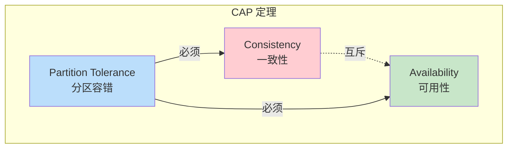
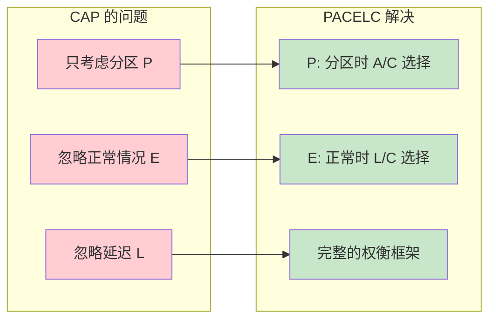
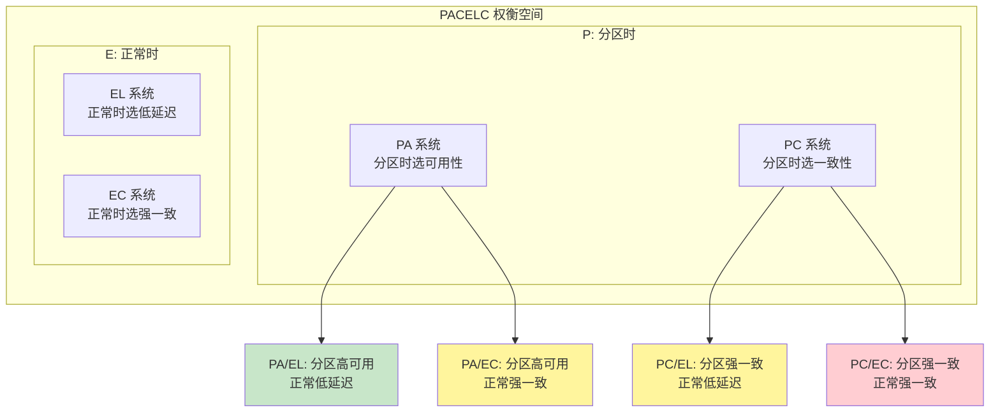
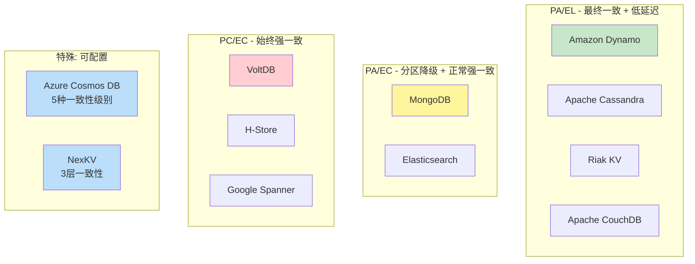
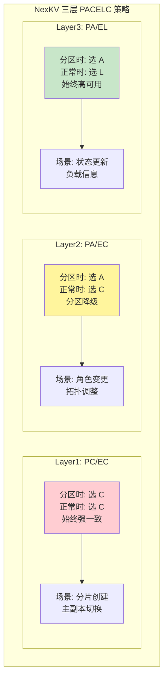
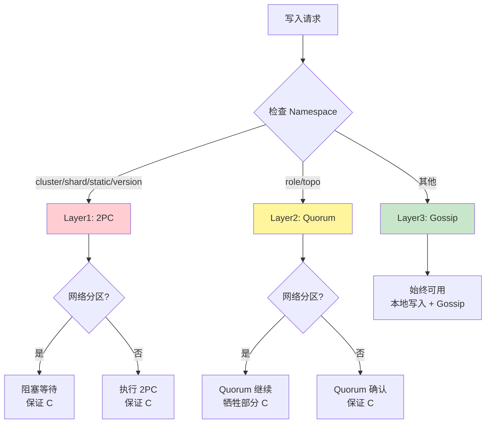
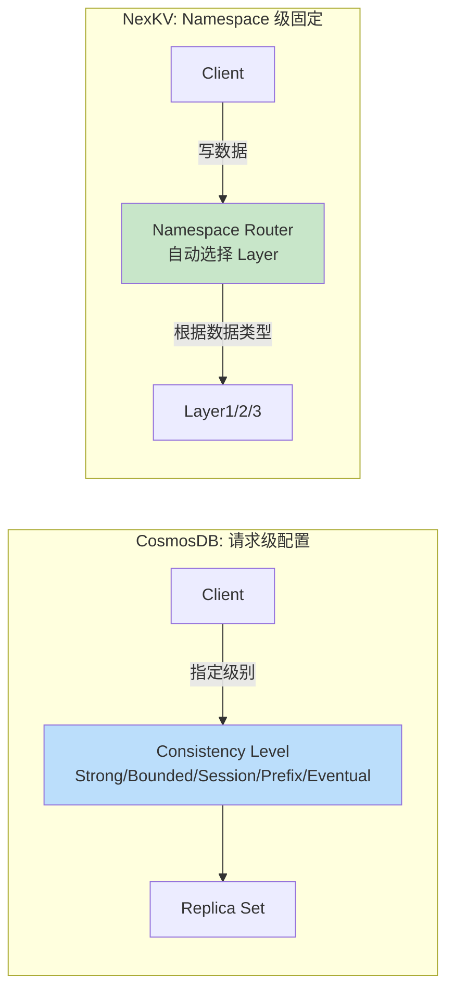
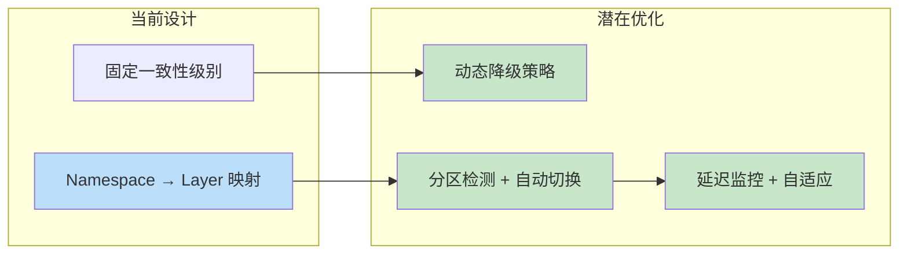

# 【预研报告】PACELC 定理深度研究

> **预研目标**：深入理解 PACELC 定理，为 NexKV 一致性选择提供理论框架

---

## 📋 预研信息

| 项目 | 内容 |
|------|------|
| **预研主题** | PACELC 定理：分布式数据库一致性权衡理论 |
| **预研日期** | 2026-02-14 |
| **预研负责人** | 🤖 核心开发 A |
| **论文来源** | "Consistency Tradeoffs in Modern Distributed Database System Design" - Daniel Abadi (2012) |
| **预研状态** | ✅ 已完成 |

---

## 1. CAP 定理的局限

### 1.1 CAP 定理回顾



**CAP 定理**：在分布式系统中，当发生网络分区（P）时，必须在一致性（C）和可用性（A）之间做出选择。

### 1.2 CAP 的局限性

| 局限性 | 说明 |
|--------|------|
| **只考虑分区情况** | 忽略了正常（非分区）情况下的权衡 |
| **二元选择** | 只能在 C 和 A 之间二选一，过于简化 |
| **忽略延迟** | 没有考虑延迟与一致性的关系 |
| **实际应用困难** | 大多数系统在正常情况下追求 CA，分区时才做选择 |



---

## 2. PACELC 定理详解

### 2.1 定理定义

```
PACELC 定理:

         ┌─────────────────────────────────────────────┐
         │                                             │
         │   P (Partition): 网络分区时                 │
         │       ├── 选择 A (Availability)            │
         │       └── 或选择 C (Consistency)           │
         │                                             │
         │   E (Else): 正常情况下                      │
         │       ├── 选择 L (Latency) - 低延迟        │
         │       └── 或选择 C (Consistency) - 强一致  │
         │                                             │
         └─────────────────────────────────────────────┘
```

### 2.2 完整的权衡空间



### 2.3 四种系统类型

| 类型 | 分区时 | 正常时 | 代表系统 | 特点 |
|------|--------|--------|---------|------|
| **PA/EL** | 选 A | 选 L | Dynamo, Cassandra | 最终一致，低延迟 |
| **PA/EC** | 选 A | 选 C | MongoDB (默认) | 分区时降级 |
| **PC/EL** | 选 C | 选 L | ❓ 理论上矛盾 | 强一致需要同步，延迟无法降低 |
| **PC/EC** | 选 C | 选 C | VoltDB, H-Store | 始终强一致 |

---

## 3. 主流数据库的 PACELC 分类

### 3.1 分类图谱



### 3.2 详细对比

| 系统 | P 时选择 | E 时选择 | 配置方式 | 适用场景 |
|------|---------|---------|---------|---------|
| **Cassandra** | A (Hinted Handoff) | L (可调一致性) | W/CL 配置 | 高写入，最终一致可接受 |
| **MongoDB** | A (自动降级) | C (默认强一致) | writeConcern | 通用场景，分区容忍 |
| **Spanner** | C (TrueTime) | C (同步复制) | 不可配置 | 金融场景，强一致必须 |
| **CosmosDB** | 可配置 | 可配置 | 5 种级别 | 多租户，SLA 驱动 |
| **NexKV** | 按层级 | 按层级 | Namespace 决定 | 元数据管理，分层需求 |

---

## 4. PACELC 在 NexKV 中的应用

### 4.1 NexKV 的 PACELC 映射



### 4.2 分层 PACELC 矩阵

| 层级 | P (分区时) | E (正常时) | 机制 | 数据类型 |
|------|-----------|-----------|------|---------|
| **Layer1** | C (阻塞) | C (2PC) | 2PC | 分片、集群配置 |
| **Layer2** | A (Quorum 继续) | C (Quorum 确认) | Quorum | 角色、拓扑 |
| **Layer3** | A (本地写入) | L (Gossip 异步) | Gossip | 状态、负载 |

### 4.3 决策流程



---

## 5. 理论证明

### 5.1 PACELC 的数学表达

```
定义:
- P: 网络分区事件
- A: 可用性（请求在有限时间内返回响应）
- C: 一致性（所有节点看到相同的数据）
- E: 正常情况（无分区）
- L: 延迟（请求响应时间）

PACELC 定理:

∀ 系统 S:
  如果 P 发生:
    S 选择 A ∨ S 选择 C
  否则 (E):
    S 选择 L ∨ S 选择 C

其中:
- 选择 A 意味着可能返回陈旧数据
- 选择 C 意味着可能阻塞或拒绝请求
- 选择 L 意味着可能返回陈旧数据
- 选择 C 意味着可能增加延迟
```

### 5.2 NexKV 的 PACELC 不变式

```
Layer1 不变式 (PC/EC):
  ∀ op ∈ Layer1:
    P(op) ⇒ BlockUntilRecovery(op)    // 分区时阻塞
    E(op) ⇒ StrongConsistency(op)      // 正常时强一致

Layer2 不变式 (PA/EC):
  ∀ op ∈ Layer2:
    P(op) ⇒ AvailableWithQuorum(op)    // 分区时 Quorum 继续
    E(op) ⇒ StrongConsistency(op)      // 正常时强一致

Layer3 不变式 (PA/EL):
  ∀ op ∈ Layer3:
    P(op) ⇒ AvailableLocally(op)       // 分区时本地可用
    E(op) ⇒ LowLatencyAsync(op)        // 正常时低延迟异步
```

---

## 6. 与 CosmosDB 的对比

### 6.1 静态 vs 动态选择

| 特性 | CosmosDB | NexKV |
|------|----------|-------|
| **选择方式** | 请求级别配置 | Namespace 级别固定 |
| **级别数量** | 5 种 | 3 种 |
| **动态调整** | ✅ 支持 | ❌ 不支持（设计简化） |
| **SLA 保证** | ✅ 99.999% | ❌ 无（内部系统） |
| **复杂度** | 高 | 中 |

### 6.2 架构差异



---

## 7. 实践建议

### 7.1 何时使用哪种策略

| 场景 | 推荐策略 | 理由 |
|------|---------|------|
| **金融交易** | PC/EC | 强一致不可妥协 |
| **社交动态** | PA/EL | 高可用 + 低延迟优先 |
| **配置管理** | PA/EC | 正常强一致，分区降级 |
| **监控指标** | PA/EL | 最终一致可接受 |
| **NexKV 元数据** | 混合 | 按数据重要性分层 |

### 7.2 NexKV 优化方向



---

## 8. 参考资料

### 8.1 原始论文

- **Daniel Abadi (2012)**: "Consistency Tradeoffs in Modern Distributed Database System Design"
  - [ACM Digital Library](https://dl.acm.org/doi/10.1109/MC.2012.33)
  - [PDF](https://www.cs.umd.edu/~abadi/papers/abadi-pacelc.pdf)

### 8.2 相关文章

- [PACELC Theorem - Wikipedia](https://en.wikipedia.org/wiki/PACELC_theorem)
- [PACELC Explained - DEV Community](https://dev.to/devcorner/pacelc-theorem-in-distributed-databases-pfe)
- [Daniel Abadi Interview - ScyllaDB](https://www.scylladb.com/2024/02/12/distributed-database-consistency-dr-daniel-abadi-kostja-osipov-chat/)

### 8.3 系统文档

- [Cassandra Consistency](https://cassandra.apache.org/doc/latest/cassandra/architecture/dynamo.html)
- [MongoDB Read/Write Concern](https://www.mongodb.com/docs/manual/reference/read-concern/)
- [CosmosDB Consistency Levels](https://learn.microsoft.com/en-us/azure/cosmos-db/consistency-levels)

---

## 9. 结论

### 9.1 核心要点

1. **PACELC 扩展了 CAP**：考虑了正常情况下的延迟/一致性权衡
2. **四种系统类型**：PA/EL、PA/EC、PC/EC（PC/EL 理论上矛盾）
3. **NexKV 采用混合策略**：不同层级使用不同的 PACELC 选择
4. **设计简化**：Namespace 级别固定，避免动态配置复杂性

### 9.2 对 NexKV 的启示

- ✅ 当前的三层设计符合 PACELC 理论
- ⚠️ 可以考虑添加分区检测和动态降级
- ⚠️ 可以考虑延迟监控和自适应一致性

---

**文档版本**: v1.0
**创建日期**: 2026-02-14
**最后更新**: 2026-02-14
**维护者**: 🤖 核心开发 A
**状态**: ✅ 已完成
