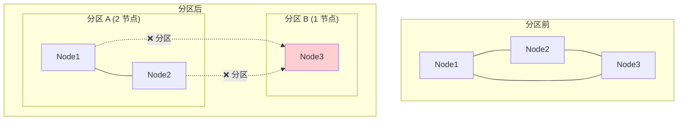

# 【预研报告】分区降级策略设计

> **预研目标**：设计 Layer2 Quorum 失败时的分区检测与降级策略

---

## 📋 预研信息

| 项目 | 内容 |
|------|------|
| **预研主题** | 分区检测与降级策略设计 |
| **预研日期** | 2026-02-14 |
| **预研负责人** | 🤖 核心开发 A |
| **关联文档** | `2026-02-14_consistency-implementation-review.md` |
| **预研状态** | ✅ 已完成 |

---

## 1. 问题分析

### 1.1 分区场景



### 1.2 Quorum 在分区时的行为

```
3 节点集群，Quorum = 2：

分区 A (Node1 + Node2):
- 可以达成 Quorum (2/3) ✅
- 可以正常写入

分区 B (Node3):
- 无法达成 Quorum (1/3) ❌
- 写入失败

问题：
1. 分区 B 的写入请求如何处理？
2. 分区恢复后如何同步数据？
```

### 1.3 PACELC 框架

| 场景 | 选择 | 说明 |
|------|------|------|
| **P**artition | A (Availability) | 分区时选择可用性 |
| **E**lse | C (Consistency) | 正常时选择一致性 |
| **L**atency vs **C**onsistency | C | 延迟 vs 一致性，选择一致性 |

**Layer2 (Quorum) 的 PACELC 策略：PA/EC**
- 分区时：选择可用性（降级到 Gossip）
- 正常时：选择一致性（Quorum 强制）

---

## 2. 分区检测设计

### 2.1 Phi Accrual 故障检测器

```go
// PhiAccrualDetector Phi Accrual 故障检测器
type PhiAccrualDetector struct {
    mu              sync.RWMutex
    nodeStates      map[string]*NodeState
    threshold       float64       // Phi 阈值（通常 8.0）
    minStdDeviation time.Duration // 最小标准差
    acceptablePause time.Duration // 可接受的暂停
}

// NodeState 节点状态
type NodeState struct {
    LastHeartbeat time.Time
    Intervals     []time.Duration // 心跳间隔历史
    Mean          time.Duration
    Variance      time.Duration
}

// NewPhiAccrualDetector 创建检测器
func NewPhiAccrualDetector(threshold float64) *PhiAccrualDetector {
    return &PhiAccrualDetector{
        nodeStates:      make(map[string]*NodeState),
        threshold:       threshold,
        minStdDeviation: 500 * time.Millisecond,
        acceptablePause: 10 * time.Second,
    }
}

// RecordHeartbeat 记录心跳
func (d *PhiAccrualDetector) RecordHeartbeat(nodeID string) {
    d.mu.Lock()
    defer d.mu.Unlock()

    now := time.Now()
    state, exists := d.nodeStates[nodeID]

    if !exists {
        d.nodeStates[nodeID] = &NodeState{
            LastHeartbeat: now,
            Intervals:     make([]time.Duration, 0, 1000),
        }
        return
    }

    // 计算间隔
    interval := now.Sub(state.LastHeartbeat)
    state.LastHeartbeat = now

    // 添加到历史
    state.Intervals = append(state.Intervals, interval)
    if len(state.Intervals) > 1000 {
        state.Intervals = state.Intervals[1:]
    }

    // 更新统计
    d.updateStatistics(state)
}

// updateStatistics 更新统计信息
func (d *PhiAccrualDetector) updateStatistics(state *NodeState) {
    if len(state.Intervals) < 2 {
        return
    }

    // 计算均值
    var sum time.Duration
    for _, interval := range state.Intervals {
        sum += interval
    }
    state.Mean = sum / time.Duration(len(state.Intervals))

    // 计算方差
    var sumSq time.Duration
    for _, interval := range state.Intervals {
        diff := interval - state.Mean
        sumSq += diff * diff
    }
    state.Variance = sumSq / time.Duration(len(state.Intervals))
}

// GetPhi 获取节点的 Phi 值
func (d *PhiAccrualDetector) GetPhi(nodeID string) float64 {
    d.mu.RLock()
    defer d.mu.RUnlock()

    state, exists := d.nodeStates[nodeID]
    if !exists {
        return 0 // 未知节点，不判定为故障
    }

    timeSinceLastHeartbeat := time.Since(state.LastHeartbeat)

    return d.calculatePhi(timeSinceLastHeartbeat, state)
}

// calculatePhi 计算 Phi 值
func (d *PhiAccrualDetector) calculatePhi(timeSinceLastHeartbeat time.Duration, state *NodeState) float64 {
    if len(state.Intervals) < 10 {
        // 样本不足，使用简单超时检测
        if timeSinceLastHeartbeat > d.acceptablePause {
            return d.threshold + 1
        }
        return 0
    }

    // 标准差
    stdDeviation := time.Duration(math.Sqrt(float64(state.Variance)))
    if stdDeviation < d.minStdDeviation {
        stdDeviation = d.minStdDeviation
    }

    // 正态分布概率计算
    // Phi = -log10(1 - F(t))
    // 其中 F(t) 是正态分布的累积分布函数

    diff := float64(timeSinceLastHeartbeat - state.Mean)
    stdDev := float64(stdDeviation)

    // 使用近似公式
    y := diff / stdDev
    phi := -math.Log10(1.0 - math.Erf(y/math.Sqrt2))

    return phi
}

// IsNodeSuspected 判断节点是否可疑
func (d *PhiAccrualDetector) IsNodeSuspected(nodeID string) bool {
    return d.GetPhi(nodeID) > d.threshold
}

// GetSuspectedNodes 获取所有可疑节点
func (d *PhiAccrualDetector) GetSuspectedNodes() []string {
    d.mu.RLock()
    defer d.mu.RUnlock()

    var suspected []string
    for nodeID := range d.nodeStates {
        if d.GetPhi(nodeID) > d.threshold {
            suspected = append(suspected, nodeID)
        }
    }
    return suspected
}
```

### 2.2 分区检测器

```go
// PartitionDetector 分区检测器
type PartitionDetector struct {
    mu               sync.RWMutex
    phiDetector      *PhiAccrualDetector
    allNodes         []string
    localNodeID      string
    quorumSize       int

    // 状态
    isPartitioned    bool
    partitionSide    string      // 当前分区 ID
    reachableNodes   []string    // 可达节点
    suspectedNodes   []string    // 可疑节点
}

// NewPartitionDetector 创建分区检测器
func NewPartitionDetector(localNodeID string, allNodes []string, quorumSize int) *PartitionDetector {
    return &PartitionDetector{
        phiDetector:    NewPhiAccrualDetector(8.0),
        allNodes:       allNodes,
        localNodeID:    localNodeID,
        quorumSize:     quorumSize,
        isPartitioned:  false,
        reachableNodes: allNodes,
    }
}

// RecordHeartbeat 记录心跳
func (d *PartitionDetector) RecordHeartbeat(nodeID string) {
    d.phiDetector.RecordHeartbeat(nodeID)
}

// CheckPartition 检查是否发生分区
func (d *PartitionDetector) CheckPartition() PartitionStatus {
    d.mu.Lock()
    defer d.mu.Unlock()

    // 获取可疑节点
    suspected := d.phiDetector.GetSuspectedNodes()
    d.suspectedNodes = suspected

    // 计算可达节点
    var reachable []string
    for _, node := range d.allNodes {
        if !contains(suspected, node) {
            reachable = append(reachable, node)
        }
    }
    d.reachableNodes = reachable

    // 判断是否发生分区
    // 如果可达节点数 < Quorum，则认为发生分区
    canReachQuorum := len(reachable) >= d.quorumSize

    if !canReachQuorum {
        if !d.isPartitioned {
            // 新进入分区状态
            d.isPartitioned = true
            d.partitionSide = d.generatePartitionID()
            log.Warn("Partition detected",
                "local_node", d.localNodeID,
                "reachable", reachable,
                "suspected", suspected)
        }
    } else {
        if d.isPartitioned {
            // 分区恢复
            log.Info("Partition recovered",
                "local_node", d.localNodeID,
                "reachable", reachable)
        }
        d.isPartitioned = false
        d.partitionSide = ""
    }

    return PartitionStatus{
        IsPartitioned:  d.isPartitioned,
        PartitionSide:  d.partitionSide,
        ReachableNodes: d.reachableNodes,
        SuspectedNodes: d.suspectedNodes,
        CanReachQuorum: canReachQuorum,
    }
}

// generatePartitionID 生成分区 ID
func (d *PartitionDetector) generatePartitionID() string {
    // 基于可达节点生成分区 ID
    sort.Strings(d.reachableNodes)
    return fmt.Sprintf("partition-%x", md5.Sum([]byte(strings.Join(d.reachableNodes, ","))))
}

// PartitionStatus 分区状态
type PartitionStatus struct {
    IsPartitioned  bool
    PartitionSide  string
    ReachableNodes []string
    SuspectedNodes []string
    CanReachQuorum bool
}
```

---

## 3. 降级策略设计

### 3.1 一致性级别降级

```
正常状态：
  Layer2 → Quorum (多数派确认)

分区状态：
  Layer2 → Gossip (最终一致，降级)
```

### 3.2 降级执行器

```go
// DegradationManager 降级管理器
type DegradationManager struct {
    mu               sync.RWMutex
    partitionDetector *PartitionDetector
    quorumCoordinator *QuorumCoordinator
    gossipManager    *TreeAwareGossip

    // 降级日志
    demotionLog      *DemotionLog

    // 状态
    isDegraded       bool
    degradedSince    time.Time
}

// DemotionEntry 降级记录
type DemotionEntry struct {
    ID          string
    Key         string
    Value       []byte
    Timestamp   HLCimestamp
    PartitionID string
    WrittenAt   time.Time
    SyncedAt    *time.Time // 分区恢复后同步完成的时间
}

// NewDegradationManager 创建降级管理器
func NewDegradationManager(
    partitionDetector *PartitionDetector,
    quorumCoordinator *QuorumCoordinator,
    gossipManager *TreeAwareGossip,
    logStore kvstore.MetadataKV,
) *DegradationManager {
    return &DegradationManager{
        partitionDetector: partitionDetector,
        quorumCoordinator: quorumCoordinator,
        gossipManager:     gossipManager,
        demotionLog:       NewDemotionLog(logStore),
    }
}

// Write 带降级的写入
func (m *DegradationManager) Write(ctx context.Context, key string, value []byte) error {
    // 检查分区状态
    status := m.partitionDetector.CheckPartition()

    if !status.IsPartitioned && status.CanReachQuorum {
        // 正常状态：使用 Quorum
        return m.writeWithQuorum(ctx, key, value)
    }

    // 分区状态：降级到 Gossip
    return m.writeWithDegradation(ctx, key, value, status)
}

// writeWithQuorum 使用 Quorum 写入
func (m *DegradationManager) writeWithQuorum(ctx context.Context, key string, value []byte) error {
    err := m.quorumCoordinator.Write(ctx, key, value)
    if err != nil {
        // Quorum 失败，检查是否需要降级
        status := m.partitionDetector.CheckPartition()
        if status.IsPartitioned {
            return m.writeWithDegradation(ctx, key, value, status)
        }
        return err
    }
    return nil
}

// writeWithDegradation 使用降级模式写入
func (m *DegradationManager) writeWithDegradation(ctx context.Context, key string, value []byte, status PartitionStatus) error {
    m.mu.Lock()
    defer m.mu.Unlock()

    // 更新状态
    if !m.isDegraded {
        m.isDegraded = true
        m.degradedSince = time.Now()
        log.Warn("Entering degraded mode",
            "partition_id", status.PartitionSide,
            "reachable", status.ReachableNodes)
    }

    // 生成本地时间戳
    ts := m.gossipManager.hlc.Now()

    // 1. 本地写入
    if err := m.gossipManager.localStore.PutWithTimestamp(key, value, ts); err != nil {
        return err
    }

    // 2. 记录到降级日志
    entry := DemotionEntry{
        ID:          uuid.New().String(),
        Key:         key,
        Value:       value,
        Timestamp:   ts,
        PartitionID: status.PartitionSide,
        WrittenAt:   time.Now(),
    }
    if err := m.demotionLog.Append(entry); err != nil {
        log.Error("Failed to append to demotion log", "error", err)
    }

    // 3. 在分区内传播（利用树感知 Gossip）
    m.gossipManager.Broadcast(key, value)

    log.Info("Write in degraded mode",
        "key", key,
        "partition_id", status.PartitionSide)

    return nil
}

// Read 带降级的读取
func (m *DegradationManager) Read(ctx context.Context, key string) ([]byte, error) {
    status := m.partitionDetector.CheckPartition()

    if !status.IsPartitioned && status.CanReachQuorum {
        // 正常状态：从 Quorum 读取
        return m.quorumCoordinator.Read(ctx, key)
    }

    // 分区状态：本地读取
    return m.gossipManager.localStore.Get(key)
}
```

### 3.3 降级日志

```go
// DemotionLog 降级日志
type DemotionLog struct {
    mu    sync.RWMutex
    store kvstore.MetadataKV
    entries []DemotionEntry
}

// NewDemotionLog 创建降级日志
func NewDemotionLog(store kvstore.MetadataKV) *DemotionLog {
    return &DemotionLog{
        store:   store,
        entries: make([]DemotionEntry, 0),
    }
}

// Append 添加记录
func (l *DemotionLog) Append(entry DemotionEntry) error {
    l.mu.Lock()
    defer l.mu.Unlock()

    // 内存记录
    l.entries = append(l.entries, entry)

    // 持久化
    data, err := json.Marshal(entry)
    if err != nil {
        return err
    }

    return l.store.Put(kvstore.NamespaceSaga, fmt.Sprintf("demotion:%s", entry.ID), data)
}

// GetUnsynced 获取未同步的记录
func (l *DemotionLog) GetUnsynced() []DemotionEntry {
    l.mu.RLock()
    defer l.mu.RUnlock()

    var unsynced []DemotionEntry
    for _, entry := range l.entries {
        if entry.SyncedAt == nil {
            unsynced = append(unsynced, entry)
        }
    }
    return unsynced
}

// MarkSynced 标记为已同步
func (l *DemotionLog) MarkSynced(entryID string) error {
    l.mu.Lock()
    defer l.mu.Unlock()

    now := time.Now()
    for i := range l.entries {
        if l.entries[i].ID == entryID {
            l.entries[i].SyncedAt = &now

            // 更新持久化
            data, _ := json.Marshal(l.entries[i])
            l.store.Put(kvstore.NamespaceSaga, fmt.Sprintf("demotion:%s", entryID), data)
            break
        }
    }

    return nil
}

// ClearSynced 清理已同步的记录
func (l *DemotionLog) ClearSynced() {
    l.mu.Lock()
    defer l.mu.Unlock()

    var remaining []DemotionEntry
    for _, entry := range l.entries {
        if entry.SyncedAt == nil {
            remaining = append(remaining, entry)
        }
    }
    l.entries = remaining
}
```

---

## 4. 分区恢复与同步

### 4.1 恢复检测

```go
// RecoveryManager 恢复管理器
type RecoveryManager struct {
    partitionDetector *PartitionDetector
    degradationManager *DegradationManager
    quorumCoordinator *QuorumCoordinator
    syncCoordinator   *SyncCoordinator
}

// CheckAndRecover 检查并执行恢复
func (m *RecoveryManager) CheckAndRecover(ctx context.Context) error {
    status := m.partitionDetector.CheckPartition()

    if status.IsPartitioned {
        // 仍在分区中
        return nil
    }

    // 分区已恢复
    if m.degradationManager.IsDegraded() {
        log.Info("Partition recovered, starting sync")
        return m.syncAfterRecovery(ctx)
    }

    return nil
}

// syncAfterRecovery 分区恢复后同步
func (m *RecoveryManager) syncAfterRecovery(ctx context.Context) error {
    // 1. 获取降级期间写入的记录
    unsynced := m.degradationManager.demotionLog.GetUnsynced()

    if len(unsynced) == 0 {
        m.degradationManager.SetNormal()
        return nil
    }

    log.Info("Syncing degraded writes", "count", len(unsynced))

    // 2. 向 Quorum 同步每条记录
    for _, entry := range unsynced {
        // 尝试使用 Quorum 写入
        err := m.quorumCoordinator.WriteWithTimestamp(ctx, entry.Key, entry.Value, entry.Timestamp)
        if err != nil {
            log.Error("Failed to sync entry",
                "entry_id", entry.ID,
                "key", entry.Key,
                "error", err)

            // 冲突解决：如果远程有更新的值，使用远程值
            remoteValue, remoteTS, remoteErr := m.quorumCoordinator.ReadWithTimestamp(ctx, entry.Key)
            if remoteErr == nil && remoteTS.After(entry.Timestamp) {
                // 远程更新，放弃本地写入
                log.Info("Remote value is newer, discarding local write",
                    "key", entry.Key,
                    "local_ts", entry.Timestamp,
                    "remote_ts", remoteTS)
            }
            // 否则重试
            continue
        }

        // 标记为已同步
        m.degradationManager.demotionLog.MarkSynced(entry.ID)
    }

    // 3. 清理已同步的记录
    m.degradationManager.demotionLog.ClearSynced()

    // 4. 恢复正常模式
    m.degradationManager.SetNormal()

    log.Info("Recovery sync completed")
    return nil
}
```

### 4.2 冲突解决

```go
// ConflictResolver 冲突解决器
type ConflictResolver struct {
    hlc *HybridLogicalClock
}

// Resolve 解决冲突
func (r *ConflictResolver) Resolve(local, remote VersionedValue) VersionedValue {
    // 使用 HLC 时间戳决定胜者
    if local.Version.After(remote.Version) {
        return local
    }
    if remote.Version.After(local.Version) {
        return remote
    }

    // 时间戳相同，使用 NodeID 作为 tie-breaker
    if local.Version.NodeID > remote.Version.NodeID {
        return local
    }
    return remote
}

// Merge 合并（用于需要保留双方数据的场景）
func (r *ConflictResolver) Merge(local, remote VersionedValue) VersionedValue {
    // 对于需要保留历史的场景，可以创建新的版本
    return VersionedValue{
        Value:   remote.Value, // 使用远程值
        Version: r.hlc.Now(),  // 新时间戳
    }
}
```

---

## 5. 树感知 Gossip 优化

### 5.1 分区感知的树传播

```go
// PartitionAwareTreeGossip 分区感知的树 Gossip
type PartitionAwareTreeGossip struct {
    *TreeAwareGossip
    partitionDetector *PartitionDetector
}

// Broadcast 分区感知的广播
func (g *PartitionAwareTreeGossip) Broadcast(key string, value []byte) {
    status := g.partitionDetector.CheckPartition()

    event := GossipEvent{
        Key:       key,
        Value:     value,
        Timestamp: g.hlc.Now(),
        Source:    g.localID,
        PartitionID: status.PartitionSide, // 携带分区 ID
    }

    node := g.topology.GetNode(g.localID)

    // 只向可达节点传播
    if node.ParentID != "" && contains(status.ReachableNodes, node.ParentID) {
        g.sendToParent(event)
    }

    for _, childID := range node.Children {
        if contains(status.ReachableNodes, childID) {
            g.send(event, childID)
        }
    }
}

// Receive 接收事件（带分区检测）
func (g *PartitionAwareTreeGossip) Receive(event GossipEvent) error {
    // 检查是否来自不同分区
    status := g.partitionDetector.CheckPartition()
    if event.PartitionID != "" && event.PartitionID != status.PartitionSide {
        // 来自不同分区的事件，可能需要延迟处理
        log.Warn("Received event from different partition",
            "local_partition", status.PartitionSide,
            "remote_partition", event.PartitionID)
    }

    // 更新 HLC
    g.hlc.Update(event.Timestamp)

    // 继续正常处理...
    return g.TreeAwareGossip.Receive(event)
}
```

---

## 6. Porcupine 验证

### 6.1 降级模型

```go
// DegradationModel 降级的 Porcupine 验证模型
func DegradationModel() porcupine.Model {
    return porcupine.Model{
        Init: func() interface{} {
            return &DegradationState{
                Store:           make(map[string]VersionedValue),
                IsPartitioned:   false,
                PartitionSide:   "",
                DemotionLog:     make([]DemotionEntry, 0),
            }
        },
        Step: func(state, input, output interface{}) (bool, interface{}) {
            st := state.(*DegradationState)
            op := input.(DegradationOperation)

            switch op.Type {
            case "partition_start":
                // 分区开始
                newSt := st.Clone()
                newSt.IsPartitioned = true
                newSt.PartitionSide = op.PartitionID
                return output == "ok", newSt

            case "partition_end":
                // 分区结束
                newSt := st.Clone()
                newSt.IsPartitioned = false
                newSt.PartitionSide = ""
                // 清理降级日志
                newSt.DemotionLog = nil
                return output == "ok", newSt

            case "write_normal":
                // 正常写入（Quorum）
                if st.IsPartitioned {
                    return false, st // 分区时不能正常写入
                }
                newSt := st.Clone()
                newSt.Store[op.Key] = VersionedValue{
                    Value:   op.Value,
                    Version: op.Timestamp,
                }
                return output == "ok", newSt

            case "write_degraded":
                // 降级写入（Gossip）
                if !st.IsPartitioned {
                    return false, st // 非分区时不应降级
                }
                newSt := st.Clone()
                newSt.Store[op.Key] = VersionedValue{
                    Value:   op.Value,
                    Version: op.Timestamp,
                }
                newSt.DemotionLog = append(newSt.DemotionLog, DemotionEntry{
                    Key:       op.Key,
                    Value:     op.Value,
                    Timestamp: op.Timestamp,
                })
                return output == "ok", newSt

            case "sync_after_recovery":
                // 分区恢复后同步
                if st.IsPartitioned {
                    return false, st // 分区未结束
                }
                // 同步成功，日志清空
                newSt := st.Clone()
                newSt.DemotionLog = nil
                return output == "ok", newSt

            case "read":
                val, exists := st.Store[op.Key]
                if !exists {
                    return output == nil, st
                }
                return bytes.Equal(output.([]byte), val.Value), st
            }

            return false, st
        },
    }
}

// DegradationState 降级状态
type DegradationState struct {
    Store         map[string]VersionedValue
    IsPartitioned bool
    PartitionSide string
    DemotionLog   []DemotionEntry
}

func (s *DegradationState) Clone() *DegradationState {
    newStore := make(map[string]VersionedValue)
    for k, v := range s.Store {
        newStore[k] = v
    }
    return &DegradationState{
        Store:         newStore,
        IsPartitioned: s.IsPartitioned,
        PartitionSide: s.PartitionSide,
        DemotionLog:   append([]DemotionEntry{}, s.DemotionLog...),
    }
}

type DegradationOperation struct {
    Type        string
    Key         string
    Value       []byte
    Timestamp   HLCimestamp
    PartitionID string
}
```

### 6.2 验证场景

```go
// TestDegradation_PartitionAndRecovery 测试分区与恢复
func TestDegradation_PartitionAndRecovery(t *testing.T) {
    model := DegradationModel()
    recorder := NewDegradationRecorder()

    // 场景：分区 → 降级写入 → 恢复 → 同步

    // 1. 正常写入
    recorder.Record("client", "write_normal", DegradationOperation{
        Type:      "write_normal",
        Key:       "k1",
        Value:     []byte("v1"),
        Timestamp: HLCimestamp{PhysicalTime: 100, LogicalTime: 0},
    }, "ok")

    // 2. 分区开始
    recorder.Record("system", "partition_start", DegradationOperation{
        Type:        "partition_start",
        PartitionID: "partition-A",
    }, "ok")

    // 3. 降级写入
    recorder.Record("client", "write_degraded", DegradationOperation{
        Type:      "write_degraded",
        Key:       "k2",
        Value:     []byte("v2"),
        Timestamp: HLCimestamp{PhysicalTime: 101, LogicalTime: 0},
    }, "ok")

    // 4. 分区结束
    recorder.Record("system", "partition_end", DegradationOperation{
        Type: "partition_end",
    }, "ok")

    // 5. 同步
    recorder.Record("system", "sync_after_recovery", DegradationOperation{
        Type: "sync_after_recovery",
    }, "ok")

    // 验证
    result, _ := porcupine.CheckOperations(model, recorder.GetHistory(), time.Minute)
    assert.Equal(t, porcupine.Ok, result)
}

// TestDegradation_ConsistencyDuringPartition 测试分区期间的一致性
func TestDegradation_ConsistencyDuringPartition(t *testing.T) {
    model := DegradationModel()
    recorder := NewDegradationRecorder()

    // 场景：分区期间写入，读取应该能读到

    // 1. 分区开始
    recorder.Record("system", "partition_start", DegradationOperation{
        Type:        "partition_start",
        PartitionID: "partition-A",
    }, "ok")

    // 2. 降级写入
    recorder.Record("client", "write_degraded", DegradationOperation{
        Type:      "write_degraded",
        Key:       "k1",
        Value:     []byte("v1"),
        Timestamp: HLCimestamp{PhysicalTime: 100, LogicalTime: 0},
    }, "ok")

    // 3. 读取应该返回 v1
    recorder.Record("client", "read", DegradationOperation{
        Type: "read",
        Key:  "k1",
    }, []byte("v1"))

    // 验证
    result, _ := porcupine.CheckOperations(model, recorder.GetHistory(), time.Minute)
    assert.Equal(t, porcupine.Ok, result)
}
```

---

## 7. 总结

### 7.1 设计要点

| 机制 | 作用 | 实现 |
|------|------|------|
| **Phi Accrual 检测** | 精准故障检测 | 概率模型 |
| **分区检测** | 判断是否分区 | Quorum 可达性 |
| **降级策略** | 分区时保持可用性 | Gossip 模式 |
| **降级日志** | 记录降级写入 | KV 持久化 |
| **恢复同步** | 分区后数据一致 | Quorum 重放 |
| **树感知传播** | 优化 Gossip 效率 | 拓扑感知 |

### 7.2 PACELC 映射

```
┌─────────────────────────────────────────────────────────┐
│              Layer2 (Quorum) PACELC 策略                 │
├─────────────────────────────────────────────────────────┤
│  正常状态 (Else)                                         │
│  - 一致性: Quorum (多数派确认)                           │
│  - 延迟: 中等 (等待 majority 响应)                       │
├─────────────────────────────────────────────────────────┤
│  分区状态 (Partition)                                    │
│  - 可用性: Gossip (最终一致)                             │
│  - 降级: 记录日志，恢复后同步                            │
└─────────────────────────────────────────────────────────┘
```

### 7.3 Porcupine 验证覆盖

| 场景 | 验证点 |
|------|--------|
| 分区检测 | 状态转换正确 |
| 降级写入 | 可用性保证 |
| 分区恢复 | 数据同步完整性 |
| 冲突解决 | LWW 语义正确 |

---

**文档版本**: v1.0
**创建日期**: 2026-02-14
**最后更新**: 2026-02-14
**维护者**: 🤖 核心开发 A
**状态**: ✅ 已完成
