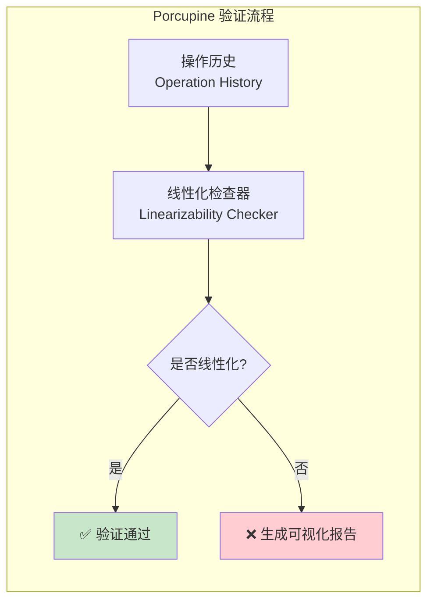
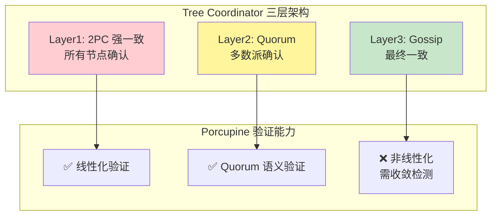
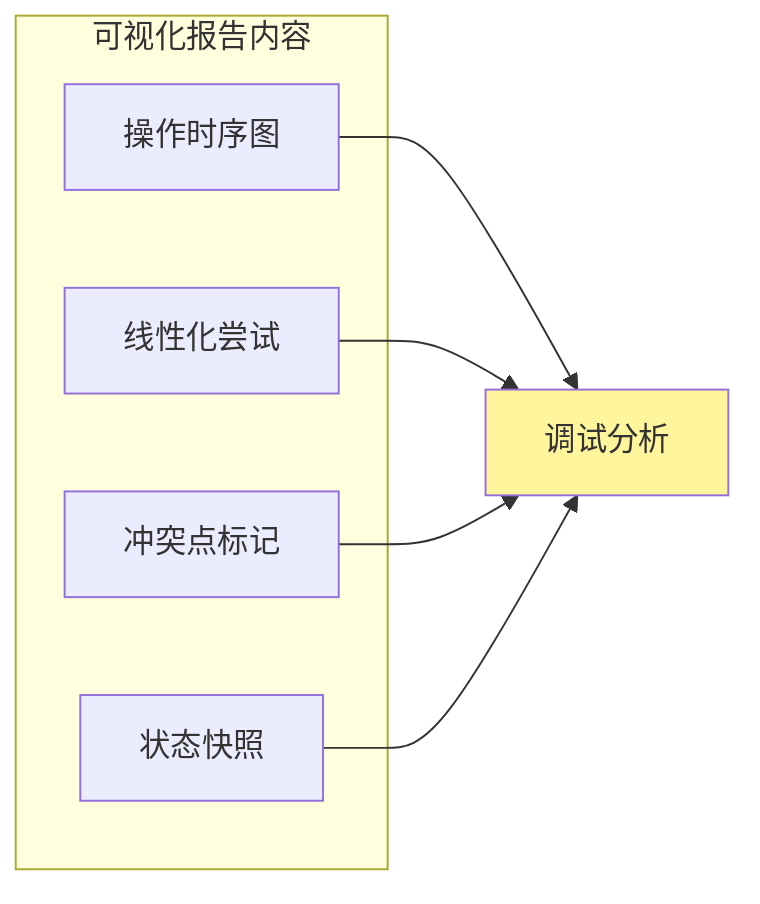

# 【预研报告】Porcupine 运行时验证 Tree Coordinator 一致性层级

> **预研目标**：详细说明如何将 Porcupine 线性化验证框架应用到 Tree Coordinator 的三层一致性模型

---

## 📋 预研信息

| 项目 | 内容 |
|------|------|
| **预研主题** | Porcupine 运行时验证 Tree Coordinator 一致性层级 |
| **预研日期** | 2026-02-14 |
| **预研负责人** | 🤖 核心开发 A |
| **关联文档** | [验证框架设计](./2026-02-14_tree-coordinator-verification-framework.md) |
| **预研状态** | ✅ 已完成 |

---

## 1. Porcupine 基础

### 1.1 什么是 Porcupine

**Porcupine** 是一个用于验证分布式系统线性一致性的 Go 库，由 Anish Athalye 开发。



### 1.2 核心概念

| 概念 | 说明 |
|------|------|
| **Operation** | 单个操作，包含 ClientID, Input, Output, Call, Return |
| **Model** | 系统的状态机模型，定义状态转移 |
| **History** | 操作的时序记录 |
| **Linearizability** | 每个操作看起来在某个时间点原子执行 |

### 1.3 操作模型

```go
// Operation Porcupine 操作定义
type Operation struct {
    ClientId  int         // 客户端 ID
    Input     interface{} // 输入参数
    Output    interface{} // 输出结果
    Call      int64       // 调用时间戳（纳秒）
    Return    int64       // 返回时间戳（纳秒）
}

// Model Porcupine 模型定义
type Model struct {
    Name       string
    Partition  func(input, output interface{}) interface{}
    InitState  func() interface{}
    Step       func(state, input, output interface{}) (bool, interface{})
    Equal      func(state1, state2 interface{}) bool
    DescribeOperation func(input, output interface{}) string
    DescribeState func(state interface{}) string
}
```

---

## 2. Tree Coordinator 三层模型

### 2.1 三层一致性回顾



### 2.2 每层的验证策略

| 层级 | 一致性模型 | Porcupine 验证 | 验证方法 |
|------|-----------|---------------|---------|
| **Layer1** | 线性一致 | ✅ 直接验证 | 标准线性化模型 |
| **Layer2** | Quorum 一致 | ✅ 条件验证 | Quorum 语义模型 |
| **Layer3** | 最终一致 | ❌ 不适用 | 收敛性检测（非 Porcupine） |

---

## 3. Layer1 Porcupine 验证

### 3.1 模型定义

```go
// layer1_model.go
package verification

import (
    "github.com/anishathalye/porcupine"
)

// Layer1Op Layer1 操作
type Layer1Op struct {
    OpType string      // "put" | "get"
    Key    string      // 键
    Value  interface{} // 值
}

// Layer1Model Layer1 线性化模型
var Layer1Model = porcupine.Model{
    Name: "TreeCoordinator-Layer1-2PC",

    // 分区函数：按 key 分区，不同 key 独立验证
    Partition: func(input, output interface{}) interface{} {
        op := input.(Layer1Op)
        return op.Key
    },

    // 初始状态：空 KV 存储
    InitState: func() interface{} {
        return make(map[string]interface{})
    },

    // 状态转移函数
    Step: func(state, input, output interface{}) (bool, interface{}) {
        st := state.(map[string]interface{})
        op := input.(Layer1Op)

        switch op.OpType {
        case "put":
            // Put 总是成功（2PC 保证）
            newSt := copyMap(st)
            newSt[op.Key] = op.Value
            // 验证 output 是 "ok"
            return output == "ok", newSt

        case "get":
            // Get 返回当前值
            val, exists := st[op.Key]
            if !exists {
                return output == nil, st
            }
            return output == val, st
        }

        return false, st
    },

    // 状态相等判断
    Equal: func(state1, state2 interface{}) bool {
        s1 := state1.(map[string]interface{})
        s2 := state2.(map[string]interface{})
        if len(s1) != len(s2) {
            return false
        }
        for k, v := range s1 {
            if s2[k] != v {
                return false
            }
        }
        return true
    },

    // 操作描述
    DescribeOperation: func(input, output interface{}) string {
        op := input.(Layer1Op)
        switch op.OpType {
        case "put":
            return fmt.Sprintf("Put(%s, %v) -> %v", op.Key, op.Value, output)
        case "get":
            return fmt.Sprintf("Get(%s) -> %v", op.Key, output)
        }
        return "?"
    },

    // 状态描述
    DescribeState: func(state interface{}) string {
        return fmt.Sprintf("%v", state)
    },
}
```

### 3.2 历史记录器

```go
// layer1_recorder.go
package verification

import (
    "sync"
    "time"

    "github.com/anishathalye/porcupine"
)

// Layer1Recorder Layer1 操作记录器
type Layer1Recorder struct {
    mu       sync.Mutex
    history  []porcupine.Operation
    clientId int
}

// NewLayer1Recorder 创建记录器
func NewLayer1Recorder() *Layer1Recorder {
    return &Layer1Recorder{
        history:  make([]porcupine.Operation, 0),
        clientId: 0,
    }
}

// RecordPut 记录 Put 操作
func (r *Layer1Recorder) RecordPut(key string, value interface{},
    putFunc func() error) error {

    clientId := r.getNextClientId()
    call := time.Now().UnixNano()

    err := putFunc()

    ret := time.Now().UnixNano()
    output := "ok"
    if err != nil {
        output = err.Error()
    }

    r.mu.Lock()
    r.history = append(r.history, porcupine.Operation{
        ClientId: clientId,
        Input:    Layer1Op{OpType: "put", Key: key, Value: value},
        Output:   output,
        Call:     call,
        Return:   ret,
    })
    r.mu.Unlock()

    return err
}

// RecordGet 记录 Get 操作
func (r *Layer1Recorder) RecordGet(key string,
    getFunc func() (interface{}, error)) (interface{}, error) {

    clientId := r.getNextClientId()
    call := time.Now().UnixNano()

    val, err := getFunc()

    ret := time.Now().UnixNano()

    r.mu.Lock()
    r.history = append(r.history, porcupine.Operation{
        ClientId: clientId,
        Input:    Layer1Op{OpType: "get", Key: key},
        Output:   val,
        Call:     call,
        Return:   ret,
    })
    r.mu.Unlock()

    return val, err
}

// GetHistory 获取操作历史
func (r *Layer1Recorder) GetHistory() []porcupine.Operation {
    r.mu.Lock()
    defer r.mu.Unlock()
    return r.history
}

func (r *Layer1Recorder) getNextClientId() int {
    r.mu.Lock()
    defer r.mu.Unlock()
    r.clientId++
    return r.clientId
}
```

### 3.3 验证器

```go
// layer1_verifier.go
package verification

import (
    "fmt"
    "os"
    "time"

    "github.com/anishathalye/porcupine"
)

// Layer1Verifier Layer1 验证器
type Layer1Verifier struct {
    model   porcupine.Model
    timeout time.Duration
}

// NewLayer1Verifier 创建验证器
func NewLayer1Verifier() *Layer1Verifier {
    return &Layer1Verifier{
        model:   Layer1Model,
        timeout: 30 * time.Second,
    }
}

// Verify 验证操作历史
func (v *Layer1Verifier) Verify(history []porcupine.Operation) *VerificationResult {
    result := porcupine.CheckOperations(v.model, history, v.timeout)

    return &VerificationResult{
        Ok:         result.Ok,
        Err:        result.Err,
        History:    history,
        Model:      v.model,
    }
}

// VerificationResult 验证结果
type VerificationResult struct {
    Ok      bool
    Err     error
    History []porcupine.Operation
    Model   porcupine.Model
}

// GenerateVisualization 生成可视化报告
func (r *VerificationResult) GenerateVisualization(path string) error {
    if r.Ok {
        return nil // 无需生成
    }
    return porcupine.Visualize(r.Model, r.History, path)
}

// String 返回结果描述
func (r *VerificationResult) String() string {
    if r.Ok {
        return "✅ Layer1 linearizability verification passed"
    }
    return fmt.Sprintf("❌ Layer1 linearizability violation: %v", r.Err)
}
```

### 3.4 完整测试示例

```go
// layer1_porcupine_test.go
package verification

import (
    "context"
    "fmt"
    "sync"
    "testing"
    "time"

    "github.com/jzhang405/NexKV/internal/metadata/consistency"
)

// TestLayer1Linearizability 单线程线性化验证
func TestLayer1Linearizability(t *testing.T) {
    // 创建 Tree Coordinator
    coordinator := setupTestCoordinator(t)
    defer coordinator.Close()

    // 创建记录器
    recorder := NewLayer1Recorder()
    ctx := context.Background()

    // 顺序执行操作
    for i := 0; i < 10; i++ {
        key := fmt.Sprintf("key%d", i)
        value := fmt.Sprintf("value%d", i)

        // Put
        _ = recorder.RecordPut(key, value, func() error {
            return coordinator.PutWithLayer(ctx, "cluster", key, value, consistency.Layer1)
        })

        // Get
        _, _ = recorder.RecordGet(key, func() (interface{}, error) {
            return coordinator.Get(ctx, "cluster", key)
        })
    }

    // 验证
    verifier := NewLayer1Verifier()
    result := verifier.Verify(recorder.GetHistory())

    if !result.Ok {
        t.Errorf("Layer1 verification failed: %v", result.Err)
        // 生成可视化
        _ = result.GenerateVisualization("/tmp/layer1-violation.html")
    }
}

// TestLayer1ConcurrentLinearizability 并发线性化验证
func TestLayer1ConcurrentLinearizability(t *testing.T) {
    coordinator := setupTestCoordinator(t)
    defer coordinator.Close()

    recorder := NewLayer1Recorder()
    ctx := context.Background()

    var wg sync.WaitGroup
    numOps := 100

    // 并发执行
    for i := 0; i < numOps; i++ {
        wg.Add(1)
        go func(idx int) {
            defer wg.Done()

            key := fmt.Sprintf("key%d", idx%10)

            if idx%2 == 0 {
                // Put
                _ = recorder.RecordPut(key, idx, func() error {
                    return coordinator.PutWithLayer(ctx, "cluster", key, idx, consistency.Layer1)
                })
            } else {
                // Get
                _, _ = recorder.RecordGet(key, func() (interface{}, error) {
                    return coordinator.Get(ctx, "cluster", key)
                })
            }
        }(i)
    }
    wg.Wait()

    // 验证
    verifier := NewLayer1Verifier()
    result := verifier.Verify(recorder.GetHistory())

    if !result.Ok {
        t.Errorf("Layer1 concurrent verification failed: %v", result.Err)
        _ = result.GenerateVisualization("/tmp/layer1-concurrent-violation.html")
    }
}
```

---

## 4. Layer2 Porcupine 验证

### 4.1 Quorum 语义模型

```go
// layer2_model.go
package verification

import (
    "github.com/anishathalye/porcupine"
)

// QuorumState Quorum 状态
type QuorumState struct {
    Values   map[string]interface{} // key -> value
    Versions map[string]uint64      // key -> version
}

// Layer2Model Layer2 Quorum 模型
var Layer2Model = porcupine.Model{
    Name: "TreeCoordinator-Layer2-Quorum",

    Partition: func(input, output interface{}) interface{} {
        op := input.(Layer1Op)
        return op.Key
    },

    InitState: func() interface{} {
        return &QuorumState{
            Values:   make(map[string]interface{}),
            Versions: make(map[string]uint64),
        }
    },

    Step: func(state, input, output interface{}) (bool, interface{}) {
        st := state.(*QuorumState)
        op := input.(Layer1Op)

        switch op.OpType {
        case "put":
            // Quorum 写入：更新版本号
            newSt := &QuorumState{
                Values:   copyMap(st.Values),
                Versions: copyVersionMap(st.Versions),
            }
            newSt.Values[op.Key] = op.Value
            newSt.Versions[op.Key]++

            // 验证写入成功
            return output == "ok", newSt

        case "get":
            // Quorum 读取：返回已提交的值
            val, exists := st.Values[op.Key]
            if !exists {
                return output == nil, st
            }
            // 允许读到稍旧的值（Quorum 语义）
            // 但不允许读到未提交的值
            return output == val, st
        }

        return false, st
    },

    Equal: func(state1, state2 interface{}) bool {
        s1 := state1.(*QuorumState)
        s2 := state2.(*QuorumState)
        if len(s1.Values) != len(s2.Values) {
            return false
        }
        for k, v := range s1.Values {
            if s2.Values[k] != v {
                return false
            }
        }
        return true
    },
}
```

### 4.2 Quorum 交集验证

```go
// layer2_quorum_test.go
package verification

import (
    "testing"
)

// TestQuorumIntersection 验证 Quorum 交集性质
func TestQuorumIntersection(t *testing.T) {
    // Quorum 交集条件: R + W > N
    tests := []struct {
        name      string
        n         int // 总节点数
        r         int // 读 Quorum
        w         int // 写 Quorum
        valid     bool
    }{
        {"3节点 R2W2", 3, 2, 2, true},  // 2+2=4 > 3 ✅
        {"5节点 R3W3", 5, 3, 3, true},  // 3+3=6 > 5 ✅
        {"5节点 R2W2", 5, 2, 2, false}, // 2+2=4 ≤ 5 ❌
        {"7节点 R4W4", 7, 4, 4, true},  // 4+4=8 > 7 ✅
    }

    for _, tt := range tests {
        t.Run(tt.name, func(t *testing.T) {
            hasIntersection := (tt.r + tt.w) > tt.n
            if hasIntersection != tt.valid {
                t.Errorf("expected valid=%v, got %v", tt.valid, hasIntersection)
            }
        })
    }
}

// TestLayer2QuorumLinearizability Layer2 线性化验证
func TestLayer2QuorumLinearizability(t *testing.T) {
    coordinator := setupLayer2Coordinator(t)
    defer coordinator.Close()

    recorder := NewLayer1Recorder()
    ctx := context.Background()

    // 执行 Quorum 操作
    for i := 0; i < 50; i++ {
        key := "quorum-key"
        value := i

        // Put
        _ = recorder.RecordPut(key, value, func() error {
            return coordinator.PutWithLayer(ctx, "role", key, value, consistency.Layer2)
        })

        // Get
        _, _ = recorder.RecordGet(key, func() (interface{}, error) {
            return coordinator.Get(ctx, "role", key)
        })
    }

    // 验证
    verifier := &Layer1Verifier{model: Layer2Model, timeout: 30 * time.Second}
    result := verifier.Verify(recorder.GetHistory())

    if !result.Ok {
        t.Errorf("Layer2 Quorum verification failed: %v", result.Err)
    }
}
```

---

## 5. 集成到 Tree Coordinator

### 5.1 验证感知的 Coordinator

```go
// verifiable_coordinator.go
package consistency

import (
    "context"
    "sync"

    "github.com/jzhang405/NexKV/internal/metadata/consistency/verification"
)

// VerifiableTreeCoordinator 可验证的 Tree Coordinator
type VerifiableTreeCoordinator struct {
    *TreeTopologyCoordinator

    // 每层的记录器
    layer1Recorder *verification.Layer1Recorder
    layer2Recorder *verification.Layer1Recorder // 复用，模型不同

    mu sync.RWMutex
}

// NewVerifiableTreeCoordinator 创建可验证的 Coordinator
func NewVerifiableTreeCoordinator(opts *TreeTopologyOptions) (*VerifiableTreeCoordinator, error) {
    coord, err := NewTreeTopologyCoordinator(opts)
    if err != nil {
        return nil, err
    }

    return &VerifiableTreeCoordinator{
        TreeTopologyCoordinator: coord,
        layer1Recorder:          verification.NewLayer1Recorder(),
        layer2Recorder:          verification.NewLayer1Recorder(),
    }, nil
}

// PutWithLayerAndRecord 带记录的写入
func (c *VerifiableTreeCoordinator) PutWithLayerAndRecord(
    ctx context.Context,
    ns, key string,
    value interface{},
    layer Layer,
) error {

    switch layer {
    case Layer1:
        return c.layer1Recorder.RecordPut(key, value, func() error {
            return c.PutWithLayer(ctx, ns, key, value, layer)
        })

    case Layer2:
        return c.layer2Recorder.RecordPut(key, value, func() error {
            return c.PutWithLayer(ctx, ns, key, value, layer)
        })

    case Layer3:
        // Layer3 不记录（非线性化）
        return c.PutWithLayer(ctx, ns, key, value, layer)
    }

    return nil
}

// GetWithRecord 带记录的读取
func (c *VerifiableTreeCoordinator) GetWithRecord(
    ctx context.Context,
    ns, key string,
    layer Layer,
) (interface{}, error) {

    switch layer {
    case Layer1:
        return c.layer1Recorder.RecordGet(key, func() (interface{}, error) {
            return c.Get(ctx, ns, key)
        })

    case Layer2:
        return c.layer2Recorder.RecordGet(key, func() (interface{}, error) {
            return c.Get(ctx, ns, key)
        })

    case Layer3:
        return c.Get(ctx, ns, key)
    }

    return nil, nil
}

// VerifyLayer1 验证 Layer1
func (c *VerifiableTreeCoordinator) VerifyLayer1() *verification.VerificationResult {
    verifier := verification.NewLayer1Verifier()
    return verifier.Verify(c.layer1Recorder.GetHistory())
}

// VerifyLayer2 验证 Layer2
func (c *VerifiableTreeCoordinator) VerifyLayer2() *verification.VerificationResult {
    verifier := &verification.Layer1Verifier{
        Model:   verification.Layer2Model,
        Timeout: 30 * time.Second,
    }
    return verifier.Verify(c.layer2Recorder.GetHistory())
}
```

### 5.2 完整集成测试

```go
// integration_porcupine_test.go
package consistency

import (
    "context"
    "fmt"
    "sync"
    "testing"
    "time"
)

// TestTreeCoordinatorFullVerification 完整验证测试
func TestTreeCoordinatorFullVerification(t *testing.T) {
    // 创建可验证的 Coordinator
    coord, err := NewVerifiableTreeCoordinator(createTestOptions())
    if err != nil {
        t.Fatalf("Failed to create coordinator: %v", err)
    }
    defer coord.Close()

    ctx := context.Background()
    var wg sync.WaitGroup

    // 并发执行各层操作
    for i := 0; i < 100; i++ {
        wg.Add(3)

        // Layer1 操作
        go func(idx int) {
            defer wg.Done()
            key := fmt.Sprintf("l1-key%d", idx%5)
            _ = coord.PutWithLayerAndRecord(ctx, "cluster", key, idx, Layer1)
            _, _ = coord.GetWithRecord(ctx, "cluster", key, Layer1)
        }(i)

        // Layer2 操作
        go func(idx int) {
            defer wg.Done()
            key := fmt.Sprintf("l2-key%d", idx%5)
            _ = coord.PutWithLayerAndRecord(ctx, "role", key, idx, Layer2)
            _, _ = coord.GetWithRecord(ctx, "role", key, Layer2)
        }(i)

        // Layer3 操作（不验证）
        go func(idx int) {
            defer wg.Done()
            key := fmt.Sprintf("l3-key%d", idx%5)
            _ = coord.PutWithLayer(ctx, "status", key, idx, Layer3)
            _, _ = coord.Get(ctx, "status", key)
        }(i)
    }
    wg.Wait()

    // 验证 Layer1
    t.Run("Layer1", func(t *testing.T) {
        result := coord.VerifyLayer1()
        if !result.Ok {
            t.Errorf("Layer1 verification failed: %v", result.Err)
            _ = result.GenerateVisualization("/tmp/tree-layer1-violation.html")
        }
    })

    // 验证 Layer2
    t.Run("Layer2", func(t *testing.T) {
        result := coord.VerifyLayer2()
        if !result.Ok {
            t.Errorf("Layer2 verification failed: %v", result.Err)
            _ = result.GenerateVisualization("/tmp/tree-layer2-violation.html")
        }
    })
}

// TestTreeCoordinatorWithFailure 故障场景验证
func TestTreeCoordinatorWithFailure(t *testing.T) {
    coord, _ := NewVerifiableTreeCoordinator(createTestOptions())
    defer coord.Close()

    ctx := context.Background()

    // 模拟节点故障
    go func() {
        time.Sleep(100 * time.Millisecond)
        // 模拟故障...
    }()

    // 继续操作
    for i := 0; i < 50; i++ {
        key := fmt.Sprintf("key%d", i)
        _ = coord.PutWithLayerAndRecord(ctx, "cluster", key, i, Layer1)
        time.Sleep(10 * time.Millisecond)
    }

    // 验证
    result := coord.VerifyLayer1()
    t.Logf("Verification result: %v", result)
}
```

---

## 6. 可视化与调试

### 6.1 可视化报告

当验证失败时，Porcupine 可以生成交互式 HTML 报告：



### 6.2 解读可视化

```go
// 生成并打开可视化报告
func visualizeFailure(result *VerificationResult) error {
    if result.Ok {
        return nil
    }

    visPath := fmt.Sprintf("/tmp/porcupine-failure-%d.html", time.Now().Unix())
    if err := result.GenerateVisualization(visPath); err != nil {
        return err
    }

    fmt.Printf("Visualization saved to: %s\n", visPath)
    fmt.Println("Open in browser to analyze the linearizability violation")

    return nil
}
```

### 6.3 常见失败原因

| 失败类型 | 原因 | 解决方案 |
|---------|------|---------|
| **读写冲突** | 写操作未完成就返回了旧值 | 检查同步机制 |
| **顺序冲突** | 操作顺序不符合因果 | 检查消息顺序 |
| **丢失更新** | 并发写入导致覆盖 | 检查冲突解决 |
| **幻读** | 读到中间状态 | 检查事务隔离 |

---

## 7. CI 集成

### 7.1 GitHub Actions 配置

```yaml
# .github/workflows/porcupine-verification.yml
name: Porcupine Verification

on:
  push:
    branches: [main]
  pull_request:
    branches: [main]

jobs:
  verify:
    runs-on: ubuntu-latest
    steps:
      - uses: actions/checkout@v3

      - uses: actions/setup-go@v4
        with:
          go-version: '1.21'

      - name: Run Layer1 Verification
        run: |
          go test -v -run TestLayer1 ./internal/metadata/consistency/... 2>&1 | tee layer1.log
          if grep -q "FAIL" layer1.log; then
            echo "Layer1 verification failed"
            exit 1
          fi

      - name: Run Layer2 Verification
        run: |
          go test -v -run TestLayer2 ./internal/metadata/consistency/... 2>&1 | tee layer2.log
          if grep -q "FAIL" layer2.log; then
            echo "Layer2 verification failed"
            exit 1
          fi

      - name: Upload Violation Reports
        if: failure()
        uses: actions/upload-artifact@v3
        with:
          name: porcupine-violations
          path: /tmp/*-violation.html
```

### 7.2 本地运行脚本

```bash
#!/bin/bash
# run_verification.sh

echo "Running Porcupine verification..."

# Layer1
echo "=== Layer1 Verification ==="
go test -v -run TestLayer1 ./internal/metadata/consistency/...
if [ $? -ne 0 ]; then
    echo "❌ Layer1 verification failed"
    exit 1
fi
echo "✅ Layer1 verification passed"

# Layer2
echo "=== Layer2 Verification ==="
go test -v -run TestLayer2 ./internal/metadata/consistency/...
if [ $? -ne 0 ]; then
    echo "❌ Layer2 verification failed"
    exit 1
fi
echo "✅ Layer2 verification passed"

echo "All verifications passed!"
```

---

## 8. 最佳实践

### 8.1 测试设计原则

| 原则 | 说明 |
|------|------|
| **足够长的操作序列** | 至少 100 个操作 |
| **高并发** | 多 goroutine 并发执行 |
| **覆盖边界条件** | 空值、重复键、并发写 |
| **包含故障场景** | 节点崩溃、网络分区 |

### 8.2 性能考虑

```go
// 验证超时设置
const (
    SmallTestTimeout = 10 * time.Second  // < 50 操作
    MediumTestTimeout = 30 * time.Second // < 200 操作
    LargeTestTimeout = 60 * time.Second  // < 500 操作
)
```

### 8.3 调试技巧

```go
// 启用详细日志
func enableVerboseLogging() {
    os.Setenv("PORCUPINE_DEBUG", "1")
}

// 记录操作到文件
func logHistory(history []porcupine.Operation, path string) error {
    data, _ := json.MarshalIndent(history, "", "  ")
    return os.WriteFile(path, data, 0644)
}
```

---

## 9. 参考资料

### 9.1 Porcupine 官方

- [Porcupine GitHub](https://github.com/anishathalye/porcupine)
- [Linearizability Checking Paper](https://www.anishathalye.com/2017/06/04/testing-distributed-systems-for-linearizability/)

### 9.2 相关文档

- [验证框架设计](./2026-02-14_tree-coordinator-verification-framework.md)
- [一致性层级研究](./2026-02-14_tree-coordinator-consistency-hierarchy.md)
- [现有 Porcupine 实现](../../internal/metadata/consistency/porcupine/)

---

## 10. 总结

### 10.1 验证能力矩阵

| 层级 | Porcupine 验证 | 模型类型 | 验证方法 |
|------|---------------|---------|---------|
| **Layer1** | ✅ 完全支持 | 标准线性化 | `Layer1Model` |
| **Layer2** | ✅ 支持 | Quorum 语义 | `Layer2Model` |
| **Layer3** | ❌ 不适用 | 最终一致 | 收敛检测 |

### 10.2 实施清单

- [ ] 创建 `verification/` 包
- [ ] 实现 `Layer1Model` 和 `Layer2Model`
- [ ] 实现 `Layer1Recorder`
- [ ] 实现 `VerifiableTreeCoordinator`
- [ ] 编写集成测试
- [ ] 配置 CI 流水线

---

**文档版本**: v1.0
**创建日期**: 2026-02-14
**最后更新**: 2026-02-14
**维护者**: 🤖 核心开发 A
**状态**: ✅ 已完成
