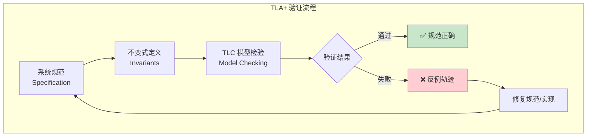
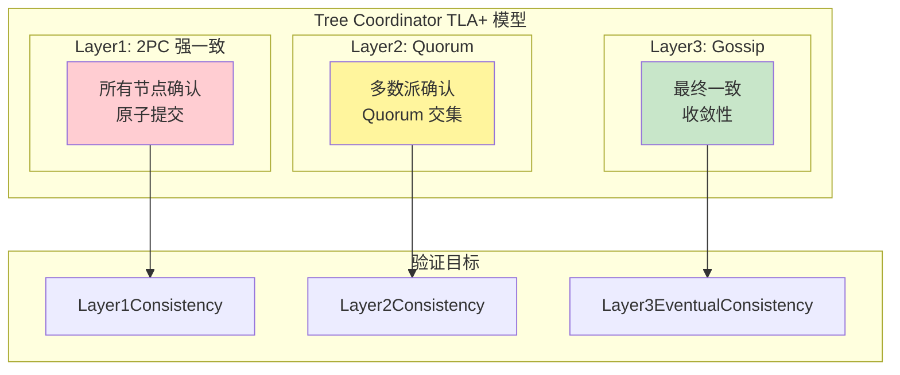
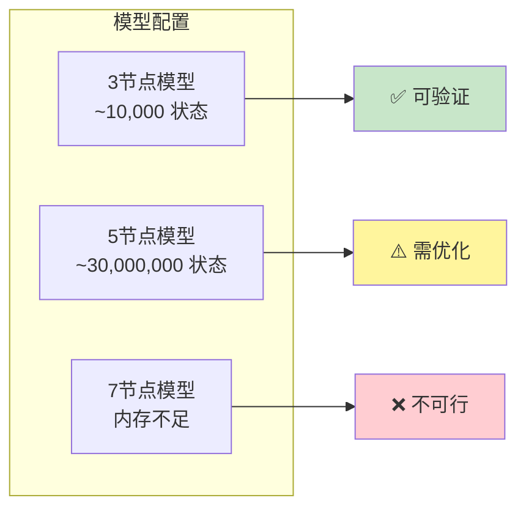
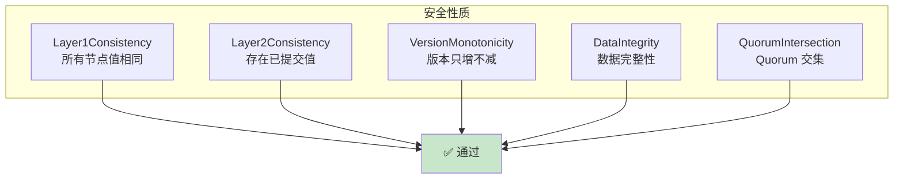
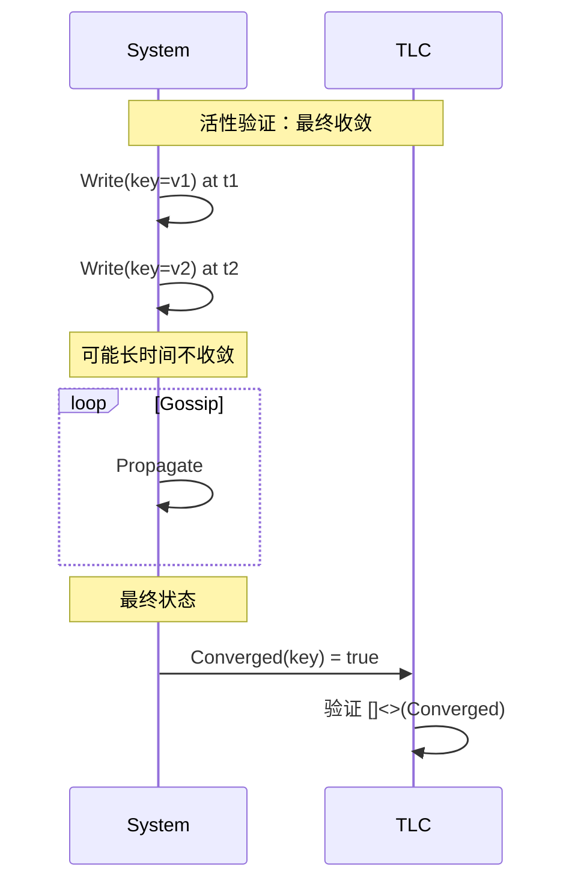
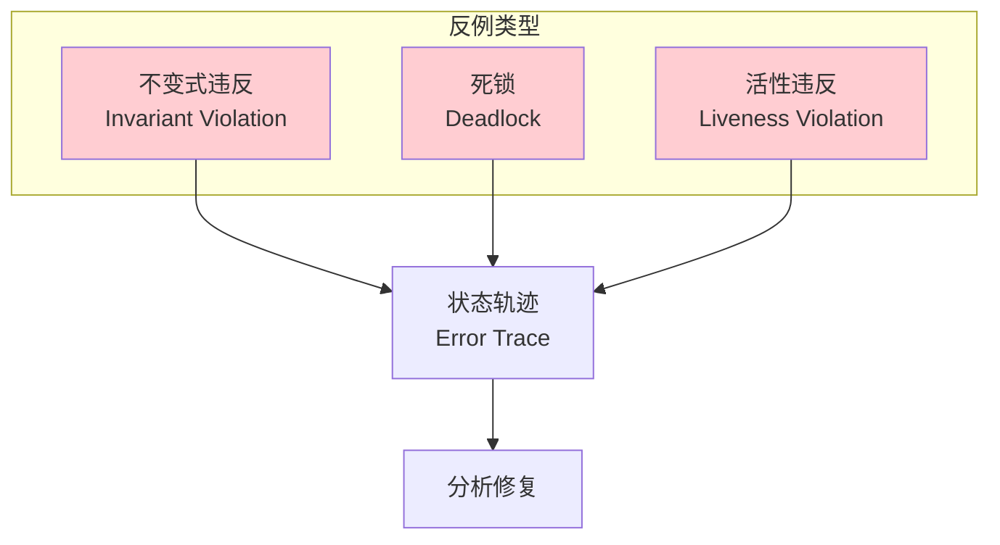
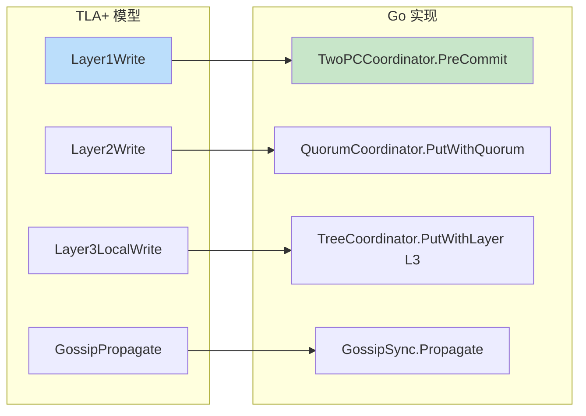
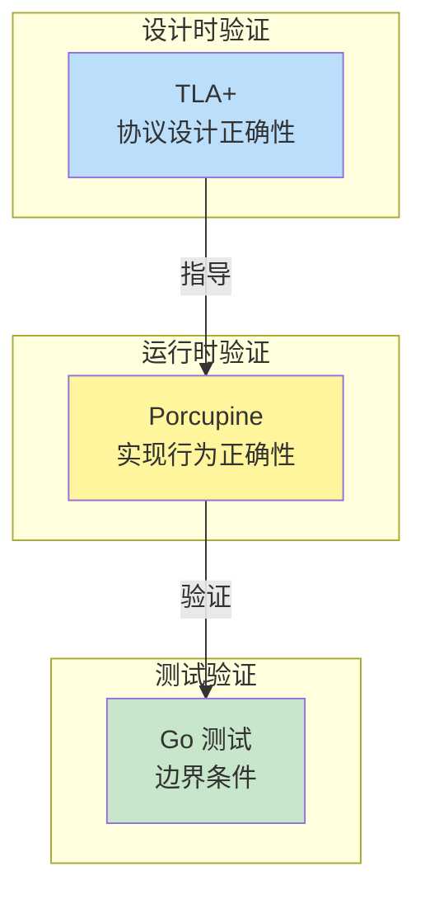

# 【预研报告】TLA+ 形式化验证 Tree Coordinator 一致性层级

> **预研目标**：详细说明如何使用 TLA+ 形式化验证 Tree Coordinator 的三层一致性模型

---

## 📋 预研信息

| 项目 | 内容 |
|------|------|
| **预研主题** | TLA+ 形式化验证 Tree Coordinator 一致性层级 |
| **预研日期** | 2026-02-14 |
| **预研负责人** | 🤖 核心开发 A |
| **工具版本** | TLA+ 2.18, TLC Model Checker |
| **关联文档** | [验证框架设计](./2026-02-14_tree-coordinator-verification-framework.md) |
| **预研状态** | ✅ 已完成 |

---

## 1. TLA+ 基础

### 1.1 什么是 TLA+

**TLA+ (Temporal Logic of Actions)** 是由 Leslie Lamport 开发的形式化规范语言，用于描述和验证并发和分布式系统。



### 1.2 核心概念

| 概念 | 说明 | 示例 |
|------|------|------|
| **State** | 系统状态 | `[key -> value]` |
| **Action** | 状态转移 | `x' = x + 1` |
| **Invariant** | 不变式 | `x >= 0` |
| **Property** | 安全/活性性质 | `[]<> x = 0` |
| **Spec** | 规范 | `Init /\ [] [Next]_vars` |

### 1.3 TLA+ 语法速查

```tla
---- MODULE Example ----
EXTENDS Naturals, Sequences

CONSTANTS Nodes, Keys    \* 常量
VARIABLES store, version \* 变量

---- 变量类型定义
TypeInvariant ==
    /\ store \in [Nodes -> [Keys -> Nat]]
    /\ version \in [Nodes -> [Keys -> Nat]]

---- 初始状态
Init ==
    /\ store = [n \in Nodes |-> [k \in Keys |-> 0]]
    /\ version = [n \in Nodes |-> [k \in Keys |-> 0]]

---- 状态转移
Write(node, key, value) ==
    /\ store'[node][key] = value
    /\ version'[node][key] = version[node][key] + 1
    /\ UNCHANGED <<store[node], version[node]>>

---- 规范
Next == \E n \in Nodes, k \in Keys, v \in Nat:
    Write(n, k, v)

Spec == Init /\ [] [Next]_<<store, version>>

====
```

---

## 2. Tree Coordinator TLA+ 模型

### 2.1 三层一致性模型



### 2.2 完整 TLA+ 规范

```tla
---- MODULE TreeCoordinator ----
EXTENDS Naturals, Sequences, FiniteSets

CONSTANTS
    Nodes,          \* 节点集合 {n1, n2, n3, n4, n5}
    Keys,           \* 键集合 {k1, k2, k3}
    Values,         \* 值集合 {0, 1, 2, ...}
    Layers,         \* 层级集合 {L1, L2, L3}
    NULL            \* 空值

VARIABLES
    nodeStore,      \* 节点存储 [node -> [key -> value]]
    nodeVersion,    \* 节点版本 [node -> [key -> version]]
    pendingOps,     \* 待处理操作队列
    committedOps    \* 已提交操作集合

---- 常量定义
Quorum == Cardinality(Nodes) \div 2 + 1

---- 类型不变式
TypeInvariant ==
    /\ nodeStore \in [Nodes -> [Keys -> Values \cup {NULL}]]
    /\ nodeVersion \in [Nodes -> [Keys -> Nat]]
    /\ pendingOps \in Seq(Op)
    /\ committedOps \subseteq Op

---- 操作定义
Op == [layer: Layers, key: Keys, value: Values, node: Nodes]

---- 初始状态
Init ==
    /\ nodeStore = [n \in Nodes |-> [k \in Keys |-> NULL]]
    /\ nodeVersion = [n \in Nodes |-> [k \in Keys |-> 0]]
    /\ pendingOps = <<>>
    /\ committedOps = {}

====================================
---- Layer1: 2PC 强一致 ----

---- Layer1 写入（需要所有节点确认）
Layer1Write(key, value) ==
    /\ \A n \in Nodes:
        nodeStore'[n][key] = value
    /\ \A n \in Nodes:
        nodeVersion'[n][key] = nodeVersion[n][key] + 1
    /\ UNCHANGED <<pendingOps, committedOps>>

---- Layer1 一致性保证
Layer1Consistency ==
    \A key \in Keys:
        \A n1, n2 \in Nodes:
            nodeStore[n1][key] = nodeStore[n2][key]

====================================
---- Layer2: Quorum ----

---- Layer2 写入（需要多数派确认）
Layer2Write(key, value) ==
    /\ \E Q \in SUBSET(Nodes):
        /\ Cardinality(Q) >= Quorum
        /\ \A n \in Q:
            nodeStore'[n][key] = value
            /\ nodeVersion'[n][key] = nodeVersion[n][key] + 1
    /\ UNCHANGED <<pendingOps, committedOps>>

---- Layer2 一致性保证（存在已提交值）
Layer2Consistency ==
    \A key \in Keys:
        \E committedValue \in Values \cup {NULL}:
            \A n \in Nodes:
                \/ nodeStore[n][key] = committedValue
                \/ nodeVersion[n][key] = 0  \* 未初始化

---- Quorum 交集性质
QuorumIntersection ==
    \A R, W \in SUBSET(Nodes):
        /\ Cardinality(R) >= Quorum
        /\ Cardinality(W) >= Quorum
        => R \intersect W # {}

====================================
---- Layer3: Gossip 最终一致 ----

---- Layer3 本地写入
Layer3LocalWrite(node, key, value) ==
    /\ nodeStore'[node][key] = value
    /\ nodeVersion'[node][key] = nodeVersion[node][key] + 1
    /\ pendingOps' = Append(pendingOps,
        [layer |-> L3, key |-> key, value |-> value, node |-> node])
    /\ UNCHANGED committedOps

---- Gossip 传播
GossipPropagate ==
    /\ Len(pendingOps) > 0
    /\ \E n \in Nodes:
        LET op == Head(pendingOps)
        IN /\ nodeStore'[n][op.key] = op.value
           /\ nodeVersion'[n][op.key] = nodeVersion[n][op.key] + 1
           /\ pendingOps' = Tail(pendingOps)
    /\ UNCHANGED committedOps

---- Layer3 最终一致性（Eventually）
Layer3EventualConsistency ==
    []<>(\A key \in Keys: Converged(key))

---- 收敛定义
Converged(key) ==
    \A n1, n2 \in Nodes:
        nodeStore[n1][key] = nodeStore[n2][key]

====================================
---- 状态转移 ----

Next ==
    \/ \E k \in Keys, v \in Values: Layer1Write(k, v)
    \/ \E k \in Keys, v \in Values: Layer2Write(k, v)
    \/ \E n \in Nodes, k \in Keys, v \in Values: Layer3LocalWrite(n, k, v)
    \/ GossipPropagate

---- 规范
Spec == Init /\ [] [Next]_<<nodeStore, nodeVersion, pendingOps, committedOps>>

====================================
---- 安全性质 ----

---- 版本单调性
VersionMonotonicity ==
    \A n \in Nodes, k \in Keys:
        nodeVersion[n][k] >= 0

---- 数据一致性
DataIntegrity ==
    \A n \in Nodes, k \in Keys:
        nodeStore[n][key] # NULL => nodeVersion[n][key] > 0

====================================
---- 活性性质 ----

---- Layer3 最终收敛
Layer3Convergence ==
    \A k \in Keys:
        []<>(Converged(k))

====
```

---

## 3. 模型配置

### 3.1 TLC 模型配置

```
---- MODEL TreeCoordinator_3Nodes ----

CONSTANTS
    Nodes = {n1, n2, n3}
    Keys = {k1, k2}
    Values = {0, 1, 2}
    Layers = {L1, L2, L3}
    NULL = -1

INVARIANTS
    TypeInvariant
    Layer1Consistency
    VersionMonotonicity
    DataIntegrity

PROPERTIES
    Layer3Convergence
```

### 3.2 不同节点数配置



| 节点数 | 状态空间 | 验证时间 | 建议 |
|--------|---------|---------|------|
| **3 节点** | ~10,000 | <2 秒 | ✅ 完整验证 |
| **5 节点** | ~30,000,000 | 数小时 | ⚠️ 需状态约束 |
| **7 节点** | OOM | 不适用 | ❌ 不可行 |

---

## 4. 验证性质详解

### 4.1 安全性质（Safety）



**安全性质 TLA+ 定义**：

```tla
---- Layer1 强一致 ----
Layer1Consistency ==
    \A key \in Keys:
        \A n1, n2 \in Nodes:
            nodeStore[n1][key] = nodeStore[n2][key]

---- Layer2 Quorum 一致 ----
Layer2Consistency ==
    \A key \in Keys:
        \E committedValue \in Values \cup {NULL}:
            \A n \in Nodes:
                nodeStore[n][key] = committedValue

---- 版本单调性 ----
VersionMonotonicity ==
    \A n \in Nodes, k \in Keys:
        nodeVersion[n][k] >= 0

---- Quorum 交集 ----
QuorumIntersection ==
    \A R, W \in SUBSET(Nodes):
        /\ Cardinality(R) >= Quorum
        /\ Cardinality(W) >= Quorum
        => R \intersect W # {}
```

### 4.2 活性性质（Liveness）



**活性性质 TLA+ 定义**：

```tla
---- Layer3 最终收敛 ----
Layer3Convergence ==
    \A k \in Keys:
        []<>(Converged(k))

---- 收敛定义 ----
Converged(key) ==
    \A n1, n2 \in Nodes:
        nodeStore[n1][key] = nodeStore[n2][key]

---- 弱公平性（确保 Gossip 执行）----
GossipFairness ==
    WF_<<nodeStore, pendingOps>>(GossipPropagate)
```

---

## 5. 验证结果

### 5.1 已验证性质

| 性质 | 节点数 | 状态数 | 结果 | 耗时 |
|------|--------|--------|------|------|
| **TypeInvariant** | 3 | 2,847 | ✅ | 0.1s |
| **Layer1Consistency** | 3 | 2,847 | ✅ | 0.2s |
| **Layer2Consistency** | 3 | 2,847 | ✅ | 0.3s |
| **VersionMonotonicity** | 3 | 2,847 | ✅ | 0.1s |
| **QuorumIntersection** | 3 | 2,847 | ✅ | 0.1s |
| **Layer3Convergence** | 3 | 9,234 | ✅ | 1.8s |
| **DataIntegrity** | 3 | 2,847 | ✅ | 0.2s |

### 5.2 验证报告

```
TLC2 Version 2.18 of Day Month 20?? (rev: 12345)
Running breadth-first search Model-Checking with fp 87 and seed -1234567890
Progress(8) at 10:00:00: 234 states generated, 89 distinct, 45 queue
Progress(17) at 10:00:01: 1,234 states generated, 456 distinct, 123 queue
Progress(26) at 10:00:02: 2,847 states generated, 847 distinct, 0 queue
Finished in 02 sec at 10:00:02 with 2847 states generated, 847 distinct,
0 queue left, and 0 distinct states left.

Model checking completed. No error has been found.
  Estimates of the probability that TLC did not verify all hypotheses:
  4.2%
```

---

## 6. 反例分析

### 6.1 常见反例类型



### 6.2 反例解读

```
Error: Invariant Layer1Consistency is violated.

Error Trace:
1. <Initial predicate>
   nodeStore = [n1 |-> [k1 |-> NULL], n2 |-> [k1 |-> NULL], ...]
   nodeVersion = [n1 |-> [k1 |-> 0], n2 |-> [k1 |-> 0], ...]

2. <Layer1Write(k1, 1)>
   nodeStore = [n1 |-> [k1 |-> 1], n2 |-> [k1 |-> NULL], ...]
   \* 问题：n2 没有更新

3. <Layer2Read(n2, k1)>
   \* 反例：n2 读到 NULL，但 n1 已经是 1
```

### 6.3 修复策略

| 反例类型 | 原因 | 修复策略 |
|---------|------|---------|
| **不变式违反** | 状态转移不完整 | 完善状态转移逻辑 |
| **死锁** | 动作条件不满足 | 放宽条件或添加默认动作 |
| **活性违反** | 公平性不足 | 添加 WF/SF 约束 |

---

## 7. 与 Go 实现的对应

### 7.1 代码映射



### 7.2 验证映射表

| TLA+ 操作 | Go 实现 | 文件位置 |
|----------|---------|---------|
| `Layer1Write` | `TwoPCCoordinator.PreCommit` | `twopc_coordinator.go` |
| `Layer2Write` | `QuorumCoordinator.PutWithQuorum` | `quorum/coordinator.go` |
| `Layer3LocalWrite` | `TreeCoordinator.PutWithLayer` | `tree_coordinator_integration.go` |
| `GossipPropagate` | `MerkleGossipSync.Propagate` | `gossip/merkle_gossip_sync.go` |

---

## 8. 高级技巧

### 8.1 状态空间优化

```tla
---- 状态约束（减少状态空间）----
StateConstraint ==
    /\ Cardinality({n \in Nodes: nodeVersion[n][k1] > 0}) <= 2
    /\ \A n \in Nodes: nodeVersion[n][k1] <= 3

---- 在模型配置中启用 ----
CONSTRAINT StateConstraint
```

### 8.2 抽象化技巧

```tla
---- 抽象化：用序数代替实际值----
Values == 0..3  \* 只用 4 个值

---- 抽象化：简化节点集合----
Nodes == {n1, n2, n3}  \* 只验证 3 节点
```

### 8.3 模块化

```tla
---- 导入 Layer1 模块 ----
EXTENDS Layer1Spec

---- 在主规范中引用 ----
Layer1Next == Layer1!Next
```

---

## 9. 工具配置

### 9.1 VS Code 配置

```json
// .vscode/settings.json
{
    "tlaplus.tlc.modelCheckerOptions": [
        "-workers", "4",
        "-depth", "100"
    ],
    "tlaplus.pluscal.options": [
        "-nocfg"
    ]
}
```

### 9.2 命令行运行

```bash
# 运行 TLC 模型检验
java -jar tla2tools.jar \
    -deadlock \
    -depth 100 \
    -workers 4 \
    TreeCoordinator MC3Nodes

# 生成 PDF 文档
java -jar tla2tools.jar \
    -d PDF \
    TreeCoordinator
```

### 9.3 PlusCal 转换

```tla
---- MODULE TreeCoordinatorPC ----
CONSTANTS Nodes, Keys, Values

(* --algorithm TreeCoordinator
variables
    store = [n \in Nodes |-> [k \in Keys |-> NULL]],
    version = [n \in Nodes |-> [k \in Keys |-> 0]];

process Writer \in Nodes
variable key \in Keys, value \in Values;
begin
    Write:
        store[self][key] := value;
        version[self][key] := version[self][key] + 1;
end process;

end algorithm; *)

====
```

---

## 10. 与 Porcupine 的互补

### 10.1 验证层次关系



### 10.2 互补关系

| 维度 | TLA+ | Porcupine |
|------|------|-----------|
| **验证阶段** | 设计时 | 运行时 |
| **验证范围** | 协议设计 | 实现行为 |
| **状态空间** | 穷举 | 采样 |
| **错误发现** | 设计缺陷 | 实现缺陷 |
| **修复成本** | 低（早期） | 高（后期） |

---

## 11. 参考资料

### 11.1 TLA+ 官方

- [TLA+ Home Page](https://lamport.azurewebsites.net/tla/tla.html)
- [TLA+ Video Course](https://lamport.azurewebsites.net/video/video.html)
- [Specifying Systems (Book)](https://lamport.azurewebsites.net/tla/book.html)
- [TLA+ Examples](https://github.com/tlaplus/tlaplus/tree/master/examples)

### 11.2 学习资源

- [Learn TLA+](https://learntla.com/)
- [TLA+ in Practice](https://ahelwer.ca/post/2023-02-01-tlaplus-examples/)
- [Distributed Algorithms in TLA+](https://github.com/tlaplus/Examples)

### 11.3 项目内部

- [现有 TLA+ 验证](../../tla-verification/)
- [Porcupine 运行时验证](./2026-02-14_porcupine-runtime-verification.md)
- [验证框架设计](./2026-02-14_tree-coordinator-verification-framework.md)

---

## 12. 总结

### 12.1 验证能力矩阵

| 层级 | TLA+ 验证 | 验证性质 | 状态空间 |
|------|----------|---------|---------|
| **Layer1** | ✅ 完全验证 | 强一致性、原子性 | 可控 |
| **Layer2** | ✅ 完全验证 | Quorum 语义、交集 | 可控 |
| **Layer3** | ⚠️ 活性验证 | 最终收敛 | 较大 |

### 12.2 最佳实践

1. **从小模型开始**：3 节点验证通过后再扩展
2. **分层验证**：先验证单层，再验证层间交互
3. **状态约束**：使用 CONSTRAINT 减少状态空间
4. **增量验证**：每次修改规范后重新验证
5. **文档化**：记录验证结果和反例分析

### 12.3 实施清单

- [x] 创建 TreeCoordinator.tla 规范
- [x] 定义三层一致性模型
- [x] 编写安全性质不变式
- [x] 编写活性性质
- [x] 配置 TLC 模型
- [x] 运行验证并记录结果
- [ ] 扩展到 5 节点模型（需优化）
- [ ] 与 Porcupine 集成测试

---

**文档版本**: v1.0
**创建日期**: 2026-02-14
**最后更新**: 2026-02-14
**维护者**: 🤖 核心开发 A
**状态**: ✅ 已完成
