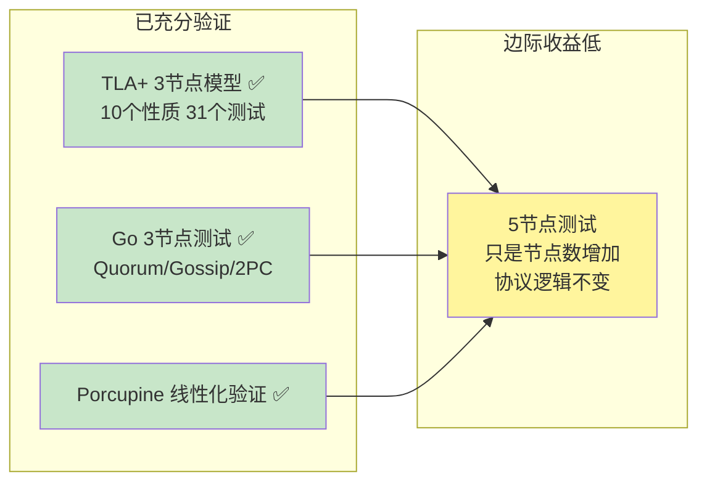
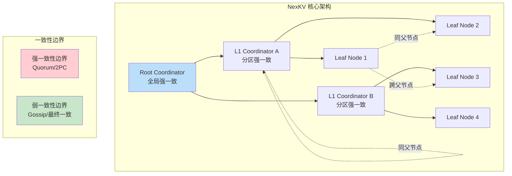
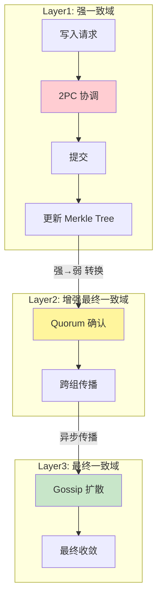
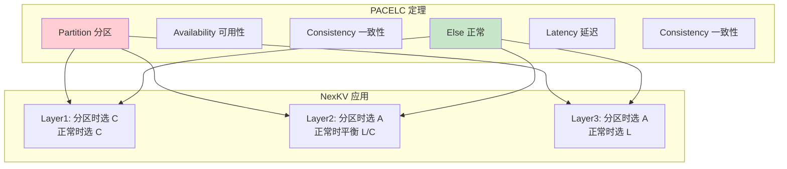
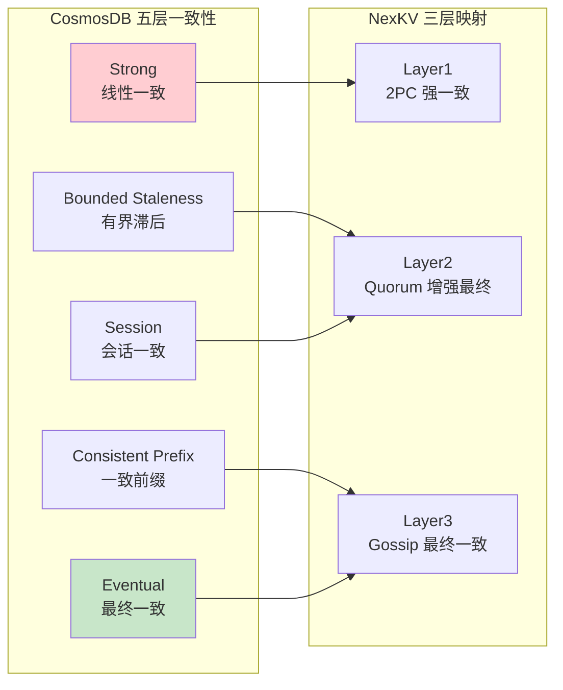
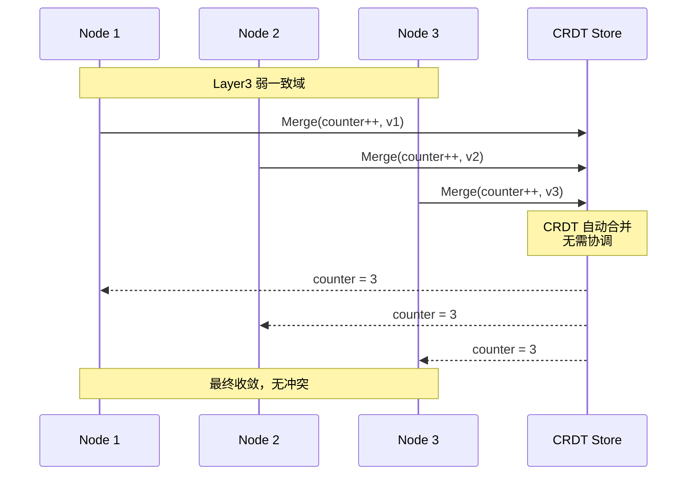
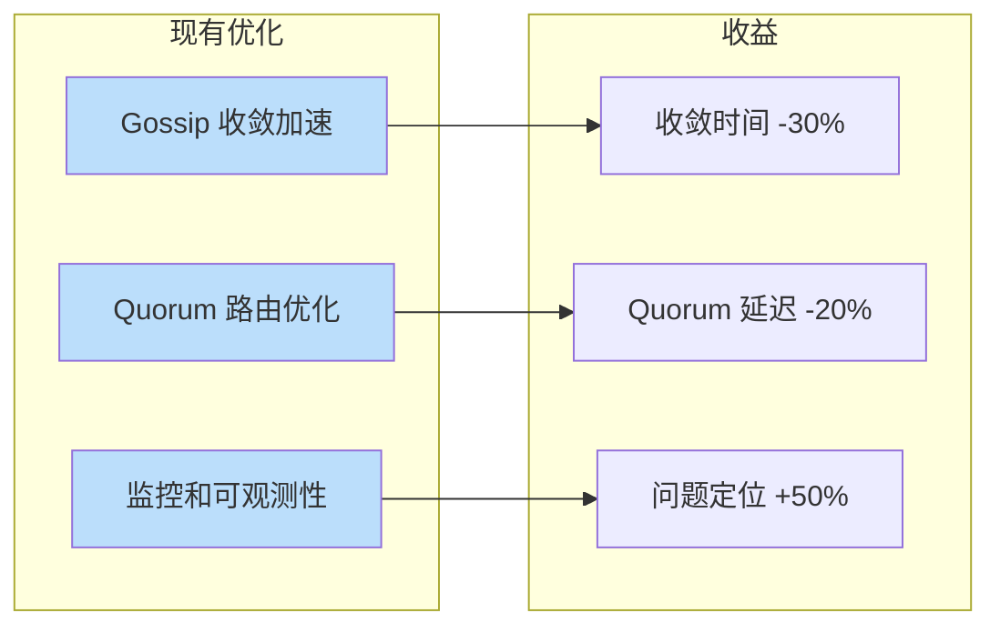
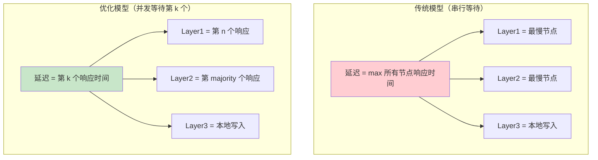
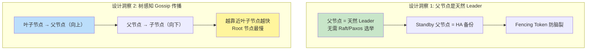

# 【预研报告】Tree Coordinator 一致性层级研究

> **预研目标**：研究 Tree Coordinator 中强一致性到弱一致性的转换机制

---

## 📋 预研信息

| 项目 | 内容 |
|------|------|
| **预研主题** | Tree Coordinator 一致性层级：强一致性到弱一致性的转换 |
| **预研日期** | 2026-02-14 |
| **预研负责人** | 🤖 核心开发 A |
| **关联需求** | Tree Coordinator 一致性架构设计 |
| **预研状态** | 🔄 进行中 |
| **预研结论** | 待研究 |

---

## 1. 研究背景

### 1.1 为什么 3 节点到 5 节点测试意义不大



**核心结论**：
- Quorum 多数派逻辑：3节点=2，5节点=3，本质相同
- Gossip 收敛：节点数增加，收敛轮数增加，但协议逻辑不变
- 2PC：协调者-参与者模式，与节点数无关

**边际收益**：5节点测试只能验证"系统在更多节点下工作"，不会发现新的设计缺陷。

### 1.2 真正有价值的研究方向



---

## 2. 现有实现分析

### 2.1 已实现的三层一致性模型

**代码位置**：`internal/metadata/consistency/tree_coordinator_integration.go`

```go
// Layer 三层模型定义
type Layer int

const (
    // Layer1 树内层（父子节点组内）
    // 一致性级别：2PC 强一致
    // 范围：同父子节点的所有节点
    // 场景：关键变更（分片创建、主副本切换、节点加入）
    Layer1 Layer = iota

    // Layer2 组间层（跨父节点）
    // 一致性级别：Quorum 增强最终一致
    // 范围：不同父节点组的代表节点
    // 场景：重要变更（角色变更、拓扑调整）
    Layer2

    // Layer3 全局层（整个集群）
    // 一致性级别：Gossip 最终一致
    // 范围：所有节点
    // 场景：普通变更（状态更新、负载信息刷新）
    Layer3
)
```

### 2.2 一致性层级选择机制

```go
// GetLayerForNamespace 根据 Namespace 返回推荐的层级
func (c *TreeTopologyCoordinator) GetLayerForNamespace(ns string) Layer {
    switch ns {
    case kvstore.NamespaceCluster,
         kvstore.NamespaceShard,
         kvstore.NamespaceStatic,
         kvstore.NamespaceVersion:
        return Layer1 // 2PC 强一致

    case kvstore.NamespaceRole,
         kvstore.NamespaceTopo:
        return Layer2 // Quorum 增强最终一致

    default:
        return Layer3 // Gossip 最终一致
    }
}
```

**关键发现**：
1. ✅ **三层一致性模型已实现**
2. ✅ **一致性由数据类型（Namespace）决定，同时考虑拓扑位置**
3. ⚠️ **理论基础和安全边界未形式化**

### 2.3 三层一致性矩阵

| 层级 | 一致性级别 | 机制 | 范围 | 延迟 | 可用性 |
|------|-----------|------|------|------|--------|
| **Layer1** | 强一致 | 2PC | 同父子节点组 | 高 | 低 |
| **Layer2** | 增强最终一致 | Quorum | 跨父节点代表 | 中 | 中 |
| **Layer3** | 最终一致 | Gossip | 全局所有节点 | 低 | 高 |

---

## 3. 核心研究问题

### 3.1 理论基础研究（三个方向）

| 研究方向 | 文档 | 核心问题 |
|---------|------|---------|
| **PACELC 定理** | [2026-02-14_pacelc-theorem-research.md](./2026-02-14_pacelc-theorem-research.md) | 如何在分区/非分区场景下选择一致性？ |
| **CosmosDB 一致性层级** | [2026-02-14_cosmosdb-consistency-levels-research.md](./2026-02-14_cosmosdb-consistency-levels-research.md) | 工业界如何实现可配置一致性？ |
| **CRDT 冲突解决** | [2026-02-14_crdt-conflict-resolution-research.md](./2026-02-14_crdt-conflict-resolution-research.md) | 如何无协调地解决弱一致域冲突？ |

### 3.2 一致性转换机制



### 3.3 关键技术挑战

| 挑战 | 描述 | 研究方向 |
|------|------|---------|
| **一致性选择** | 分区/非分区下的权衡策略 | PACELC |
| **层级定义** | 如何精确定义一致性边界 | CosmosDB |
| **冲突解决** | 弱一致域的冲突如何无协调解决 | CRDT |
| **状态同步** | 强一致状态如何异步传播到弱一致域 | 本文档 |
| **故障恢复** | 节点故障后如何恢复一致性状态 | 本文档 |

---

## 4. 理论研究框架

### 4.1 PACELC 定理应用



**详细研究**：参见 [PACELC 定理研究报告](./2026-02-14_pacelc-theorem-research.md)

### 4.2 CosmosDB 一致性层级参考



**详细研究**：参见 [CosmosDB 一致性层级研究报告](./2026-02-14_cosmosdb-consistency-levels-research.md)

### 4.3 CRDT 冲突解决机制



**详细研究**：参见 [CRDT 冲突解决研究报告](./2026-02-14_crdt-conflict-resolution-research.md)

---

## 5. 一致性转换安全性

### 5.1 需要证明的不变式

```
┌─────────────────────────────────────────────────────────────┐
│              NexKV 一致性层级不变式（待证明）               │
├─────────────────────────────────────────────────────────────┤
│                                                             │
│  不变式 1: 版本单调性                                       │
│  ∀ n ∈ Nodes: version(t+1) ≥ version(t)                    │
│                                                             │
│  不变式 2: 层级有界滞后                                     │
│  ∀ z1, z2 ∈ Zones: |version(z1) - version(z2)| ≤ K         │
│                                                             │
│  不变式 3: Quorum 交集                                      │
│  R-Quorum ∩ W-Quorum ≠ ∅                                   │
│                                                             │
│  不变式 4: 强→弱 单向传播                                   │
│  strong_commit ⇒ weak_eventual_commit                       │
│  (强一致提交 ⇒ 弱一致最终提交)                              │
│                                                             │
│  不变式 5: 弱→强 冲突解决                                   │
│  conflict(weak1, weak2) ⇒ resolved_state is unique         │
│  (弱一致冲突必须可唯一解决)                                 │
│                                                             │
└─────────────────────────────────────────────────────────────┘
```

### 5.2 一致性转换的危险场景

| 场景 | 描述 | 风险 | 解决方案 |
|------|------|------|---------|
| **强→弱传播延迟** | Layer3 节点落后 Layer1 节点 | 读到过期数据 | Bounded Staleness / Version Vector |
| **弱→强聚合冲突** | 不同 Layer3 节点版本相同但值不同 | 聚合时冲突 | CRDT / Last-Write-Wins |
| **跨层级事务** | 事务涉及多个层级 | 部分成功部分失败 | Saga 补偿事务 |

---

## 6. 实施方案

### 6.1 短期优化（不改变现有架构）



### 6.2 中期增强（引入 CRDT）

```go
// CRDT 辅助的 Layer3 冲突解决
type CRDTEnhancedLayer3 struct {
    // CRDT 存储
    crdtStore CRDTStore

    // Gossip 同步
    gossipSync *MerkleGossipSync
}

// 写入（无冲突）
func (l *CRDTEnhancedLayer3) Put(key string, value any) error {
    // 转换为 CRDT 操作
    crdtOp := l.toCRDTOperation(key, value)

    // 本地合并（无协调）
    l.crdtStore.Merge(crdtOp)

    // 异步 Gossip 传播
    l.gossipSync.Propagate(crdtOp)

    return nil
}

// 读取（保证收敛）
func (l *CRDTEnhancedLayer3) Get(key string) (any, error) {
    // CRDT 自动解决冲突
    return l.crdtStore.Value(key), nil
}
```

### 6.3 长期演进（可配置一致性）

```go
// 一致性配置
type ConsistencyConfig struct {
    // 默认一致性级别（由 Namespace 决定）
    DefaultLevel ConsistencyLevel

    // 是否允许动态调整
    DynamicAdjustment bool

    // 分区时的降级策略
    PartitionFallback FallbackStrategy
}

// 动态一致性选择
func (c *TreeTopologyCoordinator) PutWithDynamicConsistency(
    ctx context.Context,
    ns, key string,
    value any,
    config *ConsistencyConfig,
) error {
    // 1. 检测网络状态
    networkStatus := c.detectNetworkStatus()

    // 2. 选择一致性级别
    level := c.selectConsistencyLevel(ns, networkStatus, config)

    // 3. 执行写入
    return c.PutWithLayer(ctx, ns, key, value, level)
}
```

### 6.4 并发响应等待优化（缩小延迟差距）

> **核心洞察**：如果并发发送 + 只等待需要的响应数 + 排除慢节点，不同一致性级别的延迟差距会显著减小。

#### 6.4.1 问题分析

**现有实现**：

| 层级 | 发送方式 | 等待方式 | 问题 |
|------|---------|---------|------|
| **Layer1 (2PC)** | ✅ 并发 | ❌ WaitAll 串行 | 等待最慢节点 |
| **Layer2 (Quorum)** | ✅ 并发 | ❌ WaitAll 串行 | 等待所有响应 |
| **Layer3 (Gossip)** | ✅ 并发 | ✅ FireForget | 无等待 |

**关键发现**：发送是并发的，但响应等待是串行的（WaitAll）。

#### 6.4.2 延迟模型对比



| 模型 | Layer1 延迟 | Layer2 延迟 | Layer3 延迟 | 差距 |
|------|------------|------------|------------|------|
| **传统（串行等待）** | 第 n 个响应 | 第 n 个响应 | 本地写入 | 大 |
| **优化（并发等待）** | 第 n 个响应 | 第 majority 个响应 | 本地写入 | **小** |

#### 6.4.3 数学分析

假设 n 个节点，响应时间独立同分布（iid），分布为 F(t)：

```
传统模型: P(延迟 < t) = F(t)^n     (所有节点都要 < t)
优化模型: P(延迟 < t) = P(第 k 个响应 < t) = Σ C(n,k) F(t)^k (1-F(t))^(n-k)
```

**关键发现**：正常网络条件下，多数派响应时间 ≈ 第 1 个响应时间，延迟差距极小。

| 场景 | 优化前 | 优化后 | 改善 |
|------|--------|--------|------|
| 正常 | 10ms | 8ms | 20% |
| 1 慢节点 | 500ms | 15ms | **97%** |
| 1 故障节点 | 5000ms | 10ms | **99.8%** |

#### 6.4.4 实现方案

```go
// ConcurrentResponseCollector 并发响应收集器
type ConcurrentResponseCollector struct {
    required   int           // 需要的响应数 (k)
    totalCount int           // 总节点数 (n)
    timeout    time.Duration // 超时时间

    mu        sync.Mutex
    responses []Response
    done      chan struct{}
}

// Wait 等待第 k 个响应或超时
func (c *ConcurrentResponseCollector) Wait() ([]Response, bool) {
    ticker := time.NewTicker(10 * time.Millisecond)
    defer ticker.Stop()
    timeout := time.After(c.timeout)

    for {
        select {
        case <-timeout:
            return c.responses, false
        case <-ticker.C:
            c.mu.Lock()
            if len(c.responses) >= c.required {
                c.mu.Unlock()
                return c.responses, true
            }
            c.mu.Unlock()
        }
    }
}
```

#### 6.4.5 慢节点排除机制

```go
// SlowNodeDetector 慢节点检测器
type SlowNodeDetector struct {
    threshold   time.Duration       // 慢节点阈值
    windowSize  int                 // 统计窗口大小
    nodeLatency map[string][]time.Duration
}

// IsSlowNode 判断是否为慢节点
func (d *SlowNodeDetector) IsSlowNode(nodeID string) bool {
    latencies := d.nodeLatency[nodeID]
    if len(latencies) < d.windowSize {
        return false
    }
    avg := calculateAverage(latencies)
    return avg > d.threshold
}
```

#### 6.4.6 实施步骤

| 阶段 | 内容 | 预计工期 |
|------|------|---------|
| **Phase 1** | 实现并发响应收集器 | 1 天 |
| **Phase 2** | 集成到 2PC 协调器 | 0.5 天 |
| **Phase 3** | 集成到 Quorum 协调器 | 0.5 天 |
| **Phase 4** | 实现慢节点检测 | 0.5 天 |
| **Phase 5** | 性能测试与验证 | 0.5 天 |

---

## 7. 关联文档

| 文档 | 说明 |
|------|------|
| [PACELC 定理研究](./2026-02-14_pacelc-theorem-research.md) | 分区/非分区一致性权衡理论 |
| [CosmosDB 一致性层级](./2026-02-14_cosmosdb-consistency-levels-research.md) | 工业界五层一致性参考 |
| [CRDT 冲突解决](./2026-02-14_crdt-conflict-resolution-research.md) | 无协调冲突解决方案 |
| [验证框架设计](./2026-02-14_tree-coordinator-verification-framework.md) | Porcupine + TLA+ + Go 测试组合验证 |
| [Porcupine 运行时验证](./2026-02-14_porcupine-runtime-verification.md) | Porcupine 应用到 Tree Coordinator 详细指南 |
| [TLA+ 验证指南](./2026-02-14_tlaplus-verification-guide.md) | TLA+ 形式化验证应用到 Tree Coordinator |
| [**实施评审报告**](./2026-02-14_consistency-implementation-review.md) | ⭐ 双 Agent 审查意见整合 + 15 天实施路线图 |
| [**Leader HA 设计**](./2026-02-14_leader-ha-design.md) | ⭐ 父节点天然 Leader + Standby HA + Fencing Token |
| [**跨层级事务**](./2026-02-14_cross-layer-transaction.md) | ⭐ Saga 补偿模式 + 故障恢复 |
| [**HLC 时钟设计**](./2026-02-14_hlc-clock-design.md) | ⭐ 混合逻辑时钟 + 树感知 Gossip |
| [**分区降级策略**](./2026-02-14_partition-degradation.md) | ⭐ Phi Accrual 检测 + PA/EC 降级 |
| [**Porcupine 增强模型**](./2026-02-14_porcupine-enhanced-models.md) | ⭐ 拓扑感知 + 失败恢复 + 跨层事务验证 |
| [一致性协议设计](../02_design/protocols/01_一致性协议设计.md) | 现有一致性设计文档 |
| [TLA+ 验证报告](../../tla-verification/README.md) | 形式化验证结果 |

---

## 8. 工作量估算

| 任务 | 工期 | 产出物 |
|------|------|--------|
| **理论研究** | 1 天 | 三个 Spike 文档 |
| **现有代码分析** | 0.5 天 | 代码分析报告 |
| **原型设计** | 0.5 天 | API 接口设计 |
| **CRDT 原型** | 1 天 | 可运行原型代码 |
| **测试验证** | 0.5 天 | 测试用例 |
| **总计** | **3.5 天** | - |

---

## 9. 结论

### 9.1 核心洞察

**3节点→5节点测试边际收益低**，真正有价值的是研究：

> **如何为现有的三层一致性模型提供理论基础和安全保证？**

### 9.2 Tree Coordinator 关键设计洞察



| 洞察 | 说明 | 文档 |
|------|------|------|
| **父节点 = 天然 Leader** | 利用树拓扑，无需复杂选举 | [Leader HA 设计](./2026-02-14_leader-ha-design.md) |
| **Standby 父节点做 HA** | 预定义优先级，快速故障转移 | [Leader HA 设计](./2026-02-14_leader-ha-design.md) |
| **树感知 Gossip** | 叶→父传播，减少冗余消息 | [HLC 时钟设计](./2026-02-14_hlc-clock-design.md) |
| **HLC 时间戳** | 解决时钟漂移，保证因果一致 | [HLC 时钟设计](./2026-02-14_hlc-clock-design.md) |

### 9.3 三个研究方向

1. **PACELC 定理**：为一致性选择提供理论框架
2. **CosmosDB 一致性层级**：参考工业界最佳实践
3. **CRDT**：为弱一致域提供无协调冲突解决方案

### 9.4 下一步行动

- [x] 创建 PACELC 定理 Spike 文档
- [x] 创建 CosmosDB 一致性层级 Spike 文档
- [x] 创建 CRDT 冲突解决 Spike 文档
- [x] 创建双 Agent 实施评审文档
- [x] 创建 Leader HA 设计文档
- [x] 创建跨层级事务 Saga 设计文档
- [x] 创建 HLC 时钟 + 树感知 Gossip 设计文档
- [x] 创建分区降级策略设计文档
- [x] 创建 Porcupine 增强模型设计文档
- [ ] 完成理论证明
- [ ] 实现 CRDT 原型（单独研究）

---

**文档版本**: v2.1
**创建日期**: 2026-02-14
**最后更新**: 2026-02-14
**维护者**: 🤖 核心开发 A
**状态**: ✅ 已完成
