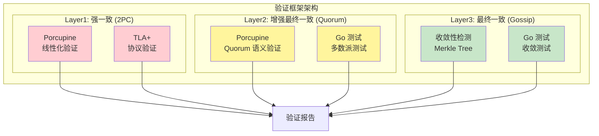
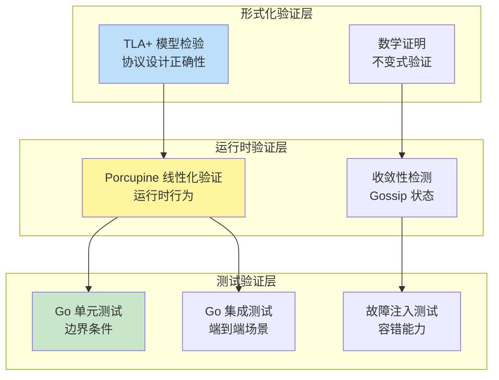
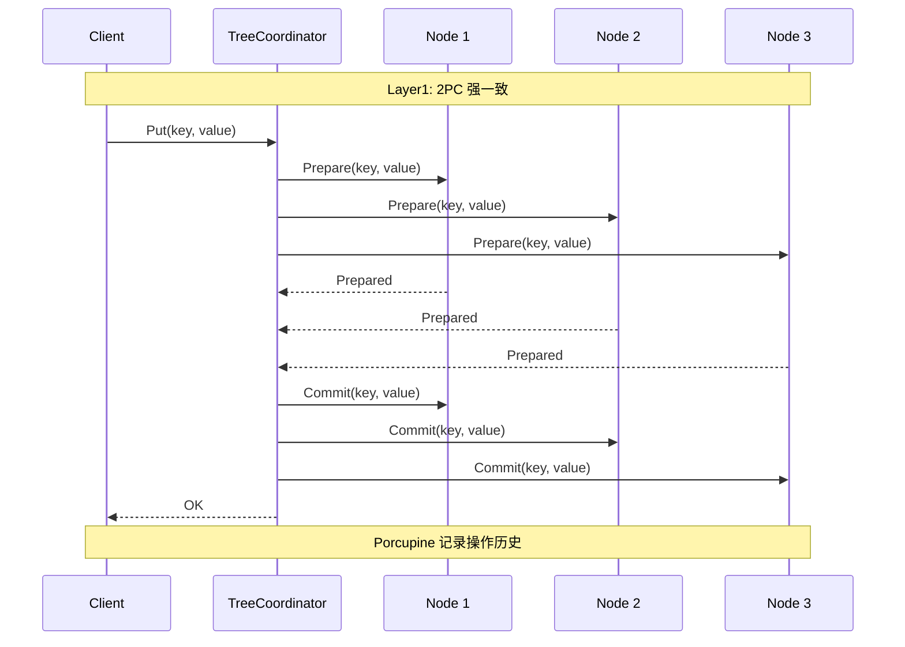
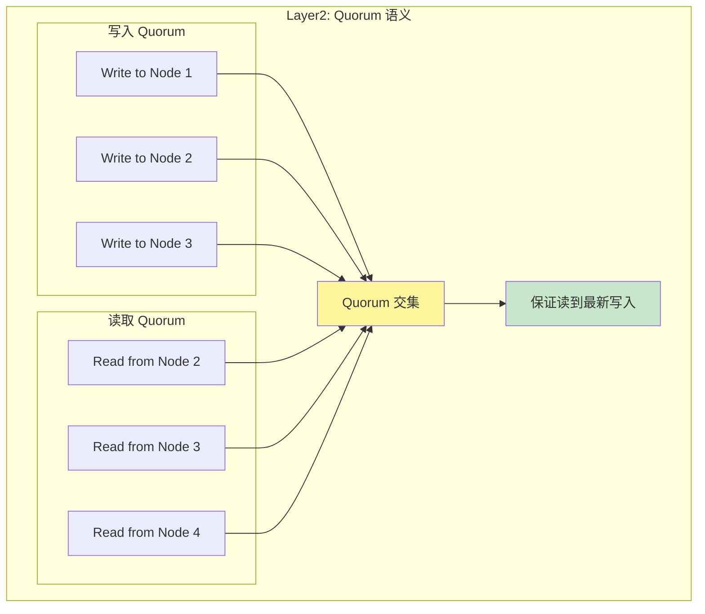
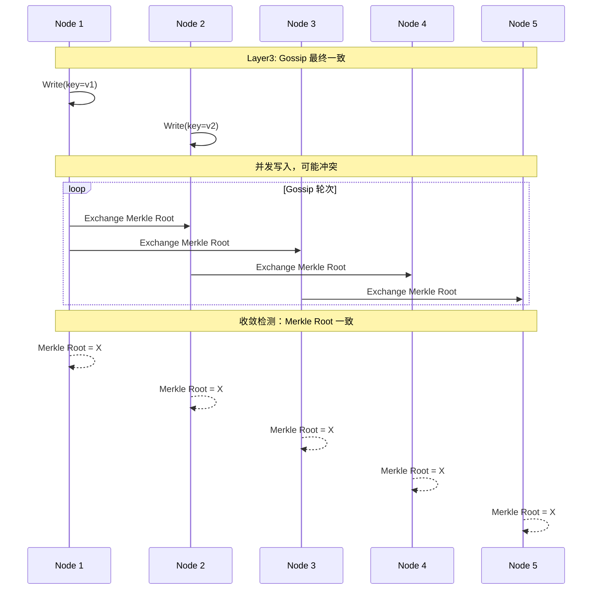
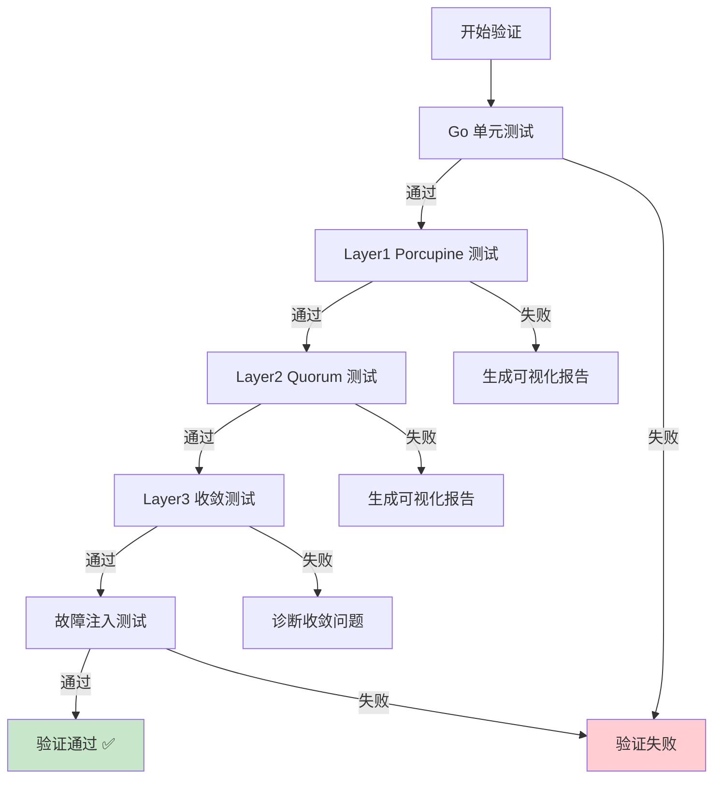
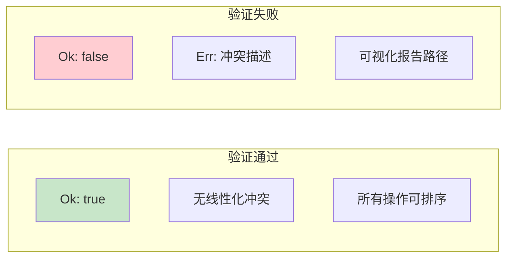

# 【预研报告】Tree Coordinator 一致性层级验证框架

> **预研目标**：设计完整的验证框架，使用 Porcupine + TLA+ + Go 测试组合验证 Tree Coordinator 的三层一致性模型

---

## 📋 预研信息

| 项目 | 内容 |
|------|------|
| **预研主题** | Tree Coordinator 一致性层级验证框架 |
| **预研日期** | 2026-02-14 |
| **预研负责人** | 🤖 核心开发 A |
| **关联文档** | [一致性层级研究](./2026-02-14_tree-coordinator-consistency-hierarchy.md) |
| **预研状态** | 🔄 进行中 |

---

## 1. 验证框架总览

### 1.1 三层验证策略



### 1.2 验证工具矩阵

| 层级 | 一致性模型 | 验证工具 | 验证目标 |
|------|-----------|---------|---------|
| **Layer1** | 线性一致 | Porcupine + TLA+ | 操作线性化、协议正确性 |
| **Layer2** | Quorum 一致 | Porcupine + Go 测试 | 多数派语义、Quorum 交集 |
| **Layer3** | 最终一致 | 收敛检测 + Go 测试 | 最终收敛、冲突解决 |

### 1.3 验证层次关系



---

## 2. Porcupine 验证 Layer1（强一致）

### 2.1 Layer1 验证模型



### 2.2 Porcupine 模型定义

```go
// Layer1 模型：强一致 2PC
package verification

import (
    "github.com/anishathalye/porcupine"
)

// Layer1Operation Layer1 操作类型
type Layer1Operation struct {
    OpType string      // "put" or "get"
    Key    string      // 键
    Value  interface{} // 值（put 时）
    Result interface{} // 结果（get 时）
}

// Layer1Model Layer1 线性化模型
var Layer1Model = porcupine.Model{
    Name: "Layer1-2PC-Strong",
    Ops: []porcupine.Operation{
        // Put 操作
        {
            Name:    "Put",
            Inputs:  []string{"key", "value"},
            Outputs: []string{"ok"},
        },
        // Get 操作
        {
            Name:    "Get",
            Inputs:  []string{"key"},
            Outputs: []string{"value"},
        },
    },
    // 分区函数：按 key 分区
    Partition: func(args, retval interface{}) interface{} {
        op := args.(Layer1Operation)
        return op.Key
    },
    // 初始状态
    InitState: func() interface{} {
        return make(map[string]interface{})
    },
    // 状态转移函数
    Step: func(state, input, output interface{}) (bool, interface{}) {
        st := state.(map[string]interface{})
        op := input.(Layer1Operation)

        switch op.OpType {
        case "put":
            // Put 总是成功（强一致）
            st[op.Key] = op.Value
            return true, st

        case "get":
            // Get 返回最新值
            val, ok := st[op.Key]
            if !ok {
                return output == nil, st
            }
            return val == output, st
        }

        return false, st
    },
}
```

### 2.3 Layer1 验证测试

```go
// layer1_verification_test.go
package verification

import (
    "context"
    "testing"
    "time"

    "github.com/anishathalye/porcupine"
    "github.com/jzhang405/NexKV/internal/metadata/consistency"
)

// TestLayer1Linearizability 验证 Layer1 线性化
func TestLayer1Linearizability(t *testing.T) {
    // 创建测试集群
    coordinator := setupLayer1Cluster(t)
    defer coordinator.Close()

    // 操作历史记录
    var history []porcupine.Operation

    // 并发执行操作
    ctx := context.Background()

    // 操作 1: Put
    start1 := time.Now().UnixNano()
    err := coordinator.PutWithLayer(ctx, "cluster", "key1", "value1", consistency.Layer1)
    end1 := time.Now().UnixNano()

    history = append(history, porcupine.Operation{
        ClientId: 1,
        Input:    Layer1Operation{OpType: "put", Key: "key1", Value: "value1"},
        Output:   err == nil,
        Call:     start1,
        Return:   end1,
    })

    // 操作 2: Get
    start2 := time.Now().UnixNano()
    val, err := coordinator.Get(ctx, "cluster", "key1")
    end2 := time.Now().UnixNano()

    history = append(history, porcupine.Operation{
        ClientId: 2,
        Input:    Layer1Operation{OpType: "get", Key: "key1"},
        Output:   val,
        Call:     start2,
        Return:   end2,
    })

    // 验证线性化
    result := porcupine.CheckOperations(Layer1Model, history, 5*time.Second)

    if !result.Ok {
        t.Errorf("Layer1 linearizability violation: %v", result.Err)
    }

    // 生成可视化报告（失败时）
    if !result.Ok {
        visPath := "/tmp/layer1-violation.html"
        _ = porcupine.Visualize(Layer1Model, history, visPath)
        t.Logf("Visualization saved to: %s", visPath)
    }
}

// TestLayer1ConcurrentOperations 并发操作验证
func TestLayer1ConcurrentOperations(t *testing.T) {
    coordinator := setupLayer1Cluster(t)
    defer coordinator.Close()

    ctx := context.Background()
    var history []porcupine.Operation
    var mu sync.Mutex

    // 并发执行 100 个操作
    var wg sync.WaitGroup
    for i := 0; i < 100; i++ {
        wg.Add(1)
        go func(clientId int) {
            defer wg.Done()

            key := fmt.Sprintf("key%d", clientId%10)

            if clientId%2 == 0 {
                // Put 操作
                start := time.Now().UnixNano()
                err := coordinator.PutWithLayer(ctx, "cluster", key, fmt.Sprintf("value%d", clientId), consistency.Layer1)
                end := time.Now().UnixNano()

                mu.Lock()
                history = append(history, porcupine.Operation{
                    ClientId: clientId,
                    Input:    Layer1Operation{OpType: "put", Key: key, Value: fmt.Sprintf("value%d", clientId)},
                    Output:   err == nil,
                    Call:     start,
                    Return:   end,
                })
                mu.Unlock()
            } else {
                // Get 操作
                start := time.Now().UnixNano()
                val, _ := coordinator.Get(ctx, "cluster", key)
                end := time.Now().UnixNano()

                mu.Lock()
                history = append(history, porcupine.Operation{
                    ClientId: clientId,
                    Input:    Layer1Operation{OpType: "get", Key: key},
                    Output:   val,
                    Call:     start,
                    Return:   end,
                })
                mu.Unlock()
            }
        }(i)
    }
    wg.Wait()

    // 验证线性化
    result := porcupine.CheckOperations(Layer1Model, history, 30*time.Second)

    if !result.Ok {
        t.Errorf("Layer1 concurrent operations linearizability violation: %v", result.Err)
    }
}
```

---

## 3. Porcupine 验证 Layer2（Quorum）

### 3.1 Layer2 验证模型



### 3.2 Quorum 模型定义

```go
// Layer2 模型：Quorum 语义
package verification

import (
    "github.com/anishathalye/porcupine"
)

// QuorumState Quorum 状态
type QuorumState struct {
    // 每个节点的版本和值
    NodeVersions map[string]uint64
    NodeValues   map[string]interface{}

    // 最新提交的值
    CommittedValue interface{}
    CommittedVersion uint64
}

// Layer2Model Layer2 Quorum 模型
var Layer2Model = porcupine.Model{
    Name: "Layer2-Quorum",
    Ops: []porcupine.Operation{
        {Name: "Put", Inputs: []string{"key", "value"}, Outputs: []string{"ok"}},
        {Name: "Get", Inputs: []string{"key"}, Outputs: []string{"value"}},
    },
    Partition: func(args, retval interface{}) interface{} {
        op := args.(Layer1Operation)
        return op.Key
    },
    InitState: func() interface{} {
        return &QuorumState{
            NodeVersions:    make(map[string]uint64),
            NodeValues:      make(map[string]interface{}),
            CommittedVersion: 0,
        }
    },
    Step: func(state, input, output interface{}) (bool, interface{}) {
        st := state.(*QuorumState)
        op := input.(Layer1Operation)
        majority := 3 // 5 节点的多数派

        switch op.OpType {
        case "put":
            // Quorum 写入：需要多数派确认
            // 更新多数派节点的版本
            nodesUpdated := 0
            for node := range st.NodeVersions {
                if nodesUpdated < majority {
                    st.NodeVersions[node] = st.CommittedVersion + 1
                    st.NodeValues[node] = op.Value
                    nodesUpdated++
                }
            }
            st.CommittedVersion++
            st.CommittedValue = op.Value
            return true, st

        case "get":
            // Quorum 读取：从多数派读取
            // 验证是否读到已提交的值或更新的值
            if st.CommittedValue == nil && output == nil {
                return true, st
            }
            return output == st.CommittedValue, st
        }

        return false, st
    },
}
```

### 3.3 Layer2 Quorum 交集验证

```go
// layer2_quorum_verification_test.go
package verification

import (
    "testing"
)

// TestQuorumIntersection 验证 Quorum 交集性质
func TestQuorumIntersection(t *testing.T) {
    tests := []struct {
        name      string
        nodeCount int
        rQuorum   int  // 读 Quorum 大小
        wQuorum   int  // 写 Quorum 大小
        expected  bool // 是否有交集
    }{
        {"3节点 R1W2", 3, 1, 2, true},
        {"3节点 R2W2", 3, 2, 2, true},
        {"5节点 R2W3", 5, 2, 3, true},
        {"5节点 R3W3", 5, 3, 3, true},
        {"5节点 R1W2", 5, 1, 2, false}, // 1+2=3 < 5，无交集保证
    }

    for _, tt := range tests {
        t.Run(tt.name, func(t *testing.T) {
            // 检查 Quorum 交集
            hasIntersection := (tt.rQuorum + tt.wQuorum) > tt.nodeCount

            if hasIntersection != tt.expected {
                t.Errorf("expected %v, got %v", tt.expected, hasIntersection)
            }
        })
    }
}

// TestLayer2QuorumLinearizability Layer2 线性化验证
func TestLayer2QuorumLinearizability(t *testing.T) {
    coordinator := setupLayer2Cluster(t)
    defer coordinator.Close()

    ctx := context.Background()
    var history []porcupine.Operation

    // 执行 Quorum 操作
    for i := 0; i < 50; i++ {
        key := "quorum-key"

        // 写入
        start := time.Now().UnixNano()
        err := coordinator.PutWithLayer(ctx, "role", key, fmt.Sprintf("v%d", i), consistency.Layer2)
        end := time.Now().UnixNano()

        history = append(history, porcupine.Operation{
            ClientId: i,
            Input:    Layer1Operation{OpType: "put", Key: key, Value: fmt.Sprintf("v%d", i)},
            Output:   err == nil,
            Call:     start,
            Return:   end,
        })

        // 读取
        start = time.Now().UnixNano()
        val, _ := coordinator.Get(ctx, "role", key)
        end = time.Now().UnixNano()

        history = append(history, porcupine.Operation{
            ClientId: i + 100,
            Input:    Layer1Operation{OpType: "get", Key: key},
            Output:   val,
            Call:     start,
            Return:   end,
        })
    }

    // 验证
    result := porcupine.CheckOperations(Layer2Model, history, 30*time.Second)

    if !result.Ok {
        t.Errorf("Layer2 Quorum linearizability violation: %v", result.Err)
    }
}
```

---

## 4. 收敛性检测 Layer3（Gossip）

### 4.1 Layer3 验证模型



### 4.2 收敛性检测器

```go
// convergence_checker.go
package verification

import (
    "context"
    "time"
)

// ConvergenceChecker 收敛性检测器
type ConvergenceChecker struct {
    coordinators []*consistency.TreeTopologyCoordinator
    timeout      time.Duration
    interval     time.Duration
}

// NewConvergenceChecker 创建收敛检测器
func NewConvergenceChecker(
    coordinators []*consistency.TreeTopologyCoordinator,
    timeout, interval time.Duration,
) *ConvergenceChecker {
    return &ConvergenceChecker{
        coordinators: coordinators,
        timeout:      timeout,
        interval:     interval,
    }
}

// WaitForConvergence 等待所有节点收敛
func (c *ConvergenceChecker) WaitForConvergence(ctx context.Context) error {
    ctx, cancel := context.WithTimeout(ctx, c.timeout)
    defer cancel()

    ticker := time.NewTicker(c.interval)
    defer ticker.Stop()

    for {
        select {
        case <-ctx.Done():
            return &ConvergenceError{
                Timeout:    c.timeout,
                NodeRoots:  c.getMerkleRoots(),
                Divergent:  c.getDivergentNodes(),
            }
        case <-ticker.C:
            if c.isConverged() {
                return nil
            }
        }
    }
}

// isConverged 检查是否收敛
func (c *ConvergenceChecker) isConverged() bool {
    roots := c.getMerkleRoots()
    if len(roots) == 0 {
        return true
    }

    baseRoot := roots[0]
    for _, root := range roots[1:] {
        if root != baseRoot {
            return false
        }
    }
    return true
}

// getMerkleRoots 获取所有节点的 Merkle Root
func (c *ConvergenceChecker) getMerkleRoots() []string {
    roots := make([]string, len(c.coordinators))
    for i, coord := range c.coordinators {
        roots[i] = coord.GetMerkleRoot()
    }
    return roots
}

// getDivergentNodes 获取未收敛的节点
func (c *ConvergenceChecker) getDivergentNodes() []string {
    roots := c.getMerkleRoots()
    if len(roots) == 0 {
        return nil
    }

    // 统计每个 root 的数量
    counts := make(map[string]int)
    for _, root := range roots {
        counts[root]++
    }

    // 找到多数派 root
    var majorityRoot string
    maxCount := 0
    for root, count := range counts {
        if count > maxCount {
            maxCount = count
            majorityRoot = root
        }
    }

    // 返回非多数派节点
    var divergent []string
    for i, coord := range c.coordinators {
        if roots[i] != majorityRoot {
            divergent = append(divergent, coord.GetLocalNodeID())
        }
    }
    return divergent
}

// ConvergenceError 收敛错误
type ConvergenceError struct {
    Timeout   time.Duration
    NodeRoots []string
    Divergent []string
}

func (e *ConvergenceError) Error() string {
    return fmt.Sprintf("convergence timeout after %v, divergent nodes: %v",
        e.Timeout, e.Divergent)
}
```

### 4.3 Layer3 验证测试

```go
// layer3_convergence_test.go
package verification

import (
    "context"
    "testing"
    "time"
)

// TestLayer3GossipConvergence 测试 Gossip 收敛性
func TestLayer3GossipConvergence(t *testing.T) {
    // 创建 5 节点集群
    coordinators := setupLayer3Cluster(t, 5)
    defer func() {
        for _, c := range coordinators {
            c.Close()
        }
    }()

    ctx := context.Background()

    // 在不同节点写入
    for i, coord := range coordinators {
        err := coord.PutWithLayer(ctx, "status", "node-status",
            fmt.Sprintf("status-%d", i), consistency.Layer3)
        if err != nil {
            t.Fatalf("Failed to write: %v", err)
        }
    }

    // 等待收敛
    checker := NewConvergenceChecker(coordinators, 20*time.Second, 100*time.Millisecond)
    err := checker.WaitForConvergence(ctx)

    if err != nil {
        t.Errorf("Gossip convergence failed: %v", err)
    }
}

// TestLayer3ConvergenceWithFailure 故障下收敛测试
func TestLayer3ConvergenceWithFailure(t *testing.T) {
    coordinators := setupLayer3Cluster(t, 5)
    defer func() {
        for _, c := range coordinators {
            c.Close()
        }
    }()

    ctx := context.Background()

    // 写入数据
    coordinators[0].PutWithLayer(ctx, "status", "key1", "value1", consistency.Layer3)

    // 模拟节点崩溃
    coordinators[4].Close()

    // 等待剩余 4 节点收敛
    checker := NewConvergenceChecker(coordinators[:4], 10*time.Second, 100*time.Millisecond)
    err := checker.WaitForConvergence(ctx)

    if err != nil {
        t.Errorf("Convergence with failure failed: %v", err)
    }
}

// TestLayer3ConcurrentWritesConcurrentWrite 并发写入收敛测试
func TestLayer3ConcurrentWritesConcurrentWrite(t *testing.T) {
    coordinators := setupLayer3Cluster(t, 5)
    defer func() {
        for _, c := range coordinators {
            c.Close()
        }
    }()

    ctx := context.Background()
    var wg sync.WaitGroup

    // 并发写入
    for i := 0; i < 10; i++ {
        wg.Add(1)
        go func(idx int) {
            defer wg.Done()
            coord := coordinators[idx%5]
            coord.PutWithLayer(ctx, "status", "counter",
                fmt.Sprintf("write-%d", idx), consistency.Layer3)
        }(i)
    }
    wg.Wait()

    // 等待收敛
    checker := NewConvergenceChecker(coordinators, 20*time.Second, 100*time.Millisecond)
    err := checker.WaitForConvergence(ctx)

    if err != nil {
        t.Errorf("Concurrent writes convergence failed: %v", err)
    }

    // 验证所有节点值相同
    var values []interface{}
    for _, coord := range coordinators {
        val, _ := coord.Get(ctx, "status", "counter")
        values = append(values, val)
    }

    baseValue := values[0]
    for i, val := range values[1:] {
        if val != baseValue {
            t.Errorf("Node %d has different value: %v != %v", i+1, val, baseValue)
        }
    }
}
```

---

## 5. TLA+ 形式化验证

### 5.1 Tree Coordinator TLA+ 模型

```tla
---- MODULE TreeCoordinator ----
EXTENDS Naturals, Sequences

CONSTANTS
    Nodes,          \* 节点集合
    Layers,         \* 层级集合 {L1, L2, L3}
    Keys,           \* 键集合
    Values          \* 值集合

VARIABLES
    nodeState,      \* 节点状态 [node -> [key -> value]]
    nodeVersion,    \* 节点版本 [node -> [key -> version]]
    pendingOps      \* 待处理操作

----
// 类型不变式
TypeInvariant ==
    /\ nodeState \in [Nodes -> [Keys -> Values]]
    /\ nodeVersion \in [Nodes -> [Keys -> Nat]]
    /\ pendingOps \in Seq(Op)

----
// Layer1: 强一致写入（需要所有节点确认）
Layer1Write(key, value) ==
    /\ \A n \in Nodes:
        nodeState[n][key] = value
    /\ \A n \in Nodes:
        nodeVersion[n][key] = nodeVersion[n][key] + 1

----
// Layer2: Quorum 写入（需要多数派确认）
Quorum == Cardinality(Nodes) \div 2 + 1

Layer2Write(key, value) ==
    /\ \E Q \in SUBSET(Nodes):
        /\ Cardinality(Q) >= Quorum
        /\ \A n \in Q:
            nodeState[n][key] = value

----
// Layer3: Gossip 最终一致
Layer3Write(node, key, value) ==
    /\ nodeState[node][key] = value
    /\ nodeVersion[node][key] = nodeVersion[node][key] + 1
    /\ pendingOps' = Append(pendingOps, <<node, key, value>>)

GossipPropagate ==
    /\ Len(pendingOps) > 0
    /\ \E n \in Nodes:
        LET op == Head(pendingOps)
        IN /\ nodeState[n][op[2]]' = op[3]
           /\ pendingOps' = Tail(pendingOps)

----
// 收敛性：所有节点值相同
Converged(key) ==
    \A n1, n2 \in Nodes:
        nodeState[n1][key] = nodeState[n2][key]

----
// 一致性保证
Layer1Consistency ==
    \A key \in Keys:
        \A n1, n2 \in Nodes:
            nodeState[n1][key] = nodeState[n2][key]

Layer2Consistency ==
    \A key \in Keys:
        \E committedValue \in Values:
            \A n \in Nodes:
                nodeState[n][key] = committedValue

Layer3EventualConsistency ==
    []<>(\A key \in Keys: Converged(key))

====
```

### 5.2 TLA+ 验证性质

| 性质 | TLA+ 表达式 | 验证目标 |
|------|-----------|---------|
| **Layer1 强一致** | `Layer1Consistency` | 所有节点值始终相同 |
| **Layer2 Quorum** | `Layer2Consistency` | 存在已提交值，所有节点最终收敛 |
| **Layer3 最终一致** | `Layer3EventualConsistency` | 最终所有节点值相同 |
| **版本单调性** | `VersionMonotonicity` | 版本号只增不减 |

---

## 6. 集成验证框架

### 6.1 完整验证流程



### 6.2 验证脚本

```go
// verification_suite.go
package verification

import (
    "testing"
)

// VerificationSuite 完整验证套件
type VerificationSuite struct {
    layer1Checker *Layer1Checker
    layer2Checker *Layer2Checker
    layer3Checker *ConvergenceChecker
}

// RunFullVerification 运行完整验证
func (s *VerificationSuite) RunFullVerification(t *testing.T) *VerificationReport {
    report := &VerificationReport{
        Timestamp: time.Now(),
    }

    // Layer1 验证
    t.Run("Layer1-Linearizability", func(t *testing.T) {
        result := s.layer1Checker.Verify()
        report.Layer1Result = result
        if !result.Ok {
            t.Errorf("Layer1 verification failed: %v", result.Err)
        }
    })

    // Layer2 验证
    t.Run("Layer2-Quorum", func(t *testing.T) {
        result := s.layer2Checker.Verify()
        report.Layer2Result = result
        if !result.Ok {
            t.Errorf("Layer2 verification failed: %v", result.Err)
        }
    })

    // Layer3 验证
    t.Run("Layer3-Convergence", func(t *testing.T) {
        result := s.layer3Checker.Verify()
        report.Layer3Result = result
        if !result.Ok {
            t.Errorf("Layer3 verification failed: %v", result.Err)
        }
    })

    return report
}

// VerificationReport 验证报告
type VerificationReport struct {
    Timestamp    time.Time
    Layer1Result *VerificationResult
    Layer2Result *VerificationResult
    Layer3Result *VerificationResult
}

// AllPassed 检查是否全部通过
func (r *VerificationReport) AllPassed() bool {
    return r.Layer1Result.Ok && r.Layer2Result.Ok && r.Layer3Result.Ok
}
```

### 6.3 CI 集成

```yaml
# .github/workflows/consistency-verification.yml
name: Consistency Verification

on:
  push:
    branches: [main]
  pull_request:
    branches: [main]

jobs:
  verify:
    runs-on: ubuntu-latest
    steps:
      - uses: actions/checkout@v3

      - uses: actions/setup-go@v4
        with:
          go-version: '1.21'

      - name: Run Layer1 Verification
        run: |
          go test -v -run TestLayer1 ./internal/metadata/consistency/verification/...

      - name: Run Layer2 Verification
        run: |
          go test -v -run TestLayer2 ./internal/metadata/consistency/verification/...

      - name: Run Layer3 Verification
        run: |
          go test -v -run TestLayer3 ./internal/metadata/consistency/verification/...

      - name: Run Full Verification Suite
        run: |
          go test -v -run TestVerificationSuite ./internal/metadata/consistency/verification/...

      - name: Upload Verification Reports
        if: failure()
        uses: actions/upload-artifact@v3
        with:
          name: verification-reports
          path: /tmp/*-violation.html
```

---

## 7. 验证结果解读

### 7.1 Porcupine 验证结果



### 7.2 收敛性检测结果

| 结果 | 说明 | 处理方式 |
|------|------|---------|
| **收敛成功** | 所有 Merkle Root 一致 | 正常 |
| **超时未收敛** | 部分节点 Merkle Root 不同 | 检查网络/Gossip 配置 |
| **部分收敛** | 多数派一致，少数派不同 | 检查故障节点 |

---

## 8. 参考资料

### 8.1 Porcupine 相关

- [Porcupine GitHub](https://github.com/anishathalye/porcupine)
- [Porcupine Documentation](https://github.com/anishathalye/porcupine#usage)
- [Linearizability Checking Paper](https://www.anishathalye.com/2017/06/04/testing-distributed-systems-for-linearizability/)

### 8.2 TLA+ 相关

- [TLA+ Home Page](https://lamport.azurewebsites.net/tla/tla.html)
- [TLA+ Video Course](https://lamport.azurewebsites.net/video/video.html)
- [Specifying Systems](https://lamport.azurewebsites.net/tla/book.html)

### 8.3 项目内部

- [现有 Porcupine 实现](../../internal/metadata/consistency/porcupine/)
- [TLA+ 验证报告](../../tla-verification/README.md)
- [一致性协议设计](../02_design/protocols/01_一致性协议设计.md)

---

## 9. 结论

### 9.1 验证框架总结

| 验证层 | 工具 | 验证目标 | 通过标准 |
|--------|------|---------|---------|
| **Layer1** | Porcupine + TLA+ | 线性化、协议正确性 | 100% 线性化 |
| **Layer2** | Porcupine + Go | Quorum 语义、多数派 | Quorum 交集保证 |
| **Layer3** | 收敛检测 + Go | 最终收敛、冲突解决 | 20s 内收敛 |

### 9.2 实施优先级

1. **高优先级**：Layer1 Porcupine 验证（已有基础）
2. **中优先级**：Layer2 Quorum 验证
3. **中优先级**：Layer3 收敛性检测（已有 GossipConvergenceChecker）
4. **低优先级**：TLA+ 模型扩展

---

**文档版本**: v1.0
**创建日期**: 2026-02-14
**最后更新**: 2026-02-14
**维护者**: 🤖 核心开发 A
**状态**: ✅ 已完成
