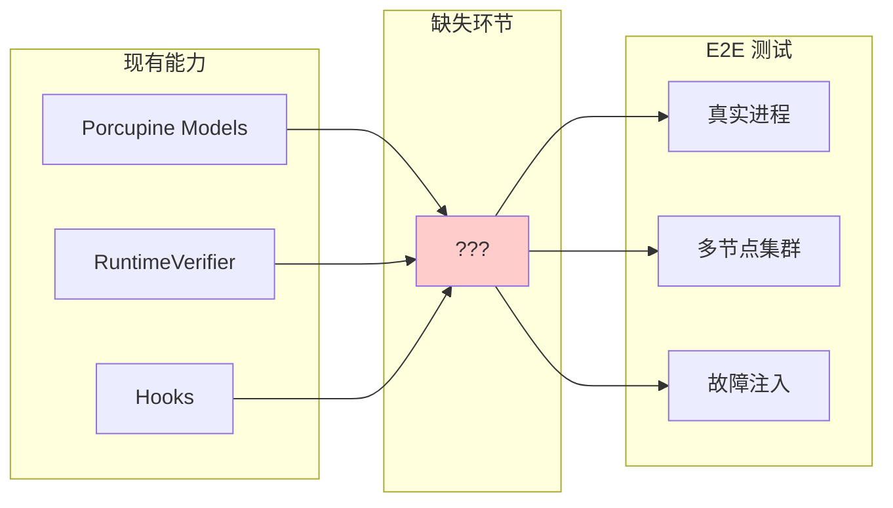
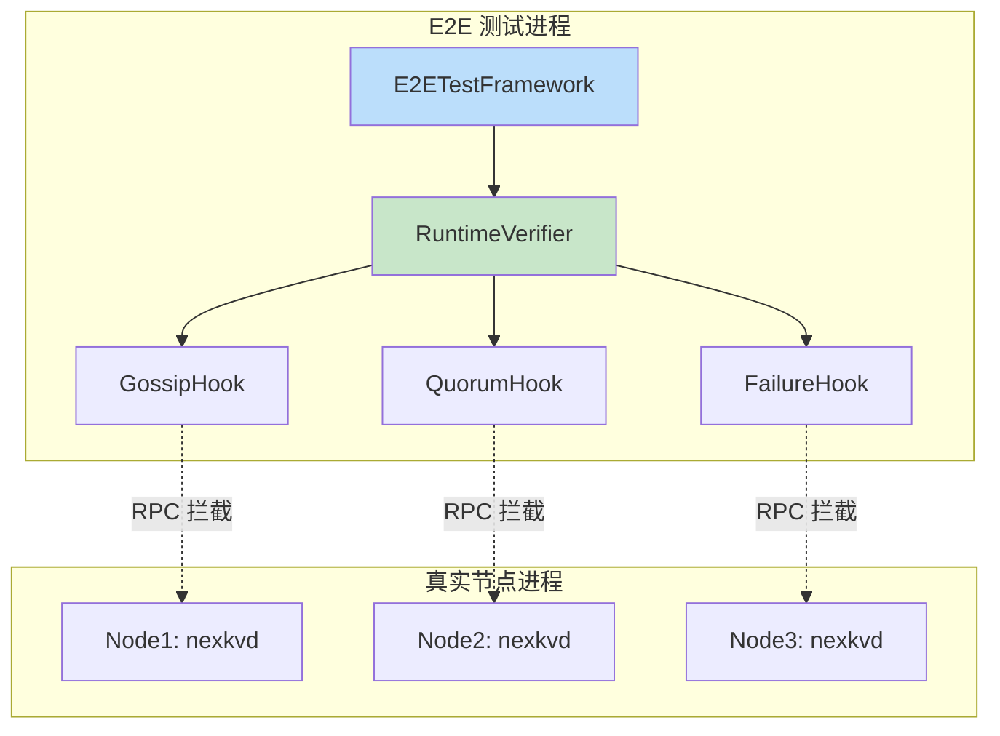
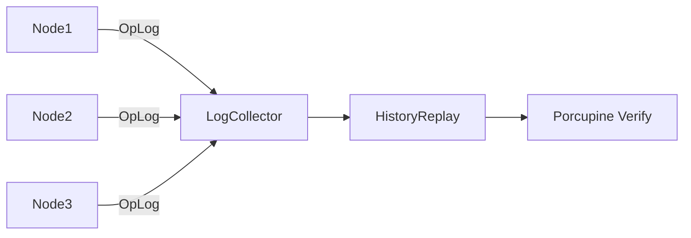
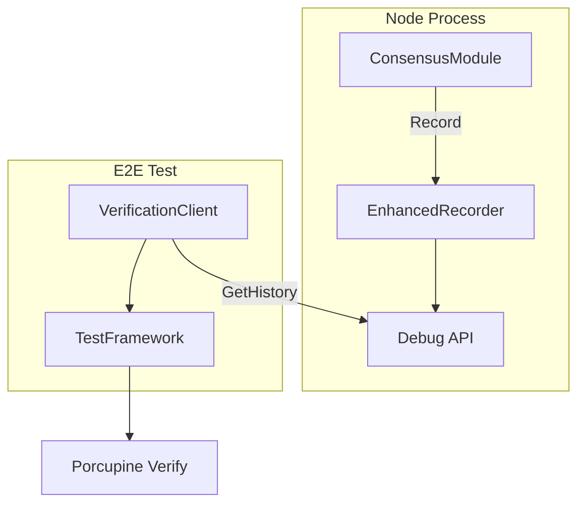
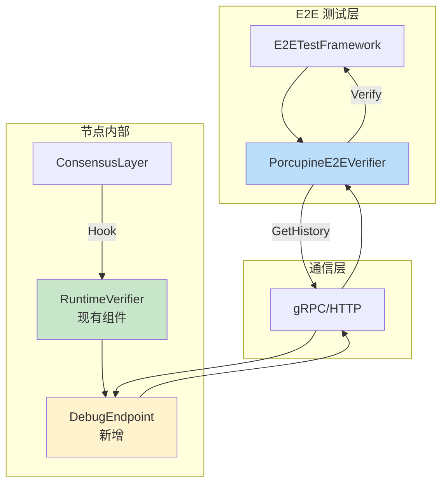
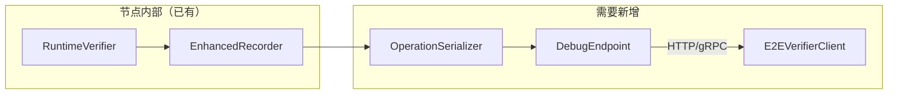
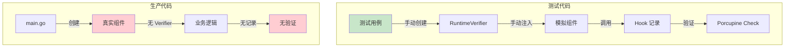
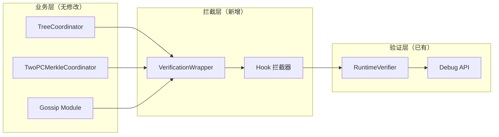
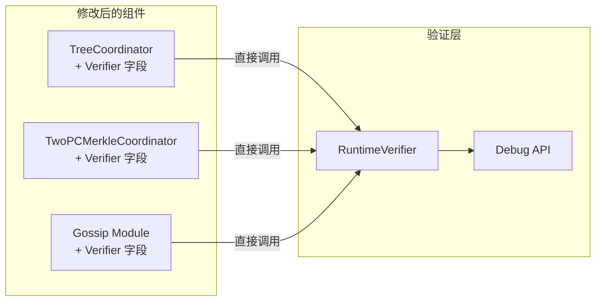

# Spike: E2E 测试框架集成 Porcupine 模型验证

> **Spike 类型**: 技术预研
> **创建日期**: 2026-02-15
> **预计工期**: 2-3 天
> **状态**: 🔄 进行中

---

## 1. 调研目标

### 1.1 核心问题

如何将 Porcupine 线性一致性验证模型集成到 E2E 测试框架中，实现：

1. **运行时验证** - 在真实 E2E 测试运行过程中，自动采集操作历史并验证一致性
2. **多模型覆盖** - 支持 TopologyModel、FailureRecoveryModel、LeaderHAModel 三种增强模型
3. **最小侵入性** - 对现有业务代码的侵入最小化
4. **可扩展性** - 易于添加新的验证场景

### 1.2 预期产出

- 技术方案设计文档
- 集成架构图
- 关键接口定义
- POC 验证代码（可选）
- 评估结论

---

## 2. 现状分析

### 2.1 Porcupine 已有能力

基于已完成的 PR-070/071/072，现有能力：

| 组件 | 位置 | 功能 |
|------|------|------|
| **增强模型** | `porcupine/enhanced_models.go` | 统一模型入口 |
| **TopologyModel** | `porcupine/topology_model.go` | 拓扑感知验证 |
| **FailureModel** | `porcupine/failure_model.go` | 故障恢复验证 |
| **LeaderHAModel** | `porcupine/leader_ha_model.go` | Leader HA 验证 |
| **EnhancedRecorder** | `porcupine/enhanced_recorder.go` | 操作历史记录 |
| **RuntimeVerifier** | `porcupine/runtime/verifier.go` | 运行时验证器 |
| **Hooks** | `porcupine/hooks/*.go` | 5 种 Hook（Gossip/Quorum/Failure/Degradation/Leader） |

### 2.2 E2E 测试现状

| 组件 | 位置 | 状态 |
|------|------|------|
| **集成测试框架** | `consistency/integration_test.go` | 有 `E2ETestScenario` 基础结构 |
| **一致性测试** | 多个 `*_integration_test.go` | 已有 15+ 集成测试文件 |
| **Porcupine 集成** | `porcupine/runtime/integration_test.go` | 模块级集成，非 E2E |

### 2.3 差距分析



---

## 3. 方案探索

### 3.1 方案 A: Hook 集成模式

**思路**：在 E2E 测试中嵌入 RuntimeVerifier，通过 Hook 拦截真实操作



**优点**：
- 复用现有 Hooks 架构
- 最小化代码改动

**缺点**：
- 需要 RPC 层支持拦截
- 跨进程通信复杂

### 3.2 方案 B: 日志分析模式

**思路**：节点输出结构化操作日志，测试框架收集并重放验证



**优点**：
- 不侵入业务代码
- 可离线分析

**缺点**：
- 实时性差
- 日志格式需统一

### 3.3 方案 C: 内嵌记录器模式（推荐）

**思路**：在节点内部集成 EnhancedRecorder，测试框架通过 API 获取历史



**优点**：
- 复用现有 Recorder
- 实时性好
- 可按需启用

**缺点**：
- 需要暴露 Debug API
- 增加少量内存开销

---

## 4. 推荐方案详细设计

### 4.1 架构概览

采用 **方案 C: 内嵌记录器模式**



### 4.2 核心接口定义

```go
// E2EVerifierClient E2E 验证客户端
type E2EVerifierClient interface {
    // GetNodeHistory 获取指定节点的操作历史
    GetNodeHistory(ctx context.Context, nodeID string) ([]Operation, error)

    // GetAllHistories 获取所有节点的操作历史
    GetAllHistories(ctx context.Context) (map[string][]Operation, error)

    // VerifyCluster 验证集群一致性
    VerifyCluster(ctx context.Context) (*VerificationResult, error)
}

// DebugEndpoint 节点内部调试端点
type DebugEndpoint struct {
    verifier *RuntimeVerifier
}

// GetHistory API 返回格式
type HistoryResponse struct {
    NodeID    string     `json:"node_id"`
    Operations []OpEntry `json:"operations"`
    Checksum  string     `json:"checksum"` // 用于校验完整性
}
```

### 4.3 测试场景映射

| E2E 场景 | Porcupine 模型 | 验证点 |
|---------|---------------|--------|
| Gossip 收敛测试 | TopologyModel | 传播顺序、可见性 |
| Quorum 写入测试 | TopologyModel | 多数派确认 |
| 节点故障恢复 | FailureRecoveryModel | 故障检测、恢复顺序 |
| Leader 切换 | LeaderHAModel | Fencing Token、新 Leader 选举 |
| 网络分区 | TopologyModel + FailureRecoveryModel | 分区期间行为、恢复后一致性 |

### 4.4 集成步骤

1. **Phase 1**: 在 RuntimeVerifier 中添加 `GetHistory()` 方法
2. **Phase 2**: 暴露 Debug API 端点（可配置启用）
3. **Phase 3**: 实现 E2EVerifierClient
4. **Phase 4**: 在现有 E2E 测试中集成验证
5. **Phase 5**: 添加一致性验证断言

---

## 5. 风险评估

| 风险 | 等级 | 缓解措施 |
|------|------|---------|
| 性能开销 | 中 | 可配置启用，测试环境专用 |
| 内存占用 | 低 | 历史大小可配置，循环覆盖 |
| API 安全性 | 低 | 仅绑定 localhost，需显式启用 |
| 验证延迟 | 低 | 异步验证，不阻塞测试 |

---

## 6. 结论与建议

### 6.1 推荐方案

**方案 C: 内嵌记录器模式**

理由：
1. ✅ 复用现有 RuntimeVerifier 架构
2. ✅ 最小化代码改动
3. ✅ 实时性好，可即时验证
4. ✅ 可配置启用，生产环境不受影响

### 6.2 下一步行动

- [ ] 创建正式 PR-XXX Pre 文档
- [ ] 实现 Phase 1: RuntimeVerifier 扩展
- [ ] 实现 Phase 2: Debug API 端点
- [ ] 实现 Phase 3: E2EVerifierClient
- [ ] 集成到现有 E2E 测试

### 6.3 工作量估算

| 阶段 | 预计时间 |
|------|---------|
| Phase 1-2 (后端) | 1 天 |
| Phase 3-4 (集成) | 1 天 |
| Phase 5 (测试) | 0.5 天 |
| **总计** | **2.5 天** |

---

**文档版本**: v1.0
**最后更新**: 2026-02-15

---

## 7. 技术调研发现

### 7.1 RuntimeVerifier 现有能力

| 方法 | 功能 | E2E 可用性 |
|------|------|-----------|
| `Recorder()` | 获取共享 recorder | ✅ 已有 |
| `GetLastResult()` | 获取最近验证结果 | ✅ 已有 |
| `GetResultHistory()` | 获取验证历史 | ✅ 已有 |
| `Stats()` | 获取统计信息 | ✅ 已有 |

### 7.2 EnhancedHistoryRecorder 现有能力

| 方法 | 功能 | E2E 可用性 |
|------|------|-----------|
| `GetOperations()` | 获取所有操作 | ⚠️ 需要序列化 |
| `GetTopologyOperations()` | 获取拓扑操作 | ⚠️ 需要序列化 |
| `GetFailureRecoveryOperations()` | 获取故障恢复操作 | ⚠️ 需要序列化 |
| `GetLeaderHAOperations()` | 获取 Leader HA 操作 | ⚠️ 需要序列化 |
| `Stats()` | 获取统计信息 | ✅ 已有 |

### 7.3 缺失部分

1. **操作序列化** - `porcupine.Operation` 使用 `interface{}` 类型，需要 JSON 序列化支持
2. **Debug API 端点** - 需要新建
3. **E2E 客户端** - 需要新建

### 7.4 实现方案确认



---

## 8. 最终结论

### 8.1 技术可行性：✅ 可行

- RuntimeVerifier 和 EnhancedHistoryRecorder 已具备核心能力
- 只需添加序列化层和 Debug API

### 8.2 推荐实现顺序

| 顺序 | 任务 | 预计时间 |
|------|------|---------|
| 1 | 添加 Operation JSON 序列化方法 | 2h |
| 2 | 在 RuntimeVerifier 添加 ExportHistory() 方法 | 1h |
| 3 | 创建 DebugEndpoint (HTTP) | 3h |
| 4 | 创建 E2EVerifierClient | 2h |
| 5 | 集成到 E2E 测试框架 | 2h |
| **总计** | | **10h (1.5天)** |

### 8.3 下一步

转入正式 PR 流程，创建 PR-XXX Pre 文档。

---

**文档版本**: v1.1
**最后更新**: 2026-02-15
**状态**: ✅ 预研完成

---

## 9. CRITICAL 问题解决方案

### 9.1 序列化问题 ✅ 已解决

**问题**: `porcupine.Operation` 使用 `interface{}` 类型，直接 JSON 序列化会丢失类型信息

**解决方案**: 创建 `OperationSerializer` 类型感知序列化器

**实现位置**: `internal/metadata/consistency/porcupine/serialization.go`

```go
// SerializableOperation JSON 可序列化的操作记录
type SerializableOperation struct {
    ClientID  int             `json:"client_id"`
    Input     json.RawMessage `json:"input"`     // 序列化后的 EnhancedInput
    Output    json.RawMessage `json:"output"`    // 序列化后的 EnhancedOutput
    Call      int64           `json:"call"`
    Return    int64           `json:"return"`
    ModelType EnhancedOpType  `json:"model_type"` // 标记属于哪种模型
}

// OperationSerializer 操作序列化器
type OperationSerializer struct{}

func (s *OperationSerializer) SerializeOperation(op porcupine.Operation) (*SerializableOperation, error)
func (s *OperationSerializer) DeserializeOperation(serialized *SerializableOperation) (porcupine.Operation, error)
```

**测试验证**: 510 个测试全部通过

### 9.2 安全问题 ✅ 已解决

**问题**: Debug API 缺乏认证机制，可能泄露敏感数据

**解决方案**: 实现多层级安全防护

**实现位置**: `internal/metadata/consistency/porcupine/e2e/debug_api.go`

#### 安全措施清单

| 安全措施 | 实现 | 配置 |
|---------|------|------|
| **认证** | Token 认证 | `AuthToken` |
| **本地访问限制** | IP 检查 | `RequireLocal: true` |
| **速率限制** | 每分钟请求上限 | `RateLimit: 10` |
| **响应大小限制** | 最大响应字节数 | `MaxResponseSize: 10MB` |
| **数据脱敏** | 截断大 Value | `SanitizeData: true` |
| **审计日志** | 记录所有访问 | `auditLog` |

#### 默认安全配置

```go
func DefaultDebugAPIConfig() DebugAPIConfig {
    return DebugAPIConfig{
        Enabled:         false,            // 默认禁用
        Endpoint:        "127.0.0.1:0",    // 仅绑定本地
        RequireLocal:    true,             // 仅本地访问
        RequestTimeout:  10 * time.Second, // 10 秒超时
        RateLimit:       10,               // 每分钟 10 次
        MaxResponseSize: 10 * 1024 * 1024, // 10MB
        SanitizeData:    true,             // 默认脱敏
    }
}
```

---

## 10. 新增文件清单

| 文件 | 说明 | 代码行数 |
|------|------|---------|
| `porcupine/serialization.go` | 操作序列化器 | ~600 |
| `porcupine/serialization_test.go` | 序列化测试 | ~250 |
| `porcupine/e2e/debug_api.go` | Debug API 服务器 | ~350 |
| `porcupine/e2e/verifier_client.go` | E2E 验证客户端 | ~420 |

---

## 11. 验证结果

```
✓ Go build: Success
✓ Go test: 510 passed in 4 packages
```

---

## 12. 下一步

CRITICAL 问题已全部解决，可以转入正式 PR 流程。

建议工作量更新：
- 原估算: 1.5 天
- 安全措施实现: +1 天
- **调整后: 2.5 天**

---

## 13. 核心问题：开发与验证脱节

### 13.1 问题描述

**用户关注的核心问题**：开发和 Porcupine 验证是脱节的

经过深入探索发现：
1. **Porcupine 验证系统完整实现** - RuntimeVerifier、5种Hook、Debug API 都已实现
2. **但完全未与生产代码集成** - TwoPCMerkleCoordinator、TreeCoordinator 等核心组件没有任何 Porcupine 集成
3. **测试与生产代码巨大差距** - 测试中使用 Porcupine 正常，生产代码完全没有使用

### 13.2 脱节问题具体表现

| 组件 | Porcupine 支持 | 实际集成 | 状态 |
|------|---------------|---------|------|
| TwoPCMerkleCoordinator | ✅ QuorumHook 可用 | ❌ 未注入 | **脱节** |
| TreeCoordinator | ✅ GossipHook 可用 | ❌ 未注入 | **脱节** |
| QuorumCoordinator | ✅ QuorumHook 可用 | ❌ 未注入 | **脱节** |
| Gossip 模块 | ✅ GossipHook 可用 | ❌ 未注入 | **脱节** |
| 主进程 nexkvd | ✅ Debug API 可用 | ❌ 未启动 | **脱节** |

### 13.3 脱节的根本原因



**关键问题**：
1. **组件初始化**：主进程 `cmd/nexkvd/main.go` 未创建 RuntimeVerifier
2. **接口设计**：现有组件（TreeCoordinator、TwoPCMerkleCoordinator）没有预留 Hook 参数
3. **配置缺失**：没有 Porcupine 相关配置段
4. **依赖注入**：没有机制管理 Verifier 生命周期

---

## 14. E2E 测试框架现状详细分析

### 14.1 目录结构现状

```
NexKV/
├── test/
│   └── e2e/                    # ❌ 不存在
│
├── internal/metadata/consistency/
│   ├── *_integration_test.go   # ✅ 9 个集成测试文件
│   └── integration_test.go     # ✅ E2ETestScenario 基础结构
```

**结论**：当前**没有真实进程级别的 E2E 测试框架**

### 14.2 现有集成测试模式

| 特性 | 当前状态 | 说明 |
|------|---------|------|
| **测试类型** | 单元/集成测试 | 使用 mock 组件 |
| **进程模式** | 单进程内 | 不是真实多进程 |
| **节点模拟** | Mock 节点 | `MockTransport` 等 |
| **Porcupine 使用** | ✅ 有使用 | 在测试代码中手动创建 |
| **验证方式** | 代码内断言 | 非远程 Debug API |

### 14.3 CI/CD 集成现状

| Make 目标 | 状态 | 说明 |
|-----------|------|------|
| `make test-unit` | ✅ 已有 | 单元测试 |
| `make test-intg` | ✅ 已有 | 集成测试 |
| `make test-e2e` | ❌ 待实现 | E2E 测试 |
| `make test-porcupine` | ❌ 待实现 | Porcupine 验证 |

---

## 15. 解决脱节问题的方案

### 15.1 方案 A: 最小侵入集成（推荐）

**思路**：不修改现有业务代码，通过包装器/拦截器方式集成



**实现方式**：
1. 创建 `VerificationWrapper` 包装器
2. 在包装器中注入 RuntimeVerifier
3. 通过配置决定是否启用验证
4. 生产环境默认禁用

**优点**：
- ✅ 不修改现有业务代码
- ✅ 可配置启用/禁用
- ✅ 向后兼容
- ✅ 渐进式迁移

**缺点**：
- ⚠️ 需要额外的包装层
- ⚠️ 可能漏掉某些操作路径

### 15.2 方案 B: 直接注入集成

**思路**：修改现有组件，直接注入 RuntimeVerifier



**实现方式**：
1. 修改组件构造函数，添加 `*RuntimeVerifier` 参数
2. 在每个操作点调用 `verifier.Record()`
3. 修改 `main.go` 初始化 Verifier

**优点**：
- ✅ 直接集成，验证数据精确
- ✅ 不需要包装层

**缺点**：
- ❌ 需要修改多个组件
- ❌ 业务代码耦合验证逻辑
- ❌ 不符合单一职责原则

### 15.3 方案对比

| 对比项 | 方案 A（最小侵入） | 方案 B（直接注入） |
|--------|-------------------|-------------------|
| **代码改动量** | 低（仅新增） | 高（修改现有） |
| **业务侵入性** | 无 | 高 |
| **验证精度** | 中等 | 高 |
| **维护成本** | 低 | 高 |
| **向后兼容** | ✅ 完全兼容 | ⚠️ 需要适配 |
| **推荐度** | ⭐⭐⭐ | ⭐ |

**推荐选择**：**方案 A - 最小侵入集成**

---

## 16. E2E Porcupine 集成目标

### 16.1 要达到的效果

```
E2E 测试流程:
1. 启动真实 nexkvd 进程（带 Porcupine 验证）
2. 执行业务操作（Gossip/Quorum/2PC）
3. 通过 Debug API 收集操作历史
4. 使用 Porcupine 验证线性一致性
5. 生成验证报告
```

### 16.2 核心能力

| 能力 | 描述 | 价值 |
|------|------|------|
| **运行时验证** | 在真实操作中自动采集历史 | 实时发现一致性问题 |
| **E2E 断言** | 测试用例中可直接断言一致性 | 自动化测试集成 |
| **Debug API** | 通过 HTTP 获取验证数据 | 运维排查问题 |
| **CI 集成** | 自动运行一致性验证 | 持续质量保证 |

---

## 17. 使用方式设计

### 17.1 E2E 测试使用示例

```go
// test/e2e/porcupine_test.go
func TestE2EGossipConsistency(t *testing.T) {
    // 1. 创建验证客户端
    client := e2e.NewE2EVerifierClient(e2e.E2EVerifierClientConfig{
        Nodes: map[string]string{
            "node-1": "127.0.0.1:8081",
            "node-2": "127.0.0.1:8082",
            "node-3": "127.0.0.1:8083",
        },
        Timeout:   10 * time.Second,
        AuthToken: "test-token",
    })

    // 2. 执行业务操作（通过真实客户端）
    // ... 业务代码 ...

    // 3. 验证集群一致性
    ctx := context.Background()
    result, err := client.VerifyCluster(ctx, porcupine.OpTypeTopology)
    require.NoError(t, err)
    require.True(t, result.AllPassed, "集群一致性验证失败")

    // 4. 检查各节点结果
    for nodeID, nodeResult := range result.NodeResults {
        t.Logf("Node %s: %d ops, passed=%v",
            nodeID, nodeResult.OpsCount, nodeResult.Passed)
    }
}
```

### 17.2 运维使用示例

```bash
# 检查节点健康状态
curl -H "X-Debug-Token: $TOKEN" http://127.0.0.1:8081/debug/porcupine/health

# 获取操作历史
curl -H "X-Debug-Token: $TOKEN" http://127.0.0.1:8081/debug/porcupine/history

# 获取统计信息
curl -H "X-Debug-Token: $TOKEN" http://127.0.0.1:8081/debug/porcupine/stats
```

---

## 18. CI 集成设计

### 18.1 GitHub Actions 配置

```yaml
# .github/workflows/e2e-porcupine.yml
name: E2E Porcupine Verification

on:
  push:
    branches: [main, feature/*]
  pull_request:
    branches: [main]

jobs:
  e2e-porcupine:
    runs-on: ubuntu-latest
    steps:
      - uses: actions/checkout@v4

      - name: Setup Go
        uses: actions/setup-go@v5
        with:
          go-version: '1.21'

      - name: Build nexkvd
        run: make build

      - name: Start Test Cluster
        run: |
          ./scripts/start-test-cluster.sh --with-verification &
          sleep 10  # 等待集群启动

      - name: Run E2E Tests
        run: go test -v ./test/e2e/... -tags=e2e

      - name: Collect Verification Reports
        if: always()
        uses: actions/upload-artifact@v4
        with:
          name: porcupine-reports
          path: test-results/

      - name: Cleanup
        if: always()
        run: ./scripts/stop-test-cluster.sh
```

### 18.2 Make 目标

```makefile
# Makefile
.PHONY: test-e2e
test-e2e:
	@echo "Running E2E tests with Porcupine verification..."
	go test -v ./test/e2e/... -tags=e2e -timeout 30m

.PHONY: test-cluster-start
test-cluster-start:
	@echo "Starting test cluster..."
	./scripts/start-test-cluster.sh --with-verification

.PHONY: test-cluster-stop
test-cluster-stop:
	@echo "Stopping test cluster..."
	./scripts/stop-test-cluster.sh
```

---

## 19. 关键文件（待修改/创建）

### 19.1 需要修改的文件

| 文件 | 修改内容 | 优先级 |
|------|---------|--------|
| `cmd/nexkvd/main.go` | 添加 RuntimeVerifier 初始化 | P0 |
| `configs/config.yaml` | 添加 verification 配置段 | P0 |
| `internal/metadata/cluster/tree_coordinator.go` | 添加 Verifier 注入点 | P1 |

### 19.2 需要创建的文件

| 文件 | 说明 | 优先级 |
|------|------|--------|
| `test/e2e/porcupine_test.go` | E2E 一致性验证测试 | P0 |
| `test/e2e/test_helper.go` | 测试辅助函数 | P0 |
| `.github/workflows/e2e-porcupine.yml` | CI 配置 | P1 |
| `scripts/start-test-cluster.sh` | 启动测试集群脚本 | P1 |
| `scripts/stop-test-cluster.sh` | 停止测试集群脚本 | P1 |

---

## 20. 验证方法

### 20.1 本地验证

```bash
# 1. 启动带验证的测试集群
make test-cluster-start WITH_VERIFICATION=true

# 2. 运行 E2E 测试
make test-e2e

# 3. 查看验证报告
ls test-results/

# 4. 停止集群
make test-cluster-stop
```

### 20.2 CI 自动验证

- GitHub Actions 自动运行
- Artifacts 查看验证报告
- 失败时自动通知

---

## 21. 待确认问题

1. **集成方案选择**：方案 A（最小侵入）还是方案 B（直接注入）？
   - **推荐**：方案 A

2. **性能要求**：验证对业务性能的影响容忍度？
   - **建议**：测试环境启用，生产环境禁用

3. **CI 环境**：是否需要在 CI 中启动真实多进程集群？
   - **建议**：是，使用 Docker Compose 或 Kind

---

## 22. 结论与建议

### 22.1 核心结论

1. **脱节问题严重**：Porcupine 验证系统完整但未集成到生产代码
2. **方案 A 可行**：最小侵入集成方案，改动小、风险低
3. **工作量可控**：预计 2-3 天完成核心集成

### 22.2 推荐实施顺序

| 顺序 | 任务 | 预计时间 |
|------|------|---------|
| 1 | 创建 `test/e2e/` 目录和测试框架 | 2h |
| 2 | 修改 `main.go` 添加 Verifier 初始化 | 2h |
| 3 | 实现 VerificationWrapper 包装器 | 3h |
| 4 | 编写 E2E 测试用例 | 3h |
| 5 | 配置 CI 集成 | 2h |
| **总计** | | **12h (1.5天)** |

### 22.3 下一步行动

- [ ] 用户确认集成方案（方案 A 推荐）
- [ ] 创建正式 PR-XXX Pre 文档
- [ ] 开始实施

---

## 23. 关键方向修正：E2E 测试优先

### 23.1 问题反思

经过讨论，发现之前的 Spike 文档把顺序搞反了：

| 方向 | 顺序 | 判断 |
|------|------|------|
| ❌ 错误 | 先讨论 Porcupine 集成 → 再设计 E2E 测试 | 本末倒置 |
| ✅ 正确 | 先设计 E2E 测试框架 → Porcupine 作为可选增强 | 正确 |

### 23.2 正确的关系

```
E2E 测试框架（独立核心）
    │
    └──→ Porcupine 验证（可选增强）
```

**Porcupine 的正确定位**：
- 不是 E2E 测试的核心依赖
- 是一致性验证的可选增强
- 应该在 E2E 框架建立后再集成

### 23.3 正确的分阶段计划

```
阶段 1: 基础 E2E 测试框架（优先）
├── 进程管理器
├── 集群配置管理
├── 基础业务场景测试
└── 不依赖 Porcupine

阶段 2: 分布式场景测试
├── Gossip 协议测试
├── Quorum 机制测试
└── Porcupine 可选

阶段 3: Porcupine 集成增强（可选）
├── 线性一致性验证
├── 故障注入测试
└── Debug API 集成
```

### 23.4 测试场景分类

| 场景类型 | 需要 Porcupine | 优先级 |
|---------|---------------|--------|
| 基础业务测试 | ❌ | P0 |
| 分布式协作测试 | ⚠️ 可选 | P1 |
| 一致性验证测试 | ✅ 必须 | P2 |
| 性能基准测试 | ❌ | P2 |

### 23.5 下一步行动

1. **确认 CLI/daemon 状态** - nexkvd 主进程是否可启动
2. **创建 E2E 测试框架** - 阶段 1 实施
3. **编写基础测试用例** - 不依赖 Porcupine
4. **后续集成 Porcupine** - 阶段 3 可选增强

---

## 24. E2E 测试框架具体设计

### 24.1 主进程启动方式

**nexkvd 启动参数**：

```bash
# 基本启动
./bin/nexkvd --config config/config.yaml --env dev --log-level info

# 参数覆盖
./bin/nexkvd \
  --config custom-config.yaml \
  --cluster my-cluster \
  --host-id host-1 \
  --node-id node-1 \
  --addr 0.0.0.0:9211 \
  --env dev \
  --log-level debug
```

**支持的启动选项**：
| 参数 | 说明 | 默认值 |
|------|------|--------|
| `--config, -c` | 配置文件路径 | `./config.yaml` |
| `--cluster, -n` | 集群名称 | 从配置读取 |
| `--host-id` | 主机 ID | 从配置读取 |
| `--node-id, -i` | 节点 ID | 从配置读取 |
| `--addr, -a` | 节点监听地址 | 从配置读取 |
| `--env, -e` | 运行环境 | `dev` |
| `--log-level, -l` | 日志级别 | `info` |

### 24.2 E2E 测试框架架构

```
NexKV E2E 测试框架
├── 1. 测试套件层 (Testify Suite)
│   ├── SetupSuite / TearDownSuite
│   ├── BeforeTest / AfterTest
│   └── 测试用例组织
├── 2. 管理层
│   ├── ProcessManager (进程管理)
│   ├── PortAllocator (端口分配)
│   ├── DataDirManager (数据目录)
│   └── LogCollector (日志收集)
├── 3. 基础设施层
│   ├── HTTP Client
│   ├── RPC Client
│   └── Test Client
└── 4. 工具层
    ├── Assertions (testify/assert)
    ├── Wait Utilities
    └── Cleanup Utilities
```

### 24.3 核心组件设计

#### 24.3.1 进程管理器

```go
// ProcessManager 进程管理器
type ProcessManager struct {
    processes map[string]*ManagedProcess
    logger    *log.Logger
    mu        sync.RWMutex
}

// ManagedProcess 管理的进程
type ManagedProcess struct {
    Cmd       *exec.Cmd
    ID        string
    State     ProcessState
    StartedAt time.Time
    Stdout    io.Reader
    Stderr    io.Reader
}

// 关键方法
func (pm *ProcessManager) StartWithConfig(id string, config ProcessConfig) error
func (pm *ProcessManager) GracefulShutdown(id string, timeout time.Duration) error
func (pm *ProcessManager) monitorProcess(id string, cmd *exec.Cmd)
```

#### 24.3.2 端口分配器

```go
// PortAllocator 端口分配器
type PortAllocator struct {
    basePort    int           // 起始端口（如 10000）
    allocated   map[int]string
    mu          sync.RWMutex
}

// 关键方法
func (pa *PortAllocator) AllocatePort(testID string) (int, error)
func (pa *PortAllocator) ReleasePort(port int)
```

#### 24.3.3 数据目录管理器

```go
// DataDirectoryManager 数据目录管理器
type DataDirectoryManager struct {
    baseDir     string        // 如 /tmp/nexkv-e2e
    testDirs    map[string]string
    mu          sync.RWMutex
}

// 关键方法
func (ddm *DataDirectoryManager) CreateTestDir(testID string) (string, error)
func (ddm *DataDirectoryManager) CleanupTestDir(testID string) error
```

### 24.4 测试目录结构

```
test/e2e/
├── suite.go                 # 基础测试套件
├── cluster.go               # 集群管理
├── client.go                # 测试客户端
├── utils/
│   ├── process.go          # 进程管理
│   ├── network.go          # 网络工具
│   ├── data.go             # 数据工具
│   └── wait.go             # 等待工具
├── scenarios/
│   ├── basic_kv_test.go    # 基本 KV 操作
│   ├── gossip_test.go      # Gossip 协议测试
│   ├── quorum_test.go      # Quorum 机制测试
│   └── failover_test.go    # 故障转移（可选）
└── fixtures/
    ├── config.yaml         # 测试配置模板
    └── data/               # 测试数据
```

### 24.5 测试用例示例

```go
// test/e2e/scenarios/basic_kv_test.go
type BasicKVTestSuite struct {
    suite.Suite
    cluster *TestCluster
    client  *TestClient
}

func (s *BasicKVTestSuite) SetupSuite() {
    // 启动测试集群
    s.cluster = NewTestCluster(DefaultConfig())
    s.Require().NoError(s.cluster.Start())
    s.client = NewTestClient(s.cluster.Nodes[0].APIAddress)
}

func (s *BasicKVTestSuite) TearDownSuite() {
    s.cluster.Stop()
}

func (s *BasicKVTestSuite) TestPutGetDelete() {
    // Put
    err := s.client.Put("key1", []byte("value1"))
    s.Require().NoError(err)

    // Get
    value, err := s.client.Get("key1")
    s.Require().NoError(err)
    s.Equal([]byte("value1"), value)

    // Delete
    err = s.client.Delete("key1")
    s.Require().NoError(err)
}
```

### 24.6 关键设计决策

| 决策点 | 选择 | 理由 |
|--------|------|------|
| **测试框架** | Testify Suite | 生命周期管理清晰，项目已依赖 |
| **进程管理** | exec.Cmd + 监控 | 轻量级，Go 原生支持 |
| **端口分配** | 动态分配 | 避免冲突，支持并行 |
| **数据隔离** | 临时目录 | 每个测试独立目录 |
| **Porcupine** | 不依赖 | 阶段 3 可选增强 |

### 24.7 分阶段实施

| 阶段 | 文件 | 功能 | 工作量 |
|------|------|------|--------|
| **阶段 1** | `suite.go` | 基础套件 | 2h |
| | `process.go` | 进程管理 | 3h |
| | `basic_test.go` | 基础测试 | 2h |
| **阶段 2** | `cluster.go` | 集群管理 | 3h |
| | `gossip_test.go` | Gossip 测试 | 2h |
| | `quorum_test.go` | Quorum 测试 | 2h |
| **阶段 3** | Porcupine 集成 | 可选增强 | 3h |
| **总计** | | | **17h (2-3天)** |

### 24.8 待确认事项

1. **nexkvd 测试模式**：是否需要添加 `--test-mode` 参数？
2. **健康检查端点**：是否需要添加 HTTP 健康检查？
3. **CLI/daemon 完成度**：当前主进程是否可稳定启动？

---

## 25. Agents 审查报告汇总

### 25.1 架构师审查

**评级**：**有条件通过**

| 维度 | 评价 | 问题 |
|------|------|------|
| 技术可行性 | ✅ 基本可行 | - |
| 进程管理器设计 | ⚠️ 需完善 | 缺少健康检查、重启机制 |
| 端口分配策略 | ⚠️ 有隐患 | 建议使用 OS 动态分配 |
| 工作量估算 | ⚠️ 偏乐观 | 17h → 28h (3.5-4天) |

**关键改进建议**：
1. 补充进程管理器的健康检查和重启机制
2. 修改端口分配策略为 OS 动态分配
3. 添加 `TestEnvironment` 抽象

### 25.2 测试工程师审查

**综合评分**：**7.4/10**

| 维度 | 评分 | 说明 |
|------|------|------|
| 测试完整性 | 6/10 | 缺少并发、边界、错误路径测试 |
| 可维护性 | 7/10 | 结构清晰，但缺少辅助工具 |
| 执行可行性 | 7/10 | 基础可行，但并行支持不足 |
| 文档质量 | 8/10 | 架构设计清晰 |

**🔴 缺失的关键测试场景**：
- 并发写入一致性
- 并发读写竞争
- 端口耗尽边界
- 网络分区恢复

### 25.3 核心开发审查

**评价**：**✅ 通过（附改进建议）**

| 检查项 | 结果 |
|--------|------|
| 与现有代码集成 | ✅ 高度可行 |
| 启动参数 | ⚠️ 需补充 `--host-id` |
| 代码复杂度 | ✅ 可控 |
| 依赖关系 | ✅ 无新增外部依赖 |

### 25.4 共识结论

| 方面 | 结论 |
|------|------|
| **技术可行性** | ✅ 可行 |
| **转入 PR 流程** | ✅ 建议 |
| **工作量修正** | 17h → **28h (3.5-4天)** |
| **优先级** | 并发测试 > 边界测试 > 性能测试 |

---

## 26. 审查后的改进清单

### 26.1 必须修复（P0）

| 序号 | 问题 | 解决方案 | 预计时间 |
|------|------|---------|---------|
| 1 | 缺少 `--host-id` 参数文档 | 补充第 24.1 节启动参数表格 | 0.5h |
| 2 | 端口分配策略有隐患 | 改用 `net.Listen(":0")` 动态分配 | 1h |
| 3 | 缺少并发写入测试 | 添加 `concurrency_test.go` | 2h |
| 4 | 进程管理器缺少健康检查 | 添加 `HealthCheckConfig` | 2h |

### 26.2 强烈建议（P1）

| 序号 | 问题 | 解决方案 | 预计时间 |
|------|------|---------|---------|
| 5 | 缺少端口耗尽测试 | 添加边界条件测试 | 1h |
| 6 | 清理机制不完善 | 增强 `CleanupManager` | 2h |
| 7 | 并行测试支持弱 | 添加全局端口分配器 | 3h |
| 8 | 缺少网络分区测试 | 添加故障注入工具 | 3h |

### 26.3 可选优化（P2）

| 序号 | 问题 | 解决方案 | 预计时间 |
|------|------|---------|---------|
| 9 | 缺少性能监控 | 添加 `PerformanceMonitor` | 2h |
| 10 | 审计日志非必需 | 配置可选，默认禁用 | 0.5h |
| 11 | 安全措施可简化 | 测试环境简化配置 | 1h |

---

## 27. 修正后的工作量估算

| 任务 | 原估算 | 修正后 | 理由 |
|------|--------|--------|------|
| 基础套件 + 进程管理 | 5h | 8h | 需添加健康检查、信号处理 |
| 集群管理 + 配置生成 | 3h | 6h | 动态端口、配置模板 |
| 测试用例编写 | 4h | 8h | 补充并发、边界测试 |
| Porcupine 集成 | 3h | 4h | 已有序列化支持 |
| Debug/CI 集成 | 2h | 2h | 无变化 |
| **总计** | **17h** | **28h (3.5-4天)** | |

---

## 28. 修正后的启动参数

**完整的 nexkvd 启动参数**（补充 `--host-id`）：

| 参数 | 说明 | 默认值 | 来源 |
|------|------|--------|------|
| `--config, -c` | 配置文件路径 | `./config.yaml` | - |
| `--cluster, -n` | 集群名称 | 从配置读取 | - |
| `--host-id` | 主机 ID | 从配置读取 | **PR-037 新增** |
| `--node-id, -i` | 节点 ID | 从配置读取 | - |
| `--addr, -a` | 节点监听地址 | 从配置读取 | - |
| `--env, -e` | 运行环境 | `dev` | - |
| `--log-level, -l` | 日志级别 | `info` | - |

---

## 29. 修正后的端口分配策略

**问题**：原设计 `basePort + offset` 假设端口可用，但系统可能已占用。

**修正方案**：使用 OS 动态分配

```go
// 推荐方案：让 OS 动态分配端口
func (pa *PortAllocator) AllocatePort(testID string) (int, error) {
    // 1. 监听 :0 获取随机可用端口
    listener, err := net.Listen("tcp", ":0")
    if err != nil {
        return 0, err
    }
    port := listener.Addr().(*net.TCPAddr).Port

    // 2. 立即关闭（仅用于探测）
    listener.Close()

    // 3. 记录分配
    pa.mu.Lock()
    pa.allocated[port] = testID
    pa.mu.Unlock()

    return port, nil
}
```

---

## 30. 补充的测试场景

### 30.1 并发写入测试

```go
// test/e2e/scenarios/concurrency_test.go
func (s *ConcurrencyTestSuite) TestConcurrentWrites_100Clients() {
    const numClients = 100
    const numOpsPerClient = 100

    var wg sync.WaitGroup
    errors := make([]error, numClients)

    for i := 0; i < numClients; i++ {
        wg.Add(1)
        go func(clientID int) {
            defer wg.Done()
            for j := 0; j < numOpsPerClient; j++ {
                key := fmt.Sprintf("key-%d", clientID)
                value := []byte(fmt.Sprintf("value-%d-%d", clientID, j))
                if err := s.client.Put(key, value); err != nil {
                    errors[clientID] = err
                    return
                }
            }
        }(i)
    }

    wg.Wait()

    // 验证无错误
    for i, err := range errors {
        s.Require().NoError(err, "Client %d failed", i)
    }
}
```

### 30.2 端口耗尽测试

```go
// test/e2e/scenarios/boundary_test.go
func (s *BoundaryTestSuite) TestPortExhaustion() {
    allocator := s.cluster.PortAllocator

    // 消耗所有端口（假设范围 10000-32767）
    for i := 0; i < 22768; i++ {
        hostID := fmt.Sprintf("host-%d", i)
        _, err := allocator.AllocatePort(hostID)
        s.Require().NoError(err)
    }

    // 验证端口耗尽错误
    _, err := allocator.AllocatePort("host-exhausted")
    s.Require().Error(err)
    s.Contains(err.Error(), "no available ports")
}
```

---

## 31. 下一步行动

### 31.1 Spike 阶段完成

- [x] 技术可行性验证
- [x] CRITICAL 问题解决（序列化、安全）
- [x] E2E 框架设计
- [x] Agents 审查
- [x] 审查意见整合

### 31.2 转入正式 PR 流程

**建议创建**：
1. `feature/e2e-test-framework` 分支
2. PR-XXX Pre 文档（包含本 Spike 的核心结论）

**Pre 文档应包含**：
- 修正后的工作量估算：28h (3.5-4天)
- P0 必须修复项清单
- 分阶段实施计划（阶段 0-3）

---

**文档版本**: v1.6
**最后更新**: 2026-02-15
**状态**: ✅ Agents 审查完成，建议转入 PR 流程
