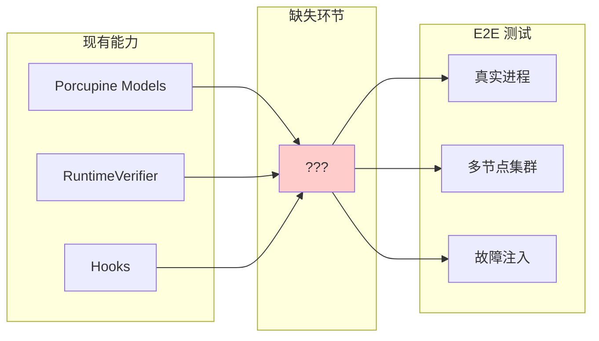
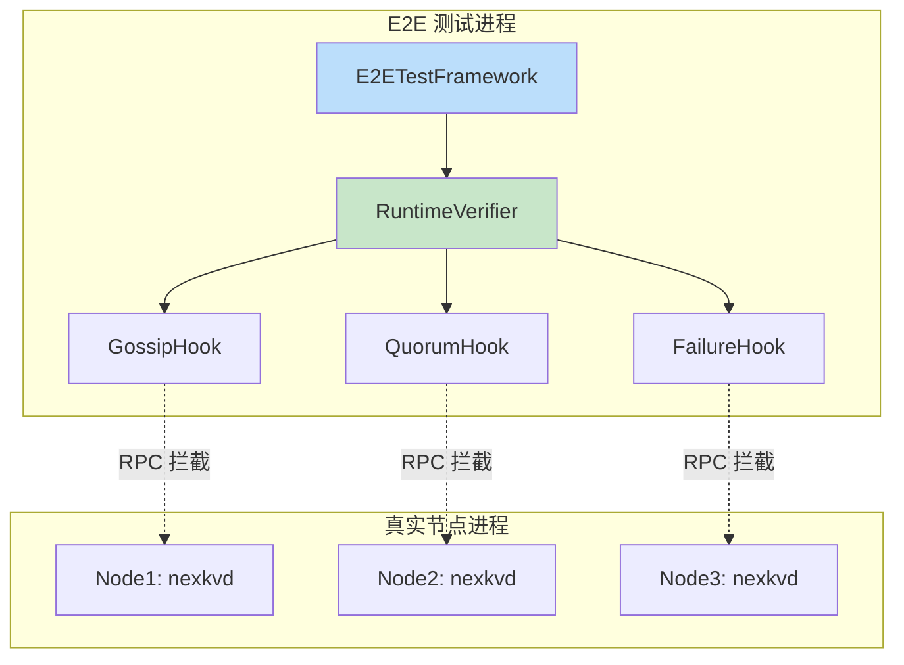
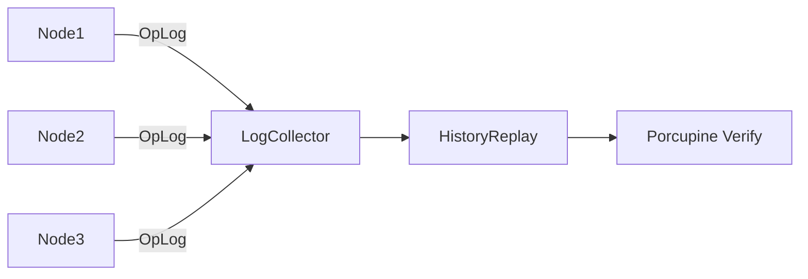
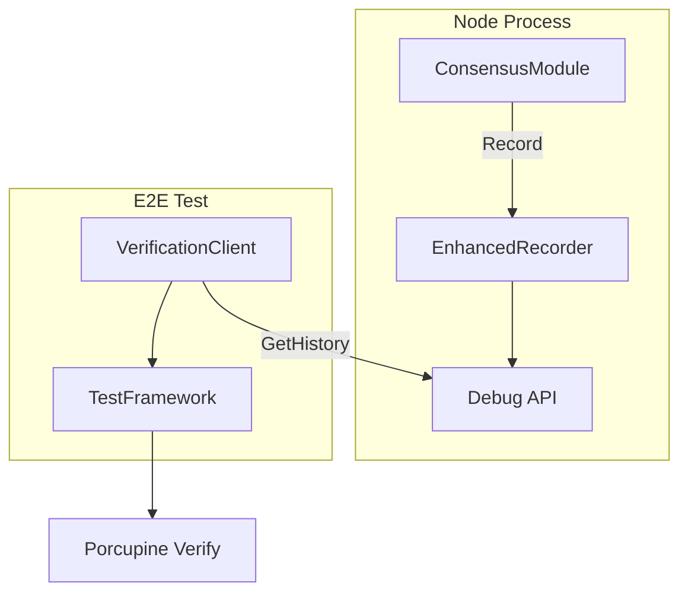
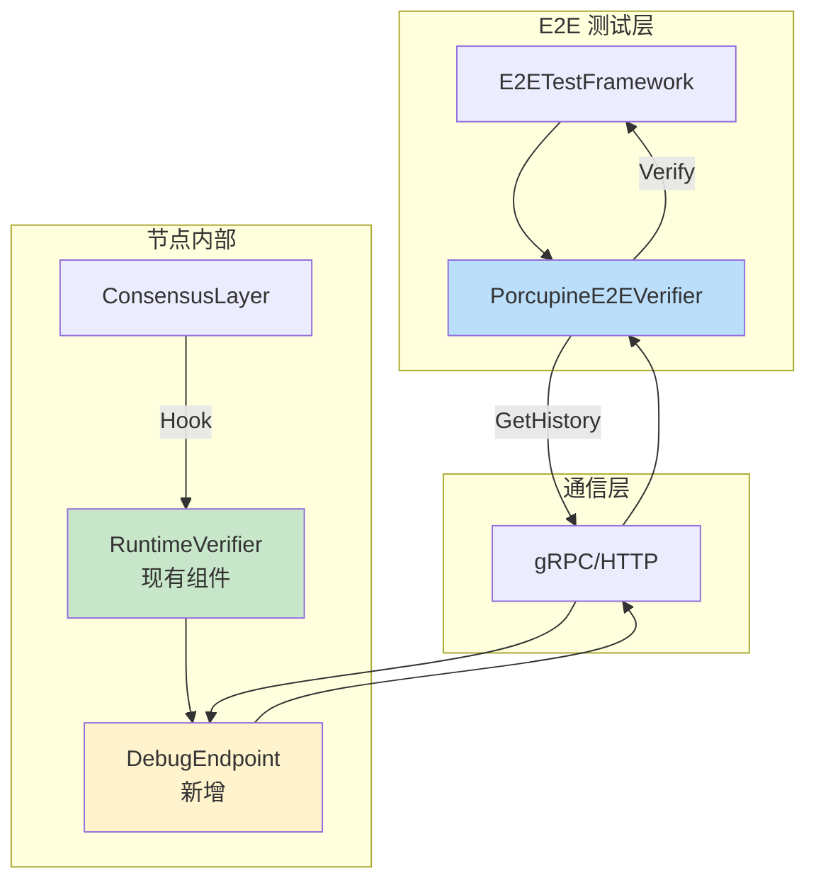
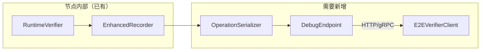

# Spike: E2E 测试框架集成 Porcupine 模型验证

> **Spike 类型**: 技术预研
> **创建日期**: 2026-02-15
> **预计工期**: 2-3 天
> **状态**: 🔄 进行中

---

## 1. 调研目标

### 1.1 核心问题

如何将 Porcupine 线性一致性验证模型集成到 E2E 测试框架中，实现：

1. **运行时验证** - 在真实 E2E 测试运行过程中，自动采集操作历史并验证一致性
2. **多模型覆盖** - 支持 TopologyModel、FailureRecoveryModel、LeaderHAModel 三种增强模型
3. **最小侵入性** - 对现有业务代码的侵入最小化
4. **可扩展性** - 易于添加新的验证场景

### 1.2 预期产出

- 技术方案设计文档
- 集成架构图
- 关键接口定义
- POC 验证代码（可选）
- 评估结论

---

## 2. 现状分析

### 2.1 Porcupine 已有能力

基于已完成的 PR-070/071/072，现有能力：

| 组件 | 位置 | 功能 |
|------|------|------|
| **增强模型** | `porcupine/enhanced_models.go` | 统一模型入口 |
| **TopologyModel** | `porcupine/topology_model.go` | 拓扑感知验证 |
| **FailureModel** | `porcupine/failure_model.go` | 故障恢复验证 |
| **LeaderHAModel** | `porcupine/leader_ha_model.go` | Leader HA 验证 |
| **EnhancedRecorder** | `porcupine/enhanced_recorder.go` | 操作历史记录 |
| **RuntimeVerifier** | `porcupine/runtime/verifier.go` | 运行时验证器 |
| **Hooks** | `porcupine/hooks/*.go` | 5 种 Hook（Gossip/Quorum/Failure/Degradation/Leader） |

### 2.2 E2E 测试现状

| 组件 | 位置 | 状态 |
|------|------|------|
| **集成测试框架** | `consistency/integration_test.go` | 有 `E2ETestScenario` 基础结构 |
| **一致性测试** | 多个 `*_integration_test.go` | 已有 15+ 集成测试文件 |
| **Porcupine 集成** | `porcupine/runtime/integration_test.go` | 模块级集成，非 E2E |

### 2.3 差距分析



---

## 3. 方案探索

### 3.1 方案 A: Hook 集成模式

**思路**：在 E2E 测试中嵌入 RuntimeVerifier，通过 Hook 拦截真实操作



**优点**：
- 复用现有 Hooks 架构
- 最小化代码改动

**缺点**：
- 需要 RPC 层支持拦截
- 跨进程通信复杂

### 3.2 方案 B: 日志分析模式

**思路**：节点输出结构化操作日志，测试框架收集并重放验证



**优点**：
- 不侵入业务代码
- 可离线分析

**缺点**：
- 实时性差
- 日志格式需统一

### 3.3 方案 C: 内嵌记录器模式（推荐）

**思路**：在节点内部集成 EnhancedRecorder，测试框架通过 API 获取历史



**优点**：
- 复用现有 Recorder
- 实时性好
- 可按需启用

**缺点**：
- 需要暴露 Debug API
- 增加少量内存开销

---

## 4. 推荐方案详细设计

### 4.1 架构概览

采用 **方案 C: 内嵌记录器模式**



### 4.2 核心接口定义

```go
// E2EVerifierClient E2E 验证客户端
type E2EVerifierClient interface {
    // GetNodeHistory 获取指定节点的操作历史
    GetNodeHistory(ctx context.Context, nodeID string) ([]Operation, error)

    // GetAllHistories 获取所有节点的操作历史
    GetAllHistories(ctx context.Context) (map[string][]Operation, error)

    // VerifyCluster 验证集群一致性
    VerifyCluster(ctx context.Context) (*VerificationResult, error)
}

// DebugEndpoint 节点内部调试端点
type DebugEndpoint struct {
    verifier *RuntimeVerifier
}

// GetHistory API 返回格式
type HistoryResponse struct {
    NodeID    string     `json:"node_id"`
    Operations []OpEntry `json:"operations"`
    Checksum  string     `json:"checksum"` // 用于校验完整性
}
```

### 4.3 测试场景映射

| E2E 场景 | Porcupine 模型 | 验证点 |
|---------|---------------|--------|
| Gossip 收敛测试 | TopologyModel | 传播顺序、可见性 |
| Quorum 写入测试 | TopologyModel | 多数派确认 |
| 节点故障恢复 | FailureRecoveryModel | 故障检测、恢复顺序 |
| Leader 切换 | LeaderHAModel | Fencing Token、新 Leader 选举 |
| 网络分区 | TopologyModel + FailureRecoveryModel | 分区期间行为、恢复后一致性 |

### 4.4 集成步骤

1. **Phase 1**: 在 RuntimeVerifier 中添加 `GetHistory()` 方法
2. **Phase 2**: 暴露 Debug API 端点（可配置启用）
3. **Phase 3**: 实现 E2EVerifierClient
4. **Phase 4**: 在现有 E2E 测试中集成验证
5. **Phase 5**: 添加一致性验证断言

---

## 5. 风险评估

| 风险 | 等级 | 缓解措施 |
|------|------|---------|
| 性能开销 | 中 | 可配置启用，测试环境专用 |
| 内存占用 | 低 | 历史大小可配置，循环覆盖 |
| API 安全性 | 低 | 仅绑定 localhost，需显式启用 |
| 验证延迟 | 低 | 异步验证，不阻塞测试 |

---

## 6. 结论与建议

### 6.1 推荐方案

**方案 C: 内嵌记录器模式**

理由：
1. ✅ 复用现有 RuntimeVerifier 架构
2. ✅ 最小化代码改动
3. ✅ 实时性好，可即时验证
4. ✅ 可配置启用，生产环境不受影响

### 6.2 下一步行动

- [ ] 创建正式 PR-XXX Pre 文档
- [ ] 实现 Phase 1: RuntimeVerifier 扩展
- [ ] 实现 Phase 2: Debug API 端点
- [ ] 实现 Phase 3: E2EVerifierClient
- [ ] 集成到现有 E2E 测试

### 6.3 工作量估算

| 阶段 | 预计时间 |
|------|---------|
| Phase 1-2 (后端) | 1 天 |
| Phase 3-4 (集成) | 1 天 |
| Phase 5 (测试) | 0.5 天 |
| **总计** | **2.5 天** |

---

**文档版本**: v1.0
**最后更新**: 2026-02-15

---

## 7. 技术调研发现

### 7.1 RuntimeVerifier 现有能力

| 方法 | 功能 | E2E 可用性 |
|------|------|-----------|
| `Recorder()` | 获取共享 recorder | ✅ 已有 |
| `GetLastResult()` | 获取最近验证结果 | ✅ 已有 |
| `GetResultHistory()` | 获取验证历史 | ✅ 已有 |
| `Stats()` | 获取统计信息 | ✅ 已有 |

### 7.2 EnhancedHistoryRecorder 现有能力

| 方法 | 功能 | E2E 可用性 |
|------|------|-----------|
| `GetOperations()` | 获取所有操作 | ⚠️ 需要序列化 |
| `GetTopologyOperations()` | 获取拓扑操作 | ⚠️ 需要序列化 |
| `GetFailureRecoveryOperations()` | 获取故障恢复操作 | ⚠️ 需要序列化 |
| `GetLeaderHAOperations()` | 获取 Leader HA 操作 | ⚠️ 需要序列化 |
| `Stats()` | 获取统计信息 | ✅ 已有 |

### 7.3 缺失部分

1. **操作序列化** - `porcupine.Operation` 使用 `interface{}` 类型，需要 JSON 序列化支持
2. **Debug API 端点** - 需要新建
3. **E2E 客户端** - 需要新建

### 7.4 实现方案确认



---

## 8. 最终结论

### 8.1 技术可行性：✅ 可行

- RuntimeVerifier 和 EnhancedHistoryRecorder 已具备核心能力
- 只需添加序列化层和 Debug API

### 8.2 推荐实现顺序

| 顺序 | 任务 | 预计时间 |
|------|------|---------|
| 1 | 添加 Operation JSON 序列化方法 | 2h |
| 2 | 在 RuntimeVerifier 添加 ExportHistory() 方法 | 1h |
| 3 | 创建 DebugEndpoint (HTTP) | 3h |
| 4 | 创建 E2EVerifierClient | 2h |
| 5 | 集成到 E2E 测试框架 | 2h |
| **总计** | | **10h (1.5天)** |

### 8.3 下一步

转入正式 PR 流程，创建 PR-XXX Pre 文档。

---

**文档版本**: v1.1
**最后更新**: 2026-02-15
**状态**: ✅ 预研完成
