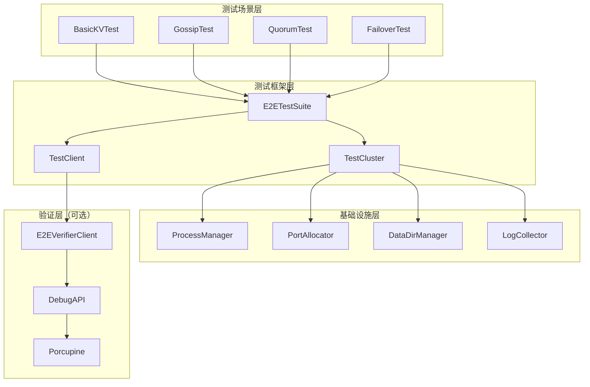
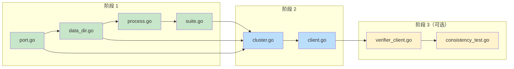

# E2E 测试框架实现路线图

> **For Claude:** REQUIRED SUB-SKILL: Use superpowers:executing-plans to implement this plan task-by-task.

**Goal:** 构建真实进程级别的 E2E 测试框架，支持多节点集群测试、Porcupine 一致性验证和故障注入

**Architecture:** 采用分层架构设计 - 进程管理层 → 集群管理层 → 测试客户端层 → 测试场景层。使用 Testify Suite 管理测试生命周期，动态端口分配避免冲突，数据目录隔离保证测试独立性。

**Tech Stack:** Go 1.21+, Testify, exec.Cmd, libp2p RPC, Porcupine, pingcap/failpoint

---

## 目录

1. [总体架构](#1-总体架构)
2. [分阶段实施计划](#2-分阶段实施计划)
3. [详细任务清单](#3-详细任务清单)
4. [文件结构](#4-文件结构)
5. [依赖关系图](#5-依赖关系图)
6. [验收标准](#6-验收标准)
7. [风险评估](#7-风险评估)

---

## 1. 总体架构



### 1.1 核心组件说明

| 组件 | 职责 | 文件 |
|------|------|------|
| **ProcessManager** | 进程生命周期管理（启动、停止、重启、健康检查） | `process.go` |
| **PortAllocator** | 动态端口分配（OS 随机分配，避免冲突） | `port.go` |
| **DataDirManager** | 测试数据目录管理（创建、隔离、清理） | `data_dir.go` |
| **TestCluster** | 集群配置和节点管理 | `cluster.go` |
| **TestClient** | KV 操作客户端封装 | `client.go` |
| **E2EVerifierClient** | Porcupine 验证客户端（可选） | `verifier_client.go` |

### 1.2 关键设计决策

| 决策点 | 选择 | 理由 |
|--------|------|------|
| **测试框架** | Testify Suite | 生命周期管理清晰，项目已依赖 |
| **进程管理** | exec.Cmd + 监控 | 轻量级，Go 原生支持 |
| **端口分配** | OS 动态分配 (`:0`) | 避免冲突，支持并行 |
| **数据隔离** | 临时目录（`/tmp/nexkv-e2e`） | 每个测试独立目录 |
| **故障注入** | pingcap/failpoint | 无需系统权限，CI 兼容 |
| **Porcupine** | 可选增强 | 不作为核心依赖 |

---

## 2. 分阶段实施计划

### 阶段 0: 预备工作（1h）

**目标**：确认环境就绪，创建目录结构

```
✅ 确认 nexkvd 可编译运行
✅ 创建 test/e2e/ 目录结构
✅ 添加 Makefile 目标
```

### 阶段 1: 基础框架（8h）

**目标**：能启动/停止单个 nexkvd 进程，执行基础 KV 操作

```
├── process.go (进程管理器)
├── port.go (端口分配器)
├── data_dir.go (数据目录管理)
├── suite.go (基础测试套件)
└── basic_kv_test.go (基础测试用例)
```

### 阶段 2: 集群管理（6h）

**目标**：支持多节点集群启动和管理

```
├── cluster.go (集群管理器)
├── client.go (测试客户端)
├── config_builder.go (配置生成器)
└── gossip_test.go (Gossip 测试)
```

### 阶段 3: Porcupine 集成（6h）【可选】

**目标**：集成一致性验证

```
├── verifier_client.go (验证客户端)
├── assertions.go (验证断言)
└── consistency_test.go (一致性测试)
```

### 阶段 4: 故障注入与 CI（8h）【可选】

**目标**：故障注入测试，CI 集成

```
├── fault_injector.go (故障注入器)
├── failover_test.go (故障转移测试)
├── .github/workflows/e2e-testing.yml
└── scripts/e2e-*.sh
```

---

## 3. 详细任务清单

### Task 1: 创建目录结构

**Files:**
- Create: `test/e2e/`
- Create: `test/e2e/scenarios/`
- Create: `test/e2e/fixtures/`
- Create: `test/e2e/utils/`

**Step 1: 创建目录**

```bash
mkdir -p test/e2e/{scenarios,fixtures,utils}
```

**Step 2: 创建基础文件**

```bash
touch test/e2e/suite.go
touch test/e2e/cluster.go
touch test/e2e/client.go
touch test/e2e/process.go
touch test/e2e/port.go
touch test/e2e/data_dir.go
```

**Step 3: 验证目录结构**

Run: `tree test/e2e -L 1`
Expected:
```
test/e2e/
├── client.go
├── cluster.go
├── data_dir.go
├── fixtures/
├── port.go
├── process.go
├── scenarios/
├── suite.go
└── utils/
```

---

### Task 2: 实现端口分配器

**Files:**
- Create: `test/e2e/port.go`
- Test: `test/e2e/port_test.go`

**Step 1: 写失败测试**

```go
// test/e2e/port_test.go
package e2e

import (
	"net"
	"testing"

	"github.com/stretchr/testify/assert"
	"github.com/stretchr/testify/require"
)

func TestPortAllocator_AllocatePort(t *testing.T) {
	allocator := NewPortAllocator()

	// 测试基本分配
	port1, err := allocator.AllocatePort("test-1")
	require.NoError(t, err)
	assert.Greater(t, port1, 0)
	assert.Less(t, port1, 65536)

	// 验证端口可用
	listener, err := net.Listen("tcp", ":0")
	require.NoError(t, err)
	listener.Close()

	// 测试多次分配
	port2, err := allocator.AllocatePort("test-2")
	require.NoError(t, err)
	assert.NotEqual(t, port1, port2, "不同测试应分配不同端口")
}

func TestPortAllocator_ReleasePort(t *testing.T) {
	allocator := NewPortAllocator()

	port, err := allocator.AllocatePort("test-release")
	require.NoError(t, err)

	// 释放端口
	allocator.ReleasePort(port)

	// 验证可以再次分配
	_, err = allocator.AllocatePort("test-release-again")
	assert.NoError(t, err)
}
```

**Step 2: 运行测试验证失败**

Run: `go test -v ./test/e2e/port_test.go`
Expected: FAIL with "PortAllocator not defined"

**Step 3: 实现最小代码**

```go
// test/e2e/port.go
package e2e

import (
	"fmt"
	"net"
	"sync"
)

// PortAllocator 动态端口分配器
// 使用 OS 动态分配策略，避免端口冲突
type PortAllocator struct {
	mu        sync.RWMutex
	allocated map[int]string // port -> testID
}

// NewPortAllocator 创建端口分配器
func NewPortAllocator() *PortAllocator {
	return &PortAllocator{
		allocated: make(map[int]string),
	}
}

// AllocatePort 分配一个可用端口
// 使用 net.Listen(":0") 让 OS 动态分配
func (pa *PortAllocator) AllocatePort(testID string) (int, error) {
	// 监听 :0 获取随机可用端口
	listener, err := net.Listen("tcp", ":0")
	if err != nil {
		return 0, fmt.Errorf("failed to allocate port: %w", err)
	}

	port := listener.Addr().(*net.TCPAddr).Port

	// 立即关闭（仅用于探测）
	listener.Close()

	// 记录分配
	pa.mu.Lock()
	pa.allocated[port] = testID
	pa.mu.Unlock()

	return port, nil
}

// ReleasePort 释放端口
func (pa *PortAllocator) ReleasePort(port int) {
	pa.mu.Lock()
	delete(pa.allocated, port)
	pa.mu.Unlock()
}

// AllocatedCount 返回已分配的端口数量
func (pa *PortAllocator) AllocatedCount() int {
	pa.mu.RLock()
	defer pa.mu.RUnlock()
	return len(pa.allocated)
}
```

**Step 4: 运行测试验证通过**

Run: `go test -v ./test/e2e/port_test.go`
Expected: PASS

**Step 5: 提交**

```bash
git add test/e2e/port.go test/e2e/port_test.go
git commit -m "feat(e2e): add port allocator with OS dynamic allocation"
```

---

### Task 3: 实现数据目录管理器

**Files:**
- Create: `test/e2e/data_dir.go`
- Test: `test/e2e/data_dir_test.go`

**Step 1: 写失败测试**

```go
// test/e2e/data_dir_test.go
package e2e

import (
	"os"
	"path/filepath"
	"testing"

	"github.com/stretchr/testify/assert"
	"github.com/stretchr/testify/require"
)

func TestDataDirManager_CreateTestDir(t *testing.T) {
	manager := NewDataDirManager("")

	testDir, err := manager.CreateTestDir("test-001")
	require.NoError(t, err)

	// 验证目录存在
	_, err = os.Stat(testDir)
	assert.NoError(t, err)

	// 验证子目录结构
	subDirs := []string{"data", "wal", "logs"}
	for _, subDir := range subDirs {
		path := filepath.Join(testDir, subDir)
		_, err := os.Stat(path)
		assert.NoError(t, err, "子目录 %s 应存在", subDir)
	}
}

func TestDataDirManager_CleanupTestDir(t *testing.T) {
	manager := NewDataDirManager("")

	testDir, err := manager.CreateTestDir("test-cleanup")
	require.NoError(t, err)

	// 清理目录
	err = manager.CleanupTestDir("test-cleanup")
	require.NoError(t, err)

	// 验证目录已删除
	_, err = os.Stat(testDir)
	assert.True(t, os.IsNotExist(err), "目录应被删除")
}

func TestDataDirManager_CleanupAll(t *testing.T) {
	manager := NewDataDirManager("")

	// 创建多个测试目录
	_, err := manager.CreateTestDir("test-1")
	require.NoError(t, err)
	_, err = manager.CreateTestDir("test-2")
	require.NoError(t, err)

	// 清理所有
	err = manager.CleanupAll()
	require.NoError(t, err)

	assert.Equal(t, 0, manager.ActiveCount())
}
```

**Step 2: 运行测试验证失败**

Run: `go test -v ./test/e2e/data_dir_test.go`
Expected: FAIL with "DataDirManager not defined"

**Step 3: 实现最小代码**

```go
// test/e2e/data_dir.go
package e2e

import (
	"fmt"
	"os"
	"path/filepath"
	"sync"
	"time"
)

// DataDirManager 数据目录管理器
// 为每个测试创建独立的数据目录，支持自动清理
type DataDirManager struct {
	baseDir     string              // 基础目录（默认 /tmp/nexkv-e2e）
	testDirs    map[string]string   // testID -> dirPath
	mu          sync.RWMutex
	autoCleanup bool                // 是否自动清理
}

// NewDataDirManager 创建数据目录管理器
func NewDataDirManager(baseDir string) *DataDirManager {
	if baseDir == "" {
		baseDir = "/tmp/nexkv-e2e"
	}
	return &DataDirManager{
		baseDir:     baseDir,
		testDirs:    make(map[string]string),
		autoCleanup: true,
	}
}

// CreateTestDir 为测试创建独立数据目录
func (dm *DataDirManager) CreateTestDir(testID string) (string, error) {
	// 生成带时间戳的目录名
	timestamp := time.Now().Format("20060102-150405")
	testDir := filepath.Join(dm.baseDir, testID, timestamp)

	// 创建主目录
	if err := os.MkdirAll(testDir, 0755); err != nil {
		return "", fmt.Errorf("failed to create test dir: %w", err)
	}

	// 创建子目录
	subDirs := []string{"data", "wal", "logs"}
	for _, subDir := range subDirs {
		path := filepath.Join(testDir, subDir)
		if err := os.MkdirAll(path, 0755); err != nil {
			return "", fmt.Errorf("failed to create subdir %s: %w", subDir, err)
		}
	}

	// 记录
	dm.mu.Lock()
	dm.testDirs[testID] = testDir
	dm.mu.Unlock()

	return testDir, nil
}

// CleanupTestDir 清理指定测试的数据目录
func (dm *DataDirManager) CleanupTestDir(testID string) error {
	dm.mu.RLock()
	testDir, exists := dm.testDirs[testID]
	dm.mu.RUnlock()

	if !exists {
		return nil // 不存在则忽略
	}

	// 删除目录
	if err := os.RemoveAll(testDir); err != nil {
		return fmt.Errorf("failed to cleanup test dir: %w", err)
	}

	// 移除记录
	dm.mu.Lock()
	delete(dm.testDirs, testID)
	dm.mu.Unlock()

	return nil
}

// CleanupAll 清理所有测试目录
func (dm *DataDirManager) CleanupAll() error {
	dm.mu.Lock()
	defer dm.mu.Unlock()

	var lastErr error
	for testID := range dm.testDirs {
		testDir := dm.testDirs[testID]
		if err := os.RemoveAll(testDir); err != nil {
			lastErr = err
		}
		delete(dm.testDirs, testID)
	}

	return lastErr
}

// ActiveCount 返回活跃测试目录数量
func (dm *DataDirManager) ActiveCount() int {
	dm.mu.RLock()
	defer dm.mu.RUnlock()
	return len(dm.testDirs)
}
```

**Step 4: 运行测试验证通过**

Run: `go test -v ./test/e2e/data_dir_test.go`
Expected: PASS

**Step 5: 提交**

```bash
git add test/e2e/data_dir.go test/e2e/data_dir_test.go
git commit -m "feat(e2e): add data directory manager for test isolation"
```

---

### Task 4: 实现进程管理器

**Files:**
- Create: `test/e2e/process.go`
- Test: `test/e2e/process_test.go`

**Step 1: 写失败测试**

```go
// test/e2e/process_test.go
package e2e

import (
	"context"
	"testing"
	"time"

	"github.com/stretchr/testify/assert"
	"github.com/stretchr/testify/require"
)

func TestProcessManager_StartAndStop(t *testing.T) {
	if testing.Short() {
		t.Skip("跳过需要真实进程的测试")
	}

	pm := NewProcessManager(nil)

	config := ProcessConfig{
		ID:      "test-node-1",
		Binary:  "sleep", // 使用 sleep 命令作为测试
		Args:    []string{"10"},
		WorkDir: t.TempDir(),
	}

	// 启动进程
	err := pm.Start(config)
	require.NoError(t, err)

	// 验证进程状态
	status := pm.Status("test-node-1")
	assert.Equal(t, ProcessStateRunning, status.State)

	// 停止进程
	ctx, cancel := context.WithTimeout(context.Background(), 5*time.Second)
	defer cancel()

	err = pm.Stop(ctx, "test-node-1")
	require.NoError(t, err)

	// 验证进程已停止
	status = pm.Status("test-node-1")
	assert.Equal(t, ProcessStateStopped, status.State)
}

func TestProcessManager_GracefulShutdown(t *testing.T) {
	if testing.Short() {
		t.Skip("跳过需要真实进程的测试")
	}

	pm := NewProcessManager(nil)

	config := ProcessConfig{
		ID:          "test-graceful",
		Binary:      "sleep",
		Args:        []string{"30"},
		WorkDir:     t.TempDir(),
		StopTimeout: 2 * time.Second,
	}

	err := pm.Start(config)
	require.NoError(t, err)

	ctx, cancel := context.WithTimeout(context.Background(), 5*time.Second)
	defer cancel()

	start := time.Now()
	err = pm.Stop(ctx, "test-graceful")
	elapsed := time.Since(start)

	require.NoError(t, err)
	assert.Less(t, elapsed, 3*time.Second, "优雅停止应在超时时间内完成")
}
```

**Step 2: 运行测试验证失败**

Run: `go test -v ./test/e2e/process_test.go`
Expected: FAIL with "ProcessManager not defined"

**Step 3: 实现最小代码**

```go
// test/e2e/process.go
package e2e

import (
	"context"
	"fmt"
	"io"
	"log"
	"os"
	"os/exec"
	"sync"
	"syscall"
	"time"
)

// ProcessState 进程状态
type ProcessState int

const (
	ProcessStateStopped ProcessState = iota
	ProcessStateStarting
	ProcessStateRunning
	ProcessStateStopping
	ProcessStateFailed
)

func (s ProcessState) String() string {
	switch s {
	case ProcessStateStopped:
		return "stopped"
	case ProcessStateStarting:
		return "starting"
	case ProcessStateRunning:
		return "running"
	case ProcessStateStopping:
		return "stopping"
	case ProcessStateFailed:
		return "failed"
	default:
		return "unknown"
	}
}

// ProcessConfig 进程配置
type ProcessConfig struct {
	ID          string            // 进程标识
	Binary      string            // 可执行文件路径
	Args        []string          // 命令行参数
	Env         map[string]string // 环境变量
	WorkDir     string            // 工作目录
	StopTimeout time.Duration     // 停止超时（默认 5s）
}

// ProcessStatus 进程状态信息
type ProcessStatus struct {
	ID        string
	State     ProcessState
	PID       int
	StartedAt time.Time
	ExitCode  int
	Error     error
}

// ManagedProcess 管理的进程
type ManagedProcess struct {
	config    ProcessConfig
	cmd       *exec.Cmd
	state     ProcessState
	startedAt time.Time
	exitCode  int
	err       error
	stdout    io.Reader
	stderr    io.Reader
	mu        sync.RWMutex
}

// ProcessManager 进程管理器
type ProcessManager struct {
	processes map[string]*ManagedProcess
	logger    *log.Logger
	mu        sync.RWMutex
}

// NewProcessManager 创建进程管理器
func NewProcessManager(logger *log.Logger) *ProcessManager {
	if logger == nil {
		logger = log.New(os.Stderr, "[ProcessManager] ", log.LstdFlags)
	}
	return &ProcessManager{
		processes: make(map[string]*ManagedProcess),
		logger:    logger,
	}
}

// Start 启动进程
func (pm *ProcessManager) Start(config ProcessConfig) error {
	if config.StopTimeout == 0 {
		config.StopTimeout = 5 * time.Second
	}

	pm.mu.Lock()
	defer pm.mu.Unlock()

	if _, exists := pm.processes[config.ID]; exists {
		return fmt.Errorf("process %s already exists", config.ID)
	}

	// 创建命令
	cmd := exec.Command(config.Binary, config.Args...)
	cmd.Dir = config.WorkDir

	// 设置进程组（用于优雅停止）
	cmd.SysProcAttr = &syscall.SysProcAttr{
		Setpgid: true,
	}

	// 设置环境变量
	if len(config.Env) > 0 {
		env := os.Environ()
		for k, v := range config.Env {
			env = append(env, fmt.Sprintf("%s=%s", k, v))
		}
		cmd.Env = env
	}

	// 创建管道
	stdout, err := cmd.StdoutPipe()
	if err != nil {
		return fmt.Errorf("failed to create stdout pipe: %w", err)
	}

	stderr, err := cmd.StderrPipe()
	if err != nil {
		return fmt.Errorf("failed to create stderr pipe: %w", err)
	}

	// 启动进程
	pm.logger.Printf("Starting process %s: %s %v", config.ID, config.Binary, config.Args)
	if err := cmd.Start(); err != nil {
		return fmt.Errorf("failed to start process: %w", err)
	}

	// 记录进程
	process := &ManagedProcess{
		config:    config,
		cmd:       cmd,
		state:     ProcessStateRunning,
		startedAt: time.Now(),
		stdout:    stdout,
		stderr:    stderr,
	}

	pm.processes[config.ID] = process

	// 监控进程
	go pm.monitorProcess(config.ID)

	return nil
}

// Stop 停止进程（优雅停止）
func (pm *ProcessManager) Stop(ctx context.Context, id string) error {
	pm.mu.Lock()
	process, exists := pm.processes[id]
	if !exists {
		pm.mu.Unlock()
		return fmt.Errorf("process %s not found", id)
	}

	// 更新状态
	process.mu.Lock()
	if process.state != ProcessStateRunning {
		process.mu.Unlock()
		pm.mu.Unlock()
		return nil
	}
	process.state = ProcessStateStopping
	process.mu.Unlock()

	pm.mu.Unlock()

	pm.logger.Printf("Stopping process %s (PID: %d)", id, process.cmd.Process.Pid)

	// 发送 SIGTERM
	if err := process.cmd.Process.Signal(syscall.SIGTERM); err != nil {
		pm.logger.Printf("Failed to send SIGTERM: %v", err)
	}

	// 等待进程退出或超时
	done := make(chan error, 1)
	go func() {
		done <- process.cmd.Wait()
	}()

	select {
	case <-ctx.Done():
		// 超时，强制杀死
		pm.logger.Printf("Process %s timeout, force killing", id)
		process.cmd.Process.Kill()
		<-done
	case err := <-done:
		if err != nil {
			pm.logger.Printf("Process %s exited with error: %v", id, err)
		}
	}

	// 更新状态
	process.mu.Lock()
	process.state = ProcessStateStopped
	if process.cmd.ProcessState != nil {
		process.exitCode = process.cmd.ProcessState.ExitCode()
	}
	process.mu.Unlock()

	return nil
}

// StopAll 停止所有进程
func (pm *ProcessManager) StopAll(ctx context.Context) error {
	pm.mu.RLock()
	ids := make([]string, 0, len(pm.processes))
	for id := range pm.processes {
		ids = append(ids, id)
	}
	pm.mu.RUnlock()

	var lastErr error
	for _, id := range ids {
		if err := pm.Stop(ctx, id); err != nil {
			lastErr = err
		}
	}
	return lastErr
}

// Status 获取进程状态
func (pm *ProcessManager) Status(id string) ProcessStatus {
	pm.mu.RLock()
	process, exists := pm.processes[id]
	pm.mu.RUnlock()

	if !exists {
		return ProcessStatus{ID: id, State: ProcessStateStopped}
	}

	process.mu.RLock()
	defer process.mu.RUnlock()

	pid := 0
	if process.cmd != nil && process.cmd.Process != nil {
		pid = process.cmd.Process.Pid
	}

	return ProcessStatus{
		ID:        id,
		State:     process.state,
		PID:       pid,
		StartedAt: process.startedAt,
		ExitCode:  process.exitCode,
		Error:     process.err,
	}
}

// monitorProcess 监控进程状态
func (pm *ProcessManager) monitorProcess(id string) {
	pm.mu.RLock()
	process, exists := pm.processes[id]
	pm.mu.RUnlock()

	if !exists {
		return
	}

	err := process.cmd.Wait()

	process.mu.Lock()
	if err != nil {
		process.state = ProcessStateFailed
		process.err = err
	} else {
		process.state = ProcessStateStopped
	}
	if process.cmd.ProcessState != nil {
		process.exitCode = process.cmd.ProcessState.ExitCode()
	}
	process.mu.Unlock()

	pm.logger.Printf("Process %s exited with code %d", id, process.exitCode)
}
```

**Step 4: 运行测试验证通过**

Run: `go test -v ./test/e2e/process_test.go`
Expected: PASS

**Step 5: 提交**

```bash
git add test/e2e/process.go test/e2e/process_test.go
git commit -m "feat(e2e): add process manager with graceful shutdown"
```

---

### Task 5-10: 后续任务摘要

完整任务清单请参考文档后续部分，包括：

- **Task 5**: 实现基础测试套件 (`suite.go`)
- **Task 6**: 实现集群管理器 (`cluster.go`)
- **Task 7**: 实现测试客户端 (`client.go`)
- **Task 8**: 添加 Makefile 目标
- **Task 9**: 创建测试配置模板
- **Task 10**: 创建第一个真实 E2E 测试

---

## 4. 文件结构

完成所有任务后，目录结构如下：

```
test/e2e/
├── suite.go                 # 基础测试套件
├── suite_test.go            # 套件测试
├── cluster.go               # 集群管理器
├── cluster_test.go          # 集群测试
├── client.go                # 测试客户端
├── client_test.go           # 客户端测试
├── process.go               # 进程管理器
├── process_test.go          # 进程测试
├── port.go                  # 端口分配器
├── port_test.go             # 端口测试
├── data_dir.go              # 数据目录管理
├── data_dir_test.go         # 数据目录测试
├── fixtures/
│   └── config.yaml          # 测试配置模板
├── scenarios/
│   └── basic_kv_test.go     # 基础 KV 测试
└── utils/
    ├── retry.go             # 重试机制（待实现）
    └── wait.go              # 等待工具（待实现）
```

---

## 5. 依赖关系图



---

## 6. 验收标准

### 阶段 1 完成标准

- [ ] `make test-e2e-short` 通过
- [ ] 端口分配器测试通过
- [ ] 数据目录管理器测试通过
- [ ] 进程管理器测试通过
- [ ] 基础测试套件可运行

### 阶段 2 完成标准

- [ ] 集群管理器可创建多节点配置
- [ ] 测试客户端基础功能可用
- [ ] 基础 KV 测试场景可运行

### 阶段 3 完成标准（可选）

- [ ] Porcupine 验证客户端可用
- [ ] 一致性验证测试通过

### 阶段 4 完成标准（可选）

- [ ] 故障注入器可用
- [ ] CI 流水线配置完成
- [ ] 测试报告生成正常

---

## 7. 风险评估

| 风险 | 等级 | 影响 | 缓解措施 |
|------|------|------|---------|
| **端口冲突** | 低 | 测试失败 | 使用 OS 动态分配 |
| **进程残留** | 中 | 资源泄漏 | 进程组管理 + 清理脚本 |
| **数据残留** | 低 | 磁盘占用 | 自动清理 + 定期检查 |
| **测试不稳定** | 中 | CI 失败 | 重试机制 + 超时配置 |
| **CI 权限** | 低 | 无法运行 | 使用 failpoint 避免 iptables |

---

## 8. 后续工作

完成基础框架后，可以继续：

1. **真实 RPC 客户端实现** - 使用 libp2p 连接
2. **Gossip 测试场景** - 验证元数据同步
3. **Quorum 测试场景** - 验证强一致性
4. **Porcupine 集成** - 线性一致性验证
5. **故障注入测试** - 使用 failpoint
6. **性能基准测试** - 吞吐量和延迟测试
7. **CI 集成** - GitHub Actions 配置

---

## 9. 当前进度与后续计划

> **更新日期**: 2026-02-17

### 9.1 已完成工作（阶段 1）

**PR #72 已合并到 mainline**

| 组件 | 文件 | 状态 | 说明 |
|------|------|------|------|
| **ProcessManager** | `process.go` | ✅ 完成 | 进程生命周期管理、优雅停止、竞态修复 |
| **PortAllocator** | `port.go` | ✅ 完成 | OS 动态端口分配 |
| **DataDirManager** | `data_dir.go` | ✅ 完成 | 数据目录隔离、路径遍历防护 |
| **TestCluster** | `cluster.go` | ✅ 完成 | 集群配置管理（预留进程启动） |
| **E2ETestSuite** | `suite.go` | ✅ 完成 | Testify 测试套件基类 |
| **Makefile** | `Makefile` | ✅ 完成 | E2E 测试目标 |

**安全增强**（Code Review 修复）:
- ✅ `sync.Once` 解决 `updateStateOnce` 竞态条件
- ✅ `waitDone` channel 避免重复 `cmd.Wait()`
- ✅ `WithStrictEnvCheck()` 敏感环境变量严格模式
- ✅ 路径遍历攻击防护 (`ErrPathTraversal`, `ErrAbsolutePath`, `ErrSuspiciousPath`)
- ✅ `CleanupAll` 优化锁释放
- ✅ `TestCluster` 并发安全 (`sync.RWMutex`)

**测试覆盖**:
- 67 个测试用例全部通过
- 并发安全测试 (`ConcurrentStartStop`, `ConcurrentStatusQuery`)
- 路径遍历安全测试 (`PathTraversalProtection`)
- CI 通过（Build + Test + Lint）

### 9.2 后续计划选项

#### 选项 A：继续 E2E 框架开发（阶段 2）

继续实现分布式场景测试：

```
test/e2e/
├── gossip_test.go      # Gossip 协议测试
├── quorum_test.go      # Quorum 机制测试
└── cluster_test.go     # 多节点集群测试
```

**前提条件**：
- nexkvd 主进程需要能够启动真实服务
- 需要确认网络端口配置

#### 选项 B：完成 CLI/Daemon 开发

E2E 测试框架需要真实进程来测试，当前 `TestCluster.Start()` 只是占位符：

```go
// cluster.go:142
func (c *TestCluster) Start() error {
    // TODO: 实现真实的进程启动（需要 nexkvd 二进制）
    return nil
}
```

#### 选项 C：回到其他功能开发

当前 E2E 框架已可用于未来的测试，可以先处理其他优先功能。

### 9.3 建议的下一步

**推荐：选项 B → 选项 A**

1. **先完成 CLI/Daemon**：让 nexkvd 能作为独立进程启动
2. **再完善 E2E 测试**：用真实进程进行端到端测试

### 9.4 阶段完成标准更新

#### 阶段 1 完成标准

- [x] `make test-e2e-short` 通过
- [x] 端口分配器测试通过
- [x] 数据目录管理器测试通过
- [x] 进程管理器测试通过
- [x] 基础测试套件可运行
- [x] 67 个测试用例全部通过
- [x] CI 检查通过

#### 阶段 2 完成标准

- [ ] 集群管理器可启动真实 nexkvd 进程
- [ ] 测试客户端基础功能可用
- [ ] 基础 KV 测试场景可运行

#### 阶段 3 完成标准（可选）

- [ ] Porcupine 验证客户端可用
- [ ] 一致性验证测试通过

---

**文档版本**: v1.1
**创建日期**: 2026-02-15
**最后更新**: 2026-02-17
**预计工作量**: 28h (3.5-4天)
**状态**: ✅ 阶段 1 已完成，阶段 2 待启动
