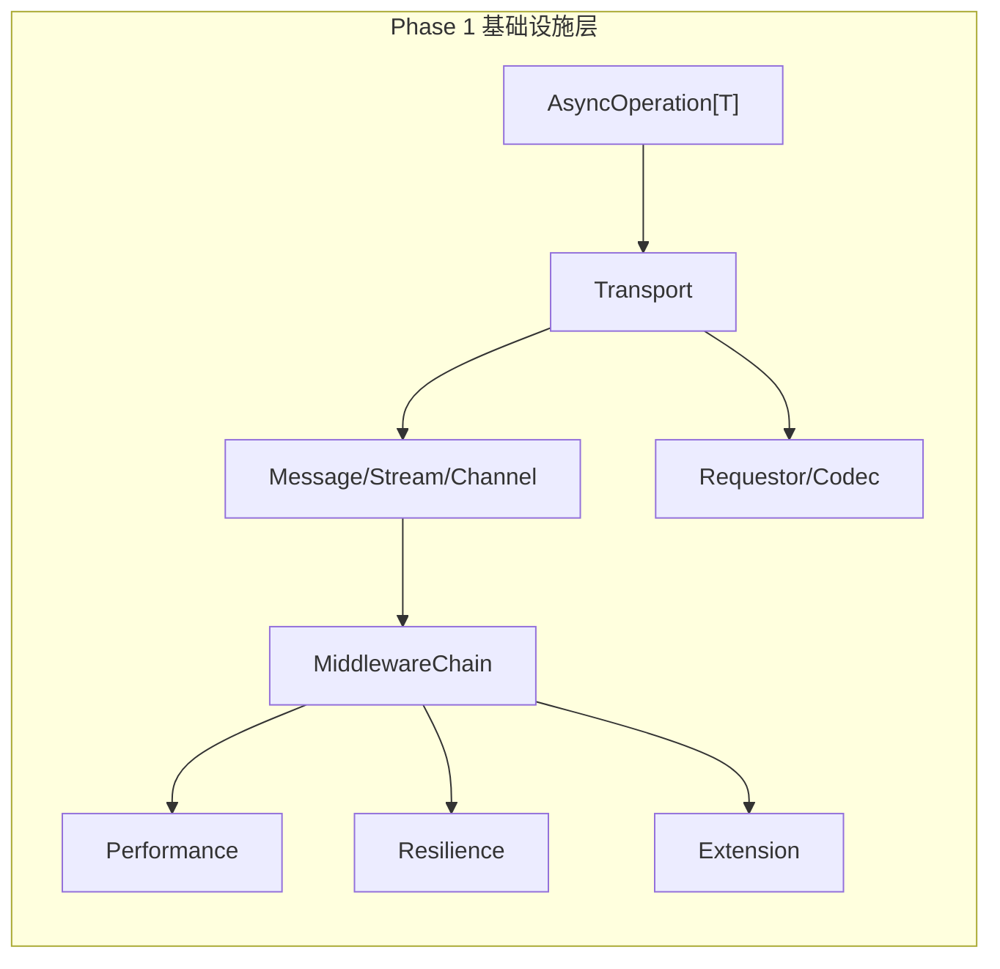
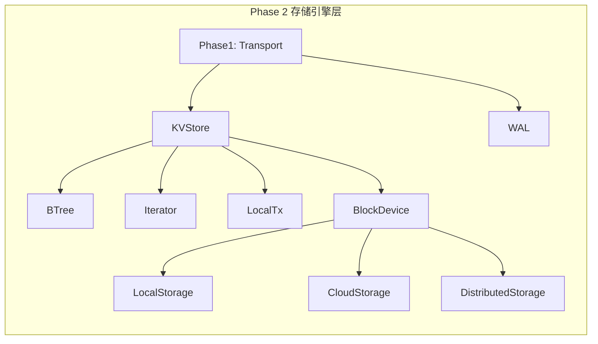
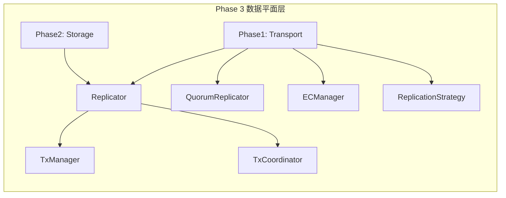
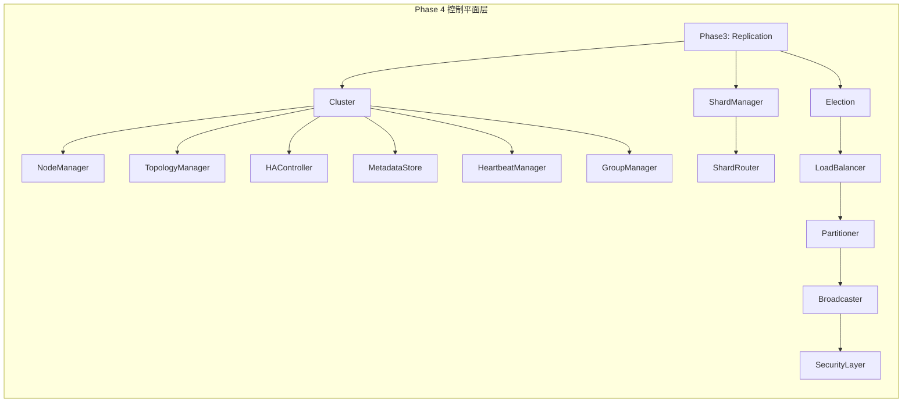
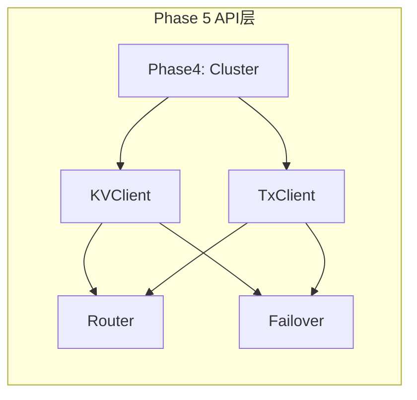

# NexKV DDD 实施路线图（增强版）

**文档版本**: v2.0 | **最后更新**: 2026-02-18
**基于**: spike-nexkv-ddd-interface.md v18.0 + spike-nexkv-ddd-implement.md v1.5
**总周期**: 约24周 | **接口总数**: 47个 | **实现文件数**: 89个

---

## 一，项目概览

### 1.1 项目目标

构建一个高性能、分布式、DDD架构的KV存储系统：
- 单机-分布式一体部署
- 47个统一接口
- 5层精简架构
- AsyncOperation[T] 精化异步接口

### 1.2 技术栈

| 组件 | 选型 | 说明 |
|------|------|------|
| **语言** | Go 1.21+ | 泛型支持、高性能并发 |
| **Transport** | libp2p | 去中心化、NAT穿透 |
| **KVStore** | Badger | 高写入吞吐、内置压缩 |
| **序列化** | MessagePack | 高性能、自描述 |
| **DI容器** | Wire | 编译时检查 |
| **日志** | Zap | 结构化日志 |

### 1.3 5层架构

| 层次 | 接口数 | 实现文件数 | 核心职责 |
|------|--------|-----------|----------|
| ① API层 | 2 | 8 | 对外 KV/Tx 接口 |
| ② 控制平面层 | 14 | 23 | 分片路由、选举、负载均衡 |
| ③ 数据平面层 | 6 | 20 | 复制、事务 |
| ④ 存储引擎层 | 9 | 19 | 单机 KV、WAL |
| ⑤ 基础设施层 | 16 | 16 | 网络通信、扩展能力 |
| **总计** | **47** | **89** | - |

---

## 二，实施阶段规划（自底向上）

### Phase 1: 基础设施层（4周）

**目标**: 构建底层基础设施，为上层提供网络通信、异步能力、扩展能力

**接口清单** (16个):
```
pkg/domain/service/transport.go      (6个) - Transport, Message, Stream, Channel, Requestor, Codec
pkg/domain/service/middleware.go    (2个) - Middleware, MiddlewareChain
pkg/domain/service/performance.go   (3个) - BatchReplicator, PipelineReplicator, CacheLayer
pkg/domain/service/resilience.go    (3个) - CircuitBreaker, RetryPolicy, ChaosMonkey
pkg/domain/service/extension.go      (2个) - Plugin, DynamicConfig
```

#### 依赖关系图



#### 每周任务分解

| 周次 | 任务 | 交付物 | 验收标准 |
|------|------|--------|----------|
| **Week 1** | AsyncOperation[T] 核心 + Transport 接口定义 | `domain/model/futures.go`, `domain/service/transport.go` | 接口定义通过评审 |
| **Week 2** | libp2p Transport 实现 + Codec 实现 | `infrastructure/transport/libp2p_*.go` | 单节点 ping/pong 正常 |
| **Week 3** | MiddlewareChain + 性能优化接口 | `infrastructure/transport/middleware_*.go` | 中间件链按序执行 |
| **Week 4** | 容错 + 扩展接口实现 | `infrastructure/resilience/*`, `infrastructure/extension/*` | 熔断/重试/插件加载正常 |

#### 详细文件清单

| 接口 | 包路径 | 实现文件 | 优先级 |
|------|--------|----------|--------|
| Transport | `infrastructure/transport` | `libp2p_transport_impl.go` | P0 |
| Message | `infrastructure/transport` | `message_impl.go` | P0 |
| Stream | `infrastructure/transport` | `stream_impl.go` | P0 |
| Channel | `infrastructure/transport` | `channel_impl.go` | P0 |
| Requestor | `infrastructure/transport` | `requestor_impl.go` | P0 |
| Codec | `infrastructure/transport` | `codec_impl.go` | P0 |
| Middleware | `infrastructure/transport` | `middleware_impl.go` | P1 |
| MiddlewareChain | `infrastructure/transport` | `middleware_impl.go` | P1 |
| BatchReplicator | `infrastructure/performance` | `batch_replicator_impl.go` | P2 |
| PipelineReplicator | `infrastructure/performance` | `pipeline_impl.go` | P2 |
| CacheLayer | `infrastructure/performance` | `cache_layer_impl.go` | P2 |
| CircuitBreaker | `infrastructure/resilience` | `circuit_breaker_impl.go` | P1 |
| RetryPolicy | `infrastructure/resilience` | `retry_policy_impl.go` | P1 |
| ChaosMonkey | `infrastructure/resilience` | `chaos_monkey_impl.go` | P2 |
| Plugin | `infrastructure/extension` | `plugin_impl.go` | P2 |
| DynamicConfig | `infrastructure/extension` | `dynamic_config_impl.go` | P2 |

#### 验收标准（可验证）

- [ ] `go build` 通过，无编译错误
- [ ] Transport 连接/断开/重连 单元测试通过
- [ ] AsyncOperation[T] 三种异步模式（AsyncOp/Callback/Channel）测试通过
- [ ] MiddlewareChain 按顺序执行测试通过
- [ ] CircuitBreaker 打开/关闭状态转换正常
- [ ] RetryPolicy 重试次数和退避时间正确
- [ ] 测试覆盖率 ≥ 80%

---

### Phase 2: 存储引擎层（6周）

**目标**: 实现单机 KV 存储，为分布式提供持久化能力

**接口清单** (9个):
```
pkg/domain/service/storage.go       (5个) - KVStore, WAL, BTree, Iterator, LocalTx
pkg/domain/service/blockdevice.go   (4个) - BlockDevice, LocalStorage, CloudStorage, DistributedStorage
```

#### 依赖关系图



#### 每周任务分解

| 周次 | 任务 | 交付物 | 验收标准 |
|------|------|--------|----------|
| **Week 5** | Badger KVStore 实现 | `infrastructure/storage/badger_store_impl.go` | Get/Put/Delete 正常 |
| **Week 6** | WAL 实现（同步模式） | `infrastructure/storage/wal_impl.go` | 写入和 Replay 正常 |
| **Week 7** | WAL 异步模式 + BTree | `infrastructure/storage/wal_impl.go`, `btree_impl.go` | 异步写入正常 |
| **Week 8** | Iterator + LocalTx | `infrastructure/storage/iterator_impl.go`, `local_tx_impl.go` | 范围查询正常 |
| **Week 9** | BlockDevice 抽象 + LocalStorage | `infrastructure/blockdevice/local_storage_impl.go` | 块读写 ≥50K ops/sec |
| **Week 10** | CloudStorage + DistributedStorage | `infrastructure/blockdevice/cloud_*.go` | 云存储上传/下载正常 |

#### 详细文件清单

| 接口 | 包路径 | 实现文件 | 优先级 | 依赖 |
|------|--------|----------|--------|------|
| KVStore | `infrastructure/storage` | `badger_store_impl.go` | P0 | Transport |
| WAL | `infrastructure/storage` | `wal_impl.go` | P0 | Transport |
| BTree | `infrastructure/storage` | `btree_impl.go` | P1 | - |
| Iterator | `infrastructure/storage` | `iterator_impl.go` | P1 | KVStore |
| LocalTx | `infrastructure/storage` | `local_tx_impl.go` | P1 | KVStore |
| BlockDevice | `infrastructure/blockdevice` | `block_device_impl.go` | P0 | - |
| LocalStorage | `infrastructure/blockdevice` | `local_storage_impl.go` | P0 | BlockDevice |
| CloudStorage | `infrastructure/blockdevice` | `cloud_storage_impl.go` | P2 | BlockDevice |
| DistributedStorage | `infrastructure/blockdevice` | `distributed_storage_impl.go` | P2 | BlockDevice, Phase3 |

#### 验收标准（可验证）

- [ ] 单节点 Get/Put/Delete 单元测试通过
- [ ] WAL 写入和 Replay 测试通过
- [ ] BTree 范围查询正确性测试通过
- [ ] LocalTx 事务原子性测试通过
- [ ] BlockDevice 读写性能 ≥ 50,000 ops/sec（基准测试）
- [ ] 云存储上传/下载功能正常（集成测试）
- [ ] 测试覆盖率 ≥ 80%

---

### Phase 3: 数据平面层（4周）

**目标**: 实现副本管理、事务一致性

**接口清单** (6个):
```
pkg/domain/service/replication.go    (4个) - Replicator, QuorumReplicator, ECManager, ReplicationStrategy
pkg/domain/service/tx.go            (2个) - TxManager, TxCoordinator
```

#### 依赖关系图



#### 每周任务分解

| 周次 | 任务 | 交付物 | 验收标准 |
|------|------|--------|----------|
| **Week 11** | Replicator 接口 + 基础实现 | `infrastructure/replication/replicator_impl.go` | 主从复制正常 |
| **Week 12** | QuorumReplicator 实现 | `infrastructure/replication/quorum.go` | 3副本写入多数派确认正常 |
| **Week 13** | EC 纠删码实现 | `infrastructure/replication/ec_strategy_impl.go` | EC 编码解码正确 |
| **Week 14** | TxManager + TxCoordinator | `infrastructure/tx/tx_manager_impl.go`, `tx_coordinator_impl.go` | 2PC 事务提交/回滚正常 |

#### 详细文件清单

| 接口 | 包路径 | 实现文件 | 优先级 | 依赖 |
|------|--------|----------|--------|------|
| Replicator | `infrastructure/replication` | `replicator_impl.go` | P0 | Transport, Storage |
| QuorumReplicator | `infrastructure/replication` | `quorum.go` | P0 | Replicator |
| ECManager | `infrastructure/replication` | `ec_manager_impl.go` | P1 | Replicator |
| ReplicationStrategy | `infrastructure/replication` | `replication_strategy_impl.go` | P1 | - |
| TxManager | `infrastructure/tx` | `tx_manager_impl.go` | P0 | Storage |
| TxCoordinator | `infrastructure/tx` | `tx_coordinator_impl.go` | P0 | Replicator |

#### 验收标准（可验证）

- [ ] 3副本 Quorum 写入多数派确认正常
- [ ] EC 编码/解码数据完整性验证通过
- [ ] 分布式事务 2PC 提交/回滚正常
- [ ] 主节点故障后从节点自动提升正常
- [ ] 测试覆盖率 ≥ 80%

---

### Phase 4: 控制平面层（4周）

**目标**: 实现集群管理、分片路由、负载均衡

**接口清单** (14个):
```
pkg/domain/service/cluster.go        (7个) - TreeCoordinator, NodeManager, TopologyManager, HAController, MetadataStore, HeartbeatManager, GroupManager
pkg/domain/service/shard.go         (2个) - ShardManager, ShardRouter
pkg/domain/service/partition.go    (1个) - Partitioner
pkg/domain/service/election.go      (1个) - Election
pkg/domain/service/balance.go      (1个) - LoadBalancer
pkg/domain/service/broadcast.go    (1个) - Broadcaster
pkg/domain/service/security.go     (1个) - SecurityLayer
```

#### 依赖关系图



#### 每周任务分解

| 周次 | 任务 | 交付物 | 验收标准 |
|------|------|--------|----------|
| **Week 15** | Cluster 核心（TreeCoordinator, NodeManager, Topology） | `infrastructure/cluster/tree_coordinator_impl.go`, `node_manager_impl.go` | 3节点集群通信正常 |
| **Week 16** | HA + Metadata + Heartbeat | `infrastructure/cluster/ha_controller_impl.go`, `metadata_store_impl.go` | 故障检测和主备切换正常 |
| **Week 17** | ShardManager + ShardRouter | `infrastructure/shard/shard_manager_impl.go`, `shard_router_impl.go` | 分片路由正确 |
| **Week 18** | Election + LoadBalancer + Broadcaster + Security | `infrastructure/cluster/election_impl.go`, `loadbalancer_impl.go` | 选举和负载均衡正常 |

#### 详细文件清单

| 接口 | 包路径 | 实现文件 | 优先级 | 依赖 |
|------|--------|----------|--------|------|
| TreeCoordinator | `infrastructure/cluster` | `tree_coordinator_impl.go` | P0 | Phase1-3 |
| NodeManager | `infrastructure/cluster` | `node_manager_impl.go` | P0 | Transport |
| TopologyManager | `infrastructure/cluster` | `topology_impl.go` | P0 | NodeManager |
| HAController | `infrastructure/cluster` | `ha_controller_impl.go` | P0 | Replication |
| MetadataStore | `infrastructure/cluster` | `metadata_store_impl.go` | P0 | Storage |
| HeartbeatManager | `infrastructure/cluster` | `heartbeat_impl.go` | P0 | Transport |
| GroupManager | `infrastructure/cluster` | `group_manager_impl.go` | P1 | TopologyManager |
| ShardManager | `infrastructure/shard` | `shard_manager_impl.go` | P0 | Replication |
| ShardRouter | `infrastructure/shard` | `shard_router_impl.go` | P0 | ShardManager |
| Partitioner | `infrastructure/shard` | `partitioner_impl.go` | P1 | ShardRouter |
| Election | `infrastructure/cluster` | `election_impl.go` | P0 | Replication |
| LoadBalancer | `infrastructure/cluster` | `loadbalancer_impl.go` | P1 | ShardRouter |
| Broadcaster | `infrastructure/cluster` | `broadcaster_impl.go` | P1 | Transport |
| SecurityLayer | `infrastructure/transport` | `security_layer_impl.go` | P2 | Transport |

#### 验收标准（可验证）

- [ ] 3节点集群发现和通信正常
- [ ] 节点故障检测时间 < 5秒
- [ ] 主备切换 RTO < 30秒
- [ ] 分片迁移无数据丢失（双写验证）
- [ ] 选举Leader正确性测试通过
- [ ] 负载均衡策略正确执行
- [ ] 测试覆盖率 ≥ 80%

---

### Phase 5: API层（2周）

**目标**: 实现对外客户端接口

**接口清单** (2个):
```
pkg/domain/service/client.go       (2个) - KVClient, TxClient
```

#### 依赖关系图



#### 每周任务分解

| 周次 | 任务 | 交付物 | 验收标准 |
|------|------|--------|----------|
| **Week 19** | KVClient 实现 + Router | `infrastructure/client/kv_client_impl.go`, `router.go` | 自动路由正确 |
| **Week 20** | TxClient + Failover | `infrastructure/client/client_tx_impl.go`, `failover.go` | 故障转移正常 |

#### 详细文件清单

| 接口 | 包路径 | 实现文件 | 优先级 | 依赖 |
|------|--------|----------|--------|------|
| KVClient | `infrastructure/client` | `kv_client_impl.go` | P0 | Cluster, Shard |
| TxClient | `infrastructure/client` | `client_tx_impl.go` | P0 | KVClient, TxManager |
| ClientFuture | `infrastructure/client` | `client_future_impl.go` | P1 | AsyncOperation[T] |
| Router | `infrastructure/client` | `router.go` | P0 | ShardRouter |
| Failover | `infrastructure/client` | `failover.go` | P0 | HAController |

#### 验收标准（可验证）

- [ ] KVClient 自动路由到正确分片
- [ ] 节点故障后自动Failover
- [ ] 客户端重试策略正确执行
- [ ] HTTP/gRPC 适配器正常工作
- [ ] 测试覆盖率 ≥ 80%

---

### Phase 6: 集成测试与优化（4周）

**目标**: 端到端集成测试，性能优化

#### 每周任务分解

| 周次 | 任务 | 交付物 | 验收标准 |
|------|------|--------|----------|
| **Week 21** | 集成测试框架搭建 | 测试用例套件 | 1000+并发测试用例通过 |
| **Week 22** | 混沌测试 | 故障注入测试 | 随机杀节点/网络分区测试通过 |
| **Week 23** | 性能调优 | 优化报告 | 达到性能目标 |
| **Week 24** | 最终验收 | 验收报告 | 所有验收标准通过 |

#### 性能目标

| 指标 | 目标值 | 验证方法 |
|------|--------|----------|
| 单节点写入 | ≥ 50,000 ops/sec | 基准测试 |
| 单节点读取 | ≥ 100,000 ops/sec | 基准测试 |
| 集群吞吐 | ≥ 500,000 ops/sec | 集成测试 |
| 延迟 P99 | < 10ms | 集成测试 |
| 故障转移 RTO | < 30秒 | 混沌测试 |

---

## 三、里程碑时间表

| 里程碑 | 时间 | 关键成果 | 可验证标准 |
|--------|------|----------|------------|
| **M1** | 第4周 | 基础设施层完成 | 16个接口单元测试通过 |
| **M2** | 第10周 | 存储引擎层完成 | 单节点 KV 性能达标 |
| **M3** | 第14周 | 数据平面层完成 | 3副本写入正常 |
| **M4** | 第18周 | 控制平面层完成 | 3节点集群运行正常 |
| **M5** | 第20周 | API层完成 | 客户端路由和故障转移正常 |
| **M6** | 第24周 | 集成测试与优化完成 | 所有性能目标达成 |

---

## 四、依赖矩阵

### 接口间依赖关系

```
Phase 1 (基础设施层)
├── Transport ← AsyncOperation[T]
├── Message ← Transport
├── Stream ← Transport
├── Channel ← Transport
├── Requestor ← Transport, Codec
├── Codec ← (无依赖)
├── MiddlewareChain ← Middleware
├── BatchReplicator ← Transport
├── PipelineReplicator ← Transport
├── CacheLayer ← (无依赖)
├── CircuitBreaker ← Transport
├── RetryPolicy ← (无依赖)
├── ChaosMonkey ← (无依赖)
├── Plugin ← (无依赖)
└── DynamicConfig ← (无依赖)

Phase 2 (存储引擎层) ← Phase 1
├── KVStore ← Transport
├── WAL ← Transport
├── BTree ← (无依赖)
├── Iterator ← KVStore
├── LocalTx ← KVStore
├── BlockDevice ← (无依赖)
├── LocalStorage ← BlockDevice
├── CloudStorage ← BlockDevice
└── DistributedStorage ← BlockDevice, Phase3

Phase 3 (数据平面层) ← Phase 1, Phase 2
├── Replicator ← Transport, Storage
├── QuorumReplicator ← Replicator
├── ECManager ← Replicator
├── ReplicationStrategy ← (无依赖)
├── TxManager ← Storage
└── TxCoordinator ← Replicator

Phase 4 (控制平面层) ← Phase 1-3
├── TreeCoordinator ← Phase1-3
├── NodeManager ← Transport
├── TopologyManager ← NodeManager
├── HAController ← Replication
├── MetadataStore ← Storage
├── HeartbeatManager ← Transport
├── GroupManager ← TopologyManager
├── ShardManager ← Replication
├── ShardRouter ← ShardManager
├── Partitioner ← ShardRouter
├── Election ← Replication
├── LoadBalancer ← ShardRouter
├── Broadcaster ← Transport
└── SecurityLayer ← Transport

Phase 5 (API层) ← Phase 1-4
├── KVClient ← Cluster, Shard
└── TxClient ← KVClient, TxManager
```

---

## 五、风险与缓解

| 风险 | 影响 | 缓解措施 | 验证方法 |
|------|------|----------|----------|
| AsyncOperation[T] 实现复杂 | 高 | 参考 v18.0 精化接口，分周交付 | 每周单元测试验证 |
| 分布式事务性能瓶颈 | 高 | 2PC 优化，减少锁持有时间 | P99 < 10ms 基准测试 |
| 分片迁移数据丢失 | 高 | 双写机制确保一致性 | 混沌测试验证 |
| 网络分区导致脑裂 | 高 | Quorum 机制确保多数派 | 故障注入测试 |
| 跨层依赖难以并行 | 中 | 依赖矩阵清晰，关键路径优先 | 每周集成测试 |

---

## 六、质量保证

### 测试覆盖率要求

| 测试类型 | 覆盖率要求 | 验证命令 |
|---------|-----------|----------|
| 单元测试 | ≥ 80% | `go test -cover` |
| 集成测试 | 每 Phase 有验证目标 | `make integration-test` |
| E2E测试 | 覆盖所有关键用户流程 | `make e2e-test` |

### 提交前检查

```bash
make build && make lint && make test && make fmt && make clean
```

---

## 七、v18.0 AsyncOperation[T] 精化接口要点

### 7.1 核心变更

| 变更 | 改进前 | 改进后 | 重要性 |
|------|--------|--------|--------|
| 取消语义 | Cancel() error | Cancel() (canceled bool, err error) | P0 |
| 状态查询 | IsDone() (bool, error) | Status() OperationStatus | P0 |
| 回调安全 | 直接调用 | safeCallback() + recover() | P0 |
| 错误定义 | 无 | ErrCanceled / ErrTimeout / ErrCompleted | P1 |

### 7.2 OperationStatus 枚举

- **StatusPending** - 进行中
- **StatusCompleted** - 成功完成
- **StatusFailed** - 失败
- **StatusCanceled** - 被取消
- **StatusTimeout** - 超时

---

## 八、总结

- **47个接口** 完整定义
- **89个实现文件** 明确分配
- **5层精简架构** 自底向上实施
- **24周实施周期** → 细化到每周任务
- **v18.0 AsyncOperation[T]** 精化接口
- **可验证的验收标准** 每个 Phase 明确
- **80%+ 测试覆盖率** 质量目标

---

**维护者**: NexKV 开发团队
